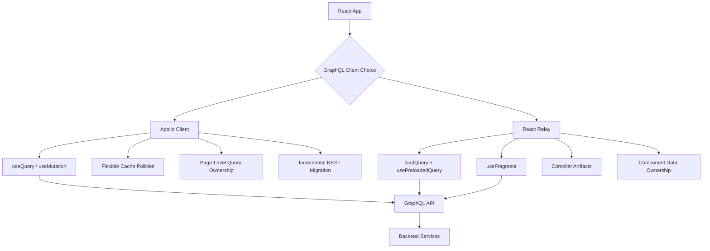

# Apollo Client vs React Relay: Staff Frontend Decision Guide

## Executive Summary

Apollo Client and React Relay are both React GraphQL clients, but they optimize for different engineering cultures.

**Apollo Client** optimizes for flexibility, incremental adoption, and developer speed.

**React Relay** optimizes for correctness at scale, component-level data ownership, compiler-enforced contracts, and large React applications maintained by many teams.

A simple staff-level rule:

> Choose **Apollo** when the team needs fast adoption and flexibility. Choose **Relay** when the frontend is large, deeply componentized, and needs strict data ownership and performance discipline.

---

## Mental Model

| Area | Apollo Client | React Relay |
|---|---|---|
| Best for | Flexible GraphQL adoption | Large React apps with strict data contracts |
| Learning curve | Easier | Steeper |
| Data fetching style | Component calls `useQuery` or `useMutation` | Route/query preloads data; child components read fragments |
| Fragment discipline | Supported, but usually team-enforced | Core architecture pattern |
| Compiler | Optional with external codegen | Required core workflow |
| Cache | Normalized cache with configurable policies | Normalized Relay Store with compiler-generated artifacts |
| Pagination | Flexible, often configured with field policies | Strong built-in connection model |
| Type safety | Good with GraphQL codegen | Very strong with Relay compiler artifacts |
| Best team shape | Startup, mixed maturity, incremental migration | Large org, many teams, many shared surfaces |
| Main risk | Query sprawl and inconsistent cache policy | More boilerplate and stricter conventions |

---

## Staff-Level Framing

As a staff frontend engineer, I would not choose Apollo or Relay based only on popularity. I would choose based on the **frontend ownership model**.

If the application is smaller, the team needs quick delivery, and we are migrating gradually from REST, I would choose **Apollo Client**. Apollo gives us GraphQL benefits without forcing the entire frontend architecture to change immediately.

If we are building a large, deeply nested, multi-team React application, I would choose **Relay**. Relay gives stronger guarantees around colocated data dependencies, generated types, normalized cache consistency, and route-level preloading.

The key difference:

> Apollo gives flexibility. Relay gives architectural discipline.

---

## When to Choose Apollo Client

Choose **Apollo Client** when the team needs speed, flexibility, and lower adoption cost.

Apollo is a good fit when:

- You are migrating from REST to GraphQL gradually.
- Your app has moderate complexity.
- You want GraphQL but do not want to restructure the frontend around fragments.
- You need flexible cache customization.
- You have many independent product pages rather than one deeply composed application shell.
- Your team is newer to GraphQL.
- You want faster onboarding and fewer required conventions.

### Apollo Example

```tsx
import { gql, useQuery } from "@apollo/client";

const GET_DASHBOARD = gql`
  query GetDashboard($id: ID!) {
    user(id: $id) {
      id
      name
      avatarUrl
      team {
        id
        name
      }
    }
  }
`;

export function Dashboard({ id }: { id: string }) {
  const { data, loading, error } = useQuery(GET_DASHBOARD, {
    variables: { id },
    fetchPolicy: "cache-and-network",
  });

  if (loading) return <div>Loading...</div>;
  if (error) return <div>Something went wrong.</div>;

  return <h1>{data.user.name}</h1>;
}
```

Apollo is easier to explain:

> This component runs this query and renders the result.

That simplicity is powerful for smaller teams and incremental migration.

---

## When to Choose React Relay

Choose **React Relay** when frontend scale and long-term maintainability matter more than initial simplicity.

Relay is a good fit when:

- The app is large and deeply nested.
- Many teams contribute to the same product surface.
- Component ownership matters.
- You want each component to declare its own data dependency.
- You care deeply about avoiding over-fetching, under-fetching, and query drift.
- You can invest in schema quality, compiler setup, and conventions.
- You use route-level preloading to avoid render-time waterfalls.
- Your backend schema can support Relay-friendly patterns such as stable IDs, connections, and node interfaces.

### Relay Example

```tsx
// Route level
const queryRef = loadQuery(environment, UserProfileQuery, { id });

function UserProfileRoute() {
  return <UserProfile queryRef={queryRef} />;
}

function UserProfile({ queryRef }) {
  const data = usePreloadedQuery(UserProfileQuery, queryRef);

  return <UserHeader user={data.user} />;
}

function UserHeader({ user }) {
  const data = useFragment(UserHeader_user, user);

  return <h1>{data.name}</h1>;
}
```

Relay’s strength is that `UserHeader` owns its fragment. The parent component does not need to know every field the child requires. Relay’s compiler stitches fragments into full queries, which helps large teams avoid accidental coupling.

---

## The Most Important Architectural Difference

Apollo often starts from the **screen query**.

```graphql
query DashboardQuery($id: ID!) {
  user(id: $id) {
    id
    name
    avatarUrl
    team {
      id
      name
    }
  }
}
```

Relay starts from **component data ownership**.

```graphql
fragment UserHeader_user on User {
  id
  name
  avatarUrl
}
```

Then the route query composes the fragments.

```graphql
query DashboardQuery($id: ID!) {
  user(id: $id) {
    ...UserHeader_user
    ...TeamCard_user
  }
}
```

This matters at scale.

In Apollo, teams can use fragments, but the discipline is often social and code-review based.

In Relay, the compiler makes fragment colocation part of the engineering system.

---

## Hook Comparison

| Need | Apollo Approach | Relay Approach |
|---|---|---|
| Fetch data in component | `useQuery` | `useLazyLoadQuery`, but avoid for critical paths |
| Fetch before render | Apollo prefetch/query client patterns | `loadQuery` + `usePreloadedQuery` |
| Child component data | Pass props or use fragments manually | `useFragment` |
| Avoid data waterfalls | Manual discipline | Preloaded queries + fragment composition |
| Cache updates | `cache.modify`, field policies, refetch | Relay store updater, connections, invalidation |
| Pagination | Field policy / `fetchMore` | Connections |
| Error handling | `error`, `errorPolicy`, object-level errors | Error boundaries, GraphQL errors, object-level error unions |

---

## Apollo Pros

- Easier to learn.
- Faster to adopt.
- Flexible cache policies.
- Works well with many backend GraphQL styles.
- Good for mixed REST and GraphQL migration.
- Less opinionated about app architecture.
- Strong ecosystem and documentation.
- Good for admin tools, dashboards, internal tools, and independent product pages.

---

## Apollo Cons

- Easier to create inconsistent query patterns.
- Fragment colocation is optional, so teams may drift.
- Cache updates can become complex as the app grows.
- More runtime discipline is required to avoid over-fetching and duplicate queries.
- Without strong conventions, the app can accumulate large page-level queries.
- Parent components may become tightly coupled to child component data needs.

---

## Relay Pros

- Excellent for large React apps.
- Strong fragment colocation.
- Compiler catches many issues early.
- Better default discipline around data dependencies.
- Strong route preloading model.
- Designed to avoid data-fetch waterfalls when used correctly.
- Generated artifacts improve type safety and maintainability.
- Works well when multiple teams own different components on the same page.

---

## Relay Cons

- Higher learning curve.
- More setup and generated artifacts.
- Backend schema often needs to follow Relay-friendly patterns.
- More opinionated, which can feel heavy for small apps.
- Harder to adopt casually if the organization is not ready for the conventions.
- Requires buy-in from frontend, backend, tooling, and platform teams.

---

## Decision Matrix

| Scenario | Recommended Choice | Why |
|---|---|---|
| Startup or prototype | Apollo | Fastest path to GraphQL adoption |
| Internal dashboard | Apollo | Flexible and simple enough |
| Gradual REST migration | Apollo | Easy to introduce page by page |
| Large consumer product | Relay | Better long-term component data ownership |
| Many teams on same React surface | Relay | Compiler and fragments reduce coupling |
| Complex nested UI | Relay | Child components can own fragments |
| Strong route-level preloading requirement | Relay | Built around preloaded queries |
| Team unfamiliar with GraphQL | Apollo first | Lower learning curve |
| Strict schema and platform investment available | Relay | Higher setup cost but stronger guarantees |

---

## Architecture Diagram



---

## Staff Frontend Leadership Story

### Situation

Our frontend had multiple product surfaces consuming backend data through REST APIs. Over time, each page had slightly different data needs, and frontend teams started adding new endpoints or expanding existing responses for small UI changes.

This created several problems:

- Over-fetching on some pages.
- Under-fetching on others.
- Duplicate API shapes for similar entities.
- Parent components knowing too much about child component data needs.
- Slower frontend iteration because backend API contracts had to change frequently.

As a staff frontend engineer, I wanted to move the team toward a GraphQL ecosystem that improved frontend velocity without creating long-term cache and query complexity.

---

### Task

My goal was not simply to introduce GraphQL. The goal was to define the right GraphQL client model for the team.

I needed to answer:

- Do we need flexibility or stronger conventions?
- Are our pages mostly independent, or are they deeply composed?
- Who owns the data dependency: the page or the component?
- How do we avoid render-time waterfalls?
- How do we keep cache updates predictable?
- How much compiler/tooling investment can the team support?

---

### Action

I evaluated Apollo and Relay using product complexity, team maturity, schema quality, and long-term ownership.

For smaller surfaces and incremental migration, I recommended Apollo because the team could adopt it quickly with `useQuery`, `useMutation`, and configurable cache policies.

For larger shared surfaces, I recommended Relay because it gave us colocated fragments, generated artifacts, preloaded queries, and a stronger model for component-owned data.

I also created engineering guidelines:

1. Use **Apollo** for simple, independent pages or gradual migration from REST.
2. Use **Relay** for deeply nested product surfaces owned by many teams.
3. Avoid render-time query waterfalls by preloading route-critical data.
4. Prefer component-level fragments for reusable UI components.
5. Use object-level GraphQL errors for expected business failures.
6. Use top-level GraphQL errors or error boundaries for infrastructure failures.
7. Define cache update patterns before broad rollout.

---

### Result

The decision became less about personal preference and more about architectural fit.

Teams building small dashboards could move faster with Apollo. Teams building large shared product experiences could use Relay to preserve component ownership and performance discipline.

The bigger leadership outcome was that we turned a tool choice into an engineering framework:

> Apollo for adoption speed. Relay for correctness at scale.

---

## Error Handling Comparison

GraphQL error handling should distinguish between **system errors** and **business errors**.

### Top-Level GraphQL Error

Use top-level GraphQL errors for unexpected failures:

- Service unavailable.
- Auth failure.
- Timeout.
- Resolver exception.
- Invalid query.

Example response:

```json
{
  "data": null,
  "errors": [
    {
      "message": "Service unavailable",
      "path": ["user"]
    }
  ]
}
```

### Object-Level Error Pattern

Use object-level error results for expected product failures:

- Permission denied for a specific object.
- Validation failure.
- Not enough quota.
- Entity not found in a recoverable way.
- Partial success.

Example schema:

```graphql
union UpdateProfileResult = UpdateProfileSuccess | ValidationError | PermissionDeniedError

type UpdateProfileSuccess {
  user: User!
}

type ValidationError {
  message: String!
  field: String
}

type PermissionDeniedError {
  message: String!
  reason: String!
}
```

Example query:

```graphql
mutation UpdateProfile($input: UpdateProfileInput!) {
  updateProfile(input: $input) {
    __typename
    ... on UpdateProfileSuccess {
      user {
        id
        name
      }
    }
    ... on ValidationError {
      message
      field
    }
    ... on PermissionDeniedError {
      message
      reason
    }
  }
}
```

This pattern is useful because expected business failures become typed data instead of unpredictable thrown exceptions.

---

## GraphQL vs REST: Staff-Level Tradeoff

| Area | GraphQL | REST |
|---|---|---|
| Data shape | Client selects fields | Server defines response shape |
| Over-fetching | Reduced | Common unless endpoint is specialized |
| Under-fetching | Reduced | Common when UI needs multiple resources |
| Caching | More complex | Simpler HTTP caching model |
| Tooling | Schema, codegen, clients, validation | Mature and simple |
| Learning curve | Higher | Lower |
| Multi-team frontend | Strong with fragments and schema discipline | Can lead to endpoint sprawl |
| Backend complexity | Higher resolver/schema complexity | Simpler service ownership |
| Best use case | Complex product UI with varied data needs | Resource-oriented APIs and simple CRUD |

---

## When REST Is Still Better

REST may still be the better choice when:

- The resource shape is simple and stable.
- HTTP caching is critical and straightforward.
- The API is public and needs broad compatibility.
- The team does not need nested client-selected data.
- The product is mostly CRUD.
- Backend ownership is service-oriented and simple endpoint boundaries matter.

GraphQL is powerful, but it is not automatically better. It adds schema, resolver, caching, authorization, and observability complexity.

---

## Staff-Level Recommendation

Use this answer in an interview:

> I would choose Apollo when the team needs flexibility, quick adoption, and incremental migration from REST. Apollo works well when pages own their queries and the frontend is not deeply composed across many teams.
>
> I would choose Relay when the application is large, deeply nested, and maintained by many teams. Relay’s colocated fragments and compiler-generated artifacts make data dependencies explicit and reduce accidental coupling between parent and child components. Relay also encourages route-level preloading, which helps avoid render-time data waterfalls.
>
> My rule is: Apollo optimizes for flexibility and adoption speed. Relay optimizes for correctness, type safety, and frontend scale.

---

## Code Review Checklist

When reviewing Apollo or Relay usage, ask:

- Is the query owned at the right level?
- Are child component data dependencies colocated?
- Could this create a render-time waterfall?
- Is the cache update predictable?
- Are expected business errors modeled as typed data?
- Are infrastructure errors handled by error boundaries or top-level error handling?
- Are fragments reused intentionally, not accidentally?
- Is the API over-fetching or under-fetching?
- Does the schema support frontend composition?
- Will this pattern scale to multiple teams?

---

## Final Takeaway

Apollo and Relay are not interchangeable choices. They represent two different frontend architecture philosophies.

**Apollo** is best when the organization values flexibility, speed, and incremental adoption.

**Relay** is best when the organization values strict data ownership, compiler guarantees, performance discipline, and multi-team scale.

For a staff frontend engineer, the most important skill is not memorizing APIs. It is choosing the client that matches the team’s scale, schema maturity, product complexity, and ownership model.
