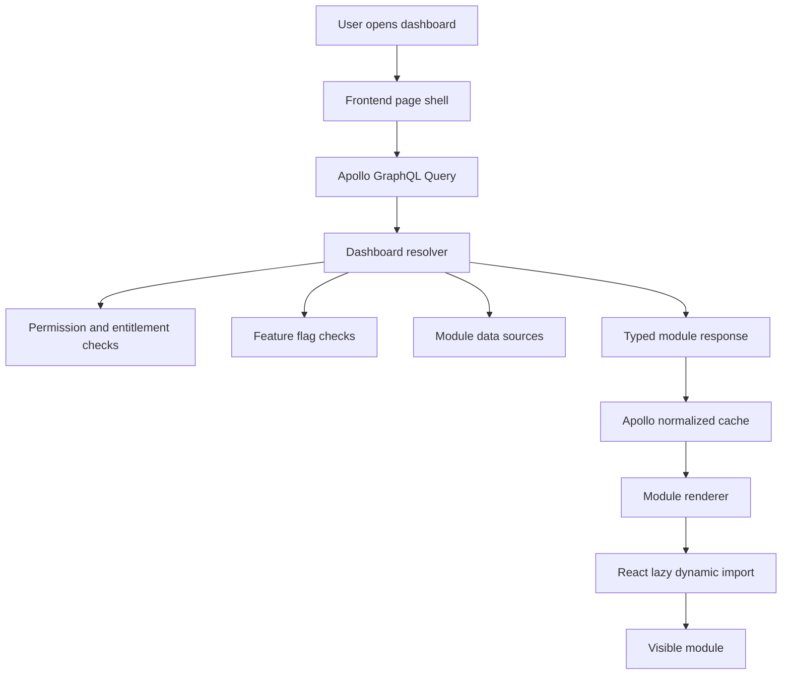

# Staff Frontend Leadership Story: GraphQL Directives and Conditional Module Loading

> **Interview framing:** This story explains how a Staff Frontend Engineer can lead a GraphQL-based frontend architecture where pages conditionally fetch data and conditionally load UI modules using GraphQL directives, Apollo Client, typed schema contracts, and safe backend resolver design.

## 1. Two-Minute Leadership Story

In one of our product surfaces, the frontend had become slow and difficult to evolve because every page loaded the same large REST payload regardless of what the user could actually see. The page had multiple modules: hero summary, recommendations, compliance panel, experiment-driven banners, admin-only controls, and rich analytics cards. Different users, permissions, experiments, and viewport states required different combinations of those modules.

As the Staff Frontend Engineer, I led the team toward a GraphQL-driven module-loading model. Instead of thinking of the page as one large endpoint response, we modeled the page as a composition of typed modules. The frontend asked for only the modules that were eligible for the current viewer and only the fields needed by those modules. We used GraphQL executable directives such as `@include(if: ...)` and `@skip(if: ...)` to conditionally fetch expensive module data. On the client, Apollo variables controlled which fragments were included. On the frontend runtime, React lazy loading and dynamic imports ensured that the component bundle was also loaded only when the module was present.

The leadership challenge was not just writing a clever query. It was creating a contract between product, frontend, backend, infra, and design. We had to define which conditions belonged in the backend versus frontend, how errors were represented, how modules degraded safely, and how to prevent every team from inventing their own conditional-fetch pattern.

The result was a cleaner platform pattern: backend decides eligibility and returns typed module descriptors; frontend uses GraphQL directives for conditional field selection; Apollo handles normalized cache and fetch orchestration; React code-splitting loads the matching component only when needed. This reduced over-fetching, improved page load time, gave product teams a safer experimentation model, and made the UI easier to scale across teams.

---

## 2. Situation, Task, Action, Result

### Situation

The original frontend depended on REST endpoints that returned a broad page payload:

```ts
GET /api/dashboard/:id
```

That response included every possible module, even if the viewer did not have access to most of them. The frontend then filtered modules in React.

This created several problems:

1. **Over-fetching:** expensive nested data was fetched even when the module was hidden.
2. **Bundle bloat:** all module components were imported into the initial page bundle.
3. **Permission leakage risk:** backend returned data that the UI later hid.
4. **Slow experimentation:** every A/B module required endpoint changes or frontend condition spaghetti.
5. **Poor ownership:** no clear boundary between backend eligibility, frontend rendering, and product configuration.

### Task

As Staff Frontend Engineer, my goal was to design a scalable pattern for conditional modules:

- Fetch only the data needed for the modules that can render.
- Load only the frontend code needed for those modules.
- Keep authorization and eligibility enforced server-side.
- Make the query readable and reusable across teams.
- Support experiments, permissions, and progressive rollout.
- Preserve GraphQL type safety and Apollo cache behavior.

### Action

I introduced a **GraphQL module contract**:

1. The backend exposes a `dashboardModules` field.
2. Each module has a stable `id`, `kind`, and typed payload.
3. The backend resolver determines eligibility using permission, feature flag, and product rules.
4. The frontend query uses `@include(if: ...)` and `@skip(if: ...)` to avoid fetching expensive optional fields.
5. The frontend maps `module.kind` to a lazily loaded React component.
6. Shared lint rules and examples define when to use directives versus separate queries.

### Result

This created a standard frontend GraphQL ecosystem pattern:

- Smaller network payloads.
- Smaller initial JavaScript bundle.
- Safer permission boundaries.
- Faster product experimentation.
- Reusable module fragments.
- Clear backend/frontend ownership.
- Easier performance debugging because every optional module had an explicit fetch condition.

---

## 3. Important GraphQL Directive Concepts

GraphQL directives are annotations that modify query or schema behavior. The GraphQL specification includes built-in executable directives such as `@include` and `@skip`. These apply to fields, fragment spreads, and inline fragments.

```graphql
@include(if: Boolean!)
@skip(if: Boolean!)
```

### Important clarification: there is no built-in `@if`

In standard GraphQL, the directive is not written as `@if`. The `if` is an argument to directives such as `@include` and `@skip`:

```graphql
field @include(if: $condition)
field @skip(if: $condition)
```

Some organizations create custom directives that look like `@feature`, `@auth`, or `@requiresRole`, but `@if` is not a built-in GraphQL directive.

---

## 4. When to Use `@include` vs `@skip`

| Directive | Meaning | Best Use Case |
|---|---|---|
| `@include(if: $condition)` | Fetch this field only when condition is true | Optional module, expanded panel, experiment-enabled field |
| `@skip(if: $condition)` | Do not fetch this field when condition is true | Hide expensive fields, skip legacy path, suppress debug data |

### Staff-level rule of thumb

Use `@include` when the default state is **not loaded** and you opt into extra data.

Use `@skip` when the default state is **loaded** and you need to suppress a field under specific conditions.

For most frontend module loading, I prefer `@include` because it makes optional cost explicit:

```graphql
expensiveAnalytics @include(if: $loadAnalytics) {
  ...AnalyticsModule_data
}
```

---

## 5. Frontend Query Syntax with Apollo Client

### Example: Conditional module fields

```tsx
import { gql, useQuery } from "@apollo/client";

const DASHBOARD_QUERY = gql`
  query DashboardQuery(
    $dashboardId: ID!
    $loadRecommendations: Boolean!
    $loadCompliance: Boolean!
    $loadAnalytics: Boolean!
  ) {
    dashboard(id: $dashboardId) {
      id
      title

      modules {
        id
        kind
        title

        ...RecommendationModule_data @include(if: $loadRecommendations)
        ...ComplianceModule_data @include(if: $loadCompliance)
        ...AnalyticsModule_data @include(if: $loadAnalytics)
      }
    }
  }

  fragment RecommendationModule_data on RecommendationModule {
    recommendations {
      id
      title
      score
    }
  }

  fragment ComplianceModule_data on ComplianceModule {
    status
    violations {
      code
      message
      severity
    }
  }

  fragment AnalyticsModule_data on AnalyticsModule {
    chartType
    series {
      label
      points {
        x
        y
      }
    }
  }
`;

export function DashboardPage({ dashboardId }: { dashboardId: string }) {
  const shouldLoadRecommendations = true;
  const shouldLoadCompliance = false;
  const shouldLoadAnalytics = true;

  const { data, loading, error } = useQuery(DASHBOARD_QUERY, {
    variables: {
      dashboardId,
      loadRecommendations: shouldLoadRecommendations,
      loadCompliance: shouldLoadCompliance,
      loadAnalytics: shouldLoadAnalytics,
    },
    errorPolicy: "all",
  });

  if (loading) return <DashboardSkeleton />;
  if (error && !data) return <FullPageError error={error} />;

  return <Dashboard modules={data?.dashboard?.modules ?? []} />;
}
```

### Why `errorPolicy: "all"` matters

For module-based pages, partial data is often better than a blank page. Apollo's `errorPolicy: "all"` allows the UI to receive partial `data` together with GraphQL errors. Then the page can render healthy modules and show an inline error for failed modules.

---

## 6. Conditional Component Module Loading

GraphQL directives reduce data cost. React dynamic imports reduce JavaScript bundle cost. The strongest pattern combines both.

```tsx
import React, { lazy, Suspense } from "react";

const RecommendationModule = lazy(() => import("./modules/RecommendationModule"));
const ComplianceModule = lazy(() => import("./modules/ComplianceModule"));
const AnalyticsModule = lazy(() => import("./modules/AnalyticsModule"));

const MODULE_COMPONENTS = {
  RECOMMENDATION: RecommendationModule,
  COMPLIANCE: ComplianceModule,
  ANALYTICS: AnalyticsModule,
} as const;

type DashboardModule = {
  id: string;
  kind: keyof typeof MODULE_COMPONENTS;
  title: string;
};

export function DashboardModuleRenderer({ module }: { module: DashboardModule }) {
  const Component = MODULE_COMPONENTS[module.kind];

  if (!Component) {
    return <UnsupportedModule kind={module.kind} />;
  }

  return (
    <Suspense fallback={<ModuleSkeleton title={module.title} />}>
      <Component module={module} />
    </Suspense>
  );
}
```

### Important distinction

GraphQL does **not** load React components. GraphQL decides what data is returned. React, bundler configuration, and dynamic imports decide what code is loaded.

The architecture works because the backend returns a typed module descriptor and the frontend uses that descriptor to choose the component module.

---

## 7. Better Staff-Level Pattern: Backend Eligibility + Frontend Fetch Intent

Do not let the frontend be the only place deciding what the user is allowed to see.

A safer model is:

1. Backend determines which modules are eligible.
2. Frontend determines which eligible modules are worth fetching now.
3. GraphQL directives conditionally include optional fields.
4. React dynamically loads the UI component.



---

## 8. Backend GraphQL Schema Definition

### Schema-first SDL example

```graphql
interface DashboardModule {
  id: ID!
  kind: DashboardModuleKind!
  title: String!
}

enum DashboardModuleKind {
  RECOMMENDATION
  COMPLIANCE
  ANALYTICS
}

type RecommendationModule implements DashboardModule {
  id: ID!
  kind: DashboardModuleKind!
  title: String!
  recommendations: [Recommendation!]!
}

type ComplianceModule implements DashboardModule {
  id: ID!
  kind: DashboardModuleKind!
  title: String!
  status: ComplianceStatus!
  violations: [ComplianceViolation!]!
}

type AnalyticsModule implements DashboardModule {
  id: ID!
  kind: DashboardModuleKind!
  title: String!
  chartType: String!
  series: [ChartSeries!]!
}

type Dashboard {
  id: ID!
  title: String!
  modules: [DashboardModule!]!
}

type Query {
  dashboard(id: ID!): DashboardResult!
}
```

### Backend resolver example

```ts
const resolvers = {
  Query: {
    dashboard: async (_parent, { id }, context) => {
      const viewer = context.viewer;

      const dashboard = await context.dataSources.dashboardAPI.getDashboard(id);

      const eligibleModules = [];

      if (await context.auth.canViewRecommendations(viewer, dashboard)) {
        eligibleModules.push({
          __typename: "RecommendationModule",
          id: `${id}:recommendations`,
          kind: "RECOMMENDATION",
          title: "Recommended actions",
        });
      }

      if (await context.auth.canViewCompliance(viewer, dashboard)) {
        eligibleModules.push({
          __typename: "ComplianceModule",
          id: `${id}:compliance`,
          kind: "COMPLIANCE",
          title: "Compliance status",
        });
      }

      if (await context.flags.isEnabled("analytics-module", viewer)) {
        eligibleModules.push({
          __typename: "AnalyticsModule",
          id: `${id}:analytics`,
          kind: "ANALYTICS",
          title: "Usage analytics",
        });
      }

      return {
        __typename: "DashboardSuccess",
        dashboard: {
          ...dashboard,
          modules: eligibleModules,
        },
      };
    },
  },

  DashboardModule: {
    __resolveType(module) {
      return module.__typename;
    },
  },

  RecommendationModule: {
    recommendations: async (module, _args, context) => {
      return context.dataSources.recommendationAPI.getRecommendations(module.id);
    },
  },

  ComplianceModule: {
    violations: async (module, _args, context) => {
      return context.dataSources.complianceAPI.getViolations(module.id);
    },
  },

  AnalyticsModule: {
    series: async (module, _args, context) => {
      return context.dataSources.analyticsAPI.getSeries(module.id);
    },
  },
};
```

---

## 9. Backend Custom Directive Example

Built-in directives such as `@include` and `@skip` are used in executable client queries. Custom schema directives are usually used on the backend to annotate schema behavior such as authorization, feature ownership, rate limits, or deprecation.

### Example SDL

```graphql
directive @requiresRole(role: Role!) on FIELD_DEFINITION | OBJECT

enum Role {
  ADMIN
  COMPLIANCE_REVIEWER
  MEMBER
}

type ComplianceModule implements DashboardModule @requiresRole(role: COMPLIANCE_REVIEWER) {
  id: ID!
  kind: DashboardModuleKind!
  title: String!
  status: ComplianceStatus!
  violations: [ComplianceViolation!]!
}
```

### Staff guidance

Use custom backend directives for cross-cutting backend policy, not for one-off UI conditions.

Good directive use cases:

- Authorization policy.
- Field-level privacy.
- Schema ownership.
- Deprecation metadata.
- Rate limit metadata.
- Experiment ownership metadata.

Bad directive use cases:

- One-off component visibility.
- Business logic that only one resolver needs.
- Complex conditional trees that are easier to read in code.
- Frontend-only state such as whether an accordion is expanded.

---

## 10. Conditional Fragment Loading with Inline Fragments

For module systems, inline fragments are often cleaner than querying every field directly.

```graphql
query DashboardQuery(
  $dashboardId: ID!
  $loadRecommendations: Boolean!
  $loadCompliance: Boolean!
  $loadAnalytics: Boolean!
) {
  dashboard(id: $dashboardId) {
    id
    title
    modules {
      id
      kind
      title

      ... on RecommendationModule @include(if: $loadRecommendations) {
        recommendations {
          id
          title
          score
        }
      }

      ... on ComplianceModule @include(if: $loadCompliance) {
        status
        violations {
          code
          message
          severity
        }
      }

      ... on AnalyticsModule @include(if: $loadAnalytics) {
        chartType
        series {
          label
          points {
            x
            y
          }
        }
      }
    }
  }
}
```

This pattern is useful when `modules` is an interface or union type.

---

## 11. Conditional Query Execution in Apollo

There are two different decisions:

1. **Should the whole query run?**
2. **Should specific fields inside the query be included?**

Use Apollo query skipping for the first. Use GraphQL directives for the second.

### Skip the whole query with `skipToken`

```tsx
import { gql, skipToken, useQuery } from "@apollo/client";

const USER_QUERY = gql`
  query UserQuery($userId: ID!) {
    user(id: $userId) {
      id
      name
    }
  }
`;

export function UserCard({ userId }: { userId?: string }) {
  const { data, loading, error } = useQuery(
    USER_QUERY,
    userId ? { variables: { userId } } : skipToken
  );

  if (!userId) return <EmptyState />;
  if (loading) return <Skeleton />;
  if (error) return <InlineError error={error} />;

  return <div>{data?.user?.name}</div>;
}
```

### Include optional fields with directives

```tsx
const USER_PROFILE_QUERY = gql`
  query UserProfileQuery($userId: ID!, $includePrivateFields: Boolean!) {
    user(id: $userId) {
      id
      name
      privateNotes @include(if: $includePrivateFields)
    }
  }
`;
```

### Decision rule

| Need | Pattern |
|---|---|
| Do not run query until required variable exists | Apollo `skipToken` |
| Run query but omit optional field | GraphQL `@include` or `@skip` |
| User clicks button to fetch more | `useLazyQuery` or route-level preload |
| Page route knows data is needed before render | Route preload / Suspense query |
| Child component owns a typed slice of parent data | Fragment |

---

## 12. Object-Return Error Pattern

For module-based pages, I prefer returning typed result objects for expected business errors instead of only relying on top-level GraphQL errors.

### Schema

```graphql
union DashboardResult = DashboardSuccess | DashboardNotFoundError | DashboardPermissionError

type DashboardSuccess {
  dashboard: Dashboard!
}

type DashboardNotFoundError {
  code: String!
  message: String!
}

type DashboardPermissionError {
  code: String!
  message: String!
  requiredRole: Role
}

type Query {
  dashboard(id: ID!): DashboardResult!
}
```

### Query

```graphql
query DashboardQuery($dashboardId: ID!) {
  dashboard(id: $dashboardId) {
    __typename

    ... on DashboardSuccess {
      dashboard {
        id
        title
        modules {
          id
          kind
          title
        }
      }
    }

    ... on DashboardNotFoundError {
      code
      message
    }

    ... on DashboardPermissionError {
      code
      message
      requiredRole
    }
  }
}
```

### Frontend handling

```tsx
function DashboardRoute({ dashboardId }: { dashboardId: string }) {
  const { data, loading, error } = useQuery(DASHBOARD_QUERY, {
    variables: { dashboardId },
    errorPolicy: "all",
  });

  if (loading) return <DashboardSkeleton />;

  // Unexpected system-level error.
  if (error && !data) {
    return <FullPageError title="Dashboard failed to load" error={error} />;
  }

  const result = data?.dashboard;

  switch (result?.__typename) {
    case "DashboardSuccess":
      return <Dashboard dashboard={result.dashboard} graphQLErrors={error?.graphQLErrors} />;

    case "DashboardNotFoundError":
      return <NotFound title={result.message} />;

    case "DashboardPermissionError":
      return <PermissionDenied message={result.message} requiredRole={result.requiredRole} />;

    default:
      return <FullPageError title="Unexpected dashboard response" />;
  }
}
```

### Why this matters

Use object-return errors for expected domain outcomes:

- User lacks permission.
- Entity not found.
- Validation failed.
- Business rule blocked the request.
- Module is unavailable due to rollout state.

Use top-level GraphQL errors for unexpected system failures:

- Resolver crashed.
- Database timed out.
- Downstream service failed unexpectedly.
- Query is invalid.
- Authentication context is missing.

---

## 13. Module-Level Error Handling

A module-based page should not fail entirely because one optional module failed.

### Backend result object per module

```graphql
union DashboardModuleResult = DashboardModuleSuccess | DashboardModuleError

type DashboardModuleSuccess {
  module: DashboardModule!
}

type DashboardModuleError {
  moduleId: ID!
  code: String!
  message: String!
  retryable: Boolean!
}

type Dashboard {
  id: ID!
  title: String!
  moduleResults: [DashboardModuleResult!]!
}
```

### Frontend pattern

```tsx
function ModuleResultRenderer({ result }: { result: DashboardModuleResult }) {
  switch (result.__typename) {
    case "DashboardModuleSuccess":
      return <DashboardModuleRenderer module={result.module} />;

    case "DashboardModuleError":
      return (
        <ModuleErrorCard
          moduleId={result.moduleId}
          message={result.message}
          retryable={result.retryable}
        />
      );

    default:
      return <UnsupportedModuleResult />;
  }
}
```

This is especially important for staff-level frontend design because product pages often contain independent modules owned by different backend services.

---

## 14. Why This Helps

### 1. Performance

Directives prevent unnecessary field execution. Dynamic imports prevent unnecessary JavaScript loading. Together, they reduce both network and bundle cost.

### 2. Better ownership

Each module owns its GraphQL fragment, component, loading state, and error state. Teams can ship modules independently without bloating the base page.

### 3. Safer permissions

The backend remains responsible for eligibility and authorization. The frontend can optimize fetching, but it does not become the source of truth for security.

### 4. Better experimentation

Experiments can be modeled as module eligibility and conditional field loading. The frontend does not need large `if/else` trees scattered across the page.

### 5. Better reliability

A broken optional module can fail locally while the rest of the page still renders.

### 6. Better migration path from REST

Instead of replacing every REST endpoint at once, the team can expose GraphQL modules gradually. Existing backend services can still power resolvers behind the graph.

---

## 15. Why It Is Important at Staff Level

At senior levels, using `@include` is a syntax detail. At staff level, the real value is creating a repeatable platform pattern.

A Staff Frontend Engineer should be able to explain:

- What conditions belong in GraphQL variables.
- What conditions belong in backend authorization.
- What conditions belong in feature flag systems.
- What conditions belong in local UI state.
- How to avoid over-fetching.
- How to avoid bundle bloat.
- How to preserve type safety.
- How to handle partial failure.
- How to make the pattern easy for many teams to adopt.

---

## 16. REST API vs GraphQL for Conditional Modules

### REST approach

```ts
GET /dashboard/:id?includeRecommendations=true&includeCompliance=false&includeAnalytics=true
```

### REST pros

- Simple mental model.
- Easy to cache at HTTP/CDN layer.
- Good for resource-oriented APIs.
- Easier for backend teams unfamiliar with GraphQL.
- Great for simple pages with stable payload shape.

### REST cons

- Query parameters can become unbounded.
- Multiple modules often require multiple round trips.
- Over-fetching is common.
- Under-fetching creates endpoint explosion.
- Frontend and backend release cycles become tightly coupled.
- Harder to compose independent module fragments.

### GraphQL pros

- Frontend asks for exactly the fields it needs.
- Fragments align well with component ownership.
- Directives allow conditional field inclusion.
- Interfaces and unions model typed module systems well.
- Apollo cache normalizes entities across modules.
- Easier to evolve page composition without creating many endpoints.

### GraphQL cons

- More complex runtime and tooling.
- Caching requires more discipline.
- Query cost control is important.
- Error handling requires explicit conventions.
- Backend needs schema governance.
- Poorly written queries can create resolver waterfalls.

### Staff-level position

I would not say GraphQL is always better than REST. I would say GraphQL is stronger when the UI is highly compositional, personalized, permissioned, and experiment-heavy. REST is still excellent for simple resources, stable contracts, file downloads, webhooks, and highly cacheable public resources.

---

## 17. Common Pitfalls and How to Avoid Them

### Pitfall 1: Frontend-only permission logic

Bad:

```tsx
const showCompliance = viewer.role === "ADMIN";
```

Better:

```graphql
modules {
  id
  kind
}
```

Let the backend return only eligible modules, then let the frontend decide whether to fetch optional visible details.

### Pitfall 2: Directives everywhere

Do not put `@include` on every field. It makes queries unreadable.

Better:

- Use directives at fragment boundaries.
- Group expensive module data behind one fragment.
- Keep base fields always available.

```graphql
modules {
  id
  kind
  title
  ...AnalyticsModule_data @include(if: $loadAnalytics)
}
```

### Pitfall 3: One giant page query

A single giant query can become difficult to reason about.

Better:

- Use route-level query for above-the-fold data.
- Use lazy/background queries for below-the-fold modules.
- Use fragments for component-owned data.
- Use persisted queries in production.

### Pitfall 4: Treating all errors as fatal

Bad:

```tsx
if (error) return <FullPageError />;
```

Better:

```tsx
if (error && !data) return <FullPageError />;
return <Dashboard data={data} partialErrors={error?.graphQLErrors} />;
```

---

## 18. Code Review Checklist

When reviewing a conditional GraphQL module PR, I ask:

- Is authorization enforced on the backend?
- Is the directive used at a fragment boundary instead of many tiny fields?
- Are expensive fields excluded unless needed?
- Does the component dynamically load if it is not part of the critical path?
- Does the page handle partial data?
- Are expected business errors returned as typed objects?
- Are unexpected system errors observable?
- Are query variables typed and named clearly?
- Does the module have loading, empty, error, and unsupported states?
- Is the cache key stable?
- Is there a migration path for older clients?

---

## 19. Interview Answer: How I Would Explain This

> I used GraphQL directives to separate page composition from data cost. The backend decides which modules a user is eligible to see, and the frontend uses query variables with `@include(if: ...)` or `@skip(if: ...)` to control whether expensive optional fragments are fetched. For example, the dashboard always fetches module identity fields like `id`, `kind`, and `title`, but only fetches analytics series when `$loadAnalytics` is true. On the React side, the module kind maps to a lazily loaded component, so we optimize both data transfer and bundle size.
>
> The important leadership decision was defining where each condition belongs. Permissions and eligibility belong on the backend. Fetch intent belongs in GraphQL variables. Local UI state belongs in React. Expected business failures are returned as typed GraphQL result objects, while unexpected failures use GraphQL errors and observability. That gave us a scalable pattern that multiple teams could use without creating endpoint explosion or frontend condition spaghetti.

---

## 20. References

- GraphQL official docs: built-in directives such as `@include` and `@skip` are supported by spec-compliant GraphQL servers.
- GraphQL specification: built-in directives include `@skip` and `@include`.
- Apollo Client docs: `skipToken` provides a type-safe mechanism to skip query execution.
- Apollo Server docs: directives can be executable directives or type-system/schema directives.

