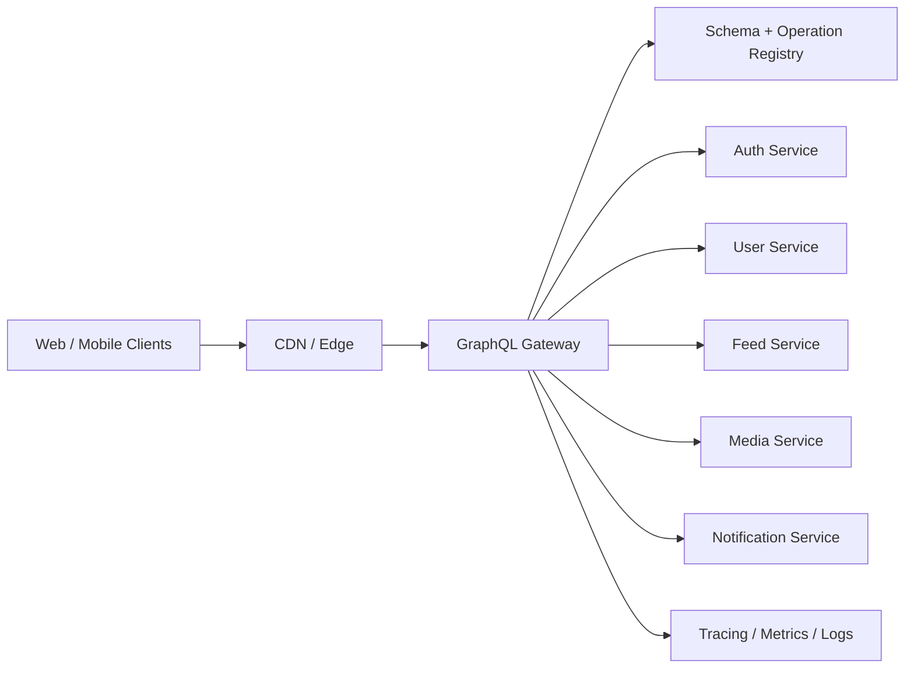
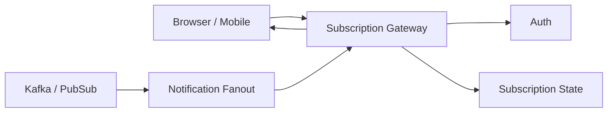

# GraphQL Staff Software Engineer Interview Questions

This guide is designed for **Staff Software Engineer** interviews. It covers GraphQL fundamentals, schema design, client architecture, backend execution, performance, security, federation, testing, migrations, and system design.

GraphQL is an API query language and server-side runtime organized around a strongly typed schema. Clients send documents containing operations such as queries, mutations, subscriptions, and fragments, and the server validates and executes those operations against the schema.

## How to Use This Guide

For each question, practice answering in this structure:

1. **Definition** — Explain the core concept clearly.
2. **Trade-off** — Compare alternatives, especially REST, RPC, BFF, and event streams.
3. **Production detail** — Mention performance, observability, security, and migration concerns.
4. **Staff-level lens** — Explain how you would set standards across teams.

---

## 1. GraphQL Fundamentals

### 1. What is GraphQL?

**Expected answer:**

GraphQL is a query language for APIs and a runtime for executing those queries against a typed schema. Instead of exposing many fixed REST endpoints, a GraphQL server exposes a schema that describes the available object types, fields, relationships, and operations. A client asks for exactly the fields it needs.

**Staff-level points:**

- GraphQL is not a database.
- GraphQL does not remove the need for backend ownership boundaries.
- GraphQL centralizes API shape around a schema contract.
- GraphQL shifts some complexity from endpoint design to schema design, query planning, authorization, caching, and observability.

### 2. Why would a company adopt GraphQL instead of REST?

**Expected answer:**

GraphQL is useful when product surfaces need to compose data from many backend services and clients need flexible field selection. It reduces over-fetching and under-fetching, improves developer experience through schema introspection and type generation, and can act as an API composition layer.

**Good use cases:**

- Mobile clients with bandwidth constraints.
- Product pages that compose many backend domains.
- Frontend teams that need typed API contracts.
- APIs with many client variants: web, iOS, Android, partner tools.

**Poor use cases:**

- Simple CRUD APIs with stable endpoints.
- Binary/file-heavy APIs.
- Streaming/event-first workloads where Kafka, SSE, or WebSocket protocols are better.
- Internal service-to-service calls where RPC/gRPC may be simpler.

### 3. What problem does GraphQL solve compared with REST?

**Expected answer:**

REST endpoints usually return fixed response shapes. This can cause:

- **Over-fetching** — response includes fields the client does not need.
- **Under-fetching** — client must make multiple requests to assemble one screen.
- **Endpoint explosion** — teams create many screen-specific endpoints.

GraphQL lets a client request a precise nested response shape in one operation.

### 4. What are the main GraphQL operation types?

**Expected answer:**

- `query` — read data.
- `mutation` — write data.
- `subscription` — receive pushed updates over a long-lived connection.

```graphql
query GetViewer {
  viewer {
    id
    name
  }
}

mutation UpdateProfile($input: UpdateProfileInput!) {
  updateProfile(input: $input) {
    user {
      id
      name
    }
  }
}

subscription OnNotification {
  notificationCreated {
    id
    message
  }
}
```

### 5. Is GraphQL only for frontend applications?

**Expected answer:**

No. GraphQL is often used by frontend clients, but it can also support partner APIs, internal tools, workflow systems, and backend aggregation. However, for service-to-service communication, GraphQL should be chosen intentionally because it adds query-planning, validation, and schema governance overhead.

### 6. Is GraphQL a replacement for REST?

**Expected answer:**

Not always. GraphQL and REST can coexist. GraphQL is strong for flexible data composition; REST is strong for simple resources, HTTP caching, file transfer, public API simplicity, and operational predictability.

---

## 2. Schema Design

### 7. What is a GraphQL schema?

**Expected answer:**

A schema is the typed contract between client and server. It defines object types, scalar fields, relationships, input types, enums, interfaces, unions, queries, mutations, and subscriptions.

```graphql
type User {
  id: ID!
  name: String!
  profilePhotoUrl: String
  posts(first: Int, after: String): PostConnection!
}

type Query {
  user(id: ID!): User
  viewer: User!
}
```

### 8. What makes a schema well-designed?

**Expected answer:**

A strong schema is product-oriented, stable, discoverable, backward-compatible, and authorization-aware.

**Good schema design principles:**

- Model product concepts, not database tables.
- Use clear naming conventions.
- Prefer explicit input and payload types for mutations.
- Support pagination for lists.
- Avoid exposing internal implementation details.
- Design nullability carefully.
- Add descriptions and deprecations.
- Keep ownership boundaries clear.

### 9. Should GraphQL schemas mirror database tables?

**Expected answer:**

Usually no. A schema should model the public API contract, not persistence internals. Database tables can change independently of client contracts. Mirroring tables often leaks implementation details and makes migrations harder.

### 10. How do you choose between nullable and non-null fields?

**Expected answer:**

Use non-null only when the server can reliably guarantee the field. Overusing non-null makes partial failures more severe because null bubbles up to the nearest nullable parent.

```graphql
type User {
  id: ID!          # safe: every user must have an id
  name: String!    # safe only if required by product contract
  bio: String      # nullable: user may not have a bio
}
```

**Staff-level answer:**

Nullability is an API reliability contract. Be conservative on non-null fields when data comes from remote services, optional profiles, experiments, privacy filters, or partially available systems.

### 11. What is null bubbling in GraphQL?

**Expected answer:**

If a resolver returns `null` for a non-null field, GraphQL propagates the null up to the nearest nullable parent and adds an error to the response. This protects type guarantees but can remove more data than expected.

### 12. When should you use an enum?

**Expected answer:**

Use enums for a known finite set of values.

```graphql
enum UserRole {
  ADMIN
  MEMBER
  GUEST
}
```

Enums improve type safety, validation, generated client types, and documentation.

### 13. When should you use a custom scalar?

**Expected answer:**

Use custom scalars for values with special validation or serialization, such as `DateTime`, `URL`, `EmailAddress`, `JSON`, or `Decimal`.

**Trade-off:**

Custom scalars reduce schema expressiveness because clients only know the scalar name, not its internal fields. Use them for atomic values, not structured domain objects.

### 14. Interface vs union: what is the difference?

**Expected answer:**

An **interface** defines shared fields implemented by multiple object types.

```graphql
interface Node {
  id: ID!
}

type User implements Node {
  id: ID!
  name: String!
}
```

A **union** represents one of several object types without requiring shared fields.

```graphql
union SearchResult = User | Organization | Repository
```

Use interfaces when callers can rely on common fields. Use unions when result types differ significantly.

### 15. How do you design GraphQL mutations?

**Expected answer:**

Prefer one input object and one payload object.

```graphql
input CreatePostInput {
  clientMutationId: String
  title: String!
  body: String!
}

type CreatePostPayload {
  clientMutationId: String
  post: Post
  userErrors: [UserError!]!
}

type Mutation {
  createPost(input: CreatePostInput!): CreatePostPayload!
}
```

**Why:**

- Easier to evolve.
- Supports idempotency metadata.
- Supports rich error payloads.
- Avoids long argument lists.

### 16. How do you design errors in GraphQL?

**Expected answer:**

Use two categories:

1. **Transport/execution errors** in the GraphQL `errors` array for unexpected failures.
2. **Domain errors as data** in typed mutation payloads for expected user-correctable errors.

```graphql
type UserError {
  field: [String!]
  code: String!
  message: String!
}
```

**Example:**

- Invalid email: domain error in payload.
- Database outage: GraphQL error.
- Unauthorized field: either null + error, or explicit authorization error depending on product needs.

### 17. How do you version a GraphQL schema?

**Expected answer:**

GraphQL usually evolves through additive changes and field deprecation rather than URL versioning.

```graphql
type User {
  fullName: String! @deprecated(reason: "Use displayName instead")
  displayName: String!
}
```

**Staff-level process:**

- Add new fields first.
- Track usage through operation registry.
- Communicate deprecation deadlines.
- Remove fields only after usage reaches zero.
- Validate persisted operations in CI.

### 18. What is schema stitching or schema composition?

**Expected answer:**

Schema composition combines multiple domain schemas into a larger graph. It can be implemented through schema stitching, Apollo Federation, or custom gateway composition.

**Staff-level concern:**

Composition is not just technical. It requires schema ownership, review processes, compatibility checks, dependency management, and runtime observability.

---

## 3. Queries, Fragments, Directives, and Variables

### 19. What is a GraphQL selection set?

**Expected answer:**

A selection set is the list of fields requested for an object.

```graphql
query GetUser {
  user(id: "1") {
    id
    name
    posts {
      id
      title
    }
  }
}
```

### 20. What are GraphQL variables?

**Expected answer:**

Variables separate dynamic values from the query document.

```graphql
query GetUser($id: ID!) {
  user(id: $id) {
    id
    name
  }
}
```

**Benefits:**

- Query reuse.
- Safer parameterization.
- Better persisted query support.
- Cleaner client code.

### 21. What are aliases?

**Expected answer:**

Aliases let a client request the same field multiple times with different arguments.

```graphql
query CompareUsers {
  alice: user(id: "1") { id name }
  bob: user(id: "2") { id name }
}
```

### 22. What are fragments?

**Expected answer:**

Fragments are reusable field selections.

```graphql
fragment UserCard on User {
  id
  name
  profilePhotoUrl
}

query GetViewer {
  viewer {
    ...UserCard
  }
}
```

**Staff-level concern:**

Fragments improve component colocation but can cause hidden query bloat if teams spread fragments across large component trees without query-cost visibility.

### 23. What are inline fragments?

**Expected answer:**

Inline fragments select fields based on runtime type, commonly used with interfaces and unions.

```graphql
query Search($q: String!) {
  search(query: $q) {
    __typename
    ... on User {
      id
      name
    }
    ... on Organization {
      id
      displayName
    }
  }
}
```

### 24. What are directives?

**Expected answer:**

Directives modify query or schema behavior. Common operation directives include `@include` and `@skip`.

```graphql
query GetUser($withPosts: Boolean!) {
  viewer {
    id
    name
    posts @include(if: $withPosts) {
      id
      title
    }
  }
}
```

Schema-level directives can be used for metadata, auth hints, deprecation, or federation semantics depending on the server framework.

### 25. What is introspection?

**Expected answer:**

Introspection lets clients query the schema itself. Developer tools use it for documentation, autocomplete, validation, and type generation.

**Production concern:**

Public APIs may restrict introspection in production or require authentication because it reveals schema structure. Internal developer environments usually keep it enabled.

---

## 4. Resolver and Execution Model

### 26. What is a resolver?

**Expected answer:**

A resolver is a function that provides the value for a schema field.

```ts
const resolvers = {
  Query: {
    user: (_parent, args, context) => context.userService.getById(args.id),
  },
  User: {
    posts: (user, args, context) => context.postService.getPostsByUserId(user.id, args),
  },
};
```

### 27. What arguments does a resolver receive?

**Expected answer:**

Most GraphQL server implementations pass:

- `parent` / `source` — result from the parent resolver.
- `args` — field arguments.
- `context` — per-request context such as auth, loaders, tracing, services.
- `info` — query AST and execution metadata.

### 28. What is the N+1 query problem in GraphQL?

**Expected answer:**

Nested field resolvers can trigger one backend call per parent object.

Example:

```graphql
query {
  posts {
    id
    author { id name }
  }
}
```

Naive execution:

1. Fetch 100 posts.
2. Fetch author once per post.
3. Make 100 additional calls.

**Fixes:**

- Request-scoped batching with DataLoader.
- Backend join/aggregation endpoints.
- Query planning in a gateway.
- Preloading common fields.

### 29. What is DataLoader?

**Expected answer:**

DataLoader is a request-scoped batching and caching pattern. It collects multiple key-based loads during a tick and resolves them with a single batch function.

```ts
const userLoader = new DataLoader(async (ids: readonly string[]) => {
  const users = await userService.getUsersByIds([...ids]);
  const byId = new Map(users.map((u) => [u.id, u]));
  return ids.map((id) => byId.get(id) ?? null);
});
```

**Staff-level warning:**

DataLoader cache should usually be per request, not global, because auth, privacy, experiments, and viewer-specific visibility can affect results.

### 30. How does GraphQL execute nested fields?

**Expected answer:**

The server validates the operation against the schema, starts at the root operation type, resolves selected fields, then recursively resolves nested fields. Sibling fields can often execute in parallel, while mutation root fields are usually executed serially according to the GraphQL execution semantics.

### 31. How do you pass authentication into resolvers?

**Expected answer:**

Build authenticated identity into the request context after validating the token/session at the transport layer.

```ts
const context = async ({ req }) => {
  const viewer = await authService.authenticate(req.headers.authorization);
  return { viewer, loaders: createLoaders(viewer), services };
};
```

### 32. Should resolvers contain business logic?

**Expected answer:**

Resolvers should coordinate between GraphQL and domain services, not become large business-logic modules. Keep authorization checks, validation, and domain operations reusable outside GraphQL when possible.

**Good pattern:**

```txt
Resolver -> Application Service -> Domain Service -> Repository / External Service
```

---

## 5. Pagination, Filtering, and Sorting

### 33. Why is pagination important in GraphQL?

**Expected answer:**

GraphQL clients can request nested lists. Without pagination, a single query can accidentally fetch unbounded data and overload the server.

### 34. Offset pagination vs cursor pagination?

**Offset pagination:**

```graphql
posts(offset: 20, limit: 10): [Post!]!
```

**Pros:** simple.

**Cons:** unstable under inserts/deletes, expensive at high offsets.

**Cursor pagination:**

```graphql
posts(first: 10, after: "cursor"): PostConnection!
```

**Pros:** stable, scalable, better for infinite scroll.

**Cons:** more complex implementation.

### 35. What is the Relay connection pattern?

**Expected answer:**

The connection pattern wraps list results in edges, nodes, cursors, and page info.

```graphql
type PostConnection {
  edges: [PostEdge!]!
  pageInfo: PageInfo!
}

type PostEdge {
  cursor: String!
  node: Post!
}

type PageInfo {
  hasNextPage: Boolean!
  endCursor: String
}
```

### 36. How do you design filtering and sorting?

**Expected answer:**

Use typed input objects and enums.

```graphql
input PostFilter {
  authorId: ID
  createdAfter: DateTime
  status: PostStatus
}

enum PostSort {
  CREATED_AT_DESC
  CREATED_AT_ASC
  POPULARITY_DESC
}
```

Avoid arbitrary string filters unless you have a safe query planner and validation layer.

---

## 6. Client-Side GraphQL

### 37. How does GraphQL affect frontend architecture?

**Expected answer:**

GraphQL enables colocating data requirements with UI components. Components define fragments, pages compose fragments into operations, and generated types keep UI code aligned with schema changes.

### 38. What is fragment colocation?

**Expected answer:**

Fragment colocation means a component declares the exact data it needs near the component implementation.

```tsx
const USER_CARD_FRAGMENT = graphql(`
  fragment UserCard_user on User {
    id
    name
    profilePhotoUrl
  }
`);
```

**Benefits:**

- Components are easier to reuse.
- Data dependencies are explicit.
- Type generation becomes component-friendly.

**Risk:**

Large screens can accidentally compose too much data. Use operation cost analysis and query reviews.

### 39. Apollo Client vs Relay vs urql?

**Expected answer:**

- **Apollo Client**: flexible, widely used, normalized cache, broad ecosystem.
- **Relay**: stricter, fragment-first, strong compile-time guarantees, great for large product surfaces.
- **urql**: lightweight, exchange-based architecture, simpler apps.

Staff-level answer should focus less on popularity and more on team needs: type safety, cache complexity, migration cost, SSR support, persisted queries, and operational tooling.

### 40. What is normalized caching?

**Expected answer:**

Normalized caching stores entities by identity instead of storing every query response separately.

```txt
User:1 -> { id: 1, name: "Khanh" }
Post:9 -> { id: 9, author: User:1 }
```

When one query updates `User:1`, other views using the same user can update automatically.

### 41. How do GraphQL clients identify cache entities?

**Expected answer:**

Usually by `__typename` and `id`.

```graphql
query {
  viewer {
    __typename
    id
    name
  }
}
```

### 42. How do you handle optimistic UI with GraphQL mutations?

**Expected answer:**

The client temporarily updates the cache with an optimistic response, then reconciles when the server response arrives.

**Important details:**

- Use temporary client IDs for newly created objects.
- Roll back on failure.
- Avoid optimistic updates for high-risk financial, compliance, or irreversible actions.

### 43. How do you avoid GraphQL query waterfalls in React?

**Expected answer:**

- Fetch at route/page boundary when possible.
- Use preloaded queries.
- Compose fragments into one operation.
- Use Suspense carefully.
- Avoid child components firing dependent queries after render unless intentionally lazy.

### 44. How does GraphQL work with SSR or Server Components?

**Expected answer:**

GraphQL can be used server-side to prefetch data for SSR or React Server Components. Consider auth propagation, cache hydration, request deduplication, persisted operations, and avoiding duplicate client/server fetches.

---

## 7. Performance and Scalability

### 45. Why can GraphQL be risky for performance?

**Expected answer:**

GraphQL lets clients request deeply nested and expensive shapes. Without limits, a single operation can trigger high CPU usage, large DB queries, many service calls, or massive responses.

### 46. How do you protect a GraphQL API from expensive queries?

**Expected answer:**

- Query depth limits.
- Query complexity scoring.
- Field-level cost weights.
- Pagination requirements.
- Persisted query allowlists.
- Rate limiting by viewer, app, tenant, and operation.
- Timeouts and cancellation.
- Response size limits.

### 47. What is query complexity analysis?

**Expected answer:**

It estimates the cost of executing an operation before running it. Cost can be based on field weights, nesting depth, pagination arguments, and backend call estimates.

```txt
cost = base field cost + child field cost * requested list size
```

### 48. What are persisted queries?

**Expected answer:**

Persisted queries register approved operation documents and let clients send a hash or operation ID at runtime.

**Benefits:**

- Smaller payloads.
- Operation allowlisting.
- Better caching and observability.
- Prevents arbitrary query execution in production.

### 49. How do you cache GraphQL responses?

**Expected answer:**

GraphQL caching is harder than REST because many operations use the same URL with different query bodies. Common layers:

- Client normalized cache.
- Request-level resolver cache.
- DataLoader batching cache.
- Backend service cache.
- CDN/APQ cache for persisted GET queries.
- Entity-level invalidation.

### 50. How do you make GraphQL work with a CDN?

**Expected answer:**

Use persisted queries with stable operation IDs and GET requests for cacheable queries. Include auth, locale, experiment, and viewer-specific cache keys carefully.

### 51. How do you measure GraphQL performance?

**Expected answer:**

Track metrics at multiple levels:

- Operation name latency p50/p95/p99.
- Field resolver latency.
- Backend service fan-out.
- Error rate by field and operation.
- Query complexity.
- Response size.
- Cache hit rate.
- N+1 detection.
- Client route performance.

### 52. How do you debug a slow GraphQL query?

**Expected answer:**

1. Identify operation name and variables.
2. Inspect query shape and complexity.
3. Look at resolver traces.
4. Find slow fields and backend dependencies.
5. Check batching/cache behavior.
6. Validate pagination limits.
7. Compare with recent schema/resolver changes.
8. Add regression tests or query budgets.

---

## 8. Security and Authorization

### 53. Where should authorization happen in GraphQL?

**Expected answer:**

Authorization can happen at multiple layers:

- Request-level authentication at the gateway/server.
- Operation-level authorization for protected mutations.
- Object-level authorization for entity access.
- Field-level authorization for sensitive fields.
- Backend service authorization as defense in depth.

**Staff-level answer:**

Do not rely only on frontend hiding fields. Authorization must be enforced server-side and consistently tested.

### 54. How do you prevent data leakage through nested GraphQL fields?

**Expected answer:**

Every resolver that returns sensitive data must check viewer permissions or call services that enforce permissions. Use privacy-aware loaders keyed by viewer context, avoid global caches for viewer-specific data, and test nested access paths.

### 55. Should introspection be enabled in production?

**Expected answer:**

It depends. Internal authenticated APIs may keep introspection enabled. Public APIs may disable or restrict it in production and rely on published schema docs or registries.

### 56. What are common GraphQL security risks?

**Expected answer:**

- Deep recursive queries causing DoS.
- N+1 backend overload.
- Missing field-level authorization.
- ID enumeration.
- Introspection leakage.
- Injection through resolver arguments.
- Oversized variables.
- Batching abuse.
- Subscription connection abuse.

### 57. How do you rate limit GraphQL?

**Expected answer:**

Rate limiting should account for operation cost, not only request count.

Possible dimensions:

- User or tenant.
- App/client ID.
- Operation name/hash.
- Query complexity.
- Mutation class.
- Backend resource class.

### 58. How do you handle multi-tenant GraphQL authorization?

**Expected answer:**

Tenant identity should be part of context and enforced in every data access path. IDs should be scoped or checked against tenant ownership. Avoid shared global DataLoader caches across tenants.

---

## 9. Error Handling and Reliability

### 59. Why can GraphQL return both `data` and `errors`?

**Expected answer:**

GraphQL supports partial responses. Some fields may resolve successfully while others fail. The server can return available data plus an `errors` array describing failed fields.

### 60. How do you design retries for GraphQL clients?

**Expected answer:**

- Retry idempotent queries on transient failures.
- Be careful retrying mutations.
- Use idempotency keys for safe mutation retries.
- Avoid retry storms by using exponential backoff and jitter.

### 61. How do you make mutations idempotent?

**Expected answer:**

Accept a client-generated idempotency key or `clientMutationId`, store the first result for that key, and return the same result on retry.

```graphql
input ChargeCustomerInput {
  idempotencyKey: ID!
  customerId: ID!
  amountCents: Int!
}
```

### 62. How do you handle partial backend outages?

**Expected answer:**

For non-critical fields, return partial data with field errors or fallback values. For critical fields, fail the operation. Add circuit breakers, timeouts, and field-level observability.

---

## 10. Subscriptions and Real-Time GraphQL

### 63. What are GraphQL subscriptions?

**Expected answer:**

Subscriptions let clients receive pushed updates after an initial operation. They are often implemented over WebSockets or server-sent events depending on framework and protocol support.

### 64. When should you not use GraphQL subscriptions?

**Expected answer:**

Avoid subscriptions for very high-throughput event streams, logs, market data, or telemetry firehoses. Use specialized streaming systems instead.

### 65. How would you scale GraphQL subscriptions?

**Expected answer:**

- Use a connection gateway tier.
- Keep subscription state distributed and recoverable.
- Use pub/sub for fan-out.
- Authenticate connection and subscription separately.
- Enforce per-tenant connection and topic limits.
- Support reconnect and replay when needed.

### 66. Subscription vs polling vs SSE vs WebSocket?

**Expected answer:**

- Polling: simple, inefficient for frequent updates.
- SSE: server-to-client streaming over HTTP, good for one-way updates.
- WebSocket: bidirectional, good for interactive real-time apps.
- GraphQL subscription: typed real-time API integrated with schema.

---

## 11. Federation and GraphQL at Scale

### 67. What is GraphQL federation?

**Expected answer:**

Federation lets multiple teams own subgraphs that compose into a unified supergraph. A gateway/router plans and executes operations across subgraphs.

### 68. Why use federation?

**Expected answer:**

- Domain teams own their parts of the graph.
- Avoid one monolithic GraphQL server.
- Support organizational scaling.
- Compose product data across services.

### 69. What are the risks of federation?

**Expected answer:**

- Cross-subgraph latency.
- Schema ownership conflicts.
- Breaking composition changes.
- Harder local reasoning.
- Gateway hot spots.
- Authorization inconsistencies.
- Distributed tracing complexity.

### 70. How do you govern a federated graph?

**Expected answer:**

- Schema registry.
- Ownership metadata.
- Compatibility checks in CI.
- Operation usage tracking.
- Deprecation policy.
- Review process for shared types.
- Field-level SLOs.
- Documentation standards.

### 71. What is a graph router or gateway?

**Expected answer:**

A router receives client operations, validates/plans them against the composed schema, fetches data from relevant subgraphs/services, and returns a single response.

### 72. How do you avoid a GraphQL gateway becoming a bottleneck?

**Expected answer:**

- Keep gateway stateless where possible.
- Use horizontal scaling.
- Cache query plans.
- Use persisted operations.
- Push domain logic down to subgraphs/services.
- Add operation complexity limits.
- Monitor downstream fan-out.

---

## 12. GraphQL vs REST vs gRPC vs BFF

### 73. GraphQL vs REST?

| Dimension | GraphQL | REST |
|---|---|---|
| Response shape | Client-selected | Server-defined |
| Caching | More complex | HTTP-native |
| Discoverability | Schema/introspection | OpenAPI/docs |
| Versioning | Add/deprecate fields | URL/header versions common |
| Best for | Composed product data | Resource APIs/simple CRUD |

### 74. GraphQL vs gRPC?

| Dimension | GraphQL | gRPC |
|---|---|---|
| Main use | Client/API composition | Service-to-service RPC |
| Transport | Usually HTTP | HTTP/2 |
| Contract | GraphQL schema | Protobuf |
| Streaming | Subscriptions | Native streaming |
| Browser friendliness | Strong | Needs gateway/proxy usually |

### 75. GraphQL vs BFF?

**Expected answer:**

A Backend-for-Frontend is a backend tailored to a specific client or product surface. GraphQL can be used as a BFF implementation, but not all BFFs need GraphQL.

### 76. Can GraphQL call REST services behind the scenes?

**Expected answer:**

Yes. Resolvers can call REST, gRPC, databases, queues, or other services. GraphQL is an API layer, not a storage layer.

---

## 13. Testing GraphQL

### 77. How do you test a GraphQL schema?

**Expected answer:**

- Schema validation tests.
- Snapshot/schema diff checks.
- Breaking change checks.
- Resolver unit tests.
- Integration tests with real operations.
- Authorization tests for nested paths.
- Contract tests using persisted operations.

### 78. How do you test resolvers?

**Expected answer:**

Mock or fake services at the application boundary, pass a test context, and execute actual GraphQL operations when possible.

```ts
const result = await graphql({
  schema,
  source: `query { user(id: "1") { id name } }`,
  contextValue: createTestContext(),
});

expect(result.errors).toBeUndefined();
expect(result.data?.user.name).toBe("Khanh");
```

### 79. How do you prevent breaking clients?

**Expected answer:**

- Track operation usage.
- Run schema diff in CI.
- Reject breaking changes unless approved.
- Validate persisted operations against proposed schema.
- Use deprecations and migration windows.

### 80. How do you test authorization?

**Expected answer:**

Test with multiple viewer contexts:

- Anonymous user.
- Owner.
- Same tenant member.
- Different tenant member.
- Admin.
- Suspended or restricted user.

Also test nested traversal paths, not just top-level fields.

---

## 14. Observability and Operations

### 81. What GraphQL metrics would you add?

**Expected answer:**

- Operation count by name/hash/client.
- Latency by operation and field.
- Error rate by path.
- Resolver backend calls.
- Query complexity distribution.
- Response size.
- Cache hit rate.
- Deprecated field usage.
- Auth failures.
- Subscription connection count.

### 82. How do you trace GraphQL requests?

**Expected answer:**

Use distributed tracing across gateway, resolvers, and downstream services. Add spans for resolver execution and backend calls. Include operation name/hash, client name, tenant, and field path while avoiding sensitive variables.

### 83. How do you operate GraphQL during incidents?

**Expected answer:**

- Identify hot operation or field.
- Disable or throttle expensive operation via registry/gateway.
- Add temporary complexity rule.
- Roll back resolver or schema change.
- Degrade non-critical fields.
- Communicate with client owners.
- Add regression guard after incident.

---

## 15. Migration and Adoption

### 84. How would you migrate from REST to GraphQL?

**Expected answer:**

1. Start with one high-value product surface.
2. Build GraphQL as a composition layer over existing REST/services.
3. Generate typed client code.
4. Add observability and query cost limits early.
5. Migrate screen by screen.
6. Keep REST for simple or public endpoints when appropriate.

### 85. How do you introduce GraphQL to a large engineering organization?

**Expected answer:**

- Define schema design standards.
- Create a review process.
- Provide client/server templates.
- Build schema registry and operation registry.
- Offer migration guides.
- Establish ownership per domain.
- Add training and office hours.

### 86. What is the hardest part of GraphQL adoption?

**Expected answer:**

At staff level, the hardest part is usually not syntax. It is governance: schema ownership, field lifecycle, authorization consistency, observability, cost control, and preventing the graph from becoming a distributed monolith.

---

## 16. System Design Interview Questions

### 87. Design a GraphQL API gateway for a large consumer product.

**Clarify requirements:**

- Web, iOS, Android clients.
- Millions of users.
- Multiple backend services.
- Need typed contracts, low latency, and safe schema evolution.

**High-level architecture:**



**Key design points:**

- Persisted queries for production.
- Query complexity limits.
- Request context with viewer identity.
- Resolver batching.
- Field-level metrics.
- Schema registry and CI checks.
- Client codegen.

### 88. Design GraphQL for a social feed.

**Important questions:**

- How do you paginate feed items?
- How do you fetch author, reactions, media, comments preview?
- How do you avoid N+1 calls?
- How do you support optimistic reactions?
- How do you cache viewer-specific data?

**Possible schema:**

```graphql
type Query {
  homeFeed(first: Int!, after: String): FeedConnection!
}

type FeedItem {
  id: ID!
  author: User!
  text: String
  media: [Media!]!
  viewerHasLiked: Boolean!
  reactionSummary: ReactionSummary!
  commentsPreview(first: Int = 2): CommentConnection!
}
```

### 89. Design GraphQL for an enterprise admin dashboard.

**Focus areas:**

- Multi-tenant authorization.
- Filtering/sorting.
- Aggregations.
- Export workflows.
- Query complexity limits.
- Audit logging.

### 90. Design a federated GraphQL platform for 100 teams.

**Staff-level answer should include:**

- Subgraph ownership model.
- Schema registry.
- Composition checks.
- Router deployment.
- Contract tests.
- Operation registry.
- Deprecation policy.
- Incident response.

### 91. Design GraphQL subscriptions for notifications.

**Architecture:**



**Discussion:**

- Per-user channels.
- Connection auth and reauth.
- Replay missed events.
- Backpressure.
- Tenant limits.

### 92. Design a GraphQL schema registry.

**Core features:**

- Store schema versions.
- Run breaking change detection.
- Track field ownership.
- Track operation usage.
- Provide docs and search.
- Gate CI/CD.

**Entities:**

```txt
SchemaVersion(id, graphId, sdl, createdAt, createdBy)
FieldOwnership(typeName, fieldName, team, slack, repo)
Operation(id, hash, clientName, document, lastSeenAt)
CheckRun(id, schemaVersionId, status, findings)
```

### 93. Design a persisted query platform.

**Core flow:**

1. Client build extracts GraphQL operations.
2. CI validates operations against schema.
3. Operation hash is registered.
4. Runtime client sends hash + variables.
5. Gateway looks up query document.
6. Gateway rejects unknown hashes in production.

---

## 17. Staff-Level Architecture and Leadership Questions

### 94. How do you decide whether GraphQL is the right choice?

**Expected answer:**

Evaluate product needs, number of clients, data composition complexity, caching requirements, team maturity, operational readiness, and governance cost.

### 95. How do you prevent schema sprawl?

**Expected answer:**

- Strong ownership.
- Review standards.
- Naming conventions.
- Deprecation process.
- Domain modeling guidelines.
- Usage analytics.
- Regular schema cleanup.

### 96. How do you handle disagreement between frontend and backend teams on schema shape?

**Expected answer:**

Use product use cases as the tie-breaker. The schema should represent stable product/domain concepts, not one team's internal implementation. Document trade-offs, prototype query ergonomics, and define ownership.

### 97. How do you create GraphQL engineering standards?

**Expected answer:**

Create a schema style guide covering naming, nullability, pagination, mutation payloads, errors, auth, deprecation, observability, and testing. Back it with CI checks and examples.

### 98. How would you mentor engineers new to GraphQL?

**Expected answer:**

Start with schema mental model, resolver execution, nullability, pagination, DataLoader, and auth. Pair on real schema changes and review query performance traces.

### 99. How do you measure success of GraphQL adoption?

**Expected answer:**

- Reduced client API round trips.
- Faster product development.
- Lower API breakage rate.
- Improved type safety.
- Operation latency within SLO.
- Reduced duplicated BFF endpoints.
- High schema documentation coverage.
- Low incident rate from GraphQL operations.

### 100. What are anti-patterns in GraphQL adoption?

**Expected answer:**

- Treating GraphQL as direct DB access.
- No query cost limits.
- No auth at nested fields.
- Global DataLoader cache.
- Unbounded list fields.
- No operation names.
- No schema ownership.
- Huge generic `JSON` fields.
- Mutations with ambiguous side effects.
- One central team bottlenecking all schema work.

---

## 18. Coding and Implementation Questions

### 101. Implement a simple GraphQL resolver with DataLoader.

**Prompt:**

Given `posts` with `authorId`, implement `Post.author` without making one DB call per post.

**Expected approach:**

Create a per-request `userLoader` and use `load(authorId)` inside the resolver.

### 102. Implement cursor pagination.

**Prompt:**

Given table rows sorted by `(createdAt DESC, id DESC)`, return `first` items after a cursor.

**Expected points:**

- Cursor encodes last item sort key.
- Query uses seek pagination, not offset.
- Fetch `first + 1` to compute `hasNextPage`.
- Return `endCursor` from last returned edge.

### 103. Validate GraphQL operation cost.

**Prompt:**

Given a parsed query AST and field cost map, compute total cost and reject if above limit.

**Expected points:**

- Traverse AST.
- Expand fragments.
- Account for list multipliers.
- Avoid double-counting fragment cycles.

### 104. Build an operation registry.

**Prompt:**

Create APIs to register query text by hash and retrieve query by hash.

**Expected points:**

- Hash canonicalized document.
- Validate against schema before registration.
- Store client ownership.
- Reject unknown hashes in production.

### 105. Write a resolver-level authorization wrapper.

**Prompt:**

Create a helper that checks viewer permissions before executing a resolver.

**Example:**

```ts
function requirePermission<TParent, TArgs, TResult>(
  permission: string,
  resolver: Resolver<TParent, TArgs, TResult>,
): Resolver<TParent, TArgs, TResult> {
  return async (parent, args, context, info) => {
    if (!context.viewer?.permissions.includes(permission)) {
      throw new Error("Forbidden");
    }
    return resolver(parent, args, context, info);
  };
}
```

---

## 19. Frontend Interview Questions

### 106. How do you organize GraphQL files in a React app?

**Expected answer:**

Common options:

```txt
src/
  graphql/
    generated/
  pages/
    HomePage/
      HomePage.tsx
      HomePage.graphql
  components/
    UserCard/
      UserCard.tsx
      UserCard.fragment.graphql
```

### 107. How do you handle loading and error states?

**Expected answer:**

- Route-level loading skeletons.
- Component-level fallback for optional fragments.
- Retry for transient errors.
- Empty states for valid empty results.
- Distinguish permission errors from missing data.

### 108. How do you avoid stale UI after mutations?

**Expected answer:**

- Return updated entities from mutation payload.
- Update normalized cache.
- Invalidate relevant queries.
- Use optimistic update carefully.
- Subscribe or poll for externally modified data when needed.

### 109. How do you handle generated TypeScript types?

**Expected answer:**

Use GraphQL Code Generator, Relay compiler, or framework-specific tooling to generate operation and fragment types. Run generation in CI to catch schema mismatches.

### 110. How do you split GraphQL bundles?

**Expected answer:**

Use route-level operations, persisted query manifests, and code splitting. Avoid importing all generated operations into the main bundle.

---

## 20. Backend Interview Questions

### 111. How do you design GraphQL context?

**Expected answer:**

Context should be request-scoped and include viewer identity, tenant, request ID, loaders, feature flags, tracing handles, and service clients.

### 112. How do you avoid resolver duplication?

**Expected answer:**

Move shared logic into application services, loaders, and reusable auth helpers. Keep resolvers thin.

### 113. How do you handle database transactions in mutations?

**Expected answer:**

Perform transaction boundaries in application services called by mutation resolvers. Ensure side effects are ordered correctly, use outbox patterns for events, and make retries idempotent.

### 114. How do you handle GraphQL file uploads?

**Expected answer:**

Prefer direct-to-object-storage upload flows using signed URLs instead of sending large files through GraphQL.

### 115. How do you support large exports?

**Expected answer:**

Do not return massive exports directly in a GraphQL response. Use a mutation to start an async export job and query job status.

```graphql
type Mutation {
  startReportExport(input: StartReportExportInput!): StartReportExportPayload!
}

type Query {
  exportJob(id: ID!): ExportJob
}
```

---

## 21. GraphQL Design Review Checklist

Use this checklist when reviewing a schema change.

### Product and API Contract

- Does the field represent a stable product/domain concept?
- Is the name clear and consistent?
- Is the field documented?
- Is ownership defined?

### Compatibility

- Is the change additive?
- Are old fields deprecated instead of removed?
- Are persisted operations validated?

### Performance

- Is every list paginated?
- Is query complexity bounded?
- Could this introduce N+1 calls?
- Are DataLoaders request-scoped?

### Security

- Is authorization enforced at every sensitive path?
- Is tenant scoping correct?
- Could this leak data through nested traversal?

### Reliability

- Is nullability realistic?
- Are partial failures handled?
- Are timeouts/circuit breakers in place?

### Observability

- Is field latency traceable?
- Can deprecated usage be measured?
- Is operation ownership known?

---

## 22. Quick Answer Bank

### Explain GraphQL in 30 seconds.

GraphQL is a typed API query language and execution runtime. The server exposes a schema, and clients ask for exactly the fields they need. It is useful for product surfaces that compose data from many domains, but it requires strong schema governance, authorization, query limits, caching, and observability.

### Explain GraphQL at staff level.

GraphQL is an API composition contract. The core engineering challenge is not writing queries; it is operating a safe graph across teams: schema ownership, compatibility, authorization, query cost, field SLOs, client codegen, operation registry, and incident controls.

### What is your biggest concern with GraphQL?

My biggest concern is uncontrolled flexibility. Without persisted queries, complexity limits, field-level auth, observability, and schema governance, GraphQL can become a performance and data-leakage risk.

### What does a good GraphQL platform include?

A good platform includes schema registry, operation registry, persisted queries, query planner, complexity analysis, resolver tracing, code generation, compatibility checks, auth patterns, DataLoader utilities, documentation, and ownership workflows.

---

## 23. Mock Staff Interview Loop

### Round 1: Fundamentals and API Design

- Explain GraphQL vs REST.
- Design a schema for a social profile page.
- Discuss nullability and pagination.
- Design a mutation payload.

### Round 2: Backend Execution

- Explain resolver execution.
- Solve N+1 problem.
- Add DataLoader.
- Add authorization.
- Debug slow query.

### Round 3: Frontend Architecture

- Design React + GraphQL data layer.
- Discuss fragment colocation.
- Handle optimistic mutation.
- Discuss generated types and cache invalidation.

### Round 4: System Design

- Design a federated GraphQL gateway for 100 teams.
- Add schema registry and operation registry.
- Add query-cost controls.
- Add observability and incident response.

### Round 5: Staff Leadership

- Define GraphQL standards.
- Handle schema ownership conflicts.
- Migrate REST to GraphQL.
- Measure success.

---

## 24. Practice Prompts

Use these as timed drills.

1. Design GraphQL for a LinkedIn-style profile page.
2. Design GraphQL for GitHub repository page.
3. Design GraphQL for Slack notifications.
4. Design GraphQL for enterprise billing dashboard.
5. Design GraphQL for a multi-tenant admin console.
6. Design GraphQL for search across users, teams, and documents.
7. Design a GraphQL schema registry.
8. Design persisted queries for mobile clients.
9. Design a migration from REST BFFs to GraphQL.
10. Design GraphQL authorization for nested sensitive data.
11. Debug a GraphQL p99 latency regression.
12. Prevent a malicious deep query from taking down the API.
13. Design GraphQL subscriptions for live comments.
14. Design cursor pagination for activity logs.
15. Design mutation idempotency for payment workflows.

---

## 25. What Interviewers Are Looking For

At senior/staff level, interviewers are checking whether you can:

- Explain GraphQL clearly without hype.
- Design stable schemas.
- Handle frontend and backend trade-offs.
- Prevent performance and security failures.
- Scale ownership across teams.
- Build migration paths.
- Operate GraphQL in production.
- Think in contracts, not just resolvers.

---

## 26. Source Notes

This guide is based on the GraphQL language model of schemas, typed fields, operations, fragments, directives, and execution semantics described by the GraphQL documentation and specification, plus common production architecture patterns used in GraphQL platforms.

Useful references:

- GraphQL official site: https://graphql.org/
- GraphQL queries: https://graphql.org/learn/queries/
- GraphQL schemas and types: https://graphql.org/learn/schema/
- GraphQL specification: https://spec.graphql.org/
- Apollo schema design and federation documentation: https://www.apollographql.com/docs/
