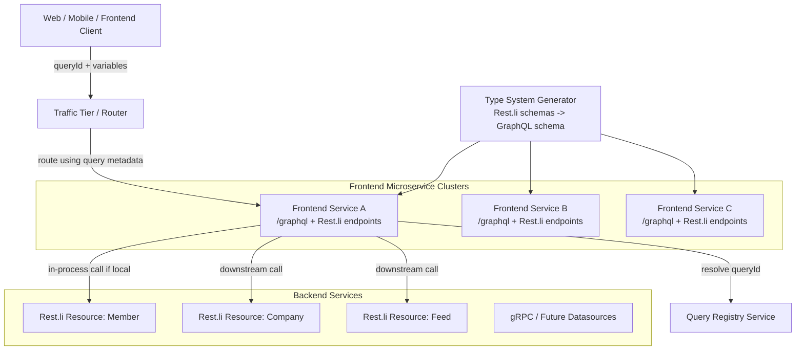
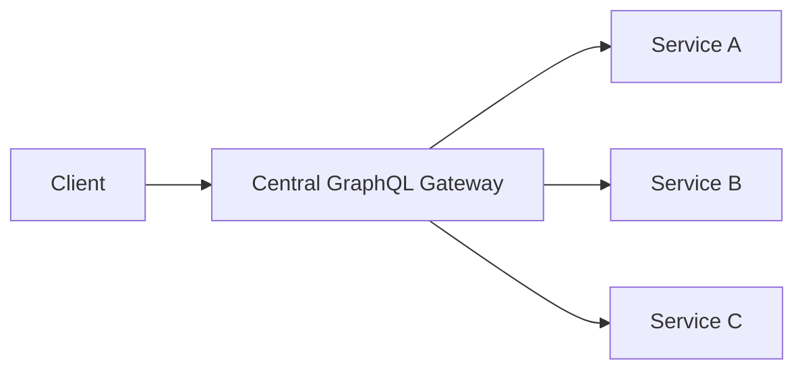
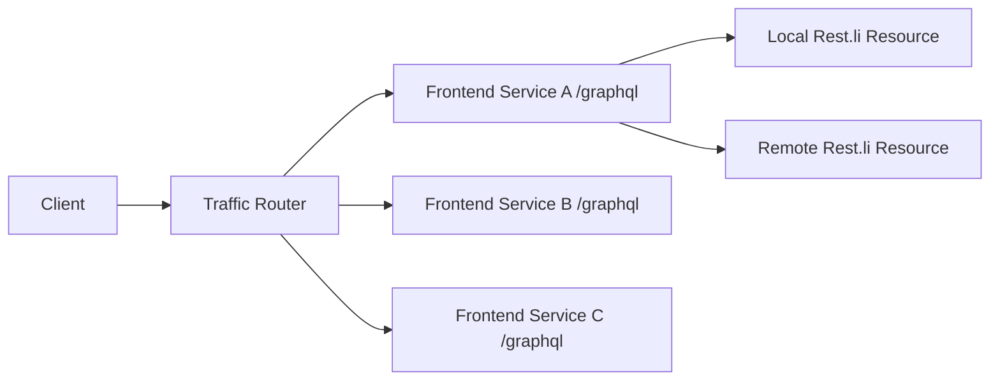
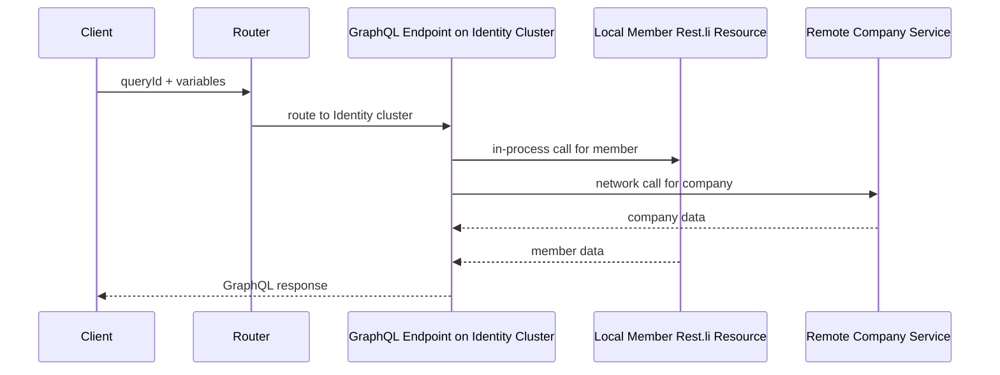
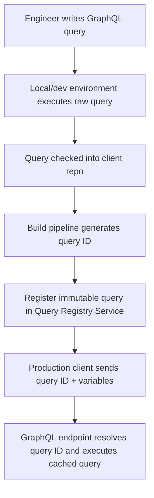
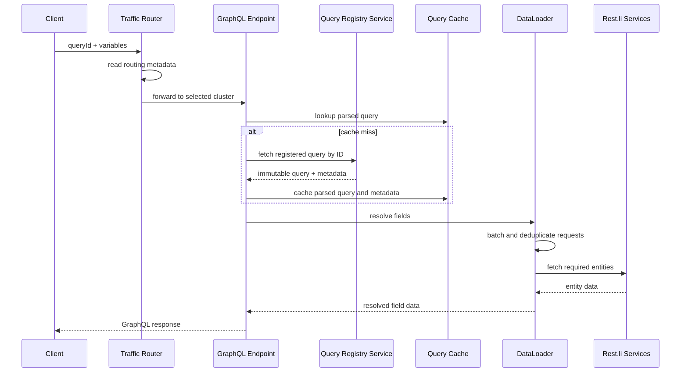
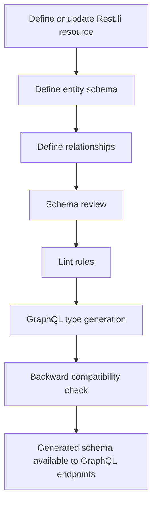
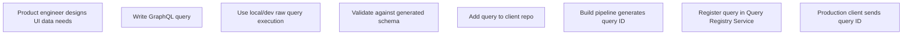
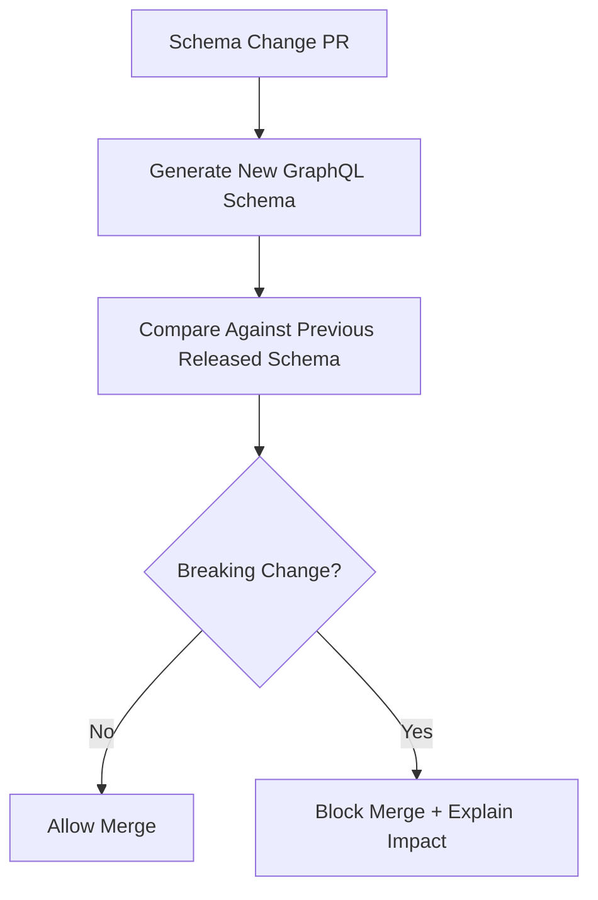

# LinkedIn GraphQL Architecture: Interview Study Guide

> Based on LinkedIn Engineering's article: **"How LinkedIn Adopted A GraphQL Architecture for Product Development"**.
>
> Use this as an interview answer for: **"How would you design GraphQL at LinkedIn scale?"** or **"How does LinkedIn use GraphQL for product development?"**

---

## 1. Interview Summary

LinkedIn adopted GraphQL to improve product development speed on top of an existing microservice architecture. Before GraphQL, LinkedIn already had thousands of **Rest.li** microservices. This worked well for service owners, but frontend and BFF teams had to call many services, handle partial failures, understand service boundaries, and deal with duplicated downstream requests.

LinkedIn first built an internal system called **Deco**, which let clients express data needs through a proprietary query language. Deco solved some fanout problems, but it was schema-less, difficult to validate, hard to test, and lacked the broader tooling ecosystem of GraphQL.

LinkedIn then adopted GraphQL with three major architecture choices:

1. **Autogenerated GraphQL type system** from existing Rest.li schemas.
2. **Distributed GraphQL execution endpoint** embedded in every frontend microservice instead of one central GraphQL gateway.
3. **Pre-registered production queries** stored in a central Query Registry Service.

The result was a GraphQL platform that preserved LinkedIn's existing Rest.li investment while improving frontend developer velocity, runtime safety, query validation, routing, and performance.

---

## 2. Problem LinkedIn Needed to Solve

### Existing State

LinkedIn had a mature microservice ecosystem based on **Rest.li**.

That meant:

- Thousands of backend services already existed.
- API engineers had established ownership, review, and operational workflows.
- Product surfaces needed data from many services.
- Frontend/BFF teams often needed to manually orchestrate multiple service calls.

### Pain Points

For product engineers, this created several problems:

| Problem | Impact |
|---|---|
| Discovering the right services | Frontend teams needed to know which microservice owned each piece of data. |
| Multiple network round trips | UI pages often required data from many services. |
| Partial failure handling | More downstream calls meant more resilience logic in client/BFF code. |
| Duplicated downstream calls | Tree-shaped data fetching could repeatedly request the same entities. |
| Schema-less query layer in Deco | Queries and responses were harder to validate before production. |
| Proprietary query language | Harder onboarding, testing, maintenance, and tooling. |

### Interview Framing

In an interview, frame the problem like this:

> LinkedIn did not adopt GraphQL because REST was broken. They adopted GraphQL because, at their scale, frontend product development needed a safer and more productive abstraction over many existing microservices.

---

## 3. Why GraphQL?

GraphQL gave LinkedIn a standardized way for frontend engineers to declare the data they needed while allowing the platform to optimize how that data was fetched.

### Benefits

- **Typed schema**: Queries and responses can be validated.
- **Better developer tooling**: IDE autocomplete, query validation, generated types, query testing.
- **Declarative data needs**: Clients describe what they want, not how to call many services.
- **Reduced over-fetching and under-fetching**: Clients request only the fields needed.
- **Unified graph view**: Data from many services appears as one connected graph.

### Initial Scope

LinkedIn intentionally started with a smaller scope:

- GraphQL for **read operations only**.
- Targeted the **frontend stack** first.
- Preserved existing backend service ownership and Rest.li infrastructure.

This is an important interview point: **large platform migrations should start with a constrained scope**.

---

## 4. High-Level Architecture



### Main Components

| Component | Responsibility |
|---|---|
| Rest.li microservices | Existing source of truth for entity resources and schemas. |
| Type System Generator | Generates GraphQL schema from Rest.li resources, entity schemas, and relationships. |
| GraphQL Execution Endpoint | Runs GraphQL queries inside each frontend microservice. |
| Field Data Fetchers | Resolve GraphQL fields by calling Rest.li resources. |
| DataLoaders | Batch and deduplicate downstream requests. |
| Query Registry Service | Stores immutable pre-registered queries used in production. |
| Traffic Router | Routes a query to the best frontend cluster using query metadata. |

---

## 5. Architecture Decision 1: Autogenerated Type System

### What LinkedIn Did

LinkedIn autogenerated the GraphQL type system by federating existing **Rest.li** artifacts:

- Rest.li resource definitions
- Entity schemas
- Relationship definitions

Instead of asking every backend team to manually write GraphQL schemas, LinkedIn reused the existing schema review and ownership model from Rest.li.

### Why This Matters

This avoided introducing a second schema source of truth.

Without this decision, teams would need to maintain:

1. Rest.li schemas for backend services.
2. GraphQL schemas for frontend consumers.

That would increase schema drift, review overhead, and operational complexity.

### Interview Answer

> I would avoid hand-authoring GraphQL schemas for thousands of existing services. Instead, I would generate GraphQL types from the existing service schema system. That keeps backend ownership unchanged, prevents schema drift, and makes GraphQL an adoption layer rather than a rewrite.

### Safety Checks

LinkedIn added two important controls:

| Control | Purpose |
|---|---|
| GraphQL backward compatibility checker | Prevents breaking schema changes from reaching production. |
| Custom Rest.li schema lint rules | Prevents inconsistencies in generated GraphQL types. |

---

## 6. Architecture Decision 2: Distributed GraphQL Execution

### Common Industry Pattern

Many companies deploy GraphQL as a centralized gateway:



### LinkedIn's Pattern

LinkedIn chose a distributed model:



Each frontend microservice includes a GraphQL execution endpoint.

### Why LinkedIn Avoided a Central Gateway

| Reason | Explanation |
|---|---|
| Avoid extra network hop | A central gateway adds latency between clients and frontend services. |
| Avoid single point of failure | A central gateway would become critical shared infrastructure for all frontend GraphQL traffic. |
| Preserve existing cluster ownership | Frontend services could continue to scale and operate independently. |
| Enable in-process resolution | If the GraphQL field maps to a local Rest.li resource, the service can call it directly without network transport. |

### Tradeoff

This design is more complex than a central gateway.

The biggest constraint LinkedIn called out is that queries are restricted to **one top-level field**, because routing depends on knowing which cluster owns the top-level field.

### Interview Answer

> At LinkedIn scale, I would consider a distributed GraphQL execution model instead of one central gateway. Embedding GraphQL inside frontend services avoids an extra network hop and reduces the blast radius of a central gateway failure. The tradeoff is more complex routing and some query-shape constraints.

---

## 7. Architecture Decision 3: Query Routing

Because every frontend microservice exposes `/graphql`, LinkedIn needed a way to route each request to the right cluster.

### How Routing Works

1. Client sends a GraphQL request with a **query identifier**.
2. Traffic tier reads metadata associated with that registered query.
3. Router sends the request to the cluster that owns the top-level field.
4. The GraphQL endpoint executes the query.
5. Local fields use in-process resolution when possible.
6. Remote fields call downstream services.

### Why Routing Matters

| Goal | Reason |
|---|---|
| Performance | Route to the service that can resolve the top-level field locally. |
| Capacity planning | Avoid every service needing capacity for every GraphQL query. |
| Security | Minimize unnecessary inter-cluster communication. |
| Developer simplicity | Client engineers can call `/graphql` without understanding backend cluster topology. |

---

## 8. Architecture Decision 4: In-Process Resolution

Since the GraphQL endpoint is co-located with Rest.li resources inside frontend services, LinkedIn can avoid unnecessary network calls.

### Example

If a query is routed to the Identity cluster and the query needs member data, the GraphQL resolver can call the local member Rest.li resource in-process.



### Benefits

- Lower latency
- Less serialization/deserialization
- Less validation overhead
- Fewer network failures
- Performance closer to direct Rest.li calls

---

## 9. Architecture Decision 5: Pre-Registered Queries

LinkedIn only allows **pre-registered queries** in production.

### Development Flow

During development, engineers can write raw GraphQL queries locally.



### Production Flow

In production:

1. Client does **not** send the full query body.
2. Client sends a **query ID** and variables.
3. GraphQL endpoint resolves the query ID from Query Registry Service.
4. Resolved query is cached on the server.
5. Query executes using cached metadata.

### Why Pre-Register Queries?

| Benefit | Explanation |
|---|---|
| Performance | Avoid sending large query strings on every request. |
| Server-side caching | Parsed query plans and metadata can be cached. |
| Security | Prevents arbitrary expensive queries from production clients. |
| Operational control | Platform can validate, analyze, and reject problematic queries before release. |
| Developer workflow | Queries live with client code but are registered during release. |

### Interview Answer

> For production GraphQL at LinkedIn scale, I would not allow arbitrary raw queries. I would require persisted or pre-registered queries. This improves performance, enables server-side caching, and prevents malicious or accidentally expensive queries from reaching production.

---

## 10. Runtime Query Execution Flow



---

## 11. Design Workflow

### 11.1 Backend / API Engineer Workflow

API engineers continue using existing Rest.li workflows.



Key idea: backend engineers do not need to become GraphQL schema authors for every resource.

### 11.2 Frontend / Product Engineer Workflow

Frontend engineers author GraphQL queries alongside product code.



### 11.3 Platform Engineer Workflow

Platform engineers own the shared infrastructure:

- Schema generation
- Query registry
- Query validation
- Runtime execution engine
- Data fetchers
- DataLoader integration
- Routing metadata
- Observability
- Compatibility checks

---

## 12. Testing Strategy

LinkedIn's article explicitly mentions schema validation, backward compatibility checks, lint rules, and registered-query flows. For an interview, expand that into a full testing strategy like this.

### 12.1 Schema Generation Tests

Goal: make sure generated GraphQL schema correctly represents Rest.li resources.

Test cases:

- Rest.li entity field becomes expected GraphQL field.
- Rest.li relationship becomes expected GraphQL edge/reference.
- Required/optional fields preserve nullability correctly.
- Enum, union, array, and nested object types map correctly.
- Deprecated fields remain available until safe removal.
- Generated type names are stable and deterministic.

Example:

```ts
it("generates a GraphQL Member type from Rest.li schema", () => {
  const schema = generateGraphQLSchema(memberRestliSchema);

  expect(schema).toContainType("Member");
  expect(schema.Member.fields).toContain("id");
  expect(schema.Member.fields).toContain("profilePicture");
});
```

### 12.2 Backward Compatibility Tests

Goal: prevent breaking changes from reaching production.

Breaking changes include:

- Removing a field
- Renaming a field
- Changing a field type incompatibly
- Changing nullable field to non-null without migration
- Removing enum values
- Changing query root behavior

Example CI gate:



### 12.3 Query Validation Tests

Goal: make sure checked-in client queries are valid before release.

Validate:

- Query exists in schema.
- Fields are valid for their types.
- Required variables are provided.
- Query follows platform rules.
- Query has only one top-level field if required by routing.
- Query complexity is under limit.
- Query can generate routing metadata.

Example:

```ts
it("rejects a query with multiple top-level fields", () => {
  const query = `
    query BadQuery {
      member(id: "1") { name }
      company(id: "2") { name }
    }
  `;

  expect(validateLinkedInGraphQLQuery(query)).toContainError(
    "Only one top-level field is allowed"
  );
});
```

### 12.4 Query Registry Tests

Goal: ensure production only runs immutable registered queries.

Test cases:

- Build pipeline registers query and returns deterministic query ID.
- Same query maps to same ID.
- Modified query maps to a new ID.
- Unknown query ID is rejected.
- Registered query cannot be mutated in place.
- Query metadata is stored with routing information.
- Query can be cached safely by execution endpoints.

Example:

```ts
it("rejects unknown production query IDs", async () => {
  const response = await executeProductionGraphQL({
    queryId: "unknown-query-id",
    variables: {},
  });

  expect(response.status).toBe(400);
  expect(response.error.code).toBe("UNKNOWN_QUERY_ID");
});
```

### 12.5 Resolver and Data Fetcher Tests

Goal: verify fields resolve to the correct Rest.li resources.

Test cases:

- Field data fetcher calls correct Rest.li resource.
- Resolver uses metadata from generated schema.
- Local resources use in-process calls.
- Remote resources use downstream network calls.
- Partial downstream failures map to expected GraphQL error shape.
- Authorization context is propagated.

Example:

```ts
it("uses in-process resolution when resource is local", async () => {
  const context = createExecutionContext({ cluster: "identity" });

  await executeQuery(memberQuery, context);

  expect(localRestliClient.calls).toContain("/members/123");
  expect(networkClient.calls).not.toContain("/members/123");
});
```

### 12.6 DataLoader Tests

Goal: prevent duplicated downstream requests.

Test cases:

- Multiple fields requesting same entity are deduplicated.
- Requests for many IDs are batched.
- Cache scope is per request, not global.
- Failed batch response maps errors correctly.
- DataLoader does not leak data across users or requests.

Example:

```ts
it("deduplicates repeated company lookups within one query", async () => {
  await executeQuery(queryThatReferencesSameCompanyTwice);

  expect(companyService.fetchBatch).toHaveBeenCalledTimes(1);
  expect(companyService.fetchBatch).toHaveBeenCalledWith(["company-1"]);
});
```

### 12.7 Routing Tests

Goal: ensure query metadata routes requests to the correct frontend cluster.

Test cases:

- Query with top-level `member` routes to Identity cluster.
- Query with top-level `company` routes to Company cluster.
- Missing routing metadata fails safely.
- Routing change is backward compatible during deploy.
- Traffic tier and registry agree on query metadata version.

Example:

```ts
it("routes member query to identity cluster", () => {
  const metadata = getQueryMetadata("member-profile-query");

  expect(metadata.topLevelField).toBe("member");
  expect(metadata.targetCluster).toBe("identity");
});
```

### 12.8 Performance Tests

Goal: GraphQL should not regress compared with direct Rest.li calls.

Measure:

- Query parse/cache hit ratio
- Query execution latency
- Resolver latency by field
- Downstream call count
- DataLoader batch size
- Duplicate request elimination
- Payload size
- Error rate
- P95/P99 latency

Performance-specific tests:

- Large registered query executes within latency budget.
- Cached query avoids repeated parsing/planning overhead.
- In-process resolution is faster than remote call path.
- DataLoader batching reduces downstream calls.

### 12.9 Integration Tests

Goal: verify end-to-end behavior from client query to final response.

Test scenarios:

- Client query ID resolves correctly.
- Variables are validated.
- Query executes across multiple Rest.li services.
- Response shape matches GraphQL schema.
- Partial failures return data plus errors where appropriate.
- Unauthorized fields are blocked.

### 12.10 Migration Tests: Deco + GraphQL Interoperability

During migration, LinkedIn needed Deco and GraphQL to interoperate.

Testing should ensure:

- Deco-backed responses can be returned in GraphQL response format.
- Client code handles the same response shape regardless of data fetch backend.
- Existing product surfaces do not break while moving from Deco to GraphQL.
- Feature flags can switch a use case between Deco and GraphQL safely.

---

## 13. Observability and Operations

For an interview, mention that GraphQL platforms need field-level and query-level observability.

### Metrics to Track

| Metric | Why It Matters |
|---|---|
| Query latency P50/P95/P99 | Measures product user experience. |
| Resolver latency by field | Finds slow fields and slow downstream services. |
| Downstream call count per query | Detects inefficient query plans. |
| DataLoader batch size | Confirms batching effectiveness. |
| Query cache hit ratio | Measures benefit of pre-registered query caching. |
| Query error rate | Detects schema, resolver, or downstream issues. |
| Partial response rate | Tracks resilience issues. |
| Top queries by traffic | Helps capacity planning. |
| Top fields by cost | Helps schema and resolver optimization. |

### Logs and Traces

Each request should include:

- Query ID
- Query version
- Client application
- Viewer/member ID, if allowed by privacy policy
- Target cluster
- Resolver timings
- Downstream calls
- Error details
- Cache hit/miss

---

## 14. Security and Governance

Pre-registered queries are a major security control.

### Security Controls

| Control | Purpose |
|---|---|
| Persisted query IDs | Block arbitrary query execution in production. |
| Query complexity analysis | Prevent expensive query shapes. |
| Depth limits | Avoid deeply nested traversal attacks. |
| Field-level authorization | Protect sensitive data. |
| Schema compatibility checks | Prevent accidental breaking changes. |
| Audit logs | Track who registered which query and when. |
| Rate limits | Protect execution endpoints and downstream services. |

---

## 15. Tradeoffs

### Pros

- Faster frontend development.
- Better type safety and query validation.
- Unified graph over many microservices.
- Avoids central GraphQL gateway bottleneck.
- Preserves Rest.li service ownership.
- Enables server-side query caching.
- Reduces arbitrary production query risk.
- Improves batching and deduplication with DataLoader.

### Cons

- Distributed execution is harder to operate than a central gateway.
- Routing requires query metadata.
- One top-level field restriction limits query flexibility.
- Schema generation requires strong compatibility tooling.
- Migration from Deco requires response-shape interoperability.
- Platform teams must own significant infrastructure.

---

## 16. How to Explain This in an Interview

### 60-Second Answer

> LinkedIn already had thousands of Rest.li microservices. The main problem was not backend service ownership; it was frontend product velocity. Product teams had to discover many services, make multiple calls, handle partial failures, and duplicate data-fetching logic. LinkedIn adopted GraphQL as a typed, declarative data layer for frontend reads.
>
> The key design choices were: generate GraphQL types from existing Rest.li schemas, embed GraphQL execution in every frontend microservice instead of building one central gateway, and only allow pre-registered production queries. Query metadata is used to route traffic to the cluster that owns the top-level field, enabling in-process resolution when possible. DataLoaders batch and deduplicate downstream calls. Testing focuses on schema generation, backward compatibility, query validation, routing metadata, resolver correctness, query registry immutability, and performance.

### 5-Minute Answer Structure

1. **Start with the problem**: many microservices made frontend data fetching complex.
2. **Explain why Deco was not enough**: schema-less, hard to validate, custom tooling.
3. **Introduce GraphQL**: typed schema, query validation, better DX.
4. **Emphasize preserving existing infrastructure**: generate schema from Rest.li.
5. **Explain distributed execution**: no central gateway; `/graphql` on each frontend service.
6. **Explain routing**: query metadata routes to the right cluster.
7. **Explain production safety**: pre-registered queries only.
8. **Explain performance**: in-process resolution, DataLoader batching, cached query metadata.
9. **Explain testing**: schema compatibility, query validation, registry, routing, resolver, integration, perf.
10. **Close with tradeoffs**: less gateway risk, but more routing/platform complexity.

---

## 17. Interview Deep-Dive Questions and Answers

### Q1. Why not build a central GraphQL gateway?

A central gateway is simpler conceptually, but at LinkedIn scale it creates an extra network hop, a large shared operational dependency, and a potential single point of failure. LinkedIn instead co-located GraphQL execution with frontend microservices to preserve existing service topology and enable in-process calls.

### Q2. Why generate GraphQL schema instead of manually writing it?

Because LinkedIn already had mature Rest.li schemas and review processes. Manual GraphQL schemas would create a second source of truth and increase schema drift. Autogeneration keeps GraphQL aligned with backend services.

### Q3. Why use pre-registered queries?

Pre-registered queries improve performance, security, and operational predictability. The server can cache parsed query metadata, clients avoid sending large query strings, and production systems can block arbitrary expensive queries.

### Q4. How does LinkedIn keep GraphQL safe during schema evolution?

By using backward compatibility checks on generated GraphQL schemas and lint rules on underlying Rest.li schemas. This prevents breaking changes before they reach production.

### Q5. What is the biggest tradeoff of LinkedIn's design?

The biggest tradeoff is operational complexity. Distributed GraphQL execution requires query routing, consistent schema generation across services, query metadata, and restrictions like one top-level field.

### Q6. How would you test this system?

I would test it at multiple layers: schema generation, backward compatibility, query validation, query registry immutability, routing metadata, resolver correctness, DataLoader batching, integration behavior, migration compatibility, and production performance.

---

## 18. Final Mental Model

Think of LinkedIn's GraphQL architecture as:

> **A typed product-data access layer generated from existing Rest.li services, executed in a distributed way across frontend services, and protected in production by persisted query registration.**

The most important design principle is that GraphQL was not used to replace LinkedIn's microservices. It was used to make those microservices easier, safer, and faster for product engineers to consume.

---

## 19. Source

- LinkedIn Engineering Blog, **"How LinkedIn Adopted A GraphQL Architecture for Product Development"**, April 25, 2023.
