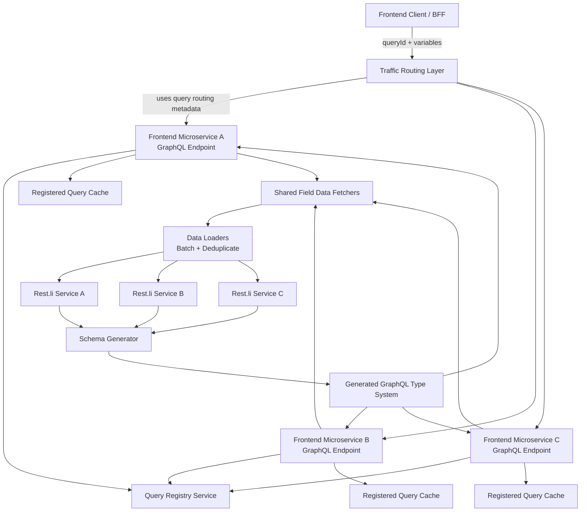
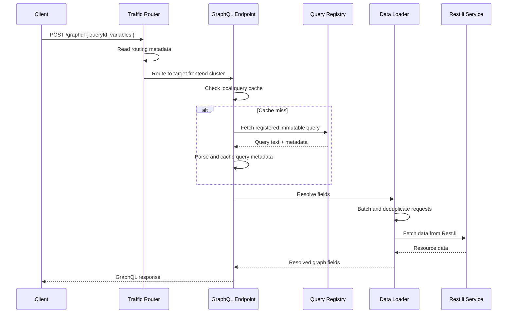

# Leadership Story: Building LinkedIn's GraphQL Architecture

> Based on LinkedIn Engineering's article: **"How LinkedIn Adopted A GraphQL Architecture for Product Development"**.
>
> Use this as an interview-ready leadership story plus technical solution for Staff Engineer / Engineering Manager interviews.

---

## 1. One-Minute Interview Answer

At LinkedIn scale, frontend teams were moving slowly because every product surface needed to understand which downstream microservices owned which data. A single page could require multiple client-to-service calls, duplicated fanout, partial failure handling, and custom query logic. LinkedIn had an internal solution called **Deco**, but it was schema-less, difficult to validate, hard to test, and lacked the developer tooling engineers expected.

As a technical leader, I would frame the GraphQL migration not as "adopting a trendy API technology," but as a **company-wide developer productivity and platform modernization initiative**. The leadership challenge was to modernize the data-fetching layer without throwing away years of investment in Rest.li microservices or forcing thousands of engineers into a risky big-bang rewrite.

The solution was pragmatic:

1. Start with a narrow scope: **read-only GraphQL for frontend use cases**.
2. Preserve the existing Rest.li ownership model by **autogenerating GraphQL schemas from Rest.li artifacts**.
3. Avoid a central gateway bottleneck by putting a **distributed GraphQL execution endpoint inside each frontend microservice**.
4. Protect production by allowing only **pre-registered queries**.
5. Support gradual migration by making Deco and GraphQL interoperate behind a consistent response format.

The result was a safer platform transition: frontend engineers could express product data needs through GraphQL, API teams could continue owning their Rest.li services, and the organization could migrate over multiple quarters instead of betting everything on one rewrite.

---

## 2. STAR Leadership Story

### Situation

LinkedIn had thousands of microservices built on **Rest.li**. This worked well for API ownership, but it created complexity for frontend and BFF teams. Product engineers had to know which service owned which data, make several network calls, handle partial failures, and duplicate fanout logic across product surfaces.

An internal library, **Deco**, helped clients describe data needs and let the library fetch data efficiently. But as hundreds of frontend engineers adopted it, the weaknesses became visible:

- No strongly validated schema.
- Cryptic proprietary query language.
- Hard-to-test client queries.
- Weak development tooling.
- Production issues caused by mismatches between client queries and response data.

The team had a strategic choice: keep investing in Deco or adopt GraphQL and build the platform around LinkedIn's scale and constraints.

### Task

The goal was to introduce GraphQL in a way that improved developer productivity across LinkedIn while preserving existing platform investments.

The leadership task was not just technical execution. It required:

- Aligning infrastructure, frontend, API, and product teams.
- Reducing migration risk.
- Avoiding a central platform bottleneck.
- Keeping service ownership clear.
- Protecting production from expensive or unsafe queries.
- Creating a path for gradual adoption instead of a forced rewrite.

### Action

I would lead this initiative in five phases.

#### Phase 1: Align on the real problem

I would first make the problem explicit: the issue was not that REST or Rest.li was broken. The issue was that product engineers needed a better abstraction for building member and customer-facing applications.

The framing matters. If we positioned GraphQL as a replacement for Rest.li, API teams would reasonably resist. Instead, I would frame GraphQL as a **client productivity layer** that sits above existing service ownership.

The principle would be:

> API teams continue to own domain services. Product teams get a graph-shaped interface for composing data.

#### Phase 2: Narrow the initial scope

Instead of trying to support everything, I would start with:

- Read operations only.
- Frontend/BFF use cases only.
- Existing Rest.li services as the source of truth.
- No big-bang migration.

This scope reduces risk. It lets the core team build the infrastructure, validate performance, and learn from early adopters before expanding to writes or service-to-service communication.

#### Phase 3: Preserve existing investments through autogenerated schemas

A common GraphQL rollout mistake is creating a second schema-authoring process. That creates duplicate ownership, review burden, and drift.

LinkedIn avoided that by generating the GraphQL type system from existing Rest.li resources, entity schemas, and relationship definitions.

This is an important leadership decision because it respects the existing organization:

- API teams keep using the tools and review process they already know.
- GraphQL schemas remain consistent with source services.
- The platform team avoids becoming a manual schema-review bottleneck.
- Adoption becomes easier because teams do not need to duplicate schema work.

To keep the generated schema safe, I would add:

- Backward compatibility checks.
- Lint rules on source schemas.
- CI validation before schema changes reach production.
- Ownership metadata so schema issues route to the correct team.

#### Phase 4: Choose a distributed execution architecture

The default industry approach is often a central GraphQL gateway. At LinkedIn scale, that could become an extra network hop, an operational bottleneck, and a single point of failure.

LinkedIn chose a different architecture: each frontend microservice includes a GraphQL query execution endpoint. This means the GraphQL endpoint is distributed across frontend services and co-located with existing Rest.li resources.

This decision has tradeoffs. It improves latency and removes the central gateway dependency, but it requires careful query routing and consistent schema availability across execution endpoints.

To make this work, I would invest in:

- Shared generated schema packages.
- Shared data fetchers.
- Shared data loaders for batching and de-duplication.
- Query metadata for routing.
- Production guardrails to ensure only valid queries execute.

#### Phase 5: Make production safe with pre-registered queries

Allowing arbitrary GraphQL queries in production is risky. Expensive nested queries can overload services, and large query payloads add overhead at scale.

The production model should require client queries to be checked into the codebase and registered during the release pipeline. At runtime, clients send only a query identifier. The execution endpoint resolves that ID from the query registry and executes the immutable registered query.

This gives three benefits:

- **Performance:** query metadata can be precomputed and cached.
- **Security:** arbitrary expensive queries are blocked.
- **Developer experience:** engineers still author raw queries during development, but production remains controlled.

### Result

The result is a practical platform migration pattern:

- GraphQL becomes the default path for new frontend read use cases.
- Existing Rest.li services continue to operate as the source of truth.
- Frontend engineers get a better data-fetching abstraction.
- API engineers avoid duplicating schema ownership.
- Production is protected through query registration and routing metadata.
- Migration can happen over multiple quarters while Deco and GraphQL interoperate.

The leadership lesson is that successful platform adoption is not about picking the best technology in isolation. It is about designing a migration path that respects existing systems, aligns multiple teams, reduces operational risk, and creates obvious value for the engineers who need to adopt it.

---

## 3. Architecture Solution

### High-Level Architecture



---

## 4. Core Design Decisions

| Decision | Why It Matters | Tradeoff |
|---|---|---|
| Generate GraphQL schemas from Rest.li artifacts | Preserves existing service ownership and avoids duplicate schema authoring | Requires strong schema generation, linting, and compatibility checks |
| Start with read-only frontend use cases | Reduces migration risk and keeps initial scope focused | Writes and backend service-to-service use cases come later |
| Distributed GraphQL endpoint in each frontend microservice | Avoids central gateway bottleneck and extra network hop | Requires routing metadata and consistent schema/runtime across services |
| Shared field data fetchers | Makes it easier for API teams to expose Rest.li data through GraphQL | Requires robust metadata and startup wiring |
| Data loaders | Batch and deduplicate downstream calls | Needs careful caching boundaries and request-scoped behavior |
| Pre-registered production queries | Improves safety, performance, and governance | Less flexible than arbitrary production queries |
| Deco interoperability | Enables gradual migration | Adds temporary compatibility layer complexity |

---

## 5. System Components

### 5.1 Schema Generator

The schema generator takes existing Rest.li artifacts and turns them into a GraphQL type system.

Inputs:

- Rest.li resource definitions.
- Entity schemas.
- Relationship definitions.
- Ownership metadata.

Outputs:

- GraphQL object types.
- Query fields.
- Field relationships.
- Resolver metadata.
- Compatibility reports.

Key responsibilities:

- Generate a consistent graph from distributed service schemas.
- Prevent incompatible schema changes.
- Enforce naming and modeling standards.
- Produce metadata for field fetchers and routing.

### 5.2 Distributed Query Execution Endpoint

Each frontend microservice includes a GraphQL endpoint by default.

Responsibilities:

- Receive `queryId` and variables.
- Resolve query from registry or local cache.
- Validate query against generated schema.
- Execute query using shared fetchers and data loaders.
- Use in-process calls when the target Rest.li resource is available locally.
- Make downstream Rest.li calls when needed.

Why this is powerful:

- No central GraphQL gateway dependency.
- Better latency for local resources.
- More predictable ownership by frontend service cluster.
- Reduced blast radius compared with one global gateway.

### 5.3 Query Registry Service

The query registry is the production safety layer.

Development flow:

1. Engineer writes GraphQL query in the client repo.
2. Local development can execute raw query.
3. CI validates the query.
4. Release pipeline registers the query.
5. Registry returns a stable query identifier.
6. Production client sends `queryId` instead of raw query text.

Runtime flow:

1. Frontend client sends `queryId` and variables.
2. GraphQL endpoint checks local query cache.
3. On cache miss, endpoint fetches the immutable query from Query Registry.
4. Endpoint caches parsed query metadata.
5. Endpoint executes safely.

### 5.4 Query Routing

Because the execution endpoint is distributed, routing matters.

A query should be routed to the frontend cluster that owns or colocates the top-level resource. This enables in-process resolution and avoids unnecessary cross-cluster calls.

Example:

```graphql
query MemberProfile($memberId: ID!) {
  member(id: $memberId) {
    id
    name
    currentCompany {
      id
      name
    }
  }
}
```

For this query, traffic should route to the cluster that owns the `member` top-level field. The member data can be resolved locally, while company data can be fetched through downstream Rest.li calls.

### 5.5 Deco Interoperability Layer

Migration cannot block product teams. Some surfaces may still use Deco while others move to GraphQL.

The interoperability layer should normalize response shape so client code can handle GraphQL-style responses regardless of whether the backend data path uses GraphQL or Deco.

Benefits:

- Enables gradual migration.
- Reduces client-side branching.
- Allows product teams to migrate use case by use case.
- Avoids a risky big-bang cutover.

---

## 6. API Design

### Register Query

```http
POST /query-registry/v1/queries
Content-Type: application/json
```

```json
{
  "application": "profile-web",
  "operationName": "MemberProfileQuery",
  "queryHash": "sha256:abc123",
  "queryText": "query MemberProfile($memberId: ID!) { member(id: $memberId) { id name } }",
  "routing": {
    "topLevelField": "member",
    "targetCluster": "identity-frontend"
  },
  "owner": "profile-platform"
}
```

Response:

```json
{
  "queryId": "profile-web:MemberProfileQuery:sha256:abc123",
  "status": "REGISTERED"
}
```

### Execute Query

```http
POST /graphql
Content-Type: application/json
```

```json
{
  "queryId": "profile-web:MemberProfileQuery:sha256:abc123",
  "variables": {
    "memberId": "123"
  }
}
```

Response:

```json
{
  "data": {
    "member": {
      "id": "123",
      "name": "Ada Lovelace"
    }
  },
  "errors": []
}
```

---

## 7. Data Model

### Query Registry Table

```sql
CREATE TABLE registered_queries (
  query_id VARCHAR(512) PRIMARY KEY,
  application VARCHAR(255) NOT NULL,
  operation_name VARCHAR(255) NOT NULL,
  query_hash VARCHAR(128) NOT NULL,
  query_text TEXT NOT NULL,
  top_level_field VARCHAR(255) NOT NULL,
  target_cluster VARCHAR(255) NOT NULL,
  owner VARCHAR(255) NOT NULL,
  created_at TIMESTAMP NOT NULL,
  created_by VARCHAR(255) NOT NULL,
  status VARCHAR(64) NOT NULL
);
```

### Schema Metadata Table

```sql
CREATE TABLE graphql_schema_metadata (
  type_name VARCHAR(255) NOT NULL,
  field_name VARCHAR(255) NOT NULL,
  restli_resource VARCHAR(255) NOT NULL,
  owner VARCHAR(255) NOT NULL,
  compatibility_version VARCHAR(128) NOT NULL,
  updated_at TIMESTAMP NOT NULL,
  PRIMARY KEY (type_name, field_name)
);
```

### Query Routing Metadata Table

```sql
CREATE TABLE query_routing_metadata (
  query_id VARCHAR(512) PRIMARY KEY,
  top_level_field VARCHAR(255) NOT NULL,
  target_cluster VARCHAR(255) NOT NULL,
  fallback_cluster VARCHAR(255),
  owner VARCHAR(255) NOT NULL,
  updated_at TIMESTAMP NOT NULL
);
```

---

## 8. Execution Flow



---

## 9. Reliability and Guardrails

### Production Safety

- Reject raw queries in production.
- Require query registration through CI/CD.
- Enforce query depth and complexity limits at registration time.
- Cache parsed query plans on the execution endpoint.
- Use schema compatibility checks before rollout.

### Performance

- Route queries to the cluster that owns the top-level field.
- Use in-process resolution when resource is colocated.
- Batch and deduplicate downstream calls with data loaders.
- Cache immutable registered query metadata.
- Avoid sending large query strings on every production request.

### Operability

- Track query latency by query ID, operation name, top-level field, and owner.
- Track downstream fanout count per query.
- Track query registry cache hit ratio.
- Alert on schema generation failures.
- Alert on compatibility-check failures.
- Provide ownership metadata for debugging.

### Migration Safety

- Support Deco and GraphQL side by side.
- Normalize response shape during transition.
- Move use cases incrementally.
- Start with low-risk read paths before critical paths.
- Require product teams to own validation of migrated surfaces.

---

## 10. Leadership Principles Demonstrated

### 10.1 Lead with constraints, not ideology

The team did not adopt GraphQL by copying the common central gateway pattern. They adapted GraphQL to LinkedIn's architecture, scale, and operational model.

Interview signal:

> I do not force a standard architecture onto a non-standard environment. I start with constraints, then design the smallest platform change that unlocks broad leverage.

### 10.2 Preserve ownership boundaries

Autogenerating the schema from Rest.li avoided creating a second source of truth. This respected API team ownership and reduced adoption friction.

Interview signal:

> For large migrations, preserving ownership is often more important than theoretical architectural purity.

### 10.3 Reduce blast radius through scope control

The initial rollout focused on read-only frontend use cases. This created a clear adoption path without expanding into writes, backend-to-backend calls, or every product surface at once.

Interview signal:

> I prefer progressive platform migrations with clear success metrics over big-bang rewrites.

### 10.4 Make the safe path the easy path

Pre-registered queries made production safer while still allowing raw query development locally.

Interview signal:

> Good platforms do not rely on every engineer remembering every rule. They encode safety into the workflow.

### 10.5 Design for migration, not just the end state

The Deco interoperability layer recognized that the migration state can last quarters. The temporary bridge was not wasted work; it was what made adoption possible.

Interview signal:

> The migration architecture is part of the product. If teams cannot adopt incrementally, the ideal end-state architecture may never arrive.

---

## 11. Interview Deep-Dive Questions and Answers

### Q1. Why not build a central GraphQL gateway?

A central gateway is simpler conceptually, but at LinkedIn scale it introduces an additional network hop, creates another service to operate, and can become a single point of failure for frontend GraphQL traffic.

A distributed endpoint lets each frontend microservice execute GraphQL locally while still sharing the same generated schema and runtime components. The tradeoff is that routing and schema consistency become more complex.

### Q2. Why pre-register queries?

Pre-registered queries solve three problems:

1. They prevent arbitrary expensive production queries.
2. They allow query metadata to be parsed, validated, and cached.
3. They reduce payload size because production clients send query IDs instead of full query text.

This is a strong fit for large-scale production systems where most client queries are known at build time.

### Q3. What are the downsides of distributed execution?

The main downsides are:

- More complex routing.
- Need for consistent schema/runtime rollout.
- Harder capacity planning without routing metadata.
- Query shape restrictions, such as limiting production queries to one top-level field when routing depends on that field.

### Q4. How would you measure success?

I would track:

- Percentage of new frontend read use cases built on GraphQL.
- Migration percentage of existing Deco use cases.
- Query latency p50/p95/p99.
- Downstream fanout count per query.
- Client development time for new surfaces.
- Production incidents related to data-fetching mismatches.
- Query registry cache hit rate.
- Schema compatibility failures caught before production.
- Developer satisfaction through surveys or feedback channels.

### Q5. How would you roll this out?

Rollout plan:

1. Build schema generator and compatibility checker.
2. Launch internal development mode with raw queries.
3. Add query registry and production query ID execution.
4. Onboard one low-risk product surface.
5. Measure latency, correctness, and developer experience.
6. Add routing metadata and in-process resolution optimization.
7. Migrate additional read use cases.
8. Make GraphQL the default for new frontend read paths.
9. Expand to writes and additional data sources after the read path is stable.

---

## 12. Staff Engineer Takeaway

The best way to tell this story in an interview is to emphasize the leadership arc:

> We had a real developer productivity problem caused by microservice data fragmentation. Instead of rewriting everything or forcing a central gateway, we designed a GraphQL architecture that fit our existing Rest.li ecosystem. We narrowed scope to read-only frontend use cases, autogenerated schemas to preserve ownership, distributed execution to avoid a gateway bottleneck, pre-registered queries for production safety, and interoperability with Deco for gradual migration. The technical design mattered, but the key leadership move was creating a migration path thousands of engineers could actually adopt.

---

## 13. Strong Closing Statement

This is the type of platform initiative where leadership is measured by adoption, not just architecture. The hard part is not proving GraphQL can work. The hard part is making it safe, observable, performant, and easy enough that product teams choose it voluntarily. A successful leader balances technical correctness with migration strategy, organizational trust, and operational guardrails.

