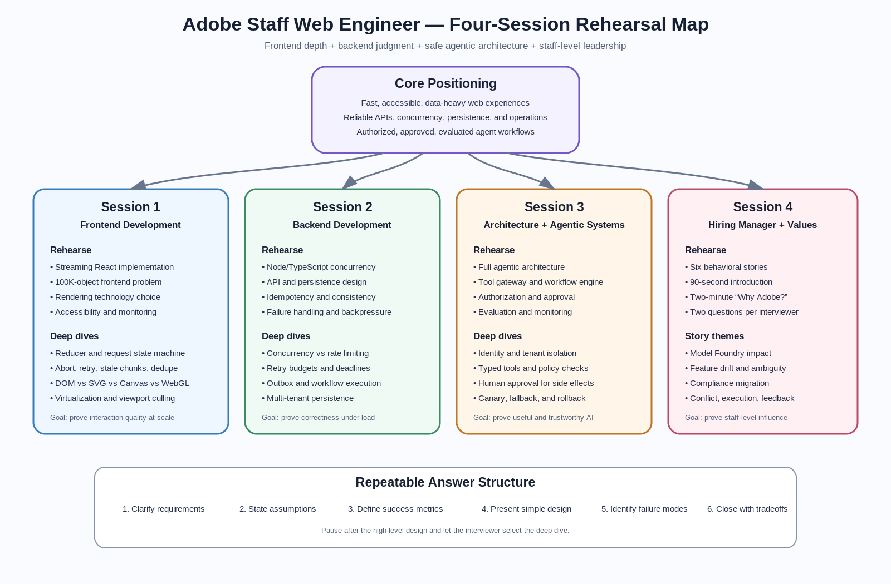

# Staff Web Engineer Interview Rehearsal




## Interview Loop Assumption

Prepare for four sessions:

| Session | Likely focus                     | What you must demonstrate                                                             |
| ------- | -------------------------------- | ------------------------------------------------------------------------------------- |
| 1       | Frontend Development             | React architecture, streaming UX, rendering performance, accessibility, observability |
| 2       | Backend Development              | Node/TypeScript concurrency, APIs, persistence, reliability, scaling                  |
| 3       | Architecture and Agentic Systems | End-to-end agent architecture, tool use, approval, authorization, evaluation          |
| 4       | Hiring Manager Values            | Leadership, execution, collaboration, customer focus, judgment                        |

Your goal is not to memorize one perfect answer. Your goal is to rehearse a repeatable decision-making structure that lets you adapt under pressure.

---

# 1. Core Rehearsal Checklist

Before the interviews, rehearse:

- One streaming React implementation
- One data-heavy frontend problem
- One Node/TypeScript concurrency problem
- One API and persistence design
- One full agentic architecture
- One deep dive into authorization and approval
- One deep dive into evaluation and monitoring
- Six behavioral stories
- A 90-second introduction
- A two-minute “Why Adobe?”
- Two questions for each interviewer

Use the same communication structure in every technical round:

1. Clarify requirements
2. State assumptions
3. Define success metrics
4. Propose the simplest viable design
5. Identify bottlenecks and failure modes
6. Deep dive where the interviewer shows interest
7. Close with tradeoffs and future evolution

---

# 2. Session 1 — Frontend Development

## What the interviewer may test

- React state architecture
- Streaming UI behavior
- Data fetching and cancellation
- Browser rendering performance
- Large-list or large-canvas rendering
- Accessibility during dynamic updates
- Memory leaks and cleanup
- Frontend observability
- Component boundaries and testability

## Rehearsal A — Streaming React Implementation

### Prompt

Design and implement a chat or AI-assistant interface that streams tokens from the server.

### Functional requirements

- User submits a prompt
- UI immediately shows the pending user message
- Assistant response streams incrementally
- User can cancel the response
- Connection failures are recoverable
- Retry does not duplicate messages
- Conversation remains usable while a response streams
- Screen-reader users receive useful updates without hearing every token

### State model

```ts
export type RequestState =
  | { status: 'idle' }
  | { status: 'loading'; requestId: string }
  | { status: 'streaming'; requestId: string; text: string }
  | { status: 'success'; requestId: string; text: string }
  | { status: 'error'; requestId: string; message: string };
```

### Architecture

```text
ChatPage
 ├── ConversationList
 │    ├── UserMessage
 │    └── AssistantMessage
 ├── StreamingStatus
 ├── Composer
 └── useStreamingChat
       ├── request lifecycle
       ├── AbortController
       ├── stream parser
       ├── reducer
       └── retry / dedupe
```

### Reducer example

```ts
interface ChatMessage {
  id: string;
  role: 'user' | 'assistant';
  content: string;
  status: 'pending' | 'streaming' | 'complete' | 'error';
}

interface State {
  messages: ChatMessage[];
  activeRequestId: string | null;
}

type Action =
  | { type: 'SUBMIT'; userMessage: ChatMessage; assistantMessage: ChatMessage; requestId: string }
  | { type: 'CHUNK'; requestId: string; messageId: string; chunk: string }
  | { type: 'COMPLETE'; requestId: string; messageId: string }
  | { type: 'FAIL'; requestId: string; messageId: string }
  | { type: 'CANCEL'; requestId: string; messageId: string };

function reducer(state: State, action: Action): State {
  switch (action.type) {
    case 'SUBMIT':
      return {
        activeRequestId: action.requestId,
        messages: [...state.messages, action.userMessage, action.assistantMessage],
      };

    case 'CHUNK':
      if (state.activeRequestId !== action.requestId) return state;
      return {
        ...state,
        messages: state.messages.map((message) =>
          message.id === action.messageId
            ? { ...message, content: message.content + action.chunk, status: 'streaming' }
            : message
        ),
      };

    case 'COMPLETE':
      if (state.activeRequestId !== action.requestId) return state;
      return {
        activeRequestId: null,
        messages: state.messages.map((message) =>
          message.id === action.messageId ? { ...message, status: 'complete' } : message
        ),
      };

    case 'FAIL':
    case 'CANCEL':
      if (state.activeRequestId !== action.requestId) return state;
      return {
        activeRequestId: null,
        messages: state.messages.map((message) =>
          message.id === action.messageId ? { ...message, status: 'error' } : message
        ),
      };

    default:
      return state;
  }
}
```

### Streaming reader

```ts
async function streamResponse(
  response: Response,
  onChunk: (chunk: string) => void,
  signal: AbortSignal
): Promise<void> {
  if (!response.body) {
    throw new Error('Streaming response body is unavailable');
  }

  const reader = response.body.getReader();
  const decoder = new TextDecoder();

  try {
    while (true) {
      if (signal.aborted) throw new DOMException('Request aborted', 'AbortError');

      const { value, done } = await reader.read();
      if (done) break;

      const text = decoder.decode(value, { stream: true });
      onChunk(text);
    }
  } finally {
    reader.releaseLock();
  }
}
```

### Performance points to discuss

- Batch token updates every 30–100 ms instead of rendering every token
- Keep streaming text local to the active message where possible
- Avoid re-rendering the entire conversation
- Use stable message IDs and memoized message components
- Virtualize long conversations
- Measure input latency, dropped frames, long tasks, and memory growth
- Abort in-flight requests when the component unmounts
- Ignore stale chunks using `requestId`

### Accessibility points

- Do not put every token into an assertive live region
- Announce “Response started,” periodic summaries, and “Response complete”
- Preserve keyboard focus in the composer
- Expose cancel and retry controls with clear labels
- Respect reduced-motion preferences

### Likely deep-dive questions

- SSE vs `fetch()` streaming vs WebSocket
- How to resume after disconnect
- How to prevent duplicate responses after retry
- How to handle markdown that is incomplete mid-stream
- How to avoid auto-scroll fighting the user
- How to test a streaming reducer

### Strong closing statement

> I would optimize first for correctness of the request lifecycle, then interaction responsiveness, and finally rendering efficiency. The biggest frontend risks are stale chunks, excessive re-renders, inaccessible announcements, and memory growth during long sessions.

---

## Rehearsal B — Data-Heavy Frontend Problem

### Prompt

Design a dashboard or editor that renders 100,000 objects with filtering, selection, zooming, and live updates.

### Requirement questions

- Are all 100,000 objects visible simultaneously?
- Is the interaction list-based, canvas-based, or spatial?
- What is the target frame rate?
- How often does data change?
- Is SEO required?
- Must the experience work on lower-end devices?
- Is exact visual fidelity more important than semantic DOM accessibility?

### Rendering decision

| Technology           | Best use                                  | Weakness                              |
| -------------------- | ----------------------------------------- | ------------------------------------- |
| DOM + virtualization | Tables, lists, accessible records         | Poor for thousands of spatial objects |
| SVG                  | Moderate node count, rich interactions    | DOM overhead becomes expensive        |
| Canvas 2D            | Large spatial scenes, custom rendering    | Manual hit testing and accessibility  |
| WebGL                | Very large scenes and GPU-heavy rendering | Complexity, text rendering, debugging |

### Recommended architecture

```text
Server snapshot + delta stream
          ↓
Normalized entity store
          ↓
Viewport query / spatial index
          ↓
Render scheduler
          ↓
Canvas or WebGL renderer
          ↓
DOM accessibility and interaction overlay
```

### Key design ideas

- Keep the canonical model separate from rendered objects
- Store entities by ID
- Apply ordered deltas to a known snapshot version
- Render only objects intersecting the viewport
- Use a quadtree or R-tree for spatial lookup
- Move expensive filtering or layout to a Web Worker
- Use `requestAnimationFrame` to coalesce updates
- Degrade detail while zoomed out
- Keep selection and keyboard controls in a DOM overlay

### Performance budget

- Input response: under 100 ms
- Pan and zoom: target 60 FPS, acceptable floor 30 FPS
- Main-thread tasks: under 50 ms
- Initial useful render: under 2 seconds on target hardware
- Memory: bounded despite long-running live updates

### Observability

Measure:

- Time to first useful visualization
- Render duration by layer
- Number of visible objects
- Dropped frames
- Main-thread long tasks
- Worker queue depth
- Heap size and detached nodes
- Delta lag between server and client

### Likely deep dives

- Canvas vs WebGL
- Virtualization for non-list content
- Snapshot plus delta consistency
- Reconnection and sequence gaps
- Undo/redo for large models
- Memory leak debugging
- Browser rendering pipeline

---

# 3. Session 2 — Backend Development

## What the interviewer may test

- Node.js event loop knowledge
- Concurrency limiting
- Backpressure
- API contracts
- Persistence modeling
- Idempotency
- Consistency
- Retry behavior
- Observability
- Multi-tenant safety

## Rehearsal C — Node/TypeScript Concurrency Problem

### Prompt

Call multiple downstream services for a batch of items while limiting concurrency, preserving result order, supporting cancellation, and returning partial failures.

### Requirements

- At most `N` requests in flight
- Results correspond to original input order
- One failure does not fail the whole batch
- Caller can cancel
- Downstream 429 and 5xx responses are retried selectively
- Retries have bounded exponential backoff and jitter
- Queue depth and latency are observable

### Implementation

```ts
export type SettledResult<T> = { ok: true; value: T } | { ok: false; error: Error };

export async function mapWithConcurrency<T, R>(
  items: readonly T[],
  concurrency: number,
  worker: (item: T, index: number, signal: AbortSignal) => Promise<R>,
  signal: AbortSignal
): Promise<Array<SettledResult<R>>> {
  if (!Number.isInteger(concurrency) || concurrency < 1) {
    throw new Error('concurrency must be a positive integer');
  }

  const results = new Array<SettledResult<R>>(items.length);
  let nextIndex = 0;

  async function runWorker(): Promise<void> {
    while (true) {
      if (signal.aborted) {
        throw new DOMException('Operation aborted', 'AbortError');
      }

      const currentIndex = nextIndex++;
      if (currentIndex >= items.length) return;

      try {
        const value = await worker(items[currentIndex], currentIndex, signal);
        results[currentIndex] = { ok: true, value };
      } catch (error) {
        results[currentIndex] = {
          ok: false,
          error: error instanceof Error ? error : new Error(String(error)),
        };
      }
    }
  }

  const workerCount = Math.min(concurrency, items.length);
  await Promise.all(Array.from({ length: workerCount }, () => runWorker()));

  return results;
}
```

### What to discuss beyond the code

- This limits application concurrency, but not necessarily global concurrency across pods
- A distributed rate limiter may be required for provider-wide QPS
- Queue length must be bounded to avoid memory exhaustion
- Backpressure can reject, shed, delay, or downgrade requests
- Retries consume capacity and can amplify outages
- Use separate budgets for interactive and background traffic
- Add circuit breakers for unhealthy dependencies
- Use deadlines, not only per-attempt timeouts

### Global QPS extension

For a provider with 1,000 QPS shared across data centers:

```text
Global budget: 1,000 QPS
        ↓
Regional allocation based on healthy demand
        ↓
Pod lease / token allocation
        ↓
Local concurrency limiter
        ↓
Provider API
```

Discuss:

- Static allocation as a safe baseline
- Dynamic proportional-demand allocation
- Reserved capacity for critical traffic
- Lease expiry when pods disappear
- Fast local enforcement; slower global reconciliation
- Avoid using ZooKeeper as a per-request counter
- Use a coordinator for leases, not high-frequency request accounting

### Likely deep dives

- Event loop vs worker threads
- CPU-bound vs I/O-bound workloads
- Promise pool fairness
- Rate limiting vs concurrency limiting
- Backpressure strategies
- Retry storms
- Distributed token buckets

---

## Rehearsal D — API and Persistence Design

### Prompt

Design the API and persistence layer for an AI assistant that can answer questions, generate artifacts, and perform approved actions.

### Core entities

```ts
interface Conversation {
  id: string;
  tenantId: string;
  userId: string;
  title?: string;
  createdAt: string;
  updatedAt: string;
}

interface Message {
  id: string;
  conversationId: string;
  role: 'user' | 'assistant' | 'tool' | 'system';
  content: unknown;
  status: 'pending' | 'streaming' | 'complete' | 'failed';
  createdAt: string;
}

interface AgentRun {
  id: string;
  conversationId: string;
  requestedBy: string;
  status: 'queued' | 'running' | 'waiting_for_approval' | 'completed' | 'failed';
  model: string;
  policyVersion: string;
  createdAt: string;
}

interface ToolInvocation {
  id: string;
  runId: string;
  toolName: string;
  argumentsHash: string;
  status: 'proposed' | 'approved' | 'executing' | 'succeeded' | 'failed';
  riskLevel: 'low' | 'medium' | 'high';
}

interface Approval {
  id: string;
  invocationId: string;
  requestedFrom: string;
  decision?: 'approved' | 'rejected';
  expiresAt: string;
}
```

### API sketch

```http
POST /v1/conversations
POST /v1/conversations/{conversationId}/messages
GET  /v1/conversations/{conversationId}/events
POST /v1/runs/{runId}/cancel
GET  /v1/runs/{runId}
POST /v1/tool-invocations/{invocationId}/approve
POST /v1/tool-invocations/{invocationId}/reject
GET  /v1/conversations/{conversationId}/messages?cursor=...
```

### Persistence choices

| Data                           | Suggested store                        | Reason                                            |
| ------------------------------ | -------------------------------------- | ------------------------------------------------- |
| Conversations, runs, approvals | PostgreSQL                             | Transactions, constraints, auditability           |
| Large generated artifacts      | Object storage                         | Cost, scale, direct upload/download               |
| Semantic retrieval documents   | Vector index plus source store         | Similarity search with source-of-truth separation |
| Ephemeral stream state         | Redis                                  | Fast short-lived state and pub/sub                |
| Audit events                   | Append-only event store or durable log | Investigation and compliance                      |
| Analytics                      | Warehouse / lake                       | Aggregation without loading the transactional DB  |

### Consistency and reliability

- Use an idempotency key on message submission and action execution
- Insert the run and outbox event in one transaction
- Publish asynchronously from the outbox
- Give every tool execution a stable invocation ID
- Store approval decision before action execution
- Enforce uniqueness so an approved action cannot execute twice
- Use optimistic concurrency for conversation updates
- Use cursor pagination for long histories

### Example transaction boundary

```text
BEGIN
  Insert user message
  Insert agent run
  Insert outbox event: AgentRunRequested
COMMIT

Outbox worker → queue → agent orchestrator
```

### Failure cases to rehearse

- Client retries after timeout
- Worker crashes after external action succeeds but before DB update
- Approval expires during execution
- Tool response is too large
- Conversation is deleted while a run is active
- Tenant access changes during a long-running run
- Database is healthy but the model provider is degraded

---

# 4. Session 3 — Architecture and Agentic Systems

## Rehearsal E — Full Agentic Architecture

### Prompt

Design an AI assistant for marketers that can answer questions, analyze campaign data, generate content, and perform approved actions.

### Functional requirements

- Conversational questions over campaign and audience data
- Tool-based retrieval from Adobe systems
- Content generation with brand constraints
- Proposed changes before execution
- Human approval for high-impact actions
- Streaming response and progress updates
- Citations or evidence for factual claims
- Multi-turn context
- Admin policy controls

### Non-functional requirements

- Tenant isolation
- Low latency for simple questions
- Durable long-running workflows
- Explainable actions
- Auditable decisions
- Graceful degradation
- Cost controls
- Privacy and data residency
- Reliable evaluation and rollback

### High-level architecture

```text
Web Client
   ↓ HTTPS / SSE
API Gateway
   ↓
Conversation Service ───────────────→ PostgreSQL
   ↓
Agent Orchestrator ─────────────────→ Workflow Engine
   ├── Context Builder
   ├── Planner / Router
   ├── Policy Engine
   ├── Tool Gateway
   ├── Approval Service
   └── Response Composer
           ↓
Model Gateway → LLM providers / models
           ↓
Tool Gateway → Campaign APIs / Analytics / Content / Search
           ↓
Evaluation + Tracing + Audit Pipeline
```

### Agent loop

```text
1. Receive request
2. Authenticate user and resolve tenant
3. Load relevant conversation context
4. Classify intent and risk
5. Build a bounded tool and data context
6. Ask model for a structured plan or next action
7. Validate tool name and arguments
8. Authorize the proposed tool call
9. Request approval when required
10. Execute through the tool gateway
11. Validate and normalize tool output
12. Continue or compose the final answer
13. Persist trace, evidence, cost, latency, and evaluation signals
```

### Important boundaries

#### Model gateway

- Centralizes provider selection
- Applies timeouts and retry rules
- Tracks token use and cost
- Redacts sensitive fields
- Supports model fallback
- Enables version pinning and rollback

#### Tool gateway

- Exposes a typed allowlist of tools
- Validates JSON schema
- Injects trusted identity server-side
- Applies per-tool authorization
- Adds idempotency keys
- Enforces deadlines and response-size limits
- Records immutable audit events

#### Workflow engine

Use for:

- Waiting on human approval
- Long-running content generation
- Multi-step campaign updates
- Retries over minutes or hours
- Compensation after partial completion

Do not use it for every token or simple synchronous read.

### Context strategy

- Keep recent messages verbatim within a token budget
- Summarize older context
- Retrieve tenant-authorized source documents
- Attach source metadata and timestamps
- Separate user-provided text from trusted system context
- Treat retrieved content as untrusted data, not instructions

### Latency budget example

| Stage                      |                           Target |
| -------------------------- | -------------------------------: |
| Authentication and routing |                            50 ms |
| Context fetch              |                       100–300 ms |
| First model decision       |                       300–900 ms |
| First visible progress     |                   under 1 second |
| Tool call                  |              dependency-specific |
| First response token       | under 2 seconds for common reads |

### Graceful degradation

- If retrieval fails, say which source is unavailable
- If the preferred model is down, use a compatible fallback
- If action tools are unavailable, provide a read-only plan
- If policy evaluation times out, fail closed for actions
- If monitoring is degraded, block high-risk execution or reduce capability

---

## Rehearsal F — Authorization and Approval Deep Dive

### Key principle

Authentication proves who the user is. Authorization decides what that user may do. Approval confirms whether a specific high-impact action should proceed now.

These are separate controls.

### Authorization layers

```text
User identity
   ↓
Tenant membership
   ↓
Product role / RBAC
   ↓
Resource-level access
   ↓
Action-level permission
   ↓
Contextual policy
   ↓
Approval requirement
```

### Strong design rules

- Never trust the model to decide authorization
- Never let the client supply authoritative tenant or role claims
- Resolve identity and permissions server-side
- Authorize every tool call, not only the initial chat request
- Filter retrieval results before they enter the prompt
- Re-check authorization immediately before executing a delayed action
- Use least-privilege service credentials
- Separate read tools from mutation tools

### Policy input example

```ts
interface AuthorizationInput {
  principal: {
    userId: string;
    tenantId: string;
    roles: string[];
  };
  resource: {
    type: string;
    id: string;
    tenantId: string;
    ownerId?: string;
  };
  action: string;
  context: {
    environment: 'test' | 'production';
    estimatedSpend?: number;
    affectedAudienceSize?: number;
    dataSensitivity?: 'public' | 'internal' | 'restricted';
  };
}
```

### Approval matrix

| Action                 | Example                         | Approval                          |
| ---------------------- | ------------------------------- | --------------------------------- |
| Read                   | Fetch campaign status           | None if authorized                |
| Draft                  | Generate proposed copy          | Usually none                      |
| Reversible low impact  | Update a draft name             | Optional                          |
| External communication | Publish content                 | Required                          |
| Financial impact       | Increase campaign spend         | Required, possibly two-person     |
| Destructive            | Delete campaign or asset        | Required with strong confirmation |
| Sensitive data         | Export restricted audience data | Elevated role and approval        |

### Approval lifecycle

```text
Tool call proposed
   ↓
Policy evaluates risk
   ↓
Approval request created
   ↓
User sees exact action, scope, diff, cost, and expiry
   ↓
User approves or rejects
   ↓
Authorization is re-checked
   ↓
Action executes once with idempotency key
   ↓
Result and audit record are persisted
```

### Approval UX must show

- Exact resource being changed
- Before and after values
- Estimated impact
- External side effects
- Cost or audience implications
- Who requested the action
- Approval expiration
- Clear reject and edit paths

### Confused deputy defense

The agent must not use its broader service permissions to perform an action that the end user cannot perform.

Mitigations:

- Propagate user identity or a constrained delegation token
- Scope credentials to the requested action
- Use policy checks at the tool gateway
- Bind approval to exact normalized arguments
- Reject changed arguments after approval

### Audit record

Capture:

- User identity
- Tenant
- Policy version
- Model version
- Tool name
- Normalized arguments hash
- Approval decision
- Executor identity
- External response ID
- Timestamp and trace ID

---

## Rehearsal G — Evaluation and Monitoring Deep Dive

### Evaluation categories

| Category         | Question                                         |
| ---------------- | ------------------------------------------------ |
| Task success     | Did the agent solve the user’s request?          |
| Factuality       | Are claims supported by current evidence?        |
| Tool correctness | Did it choose and call the correct tool?         |
| Authorization    | Did it stay within allowed access?               |
| Safety           | Did it avoid prohibited or dangerous actions?    |
| UX quality       | Was the result clear, timely, and controllable?  |
| Efficiency       | Did it use reasonable latency, tokens, and cost? |
| Reliability      | Did it recover correctly from failures?          |

### Offline evaluation

Build a versioned dataset containing:

- Common user questions
- Long-tail and ambiguous prompts
- Permission-denied cases
- Prompt-injection attempts
- Tool failures and timeouts
- Approval-required actions
- Multi-turn context cases
- High-value business workflows

For every test case, store:

- Input conversation
- User and tenant permissions
- Available tools
- Expected tool sequence or acceptable alternatives
- Expected answer properties
- Forbidden actions

### Online monitoring

#### System metrics

- Request rate
- First-token latency
- End-to-end latency
- Tool latency and error rate
- Queue depth
- Timeout rate
- Model fallback rate
- Token and dollar cost
- Approval wait time

#### Quality metrics

- User correction rate
- Retry or regenerate rate
- Abandonment rate
- Tool-call success rate
- Unsupported-claim rate
- Citation coverage
- Approval rejection rate
- Escalation rate
- Human-rated task success

#### Security metrics

- Authorization denial rate
- Cross-tenant access attempts
- Prompt-injection detections
- Unexpected tool usage
- High-risk action volume
- Approval bypass attempts

### Trace model

```text
Request trace
 ├── authentication span
 ├── context retrieval span
 ├── model decision span
 ├── policy check span
 ├── tool execution span
 ├── approval wait span
 ├── response generation span
 └── evaluation events
```

### Release strategy

1. Run offline regression suite
2. Shadow production traffic with no side effects
3. Review quality and safety deltas
4. Canary to a small tenant or user percentage
5. Enable read-only capabilities first
6. Enable low-risk mutations
7. Enable high-risk actions behind approval
8. Maintain fast rollback by model, prompt, policy, and tool version

### Alert examples

- Tool error rate exceeds baseline
- P95 first-token latency regresses
- Authorization denials suddenly drop to zero
- Approval bypass metric is non-zero
- Unsupported-claim score increases
- Cost per successful task exceeds threshold
- A specific model version causes higher user correction rates

### Important interview point

Do not claim that one LLM-as-judge score is sufficient. Combine deterministic checks, policy assertions, human review, user behavior, and model-based evaluation.

---

# 5. Session 4 — Hiring Manager and Adobe Values

## What the interviewer may test

- Why Adobe and why this role
- Staff-level influence
- Technical judgment
- Collaboration across functions
- Execution under ambiguity
- Handling disagreement
- Customer focus
- Learning from failure
- Raising engineering standards
- Moving from management back toward an IC or technical-lead role

---

# 6. Six Behavioral Stories

Prepare each story in a compact STAR-L format:

- **Situation:** Business and technical context
- **Task:** Your responsibility and stakes
- **Action:** Decisions, influence, and execution
- **Result:** Measurable outcome
- **Learning:** What changed in your leadership approach

## Story 1 — Model Foundry observability

### Theme

Customer focus, platform thinking, cross-team alignment, performance.

### Core arc

Model owners could not quickly identify active model versions, health, ownership, or whether failures came from training, features, or serving. You aligned product engineers, training, serving, data, and observability partners around a shared model identity and metric contract. You delivered Model Foundry views, improved key page latency, and reduced investigation time from days toward seconds or minutes.

### Highlight

- Unified fragmented data
- Clarified ownership boundaries
- Improved performance from roughly 12–15 seconds to under 4 seconds for active models
- Made incident investigation materially faster

### Likely follow-ups

- What did you personally design?
- Where did teams disagree?
- How did you validate adoption?
- What would you do differently?

---

## Story 2 — Feature drift detection

### Theme

Technical depth, ambiguity, scalable execution.

### Core arc

Different teams disagreed on drift definitions, sampling, sparse features, and serving-versus-training ownership. You established metric definitions, sampling strategy, rollout stages, and observability. You partnered with more than ten product and platform engineers and created a design that handled high- and low-traffic models.

### Highlight

- Resolved metric-definition conflict
- Balanced accuracy with infrastructure cost
- Designed safe ramp-up and fallback behavior
- Improved trust in feature health signals

---

## Story 3 — AI Studio sunset and compliance migration

### Theme

Execution, governance, change management.

### Core arc

A legacy workflow had to be deprecated against a fixed compliance deadline. You coordinated model-card validation, migration tooling, ownership, legal and governance requirements, fallback behavior, and communication across many consumers.

### Highlight

- Turned a compliance deadline into a phased migration plan
- Built validators, templates, automation, and fallback rules
- Reduced manual migration risk
- Maintained business continuity while enforcing governance

---

## Story 4 — Disagreement between senior engineers

### Theme

Influence without authority, decision quality.

### Structure

- Two senior engineers advocated materially different architectures
- You clarified decision criteria before debating solutions
- You separated reversible from irreversible choices
- You requested a targeted prototype or benchmark
- You documented the decision and dissent
- You set a review point based on production evidence

### Strong point

The goal was not consensus at any cost. The goal was a clear, evidence-based decision with committed execution.

---

## Story 5 — Incomplete product requirements during execution

### Theme

Operating under ambiguity.

### Structure

- Product requirements were still changing during implementation
- You identified decisions that blocked architecture versus decisions that could remain flexible
- You created a decision log and explicit assumptions
- You defined an MVP contract and extension points
- You added checkpoints with product and design
- You protected the launch while avoiding large speculative investment

### Strong point

You created clarity without pretending uncertainty had disappeared.

---

## Story 6 — Feedback that the team was not delivering enough

### Theme

Accountability, self-awareness, delivery leadership.

### Structure

- Leadership perceived delivery as too slow or insufficiently visible
- You did not defend the team reflexively
- You separated actual throughput issues from visibility and prioritization issues
- You reduced work in progress
- You clarified milestone ownership
- You made risks and dependencies visible
- You established measurable delivery and quality indicators

### Strong point

Explain what you changed in your own operating model, not only what the team changed.

---

# 7. Ninety-Second Introduction

Use this as a rehearsal script, not a word-for-word requirement.

```text
I’m a staff-level full-stack and frontend-focused engineer with more than a decade of experience building product interfaces and platform systems. At LinkedIn, I worked across React and TypeScript applications, backend services, data systems, and MLOps infrastructure. I also led engineering teams, which strengthened how I align stakeholders, define ownership, and turn ambiguous platform problems into measurable product outcomes.

A major part of my recent work was Model Foundry, where model owners needed a reliable way to understand active versions, health, ownership, and failures across training and serving systems. I helped align multiple platform and product teams on shared contracts, delivered the user experience and supporting architecture, improved important page latency from double-digit seconds to a few seconds, and made operational investigation much faster.

I’m now intentionally focusing on staff-level IC and technical-lead roles where I can combine deep frontend architecture, backend and platform judgment, and cross-functional leadership. Adobe is especially compelling because the problems sit at the intersection of sophisticated web experiences, creative workflows, enterprise platforms, and agentic AI—exactly the kind of end-to-end product and architecture work where I do my best work.
```

## Delivery guidance

- Spend about 25 seconds on background
- Spend about 35 seconds on one signature impact story
- Spend about 20 seconds on what you want next
- Spend about 10 seconds connecting to Adobe

Avoid listing every technology or every project.

---

# 8. Two-Minute “Why Adobe?”

```text
Adobe is compelling to me for three reasons.

First, Adobe operates at the intersection of creativity, productivity, data, and enterprise workflows. The frontend challenges are not superficial UI problems—they involve high-performance editors, large and complex data models, collaboration, accessibility, and experiences used by both experts and everyday users. That fits my background in building responsive React and TypeScript experiences on top of complex platform systems.

Second, Adobe has a meaningful opportunity to make agentic AI useful inside real workflows rather than treating AI as a separate chat surface. The interesting architecture is not only calling a model. It is grounding the model in trusted product data, giving it typed tools, enforcing authorization, introducing approval for consequential actions, and measuring whether the result is actually correct and useful. My recent work in MLOps observability, model metadata, governance, and AI-assistant design maps directly to those challenges.

Third, I’m looking for a staff-level role where I can remain deeply technical while influencing architecture and execution across teams. My experience as both a staff engineer and engineering manager taught me how to connect product intent, frontend architecture, backend contracts, operational ownership, and stakeholder alignment. I want to bring that combination back into a strong IC role.

What makes Adobe particularly attractive is that the technical quality of the experience directly affects creative flow and customer trust. Performance, reliability, accessibility, and responsible AI are all product features. I would be excited to help Adobe build web and agentic experiences that feel fast, understandable, safe, and genuinely useful.
```

## Personalization prompts

Add one specific Adobe product or problem depending on the interviewer:

- Creative Cloud: editor performance and collaborative workflows
- Experience Cloud: data-heavy enterprise UI and marketer workflows
- Acrobat: document intelligence and trusted actions
- Firefly: responsible generation, evaluation, provenance, and UX

---

# 9. Questions for Each Interviewer

Prepare two primary questions and one backup for every session.

## Session 1 — Frontend interviewer

### Primary question 1

> What are the hardest frontend performance or architecture problems this team is working through today, and where do you expect a staff engineer to set direction rather than only deliver within the current architecture?

### Primary question 2

> How does the team balance shared design-system standards with the specialized interaction and rendering needs of individual Adobe products?

### Backup

> How do frontend engineers measure experience quality in production beyond page-load metrics—for example interaction latency, editor responsiveness, accessibility, or long-session memory behavior?

---

## Session 2 — Backend interviewer

### Primary question 1

> Which backend reliability or scale constraints most shape the user experience for this team—latency, dependency fan-out, data consistency, multi-tenancy, or something else?

### Primary question 2

> How are API and ownership boundaries divided between product teams and platform teams, and where do those boundaries create the most friction today?

### Backup

> When the team introduces a new platform capability, how do you approach migration, backward compatibility, and operational ownership across many consumers?

---

## Session 3 — Architecture and Agentic Systems interviewer

### Primary question 1

> Where is Adobe drawing the boundary between model reasoning and deterministic product logic, especially for authorization, approvals, and actions with external side effects?

### Primary question 2

> How does the team evaluate agent quality in production, and which gaps are currently hardest: factuality, tool selection, workflow completion, latency, cost, or user trust?

### Backup

> How do product teams share common agent infrastructure while still experimenting with domain-specific tools, prompts, and interaction models?

---

## Session 4 — Hiring manager

### Primary question 1

> What would distinguish an excellent staff engineer on this team after six to twelve months, both technically and in how they influence the organization?

### Primary question 2

> Which cross-team or product problems need stronger ownership today, and what has made them difficult to solve so far?

### Backup

> How do you expect this role to balance hands-on implementation, architectural leadership, mentoring, and stakeholder alignment?

---

# 10. Four-Session Rehearsal Schedule

## Rehearsal Session 1 — Frontend

### 60-minute practice

|      Time | Activity                                                  |
| --------: | --------------------------------------------------------- |
|   0–5 min | Deliver introduction and clarify prompt                   |
|  5–25 min | Build streaming React design or implementation            |
| 25–40 min | Data-heavy frontend architecture                          |
| 40–50 min | Performance, accessibility, testing, monitoring deep dive |
| 50–55 min | Summarize tradeoffs                                       |
| 55–60 min | Ask frontend questions                                    |

### Score yourself on

- Did I define a state machine?
- Did I handle cancellation and stale responses?
- Did I discuss browser and rendering costs?
- Did I address accessibility?
- Did I identify measurable performance targets?

---

## Rehearsal Session 2 — Backend

### 60-minute practice

|      Time | Activity                                          |
| --------: | ------------------------------------------------- |
|   0–5 min | Clarify scale, reliability, and consistency       |
|  5–20 min | Solve Node/TypeScript concurrency problem         |
| 20–40 min | Design API and persistence model                  |
| 40–50 min | Failure modes, retries, idempotency, backpressure |
| 50–55 min | Summarize tradeoffs                               |
| 55–60 min | Ask backend questions                             |

### Score yourself on

- Did I distinguish concurrency from rate limiting?
- Did I bound queues and retries?
- Did I define transaction boundaries?
- Did I cover idempotency?
- Did I explain operational ownership?

---

## Rehearsal Session 3 — Architecture and Agentic Systems

### 60-minute practice

|      Time | Activity                                       |
| --------: | ---------------------------------------------- |
|   0–8 min | Requirements, users, and risk classification   |
|  8–25 min | End-to-end architecture                        |
| 25–38 min | Authorization and approval deep dive           |
| 38–50 min | Evaluation, monitoring, rollout, failure modes |
| 50–55 min | Summarize trust and reliability model          |
| 55–60 min | Ask agentic-system questions                   |

### Score yourself on

- Did I keep authorization outside the LLM?
- Did I separate planning from execution?
- Did I define approval semantics?
- Did I cover evaluation beyond model judging?
- Did I discuss graceful degradation and rollback?

---

## Rehearsal Session 4 — Hiring Manager

### 30–45-minute practice

|      Time | Activity                             |
| --------: | ------------------------------------ |
|   0–2 min | Introduction                         |
|   2–4 min | Why Adobe                            |
|  4–28 min | Three to four behavioral stories     |
| 28–35 min | Role motivation and leadership style |
| 35–40 min | Ask hiring-manager questions         |

### Score yourself on

- Did I answer the exact question first?
- Did I state my personal contribution?
- Did I quantify the result?
- Did I explain conflict and tradeoffs honestly?
- Did I include what I learned?

---

# 11. Interview Communication Guardrails

## For technical answers

- Start with the simplest design that meets the stated requirements
- Name the top two risks before exploring edge cases
- Pause after presenting the high-level architecture
- Let the interviewer choose the deep dive
- Use explicit tradeoff language
- Close with metrics and failure modes

## For behavioral answers

- Keep the initial answer under three minutes
- State your role clearly
- Avoid saying only “we”
- Explain the decision, not every implementation detail
- Quantify the outcome
- End with the lesson and how it changed your behavior

## When you feel yourself over-answering

Use this reset:

> The main decision is **_. I chose it because _**. The largest tradeoff is \_\_\_. I can go deeper into implementation, scale, or failure handling.

---

# 12. Final Readiness Checklist

## Frontend

- [ ] I can code a streaming reducer without looking it up
- [ ] I can explain cancellation, stale chunks, retry, and dedupe
- [ ] I can choose DOM, SVG, Canvas, or WebGL with clear tradeoffs
- [ ] I can discuss virtualization and viewport rendering
- [ ] I can discuss accessibility for dynamic content

## Backend

- [ ] I can implement a bounded concurrency pool
- [ ] I can distinguish concurrency, throughput, and rate limits
- [ ] I can design APIs with idempotency and cursor pagination
- [ ] I can define persistence and transaction boundaries
- [ ] I can discuss retries, deadlines, circuit breakers, and backpressure

## Agentic architecture

- [ ] I can draw the full request flow from UI to model to tools
- [ ] I can explain context construction and prompt-injection boundaries
- [ ] I can design server-side authorization for every tool call
- [ ] I can design human approval for consequential actions
- [ ] I can define offline and online evaluation
- [ ] I can explain monitoring, canarying, fallback, and rollback

## Behavioral

- [ ] I have six distinct stories
- [ ] Each story has a measurable result
- [ ] Each story explains my personal role
- [ ] I can deliver my introduction in 90 seconds
- [ ] I can deliver “Why Adobe?” in two minutes
- [ ] I have two questions for each interviewer

---

# 13. One-Page Mental Model

```text
Session 1: Can you build a fast, accessible, reliable web experience?
Session 2: Can you design correct and scalable services behind it?
Session 3: Can you make an agent useful, safe, authorized, and measurable?
Session 4: Can you lead through ambiguity and raise the effectiveness of others?
```

Your strongest positioning is the combination of:

```text
Deep frontend architecture
        +
Backend and platform judgment
        +
MLOps and agentic-system experience
        +
Cross-team leadership
```
