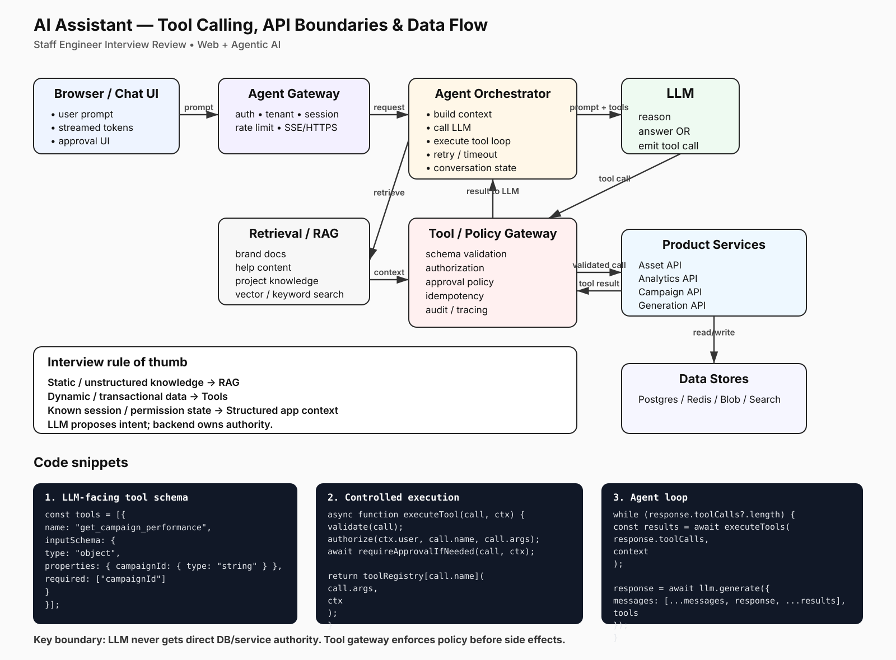
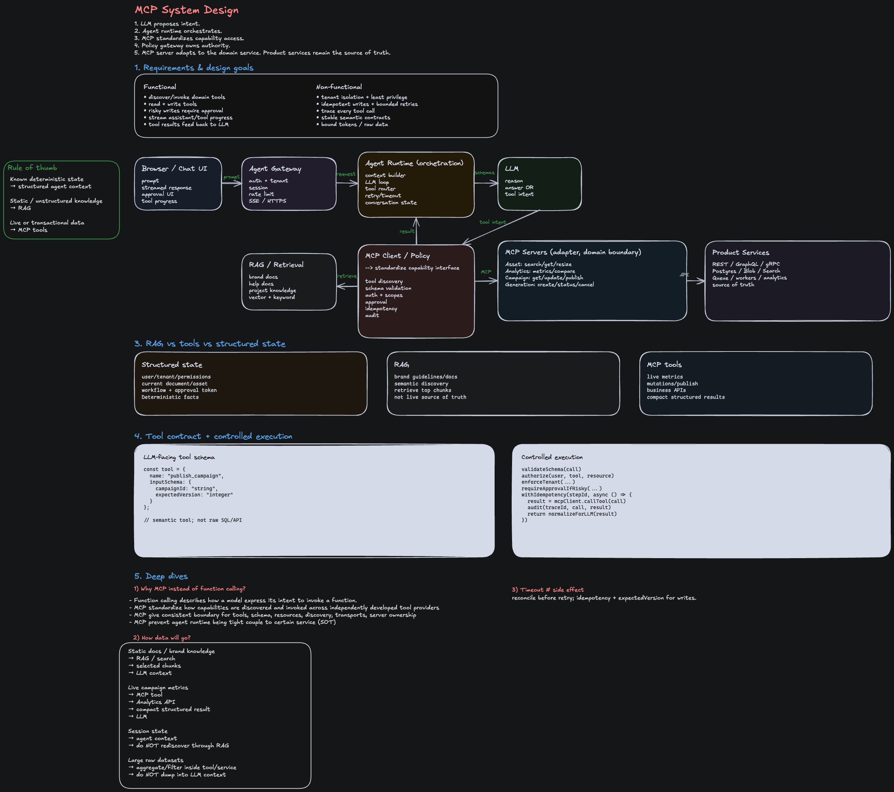

---

## What to Focus On

**The core principle that earns staff-level signal:** LLM proposes intent; backend owns authority. The architecture separates reasoning (LLM) from execution (services) via a **strictly controlled tool-calling layer**.

| Component               | Responsibility                                                              | Key concern                                              |
| ----------------------- | --------------------------------------------------------------------------- | -------------------------------------------------------- |
| **Browser/Chat UI**     | Capture user prompt, stream tokens, show approval prompts                   | UX responsiveness, real-time feedback                    |
| **Agent Gateway**       | Auth, tenant isolation, session, rate limit, SSE/HTTPS                      | Security, per-tenant fairness                            |
| **Agent Orchestrator**  | Build context, call LLM, loop on tool calls, manage state                   | Retry logic, token budget, conversation history          |
| **LLM**                 | Reason about intent, emit tool calls or final answer                        | Accuracy, instruction following                          |
| **Tool/Policy Gateway** | Validate schema, authorize, require approval if needed, idempotency         | Safety, auditability, preventing unintended side effects |
| **RAG (Retrieval)**     | Static/unstructured knowledge (brand docs, help content, project knowledge) | Freshness, relevance, context quality                    |
| **Product Services**    | Asset API, Analytics API, Campaign API, Generation API                      | Availability, rate limiting, transactional correctness   |
| **Data Stores**         | Postgres/Redis/Blob/Search — source of truth                                | Consistency, read-your-write semantics                   |

**The rule of thumb:**

- **Static/unstructured knowledge** → RAG
- **Dynamic/transactional data** → Tools
- **Known session/permission state** → Structured app context (passed to orchestrator on every request)
- **LLM proposes → backend validates and owns the final decision**

---

## The Five API Boundaries

This diagram shows five critical boundaries where security, consistency, and user trust happen. Failing at any one breaks the system.

### 1. Browser ↔ Agent Gateway (Auth & Tenant Isolation)

**The problem:** A user's prompt must not leak to another tenant, and the session must be validated before the agent even looks at the request.

**What happens:**

```
Browser
  └─ POST /api/agent/chat
       ├─ Authentication token (JWT, session cookie)
       ├─ User prompt
       ├─ Conversation history (if resuming)
       └─ Optional: overrides (model, temperature)

Agent Gateway
  ├─ Verify token → extract user_id, tenant_id, permissions
  ├─ Rate limit per tenant & user
  ├─ Establish SSE stream back to browser
  ├─ Pass context to Orchestrator:
  │   {
  │     user_id, tenant_id, permissions,
  │     session_id, request_id, timestamp
  │   }
  └─ Stream tokens + tool approval prompts to browser
```

**Interview question:** "How would you prevent a user from accessing another tenant's campaigns?"

**Answer:** Auth is validated at the gateway, and the `tenant_id` extracted from the token is **threaded through every downstream call**. A tool like `get_campaign_performance(campaign_id)` doesn't trust the campaign_id alone — it checks `SELECT * FROM campaigns WHERE id = ? AND tenant_id = ?`. The LLM never sees tenant_id as an input; it's injected by the backend.

### 2. Agent Orchestrator ↔ LLM (Prompt + Tool Schema)

**The problem:** The LLM must be given only the tools it's allowed to use, and the prompt must include context about the current session/permissions.

**What happens:**

```
Orchestrator builds request to LLM:
{
  system: "You are an AI assistant for marketing. You can only call tools defined below.",
  messages: [
    { role: "user", content: "What's the performance of my campaign?" },
    // Conversation history filled in here
  ],
  tools: [
    {
      name: "get_campaign_performance",
      description: "Fetch KPIs for a campaign",
      inputSchema: {
        type: "object",
        properties: {
          campaignId: { type: "string", description: "ID of the campaign" }
        },
        required: ["campaignId"]
      }
    },
    // Only tools the user can access are listed
  ],
  temperature: 0.7,
  max_tokens: 1024
}

LLM response:
{
  type: "tool_call",
  toolName: "get_campaign_performance",
  arguments: { campaignId: "camp_12345" },
  id: "call_abc123"
}
```

**Interview question:** "Why not just send all tools to the LLM and let it decide?"

**Answer:**

1. **Token cost** — every tool in the schema adds tokens; only send what's relevant
2. **Security** — if a user can't delete a campaign, don't tell the LLM the delete tool exists
3. **Predictability** — fewer tools = fewer hallucinated tool calls

### 3. LLM ↔ Tool/Policy Gateway (Tool Call Validation & Approval)

**The problem:** The LLM emits JSON; we must validate it, check permissions, and optionally require human approval before execution.

**What happens:**

```
LLM emits: { toolName: "delete_campaign", arguments: { campaignId: "camp_12345" } }

Tool/Policy Gateway checks:
1. Schema validation — does the JSON match the tool's inputSchema?
   ✓ delete_campaign expects { campaignId: string }

2. Authorization — can this user do this action?
   SELECT * FROM campaigns WHERE id = ? AND tenant_id = ?
   if not found OR user lacks delete permission: DENY

3. Approval policy — do we need human sign-off?
   if action.severity == "high" and user.role != "admin": REQUIRE_APPROVAL
   → Send approval UI back to browser; wait for user to click "OK"

4. Idempotency — has this exact call succeeded before?
   if cached result exists for (user_id, call_id, args_hash): RETURN_CACHED
   → Prevents double-execution on retry

5. Audit log — record every tool attempt
   INSERT INTO audit_log (user_id, tool_name, args, result, timestamp)
```

**Key code pattern:**

```javascript
async function executeTool(toolCall, context) {
  // 1. Validate
  const toolDef = toolRegistry[toolCall.name];
  if (!toolDef) throw new Error(`Unknown tool: ${toolCall.name}`);

  const valid = ajv.validate(toolDef.inputSchema, toolCall.arguments);
  if (!valid) throw new Error(`Invalid arguments: ${ajv.errorsText()}`);

  // 2. Authorize
  const canExecute = await checkPermission(context.userId, toolCall.name, toolCall.arguments);
  if (!canExecute) throw new Error('Unauthorized');

  // 3. Require approval if needed
  if (toolDef.requiresApproval && !context.approvalToken) {
    return {
      status: 'pending_approval',
      message: `This action requires approval. Check your browser.`,
      approvalId: generateApprovalId(),
    };
  }

  // 4. Check idempotency cache
  const cacheKey = `${context.userId}:${toolCall.id}:${hashArgs(toolCall.arguments)}`;
  const cached = await redis.get(cacheKey);
  if (cached) return JSON.parse(cached);

  // 5. Execute
  const result = await toolRegistry[toolCall.name](toolCall.arguments, context);

  // 6. Cache & audit
  await redis.set(cacheKey, JSON.stringify(result), 'EX', 3600);
  await auditLog.insert({
    user_id: context.userId,
    tool_name: toolCall.name,
    args: toolCall.arguments,
    result,
    timestamp: new Date(),
  });

  return result;
}
```

**Interview question:** "What happens if the LLM tries to call a tool it shouldn't have access to?"

**Answer:** The Policy Gateway checks authorization before execution. The LLM should never be in a position where it can call a tool it's not allowed to — that's a UI/schema problem. But if it somehow does (prompt injection, model jailbreak), the policy gateway is the firewall.

### 4. Agent Orchestrator ↔ RAG (Context Retrieval)

**The problem:** The LLM needs background knowledge (brand guidelines, company policies, existing feature descriptions) to ground its reasoning, but we don't want to bloat the prompt with irrelevant documents.

**What happens:**

```
Orchestrator:
1. Embed the user query: "Tell me about email campaign performance"
2. Vector search (or keyword search) in RAG store:
   SELECT * FROM documents
   WHERE tenant_id = ? AND vector_similarity(embedding, query_embedding) > 0.7
   LIMIT 5

3. Retrieve the top 5 docs (e.g., "Email Campaign Best Practices", "Performance Metrics Glossary", ...)

4. Build augmented prompt:
   system: "You are an AI assistant..."
   context: "Relevant company docs:\n\n{{retrieved_docs}}\n\n"
   user_message: "{{original_query}}"

5. Call LLM with augmented prompt
```

**Key metric:** Relevance. If the RAG retrieves irrelevant docs, the LLM wastes tokens and may hallucinate based on wrong context. Measure retrieval accuracy via:

- Click-through rate on suggested answers
- User corrections ("That's not what I meant")
- Ablation: does the LLM answer differently without RAG? (Usually worse.)

### 5. Orchestrator ↔ Product Services ↔ Data Stores (Transactional Correctness)

**The problem:** Tool results must reflect the current state of the system. If a tool reads stale data, the LLM makes wrong decisions.

**What happens:**

```
Tool call result from orchestrator:
{
  toolName: "get_campaign_performance",
  arguments: { campaignId: "camp_12345" },
  result: {
    campaignId: "camp_12345",
    impressions: 50000,
    clicks: 1200,
    ctr: 0.024,
    spend: 500.00,
    roi: 4.2,
    lastUpdated: "2026-08-07T10:15:00Z"
  }
}

Orchestrator adds result to conversation history:
messages: [
  { role: "user", content: "What's the performance of my campaign?" },
  { role: "assistant", content: "I'll fetch that for you." },
  { role: "tool", toolName: "get_campaign_performance", content: result }
]

LLM now has fresh data and reasons about it
```

**Freshness contracts:**

- **Read-only tools** (get performance, list campaigns) → up-to-date read replicas, eventual consistency acceptable
- **Write tools** (create campaign, update budget) → primary DB, transaction logs, idempotency keys
- **Side effects** (send email, trigger export) → queued reliably, retryable

---

## The Agent Loop (Pseudocode)

```javascript
async function agentLoop(userPrompt, context) {
  let messages = [
    { role: 'system', content: SYSTEM_PROMPT },
    { role: 'user', content: userPrompt },
  ];

  let iteration = 0;
  const maxIterations = 10; // Prevent infinite loops

  while (iteration < maxIterations) {
    iteration++;

    // 1. Call LLM
    const response = await callLLM({
      messages,
      tools: getAvailableTools(context.permissions),
      temperature: 0.7,
    });

    // 2. LLM outputs answer or tool calls
    if (response.type === 'text') {
      // Final answer — stream to user
      return { type: 'answer', content: response.content };
    }

    if (response.type === 'tool_calls') {
      const toolCalls = response.toolCalls; // Array of { toolName, arguments, id }

      // 3. Execute tools (in parallel when safe)
      const results = await Promise.all(toolCalls.map((call) => executeTool(call, context)));

      // 4. Check for pending approvals
      const pendingApprovals = results.filter((r) => r.status === 'pending_approval');
      if (pendingApprovals.length > 0) {
        // Stream approval UI to browser; wait for user response
        const approvals = await waitForApprovals(pendingApprovals, context);
        // Re-execute with approval tokens
        const approvedResults = await Promise.all(
          pendingApprovals.map((call, i) =>
            executeTool(call, { ...context, approvalToken: approvals[i] })
          )
        );
        results.splice(
          results.indexOf(pendingApprovals[0]),
          pendingApprovals.length,
          ...approvedResults
        );
      }

      // 5. Add tool results to conversation history
      messages.push(
        { role: 'assistant', content: '', toolCalls },
        { role: 'tool', content: results.map((r) => ({ ...r })) }
      );

      // 6. Loop — LLM reasons about results and decides next step
    }
  }

  // If we hit max iterations, stop and tell user
  return { type: 'error', content: 'Agent loop exceeded max iterations' };
}
```

---

## Common Failure Modes & How to Prevent Them

| Failure mode                                    | Why it happens                                       | How to prevent it                                                                                         | Interview signal                                                      |
| ----------------------------------------------- | ---------------------------------------------------- | --------------------------------------------------------------------------------------------------------- | --------------------------------------------------------------------- |
| **LLM calls a tool outside its permission set** | Tool schema isn't filtered by permission             | Build the tool schema dynamically based on context.permissions; don't hardcode all tools                  | "Tool schema is built per-request, not globally"                      |
| **Tool result is stale**                        | Reading from cache or replica with too much lag      | Use primary DB for transactional tools; read replicas only for analytics                                  | "I understand read-your-write semantics and when consistency matters" |
| **Same tool call executed twice**               | Network retry, browser reload, agent loop bug        | Idempotency key = (user_id, tool_id, hash(args)); cache result                                            | "Idempotency is mandatory for mutation tools"                         |
| **LLM hallucinates tool names**                 | Too much freedom in the prompt                       | Strictly validate toolName against schema; reject unknown tools hard                                      | "I validate before executing, not after"                              |
| **User prompt leaks another tenant's data**     | Tenant context not threaded to all queries           | Extract tenant_id from token at gateway; pass on every API call; validate in every query                  | "Tenant isolation is a vertical concern, not horizontal"              |
| **Approval UI confuses the user**               | Approval prompt is too technical or arrives too late | Show what the tool will do in plain language; show results inline after execution                         | "I design approval flows for real users, not just LLMs"               |
| **Agent loops forever**                         | No iteration limit or cycle detection                | Max iterations counter + cycle detection (if same tool call repeated N times, ask user for clarification) | "I'm paranoid about infinite loops in production"                     |

---

## Interview Follow-ups

1. **"How do you decide if a tool requires approval?"** — Model it as a policy: high-risk actions (delete, charge money, send comms) require approval; read-only tools don't. Approval level depends on user role and organization policy.

2. **"What happens if the LLM tries to call a tool with invalid arguments?"** — The Policy Gateway schema-validates before execution. If invalid, return an error to the LLM (add to messages as a "tool error") so it can correct and retry.

3. **"How do you handle rate limiting at scale?"** — Per-user and per-tenant token buckets. The Agent Gateway checks before passing to Orchestrator. If over limit, fail fast with a "rate limit exceeded" message to user.

4. **"How would you detect prompt injection?"** — Hard to do with traditional filtering. Better approaches: (1) Monitor unusual tool call patterns via audit logs, (2) Use a jailbreak-resistant model, (3) Limit tool capabilities to what's genuinely needed, (4) Detect if LLM is trying to call tools that don't exist or with repeated invalid args.

5. **"How do you version tools without breaking existing agents?"** — Tool schema includes a `version` field. The orchestrator can maintain multiple versions of the same tool side-by-side. LLM is told which version to use via the schema. When deprecating, gradually migrate users.

6. **"What does a good audit log entry include?"** — user_id, tenant_id, tool_name, tool_version, arguments (sanitized), result (sanitized), timestamp, request_id (for linking with user session), status (success/failure), error (if failed). Queryable by user, time, tenant, and tool for compliance.
