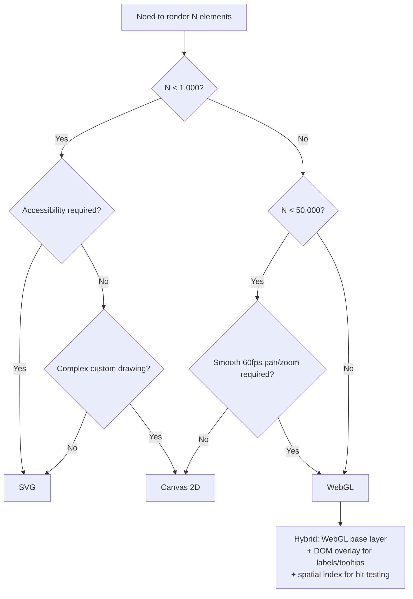

# SVG vs Canvas 2D vs WebGL

---

## The Core Question

When you're asked to render a large-scale visualization — a node-link graph, a map with thousands of markers, a data-dense chart — the rendering technology choice determines whether your app runs at 60fps or freezes the browser.

**The staff-level framing:** the decision is driven by **element count**, **interaction requirements**, and **visual complexity** — not by familiarity with the API.

---

## Comparison Table

| Dimension              | **SVG**                                    | **Canvas 2D**                        | **WebGL**                            |
| ---------------------- | ------------------------------------------ | ------------------------------------ | ------------------------------------ |
| **Model**              | Retained mode (DOM)                        | Immediate mode (pixels)              | Immediate mode (GPU)                 |
| **Rendering**          | CPU, browser layout engine                 | CPU, 2D rasterizer                   | GPU, shader pipeline                 |
| **Element ceiling**    | ~1,000–5,000                               | ~10,000–50,000                       | ~1,000,000+                          |
| **Hit testing**        | Free (native DOM events)                   | Manual (spatial index)               | Manual (GPU picking / spatial index) |
| **Accessibility**      | Excellent (real DOM nodes, ARIA)           | None (must build parallel DOM)       | None                                 |
| **Text rendering**     | Excellent, native                          | Good (`fillText`)                    | Hard (SDF atlas or texture)          |
| **Animation**          | CSS/SMIL, declarative                      | Manual `requestAnimationFrame`       | Manual, but GPU-accelerated          |
| **Styling**            | CSS, cascading                             | Imperative per-draw                  | Shader uniforms/attributes           |
| **Zoom/pan quality**   | Vector-crisp at any zoom                   | Re-render required, blurry if scaled | Vector-crisp, GPU transform          |
| **Memory per element** | High (~1–3KB DOM node)                     | Low (only your data)                 | Very low (packed typed arrays)       |
| **Dev complexity**     | Low                                        | Medium                               | High                                 |
| **Debugging**          | DevTools inspector works                   | Blind (pixels only)                  | Very hard (GPU state)                |
| **Browser support**    | Universal                                  | Universal                            | ~98% (WebGL2 ~95%)                   |
| **Best for**           | &lt;1K interactive elements, a11y required | 1K–50K elements, custom drawing      | 50K+ elements, GPU compute           |

---

## SVG — Retained Mode

Every shape is a real DOM node. The browser owns the scene graph, layout, hit testing, and repainting.

```html
<svg viewBox="0 0 1000 1000">
  <circle
    cx="100"
    cy="100"
    r="5"
    fill="steelblue"
    onclick="selectNode('n1')"
    role="button"
    aria-label="Node 1"
  />
  <line x1="100" y1="100" x2="250" y2="180" stroke="#ccc" />
</svg>
```

### Why It Breaks at Scale

```
100,000 nodes → 100,000 DOM elements

Cost per element:
  - ~1–3KB memory (DOM node + style + layout box)  → 100K × 2KB = 200MB
  - Style recalculation on any change
  - Layout/reflow pass over the full tree
  - Paint each element individually

Result: 100K SVG elements = multi-second initial render, ~2fps on pan/zoom,
        browser tab crash on lower-end devices
```

### When SVG Is Right

- **&lt;1,000 elements** with rich interaction (hover, click, tooltip, focus)
- **Accessibility is a requirement** — screen readers traverse the DOM natively
- Elements need **CSS styling / theming** that changes at runtime
- You need **crisp vector output** for print/export
- Team velocity matters — SVG is the easiest to build and debug

**Examples:** dashboards with &lt;500 data points, org charts, icons, small force-directed graphs, annotated diagrams, form-embedded charts.

---

## Canvas 2D — Immediate Mode

You draw pixels into a bitmap. The browser has no knowledge of "shapes" — once drawn, it's just pixels. You own the scene graph, hit testing, and redraw loop.

```javascript
const ctx = canvas.getContext('2d');

function render(nodes, edges, transform) {
  ctx.clearRect(0, 0, canvas.width, canvas.height);
  ctx.save();
  ctx.translate(transform.x, transform.y);
  ctx.scale(transform.k, transform.k);

  // Batch edges — one path, one stroke call
  ctx.beginPath();
  for (const e of edges) {
    ctx.moveTo(e.source.x, e.source.y);
    ctx.lineTo(e.target.x, e.target.y);
  }
  ctx.strokeStyle = 'rgba(180,180,180,0.4)';
  ctx.stroke();

  // Nodes
  for (const n of nodes) {
    ctx.beginPath();
    ctx.arc(n.x, n.y, n.r, 0, Math.PI * 2);
    ctx.fillStyle = n.color;
    ctx.fill();
  }
  ctx.restore();
}
```

### Hit Testing (You Must Build It)

Canvas has no events on shapes. Two approaches:

**1. Spatial index (recommended)**

```javascript
import RBush from 'rbush';

const tree = new RBush();
tree.load(
  nodes.map((n) => ({
    minX: n.x - n.r,
    minY: n.y - n.r,
    maxX: n.x + n.r,
    maxY: n.y + n.r,
    node: n,
  }))
);

canvas.addEventListener('mousemove', (e) => {
  const [x, y] = toWorldCoords(e.offsetX, e.offsetY, transform);
  const hits = tree.search({ minX: x, minY: y, maxX: x, maxY: y });
  // refine with exact distance check
});
```

**2. Offscreen color-picking canvas**

```javascript
// Render each node with a unique RGB color into a hidden canvas
// On mousemove, read the pixel at cursor → decode color → node ID
const pixel = hitCtx.getImageData(mx, my, 1, 1).data;
const id = pixel[0] + pixel[1] * 256 + pixel[2] * 65536;
```

O(1) lookup, but `getImageData` forces a GPU→CPU sync (~1–3ms). Fine for hover, too slow for continuous tracking on some devices.

### Performance Techniques

| Technique                                                                   | Impact                            |
| --------------------------------------------------------------------------- | --------------------------------- |
| **Batch draw calls** — one `beginPath()` for all edges                      | 10–50× faster than per-edge paths |
| **Layer separation** — static background canvas + dynamic foreground canvas | Only redraw what changes          |
| **Dirty rectangles** — `clearRect` only changed regions                     | Avoids full-canvas repaint        |
| **Level of detail (LOD)** — skip labels/details when zoomed out             | Cuts draw calls by 5–10×          |
| **Viewport culling** — spatial index query for visible bounds only          | Renders only what's on screen     |
| **OffscreenCanvas + Worker** — render off main thread                       | Keeps UI responsive               |
| **`devicePixelRatio` handling** — avoid over-rendering on retina            | 4× fewer pixels on 2× displays    |

### When Canvas Is Right

- **1,000–50,000 elements**
- Custom drawing that CSS/SVG can't express (heatmaps, particle trails, generative visuals)
- You need full control over the render loop
- Accessibility can be handled via a **parallel hidden DOM** (a11y tree mirroring your data)

**Examples:** Google Maps tile overlays, medium-scale network graphs, trading charts, image editors, Figma-like canvases (Figma actually uses WebGL), data-dense scatter plots.

---

## WebGL — GPU Pipeline

You upload geometry to GPU memory once, then issue draw calls that the GPU executes in parallel across thousands of cores.

```javascript
// Upload all node positions to GPU once
const positions = new Float32Array(nodeCount * 2);
const colors = new Float32Array(nodeCount * 3);
const sizes = new Float32Array(nodeCount);

const posBuffer = gl.createBuffer();
gl.bindBuffer(gl.ARRAY_BUFFER, posBuffer);
gl.bufferData(gl.ARRAY_BUFFER, positions, gl.STATIC_DRAW);

// Vertex shader — runs once per node, in parallel on GPU
const vertexShader = `#version 300 es
  in vec2 a_position;
  in vec3 a_color;
  in float a_size;
  uniform mat3 u_transform;     // pan/zoom — updated per frame, cheap
  out vec3 v_color;

  void main() {
    vec3 pos = u_transform * vec3(a_position, 1.0);
    gl_Position = vec4(pos.xy, 0.0, 1.0);
    gl_PointSize = a_size;
    v_color = a_color;
  }
`;

// Fragment shader — runs per pixel, draws a circle inside each point sprite
const fragmentShader = `#version 300 es
  precision mediump float;
  in vec3 v_color;
  out vec4 outColor;

  void main() {
    vec2 c = gl_PointCoord - vec2(0.5);
    if (dot(c, c) > 0.25) discard;   // circular mask
    outColor = vec4(v_color, 1.0);
  }
`;

// Render loop — pan/zoom only updates one uniform, no data re-upload
function render(transform) {
  gl.uniformMatrix3fv(u_transform, false, transform);
  gl.drawArrays(gl.POINTS, 0, nodeCount); // ONE call draws 100K nodes
}
```

### Why This Wins at Scale

```
The key insight: pan/zoom is a matrix uniform update.

SVG:    100K DOM nodes → recompute style + layout + paint for all  → ~2fps
Canvas: 100K arc() calls per frame on CPU                          → ~15fps
WebGL:  1 uniform upload + 1 drawArrays call, GPU does the rest    → 60fps

Data upload happens ONCE. Subsequent frames cost ~0.5ms.
```

### Instanced Rendering (for complex shapes)

```javascript
// Draw 100K textured quads with one call
gl.vertexAttribDivisor(a_offset, 1); // per-instance attribute
gl.drawArraysInstanced(gl.TRIANGLE_STRIP, 0, 4, 100000);
```

### Text in WebGL — The Hard Part

WebGL has no text API. Options:

| Approach                                 | Trade-off                                                            |
| ---------------------------------------- | -------------------------------------------------------------------- |
| **SDF (Signed Distance Field) atlas**    | Crisp at any zoom, one texture, industry standard (Mapbox uses this) |
| **Pre-rendered texture atlas**           | Simple, but blurry when zoomed                                       |
| **HTML overlay** for visible labels only | Easiest; only works if visible label count stays &lt;500             |
| **Canvas 2D overlay layer**              | Draw labels on a separate canvas above WebGL                         |

**Pragmatic answer:** render nodes/edges in WebGL, render labels in an HTML or Canvas overlay for only the ~100 elements currently visible at readable zoom.

### When WebGL Is Right

- **50,000+ elements**
- Smooth 60fps pan/zoom over large datasets is a hard requirement
- You need GPU compute (physics simulation, force-directed layout on GPU)
- Visual effects: transparency blending, glow, heat maps, custom shaders

**Examples:** Mapbox GL, deck.gl, Figma, Google Earth, large-scale network visualization, real-time particle systems.

---

## Rendering 100,000 Nodes — The Concrete Answer

This is the canonical interview question. Here's the full reasoning.

### Why SVG and Canvas Fail

```
SVG at 100K nodes:
  Memory:    100K × ~2KB DOM node        = ~200MB
  Init:      DOM construction + layout   = 5–15 seconds
  Pan/zoom:  full style recalc + reflow  = ~500ms/frame → 2fps
  Verdict:   UNUSABLE

Canvas 2D at 100K nodes:
  Memory:    100K × 40 bytes (your data) = 4MB  ✓
  Init:      instant (no DOM)            ✓
  Pan/zoom:  100K arc() + fill() calls   = ~60–80ms/frame → 12–16fps
  Verdict:   SLUGGISH — usable but not smooth

WebGL at 100K nodes:
  Memory:    100K × 24 bytes packed      = 2.4MB GPU  ✓
  Init:      one bufferData upload       = ~5ms       ✓
  Pan/zoom:  1 uniform + 1 draw call     = ~0.5ms/frame → 60fps  ✓
  Verdict:   SMOOTH
```

### Recommended Architecture: Hybrid

```
┌────────────────────────────────────────────────────┐
│  Layer 3: HTML/SVG overlay (DOM)                   │
│    - Tooltip for hovered node                      │
│    - Labels for ~100 visible nodes at current zoom │
│    - Selection handles, context menu               │
│    - a11y: hidden DOM mirror for screen readers    │
├────────────────────────────────────────────────────┤
│  Layer 2: WebGL canvas                             │
│    - 100K nodes as GL_POINTS with circular shader  │
│    - 300K edges as GL_LINES (or instanced quads)   │
│    - Pan/zoom via transform matrix uniform         │
├────────────────────────────────────────────────────┤
│  Layer 1: Static background canvas                 │
│    - Grid, axes, regions (redraw only on resize)   │
└────────────────────────────────────────────────────┘

Data & interaction layer (main thread or Worker):
  - Positions in Float32Array (SoA layout, not array-of-objects)
  - Spatial index (quadtree / R-tree) for hit testing + culling
  - Layout simulation in Web Worker (or GPU via transform feedback)
```

### Data Layout Matters

```javascript
// BAD — array of objects: 100K objects, poor cache locality, GC pressure
const nodes = [{ x: 1, y: 2, r: 3, color: '#f00' }, ...];

// GOOD — structure of arrays: contiguous memory, direct GPU upload
const x     = new Float32Array(100_000);
const y     = new Float32Array(100_000);
const size  = new Float32Array(100_000);
const color = new Uint8Array(100_000 * 3);

// These typed arrays go straight into gl.bufferData() with zero transformation
```

### Level of Detail Strategy

```
Zoom < 0.3   → render nodes only, no edges, no labels        (edges are visual noise)
Zoom 0.3–1.0 → nodes + edges, no labels
Zoom 1.0–3.0 → nodes + edges + labels for degree-ranked top N
Zoom > 3.0   → full detail for viewport-culled subset only

Also: aggregate distant clusters into single "super-nodes" when zoomed out
      (reduces 100K rendered points to ~2K meaningful clusters)
```

### Interaction: Hit Testing at 100K

```javascript
// Build quadtree once (or rebuild on layout change)
import { quadtree } from 'd3-quadtree';
const tree = quadtree()
  .x((d) => d.x)
  .y((d) => d.y)
  .addAll(nodeIndices);

// Hover: O(log n) nearest-neighbor search
function onMouseMove(e) {
  const [wx, wy] = screenToWorld(e.offsetX, e.offsetY, transform);
  const radius = 10 / transform.k; // scale search radius with zoom
  const hit = tree.find(wx, wy, radius);
  if (hit !== hovered) {
    hovered = hit;
    updateHighlightUniform(hit); // shader highlights this node
    updateTooltipDOM(hit); // HTML overlay
  }
}
```

Highlighting a hovered node costs **one uniform update** — no re-upload of the 100K buffer.

### Layout Computation

```
Force-directed layout on 100K nodes is O(n²) naive — impossible on main thread.

Options:
  1. Barnes-Hut approximation (O(n log n)) in a Web Worker
     → ~2–5s for 100K nodes, run once, stream positions back via transferable ArrayBuffer

  2. GPU compute via transform feedback (WebGL2)
     → physics step runs on GPU, positions never leave VRAM → real-time

  3. Precompute server-side, ship positions as binary
     → zero client cost; best if graph is static
```

---

## Decision Flowchart



---

## Libraries Worth Knowing

| Library          | Layer        | Use Case                                                                   |
| ---------------- | ------------ | -------------------------------------------------------------------------- |
| **D3.js**        | SVG / Canvas | Data binding, scales, layouts, quadtree — pairs with any renderer          |
| **PixiJS**       | WebGL (2D)   | Easiest WebGL abstraction; sprite batching out of the box                  |
| **deck.gl**      | WebGL        | Large-scale geospatial + data viz layers; handles millions of points       |
| **regl**         | WebGL        | Functional, minimal WebGL wrapper — good balance of control and ergonomics |
| **Three.js**     | WebGL (3D)   | Overkill for 2D, but standard if you need 3D                               |
| **sigma.js**     | WebGL        | Purpose-built for large graph rendering                                    |
| **Konva**        | Canvas 2D    | Scene graph + hit testing on Canvas                                        |
| **Mapbox GL JS** | WebGL        | Reference implementation of SDF text + vector tiles at scale               |

---

## Interview Talking Points

**"Why not just virtualize the SVG — render only visible nodes?"**
Viewport culling helps, but breaks down for zoomed-out overviews where all 100K nodes are in view — which is exactly the primary use case for a large graph. It also causes DOM thrash during pan (constant insert/remove of thousands of nodes), which is worse than a steady render loop. Culling is a good _complement_ to Canvas/WebGL, not a fix for SVG.

**"How do you handle accessibility with WebGL?"**
Maintain a parallel hidden DOM tree (`aria-hidden="false"`, visually hidden) that mirrors the data model — one focusable element per _semantically meaningful_ item, not per rendered pixel. Provide keyboard navigation (arrow keys move selection through the graph), live region announcements for state changes, and a data-table fallback view. Full parity isn't achievable; the goal is an equivalent experience, not an identical one.

**"What if WebGL isn't supported or the GPU context is lost?"**
Feature-detect at init: `canvas.getContext('webgl2') || canvas.getContext('webgl')`. Fall back to Canvas 2D with aggressive LOD and clustering (render 5K aggregated clusters instead of 100K nodes). Handle `webglcontextlost` event — prevent default, then re-initialize buffers on `webglcontextrestored`. Always keep the source data in JS memory so you can rebuild GPU state.

**"How would you profile this?"**
Chrome DevTools Performance panel for main-thread work (JS, layout, paint). `chrome://tracing` or the Rendering panel's FPS meter for frame timing. For WebGL specifically: Spector.js to capture and inspect draw calls, or the `EXT_disjoint_timer_query` extension for GPU-side timing. Key metrics: frame time budget is 16.6ms — measure JS time, GPU time, and total separately to know which side is the bottleneck.

**"What's the actual bottleneck at 100K nodes in WebGL?"**
Usually **not** the draw call — it's fill rate (overlapping transparent points), or CPU-side work like rebuilding the spatial index, or JS→GPU data transfer if you're re-uploading buffers each frame. Diagnose by: reducing point size (if faster → fill rate bound), removing the spatial index rebuild (if faster → CPU bound), or switching `DYNAMIC_DRAW` to `STATIC_DRAW` and avoiding re-uploads.
