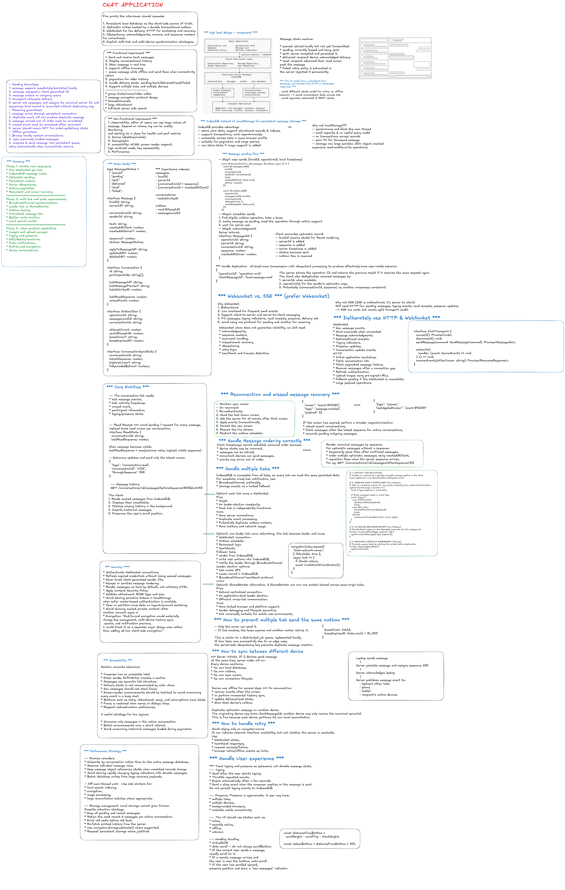

## Local-First Chat Client

```js
/**
 * Local-first chat client
 *
 * Demonstrates:
 * - IndexedDB message storage
 * - Optimistic sending
 * - Persistent outbox
 * - WebSocket connection
 * - Server acknowledgments
 * - Retry after reconnect
 * - Incoming-message deduplication
 */

const DB_NAME = 'chat-app';
const DB_VERSION = 1;

const STORE = {
  MESSAGES: 'messages',
  OUTBOX: 'outbox',
  META: 'meta',
};

/* =========================================================
 * IndexedDB helpers
 * ======================================================= */

let dbPromise;

function openDatabase() {
  if (dbPromise) return dbPromise;

  dbPromise = new Promise((resolve, reject) => {
    const request = indexedDB.open(DB_NAME, DB_VERSION);

    request.onupgradeneeded = () => {
      const db = request.result;

      if (!db.objectStoreNames.contains(STORE.MESSAGES)) {
        const messages = db.createObjectStore(STORE.MESSAGES, {
          keyPath: 'localId',
        });

        messages.createIndex('serverId', 'serverId', {
          unique: true,
        });

        messages.createIndex('conversationCreatedAt', ['conversationId', 'createdAt'], {
          unique: false,
        });
      }

      if (!db.objectStoreNames.contains(STORE.OUTBOX)) {
        const outbox = db.createObjectStore(STORE.OUTBOX, {
          keyPath: 'operationId',
        });

        outbox.createIndex('nextAttemptAt', 'nextAttemptAt');
      }

      if (!db.objectStoreNames.contains(STORE.META)) {
        db.createObjectStore(STORE.META, {
          keyPath: 'key',
        });
      }
    };

    request.onsuccess = () => resolve(request.result);
    request.onerror = () => reject(request.error);
  });

  return dbPromise;
}

function requestToPromise(request) {
  return new Promise((resolve, reject) => {
    request.onsuccess = () => resolve(request.result);
    request.onerror = () => reject(request.error);
  });
}

function transactionDone(transaction) {
  return new Promise((resolve, reject) => {
    transaction.oncomplete = resolve;
    transaction.onerror = () => reject(transaction.error);
    transaction.onabort = () => reject(transaction.error ?? new Error('Transaction aborted'));
  });
}

/* =========================================================
 * Message repository
 * ======================================================= */

/**
 * Atomically stores:
 * 1. optimistic message shown by the UI
 * 2. persistent outbox operation
 */
async function createOutgoingMessage({ conversationId, senderId, text }) {
  const db = await openDatabase();

  const localId = crypto.randomUUID();
  const operationId = crypto.randomUUID();
  const now = Date.now();

  const message = {
    localId,
    serverId: null,
    conversationId,
    senderId,
    text,
    createdAt: now,
    serverSequence: null,
    status: 'queued',
  };

  const outboxItem = {
    operationId,
    localId,
    conversationId,
    text,
    attempts: 0,
    nextAttemptAt: now,
  };

  const transaction = db.transaction([STORE.MESSAGES, STORE.OUTBOX], 'readwrite');

  transaction.objectStore(STORE.MESSAGES).add(message);
  transaction.objectStore(STORE.OUTBOX).add(outboxItem);

  await transactionDone(transaction);
  notifyConversationChanged(conversationId);

  return message;
}

async function getMessages(conversationId) {
  const db = await openDatabase();

  const transaction = db.transaction(STORE.MESSAGES, 'readonly');

  const index = transaction.objectStore(STORE.MESSAGES).index('conversationCreatedAt');

  const range = IDBKeyRange.bound([conversationId, 0], [conversationId, Number.MAX_SAFE_INTEGER]);

  return requestToPromise(index.getAll(range));
}

async function updateMessageStatus(localId, status) {
  const db = await openDatabase();

  const transaction = db.transaction(STORE.MESSAGES, 'readwrite');

  const store = transaction.objectStore(STORE.MESSAGES);
  const message = await requestToPromise(store.get(localId));

  if (!message) {
    transaction.abort();
    throw new Error(`Message not found: ${localId}`);
  }

  store.put({
    ...message,
    status,
  });

  await transactionDone(transaction);
  notifyConversationChanged(message.conversationId);
}

/**
 * Reconciles the optimistic message after the server accepts it.
 * The same localId is preserved so React keeps a stable key.
 */
async function acknowledgeMessage({ operationId, localId, serverId, serverSequence, createdAt }) {
  const db = await openDatabase();

  const transaction = db.transaction([STORE.MESSAGES, STORE.OUTBOX], 'readwrite');

  const messageStore = transaction.objectStore(STORE.MESSAGES);

  const message = await requestToPromise(messageStore.get(localId));

  if (!message) {
    transaction.abort();
    throw new Error(`Message not found: ${localId}`);
  }

  messageStore.put({
    ...message,
    serverId,
    serverSequence,
    createdAt,
    status: 'sent',
  });

  transaction.objectStore(STORE.OUTBOX).delete(operationId);

  await transactionDone(transaction);
  notifyConversationChanged(message.conversationId);
}

/**
 * Deduplicates incoming messages using the unique serverId index.
 */
async function saveIncomingMessage(serverMessage) {
  const db = await openDatabase();

  const transaction = db.transaction(STORE.MESSAGES, 'readwrite');

  const store = transaction.objectStore(STORE.MESSAGES);
  const serverIdIndex = store.index('serverId');

  const existing = await requestToPromise(serverIdIndex.get(serverMessage.serverId));

  if (existing) {
    // Duplicate WebSocket event.
    return;
  }

  store.add({
    localId: crypto.randomUUID(),
    serverId: serverMessage.serverId,
    conversationId: serverMessage.conversationId,
    senderId: serverMessage.senderId,
    text: serverMessage.text,
    createdAt: serverMessage.createdAt,
    serverSequence: serverMessage.serverSequence,
    status: 'sent',
  });

  await transactionDone(transaction);
  notifyConversationChanged(serverMessage.conversationId);
}

/* =========================================================
 * Sync cursor
 * ======================================================= */

async function saveCursor(cursor) {
  const db = await openDatabase();

  const transaction = db.transaction(STORE.META, 'readwrite');

  transaction.objectStore(STORE.META).put({
    key: 'lastEventCursor',
    value: cursor,
  });

  await transactionDone(transaction);
}

async function getCursor() {
  const db = await openDatabase();

  const transaction = db.transaction(STORE.META, 'readonly');

  const result = await requestToPromise(transaction.objectStore(STORE.META).get('lastEventCursor'));

  return result?.value ?? null;
}

/* =========================================================
 * Persistent outbox
 * ======================================================= */

async function getReadyOutboxItems(limit = 20) {
  const db = await openDatabase();

  const transaction = db.transaction(STORE.OUTBOX, 'readonly');

  const index = transaction.objectStore(STORE.OUTBOX).index('nextAttemptAt');

  const range = IDBKeyRange.upperBound(Date.now());

  return new Promise((resolve, reject) => {
    const items = [];
    const request = index.openCursor(range);

    request.onsuccess = () => {
      const cursor = request.result;

      if (!cursor || items.length >= limit) {
        resolve(items);
        return;
      }

      items.push(cursor.value);
      cursor.continue();
    };

    request.onerror = () => reject(request.error);
  });
}

async function scheduleRetry(item) {
  const db = await openDatabase();

  const attempts = item.attempts + 1;
  const delay = Math.min(30_000, 1000 * 2 ** attempts);

  const transaction = db.transaction(STORE.OUTBOX, 'readwrite');

  transaction.objectStore(STORE.OUTBOX).put({
    ...item,
    attempts,
    nextAttemptAt: Date.now() + delay + Math.random() * 500,
  });

  await transactionDone(transaction);
}

/* =========================================================
 * WebSocket client
 * ======================================================= */

class ChatClient {
  constructor(url) {
    this.url = url;
    this.socket = null;
    this.reconnectAttempts = 0;
    this.closedManually = false;
    this.flushRunning = false;
  }

  connect() {
    if (
      this.socket?.readyState === WebSocket.OPEN ||
      this.socket?.readyState === WebSocket.CONNECTING
    ) {
      return;
    }

    this.closedManually = false;
    this.socket = new WebSocket(this.url);

    this.socket.onopen = async () => {
      console.log('Chat connected');

      this.reconnectAttempts = 0;

      // Recover events missed while disconnected.
      this.send({
        type: 'resume',
        lastEventCursor: await getCursor(),
      });

      await this.flushOutbox();
    };

    this.socket.onmessage = (event) => {
      void this.handleServerEvent(JSON.parse(event.data));
    };

    this.socket.onclose = () => {
      this.socket = null;

      if (!this.closedManually) {
        this.scheduleReconnect();
      }
    };

    this.socket.onerror = () => {
      // onclose will schedule reconnection.
    };
  }

  disconnect() {
    this.closedManually = true;
    this.socket?.close(1000, 'Client disconnected');
    this.socket = null;
  }

  send(payload) {
    if (this.socket?.readyState !== WebSocket.OPEN) {
      return false;
    }

    this.socket.send(JSON.stringify(payload));
    return true;
  }

  async sendMessage({ conversationId, senderId, text }) {
    // Persist first. The UI can render immediately even when offline.
    const message = await createOutgoingMessage({
      conversationId,
      senderId,
      text,
    });

    await this.flushOutbox();
    return message;
  }

  async flushOutbox() {
    if (this.flushRunning || this.socket?.readyState !== WebSocket.OPEN) {
      return;
    }

    this.flushRunning = true;

    try {
      const items = await getReadyOutboxItems();

      for (const item of items) {
        await updateMessageStatus(item.localId, 'sending');

        const sent = this.send({
          type: 'send_message',
          operationId: item.operationId,
          clientMessageId: item.localId,
          conversationId: item.conversationId,
          text: item.text,
        });

        if (!sent) {
          await updateMessageStatus(item.localId, 'queued');
          break;
        }

        /*
         * Do not delete the outbox item here.
         * Keep it until the server acknowledgment arrives.
         */
        await scheduleRetry(item);
      }
    } finally {
      this.flushRunning = false;
    }
  }

  async handleServerEvent(event) {
    switch (event.type) {
      case 'message_ack':
        await acknowledgeMessage({
          operationId: event.operationId,
          localId: event.clientMessageId,
          serverId: event.serverId,
          serverSequence: event.serverSequence,
          createdAt: event.createdAt,
        });
        break;

      case 'message_created':
        await saveIncomingMessage(event.message);
        break;

      case 'pong':
        return;

      case 'error':
        console.error('Chat server error:', event.message);
        break;
    }

    // Save only after the event was successfully applied.
    if (event.cursor) {
      await saveCursor(event.cursor);
    }
  }

  scheduleReconnect() {
    const delay = Math.min(30_000, 1000 * 2 ** this.reconnectAttempts) + Math.random() * 500;

    this.reconnectAttempts += 1;

    setTimeout(() => this.connect(), delay);
  }
}

/* =========================================================
 * Cross-tab notifications
 * ======================================================= */

const channel =
  typeof BroadcastChannel !== 'undefined' ? new BroadcastChannel('chat-updates') : null;

function notifyConversationChanged(conversationId) {
  channel?.postMessage({
    type: 'conversation_changed',
    conversationId,
  });
}

function subscribeToConversation(conversationId, callback) {
  const handler = async (event) => {
    if (
      event.data.type === 'conversation_changed' &&
      event.data.conversationId === conversationId
    ) {
      callback(await getMessages(conversationId));
    }
  };

  channel?.addEventListener('message', handler);

  return () => {
    channel?.removeEventListener('message', handler);
  };
}

/* =========================================================
 * Example usage
 * ======================================================= */

const chatClient = new ChatClient('wss://api.example.com/chat');

chatClient.connect();

async function sendMessage() {
  await chatClient.sendMessage({
    conversationId: 'conversation-123',
    senderId: 'current-user',
    text: 'Hello 👋',
  });

  const messages = await getMessages('conversation-123');
  console.log(messages);
}

subscribeToConversation('conversation-123', (messages) => {
  console.log('Conversation updated:', messages);
});
```

# Frontend System Design Interview: Chat App

Use this guide to explain a chat app like Airbnb chat, WhatsApp-style messaging, or support messaging.

At staff level, do not only describe components. Emphasize the product goals, realtime data flow, failure modes, and the tradeoffs behind your choices.

## 1. Start with Scope and Assumptions

- Is this 1:1 chat, group chat, or both?
- Do we need text only, or also images, files, voice notes, links, reactions, and read receipts?
- Is realtime messaging required, or is near-realtime acceptable?
- Do we need offline support, message history, typing indicators, and presence?
- Is this web only, or also mobile web and embedded surfaces?

### Good opening line

"I’ll optimize for reliable realtime delivery, fast initial load of the conversation list, smooth message updates, and graceful handling of offline or flaky network conditions."

## 2. Define the Most Important Product Goals

- Fast conversation loading.
- Reliable message delivery and ordering.
- Clear delivery/read state.
- Smooth typing and presence updates.
- Minimal lag in send/receive UX.
- Accessibility and keyboard support.

## 3. Core User Flows You Should Cover

### A. Conversation list

- Load recent threads first.
- Show unread counts, last message preview, and presence.
- Paginate older conversations.

### B. Message sending

- User composes message.
- UI adds optimistic pending bubble immediately.
- Client sends over websocket or realtime channel.
- Backend confirms success or failure.
- UI reconciles local temp id with server id.

### C. Receiving messages

- Listen on websocket or realtime subscription.
- Deduplicate messages.
- Preserve order by server timestamp and sequence id.
- Scroll behavior should avoid jumping while user reads older messages.

### D. Read receipts and presence

- Read receipt updates should be lightweight and batched.
- Presence should degrade gracefully if realtime presence is unavailable.

## 4. Frontend Architecture

- App shell for routing, auth, and global state.
- Conversation list module.
- Message thread module.
- Composer module.
- Attachment upload module.
- Realtime connection manager.
- Notification and unread badge module.
- Observability and error tracking module.

## 5. Data Model to Mention

- Conversation: id, participants, lastMessage, unreadCount, updatedAt.
- Message: id, conversationId, senderId, body, attachments, status, createdAt, serverSequence.
- Presence: userId, online/lastSeen, typing state.
- Delivery state: pending, sent, delivered, read, failed.

## 6. Realtime Strategy

- Use WebSocket for bidirectional realtime updates.
- Fall back to polling or SSE if websocket is unavailable.
- Reconnect with exponential backoff.
- Resume from last acknowledged message cursor.
- Keep transport state separate from UI state.

## 7. Important Frontend Tradeoffs to Highlight

- WebSocket vs polling: realtime responsiveness vs simpler failure handling.
- Optimistic UI vs strict confirmation: fast UX vs temporary inconsistency.
- Client-side sorting vs server ordering: flexibility vs correctness.
- In-memory state vs persisted cache: speed vs refresh resilience.
- Presence accuracy vs network cost: fine-grained updates vs battery/data usage.

## 8. Message Ordering and Deduplication

- Never trust arrival order alone.
- Use server sequence numbers or monotonic ids.
- Keep a message map by id plus a sorted display list.
- Handle duplicate deliveries idempotently.
- Preserve scroll anchor when older messages load or when history reorders.

## 9. Offline and Failure Handling

- Queue outbound messages locally when offline.
- Mark messages as pending until server ack.
- Retry failed sends with backoff.
- Show retry and error states in the bubble.
- Sync missed messages on reconnect using a cursor.

## 10. Attachments and Media

- Upload files separately from text send.
- Show progress, cancel, and retry.
- Use previews for images.
- Validate file size and type on the client.
- Mention virus scanning and content moderation at the backend boundary.

## 11. Performance Points Interviewers Care About

- Virtualize long conversation histories.
- Keep composer responsive even when thread rendering is heavy.
- Batch realtime updates to avoid re-render storms.
- Memoize expensive message item rendering where necessary.
- Lazy-load attachment preview and media viewers.
- Use windowing for chat history and conversation list.

## 12. Accessibility and UX

- Keyboard shortcuts for send, reply, and navigation.
- Screen-reader labels for message bubbles and actions.
- Focus management after sending, opening attachments, or switching threads.
- Clear timestamps and status indicators.
- Respect reduced motion preferences.

## 13. Observability and Product Metrics

- Send success rate.
- Message delivery latency.
- Reconnect rate.
- Read receipt latency.
- Conversation open time.
- Error rate for upload/send/realtime connection.

## 14. Security and Privacy

- Sanitize message content and links.
- Prevent XSS in rendered markdown or rich text.
- Protect message history with auth checks.
- Avoid leaking presence or read state to unauthorized users.
- Mention rate limits and abuse controls.

## 15. Staff-Level Points to Emphasize

- You are designing a system, not just a chat bubble component.
- You care about correctness under retries, reconnects, and duplicate events.
- You can explain how frontend state stays consistent with backend truth.
- You understand when to optimize for UX and when to preserve correctness.
- You can define incremental rollout and observability from day one.

## 16. 45-60 Minute Interview Flow

- 0-5 min: clarify scope and success metrics.
- 5-15 min: outline data flow and architecture.
- 15-25 min: message list, composer, and realtime connection.
- 25-35 min: delivery state, ordering, reconnect, offline handling.
- 35-45 min: performance, accessibility, attachments, and notifications.
- 45-55 min: tradeoffs and scaling.
- 55-60 min: edge cases and follow-up questions.

## 17. Edge Cases to Call Out

- Duplicate messages after reconnect.
- Network loss while sending attachments.
- User switches conversations mid-send.
- Message arrives while user is reading older history.
- Presence or typing updates arrive out of order.
- Large history causing scroll jank.

## 18. A Simple Closing Summary

"For a chat app frontend, the key is to make the UI feel instant while staying consistent with the server. The hard parts are ordering, retries, reconnects, offline behavior, and keeping the experience accessible and performant as the thread grows."
