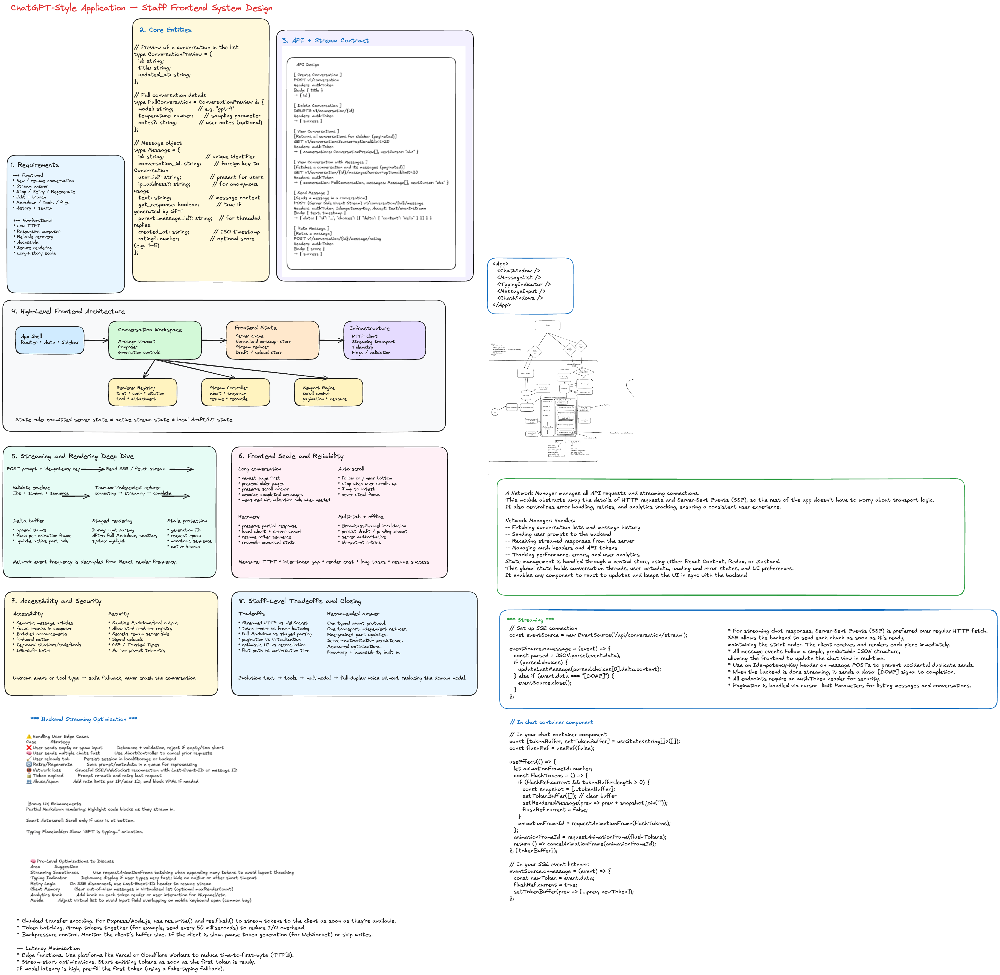

# Frontend System Design: ChatGPT-Style AI Chat Application

## Interview Prompt

Design the frontend architecture for a ChatGPT-style conversational AI application.

The product should support creating and resuming conversations, sending prompts and receiving incrementally streamed responses, rendering Markdown, code, citations, tools, and attachments, stopping and retrying generation, editing and branching messages, conversation history, responsive layouts, and reliable failure recovery.

The Staff-level goal is not merely to build a chat component. The design should establish durable domain contracts, streaming semantics, state boundaries, rendering policies, accessibility, recovery, observability, and an evolution path for richer agent behavior.

---

# 1. Requirements

## Functional requirements

1. Start and resume a conversation.
2. Send a user prompt.
3. Stream an assistant response incrementally.
4. Stop an in-progress generation.
5. Retry or regenerate a failed response.
6. Edit a previous user message and create a branch.
7. Render Markdown, code blocks, tables, citations, attachments, and tool activity.
8. Copy and rate an answer.
9. Search, rename, archive, and delete conversations.
10. Synchronize history across devices.

## Non-functional requirements

### Performance

- Composer typing remains responsive during streaming.
- Minimize time to first visible token.
- Streaming updates do not rerender the whole application.
- Long conversations remain usable.
- Markdown parsing and syntax highlighting do not block input.
- Initial shell and recent messages load before old history.

### Reliability

- Prompts survive transient failures.
- Duplicate submissions are prevented.
- Partial responses remain recoverable.
- Stale stream events cannot update the wrong message.
- Refresh reconstructs the committed conversation.
- Cancellation is distinguishable from failure.

### Accessibility

- Keyboard-accessible composer and controls.
- Semantic message structure.
- Batched screen-reader announcements.
- No focus stealing during streaming.
- Reduced-motion support.
- Accessible code, citation, menu, and dialog interactions.

### Security and privacy

- Provider credentials remain on the server.
- Markdown and tool output are sanitized.
- Uploads are validated and scanned.
- Retention and deletion requirements are honored.
- Telemetry avoids raw prompt and response content by default.

### Frontend scale

- Millions of users overall.
- High concurrent streaming volume.
- Conversations containing thousands of messages.
- Multi-tab use.
- Slow devices and unreliable mobile networks.
- Incremental rollout of new message and tool types.

---

# 2. Clarifying Questions

- Is the first version text-only or multimodal?
- Is anonymous use required?
- Is there one active generation per conversation?
- Does Stop preserve partial output?
- Are branches visible to users?
- Are tool calls first-class UI elements?
- Can a stream resume after disconnect?
- What is the server retention policy?
- How much history must load initially?
- Does the product need offline drafting or offline sending?

A reasonable interview scope is text chat, one active generation per conversation, streamed output, persistent history, Stop, Retry, Regenerate, responsive web UI, and an extensible message model.

---

# 3. Core Entities

## Conversation

```ts
type Conversation = {
  id: string;
  title: string;
  createdAt: string;
  updatedAt: string;
  activeLeafMessageId: string | null;
  modelId: string;
  status: 'active' | 'archived' | 'deleted';
  version: number;
};
```

## Message

Do not model a message as only `{ role, text }`. Use ordered content parts so the frontend can evolve.

```ts
type Message = {
  id: string;
  conversationId: string;
  parentMessageId: string | null;
  role: 'user' | 'assistant' | 'system' | 'tool';
  status: 'queued' | 'sending' | 'streaming' | 'complete' | 'stopped' | 'failed';
  parts: MessagePart[];
  createdAt: string;
  completedAt?: string;
  clientRequestId?: string;
  error?: {
    code: string;
    message: string;
    retryable: boolean;
  };
};
```

## Message parts

```ts
type MessagePart =
  | { id: string; type: 'text'; text: string }
  | { id: string; type: 'code'; language?: string; code: string }
  | {
      id: string;
      type: 'citation';
      citationId: string;
      title: string;
      url?: string;
    }
  | {
      id: string;
      type: 'attachment';
      attachmentId: string;
      name: string;
      mimeType: string;
      status: 'uploading' | 'ready' | 'failed';
    }
  | {
      id: string;
      type: 'toolCall';
      toolCallId: string;
      toolName: string;
      status: 'pending' | 'running' | 'complete' | 'failed';
      summary?: string;
    }
  | {
      id: string;
      type: 'toolResult';
      toolCallId: string;
      payload: unknown;
    };
```

## Generation

A generation is separate from a message because it can be retried, cancelled, resumed, or replaced.

```ts
type Generation = {
  id: string;
  conversationId: string;
  assistantMessageId: string;
  clientRequestId: string;
  state: 'created' | 'connecting' | 'streaming' | 'completed' | 'cancelled' | 'failed';
  lastSequence: number;
  startedAt: string;
  firstTokenAt?: string;
  completedAt?: string;
};
```

## Attachment

```ts
type Attachment = {
  id: string;
  name: string;
  mimeType: string;
  sizeBytes: number;
  uploadStatus: 'pending' | 'uploading' | 'ready' | 'failed';
  processingStatus?: 'pending' | 'processing' | 'ready' | 'failed';
};
```

## Branching

Editing or regenerating creates a new branch:

```text
User A
  └── Assistant A
        ├── User B
        │     └── Assistant B
        └── User B edited
              └── Assistant B2
```

The backend stores a tree using `parentMessageId`; the frontend derives one active linear path.

---

# 4. API Design

Use normal HTTP APIs for resources and a streamed HTTP response for generation.

## Conversation APIs

```http
POST   /v1/conversations
GET    /v1/conversations?cursor=<cursor>&limit=30
GET    /v1/conversations/:conversationId
PATCH  /v1/conversations/:conversationId
DELETE /v1/conversations/:conversationId
```

## Paginated message history

```http
GET /v1/conversations/:conversationId/messages
    ?before=<messageId>
    &limit=40
    &branch=<leafMessageId>
```

```json
{
  "messages": [],
  "previousCursor": "msg_older_123",
  "hasMore": true,
  "conversationVersion": 14
}
```

## Send and stream

```http
POST /v1/conversations/:conversationId/generations
Content-Type: application/json
Accept: text/event-stream
Idempotency-Key: <clientRequestId>
```

```json
{
  "clientRequestId": "req_client_123",
  "parentMessageId": "msg_42",
  "userMessage": {
    "id": "temp_user_1",
    "parts": [
      {
        "type": "text",
        "text": "Explain virtualized chat rendering."
      }
    ]
  },
  "modelId": "model_default"
}
```

## Cancel generation

```http
POST /v1/generations/:generationId/cancel
```

Abort the browser fetch immediately and call the server endpoint to prevent unnecessary compute.

## Regenerate and feedback

```http
POST /v1/messages/:assistantMessageId/regenerate
POST /v1/messages/:messageId/feedback
```

## Attachment upload

```http
POST /v1/uploads
PUT  <signed-upload-url>
POST /v1/uploads/:attachmentId/complete
```

Use direct-to-object-storage upload with short-lived signed URLs. The generation request references attachment IDs.

---

# 5. Streaming Protocol

Stream typed events rather than raw text only.

```text
event: generation.created
data: {"generationId":"gen_1","assistantMessageId":"msg_a1","sequence":0}

event: response.text.delta
data: {"messageId":"msg_a1","partId":"part_1","delta":"Virtual","sequence":1}

event: response.text.delta
data: {"messageId":"msg_a1","partId":"part_1","delta":"ization","sequence":2}

event: response.tool_call.started
data: {"messageId":"msg_a1","toolCallId":"tool_1","name":"search","sequence":3}

event: response.completed
data: {"messageId":"msg_a1","sequence":4}
```

## Event envelope

```ts
type StreamEvent<TType extends string, TPayload> = {
  type: TType;
  schemaVersion: 1;
  generationId: string;
  conversationId: string;
  messageId: string;
  sequence: number;
  payload: TPayload;
};
```

## Event types

```ts
type ChatStreamEvent =
  | StreamEvent<
      'generation.created',
      {
        assistantMessageId: string;
      }
    >
  | StreamEvent<
      'response.text.delta',
      {
        partId: string;
        delta: string;
      }
    >
  | StreamEvent<
      'response.part.completed',
      {
        partId: string;
      }
    >
  | StreamEvent<
      'response.tool_call.started',
      {
        toolCallId: string;
        toolName: string;
      }
    >
  | StreamEvent<
      'response.tool_call.completed',
      {
        toolCallId: string;
        result: unknown;
      }
    >
  | StreamEvent<
      'response.completed',
      {
        finishReason: string;
      }
    >
  | StreamEvent<
      'response.failed',
      {
        code: string;
        retryable: boolean;
        message: string;
      }
    >;
```

## SSE or streamed fetch versus WebSocket

Use streamed HTTP/SSE when each generation starts with a normal POST and output is primarily server-to-client. It integrates well with HTTP authentication, proxies, cancellation, and tracing.

Use WebSocket when voice requires full-duplex input/output, interruptions are continuous, or multiple bidirectional agent events share a persistent session.

For text chat, streamed HTTP is the simpler default. Hide it behind a transport interface so the protocol can evolve.

---

# 6. High-Level Frontend Architecture

```text
App Shell
├── Router
├── Authentication boundary
├── Conversation sidebar
└── Conversation workspace
    ├── Message viewport
    ├── Message renderer registry
    ├── Streaming controller
    ├── Composer
    └── Generation controls

Data Layer
├── Server-state cache
├── Normalized conversation/message store
├── Stream reducer
├── Draft store
├── Upload manager
└── Persistence adapter

Infrastructure
├── HTTP client
├── Streaming transport
├── Telemetry
├── Feature flags
├── Runtime schema validation
└── Error boundaries
```

## State ownership

### Server state

- Conversation metadata
- Committed messages
- Search results
- Model list
- Attachment processing state

Use a server-state cache for fetching, deduplication, pagination, invalidation, and background refresh.

### Stream state

- Active generation
- Incremental part buffers
- Sequence number
- Connection status
- First-token timestamp

Use a reducer or external store with fine-grained subscriptions. Do not send every token through a global React context.

### Local UI state

- Open menus
- Hovered citation
- Expanded block
- Dialog state

### Durable local state

- Composer draft
- Pending prompt
- Selected model
- Sidebar preference

Persist small durable values in IndexedDB or local storage. Keep the server as canonical source.

---

# 7. Streaming State Machine

```text
IDLE
  submit
    ↓
OPTIMISTIC_USER_MESSAGE
    ↓
CONNECTING
    ├── generation.created → STREAMING
    ├── abort → CANCELLED
    └── error → FAILED

STREAMING
    ├── text/tool events → STREAMING
    ├── completed → COMPLETE
    ├── Stop → CANCELLING → STOPPED
    └── transport error → INTERRUPTED

INTERRUPTED
    ├── resume supported → RECONNECTING
    ├── retry → CONNECTING
    └── preserve partial response
```

```ts
type StreamState = {
  generationId: string | null;
  activeMessageId: string | null;
  phase: 'idle' | 'connecting' | 'streaming' | 'stopped' | 'complete' | 'failed';
  lastSequence: number;
  error: string | null;
};

function streamReducer(state: StreamState, event: ChatStreamEvent): StreamState {
  if (state.generationId && event.generationId !== state.generationId) {
    return state;
  }

  if (event.sequence <= state.lastSequence) {
    return state;
  }

  switch (event.type) {
    case 'generation.created':
      return {
        ...state,
        generationId: event.generationId,
        activeMessageId: event.payload.assistantMessageId,
        phase: 'streaming',
        lastSequence: event.sequence,
      };

    case 'response.completed':
      return {
        ...state,
        phase: 'complete',
        lastSequence: event.sequence,
      };

    case 'response.failed':
      return {
        ...state,
        phase: 'failed',
        error: event.payload.message,
        lastSequence: event.sequence,
      };

    default:
      return {
        ...state,
        phase: 'streaming',
        lastSequence: event.sequence,
      };
  }
}
```

Keep incremental text in a message-part store so only the active part renderer updates.

---

# 8. Deep Dive: Efficient Streaming Rendering

A stream can emit many chunks per second. Updating React state on every chunk can repeatedly trigger reconciliation, Markdown parsing, syntax highlighting, and layout.

## Buffer incoming deltas

```ts
function createTextDeltaBuffer(commit: (messageId: string, delta: string) => void) {
  const pending = new Map<string, string>();
  let frameId: number | null = null;

  function flush() {
    frameId = null;

    for (const [messageId, delta] of pending) {
      commit(messageId, delta);
    }

    pending.clear();
  }

  return {
    push(messageId: string, delta: string) {
      pending.set(messageId, (pending.get(messageId) ?? '') + delta);

      if (frameId === null) {
        frameId = requestAnimationFrame(flush);
      }
    },

    flush,
  };
}
```

This decouples network event frequency from visual update frequency.

## Rendering policy

During streaming:

- Render plain or lightly parsed text.
- Batch commits to animation frames.
- Parse only the active block where possible.
- Avoid re-highlighting incomplete code repeatedly.
- Keep composer updates urgent.

After completion:

- Run the full Markdown pipeline.
- Sanitize the output.
- Highlight code.
- Resolve citations and rich widgets.
- Measure final content height.

## Fine-grained subscriptions

```tsx
function StreamingTextPart({ messageId, partId }: { messageId: string; partId: string }) {
  const text = useMessagePartText(messageId, partId);
  return <StreamingMarkdown text={text} />;
}
```

A delta should not rerender the sidebar, composer, previous messages, global navigation, or other conversations.

---

# 9. Message Renderer Registry

Avoid one giant conditional message component.

```ts
const partRenderers = {
  text: TextPart,
  code: CodePart,
  citation: CitationPart,
  attachment: AttachmentPart,
  toolCall: ToolCallPart,
  toolResult: ToolResultPart,
} satisfies Record<MessagePart['type'], React.ComponentType<any>>;
```

Benefits:

- New message types can ship independently.
- Tool-specific renderers can be lazy-loaded.
- Error boundaries isolate malformed parts.
- Tests remain focused.
- Analytics can be attached by part type.

The frontend owns an allowlisted registry. A server response must never directly name an arbitrary executable frontend module. Unknown types use a safe fallback renderer.

---

# 10. Auto-Scroll Without Yanking the User

```ts
function isNearBottom(element: HTMLElement, threshold = 96) {
  const distance = element.scrollHeight - element.scrollTop - element.clientHeight;

  return distance <= threshold;
}
```

Behavior:

- Follow the stream only while the user is near the bottom.
- Stop automatic scrolling when the user scrolls upward.
- Show a “Jump to latest” control.
- Resume following when the user returns near the bottom.
- Never move keyboard focus because content streamed.

## Preserve position when prepending history

```ts
const previousHeight = container.scrollHeight;
const previousTop = container.scrollTop;

// Prepend older messages and wait for layout.

const addedHeight = container.scrollHeight - previousHeight;
container.scrollTop = previousTop + addedHeight;
```

---

# 11. Long Conversation Performance

A long conversation can contain thousands of messages, code blocks, images, tables, and interactive tool output.

## Progressive loading

- Fetch newest messages first.
- Load older pages near the top.
- Cache pages by conversation and branch.
- Do not block the workspace on the entire history.

## Virtualization

Fixed-height list virtualization is insufficient because messages vary in height and active content grows during streaming.

Use:

- Measured variable-height virtualization
- Stable message IDs
- Overscan
- ResizeObserver-based measurements
- Scroll anchoring
- A pinned active streaming item while following the bottom

Tradeoff: virtualization improves DOM and layout cost but complicates text selection, browser find, accessibility, scroll restoration, and printing.

Recommended sequence:

1. Paginate history.
2. Memoize completed messages.
3. Collapse expensive inactive tool results.
4. Use `content-visibility` where appropriate.
5. Add virtualization only after profiling proves it is needed.

---

# 12. Optimistic Submission and Idempotency

On submit:

1. Generate `clientRequestId`.
2. Insert an optimistic user message.
3. Insert an empty assistant placeholder.
4. Safely persist the pending prompt locally.
5. Clear the composer.
6. Start the stream.
7. Reconcile temporary IDs with server IDs.

```ts
type PendingSubmission = {
  clientRequestId: string;
  conversationId: string;
  userMessageTempId: string;
  assistantMessageTempId: string;
  prompt: string;
  state: 'queued' | 'sending' | 'accepted' | 'failed';
};
```

The server uses the idempotency key so retries cannot create duplicate messages.

---

# 13. Cancellation and Stale Event Protection

```ts
class GenerationController {
  private requestEpoch = 0;
  private abortController: AbortController | null = null;

  async start(request: GenerationRequest) {
    const epoch = ++this.requestEpoch;

    this.abortController?.abort();
    this.abortController = new AbortController();

    try {
      await streamGeneration({
        request,
        signal: this.abortController.signal,
        onEvent: (event) => {
          if (epoch !== this.requestEpoch) return;
          this.handleEvent(event);
        },
      });
    } catch (error) {
      if (epoch !== this.requestEpoch) return;
      if (this.abortController.signal.aborted) return;
      this.handleFailure(error);
    }
  }

  stop() {
    this.requestEpoch++;
    this.abortController?.abort();
  }
}
```

Validate each event against:

- Conversation ID
- Generation ID
- Message ID
- Sequence number
- Current branch
- Request epoch

Local abort stops reading and UI updates; server cancellation stops backend compute.

---

# 14. Stream Recovery

Possible failures:

- Request rejected before acceptance
- Disconnect before first token
- Disconnect after partial output
- Browser sleep
- Mobile network switch
- Proxy buffering or termination
- Missing completion event

## Simple recovery

Preserve the partial response and expose Retry.

## Resume-capable protocol

```http
GET /v1/generations/:generationId/events?afterSequence=142
```

The server replays retained events after the last committed sequence.

## Canonical reconciliation

```http
GET /v1/generations/:generationId
```

The client asks whether the generation completed and retrieves the committed message.

Distinguish:

- Transport delivery
- Generation execution
- Message persistence

---

# 15. Multi-Tab Coordination

Use `BroadcastChannel` for cache invalidation and lightweight coordination.

```ts
const channel = new BroadcastChannel('ai-chat');

channel.postMessage({
  type: 'conversation.updated',
  conversationId,
  version,
});
```

The server remains authoritative. Broadcast events should trigger refetch or version comparison, not blindly overwrite canonical state.

---

# 16. Composer Design

Features:

- Auto-growing textarea
- Enter to send, Shift+Enter for newline
- IME-safe keyboard handling
- Paste and drag/drop attachments
- Upload progress
- Model and tool controls
- Draft persistence
- Stop button during generation

```tsx
function handleKeyDown(event: React.KeyboardEvent<HTMLTextAreaElement>) {
  if (event.nativeEvent.isComposing) return;

  if (event.key === 'Enter' && !event.shiftKey) {
    event.preventDefault();
    submit();
  }
}
```

Do not submit while an input method editor is composing text.

---

# 17. Accessibility Deep Dive

## Semantic messages

```tsx
<article aria-labelledby={`message-${message.id}-author`}>
  <h2 id={`message-${message.id}-author`}>{message.role === 'assistant' ? 'Assistant' : 'You'}</h2>
  <MessageParts message={message} />
</article>
```

## Batched screen-reader announcements

Do not place rapidly changing output in an assertive live region.

```ts
function createScreenReaderBuffer(announce: (text: string) => void, intervalMs = 1000) {
  let buffer = '';
  let timer: number | null = null;

  return {
    push(delta: string) {
      buffer += delta;

      if (timer === null) {
        timer = window.setTimeout(() => {
          announce(buffer);
          buffer = '';
          timer = null;
        }, intervalMs);
      }
    },

    flush() {
      if (timer !== null) {
        clearTimeout(timer);
        timer = null;
      }

      if (buffer) announce(buffer);
      buffer = '';
    },
  };
}
```

Also ensure:

- Focus remains in the composer after submission.
- New responses never steal focus.
- Stop has an explicit accessible name.
- Citation previews work without hover.
- Code blocks expose language and Copy labels.
- Reduced-motion disables typing animations.

---

# 18. Responsive Layout

## Desktop

```text
┌───────────────┬──────────────────────────────┐
│ Conversation  │ Conversation header          │
│ sidebar       ├──────────────────────────────┤
│               │ Message viewport             │
│               │                              │
│               ├──────────────────────────────┤
│               │ Sticky composer              │
└───────────────┴──────────────────────────────┘
```

## Mobile

- Sidebar becomes a drawer or route.
- Header and composer remain compact and sticky.
- Composer respects the virtual keyboard and safe areas.
- Attachment previews may scroll horizontally.
- Menus may become bottom sheets.
- Touch controls meet minimum target sizes.

Use the Visual Viewport API carefully, with CSS fallbacks, to prevent the keyboard from covering the composer.

---

# 19. Frontend Team and Package Scale

```text
packages/
├── chat-domain
├── chat-transport
├── chat-state
├── chat-renderers
├── chat-composer
├── chat-viewport
├── design-system
├── telemetry
└── test-fixtures
```

Benefits:

- Domain events are independent of React.
- Transport can change without replacing state logic.
- Renderer teams can own tool-specific modules.
- Protocol fixtures can be replayed in tests.
- Mobile and desktop shells can share domain logic.

## Versioned contracts

Validate event envelopes at runtime. Unknown events should be logged and ignored safely.

## Feature flags

Useful boundaries:

- New Markdown renderer
- New transport
- Tool renderer
- Virtualized history
- Branch UI
- Stream batching cadence

Do not introduce microfrontends solely because many teams contribute. Package boundaries and a renderer registry often provide enough autonomy without runtime composition cost.

---

# 20. Caching and Persistence

## Memory

- Current conversation
- Recent conversation metadata
- Model list
- Active generation

## IndexedDB

- Composer drafts
- Pending user prompts
- Recent message snapshots
- Pending uploads
- Stream checkpoints

The server remains canonical. Local data accelerates recovery and must reconcile using version numbers.

## Service worker

Useful for the app shell, static assets, offline error UI, and carefully designed background upload retry. Avoid caching authenticated streams unless explicitly designed.

---

# 21. Security

- Sanitize model-generated Markdown and HTML.
- Transform through an allowlisted AST pipeline.
- Treat tool results as untrusted.
- Keep provider secrets behind the product backend.
- Use signed upload URLs and isolated object storage.
- Validate uploads on client and server.
- Adopt restrictive CSP and Trusted Types where practical.
- Never allow a server payload to select arbitrary executable frontend code.

```text
Browser → Product backend → Model gateway/provider
```

---

# 22. Observability

## UX metrics

- Composer input latency
- Submit-to-request-start
- Time to first byte
- Time to first token
- Inter-token gap
- Time to completion
- Stop latency
- Markdown render duration
- Long-task count
- Scroll responsiveness

## Reliability metrics

- Stream failure rate
- Missing completion rate
- Duplicate submission rate
- Stale event rejection count
- Resume success rate
- Cancellation success rate
- Upload failure rate

## Product metrics

- Retry and regenerate rate
- Stop rate
- Feedback rate
- Citation interaction
- Conversation return rate

Propagate trace IDs from the click through the gateway, model execution, first token, and completion. Avoid raw prompt and response telemetry by default.

---

# 23. Testing Strategy

## Unit tests

- Stream reducer transitions
- Duplicate and out-of-order events
- Branch derivation
- ID reconciliation
- Auto-scroll threshold
- Markdown allowlist
- Draft persistence
- Idempotent retry behavior

## Protocol replay tests

Replay:

- Normal completion
- Arbitrary chunk boundaries
- Duplicate events
- Out-of-order events
- Missing sequences
- Tool-call interleaving
- Disconnect and resume
- Cancel during generation

## Component tests

- Composer keyboard and IME behavior
- Stop and Retry
- Screen-reader announcements
- Copy code
- Citation dialogs
- Mobile keyboard layout

## End-to-end tests

- Create and resume conversation
- Refresh during stream
- Network interruption
- Multi-tab update
- Prepend older history without scroll jump
- Upload and generate
- Delete and navigate safely

## Performance tests

- 1,000-message synthetic thread
- Large Markdown tables
- Many code blocks
- High-frequency stream
- Low-end mobile CPU
- Slow network and proxy buffering

---

# 24. Failure Matrix

| Failure                             | Frontend behavior                                 |
| ----------------------------------- | ------------------------------------------------- |
| Submit fails before acceptance      | Keep prompt, mark failed, expose Retry            |
| Disconnect before first token       | Show reconnecting or retry state                  |
| Disconnect after partial output     | Preserve partial text; resume or Retry            |
| Duplicate event                     | Ignore by sequence                                |
| Stale event                         | Reject by generation and request epoch            |
| User presses Stop                   | Abort locally, cancel server, keep partial result |
| Renderer crashes                    | Isolate with an error boundary                    |
| Upload fails                        | Preserve draft and allow retry/removal            |
| Conversation deleted in another tab | Notify and navigate safely                        |
| Auth expires                        | Preserve draft and reauthenticate                 |
| App backgrounds                     | Reconcile generation on return                    |

---

# 25. Key Tradeoffs

## Streamed HTTP versus WebSocket

Use streamed HTTP for text request/response simplicity. Use WebSocket for full-duplex voice, continuous interruption, and persistent bidirectional sessions.

## Render every chunk versus frame batching

Immediate rendering minimizes latency but can overload the main thread. Frame-level batching usually preserves perceived responsiveness while reducing work.

## Full Markdown during streaming versus staged rendering

Full parsing provides immediate fidelity but repeatedly parses incomplete syntax. Staged rendering is more efficient and stable.

## Pagination versus virtualization

Pagination is simpler and accessibility-friendly. Virtualization improves very long threads but complicates selection, find-in-page, scroll restoration, and accessibility.

## Optimistic UI versus server confirmation

Optimistic UI feels immediate and protects intent. It requires idempotency and temporary-ID reconciliation.

## Conversation tree versus flat list

A tree supports edit and regenerate branches. A flat active path is simpler to render. Store the tree and derive the visible path.

---

# 26. Interview Walkthrough

A strong 45-minute sequence:

1. Clarify text versus multimodal and one active generation.
2. Define functional and non-functional requirements.
3. Model Conversation, Message, MessagePart, Generation, and Attachment.
4. Draw resource APIs and typed stream events.
5. Draw frontend architecture and state ownership.
6. Deep dive into stream buffering and fine-grained rendering.
7. Deep dive into auto-scroll and long-history performance.
8. Cover cancellation, stale events, and recovery.
9. Cover accessibility and responsive design.
10. Close with observability, testing, and evolution to tools and voice.

---

# 27. Staff-Level Closing Answer

> I would separate committed server state from ephemeral stream state and local composer state. The browser posts a prompt with an idempotency key and consumes typed, sequenced stream events. A transport-independent reducer controls the generation lifecycle, while text deltas are buffered to animation frames and committed only to the active message part so the rest of the application does not rerender. Messages contain versioned content parts, enabling text, citations, tools, and attachments to evolve independently through a safe renderer registry. The viewport progressively loads old history, preserves scroll anchoring, and only introduces measured variable-height virtualization after profiling. Cancellation uses both local abort and a server cancel request, while generation IDs, request epochs, and sequence numbers reject stale or duplicate events. Accessibility, recovery, observability, and protocol replay tests are foundational rather than follow-up polish.

---

# References

- FrontendLead, “Build ChatGPT - Frontend System Design Guide”: https://frontendlead.com/system-design/build-chat-gpt-frontend-system-design
- OpenAI developer documentation, “Streaming API responses”: https://developers.openai.com/api/docs/guides/streaming-responses
