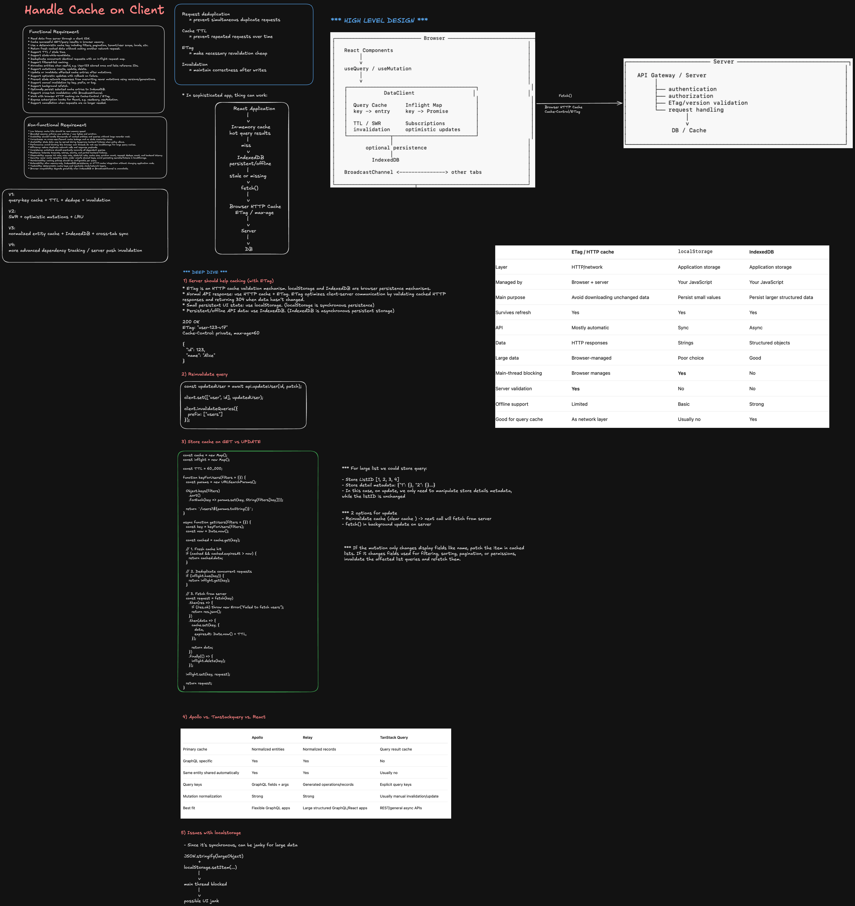

> **Editable diagram:** [Open in Excalidraw](https://excalidraw.com/#room=48e15d4dfcf0113cfbb8,pBjb8lBDZ3gL9JUpbOoYhQ)



## 1. Problem Statement

Design a browser-side client library for a React application that reads and updates server data while:

- caching read results on the client
- avoiding repeated requests for the same data
- supporting filtered and paginated lists
- keeping cached data correct after mutations
- preventing browser memory growth
- integrating cleanly with server-side HTTP caching

The server remains the source of truth.

---

## 2. Staff-Level Framing

A Staff Engineer should focus less on `Map` syntax and more on:

1. cache ownership and boundaries
2. cache-key correctness
3. read freshness semantics
4. mutation and invalidation strategy
5. filtered-list correctness
6. race conditions
7. request deduplication
8. memory bounds and garbage collection
9. browser HTTP cache / ETag integration
10. persistence choices
11. multi-tab consistency
12. security and tenant isolation
13. observability
14. testing and rollout strategy

A strong opening statement:

> I would separate application caching from browser HTTP caching. The client library owns query freshness, deduplication, subscriptions, optimistic updates, and invalidation. The browser HTTP cache handles transport reuse through `Cache-Control` and `ETag`. The most important correctness problems are cache-key construction, mutation/list reconciliation, and stale responses overwriting newer data.

---

## 3. Functional Requirements

- Read resources from the server.
- Cache successful GET/query results in memory.
- Support deterministic query keys.
- Include filters, sort, pagination, tenant/user scope, locale, permissions, and API version in cache identity where relevant.
- Return fresh cached data without another network call.
- Support TTL / stale time.
- Support stale-while-revalidate.
- Deduplicate simultaneous identical requests.
- Support filtered and paginated lists.
- Support create/update/delete mutations.
- Update or invalidate affected cached results after mutation.
- Support optimistic updates with rollback.
- Prevent stale responses from overwriting newer state.
- Support manual invalidation by key, prefix, or tag.
- Support React subscriptions.
- Optionally persist selected data to IndexedDB.
- Optionally support cross-tab invalidation.
- Integrate with HTTP `Cache-Control` and `ETag`.

---

## 4. Non-Functional Requirements

### Latency

- Memory-cache hits should be near-memory speed.
- Avoid unnecessary network round trips.

### Correctness

- Never return data from the wrong user or tenant.
- Mutations must not be overwritten by older reads.
- Filtered lists must remain semantically correct.

### Bounded resource usage

- Maximum entry count.
- Maximum approximate byte size.
- LRU or equivalent eviction.
- Garbage collection after unused queries become inactive.

### Reliability

- Handle timeouts and retries.
- Support stale-if-error where acceptable.
- Do not cache transient server failures.

### Performance

- Avoid main-thread blocking.
- Avoid using `localStorage` for large API caches.
- Avoid re-rendering the whole React tree when one record changes.

### Observability

Track:

- cache hit rate
- stale hit rate
- miss rate
- cache bytes
- entry count
- eviction count
- deduplicated request count
- background refetch count
- mutation rollback count
- backend request reduction
- P50 / P95 / P99 latency

---

## 5. High-Level Architecture

```text
┌──────────────────────────── Browser ────────────────────────────┐
│                                                               │
│   React Components                                            │
│        │                                                      │
│        v                                                      │
│   useQuery / useMutation                                      │
│        │                                                      │
│        v                                                      │
│   ┌──────────────────────────────────────────┐                 │
│   │              DataClient                 │                 │
│   │                                          │                 │
│   │  Query Cache       Inflight Map          │                 │
│   │  key -> entry      key -> Promise        │                 │
│   │                                          │                 │
│   │  Entity Store      Subscription Manager  │                 │
│   │  TTL / SWR         Invalidation          │                 │
│   │  LRU / GC          Mutation Coordinator  │                 │
│   └──────────────┬───────────────────────────┘                 │
│                  │                                            │
│           optional persistence                                │
│                  │                                            │
│              IndexedDB                                        │
│                                                               │
│   BroadcastChannel <---------------> other tabs               │
│                                                               │
└──────────────────────────┬────────────────────────────────────┘
                           │
                         fetch()
                           │
                           v
                    Browser HTTP Cache
                    Cache-Control / ETag
                           │
                           v
                        Server
                           │
                           v
                          DB
```

---

## 6. Cache Ownership

Use the right layer for the right problem.

| Layer                   | Responsibility                       |
| ----------------------- | ------------------------------------ |
| In-memory query cache   | Hot runtime server data              |
| Normalized entity cache | Shared canonical entities            |
| IndexedDB               | Persistent/offline structured data   |
| localStorage            | Small preferences only               |
| Browser HTTP cache      | HTTP response reuse and revalidation |
| CDN/server cache        | Shared server-side transport caching |

Recommended default:

```text
Hot API responses       -> memory
Persistent/offline data -> IndexedDB
Tiny preferences        -> localStorage
HTTP GET reuse          -> Cache-Control + ETag
```

---

## 7. Cache Key Design

A query result is correct only if the cache key fully represents everything that changes the response.

Example:

```ts
[
  'users',
  {
    teamId: 42,
    status: 'active',
    sort: 'name',
    cursor: 'abc',
    tenantId: 't1',
    locale: 'en-US',
  },
];
```

Relevant dimensions may include:

```text
resource
filters
sort
pagination/cursor
search term
tenant
logged-in user
permissions
locale
feature flags
API version
```

Canonicalization matters.

These must become the same key:

```js
{ teamId: 42, status: "active" }
{ status: "active", teamId: 42 }
```

Bad cache-key design can cause both correctness bugs and cross-tenant data leakage.

---

## 8. Basic Data Structures

```ts
interface QueryEntry<T> {
  data?: T;
  error?: Error;
  updatedAt: number;
  staleAt: number;
  gcAt?: number;
  generation: number;
  subscribers: Set<() => void>;
}

class DataClient {
  private cache = new Map<string, QueryEntry<unknown>>();
  private inflight = new Map<string, Promise<unknown>>();
}
```

For normalized caching:

```ts
const entities = new Map<string, unknown>();
const queries = new Map<string, string[]>();
```

Example:

```text
Entity Store
User:1 -> { id:1, name:"Alice" }
User:2 -> { id:2, name:"Bob" }

Query Store
users:active -> ["User:1", "User:2"]
team:42      -> ["User:2"]
```

---

## 9. Read Path

```text
query(key)
   |
   v
fresh cache?
 /       \
yes       no
 |         |
return   in-flight request?
           /      \
         yes      no
          |        |
      reuse       fetch
      Promise       |
                    v
                  server
                    |
                    v
               store result
```

Core algorithm:

```ts
async function query<T>({
  key,
  fetcher,
  staleTime = 60_000,
}: {
  key: unknown[];
  fetcher: () => Promise<T>;
  staleTime?: number;
}): Promise<T> {
  const cacheKey = hashKey(key);
  const now = Date.now();
  const cached = cache.get(cacheKey) as QueryEntry<T> | undefined;

  if (cached?.data !== undefined && now < cached.staleAt) {
    return cached.data;
  }

  const existing = inflight.get(cacheKey);
  if (existing) {
    return existing as Promise<T>;
  }

  const request = fetcher()
    .then((data) => {
      cache.set(cacheKey, {
        data,
        updatedAt: Date.now(),
        staleAt: Date.now() + staleTime,
        generation: cached?.generation ?? 0,
        subscribers: cached?.subscribers ?? new Set(),
      });

      notify(cacheKey);
      return data;
    })
    .finally(() => {
      inflight.delete(cacheKey);
    });

  inflight.set(cacheKey, request);
  return request;
}
```

---

## 10. Request Deduplication

Without request coalescing:

```text
Component A --> GET /users/123
Component B --> GET /users/123
Component C --> GET /users/123
```

With an in-flight map:

```text
Component A ---+
Component B ---+----> one Promise ----> one HTTP request
Component C ---+
```

Data structure:

```ts
Map<queryKey, Promise<Response>>;
```

This solves duplicate requests occurring at the same time.

It is different from TTL caching, which prevents repeated requests over time.

---

## 11. Fresh, Stale, and Garbage-Collected

Separate freshness from retention.

```text
0 ---------------- 1m ------------------------ 5m
       fresh                  stale                GC
```

Example:

```text
staleTime = 1 minute
gcTime    = 5 minutes
```

### Fresh

Return cached value immediately with no network request.

### Stale

Optionally return cached data immediately and refresh in the background.

### Garbage collected

Remove the entry after it has been unused long enough.

Staff-level point:

> TTL determines freshness. GC/LRU determines resource retention. They are different policies.

---

## 12. Stale-While-Revalidate

```text
request
   |
   v
stale cache exists
   |
   +----------> return stale value immediately
   |
   +----------> background network refresh
                     |
                     v
                 newer value
                     |
                     v
                  notify UI
```

Useful when:

- slight staleness is acceptable
- latency matters
- data changes moderately often
- backend calls are expensive

Avoid for strongly consistent or sensitive workflows unless explicitly allowed.

---

## 13. GET List Caching

Example:

```text
GET /users?status=active
GET /users?status=inactive
```

Cache keys:

```text
users:{status:active}
users:{status:inactive}
```

Simple cache:

```js
cache.set('users:active', [
  { id: 1, name: 'Alice' },
  { id: 2, name: 'Bob' },
]);
```

For large systems, prefer normalized storage:

```text
Entity Store
User:1 -> Alice
User:2 -> Bob

Query Store
users:active -> [1,2]
```

This avoids duplicating full objects across many filtered lists.

---

## 14. Mutation Strategy

There are three main strategies.

### A. Invalidate and refetch

```text
PATCH user
   |
 success
   |
 invalidate affected queries
   |
 next read/refetch gets canonical server data
```

Best when:

- server owns filtering/ranking
- pagination is complex
- correctness matters more than avoiding a refetch

### B. Update cache from server response

```ts
const updated = await api.updateUser(id, patch);
client.set(['user', id], updated);
```

Best when:

- mutation response contains the canonical updated entity
- membership in related lists does not change

### C. Optimistic update

```ts
const previous = client.get(['user', id]);

client.set(['user', id], {
  ...previous,
  ...patch,
});

try {
  const actual = await api.updateUser(id, patch);
  client.set(['user', id], actual);
} catch (err) {
  client.set(['user', id], previous);
  throw err;
}
```

Best when:

- user interaction should feel instant
- rollback semantics are clear

---

## 15. Updating One Item in a Cached List

Simple case: a display field changes.

Before:

```text
activeUsers -> [
  { id:1, name:"Alice" },
  { id:2, name:"Bob" }
]
```

Mutation:

```text
Bob.name -> Bobby
```

Safe local patch:

```js
function updateCachedList(list, updatedUser) {
  return list.map((user) => (user.id === updatedUser.id ? updatedUser : user));
}
```

---

## 16. Hard Case: Mutation Changes Filter Membership

Before:

```text
active   -> [1,2]
inactive -> [3]
```

Mutation:

```text
User:2 status active -> inactive
```

Correct result:

```text
active   -> [1]
inactive -> [2,3]
```

Two strategies:

### Local reconciliation

Use when filter logic is simple and client-owned.

```js
function matchesFilter(user, filter) {
  if (filter.status && user.status !== filter.status) {
    return false;
  }

  return true;
}
```

### Invalidate and refetch

Use when list membership depends on:

- server-side ranking
- complex filters
- pagination/cursors
- permissions
- full-text search
- machine-learning ranking
- server-only business rules

Staff-level statement:

> If membership is simple and deterministic, I can reconcile locally. If query semantics are server-owned, I invalidate affected query results instead of duplicating backend business logic in the browser.

---

## 17. Normalized Entity Cache

Apollo/Relay-style normalized caching can reduce duplication.

Instead of:

```text
activeUsers -> [full User 1, full User 2]
teamUsers   -> [full User 2, full User 3]
search      -> [full User 2]
```

Use:

```text
Entity Store
User:1 -> object
User:2 -> object
User:3 -> object

Query Store
activeUsers -> [1,2]
teamUsers   -> [2,3]
search      -> [2]
```

Updating `User:2` changes one canonical object.

But normalized caching does **not** automatically solve filtered-list membership. Query/index references may still need reconciliation or invalidation.

---

## 18. Race Condition: Old GET Overwrites New Mutation

Critical Staff-level deep dive.

```text
T1 GET user starts
       |
       | old response contains Alice
       |
T2 PATCH user -> Bob
       |
cache = Bob
       |
T1 returns Alice
       |
cache = Alice   ❌
```

### Solution: generation/version

```ts
const generations = new Map<string, number>();
```

Before starting request:

```ts
const generation = generations.get(key) ?? 0;
```

After response:

```ts
const result = await fetcher();

if ((generations.get(key) ?? 0) === generation) {
  cache.set(key, result);
}
```

Mutation/invalidation:

```ts
generations.set(key, (generations.get(key) ?? 0) + 1);
```

Alternative: server entity version.

```text
cache version = 18
incoming response version = 17

17 < 18 -> discard
```

---

## 19. Cancellation and Shared Requests

Suppose:

```text
Component A ---+
Component B ---+--> same request
Component C ---+
```

If A unmounts, do not automatically abort the network request because B and C still need it.

Model:

```ts
interface InflightRequest<T> {
  promise: Promise<T>;
  controller: AbortController;
  subscribers: number;
}
```

Abort only when:

```text
subscribers === 0
```

---

## 20. Memory Safety

Never rely on TTL alone.

Example failure:

```text
TTL = 1 hour
1,000,000 unique query keys
```

Even with TTL, the browser can run out of memory before expiration.

Use:

```text
maxEntries
maxBytes
LRU
GC
do-not-cache threshold
pagination
normalization
```

Strong interview line:

> TTL is a freshness policy; LRU/max-size is a memory policy. A production browser cache needs both.

---

## 21. LRU Eviction

Conceptual structure:

```text
MRU
 |
 v
[A] <-> [D] <-> [B] <-> [C]
                         ^
                         |
                        LRU
```

When capacity is exceeded, evict the least recently used entry.

Typical target:

```text
HashMap + doubly linked list
get    O(1)
set    O(1)
evict  O(1)
```

For a simpler browser implementation, `Map` insertion order can approximate LRU.

---

## 22. Byte-Based Bounds

Entry count alone is insufficient.

```text
500 tiny records != 500 large documents
```

Track approximate size:

```ts
interface CacheEntry<T> {
  data: T;
  sizeBytes: number;
}
```

Example policy:

```text
maxEntries = 500
maxBytes   = 20 MB
```

Avoid memory caching:

- large images
- video
- large binary payloads
- huge unpaginated tables
- multi-megabyte documents unless necessary

---

## 23. localStorage vs IndexedDB vs HTTP Cache

### localStorage

Best for:

- theme
- locale
- tiny preferences
- selected workspace

Avoid for large API caches because:

- synchronous
- string-only
- JSON serialization cost
- can block main thread

### IndexedDB

Best for:

- offline-first data
- large structured data
- persistent query cache
- documents/messages/metadata

Advantages:

- asynchronous
- structured objects
- larger capacity
- transactions and indexes

### HTTP cache + ETag

Best for:

- network-response reuse
- bandwidth reduction
- validation against server source of truth

They are complementary.

---

## 24. ETag and Browser HTTP Cache

Server response:

```http
HTTP/1.1 200 OK
Cache-Control: private, max-age=60
ETag: "user-123-v17"
```

After the response becomes stale:

```http
GET /api/users/123
If-None-Match: "user-123-v17"
```

If unchanged:

```http
HTTP/1.1 304 Not Modified
```

If changed:

```http
HTTP/1.1 200 OK
ETag: "user-123-v18"
```

Staff-level distinction:

```text
Application cache
= query state
= subscriptions
= mutation consistency
= dedupe
= optimistic updates

HTTP cache / ETag
= network reuse
= bandwidth reduction
= server validation
```

Do not treat ETag as a replacement for the application cache.

---

## 25. Example Server ETag Implementation

```js
app.get('/api/users/:id', async (req, res) => {
  const user = await db.getUser(req.params.id);

  const etag = `"user-${user.id}-v${user.version}"`;

  res.setHeader('Cache-Control', 'private, max-age=60');

  res.setHeader('ETag', etag);

  if (req.headers['if-none-match'] === etag) {
    return res.status(304).end();
  }

  res.json(user);
});
```

Frontend:

```js
const response = await fetch('/api/users/123');
const user = await response.json();
```

The browser handles normal HTTP caching behavior automatically.

---

## 26. Cross-Tab Consistency

Problem:

```text
Tab A updates User:2
Tab B still has stale User:2 in memory
```

Use `BroadcastChannel` when required.

```js
const channel = new BroadcastChannel('query-cache');

channel.postMessage({
  type: 'INVALIDATE',
  key: ['user', '2'],
});
```

Other tabs:

```js
channel.onmessage = (event) => {
  if (event.data.type === 'INVALIDATE') {
    client.invalidate(event.data.key);
  }
};
```

---

## 27. Retry and Failure Handling

Retry transient failures such as:

```text
network timeout
connection reset
429
502
503
504
```

Usually do not automatically retry:

```text
400
401
403
validation errors
```

Use exponential backoff with jitter.

```text
100ms
250ms
500ms
1100ms
...
```

Do not cache transient `500` responses as normal data.

Optional short negative caching can be useful for stable `404` results.

---

## 28. Stale-if-Error

For non-critical data, stale data may be safer than an empty UI during a temporary outage.

```text
cache stale
   |
refresh fails
   |
serve stale value
   |
show subtle stale/error state if needed
```

This must be a product/business decision, not an accidental cache behavior.

---

## 29. React Integration

Do not put the entire cache object into Context state.

Better:

```tsx
const DataClientContext = createContext<DataClient | null>(null);

function DataClientProvider({ children }) {
  const client = useMemo(() => new DataClient(), []);

  return <DataClientContext.Provider value={client}>{children}</DataClientContext.Provider>;
}
```

Context distributes the stable client instance.

Each component subscribes only to the query it uses.

```tsx
function useQuery(options) {
  const client = useDataClient();

  return useSyncExternalStore(
    (listener) => client.subscribe(options.key, listener),
    () => client.getSnapshot(options.key)
  );
}
```

This avoids rerendering the whole application whenever one cache entry changes.

---

## 30. Security and Isolation

Cache correctness is also a security problem.

Include appropriate scope in cache identity:

```text
tenant
user
permissions
locale
API version
```

Important rules:

- clear user-specific cache on logout
- clear or partition cache on account switch
- never reuse tenant-scoped results across tenants
- do not persist sensitive data unnecessarily
- avoid storing auth tokens in localStorage by default
- use `Cache-Control: private` for user-specific HTTP responses

---

## 31. Observability

Minimum metrics:

```text
cache_hit
cache_miss
stale_hit
cache_entry_count
cache_bytes
cache_eviction
request_deduplicated
background_refetch
mutation_success
mutation_rollback
retry_count
backend_latency
```

Derived metrics:

```text
hit rate = hits / (hits + misses)
```

But do not optimize for hit rate alone.

Also measure:

- user-visible latency
- memory use
- backend QPS reduction
- stale-read rate
- error rate

---

## 32. Testing Strategy

### Unit tests

- deterministic query-key serialization
- TTL expiration
- stale-while-revalidate
- LRU eviction
- byte-limit eviction
- entity normalization
- filter membership logic

### Concurrency tests

- two identical reads create one network request
- mutation while read is in flight
- stale request cannot overwrite newer mutation
- cancellation with multiple subscribers

### Integration tests

- mutation invalidates filtered lists
- optimistic rollback
- tenant switch clears scoped cache
- ETag 304 behavior
- IndexedDB hydration
- cross-tab invalidation

### Performance tests

- thousands of cache entries
- large lists
- repeated navigation
- memory growth over time
- rerender counts

---

## 33. Evolution Strategy

Do not overbuild V1.

### V1

```text
query-key cache
TTL
request dedupe
manual invalidation
```

### V2

```text
stale-while-revalidate
optimistic mutation
LRU / GC
```

### V3

```text
normalized entities
IndexedDB persistence
cross-tab sync
```

### V4

```text
advanced dependency tracking
server-driven invalidation
push updates / subscriptions
fine-grained cache policies
```

---

## 34. Staff-Level Tradeoff Summary

### Query result cache vs normalized entity cache

Use query result caching when:

- application is small
- responses are not heavily duplicated
- simple invalidation is acceptable

Use normalization when:

- many views share the same entities
- large lists duplicate objects
- one entity update should propagate widely

### Local patch vs invalidate/refetch

Patch locally when:

- mutation result is canonical
- filter membership does not change
- list semantics are simple

Invalidate/refetch when:

- filtering/ranking is server-owned
- pagination/cursors are affected
- permissions are involved
- local reconciliation could diverge from backend behavior

### Memory vs persistence

Use memory by default.

Add IndexedDB only if product requirements justify:

- offline mode
- restart persistence
- expensive-to-refetch data

### Application cache vs HTTP cache

Use both.

```text
Application cache -> correctness + UX
HTTP cache        -> transport efficiency
```

---

## 35. 60-Second Interview Answer

> I would build a browser data client around deterministic query keys, an in-memory query cache, and an in-flight request map. Fresh results return immediately; stale results can use stale-while-revalidate; identical concurrent reads share one Promise. For large entity-heavy applications I would normalize entities so filtered lists reference entity IDs instead of duplicating objects. Mutations either patch the canonical entity or invalidate affected query lists, especially when filtering, ranking, pagination, or permissions are server-owned. I would guard against stale GETs overwriting newer mutations using generations or server versions. Memory is bounded using LRU, max entries, max bytes, and garbage collection. The browser HTTP cache remains a separate lower layer using `Cache-Control` and `ETag`. IndexedDB is optional for persistence/offline behavior; localStorage is reserved for small preferences. Finally, I would instrument hit rate, stale reads, memory usage, evictions, deduplicated requests, and backend QPS reduction.

---

## 36. Whiteboard Checklist

When drawing the design, include:

```text
[ ] React Components
[ ] useQuery / useMutation
[ ] DataClient
[ ] Query Cache
[ ] Entity Store
[ ] Inflight Map
[ ] Subscription Manager
[ ] TTL / SWR
[ ] LRU / GC
[ ] Mutation Coordinator
[ ] IndexedDB optional layer
[ ] BroadcastChannel optional layer
[ ] Browser HTTP cache
[ ] Cache-Control / ETag
[ ] Server / DB
```

During deep dive, prioritize:

```text
1. cache-key correctness
2. mutation/list invalidation
3. filtered-list membership
4. stale-response race
5. request dedupe
6. bounded memory
7. ETag vs application cache
8. tenant isolation
```

---

## 37. Common Interview Traps

### Trap 1: "TTL prevents memory problems"

Incorrect.

TTL controls freshness, not maximum memory.

### Trap 2: "Just use localStorage"

Poor choice for large query caches because it is synchronous and string-based.

### Trap 3: "Updating the entity automatically fixes every list"

Only partly true.

A changed entity may need to leave or enter filtered lists.

### Trap 4: "ETag replaces the client query cache"

Incorrect.

ETag optimizes HTTP revalidation. It does not provide React subscriptions, optimistic updates, deduplication, or dependency invalidation.

### Trap 5: "Just update all cached lists locally"

Dangerous when backend filtering/ranking logic is complex.

### Trap 6: "React Context can hold all server state"

Possible for tiny apps, but broad Context updates can create unnecessary rerenders and poor cache encapsulation.

---

## Final Staff Engineer Principle

> Treat client caching as a consistency system, not just a performance optimization. First define identity, ownership, freshness, mutation semantics, and race handling. Then optimize latency and bandwidth with request deduplication, stale-while-revalidate, normalization, bounded memory, and HTTP revalidation.
