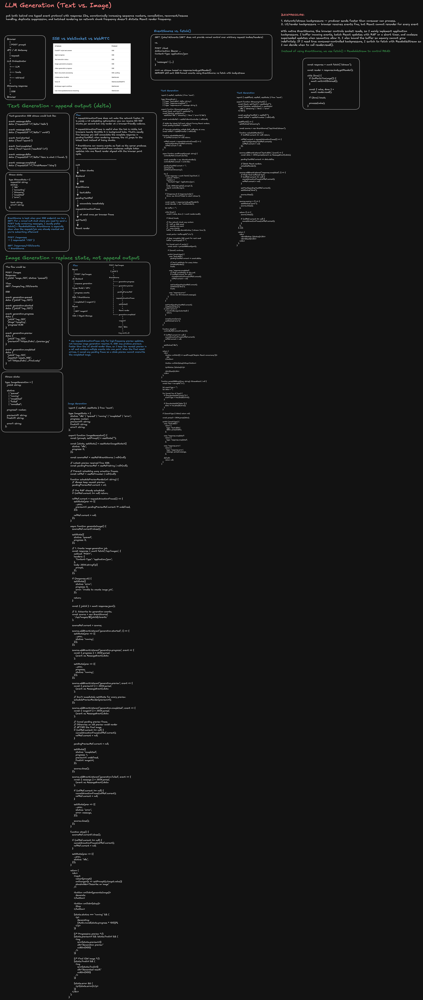

# LLM Streaming Frontend: Text vs Image Generation

This guide focuses on how I would discuss and implement **LLM text streaming versus image generation** in a staff-level frontend interview.

The core distinction is:

```text
TEXT
User request
   |
   v
LLM produces incremental text deltas
   |
   v
Stream deltas to browser
   |
   v
Append text
   |
   v
Batch React rendering


IMAGE
User request
   |
   v
Create durable generation job
   |
   v
GPU/model generates image
   |
   +--> progress / preview events
   |
   v
Final binary -> Object Storage / CDN
   |
   v
SSE sends final image URL
   |
   v
React renders 
```

## 1. Text LLM vs Image Generation

| Concern                 | Text LLM                         | Image Generation                |
| ----------------------- | -------------------------------- | ------------------------------- |
| Output                  | Incremental tokens/deltas        | Job + previews + final asset    |
| State update            | Append                           | Replace latest preview/progress |
| Common transport        | `fetch()` streaming / SSE        | POST job + EventSource/SSE      |
| Binary payload          | Usually none                     | Stored in blob storage/CDN      |
| `requestAnimationFrame` | Very useful                      | Useful for frequent previews    |
| Resume identity         | `responseId + sequence`          | `jobId + sequence`              |
| Cancellation            | Abort stream + server cancel     | Close stream + cancel GPU/job   |
| Retry                   | Resume/reconnect response        | Reconnect to durable job        |
| Major race              | Duplicate/misordered text events | Stale preview after final image |

## 2. Why SSE for LLM Streaming?

A traditional LLM interaction is mostly asymmetric:

```text
Browser -------------------> Server
           prompt

Browser <------------------- Server
      token token token token
```

The client sends one command, then receives many server events.

That makes SSE a strong default.

Typical event types:

```text
response.created
text.delta
tool.started
tool.completed
citation
image.progress
image.preview
image.completed
response.completed
response.failed
```

For continuously bidirectional traffic, prefer WebSocket/WebRTC.

```text
Voice agent
Browser ---- audio chunks ----> Server
Browser <--- transcript -------- Server
Browser <--- synthesized audio - Server
Browser ---- interrupt ---------> Server
```

## 3. `fetch()` Streaming vs `EventSource`

### `fetch()` streaming

Useful when the initial LLM request itself must be:

```http
POST /api/chat
Content-Type: application/json

{
  "messages": [...]
}
```

Advantages:

- POST request body.
- Normal auth headers.
- `AbortController`.
- Direct access to `ReadableStream`.
- Good for request -> streaming response.

Architecture:

```text
React
  |
  | POST /api/chat
  v
AI Gateway
  |
  | stream
  v
ReadableStream
  |
  v
SSE parser
  |
  v
React
```

### `EventSource`

Useful when the resource already exists:

```text
POST /api/responses
      |
      v
{ responseId: "resp_123" }

GET /api/responses/resp_123/events
      |
      v
EventSource
```

Or for image generation:

```text
POST /api/images
      |
      v
{ jobId: "img_123" }

GET /api/images/img_123/events
      |
      v
EventSource
```

Benefits:

- Native SSE parser.
- Automatic reconnect.
- Supports `Last-Event-ID`.
- Simple GET subscription.

Limitation:

> `EventSource` is primarily GET-oriented and does not provide the same arbitrary POST-body/header control as `fetch()`.

## 4. Shared AI Event Contract

A staff-level implementation should avoid raw string streams.

```ts
export type AIEvent =
  | {
      type: 'response.created';
      responseId: string;
      sequence: number;
    }
  | {
      type: 'text.delta';
      responseId: string;
      sequence: number;
      delta: string;
    }
  | {
      type: 'tool.started';
      responseId: string;
      sequence: number;
      toolCallId: string;
      tool: string;
    }
  | {
      type: 'tool.completed';
      responseId: string;
      sequence: number;
      toolCallId: string;
    }
  | {
      type: 'image.progress';
      jobId: string;
      sequence: number;
      progress: number;
    }
  | {
      type: 'image.preview';
      jobId: string;
      sequence: number;
      revision: number;
      previewUrl: string;
    }
  | {
      type: 'image.completed';
      jobId: string;
      sequence: number;
      imageUrl: string;
    }
  | {
      type: 'response.completed';
      responseId: string;
      sequence: number;
    }
  | {
      type: 'response.failed';
      responseId: string;
      sequence: number;
      error: string;
    };
```

Key properties:

```text
responseId / jobId
    -> identity

sequence
    -> ordering
    -> duplicate suppression
    -> reconnect checkpoint

type
    -> event routing
```

## 5. React Text Streaming with `fetch()` + requestAnimationFrame

The goal is to decouple:

```text
NETWORK UPDATE RATE
from
REACT RENDER RATE
```

Without batching:

```text
token
  -> setState
  -> render

token
  -> setState
  -> render
```

With RAF:

```text
token
token
token
token
  |
  v
pendingTextRef
  |
  v
requestAnimationFrame
  |
  v
ONE setState
  |
  v
React render
```

```tsx
import { useCallback, useEffect, useRef, useState } from 'react';

type StreamStatus = 'idle' | 'connecting' | 'streaming' | 'completed' | 'cancelled' | 'error';

type TextDeltaEvent = {
  type: 'text.delta';
  responseId: string;
  sequence: number;
  delta: string;
};

type CompletedEvent = {
  type: 'response.completed';
  responseId: string;
  sequence: number;
};

type FailedEvent = {
  type: 'response.failed';
  responseId: string;
  sequence: number;
  error: string;
};

type StreamEvent = TextDeltaEvent | CompletedEvent | FailedEvent;

export function StreamingTextExample() {
  const [text, setText] = useState('');
  const [status, setStatus] = useState<StreamStatus>('idle');

  const controllerRef = useRef<AbortController | null>(null);

  const responseIdRef = useRef<string | null>(null);

  const pendingTextRef = useRef('');
  const lastSequenceRef = useRef(0);
  const rafRef = useRef<number | null>(null);

  const scheduleRender = useCallback(() => {
    if (rafRef.current !== null) return;

    rafRef.current = requestAnimationFrame(() => {
      setText(pendingTextRef.current);
      rafRef.current = null;
    });
  }, []);

  const flushRender = useCallback(() => {
    if (rafRef.current !== null) {
      cancelAnimationFrame(rafRef.current);
      rafRef.current = null;
    }

    setText(pendingTextRef.current);
  }, []);

  const applyEvent = useCallback(
    (event: StreamEvent) => {
      if (event.sequence <= lastSequenceRef.current) {
        return;
      }

      lastSequenceRef.current = event.sequence;

      switch (event.type) {
        case 'text.delta':
          pendingTextRef.current += event.delta;
          scheduleRender();
          return;

        case 'response.completed':
          flushRender();
          setStatus('completed');
          return;

        case 'response.failed':
          throw new Error(event.error);
      }
    },
    [flushRender, scheduleRender]
  );

  const sendPrompt = useCallback(
    async (prompt: string) => {
      controllerRef.current?.abort();

      const controller = new AbortController();
      controllerRef.current = controller;

      pendingTextRef.current = '';
      lastSequenceRef.current = 0;
      responseIdRef.current = null;

      setText('');
      setStatus('connecting');

      try {
        const response = await fetch('/api/chat', {
          method: 'POST',
          headers: {
            'Content-Type': 'application/json',
          },
          body: JSON.stringify({ prompt }),
          signal: controller.signal,
        });

        if (!response.ok || !response.body) {
          throw new Error(`HTTP ${response.status}`);
        }

        setStatus('streaming');

        const reader = response.body.getReader();
        const decoder = new TextDecoder();

        let buffer = '';

        while (true) {
          const { value, done } = await reader.read();

          if (done) break;

          buffer += decoder.decode(value, {
            stream: true,
          });

          const parsed = parseSSEBuffer(buffer);
          buffer = parsed.remaining;

          for (const event of parsed.events) {
            responseIdRef.current = event.responseId;
            applyEvent(event);
          }
        }

        flushRender();

        setStatus((current) => (current === 'streaming' ? 'completed' : current));
      } catch (error) {
        if (controller.signal.aborted) {
          flushRender();
          setStatus('cancelled');
          return;
        }

        console.error(error);
        setStatus('error');
      }
    },
    [applyEvent, flushRender]
  );

  const stop = useCallback(async () => {
    controllerRef.current?.abort();
    flushRender();

    const responseId = responseIdRef.current;

    if (responseId) {
      try {
        await fetch(`/api/responses/${responseId}/cancel`, { method: 'POST' });
      } catch {
        // Best effort.
      }
    }

    setStatus('cancelled');
  }, [flushRender]);

  useEffect(() => {
    return () => {
      controllerRef.current?.abort();

      if (rafRef.current !== null) {
        cancelAnimationFrame(rafRef.current);
      }
    };
  }, []);

  return (
    <section>
      <button onClick={() => sendPrompt('Explain React concurrency')}>Ask</button>

      <button onClick={stop}>Stop</button>

      <p>Status: {status}</p>

      <article>{text}</article>
    </section>
  );
}

function parseSSEBuffer(buffer: string): {
  events: StreamEvent[];
  remaining: string;
} {
  const blocks = buffer.split('\n\n');
  const remaining = blocks.pop() ?? '';
  const events: StreamEvent[] = [];

  for (const block of blocks) {
    const event = parseSSEEvent(block);

    if (event) {
      events.push(event);
    }
  }

  return {
    events,
    remaining,
  };
}

function parseSSEEvent(block: string): StreamEvent | null {
  const lines = block.split('\n');

  let eventType = '';
  let data = '';

  for (const line of lines) {
    if (line.startsWith('event:')) {
      eventType = line.slice(6).trim();
    }

    if (line.startsWith('data:')) {
      data += line.slice(5).trim();
    }
  }

  if (!eventType || !data) {
    return null;
  }

  const payload = JSON.parse(data);

  return {
    ...payload,
    type: eventType,
  } as StreamEvent;
}
```

## 6. Why `requestAnimationFrame` Helps Text Streaming

If the server emits many chunks each second, the browser does not need a React render for every chunk.

```text
Network:
  1 2 3 4 5 6 7 8 9 ...

Ref:
  accumulate latest text

Browser paint:
      |       |       |
      v       v       v
    render  render  render
```

Key principle:

> Network throughput should not directly determine React rendering throughput.

## 7. EventSource Text Streaming

```tsx
import { useEffect, useRef, useState } from 'react';

export function EventSourceText({ responseId }: { responseId: string }) {
  const [text, setText] = useState('');
  const [status, setStatus] = useState<'connecting' | 'streaming' | 'completed' | 'error'>(
    'connecting'
  );

  const pendingRef = useRef('');
  const rafRef = useRef<number | null>(null);
  const lastSequenceRef = useRef(0);

  useEffect(() => {
    const source = new EventSource(`/api/responses/${responseId}/events`);

    const scheduleRender = () => {
      if (rafRef.current !== null) return;

      rafRef.current = requestAnimationFrame(() => {
        setText(pendingRef.current);
        rafRef.current = null;
      });
    };

    source.addEventListener('text.delta', (raw) => {
      const data = JSON.parse((raw as MessageEvent).data);

      if (data.sequence <= lastSequenceRef.current) {
        return;
      }

      lastSequenceRef.current = data.sequence;
      pendingRef.current += data.delta;

      setStatus('streaming');
      scheduleRender();
    });

    source.addEventListener('response.completed', () => {
      if (rafRef.current !== null) {
        cancelAnimationFrame(rafRef.current);
        rafRef.current = null;
      }

      setText(pendingRef.current);
      setStatus('completed');
      source.close();
    });

    source.onerror = () => {
      // EventSource reconnects automatically.
      setStatus('connecting');
    };

    return () => {
      source.close();

      if (rafRef.current !== null) {
        cancelAnimationFrame(rafRef.current);
      }
    };
  }, [responseId]);

  return (
    <div>
      <p>{status}</p>
      <article>{text}</article>
    </div>
  );
}
```

## 8. Text Retry and Reconnect

A network disconnect does not necessarily mean generation failed.

```text
LLM still generating
        |
        v
Backend still receiving tokens
        |
       XXX
Browser connection lost
```

Do not blindly create a new generation.

```text
CREATE ONCE
   |
   v
responseId
   |
   +---- initial stream
   +---- reconnect stream
   +---- fetch canonical state
```

Resume API:

```http
GET /api/responses/resp_123/events?after=105
```

Server-side event history can temporarily live in Redis:

```text
response:resp_123

101 text.delta
102 text.delta
103 tool.started
104 tool.completed
105 text.delta
106 text.delta
107 response.completed

TTL: 5-15 minutes
```

## 9. Exponential Backoff Retry

```ts
function sleep(ms: number) {
  return new Promise((resolve) => setTimeout(resolve, ms));
}

function retryDelay(attempt: number) {
  const base = 500;
  const max = 10_000;

  const exponential = Math.min(max, base * 2 ** attempt);

  const jitter = Math.random() * 300;

  return exponential + jitter;
}
```

```ts
async function reconnectStream({
  responseId,
  after,
  signal,
}: {
  responseId: string;
  after: number;
  signal: AbortSignal;
}) {
  const maxAttempts = 5;

  for (let attempt = 0; attempt < maxAttempts; attempt++) {
    if (signal.aborted) {
      throw new DOMException('Aborted', 'AbortError');
    }

    try {
      const response = await fetch(`/api/responses/${responseId}/events?after=${after}`, {
        signal,
      });

      if (!response.ok) {
        throw new Error(`HTTP ${response.status}`);
      }

      return response;
    } catch (error) {
      if (signal.aborted) {
        throw error;
      }

      if (attempt === maxAttempts - 1) {
        throw error;
      }

      await sleep(retryDelay(attempt));
    }
  }

  throw new Error('Unable to reconnect');
}
```

## 10. Retry Classification

Retryable examples:

```text
network disconnect
HTTP 408
HTTP 429
HTTP 502
HTTP 503
HTTP 504
temporary gateway failure
```

Usually not retryable:

```text
HTTP 400 malformed prompt
HTTP 401 invalid auth
HTTP 403 forbidden
HTTP 404 invalid response/job id
content-policy rejection
invalid tool arguments
```

```ts
function isRetryableStatus(status: number) {
  return [408, 429, 502, 503, 504].includes(status);
}
```

For `429`, honor `Retry-After` when available.

## 11. Abort vs Cancel

`AbortController` means:

```text
Browser
   X
stop waiting / stop reading
```

It does **not guarantee**:

```text
GPU / LLM inference stops.
```

Use explicit server cancellation:

```http
POST /api/responses/resp_123/cancel
```

or:

```http
POST /api/images/img_123/cancel
```

```ts
async function cancelResponse(responseId: string, controller: AbortController) {
  controller.abort();

  try {
    await fetch(`/api/responses/${responseId}/cancel`, {
      method: 'POST',
    });
  } catch {
    // Best effort.
  }
}
```

## 12. Cancellation Is Best Effort

There is always a race:

```text
Client                   Server

cancel -------------------->

                         model finishes

                         persist result

<------------------- completed
```

Cancellation semantics:

```text
queued
  -> remove from queue

running
  -> ask model/GPU provider to stop

completed
  -> too late

failed
  -> no-op

cancelled
  -> idempotent no-op
```

## 13. Image Generation Architecture

```text
React
  |
  | POST /api/images
  v
AI Gateway
  |
  v
Job DB
  |
  v
Queue
  |
  v
GPU worker
  |
  +--------> progress events
  |
  +--------> preview asset
  |
  +--------> final asset
                  |
                  v
           Object Storage
                  |
                  v
                 CDN
```

The browser subscribes to:

```text
queued
started
progress
preview
completed
failed
cancelled
```

The actual image is not streamed through the application server.

## 14. Image API Contract

```http
POST /api/images
Content-Type: application/json
Idempotency-Key: 8c90...

{
  "prompt": "A futuristic city at sunset"
}
```

Response:

```json
{
  "jobId": "img_123",
  "status": "queued"
}
```

Subscribe:

```http
GET /api/images/img_123/events
```

Example events:

```text
id: 1
event: generation.started
data: {"jobId":"img_123","sequence":1}

id: 2
event: generation.progress
data: {"jobId":"img_123","sequence":2,"progress":0.25}

id: 3
event: generation.preview
data: {"jobId":"img_123","sequence":3,"revision":1,"previewUrl":"https://cdn.example.com/img_123-preview-1.webp"}

id: 4
event: generation.progress
data: {"jobId":"img_123","sequence":4,"progress":0.75}

id: 5
event: generation.completed
data: {"jobId":"img_123","sequence":5,"imageUrl":"https://cdn.example.com/img_123-final.webp"}
```

## 15. Complete React Image Generation Example

```tsx
import { useCallback, useEffect, useRef, useState } from 'react';

type ImageStatus = 'idle' | 'queued' | 'running' | 'completed' | 'cancelled' | 'error';

type ImageState = {
  status: ImageStatus;
  progress: number;
  previewUrl?: string;
  finalUrl?: string;
  error?: string;
};

export function ImageGenerator() {
  const [prompt, setPrompt] = useState('');

  const [state, setState] = useState<ImageState>({
    status: 'idle',
    progress: 0,
  });

  const jobIdRef = useRef<string | null>(null);

  const sourceRef = useRef<EventSource | null>(null);

  const lastSequenceRef = useRef(0);
  const latestRevisionRef = useRef(0);

  const pendingPreviewRef = useRef<string | null>(null);

  const rafRef = useRef<number | null>(null);

  const terminalRef = useRef(false);

  const schedulePreview = useCallback((previewUrl: string, revision: number) => {
    if (terminalRef.current) {
      return;
    }

    if (revision <= latestRevisionRef.current) {
      return;
    }

    latestRevisionRef.current = revision;
    pendingPreviewRef.current = previewUrl;

    if (rafRef.current !== null) {
      return;
    }

    rafRef.current = requestAnimationFrame(() => {
      rafRef.current = null;

      if (terminalRef.current) {
        return;
      }

      const preview = pendingPreviewRef.current;

      if (!preview) {
        return;
      }

      setState((current) => ({
        ...current,
        previewUrl: preview,
      }));
    });
  }, []);

  const clearPendingPreview = useCallback(() => {
    if (rafRef.current !== null) {
      cancelAnimationFrame(rafRef.current);

      rafRef.current = null;
    }

    pendingPreviewRef.current = null;
  }, []);

  const generateImage = useCallback(async () => {
    sourceRef.current?.close();
    clearPendingPreview();

    terminalRef.current = false;
    lastSequenceRef.current = 0;
    latestRevisionRef.current = 0;

    setState({
      status: 'queued',
      progress: 0,
    });

    try {
      const response = await fetch('/api/images', {
        method: 'POST',
        headers: {
          'Content-Type': 'application/json',
          'Idempotency-Key': crypto.randomUUID(),
        },
        body: JSON.stringify({
          prompt,
        }),
      });

      if (!response.ok) {
        throw new Error(`HTTP ${response.status}`);
      }

      const {
        jobId,
      }: {
        jobId: string;
      } = await response.json();

      jobIdRef.current = jobId;

      const source = new EventSource(`/api/images/${jobId}/events`);

      sourceRef.current = source;

      source.addEventListener('generation.started', (raw) => {
        const data = JSON.parse((raw as MessageEvent).data);

        if (data.sequence <= lastSequenceRef.current) {
          return;
        }

        lastSequenceRef.current = data.sequence;

        setState((current) => ({
          ...current,
          status: 'running',
        }));
      });

      source.addEventListener('generation.progress', (raw) => {
        const data = JSON.parse((raw as MessageEvent).data);

        if (data.sequence <= lastSequenceRef.current) {
          return;
        }

        lastSequenceRef.current = data.sequence;

        setState((current) => ({
          ...current,
          status: 'running',
          progress: data.progress,
        }));
      });

      source.addEventListener('generation.preview', (raw) => {
        const data = JSON.parse((raw as MessageEvent).data);

        if (data.sequence <= lastSequenceRef.current) {
          return;
        }

        lastSequenceRef.current = data.sequence;

        schedulePreview(data.previewUrl, data.revision);
      });

      source.addEventListener('generation.completed', (raw) => {
        const data = JSON.parse((raw as MessageEvent).data);

        if (data.sequence <= lastSequenceRef.current) {
          return;
        }

        lastSequenceRef.current = data.sequence;

        terminalRef.current = true;

        clearPendingPreview();

        setState({
          status: 'completed',
          progress: 1,
          previewUrl: undefined,
          finalUrl: data.imageUrl,
        });

        source.close();
      });

      source.addEventListener('generation.failed', (raw) => {
        const data = JSON.parse((raw as MessageEvent).data);

        terminalRef.current = true;

        clearPendingPreview();

        setState((current) => ({
          ...current,
          status: 'error',
          error: data.message,
        }));

        source.close();
      });

      source.onerror = () => {
        // EventSource normally reconnects.
        // Do not equate transport failure
        // with generation failure.
      };
    } catch (error) {
      terminalRef.current = true;
      clearPendingPreview();

      setState({
        status: 'error',
        progress: 0,
        error: error instanceof Error ? error.message : 'Unknown error',
      });
    }
  }, [clearPendingPreview, prompt, schedulePreview]);

  const cancelGeneration = useCallback(async () => {
    terminalRef.current = true;

    sourceRef.current?.close();
    clearPendingPreview();

    const jobId = jobIdRef.current;

    if (jobId) {
      try {
        await fetch(`/api/images/${jobId}/cancel`, {
          method: 'POST',
        });
      } catch {
        // Best effort.
      }
    }

    setState((current) => ({
      ...current,
      status: 'cancelled',
    }));
  }, [clearPendingPreview]);

  useEffect(() => {
    return () => {
      sourceRef.current?.close();
      clearPendingPreview();
    };
  }, [clearPendingPreview]);

  return (
    <section>
      <input
        value={prompt}
        onChange={(event) => setPrompt(event.target.value)}
        placeholder="Describe an image"
      />

      <button onClick={generateImage}>Generate</button>

      <button onClick={cancelGeneration}>Cancel</button>

      {state.status === 'running' && <p>Generating {Math.round(state.progress * 100)}%</p>}

      {state.previewUrl && !state.finalUrl && (
        
      )}

      {state.finalUrl && }

      {state.error && <p>{state.error}</p>}
    </section>
  );
}
```

## 16. Why requestAnimationFrame for Images?

It is not always necessary.

If image events are:

```text
10%
25%
50%
75%
100%
```

normal `setState` is fine.

RAF becomes useful when the backend produces frequent progressive previews.

```text
preview 1
preview 2
preview 3
preview 4
    |
    v
latest preview ref
    |
    v
requestAnimationFrame
    |
    v
render preview 4
```

The UI only needs the most recent visual state.

## 17. Image Preview Race Condition

```text
sequence 20 -> preview A
sequence 21 -> preview B
sequence 22 -> FINAL IMAGE

RAF callback for preview B
has not executed yet
```

Without protection:

```text
final image rendered
      |
      v
old RAF callback runs
      |
      v
preview B overwrites UI
```

Protect final state:

```ts
terminalRef.current = true;

if (rafRef.current !== null) {
  cancelAnimationFrame(rafRef.current);
}

pendingPreviewRef.current = null;

setState({
  status: 'completed',
  finalUrl: imageUrl,
});
```

Also guard the RAF callback:

```ts
requestAnimationFrame(() => {
  if (terminalRef.current) {
    return;
  }

  // update preview
});
```

## 18. Image Retry Strategy

Do not create a new generation job merely because SSE disconnected.

Wrong:

```text
POST image
   |
   v
job 123

SSE disconnect

POST image AGAIN
   |
   v
job 124
```

Better:

```text
POST image
   |
   v
job 123
   |
   +---- EventSource connection #1
   |
   X network disconnect
   |
   +---- EventSource reconnect
   |
   +---- GET job state
```

Fallback:

```http
GET /api/images/img_123
```

```json
{
  "jobId": "img_123",
  "status": "running",
  "progress": 0.64,
  "lastSequence": 18,
  "previewUrl": "https://cdn.example.com/preview-4.webp"
}
```

## 19. Idempotency for Image Job Creation

Failure case:

```text
Browser
   |
   | POST /images
   v
Server creates job 123
   |
   X response lost
```

Retrying without idempotency may create job 124.

Use:

```http
Idempotency-Key: user-action-abc
```

Server enforces:

```text
(user, idempotency_key)
         |
         v
unique constraint
```

```ts
async function createImageJob(userId: string, idempotencyKey: string, request: ImageRequest) {
  const existing = await db.jobs.findByKey(userId, idempotencyKey);

  if (existing) {
    return existing;
  }

  return db.transaction(async () => {
    return db.jobs.create({
      userId,
      idempotencyKey,
      request,
      status: 'queued',
    });
  });
}
```

## 20. EventSource Reconnection

Server may send:

```text
retry: 3000
```

Each event can include:

```text
id: 42
event: generation.progress
data: {...}
```

On reconnect the browser can send:

```http
Last-Event-ID: 42
```

Frontend should still dedupe:

```ts
if (event.sequence <= lastSequenceRef.current) {
  return;
}
```

Never assume exactly-once delivery.

## 21. Polling Fallback

```ts
async function pollJob(jobId: string, signal: AbortSignal) {
  while (!signal.aborted) {
    const response = await fetch(`/api/images/${jobId}`, { signal });

    const job = await response.json();

    if (job.status === 'completed') {
      return job;
    }

    if (job.status === 'failed' || job.status === 'cancelled') {
      throw new Error(job.error ?? job.status);
    }

    await sleep(2000);
  }
}
```

Tradeoff:

```text
SSE
+ lower latency
+ fewer requests
+ event oriented

Polling
+ operationally simple
+ easy fallback
- extra requests
- update latency
```

## 22. Control Plane vs Asset Plane

Avoid:

```json
{
  "type": "image.completed",
  "base64": "....50MB...."
}
```

Prefer:

```json
{
  "type": "image.completed",
  "assetId": "asset_456",
  "imageUrl": "https://cdn.example.com/image.webp"
}
```

```text
CONTROL PLANE

AI Service
   |
   | small events
   v
SSE
   |
   v
Browser


ASSET PLANE

GPU
 |
 v
Object Storage
 |
 v
CDN
 |
 v
Browser 
```

## 23. Should We Stream Binary Images Through WebSocket?

Technically possible:

```text
GPU
 |
 v
App server
 |
 | WebSocket binary frame
 v
Browser
```

Usually better:

```text
GPU
 |
 v
Object Storage
 |
 v
CDN
 |
 v
Browser
```

WebSocket should be chosen because the interaction is bidirectional, not merely because the output is binary.

## 24. Text vs Image State Model

Text:

```ts
type TextResponse = {
  responseId: string;

  status: 'streaming' | 'completed' | 'cancelled' | 'failed';

  text: string;

  lastSequence: number;
};
```

Image:

```ts
type ImageGeneration = {
  jobId: string;

  status: 'queued' | 'running' | 'completed' | 'cancelled' | 'failed';

  progress: number;

  previewUrl?: string;

  previewRevision: number;

  finalUrl?: string;

  lastSequence: number;
};
```

Mental model:

```text
Text:
append

Image:
replace / transition
```

## 25. Retry State Machine

```text
              +-------------+
              |    IDLE     |
              +------+------+
                     |
                   send
                     |
                     v
              +-------------+
              | CONNECTING  |
              +------+------+
                     |
                  connected
                     |
                     v
              +-------------+
              | STREAMING   |
              +------+------+
                     |
        +------------+------------+
        |            |            |
     complete    disconnect     cancel
        |            |            |
        v            v            v
   COMPLETED    RECONNECTING   CANCELLED
                     |
              +------+------+
              |             |
           success       max retry
              |             |
              v             v
          STREAMING       ERROR
```

For image generation:

```text
transport = reconnecting
generation = running
```

is valid.

## 26. Separate Transport State from Domain State

```ts
type ConnectionStatus = 'disconnected' | 'connecting' | 'connected' | 'reconnecting';

type GenerationStatus = 'queued' | 'running' | 'completed' | 'failed' | 'cancelled';
```

Do not collapse them into a single ambiguous `status`.

## 27. React Cleanup

For fetch:

```ts
useEffect(() => {
  return () => {
    controller.abort();
  };
}, []);
```

For EventSource:

```ts
useEffect(() => {
  const source = new EventSource(url);

  return () => {
    source.close();
  };
}, [url]);
```

For RAF:

```ts
useEffect(() => {
  return () => {
    if (rafRef.current !== null) {
      cancelAnimationFrame(rafRef.current);
    }
  };
}, []);
```

## 28. React Strict Mode

Development Strict Mode may expose duplicate subscription bugs.

Dangerous:

```tsx
useEffect(() => {
  const source = new EventSource(url);

  // no cleanup
}, []);
```

Correct:

```tsx
useEffect(() => {
  const source = new EventSource(url);

  return () => {
    source.close();
  };
}, [url]);
```

## 29. Backpressure and Rendering

```text
LLM
  |
  | many chunks/sec
  v
JS ingestion
  |
  v
Ref/buffer
  |
  | browser paint cadence
  v
React
```

RAF is a UI-level backpressure mechanism.

## 30. Markdown Streaming

Intermediate markdown may be incomplete.

````text
"```jav"

then

"ascript
const x ="

then

" 42;
```"
````

Consider lightweight rendering while streaming and expensive syntax highlighting only after completion.

## 31. Error Handling UX

Distinguish:

```text
generation failed
```

from:

```text
connection temporarily lost
```

A better UI may say:

```text
Generating image... 67%

Connection interrupted.
Reconnecting...
```

rather than:

```text
Generation failed.
```

## 32. Retry Budget

```ts
type RetryPolicy = {
  maxAttempts: number;
  maxElapsedMs: number;
};

const retryPolicy = {
  maxAttempts: 5,
  maxElapsedMs: 30_000,
};
```

Avoid infinite aggressive retries.

## 33. Observability

Frontend telemetry:

```text
response_id
job_id
connection_id
attempt
last_sequence
time_to_first_token
time_to_first_preview
time_to_complete
reconnect_count
cancel_requested
cancel_acknowledged
render_batch_count
error_type
```

Useful metrics:

```text
TTFT
Time To First Token

TTFP
Time To First Preview

Generation latency
SSE disconnect rate
Reconnect success rate
Duplicate event rate
Cancellation latency
User-abandon rate
```

## 34. Security Considerations

For protected generated assets, prefer short-lived signed CDN URLs or authenticated asset access.

Validate:

- job ownership,
- tenant ownership,
- asset scope,
- URL expiration,
- moderation state.

## 35. Staff-Level API Shape

Text:

```http
POST /api/responses
POST /api/responses/:id/cancel
GET  /api/responses/:id
GET  /api/responses/:id/events
```

Image:

```http
POST /api/images
POST /api/images/:id/cancel
GET  /api/images/:id
GET  /api/images/:id/events
```

This cleanly separates:

```text
COMMAND APIs
```

from:

```text
STATE / STREAM APIs
```

## 36. Staff Interview: Text vs Image Answer

> For text generation, I generally use HTTP POST plus a streaming response because the interaction is asymmetric: one client request followed by token, tool, citation, and completion events. On the frontend I ingest deltas into a ref and use `requestAnimationFrame` to batch React rendering, so network event frequency does not control render frequency.
>
> For image generation I use a durable asynchronous job. The initial POST returns a `jobId`; EventSource or SSE carries lifecycle, progress, and preview events, while the final binary goes to object storage/CDN. The stream returns an asset URL rather than transporting the binary through the application server.
>
> For reliability, both protocols use stable IDs, monotonic sequence numbers, dedupe, reconnect/resume, canonical GET state, explicit cancellation, and idempotency keys. I distinguish aborting the browser connection from cancelling server inference because stopping consumption does not necessarily stop model compute.

## 37. Staff Interview: Retry Deep Dive

> I treat connection failure separately from generation failure. If I already have a `responseId` or `jobId`, I do not create a new model request. I reconnect to the existing resource using the last processed sequence number or `Last-Event-ID`. The frontend ignores duplicate sequences. If the event history is no longer available, I fetch canonical state through `GET /responses/:id` or `GET /images/:id` and resume from the server's last known sequence. Retries use bounded exponential backoff with jitter, and I only retry transient errors.

## 38. Staff Interview: Abort Deep Dive

> `AbortController` terminates the browser-side fetch or stream consumption, but it does not guarantee that inference stopped. I pair local abort with an explicit idempotent server cancellation endpoint. The backend then cancels queued work immediately or performs best-effort cancellation for a running model/GPU request. This matters for both cost and resource utilization.

## 39. Staff Interview: requestAnimationFrame Deep Dive

> I use `requestAnimationFrame` as UI backpressure. The network may deliver many small deltas between browser paints. I accumulate canonical text in a ref and schedule at most one pending RAF callback. Multiple network events therefore collapse into one React update synchronized with the browser's paint cycle. For image generation, the same pattern can coalesce high-frequency progressive previews; when the final asset arrives, I cancel any pending preview RAF so stale preview state cannot overwrite the final image.

## 40. Final Mental Model

```text
                    AI FRONTEND RUNTIME
                           |
            +--------------+--------------+
            |                             |
         Commands                       Streams
            |                             |
            v                             v
       POST response                 SSE / EventSource
       POST image                         |
       POST cancel                        v
                                   Typed AI Events
                                          |
                      +-------------------+-------------------+
                      |                   |                   |
                      v                   v                   v
                Text Reducer         Tool Reducer       Asset Reducer
                      |                                       |
                      v                                       v
              pendingTextRef                         pendingPreviewRef
                      |                                       |
                      v                                       v
          requestAnimationFrame                  requestAnimationFrame
                      |                                       |
                      v                                       v
                 React render                           React render
                                                              |
                                                              v
                                                      CDN image/video
```

Interview principles:

```text
1. Separate command from stream.
2. Separate connection state from generation state.
3. Give every generation stable identity.
4. Use monotonic sequence numbers.
5. Treat delivery as at-least-once and dedupe.
6. Resume existing work instead of regenerating.
7. Use bounded retry with backoff + jitter.
8. Abort client consumption AND cancel server inference.
9. Batch high-frequency UI updates.
10. Keep large generated assets out of SSE.
11. Use object storage + CDN for images/video.
12. Make cancellation and job creation idempotent.
13. Protect final state from stale async callbacks.
14. Instrument latency, reconnects, cancellation, and failures.
```
