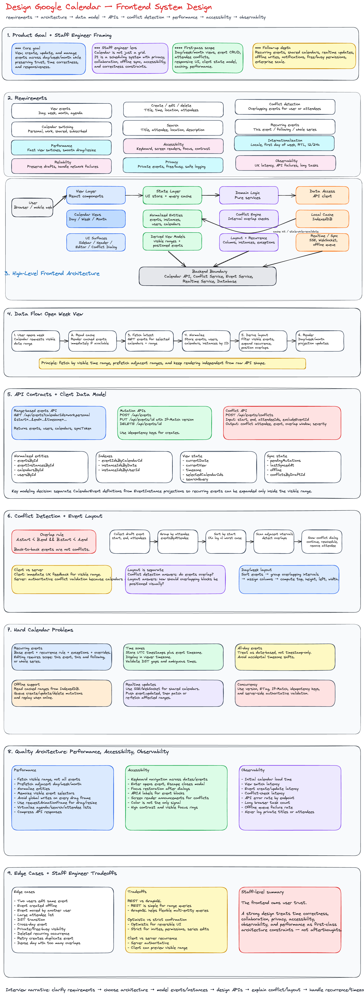
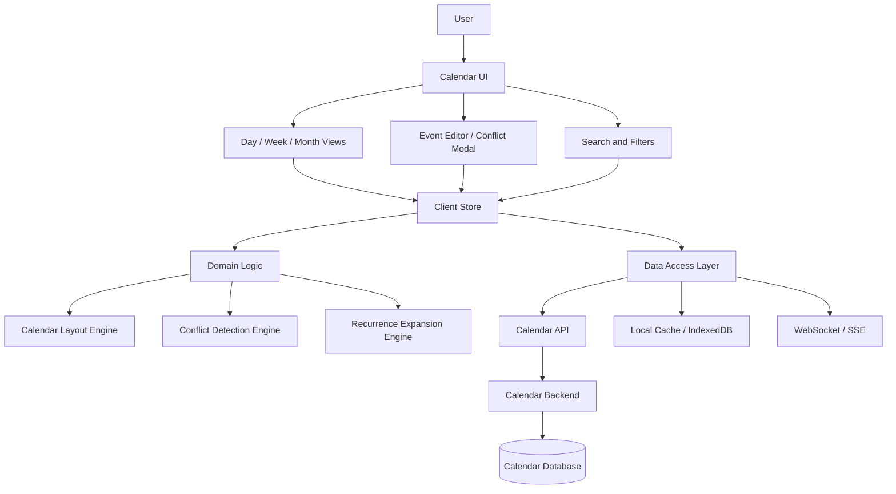
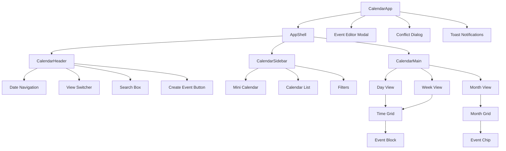
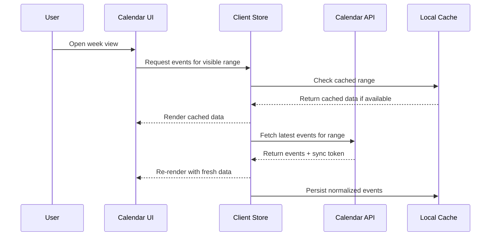
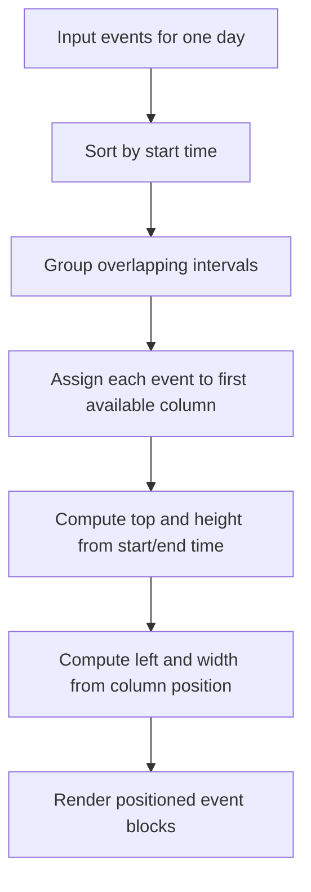
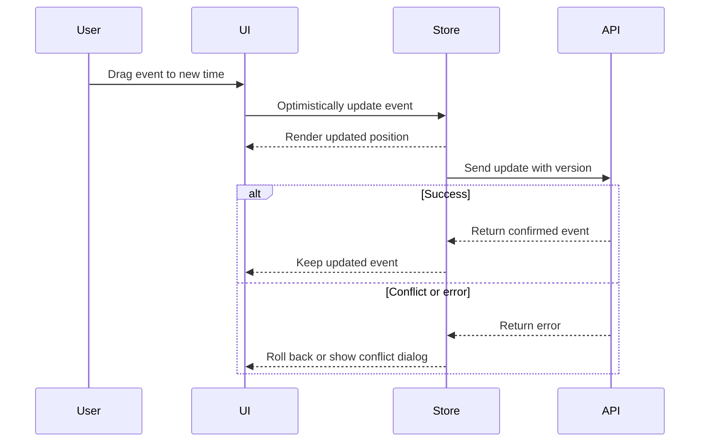
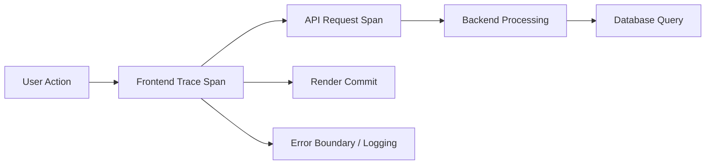
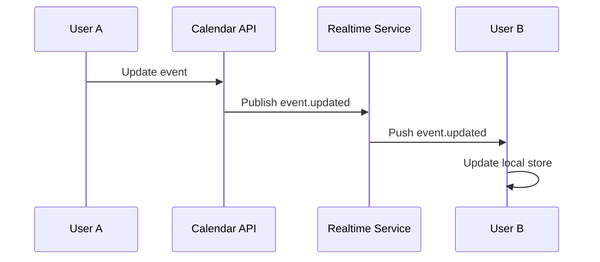
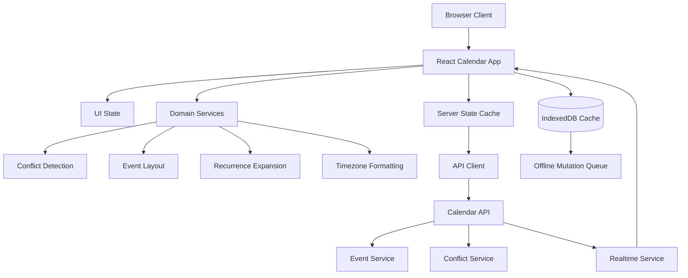

# Design Google Calendar — Frontend System Design

Designing a Google Calendar-like product is a strong frontend system design interview problem because it tests product thinking, data modeling, rendering performance, collaboration workflows, accessibility, offline support, and correctness around time.

A staff engineer answer should not only explain how to render a calendar UI. It should show how the frontend owns user experience quality across complex domains:

- Time zones
- Recurring events
- Shared calendars
- Conflict detection
- Real-time collaboration
- Offline edits
- Accessibility
- Performance at scale
- Observability and reliability

The core goal is to design a calendar application where users can view, create, update, and manage events across day, week, and month views while maintaining correctness, responsiveness, and trust.

---

## 1. Problem Framing

We are designing the frontend architecture for a calendar application similar to Google Calendar.

Users should be able to:

- View events across daily, weekly, and monthly layouts
- Create, edit, delete, and duplicate events
- Detect conflicts when events overlap
- Invite attendees
- Handle different time zones
- Support recurring events
- Work across desktop, tablet, and mobile
- Navigate efficiently with keyboard and screen readers
- See updates from shared calendars

For the first-pass interview scope, we can prioritize:

1. Calendar views: day, week, month
2. Event CRUD
3. Conflict detection
4. Attendee availability
5. Responsive UI
6. Client data model and caching
7. Performance and accessibility

Real-time collaboration, offline sync, and advanced recurring-event editing can be discussed as deeper follow-ups.

---

## 2. Requirements

## Functional Requirements

### Core Requirements

| Requirement        | Description                                                                       |
| ------------------ | --------------------------------------------------------------------------------- |
| View events        | Users can view events in day, week, and month views.                              |
| Create event       | Users can create a new event with title, time, location, attendees, and calendar. |
| Edit event         | Users can update event details, time, attendees, recurrence, and reminders.       |
| Delete event       | Users can delete a single event or a recurring series.                            |
| Conflict detection | System detects overlapping events for the current user or attendees.              |
| Calendar switching | Users can toggle personal, work, shared, and subscribed calendars.                |
| Navigation         | Users can move between dates and jump to today.                                   |
| Search             | Users can search events by title, attendees, location, or description.            |

### Follow-Up Requirements

| Requirement       | Description                                                  |
| ----------------- | ------------------------------------------------------------ |
| Recurring events  | Daily, weekly, monthly, custom recurrence rules.             |
| Shared calendars  | Multiple users can view and modify shared calendars.         |
| Real-time updates | Updates appear when another user modifies a shared calendar. |
| Offline support   | Users can view cached events and queue mutations offline.    |
| Notifications     | Users receive reminders or event-change notifications.       |
| Availability view | Users can inspect attendee availability before scheduling.   |

---

## 3. Non-Functional Requirements

| Area                 | Requirement                                                                                                                          |
| -------------------- | ------------------------------------------------------------------------------------------------------------------------------------ |
| Performance          | Calendar interactions should feel instant. View switching should complete within a few hundred milliseconds after data is available. |
| Scalability          | Support users with thousands of events and many calendars.                                                                           |
| Accessibility        | Support keyboard navigation, screen readers, focus management, ARIA semantics, and color contrast.                                   |
| Internationalization | Support locale-specific date formats, first day of week, 12/24-hour time, and time zones.                                            |
| Reliability          | Avoid losing user edits during network failures.                                                                                     |
| Observability        | Track latency, rendering cost, API failures, sync failures, and user-impacting errors.                                               |
| Device support       | Responsive layouts for desktop, tablet, and mobile.                                                                                  |
| Security             | Protect private calendar data and avoid leaking attendees or event details.                                                          |
| Privacy              | Respect calendar visibility rules such as private, free/busy only, and shared permissions.                                           |

---

## 4. Staff Engineer Approach

A senior-level answer often focuses on components and APIs. A staff-level answer should also cover system boundaries, tradeoffs, ownership, and long-term maintainability.

The frontend should be designed around these principles:

1. **Time correctness is product correctness**  
   The UI must represent time zones, daylight saving transitions, all-day events, and recurrence accurately.

2. **Rendering should be decoupled from data fetching**  
   Calendar grids, event layout, and event cards should consume normalized view models rather than raw API responses.

3. **The source of truth should be explicit**  
   Server data, optimistic local changes, cached data, and conflict state should be modeled separately.

4. **Calendar views are projections**  
   Day, week, and month views are different projections over the same normalized event data.

5. **Conflict detection should happen in both places**  
   The client can provide immediate feedback, but the server must be authoritative because attendees and shared calendars may change concurrently.

6. **Accessibility is architectural, not decorative**  
   Keyboard navigation, semantic roles, focus restoration, and screen reader announcements must be part of component contracts.

7. **Observability should measure user experience**  
   Track view-switch latency, event-create latency, error rates, dropped optimistic updates, offline queue failures, and long rendering tasks.

---

## 5. High-Level Architecture

A practical frontend architecture can be organized into five layers:

1. **View Layer**
2. **State Layer**
3. **Data Access Layer**
4. **Domain Logic Layer**
5. **Platform Layer**



---

## 6. Frontend Component Architecture



---

## 7. MVC vs Modern Frontend Architecture

Traditional MVC is useful for explaining separation of concerns:

| MVC Layer  | Calendar Responsibility                                   |
| ---------- | --------------------------------------------------------- |
| Model      | Events, users, calendars, recurrence rules, preferences   |
| View       | Calendar grid, event cards, editor modal, conflict dialog |
| Controller | Event creation, updates, navigation, conflict handling    |

However, modern frontend applications usually use a more explicit architecture:

| Layer           | Responsibility                                               |
| --------------- | ------------------------------------------------------------ |
| View            | React components and visual state                            |
| Store           | Client-side application state                                |
| Query cache     | Server state and synchronization                             |
| Domain services | Conflict detection, recurrence expansion, layout calculation |
| Data access     | API clients, retries, caching, offline queue                 |
| Platform        | Logging, metrics, feature flags, auth, error boundaries      |

This is better than pure MVC because calendar applications have complex server state, optimistic mutations, offline behavior, and derived view models.

---

## 8. Key UI Surfaces

## Calendar Shell

The shell contains the persistent layout:

- Header
- Sidebar
- Main calendar area
- Create button
- View switcher
- Search
- User settings

## Day View

Best for dense time-based scheduling.

Key details:

- 24-hour time grid
- Current time indicator
- All-day event row
- Timed event columns
- Overlapping event layout
- Drag-to-create event
- Resize event duration

## Week View

The default productivity view.

Key details:

- Seven-day grid
- Time axis
- All-day row
- Event collision layout
- Horizontal navigation by week
- Today highlight

## Month View

Best for scanning.

Key details:

- 6-row month grid
- Date cells
- Event chips
- Overflow indicator such as `+4 more`
- Popover for extra events
- Compact mobile behavior

## Event Editor

Supports:

- Title
- Date and time
- All-day toggle
- Recurrence
- Location
- Video conferencing
- Calendar selection
- Attendees
- Notifications
- Description
- Visibility
- Save/cancel/delete actions

## Conflict Dialog

Shows:

- Which attendees have conflicts
- Conflicting event time ranges
- Whether conflicts are hard or soft
- Suggested alternative times
- Options to continue anyway, reschedule, or remove attendee

---

## 9. Client Data Model

The client should normalize data because events, users, calendars, attendees, and recurring instances are reused across multiple views.

```ts
type ID = string;

type CalendarState = {
  entities: {
    eventsById: Record<ID, CalendarEvent>;
    eventInstancesById: Record<ID, EventInstance>;
    calendarsById: Record<ID, CalendarSource>;
    usersById: Record<ID, User>;
  };

  indexes: {
    eventIdsByCalendarId: Record<ID, ID[]>;
    eventInstanceIdsByDate: Record<string, ID[]>;
    eventInstanceIdsByUserId: Record<ID, ID[]>;
  };

  view: {
    currentDate: string;
    currentView: 'day' | 'week' | 'month';
    timezone: string;
    selectedCalendarIds: ID[];
    searchQuery: string;
  };

  editor: {
    mode: 'closed' | 'create' | 'edit';
    draftEventId?: ID;
    draft?: EventDraft;
  };

  sync: {
    pendingMutations: PendingMutation[];
    lastSyncedAt?: string;
    offline: boolean;
  };

  conflicts: {
    byDraftId: Record<ID, ConflictResult>;
  };
};
```

---

## 10. Event Data Model

A strong calendar model separates the event definition from rendered event instances.

```ts
type CalendarEvent = {
  id: string;
  calendarId: string;
  title: string;
  description?: string;
  location?: string;

  start: string; // ISO timestamp
  end: string; // ISO timestamp
  timezone: string;

  isAllDay: boolean;

  attendeeIds: string[];

  recurrence?: RecurrenceRule;
  recurrenceExceptions?: RecurrenceException[];

  visibility: 'default' | 'public' | 'private';
  status: 'confirmed' | 'tentative' | 'cancelled';

  createdBy: string;
  updatedAt: string;
  version: number;
};

type EventInstance = {
  id: string;
  eventId: string;
  instanceStart: string;
  instanceEnd: string;
  originalStart?: string;
  isException: boolean;
};

type RecurrenceRule = {
  frequency: 'daily' | 'weekly' | 'monthly' | 'yearly';
  interval: number;
  byDay?: string[];
  until?: string;
  count?: number;
};

type RecurrenceException = {
  originalStart: string;
  status?: 'cancelled';
  override?: Partial<CalendarEvent>;
};
```

### Why Separate Events and Instances?

Recurring events are not a single visual block. A weekly meeting may create many event instances across many weeks.

Separating event definitions from instances allows the frontend to:

- Render only instances in the visible range
- Edit one occurrence without changing the whole series
- Cancel one occurrence
- Cache expanded instances by time window
- Avoid expanding an infinite recurrence rule globally

---

## 11. API Design

The frontend should request events by visible time range, not by all events.

## Get Events by Time Range

```http
GET /api/events?calendarIds=work,personal&start=2026-06-01T00:00:00Z&end=2026-06-08T00:00:00Z&timezone=America/Los_Angeles
```

### Response

```json
{
  "events": [
    {
      "id": "evt_123",
      "calendarId": "work",
      "title": "Design Review",
      "start": "2026-06-02T17:00:00Z",
      "end": "2026-06-02T18:00:00Z",
      "timezone": "America/Los_Angeles",
      "isAllDay": false,
      "attendeeIds": ["usr_1", "usr_2"],
      "version": 12
    }
  ],
  "users": [
    {
      "id": "usr_1",
      "name": "Alice",
      "email": "alice@example.com"
    }
  ],
  "calendars": [
    {
      "id": "work",
      "name": "Work",
      "color": "#1a73e8"
    }
  ],
  "syncToken": "sync_abc"
}
```

## Create Event

```http
POST /api/events
```

```json
{
  "calendarId": "work",
  "title": "Project Kickoff",
  "start": "2026-06-20T17:00:00Z",
  "end": "2026-06-20T18:00:00Z",
  "timezone": "America/Los_Angeles",
  "attendeeIds": ["usr_1", "usr_2"],
  "location": "Room 301"
}
```

## Update Event

```http
PUT /api/events/evt_123
If-Match: 12
```

```json
{
  "title": "Project Kickoff Updated",
  "start": "2026-06-20T18:00:00Z",
  "end": "2026-06-20T19:00:00Z",
  "version": 12
}
```

## Delete Event

```http
DELETE /api/events/evt_123
```

For recurring events:

```http
DELETE /api/events/evt_123?scope=this-instance&instanceStart=2026-06-20T17:00:00Z
```

## Get Conflicts

```http
POST /api/events/conflicts
```

```json
{
  "start": "2026-06-20T17:00:00Z",
  "end": "2026-06-20T18:00:00Z",
  "attendeeIds": ["usr_1", "usr_2"],
  "excludeEventId": "evt_123"
}
```

### Response

```json
{
  "hasConflicts": true,
  "conflicts": [
    {
      "attendeeId": "usr_2",
      "eventId": "evt_456",
      "title": "Client Meeting",
      "start": "2026-06-20T17:30:00Z",
      "end": "2026-06-20T18:30:00Z",
      "overlapStart": "2026-06-20T17:30:00Z",
      "overlapEnd": "2026-06-20T18:00:00Z",
      "severity": "hard"
    }
  ]
}
```

## Resolve Conflict

```http
PUT /api/events/evt_123/resolve-conflict
```

```json
{
  "action": "reschedule",
  "newStart": "2026-06-21T16:00:00Z",
  "newEnd": "2026-06-21T17:00:00Z"
}
```

---

## 12. Protocol Choice

| Protocol           | Use Case                                          | Tradeoff                                         |
| ------------------ | ------------------------------------------------- | ------------------------------------------------ |
| HTTP REST          | CRUD, range queries, conflict checks              | Simple and cacheable                             |
| GraphQL            | Flexible querying across events, calendars, users | Risk of overfetching complexity moving to client |
| WebSocket          | Real-time shared calendar updates                 | Requires connection lifecycle handling           |
| Server-Sent Events | One-way updates from server to client             | Simpler than WebSocket for push-only updates     |
| Long polling       | Fallback for real-time updates                    | Less efficient than push models                  |

For a first-pass design, use HTTP for CRUD and range fetching.

For shared calendars, add WebSocket or SSE so users receive updates when another collaborator changes an event.

---

## 13. Data Fetching Strategy

The calendar should fetch by visible date range.



### Range Fetching

Fetch events for:

- Current visible range
- Small buffer before and after the visible range

For example:

| View  | Visible Range | Prefetch Range          |
| ----- | ------------- | ----------------------- |
| Day   | 1 day         | Previous and next day   |
| Week  | 7 days        | Previous and next week  |
| Month | 4-6 weeks     | Previous and next month |

This improves navigation because adjacent views are already warmed.

---

## 14. Conflict Detection

Conflict detection identifies overlapping events for a user or a set of attendees.

The overlap rule is:

```ts
eventA.start < eventB.end && eventB.start < eventA.end;
```

This correctly handles partial overlaps and avoids marking back-to-back events as conflicts.

Examples:

| Event A     | Event B     | Conflict? |
| ----------- | ----------- | --------- |
| 10:00-11:00 | 10:30-11:30 | Yes       |
| 10:00-11:00 | 11:00-12:00 | No        |
| 10:00-12:00 | 10:30-11:00 | Yes       |
| 10:00-11:00 | 09:00-10:01 | Yes       |

---

## 15. Client-Side Conflict Detection Algorithm

The client can detect conflicts quickly for immediate feedback, but the server should perform the final authoritative check.

```ts
type EventLike = {
  id: string;
  startTime: string;
  endTime: string;
  attendeeIds: string[];
};

type ConflictGroup = {
  attendeeId: string;
  events: EventLike[];
};

function hasOverlap(a: EventLike, b: EventLike): boolean {
  const aStart = new Date(a.startTime).getTime();
  const aEnd = new Date(a.endTime).getTime();
  const bStart = new Date(b.startTime).getTime();
  const bEnd = new Date(b.endTime).getTime();

  return aStart < bEnd && bStart < aEnd;
}

function detectConflicts(events: EventLike[]): ConflictGroup[] {
  const eventsByAttendee = new Map<string, EventLike[]>();

  for (const event of events) {
    for (const attendeeId of event.attendeeIds) {
      const attendeeEvents = eventsByAttendee.get(attendeeId) ?? [];
      attendeeEvents.push(event);
      eventsByAttendee.set(attendeeId, attendeeEvents);
    }
  }

  const conflicts: ConflictGroup[] = [];

  for (const [attendeeId, attendeeEvents] of eventsByAttendee) {
    const sorted = [...attendeeEvents].sort(
      (a, b) => new Date(a.startTime).getTime() - new Date(b.startTime).getTime()
    );

    const conflictSet = new Set<EventLike>();

    for (let i = 0; i < sorted.length - 1; i++) {
      const current = sorted[i];
      const next = sorted[i + 1];

      if (hasOverlap(current, next)) {
        conflictSet.add(current);
        conflictSet.add(next);
      }
    }

    if (conflictSet.size > 0) {
      conflicts.push({
        attendeeId,
        events: Array.from(conflictSet),
      });
    }
  }

  return conflicts;
}
```

### Complexity

Let:

- `n` = number of events
- `a` = average attendees per event

Grouping events by attendee takes:

```txt
O(n * a)
```

Sorting per attendee dominates the algorithm. In the worst case where all events belong to one attendee:

```txt
O(n log n)
```

This is acceptable for client-side validation on the visible range. For global attendee availability, the server should own the query.

---

## 16. Event Layout Algorithm

Rendering overlapping events is different from detecting conflicts.

For a day or week time grid, overlapping events should be assigned visual columns.



### Layout Output

```ts
type PositionedEvent = {
  eventId: string;
  top: number;
  height: number;
  left: number;
  width: number;
  zIndex: number;
};
```

### Why This Matters

Conflict detection tells us whether events overlap.

Layout calculation tells us how to display those overlaps without hiding information.

These should be separate modules.

---

## 17. Recurring Events

Recurring events are one of the hardest parts of calendar design.

A recurring event should be stored as:

1. Base event
2. Recurrence rule
3. Exceptions
4. Overrides for specific instances

Example:

```ts
const weeklyDesignReview = {
  id: 'evt_design_review',
  title: 'Design Review',
  start: '2026-06-01T17:00:00Z',
  end: '2026-06-01T18:00:00Z',
  timezone: 'America/Los_Angeles',
  recurrence: {
    frequency: 'weekly',
    interval: 1,
    byDay: ['MO'],
  },
  recurrenceExceptions: [
    {
      originalStart: '2026-06-15T17:00:00Z',
      status: 'cancelled',
    },
    {
      originalStart: '2026-06-22T17:00:00Z',
      override: {
        start: '2026-06-22T18:00:00Z',
        end: '2026-06-22T19:00:00Z',
      },
    },
  ],
};
```

### Editing Recurring Events

When editing a recurring event, users need choices:

| Scope              | Meaning                                 |
| ------------------ | --------------------------------------- |
| This event         | Edit only the selected occurrence       |
| This and following | Split the series from this point onward |
| All events         | Edit the entire series                  |

The frontend should make this explicit before sending the mutation.

---

## 18. Time Zone Strategy

Time zone correctness is essential.

### Store

Store event timestamps in UTC with the event's source timezone.

```ts
{
  start: "2026-06-20T17:00:00Z",
  end: "2026-06-20T18:00:00Z",
  timezone: "America/Los_Angeles"
}
```

### Display

Display the event in the viewer's selected timezone.

```ts
type TimeDisplayContext = {
  viewerTimezone: string;
  eventTimezone: string;
  locale: string;
  use24HourClock: boolean;
};
```

### Edge Cases

| Edge Case              | Handling                                                             |
| ---------------------- | -------------------------------------------------------------------- |
| Daylight saving starts | Some local times may not exist. Validate during creation.            |
| Daylight saving ends   | Some local times are ambiguous. Ask for timezone-aware confirmation. |
| Cross-midnight event   | Render across multiple day columns.                                  |
| Travel calendar        | Allow user to display events in local or event timezone.             |
| All-day event          | Treat as date-based, not timestamp-only.                             |

---

## 19. State Management

A practical implementation could use:

- React for UI
- React Query, TanStack Query, Apollo, or Relay for server state
- Zustand, Redux Toolkit, or Context for UI state
- IndexedDB for persistent cache and offline queue

### Recommended Split

| State Type    | Example                                | Owner                  |
| ------------- | -------------------------------------- | ---------------------- |
| Server state  | Events, calendars, attendees           | Query cache            |
| UI state      | Selected date, active view, open modal | Local/global UI store  |
| Derived state | Positioned events, filtered event list | Memoized selectors     |
| Draft state   | Event currently being edited           | Form state             |
| Offline state | Pending mutations                      | IndexedDB-backed queue |

---

## 20. Optimistic Updates

Creating and dragging events should feel immediate.



### Optimistic Update Rules

Use optimistic updates for:

- Dragging an event
- Resizing an event
- Changing title
- Toggling calendar visibility

Avoid optimistic updates or require confirmation for:

- Sending attendee invitations
- Deleting recurring series
- Updating shared calendars with permission uncertainty
- Changes that create conflicts

---

## 21. Offline Support

Offline support can improve trust but adds complexity.

### Offline Read

Use IndexedDB to store:

- Events by visible range
- Calendar list
- User preferences
- Recently viewed search results

### Offline Write

Queue mutations locally.

```ts
type PendingMutation = {
  id: string;
  type: 'create' | 'update' | 'delete';
  entityId: string;
  payload: unknown;
  createdAt: string;
  retryCount: number;
  status: 'pending' | 'syncing' | 'failed';
};
```

### Sync Strategy

When the user comes back online:

1. Replay mutations in order
2. Attach version numbers
3. Resolve conflicts
4. Re-fetch affected ranges
5. Show user-visible sync status

---

## 22. Performance Optimization

## Rendering Performance

Calendar UIs can become expensive because they render grids, time labels, event blocks, popovers, and overlays.

Use:

- Memoized selectors for visible events
- Windowing for event lists and search results
- CSS containment for large grid areas
- Batched state updates
- Stable keys for event blocks
- Avoid layout thrashing during drag/resize
- Use transforms instead of top/left when animating

## Data Performance

Use:

- Date-range fetching
- Prefetch adjacent ranges
- Normalize event entities
- Cache event instances by range
- Avoid fetching all historical events
- Paginate search results
- Compress API responses with Brotli or gzip

## Interaction Performance

For drag and resize:

- Keep pointer movement local
- Avoid global store writes on every pointer move
- Commit final position on pointer up
- Use requestAnimationFrame for visual updates
- Show conflict preview after throttle/debounce

---

## 23. Virtualization

Virtualization is useful for:

- Search results
- Agenda view
- Large attendee lists
- Calendar list sidebar
- Month overflow popovers

Virtualizing the core month grid is usually less important because month view only renders about 35-42 cells. However, virtualizing an infinite scroll calendar across years can be useful.

For day and week views, the main issue is not grid size. The expensive part is event layout and overlapping event rendering.

---

## 24. Debouncing, Throttling, and Rate Limiting

| Technique     | Use Case                                         |
| ------------- | ------------------------------------------------ |
| Debounce      | Search input, conflict checks while editing time |
| Throttle      | Drag conflict preview, resize updates            |
| Rate limit    | Bulk event imports, repeated update attempts     |
| Backoff retry | Notification failures, transient API failures    |

Example:

```ts
const debouncedSearch = debounce((query: string) => {
  searchEvents(query);
}, 300);
```

For drag-and-drop event rescheduling:

- Update visual position every animation frame
- Throttle server-side conflict preview
- Commit final mutation only after drop

---

## 25. Accessibility

Accessibility must be built into the component design.

## Keyboard Navigation

Users should be able to:

- Move between days with arrow keys
- Move between weeks with Page Up / Page Down
- Jump to today
- Open selected event with Enter
- Create an event with keyboard shortcut
- Close modal with Escape
- Tab through event editor fields
- Resize or move events through accessible alternatives

## Screen Reader Support

Use:

- Semantic labels for dates
- ARIA labels for event blocks
- Announcements for conflict warnings
- Focus restoration after closing modals
- Accessible names for icon buttons

Example:

```tsx
<button aria-label="Create event on June 20, 2026 at 10:00 AM" onClick={openCreateEventModal}>
  Create
</button>
```

## Color and Contrast

Calendar colors should not be the only way to communicate meaning.

Provide:

- Text labels
- Icons
- Pattern or border variations
- High-contrast mode
- Focus rings
- Accessible hover and selected states

---

## 26. Internationalization

Calendar products are global by default.

Support:

| Area                   | Examples                                    |
| ---------------------- | ------------------------------------------- |
| Locale date formatting | Jun 20 vs 20 Jun                            |
| First day of week      | Sunday vs Monday                            |
| Time format            | 12-hour vs 24-hour                          |
| Time zones             | Viewer timezone vs event timezone           |
| RTL layout             | Arabic and Hebrew                           |
| Translated labels      | Month names, action labels, recurrence text |

Do not hardcode date formatting. Use locale-aware utilities.

---

## 27. Responsive Design

## Desktop

Desktop supports the richest interaction model:

- Day/week/month views
- Drag and resize
- Sidebar
- Keyboard shortcuts
- Multi-column overlapping event layout

## Tablet

Tablet should preserve most functionality but reduce density:

- Collapsible sidebar
- Larger touch targets
- Simplified event editor layout

## Mobile

Mobile should prioritize:

- Agenda view
- Month summary
- Bottom sheet editor
- Tap-based navigation
- Minimal drag-and-drop assumptions
- Large touch targets

A staff-level design should acknowledge that mobile calendar behavior may not be a smaller desktop view. It may need a different information architecture.

---

## 28. Observability

Frontend observability should measure actual user experience.

## Metrics

| Metric                     | Why It Matters                        |
| -------------------------- | ------------------------------------- |
| Calendar initial load time | Measures first useful experience      |
| View switch latency        | Measures navigation responsiveness    |
| Event create latency       | Measures action completion            |
| Event update failure rate  | Detects reliability problems          |
| Conflict-check latency     | Detects scheduling friction           |
| Long task count            | Detects main-thread blocking          |
| Offline queue failure rate | Detects sync reliability issues       |
| API error rate by endpoint | Helps debug backend or client issues  |
| Rendered event count       | Helps correlate density with slowness |

## Logs

Log structured events:

```ts
logger.info('calendar.event.create.submit', {
  calendarId,
  attendeeCount,
  hasRecurrence,
  isOffline,
});
```

Avoid logging private event details such as:

- Event title
- Description
- Attendee emails
- Location
- Meeting links

## Tracing

Trace important flows:

- Open calendar
- Switch view
- Create event
- Update event time
- Detect conflict
- Sync offline mutation



---

## 29. Error Handling

## User-Facing Errors

| Scenario                 | User Experience                                 |
| ------------------------ | ----------------------------------------------- |
| Event failed to save     | Show retry and preserve draft                   |
| Conflict detected        | Show conflict dialog and alternatives           |
| Permission denied        | Explain calendar access limitation              |
| Network offline          | Queue change and show sync status               |
| Recurring edit ambiguity | Ask whether to update one event or whole series |
| Event deleted elsewhere  | Remove event and show toast                     |
| Version conflict         | Refresh event and ask user to reapply changes   |

## Technical Error Boundaries

Use error boundaries around:

- Calendar main view
- Event editor
- Sidebar
- Search results
- Real-time subscription layer

This prevents one broken event or malformed response from crashing the entire application.

---

## 30. Security and Privacy

Calendar data is sensitive.

Frontend considerations:

- Never expose private event details in logs
- Respect event visibility rules
- Avoid caching private calendars in shared browser profiles without safeguards
- Do not show private event titles to users with only free/busy permissions
- Sanitize event descriptions before rendering
- Protect meeting links and attendee lists
- Use permission-aware UI states

Example visibility handling:

```ts
function getDisplayTitle(event: CalendarEvent, permission: Permission): string {
  if (event.visibility === 'private' && !permission.canViewPrivateDetails) {
    return 'Busy';
  }

  return event.title;
}
```

---

## 31. Edge Cases

| Edge Case                             | Handling                                                         |
| ------------------------------------- | ---------------------------------------------------------------- |
| Two users edit the same event         | Use optimistic concurrency with versions or ETags.               |
| Event created while offline           | Queue mutation and sync later.                                   |
| Event moved by another user           | Reconcile via sync token or real-time update.                    |
| Large attendee list                   | Batch conflict checks and virtualize attendee UI.                |
| Daylight saving transition            | Validate local times and display timezone clearly.               |
| Cross-day event                       | Split visual rendering across date columns.                      |
| All-day event                         | Treat as date-based, not timestamp-only.                         |
| Recurring event exception             | Store override for specific instance.                            |
| Deleted recurring occurrence          | Store cancellation exception.                                    |
| Permission changes                    | Re-fetch calendars and hide restricted details.                  |
| Network retry creates duplicate event | Use idempotency keys for create requests.                        |
| Back-to-back events                   | Do not mark as conflict when one ends exactly as another starts. |
| Very dense day                        | Collapse event blocks or show "+N more" with accessible popover. |
| Invalid input                         | Validate date, duration, attendee emails, recurrence rule.       |
| Notification failure                  | Retry with backoff and log failure without blocking event save.  |

---

## 32. Concurrency Control

Client-side checks are not enough because multiple users can edit shared calendars.

Use:

- Event `version`
- HTTP `ETag`
- `If-Match` header
- Idempotency keys for create operations
- Server-side authoritative conflict validation

```http
PUT /api/events/evt_123
If-Match: "version-12"
Idempotency-Key: "mutation_abc_123"
```

If the server returns a conflict:

```json
{
  "error": {
    "code": "VERSION_CONFLICT",
    "message": "This event was updated by another user.",
    "latestVersion": 13
  }
}
```

The frontend should then:

1. Fetch latest event
2. Compare user draft with latest server version
3. Offer to reapply change or discard draft

---

## 33. Real-Time Updates

For shared calendars, real-time updates improve collaboration.



### Real-Time Event Payload

```json
{
  "type": "event.updated",
  "calendarId": "work",
  "eventId": "evt_123",
  "version": 13,
  "changedAt": "2026-06-20T18:00:00Z"
}
```

The frontend can either:

- Patch the event directly if payload includes enough details
- Re-fetch the affected event or date range

For correctness, prefer re-fetching when permissions, recurrence, or attendee visibility may affect the result.

---

## 34. Search

Search should support:

- Event title
- Description
- Attendee
- Location
- Calendar
- Date range

Use debouncing on input.

```http
GET /api/events/search?q=design&start=2026-01-01T00:00:00Z&end=2026-12-31T00:00:00Z&limit=20&cursor=abc
```

### Search Response

```json
{
  "results": [
    {
      "eventId": "evt_123",
      "title": "Design Review",
      "start": "2026-06-20T17:00:00Z",
      "end": "2026-06-20T18:00:00Z",
      "calendarId": "work"
    }
  ],
  "nextCursor": "cursor_456"
}
```

Search results should be virtualized if large.

---

## 35. Pagination and Filtering

For calendar views, prefer time-range filtering over page-based pagination.

Good:

```http
GET /api/events?start=2026-06-01T00:00:00Z&end=2026-06-30T23:59:59Z
```

Less ideal for primary calendar view:

```http
GET /api/events?page=1&limit=100
```

Page-based pagination is useful for:

- Search results
- Audit logs
- Notification history
- Agenda list across large ranges

Calendar rendering needs range-based APIs because the UI is date-oriented.

---

## 36. Caching Strategy

## In-Memory Cache

Use for:

- Current visible range
- Adjacent ranges
- Selected event details
- Calendar list

## Persistent Cache

Use IndexedDB for:

- Recently viewed ranges
- Calendar metadata
- Offline queue
- User preferences

## Cache Invalidation

Invalidate when:

- User creates, updates, or deletes event
- Real-time event update arrives
- Calendar permissions change
- Sync token expires
- User changes timezone or selected calendars

```ts
type CachedRange = {
  calendarIds: string[];
  start: string;
  end: string;
  timezone: string;
  syncToken: string;
  cachedAt: string;
};
```

---

## 37. Suggested Technical Stack

| Concern        | Option                                                         |
| -------------- | -------------------------------------------------------------- |
| UI             | React + TypeScript                                             |
| Server state   | TanStack Query, Relay, Apollo, or RTK Query                    |
| UI state       | Zustand, Redux Toolkit, or Context                             |
| Forms          | React Hook Form or controlled forms                            |
| Date utilities | Temporal API where available, or a timezone-aware date library |
| Local storage  | IndexedDB                                                      |
| Virtualization | react-window, react-virtual, or custom virtualization          |
| Observability  | OpenTelemetry, browser performance APIs, structured logging    |
| Testing        | Jest, React Testing Library, Playwright                        |

The exact stack matters less than the separation of concerns.

---

## 38. Testing Strategy

## Unit Tests

Test:

- Conflict detection
- Recurrence expansion
- Date range calculations
- Time zone conversions
- Event layout algorithm
- Permission-based display logic

## Integration Tests

Test:

- Create event flow
- Edit event flow
- Delete event flow
- Conflict warning flow
- Offline queue replay
- View switching with cached data

## End-to-End Tests

Test:

- User creates event from week view
- User drags event to new time
- User edits recurring event
- User searches and opens result
- User navigates with keyboard
- User handles network failure

## Accessibility Tests

Use:

- Keyboard-only testing
- Screen reader smoke testing
- Automated axe checks
- Focus management tests
- Color contrast checks

---

## 39. Interview Answer Structure

A clear interview response can follow this flow:

1. Clarify requirements
2. Define supported views and core interactions
3. Propose frontend architecture
4. Design data model
5. Design API contracts
6. Explain range fetching and caching
7. Explain conflict detection
8. Explain event layout
9. Cover recurring events and time zones
10. Discuss performance and accessibility
11. Cover offline, real-time, observability, and edge cases
12. Summarize tradeoffs

---

## 40. Staff Engineer Tradeoffs

## REST vs GraphQL

REST is simple for range-based event fetching and mutations.

GraphQL can help when the client needs flexible combinations of events, calendars, users, and permissions. However, it can also move query complexity to the frontend.

For an interview, REST is a strong default unless the product needs highly flexible multi-entity queries.

## Client Conflict Detection vs Server Conflict Detection

Client-side detection gives immediate feedback.

Server-side detection is authoritative.

Use both.

## Optimistic Updates vs Strict Confirmation

Optimistic updates improve perceived performance.

Strict confirmation is safer for attendee invitations, permission-sensitive changes, and recurring event mutations.

Use optimistic updates for reversible UI changes and confirmation for high-impact actions.

## Expanding Recurrence on Client vs Server

Server expansion ensures consistency and permission correctness.

Client expansion can improve responsiveness for already-fetched rules.

A balanced approach:

- Server returns expanded instances for visible range
- Client may perform lightweight projection for UI previews

## WebSocket vs Polling

WebSockets are useful for shared calendars and real-time collaboration.

Polling may be enough for personal calendars.

Start with HTTP and add push updates when collaboration requires it.

---

## 41. Final Architecture Summary



---

## 42. Final Answer

To design a Google Calendar-like frontend system, I would build a layered architecture where the calendar UI is separated from data fetching, domain logic, and synchronization.

The client fetches events by visible date range, stores them in a normalized cache, and derives day, week, and month projections from the same event model. Event definitions are separated from event instances so recurring events can be expanded only within the visible range. Conflict detection runs on the client for immediate feedback, but the server remains authoritative for final validation.

The frontend uses range-based APIs, optimistic updates, local caching, and an offline mutation queue to keep the product responsive. For shared calendars, WebSocket or SSE updates can push changes into the client store. Performance is handled through memoized selectors, range prefetching, event layout optimization, virtualization where appropriate, and careful drag/resize rendering.

Accessibility is part of the architecture: keyboard navigation, ARIA labels, focus management, screen reader announcements, and color contrast are required for every major interaction. Observability tracks user-impacting metrics such as view-switch latency, event-create latency, conflict-check latency, API failure rates, offline sync failures, and long browser tasks.

At staff engineer level, the key is not only to render a calendar grid. The key is to design a trustworthy scheduling system where time correctness, collaboration, privacy, accessibility, and performance are treated as first-class product requirements.
