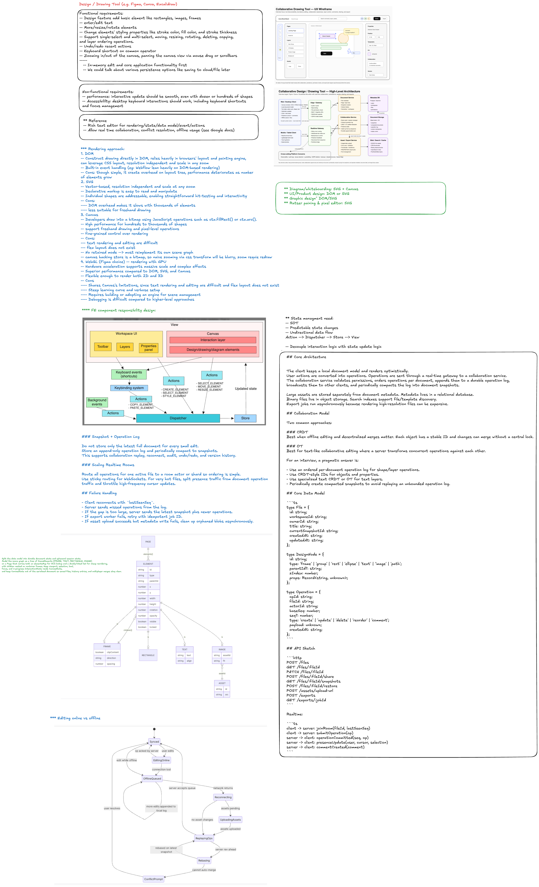

## Problem

Design a collaborative drawing/design tool similar to Figma, Canva, or Excalidraw. Users can create canvases, draw shapes, edit text, upload assets, collaborate in real time, comment, share, and export.

## Functional Requirements

1. Create, open, edit, duplicate, and delete design files.
2. Support core drawing operations: select, move, resize, rotate, group, ungroup, text, shape, pen, image upload.
3. Real-time collaboration with multiple editors in the same file.
4. Presence: live cursors, active users, selection state.
5. Comments and annotations.
6. Version history, undo/redo, and restore.
7. Share links and workspace permissions.
8. Export to PNG, PDF, SVG, or presentation formats.
9. Search files, templates, and assets.

## Non-Functional Requirements

- Low-latency local editing: pointer movement and canvas updates should feel instant.
- Real-time sync: collaborative updates should usually appear within hundreds of milliseconds.
- Durability: accepted operations must not be lost.
- Conflict handling: concurrent edits should converge to a consistent document state.
- Scalability: support many documents, many workspaces, and bursty real-time rooms.
- Security: strict permissions, asset validation, audit logs, private sharing.
- Reliability: reconnect, replay missed operations, snapshot recovery.

## Core Architecture

The client keeps a local document model and renders optimistically. User actions are converted into operations. Operations are sent through a real-time gateway to a collaboration service. The collaboration service validates permissions, orders operations per document, appends them to a durable operation log, broadcasts them to other clients, and periodically compacts the log into document snapshots.

Large assets are stored separately from document metadata. Metadata lives in a relational database. Binary files live in object storage. Search indexes support file/template discovery. Export jobs run asynchronously because rendering high-resolution files can be expensive.

## Collaboration Model

Two common approaches:

### CRDT

Best when offline editing and decentralized merges matter. Each object has a stable ID and changes can merge without a central lock.

### OT

Best for text-like collaborative editing where a server transforms concurrent operations against each other.

For an interview, a pragmatic answer is:

- Use an ordered per-document operation log for shape/layer operations.
- Use CRDT-style IDs for objects and properties.
- Use specialized text CRDT or OT for text layers.
- Periodically create compacted snapshots to avoid replaying an unbounded operation log.

## Core Data Model

```ts
type File = {
  id: string;
  workspaceId: string;
  ownerId: string;
  title: string;
  currentSnapshotId: string;
  createdAt: string;
  updatedAt: string;
};

type DesignNode = {
  id: string;
  type: 'frame' | 'group' | 'rect' | 'ellipse' | 'text' | 'image' | 'path';
  parentId?: string;
  zIndex: number;
  props: Record<string, unknown>;
};

type Operation = {
  opId: string;
  fileId: string;
  actorId: string;
  baseSeq: number;
  seq?: number;
  type: 'create' | 'update' | 'delete' | 'reorder' | 'comment';
  payload: unknown;
  createdAt: string;
};
```

## API Sketch

```http
POST /files
GET /files/:fileId
PATCH /files/:fileId
POST /files/:fileId/share
GET /files/:fileId/snapshots
POST /files/:fileId/restore
POST /assets/upload-url
POST /exports
GET /exports/:jobId
```

Realtime:

```ts
client -> server: joinRoom(fileId, lastSeenSeq)
client -> server: submitOperation(op)
server -> client: operationCommitted(seq, op)
server -> client: presenceUpdate(user, cursor, selection)
server -> client: commentCreated(comment)
```

## Interview Tradeoffs

### SVG vs Canvas vs WebGL

- SVG is easy for DOM inspection, accessibility, and simple shapes, but can slow down with many nodes.
- Canvas is better for many objects and fast rendering, but requires custom hit testing and accessibility work.
- WebGL is best for very large boards and GPU acceleration, but has higher implementation complexity.

A strong answer: use Canvas/WebGL for the main editing surface, keep a semantic document model outside the renderer, and render selected overlays, comments, and controls separately.

### Snapshot + Operation Log

Do not store only the latest full document for every small edit. Store an append-only operation log and periodically compact to snapshots. This supports collaboration replay, reconnect, audit, undo/redo, and version history.

### Scaling Realtime Rooms

Route all operations for one active file to a room actor or shard so ordering is simple. Use sticky routing for WebSockets. For very hot files, split presence traffic from document operation traffic and throttle high-frequency cursor updates.

## Failure Handling

- Client reconnects with `lastSeenSeq`.
- Server sends missed operations from the log.
- If the gap is too large, server sends the latest snapshot plus newer operations.
- If export worker fails, retry with idempotent job ID.
- If asset upload succeeds but metadata write fails, clean up orphaned blobs asynchronously.

## Bottlenecks and Mitigations

| Bottleneck                   | Mitigation                                                           |
| ---------------------------- | -------------------------------------------------------------------- |
| High-frequency cursor events | Throttle, send presence separately, do not persist every cursor move |
| Huge document replay         | Periodic snapshots and log compaction                                |
| Large asset uploads          | Direct-to-object-store upload URLs and async processing              |
| Hot collaborative file       | Room sharding, presence throttling, backpressure                     |
| Expensive exports            | Async job queue, worker pool, cached exports                         |

## Good Interview Summary

The core design is a low-latency local editor backed by a durable real-time collaboration pipeline. The client renders optimistically. The server orders and persists operations per document. Snapshots make recovery fast. Assets are separated from metadata. Presence is ephemeral, document edits are durable, and exports run asynchronously.
