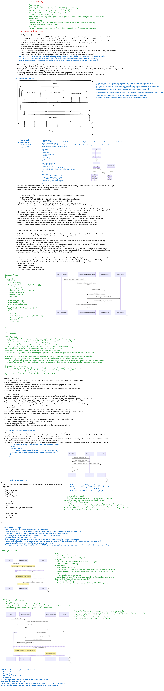
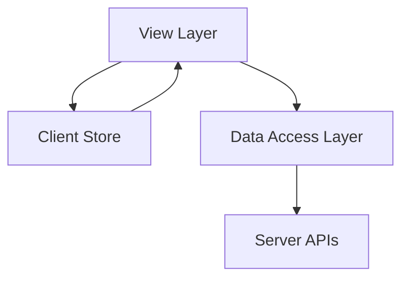
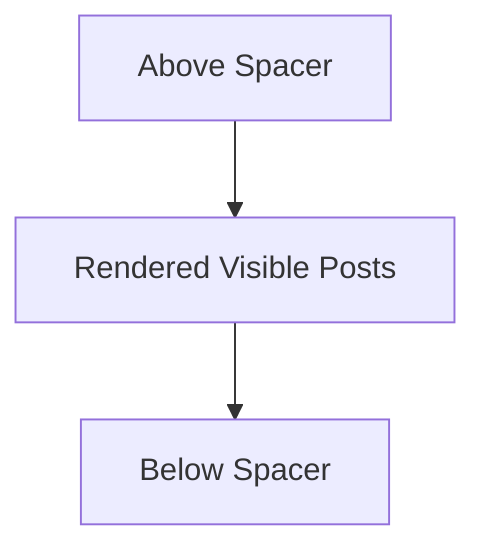

# Frontend System Design: Facebook-Style News Feed

A Facebook-style news feed is a **long-lived, personalized, interaction-heavy surface**.

For a first-pass frontend system design interview, keep the core scope focused on:

- Browsing personalized posts
- Reacting to posts
- Composing new posts

Comments, live updates, notifications, and real-time collaboration are good follow-up topics, but they should not dominate the initial design.

---

## 1. Rendering Strategy

### CSR by Default for Signed-In Feed

For a signed-in personalized home feed, use **Client-Side Rendering by default**.

The home feed is derived from the viewer’s graph, ranking model, privacy rules, and session state. Because of that, **SEO is not the deciding factor**.

A CSR shell with SPA navigation is a strong fit because it keeps important client state alive across route transitions:

- Cached entities
- Feed ordering
- Scroll position
- Optimistic reactions
- Composer drafts
- Route-level UI state

This makes opening a post from the feed and returning feel nearly instant.

> **Important:** The signed-in home feed is not primarily an SEO surface. It is a personalized application surface.

---

### When SSR or Hybrid Rendering Makes Sense

Public post pages and logged-out surfaces are different products with different constraints.

Use SSR or hybrid rendering for:

- Public post URLs
- Logged-out landing pages
- Share preview pages
- SEO-indexable content
- Social crawler metadata

```tsx
const routes = {
  '/': 'CSR personalized home feed',
  '/post/:id': 'SSR or hybrid public post page',
  '/login': 'SSR or static logged-out surface',
};
```

> **Important:** Use CSR for the personalized feed. Use SSR or hybrid rendering for public, logged-out, or SEO-sensitive pages.

---

## 2. High-Level Frontend Architecture

Organize the client into four clean layers:



| Layer       | Responsibility                                                    |
| ----------- | ----------------------------------------------------------------- |
| View        | UI rendering and user interaction                                 |
| Store       | Source of truth for client-side state                             |
| Data Access | API calls, caching, normalization, retries, request deduplication |
| Server      | Feed, post, media, reaction, and share APIs                       |

Keeping these boundaries clean prevents networking code, cache invalidation, and UI logic from leaking into each other.

> **Important:** Every later optimization should fit into one layer without contaminating the others.

---

## 3. View Layer

The View layer owns UI composition and interaction.

It includes:

- Feed page
- Post detail page
- Feed post component
- Composer
- Reaction controls
- Media renderer
- Loading placeholders
- Error and retry UI

The View layer should not know low-level networking details.

```tsx
function FeedPage() {
  const feed = useFeed('home');

  return (
    <main>
      <Composer />
      <FeedList postIds={feed.postIds} />
      <InfiniteScrollSentinel />
    </main>
  );
}
```

> **Important:** Keep request handling, retries, normalization, and cache invalidation out of view components.

---

## 4. Store Layer

The Store is the source of truth for client-side state.

Use a **normalized store**. Instead of nesting full users and media objects inside each post, store canonical entities by ID.

```ts
type ID = string;

type User = {
  id: ID;
  name: string;
  avatarUrl: string;
};

type Media = {
  id: ID;
  type: 'image' | 'video';
  url: string;
  width: number;
  height: number;
};

type Post = {
  id: ID;
  authorId: ID;
  text: string;
  mediaIds: ID[];
  reactionSummary: {
    like: number;
    love: number;
  };
  viewerReaction?: 'like' | 'love' | null;
  createdAt: string;
};

type Feed = {
  id: 'home';
  postIds: ID[];
  olderCursor?: string;
  newerCursor?: string;
  hasOlder: boolean;
  hasNewer: boolean;
  lastFetchedAt: number;
};

type FeedState = {
  users: Record<ID, User>;
  media: Record<ID, Media>;
  posts: Record<ID, Post>;
  feeds: Record<string, Feed>;
};
```

The feed itself should be represented as an **ordered list of post IDs plus cursor metadata**.

> **Important:** Treat the feed as an ordered list of post IDs, not as a deeply nested response blob.

---

## 5. Why Normalize Feed State?

Normalization makes feed updates predictable.

It helps with:

- Updating one reaction without rewriting the full feed
- Updating one user profile across all posts
- Reusing the same post in feed and post detail pages
- Sharing canonical post data across multiple feeds
- Rolling back optimistic updates
- Appending older posts without duplicating entity data

```ts
function mergeFeedPage(state: FeedState, page: FetchFeedResponse) {
  for (const user of page.users) {
    state.users[user.id] = user;
  }

  for (const media of page.media) {
    state.media[media.id] = media;
  }

  for (const post of page.posts) {
    state.posts[post.id] = post;
  }

  state.feeds.home.postIds.push(...page.postIds);
  state.feeds.home.olderCursor = page.olderCursor;
  state.feeds.home.hasOlder = page.hasOlder;
}
```

> **Important:** Normalized state prevents duplicated data and makes cache updates easier to reason about.

---

## 6. Cursor Pagination

Use **cursor pagination** instead of offset pagination.

Offset pagination can drift when posts are inserted, deleted, or re-ranked while the user is scrolling.

Cursor pagination is more stable because the backend can return posts relative to a feed snapshot or ranking cursor.

```ts
type FetchFeedRequest = {
  cursor?: string;
  direction: 'older' | 'newer';
  limit: number;
};

type FetchFeedResponse = {
  postIds: ID[];
  posts: Post[];
  users: User[];
  media: Media[];
  olderCursor?: string;
  newerCursor?: string;
  hasOlder: boolean;
  hasNewer: boolean;
};
```

> **Important:** Cursor pagination avoids duplicate and missing posts caused by offset drift.

---

## 7. Data Access Layer

The Data Access layer abstracts server APIs and request behavior.

It should own:

- API clients
- Request deduplication
- Response normalization
- Caching
- Retry with exponential backoff
- Idempotency keys
- Abort handling
- Error mapping
- Optimistic mutation helpers

```ts
class FeedApi {
  async fetchFeedPage(params: FetchFeedRequest, signal?: AbortSignal) {
    const response = await fetch('/api/feed', {
      method: 'POST',
      signal,
      headers: {
        'Content-Type': 'application/json',
      },
      body: JSON.stringify(params),
    });

    if (!response.ok) {
      throw new Error('Failed to fetch feed');
    }

    return response.json() as Promise<FetchFeedResponse>;
  }
}
```

> **Important:** The Data Access layer prevents API details from leaking into UI components.

---

## 8. Server API Surface

The frontend needs a focused API surface.

```txt
GET  /api/feed?cursor={cursor}&direction=older
GET  /api/posts/:postId
POST /api/media/upload
POST /api/posts
POST /api/posts/:postId/reactions
POST /api/posts/:postId/share
```

The server should handle:

- Feed ranking
- Privacy filtering
- Cursor generation
- Permission checks
- Media processing
- Abuse and spam checks
- Idempotent mutation handling

> **Important:** The frontend should not implement ranking, privacy, or authorization logic locally.

---

## 9. Composer Design

The composer should support drafts and optimistic post creation.

Important states:

- Empty
- Editing
- Uploading media
- Submitting
- Submit failed
- Retryable outbox item
- Successfully posted

```ts
type ComposerDraft = {
  id: string;
  text: string;
  mediaUploads: {
    localId: string;
    status: 'queued' | 'uploading' | 'uploaded' | 'failed';
    previewUrl: string;
    remoteMediaId?: string;
  }[];
  createdAt: number;
};
```

When the user submits a post:

1. Create an idempotency key.
2. Optimistically insert a temporary post at the top.
3. Upload media if needed.
4. Send the create-post request.
5. Replace the temporary ID with the server ID.
6. Roll back or mark failed if the request fails.

```ts
type CreatePostRequest = {
  text: string;
  mediaIds: ID[];
  idempotencyKey: string;
};
```

> **Important:** Idempotency keys prevent duplicate posts when users retry, refresh, or recover from network failure.

---

## 10. Optimistic Reactions

Reactions should feel instant.

The frontend can update the local post immediately, then reconcile with the server response.

```ts
function optimisticReact(post: Post, reaction: 'like' | 'love' | null): Post {
  const previous = post.viewerReaction;

  const next = {
    ...post,
    viewerReaction: reaction,
    reactionSummary: {
      ...post.reactionSummary,
    },
  };

  if (previous) {
    next.reactionSummary[previous] -= 1;
  }

  if (reaction) {
    next.reactionSummary[reaction] += 1;
  }

  return next;
}
```

If the mutation fails, roll back to the previous state.

> **Important:** Optimistic reactions improve perceived performance, but every optimistic update needs a rollback path.

---

## 11. Multi-Tab Consistency

A user may have the same feed open in multiple tabs.

Use `BroadcastChannel` to keep tabs loosely synchronized.

```ts
const channel = new BroadcastChannel('feed-events');

channel.postMessage({
  type: 'reaction-updated',
  postId,
  reaction,
});

channel.onmessage = (event) => {
  if (event.data.type === 'reaction-updated') {
    updateLocalReaction(event.data.postId, event.data.reaction);
  }
};
```

Useful events to broadcast:

- Reaction updated
- Post created
- Post deleted
- Draft saved
- Session changed

> **Important:** `BroadcastChannel` keeps peer tabs consistent without a server round-trip.

---

## 12. Performance Strategy

A news feed is long-lived and interaction-heavy, so performance is not only about initial load.

Optimize for:

- LCP
- INP
- Memory usage
- Smooth scrolling
- Fast route transitions
- Low unnecessary re-render count

> **Important:** For an interaction-heavy feed, INP is often more important than only optimizing LCP.

---

## 13. Code Splitting by Post Type

Load only what each post needs.

Different post types may need different renderers:

- Text post
- Image post
- Video post
- Link preview post
- Poll post
- Shared post

```tsx
import { lazy } from 'react';

const ImagePostRenderer = lazy(() => import('./ImagePostRenderer'));
const VideoPostRenderer = lazy(() => import('./VideoPostRenderer'));
const LinkPostRenderer = lazy(() => import('./LinkPostRenderer'));

function PostRenderer({ post }: { post: Post }) {
  switch (post.type) {
    case 'image':
      return <ImagePostRenderer post={post} />;
    case 'video':
      return <VideoPostRenderer post={post} />;
    case 'link':
      return <LinkPostRenderer post={post} />;
    default:
      return <TextPostRenderer post={post} />;
  }
}
```

> **Important:** Image, video, and link posts should not all pay for each other’s JavaScript.

---

## 14. Virtualization

The feed can contain hundreds or thousands of posts.

Use virtualization to keep off-screen posts out of the DOM.



The virtualized list should support:

- Dynamic post heights
- Spacer elements
- Scroll restoration
- Impression tracking
- Infinite loading
- Stable keys
- Overscan for smoother scrolling

```tsx
<VirtualizedFeed
  postIds={feed.postIds}
  estimateHeight={420}
  overscan={5}
  renderItem={(postId) => <FeedPost postId={postId} />}
/>
```

> **Important:** Virtualization protects DOM size, memory usage, and scroll performance.

---

## 15. Infinite Scroll

Use `IntersectionObserver` to trigger loading older posts.

```tsx
useEffect(() => {
  const node = sentinelRef.current;
  if (!node) return;

  const observer = new IntersectionObserver((entries) => {
    const [entry] = entries;

    if (entry.isIntersecting && feed.hasOlder && !feed.isLoadingOlder) {
      loadOlderPosts();
    }
  });

  observer.observe(node);

  return () => observer.disconnect();
}, [feed.hasOlder, feed.isLoadingOlder]);
```

Use shimmer placeholders while the next page is loading.

> **Important:** `IntersectionObserver` is preferred over raw scroll listeners for infinite loading.

---

## 16. Impression Tracking

The same `IntersectionObserver` pattern can be used for impression tracking.

However, impressions should be buffered and sent in batches.

```ts
type ImpressionEvent = {
  postId: ID;
  visibleAt: number;
  visibleDurationMs: number;
};

const impressionBuffer: ImpressionEvent[] = [];

function flushImpressions() {
  if (impressionBuffer.length === 0) return;

  navigator.sendBeacon('/api/impressions', JSON.stringify(impressionBuffer.splice(0)));
}
```

Best practices:

- Track only meaningful visibility
- Use minimum visible duration
- Batch events
- Use `sendBeacon` on page hide
- Avoid blocking user interactions

> **Important:** Analytics should never compete with critical rendering or input responsiveness.

---

## 17. Stale Feed Handling

Do not auto-insert new posts above the user’s current reading position.

Instead, use a stale-feed banner.

```tsx
{
  feed.hasNewer && <button onClick={loadNewerPosts}>New posts available</button>;
}
```

This preserves the user’s reading context.

When clicked:

1. Fetch newer posts using `newerCursor` or `lastFetchedAt`.
2. Merge new post IDs above the current list.
3. Keep the current scroll anchor stable.
4. Move the user intentionally only if they choose.

> **Important:** Never unexpectedly shift the feed while the user is reading.

---

## 18. Scroll Restoration

When the user opens a post detail page and returns, restore their exact feed position.

Store:

- Feed ID
- Scroll offset
- Top visible post ID
- Offset within top visible post
- Cursor metadata
- Last fetched timestamp

```ts
type ScrollSnapshot = {
  route: string;
  feedId: string;
  topPostId: ID;
  offsetWithinPost: number;
  scrollY: number;
  savedAt: number;
};
```

> **Important:** Scroll restoration is a core part of perceived performance in feed products.

---

## 19. Offline Outbox

For a resilient feed, failed post creation can be stored in an outbox.

```ts
type OutboxItem = {
  id: string;
  operation: 'create-post' | 'react';
  payload: unknown;
  idempotencyKey: string;
  status: 'queued' | 'retrying' | 'failed';
  createdAt: number;
};
```

The outbox can retry when:

- Network returns
- App restarts
- User manually retries

> **Important:** Offline support is easier when mutations are idempotent.

---

## 20. Accessibility

Feed accessibility matters because posts are interactive and update frequently.

Important considerations:

- Keyboard-accessible reactions
- Correct button labels
- Focus management when opening post detail
- No unexpected focus jumps when new posts are available
- Reduced motion support
- Semantic `article` markup for posts
- Accessible composer errors
- Alt text for images where available

```tsx
<article aria-labelledby={`post-title-${post.id}`}>
  <h2 id={`post-title-${post.id}`} className="sr-only">
    Post by {author.name}
  </h2>

  <p>{post.text}</p>

  <button aria-pressed={post.viewerReaction === 'like'}>Like</button>
</article>
```

> **Important:** New feed content should not steal focus from the user.

---

## 21. Error Handling

The feed should degrade gracefully.

Handle:

- Initial feed load failure
- Pagination failure
- Reaction failure
- Composer failure
- Media upload failure
- Partial entity failure
- Expired session
- Rate limiting

```tsx
if (feed.error && feed.postIds.length === 0) {
  return <FeedErrorState onRetry={reloadFeed} />;
}

return (
  <>
    <FeedList postIds={feed.postIds} />
    {feed.paginationError && <RetryLoadMoreButton onClick={loadOlderPosts} />}
  </>
);
```

> **Important:** A pagination failure should not destroy already loaded feed content.

---

## 22. Security and Privacy

The frontend should avoid exposing private assumptions.

Important rules:

- Do not rely on frontend checks for privacy
- Do not render unauthorized posts
- Avoid leaking private post data in logs
- Sanitize user-generated content
- Validate media type and size
- Use secure upload URLs
- Respect blocked users and audience settings from the server response

> **Important:** Privacy filtering belongs on the server, not the client.

---

## 23. First-Pass Interview Answer

A strong first-pass answer could be:

> I would design the signed-in home feed as a CSR SPA because it is a personalized, long-lived, interaction-heavy surface where preserving client state, scroll position, cached entities, optimistic updates, and composer drafts matters more than SEO.
>
> I would reserve SSR or hybrid rendering for public post pages and logged-out surfaces.
>
> On the client, I would organize the app into View, Store, Data Access, and Server API layers. The store would be normalized, with users, posts, and media keyed by ID, while the feed itself is an ordered list of post IDs plus cursor metadata.
>
> Cursor pagination avoids offset drift as posts are inserted or re-ranked.
>
> For performance, I would use virtualization with spacer elements, `IntersectionObserver` for infinite loading and impression tracking, code splitting by post type, and scroll restoration.
>
> I would optimize for INP because the feed is interaction-heavy, not just LCP.
>
> For mutations, I would support optimistic reactions and optimistic post creation with rollback, idempotency keys, and possibly an offline outbox.
>
> For freshness, I would avoid auto-inserting new posts above the user and instead show a new-posts banner to preserve reading position.

---

## 24. Follow-Up Depth

Good follow-up topics:

- Comments architecture
- Live updates
- Notification integration
- Ranking model handoff
- Abuse and spam prevention
- Media upload pipeline
- Offline-first feed
- Cross-device consistency
- Real-time collaboration
- Experimentation and A/B testing
- Observability and frontend metrics

---

## 25. Key Takeaways

- Use **CSR for signed-in personalized feeds**
- Use **SSR or hybrid rendering for public post pages**
- Keep clear layers: **View, Store, Data Access, Server**
- Normalize entities by ID
- Treat the feed as an ordered list of post IDs
- Prefer cursor pagination over offset pagination
- Use optimistic updates for reactions and post creation
- Use idempotency keys for safe retries
- Use virtualization for long feeds
- Use `IntersectionObserver` for infinite scroll and impressions
- Preserve scroll position across routes
- Show a stale-feed banner instead of auto-inserting posts
- Optimize heavily for **INP**
- Keep privacy and authorization on the server
