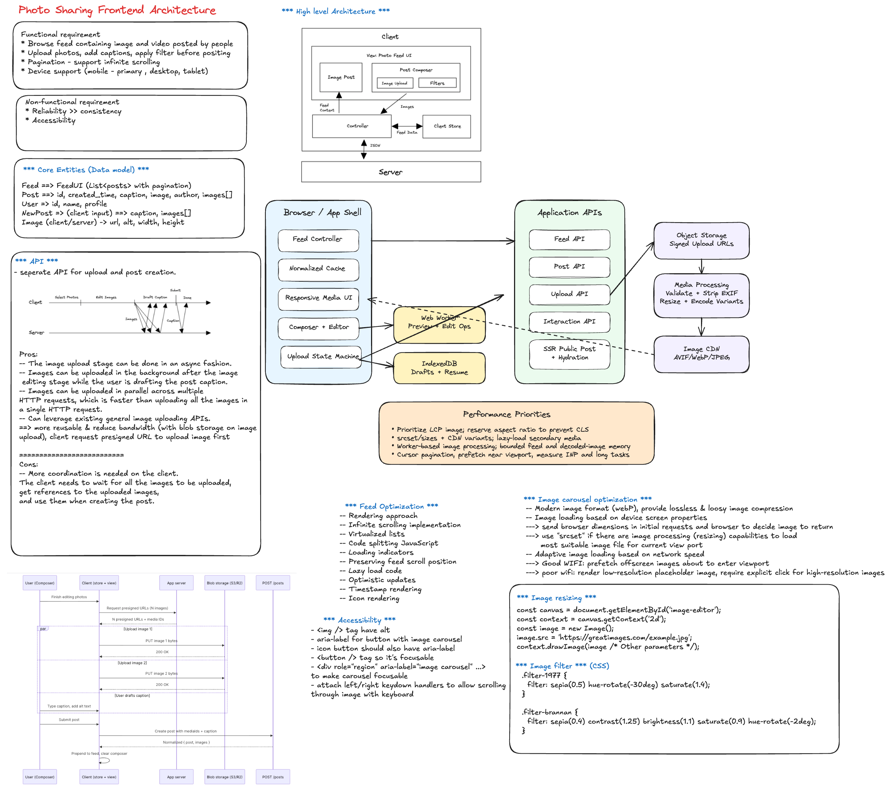

# Frontend System Design Interview: Photo Sharing App

Use this as a discussion framework for an Instagram-like frontend system design interview.

At staff level, show product thinking, architectural tradeoffs, scale and reliability strategy, and measurable outcomes.

## 1. Clarify Scope and Constraints (First 3-5 minutes)

- Surfaces in scope:
  - Home feed
  - Post creation/upload
  - Post detail
  - Profile
  - Notifications
- Content types: photos only, or photos + reels/stories/video.
- Interaction features: likes, comments, saves, follows, shares.
- Platform: web only vs mobile web parity.
- Constraints: low-end devices, poor networks, SEO needs, accessibility.

### Good opening line

"I will optimize for fast feed consumption, reliable media upload and rendering, and responsive engagement interactions while maintaining correctness and trust."

## 2. Define Success Metrics

- Product:
  - Feed session length
  - Engagement rate (likes/comments/saves)
  - Post creation completion rate
  - Return frequency
- Technical:
  - LCP/INP/CLS on feed and profile
  - Upload success rate and median upload time
  - Interaction latency for like/comment actions
  - Error rate by surface

## 3. Core User Flows to Decompose

- Open app and consume personalized feed.
- Open post detail and engage (like/comment/save/share).
- Create post: pick media, edit, caption, publish.
- View profile and scroll history.
- Receive and handle notifications.

Design around these paths, not isolated widgets.

## 4. Frontend Architecture You Should Explain

- App shell and route-level code splitting.
- Domain modules:
  - Feed module
  - Composer/upload module
  - Engagement module (likes/comments/saves)
  - Profile module
  - Notification module
  - Auth/session module
- Data layer:
  - API client with retries/backoff
  - Request dedupe
  - Entity cache (posts/users/comments)
  - Realtime update adapter (optional)

## 5. Data Model Pointers

- Post: id, authorId, media variants, caption, createdAt, counts, viewer state.
- User: id, handle, avatar, follow relationship.
- Comment: id, postId, authorId, text, createdAt.
- Feed page: cursor + ordered post ids.
- Upload draft: local file refs, progress, retries, error reason.

## 6. Feed Rendering Strategy

- Cursor-based pagination for infinite scrolling.
- IntersectionObserver for loading next page.
- Skeleton placeholders and aspect-ratio boxes to avoid layout shift.
- Preserve scroll position and avoid jumps during background refresh.
- Optional virtualization for very long sessions.

## 7. Media Delivery and Performance

- Responsive images (`srcset`, `sizes`) and modern formats.
- CDN transformations (size/quality/format).
- Lazy-load below-the-fold media.
- Prioritize above-the-fold media and first interaction readiness.
- Progressive loading (placeholder -> preview -> full quality).

## 8. Upload/Composer Flow (High-Impact Staff Topic)

- Client-side validation:
  - file type
  - file size
  - resolution limits
- Upload architecture:
  - direct upload with signed URL
  - chunked upload for large media
  - resumable retry strategy
- UX states:
  - pending
  - uploading
  - processing
  - posted
  - failed with retry

## 9. Engagement Interactions (Like/Save/Comment)

- Optimistic UI for low-latency feel.
- Reconcile with server responses and rollback on failure.
- Prevent duplicate taps and race conditions.
- Batch interaction updates where possible.

## 10. Realtime and Freshness Strategy

- Feed can be near-realtime for most products.
- Notifications or active post detail may use realtime updates.
- Handle eventual consistency:
  - count drift
  - deleted/hidden content
  - moderation state changes

## 11. Important Tradeoffs to Highlight

- Strong freshness vs battery/network cost.
- Aggressive prefetching vs memory/data usage.
- Rich media UX vs low-end device performance.
- Optimistic updates vs temporary UI inconsistency.
- Client cache depth vs stale-content risk.

## 12. Reliability and Failure Handling

- Partial rendering when non-critical APIs fail.
- Retry strategies with capped exponential backoff.
- Clear error boundaries at feature-module level.
- Upload resume and retry support.
- Safe fallback when media CDN is degraded.

## 13. Accessibility and UX Quality

- Keyboard navigation and focus order.
- Alt text support and accessible controls.
- Screen-reader labels for interactive actions.
- Contrast/readability for overlays and metadata.
- Reduced motion handling for transitions.

## 14. Security, Privacy, and Safety

- Sanitize user-generated text.
- Secure media URL handling and access checks.
- Respect privacy settings for private accounts.
- Abuse controls: spam throttling, reporting, moderation states.

## 15. Observability and Experimentation

- Product events:
  - feed_impression
  - post_open
  - like_click
  - comment_submit
  - upload_start/upload_success/upload_fail
- Technical telemetry:
  - feed API latency
  - image decode/render times
  - upload retry counts
- Feature flags for gradual rollout.

## 16. 45-60 Minute Interview Delivery Plan

- 0-5 min: scope and success metrics.
- 5-15 min: architecture and data model.
- 15-30 min: feed and media rendering path.
- 30-40 min: upload/composer and engagement actions.
- 40-50 min: tradeoffs, reliability, and accessibility.
- 50-60 min: scaling, rollout strategy, and edge cases.

## 17. Staff Signals Interviewers Want to Hear

- You separate critical path from nice-to-have features.
- You define correctness boundaries for optimistic UI.
- You design for progressive rollout and operational visibility.
- You discuss cross-team contracts (frontend, feed ranking, media pipeline, trust/safety).
- You tie technical choices to product outcomes.

## 18. Common Follow-up Questions

- How do you prevent feed jank on low-end devices?
- How do you handle duplicate likes/comments from retries?
- How do you design upload resume after app refresh?
- What should be eventually consistent vs strongly consistent?
- How would you evolve this for reels/stories/live content?
