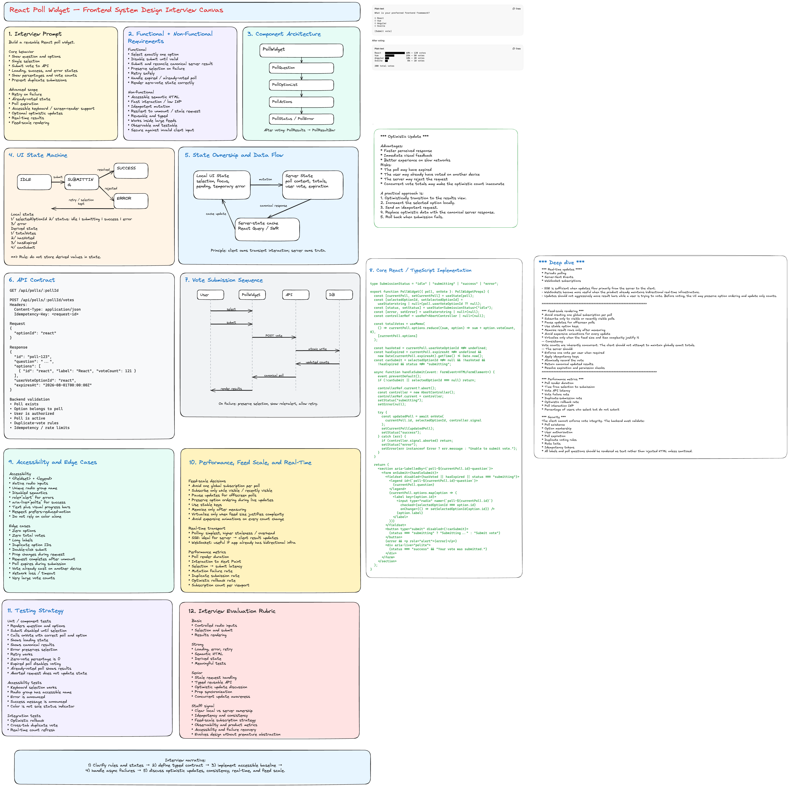

# Frontend System Design Interview: Poll Widget

Use this framework to present a staff-level design for a reusable poll widget that can be embedded across pages and products.

## 1. Clarify Scope and Product Constraints

- Widget types:
  - Single-choice poll
  - Multi-choice poll (optional)
  - Open-ended response (optional, if explicitly in scope)
- Context:
  - Embedded in article/feed/detail pages
  - Can appear multiple times on one page
- Behavioral requirements:
  - One vote per user/session/device (depends on product policy)
  - Show live or delayed results
  - Support anonymous voting if needed
- Scale assumptions:
  - High read QPS, bursty write QPS during live events
  - Global audience with uneven network quality

## 2. Define Success Metrics Up Front

- Product metrics:
  - Vote completion rate
  - Time-to-first-vote
  - Poll engagement per impression
  - Poll abandonment rate
- Technical metrics:
  - P95 widget load time
  - P95 vote submission latency
  - Realtime result freshness lag
  - Vote failure and retry rate

## 3. Core User Flows

- Load widget with question/options/current state.
- User selects option(s) and submits vote.
- UI confirms vote and transitions to result view.
- Widget receives result updates (polling/realtime).
- User returns later and sees prior vote state.

## 4. Frontend Architecture (What to Draw)

- Reusable widget package:
  - UI layer (presentation and accessibility)
  - State machine (loading, voting, voted, error, closed)
  - Data adapter (REST/GraphQL contract)
  - Realtime adapter (SSE/WebSocket/fallback polling)
- Host integration contract:
  - `pollId`
  - user identity token or anonymous key
  - feature flags (realtime on/off, result visibility mode)
- Separation of concerns:
  - Widget owns interaction and local state
  - Host page owns placement and analytics context

## 5. Suggested Data Model at the UI Layer

- Poll:
  - id, title, question, closeAt, visibility rules
- Option:
  - id, label, voteCount, votePct
- UserVote:
  - selectedOptionIds, submittedAt, source
- WidgetState:
  - status (`idle|loading|ready|submitting|voted|error|closed`)
  - optimisticVote
  - lastSyncedAt

## 6. Rendering and Performance Strategy

- Small payload first render:
  - question, options, user vote flag
  - defer heavy metadata
- Multiple widgets per page:
  - avoid duplicate fetching via shared cache
  - lazy-mount offscreen widgets
- Reduce jank:
  - reserve space to prevent layout shift
  - memoize option rows and chart segments

## 7. Vote Submission Path (Critical)

- Validation:
  - enforce single vs multi-select constraints
  - prevent duplicate submissions in-flight
- Submission protocol:
  - idempotency key per vote attempt
  - retry with capped exponential backoff on transient failures
- Optimistic UI:
  - immediately reflect selected option and temporary totals
  - reconcile with authoritative server response
  - rollback with clear message if rejected

## 8. Realtime Result Updates

- Strategy by product tier:
  - Live events: SSE/WebSocket + heartbeat
  - Standard pages: periodic polling
- Update model:
  - apply incremental deltas when possible
  - full snapshot refresh on drift detection
- Failure behavior:
  - fallback from realtime to polling
  - expose stale indicator if updates lag

## 9. Correctness and Consistency Decisions

- Strong consistency needed for:
  - final vote acceptance/rejection
  - closed poll state
- Eventual consistency acceptable for:
  - aggregate percentages/count animation
  - non-critical rank ordering for close results
- Conflict handling:
  - duplicate vote detected
  - poll closed mid-submit
  - option removed or moderated

## 10. Accessibility and Inclusivity

- Keyboard-only flow for option selection and submit.
- Proper semantics:
  - `fieldset` and `legend` for question/options group
  - clear labels and focus states
- Screen reader announcements:
  - vote success/failure
  - result updates
- Visual clarity:
  - high contrast bars/text
  - do not rely on color alone for winning option

## 11. Security, Abuse, and Privacy

- Validate on server; never trust client vote limits.
- Protect against scripted abuse:
  - rate limiting
  - bot heuristics
  - signed user/session assertions
- Privacy choices:
  - anonymous mode masks identity in result data
  - avoid exposing raw participant identifiers in client payloads

## 12. Observability and Experimentation

- Product events:
  - poll_impression
  - option_selected
  - vote_submit_clicked
  - vote_submit_success
  - vote_submit_failed
  - result_viewed
- Technical telemetry:
  - API latency
  - realtime disconnect counts
  - retries per vote
  - stale duration
- Feature flags:
  - optimistic UI on/off
  - realtime transport strategy
  - result visibility modes

## 13. Key Tradeoffs to Discuss as Staff Engineer

- Realtime freshness vs battery/network/resource cost.
- Immediate optimistic results vs temporary mismatch risk.
- Rich visualization vs low-end device performance.
- Strict anti-abuse checks vs friction and drop-off.

## 14. 45-60 Minute Interview Delivery Plan

- 0-5 min: clarify scope, users, constraints, success metrics.
- 5-15 min: architecture and contracts (widget + host + backend).
- 15-30 min: vote submission and realtime result pipeline.
- 30-40 min: reliability, retries, consistency, failure handling.
- 40-50 min: accessibility, abuse prevention, observability.
- 50-60 min: scaling decisions and roadmap extensions.

## 15. Staff-Level Signals You Should Explicitly Show

- You define exact consistency boundaries, not generic statements.
- You design idempotent writes and failure recovery paths.
- You plan for multi-embed pages and cross-surface reuse.
- You tie frontend decisions to measurable product impact.
- You outline phased rollout with feature flags and guardrails.

## 16. Common Follow-Up Questions

- How would you prevent double voting across devices?
- How do you handle spikes during a live stream poll?
- How do you degrade gracefully if realtime channel fails?
- What if user identity is unknown at initial render?
- How would you support editable polls and option moderation?
