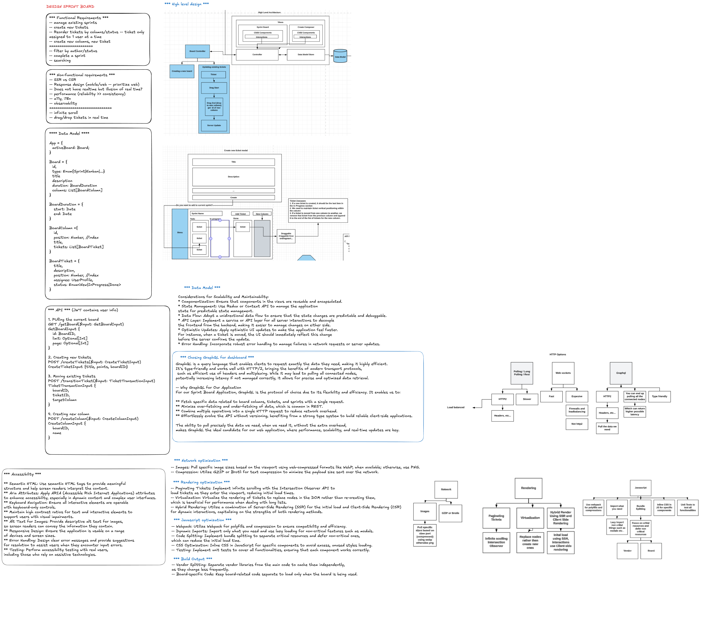
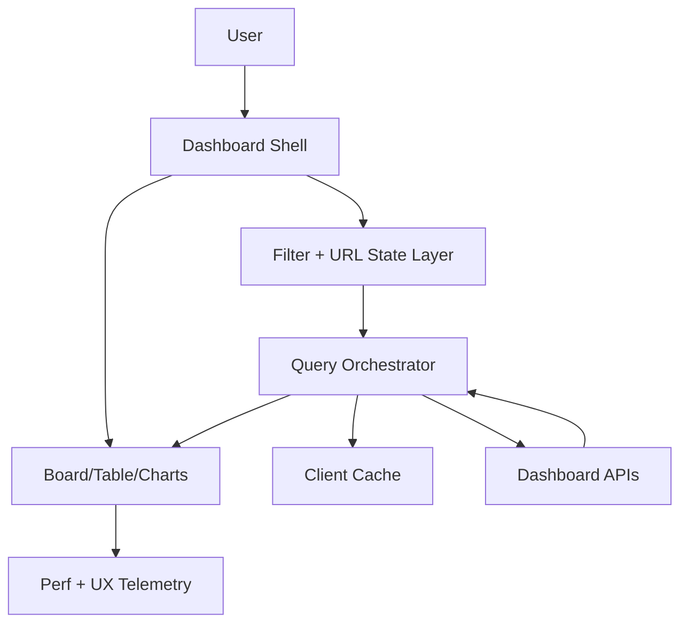

# Frontend System Design: Sprint Dashboard

## Interview Prompt

Design a sprint dashboard that helps engineering teams track sprint health, work distribution, delivery risk, and execution progress.

Focus on:

- frontend scalability across large organizations and large datasets;
- optimization for fast loading and smooth interactions;
- maintainable architecture that can evolve with product requirements.

## 1. Scope and Product Goals

### Core workflows

1. View sprint summary metrics (velocity, burndown, completed vs planned).
2. Filter and segment by team, project, assignee, and label.
3. Inspect work items in board/table views.
4. Drill into blocked work and delivery risks.
5. Track changes in near real time during sprint ceremonies.

### Non-goals for first version

- Full backlog management editor.
- Cross-quarter portfolio analytics.
- Admin-heavy configuration surfaces.

### Success metrics

- P95 page interactive time < 2.5s for common team dashboards.
- Filter and view-switch interactions < 200ms perceived latency.
- Error rate and stale-data incidents below agreed SLO.
- High adoption in ceremonies (daily standup, planning, retrospectives).

## 2. Staff-Level Framing

A strong staff answer should emphasize:

- clear state ownership between URL, local UI, and server state;
- cache and fetch strategy tuned per surface;
- resilience to partial API failures;
- observability for user-facing latency and reliability;
- extensibility without repeatedly rewriting the dashboard shell.

## 3. High-Level Frontend Architecture



### Suggested module boundaries

- `dashboard-shell`: layout, navigation, route boundaries.
- `dashboard-filters`: URL-driven filter state and presets.
- `dashboard-data`: query orchestration, normalization, and cache integration.
- `dashboard-board-view`: virtualized board columns/cards.
- `dashboard-table-view`: virtualized table/grid for dense scanning.
- `dashboard-insights`: charts, burndown, trend indicators.
- `dashboard-observability`: logs, tracing IDs, metric emitters.

## 4. Data Model and State Strategy

### Data model (normalized)

```ts
type Sprint = {
  id: string;
  name: string;
  startDate: string;
  endDate: string;
  status: 'planned' | 'active' | 'closed';
};
type Ticket = {
  id: string;
  title: string;
  status: string;
  assigneeId?: string;
  points?: number;
  updatedAt: string;
};
type Assignee = { id: string; name: string; avatarUrl?: string };

type DashboardEntities = {
  sprintsById: Record<string, Sprint>;
  ticketsById: Record<string, Ticket>;
  assigneesById: Record<string, Assignee>;
};
```

Normalize entity storage to avoid duplicate ticket/assignee objects across board, table, and chart views.

### State boundaries

- URL state: sprint ID, filters, grouping, view mode.
- Server state: sprint/ticket datasets, metrics, team metadata.
- Local UI state: panel expansion, hovered card, draft edits, modals.

Rule: keep durable/shareable state in URL; keep transient interaction state local.

## 5. FE Optimization Strategy

### Network optimization

- Aggregate expensive joins in backend APIs; avoid chatty N+1 client calls.
- Use `cache-and-network` for dashboard screens and `network-only` for correctness-critical actions.
- Deduplicate concurrent requests by key.
- Compress payloads and prune unused fields.

### Rendering optimization

- Virtualize board cards and table rows for large sprint datasets.
- Memoize heavy card cells and summary widgets.
- Defer non-critical charts until primary board metrics render.
- Split code by route/view and lazy-load secondary panels.

### Interaction optimization

- Debounce text search and expensive multi-filter recomputation.
- Use `useTransition` or equivalent for non-urgent recalculations.
- Preserve scroll and focus state while background refresh happens.

### Core Web Vitals priorities

- LCP: prioritize shell + primary sprint summary + first visible board segment.
- INP: keep filter toggles and card actions under 200ms.
- CLS: reserve chart/card dimensions to prevent layout jumps.

## 6. Scalability Strategy

### Dataset scaling

- Paginate or cursor-load ticket data by sprint/group.
- Fetch details on demand for expanded cards.
- Use summary APIs for top-level widgets and detail APIs for drill-in.

### Team/org scaling

- Support multi-team dashboards with scoped query keys.
- Introduce feature flags for high-cost widgets.
- Use tenant/team boundaries in cache keys to avoid contamination.

### Realtime scaling

- For ceremony mode, subscribe to incremental updates (SSE/WebSocket).
- Apply optimistic local updates for quick actions, then reconcile server truth.
- Batch frequent update events before rendering to avoid UI thrash.

## 7. Failure Handling and Resilience

- Render partial data if one widget fails instead of blocking the whole page.
- Show stale timestamps when using cached data after fetch failures.
- Isolate each major surface with error boundaries.
- Retry idempotent reads with capped exponential backoff.

## 8. Accessibility and UX Quality

- Keyboard navigation for filters, board lanes, and cards.
- ARIA semantics for board/table controls and summary charts.
- High-contrast status indicators beyond color-only encoding.
- Responsive layout: dense desktop mode, simplified mobile summary mode.

## 9. API Contract Design (Frontend-Friendly)

```ts
type SprintDashboardResponse = {
  sprint: Sprint;
  summaries: {
    plannedPoints: number;
    completedPoints: number;
    blockedCount: number;
    burndown: Array<{ day: string; remaining: number }>;
  };
  ticketIdsByGroup: Record<string, string[]>;
  entities: DashboardEntities;
  generatedAt: string;
};
```

This shape supports:

- fast initial render of summaries;
- normalized data reuse in board and table;
- cheap UI regrouping without refetching entire objects.

## 10. Observability

Track both UX and system performance:

- route load duration;
- first summary render;
- first board interaction;
- filter apply latency;
- cache hit rate;
- API latency and error rates by endpoint;
- stale data duration and retry outcomes.

Use request IDs and sprint IDs in logs to correlate frontend delays with backend traces.

## 11. 45-60 Minute Interview Plan

1. Clarify scope, users, and success metrics.
2. Present architecture and state boundaries.
3. Deep-dive optimization strategy (network/render/interaction).
4. Explain scalability levers (data, teams, realtime).
5. Cover failure handling, accessibility, and observability.
6. Close with tradeoffs and rollout plan.

## 12. Common Tradeoffs to Call Out

- Rich board UI vs rendering cost at large ticket counts.
- Realtime freshness vs client complexity and event volume.
- Large cached datasets vs memory pressure.
- Fast optimistic UX vs temporary consistency gaps.

## 13. Strong Closing Narrative

> I would design the sprint dashboard as a layered frontend system: URL-driven state, normalized server data, virtualized rendering, and measured interaction performance. The key is to optimize the critical path for standup and planning workflows while keeping the architecture scalable as team count, ticket volume, and feature surface grow.
