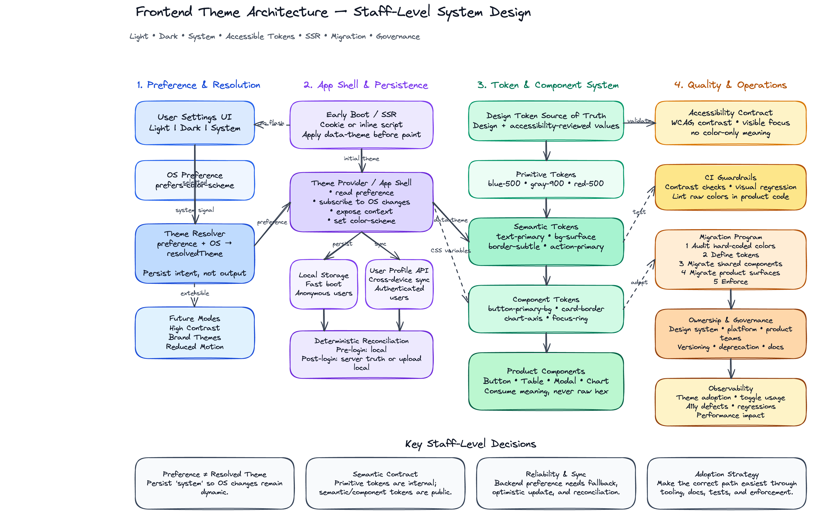

# Frontend Theme Architecture: Dark Mode, Light Mode, and Accessible Color Systems

## Interview Prompt

You are a **Staff Frontend Engineer** leading a team that owns the design system and application shell for a large product. The product must support:

- Light mode
- Dark mode
- System/default mode
- Remembering the user's selected preference across sessions
- Accessible color contrast across all supported modes
- A scalable color-token system that works across multiple product surfaces
- Smooth migration from legacy hard-coded colors
- Maintainable architecture across frontend teams

Design the frontend architecture for this theming system.

Your answer should explain:

1. How the theme should be modeled.
2. How color tokens should be defined.
3. How the app should choose the active theme.
4. How the user's preference should be persisted.
5. How accessibility and contrast should be enforced.
6. How components should consume theme values.
7. How the system should support future themes.
8. Trade-offs, risks, and migration strategy.

---

## Problem to Solve

The goal is not just to toggle a class from `light` to `dark`. The goal is to design a **scalable theme architecture** that allows product teams to build UI consistently without manually reasoning about every color in every mode.

A strong solution should make the following easy:

- Designers define color decisions once.
- Engineers consume semantic tokens instead of raw hex values.
- Users can choose their preferred appearance.
- The app can respect operating-system preference.
- Accessibility rules are built into the design system.
- Future modes, such as high contrast or brand themes, can be added without rewriting every component.

---

## High-Level Architecture

At a high level, the system has five layers:

```txt
User Preference
      ↓
Theme Resolution Logic
      ↓
Theme Provider / App Shell
      ↓
Design Tokens / CSS Variables
      ↓
Application Components
```

### 1. User Preference Layer

The user can choose one of the following options:

```ts
export type ThemePreference = 'light' | 'dark' | 'system';
```

This is the value we persist. We do **not** persist only the resolved theme, because `system` must continue to follow the operating system.

### 2. Resolved Theme Layer

The app resolves the actual visual mode from the user's preference:

```ts
export type ResolvedTheme = 'light' | 'dark';
```

Resolution rules:

```ts
function resolveTheme(preference: ThemePreference, systemPrefersDark: boolean): ResolvedTheme {
  if (preference === 'light') return 'light';
  if (preference === 'dark') return 'dark';
  return systemPrefersDark ? 'dark' : 'light';
}
```

### 3. Theme Provider Layer

The application shell owns the theme state and applies it globally.

Example responsibilities:

- Read stored preference on app boot.
- Detect OS-level preference with `prefers-color-scheme`.
- Resolve the active theme.
- Write the selected preference to storage.
- Apply `data-theme="light"` or `data-theme="dark"` to the document root.
- Notify components when the preference changes.

```tsx
import React, { createContext, useCallback, useContext, useEffect, useMemo, useState } from 'react';

export type ThemePreference = 'light' | 'dark' | 'system';
export type ResolvedTheme = 'light' | 'dark';

type ThemeContextValue = {
  preference: ThemePreference;
  resolvedTheme: ResolvedTheme;
  setPreference: (nextPreference: ThemePreference) => void;
};

const ThemeContext = createContext<ThemeContextValue | null>(null);

const STORAGE_KEY = 'app.theme.preference';

function getSystemPrefersDark(): boolean {
  if (typeof window === 'undefined') return false;
  return window.matchMedia('(prefers-color-scheme: dark)').matches;
}

function getInitialPreference(): ThemePreference {
  if (typeof window === 'undefined') return 'system';

  const storedPreference = window.localStorage.getItem(STORAGE_KEY);

  if (
    storedPreference === 'light' ||
    storedPreference === 'dark' ||
    storedPreference === 'system'
  ) {
    return storedPreference;
  }

  return 'system';
}

function resolveTheme(preference: ThemePreference, systemPrefersDark: boolean): ResolvedTheme {
  if (preference === 'light') return 'light';
  if (preference === 'dark') return 'dark';
  return systemPrefersDark ? 'dark' : 'light';
}

export function ThemeProvider({ children }: { children: React.ReactNode }) {
  const [preference, setPreferenceState] = useState<ThemePreference>(getInitialPreference);
  const [systemPrefersDark, setSystemPrefersDark] = useState(getSystemPrefersDark);

  const resolvedTheme = resolveTheme(preference, systemPrefersDark);

  const setPreference = useCallback((nextPreference: ThemePreference) => {
    setPreferenceState(nextPreference);
    window.localStorage.setItem(STORAGE_KEY, nextPreference);
  }, []);

  useEffect(() => {
    const mediaQuery = window.matchMedia('(prefers-color-scheme: dark)');

    const handleChange = () => {
      setSystemPrefersDark(mediaQuery.matches);
    };

    mediaQuery.addEventListener('change', handleChange);
    return () => mediaQuery.removeEventListener('change', handleChange);
  }, []);

  useEffect(() => {
    document.documentElement.dataset.theme = resolvedTheme;
    document.documentElement.style.colorScheme = resolvedTheme;
  }, [resolvedTheme]);

  const value = useMemo(
    () => ({ preference, resolvedTheme, setPreference }),
    [preference, resolvedTheme, setPreference]
  );

  return <ThemeContext.Provider value={value}>{children}</ThemeContext.Provider>;
}

export function useTheme() {
  const context = useContext(ThemeContext);

  if (context == null) {
    throw new Error('useTheme must be used within ThemeProvider');
  }

  return context;
}
```

---

## Theme Resolution Strategy

The system should distinguish between **preference** and **resolved theme**.

| Concept           | Example Values               | Purpose                           |
| ----------------- | ---------------------------- | --------------------------------- |
| User preference   | `light`, `dark`, `system`    | What the user selected            |
| System preference | `prefers-color-scheme: dark` | What the operating system prefers |
| Resolved theme    | `light`, `dark`              | What the UI actually renders      |

This distinction matters because `system` is dynamic. If the operating system changes from light to dark at sunset, the app should update automatically when the user selected `system`.

---

## Color System Design

A strong theme system should avoid raw colors in product components.

Instead of this:

```tsx
<button style={{ backgroundColor: '#0a66c2', color: '#ffffff' }}>Submit</button>
```

Use semantic tokens:

```tsx
<button className={styles.primaryButton}>Submit</button>
```

```css
.primaryButton {
  background: var(--color-action-primary-bg);
  color: var(--color-action-primary-fg);
}
```

The component should not know whether it is in light or dark mode. It should only know the semantic purpose of the color.

---

## Token Layers

A scalable color system usually has multiple token layers.

### 1. Primitive Tokens

Primitive tokens represent raw color values.

```css
:root {
  --blue-50: #e8f3ff;
  --blue-100: #cce4ff;
  --blue-500: #0a66c2;
  --blue-700: #004182;

  --gray-0: #ffffff;
  --gray-50: #f7f8fa;
  --gray-100: #edf0f3;
  --gray-700: #404040;
  --gray-900: #111111;

  --red-500: #d93025;
  --green-500: #188038;
}
```

Primitive tokens are useful for design-system authors, but product components should rarely consume them directly.

### 2. Semantic Tokens

Semantic tokens describe UI meaning.

```css
:root[data-theme='light'] {
  --color-bg-canvas: var(--gray-0);
  --color-bg-surface: var(--gray-50);
  --color-bg-elevated: var(--gray-0);

  --color-text-primary: var(--gray-900);
  --color-text-secondary: var(--gray-700);
  --color-text-inverse: var(--gray-0);

  --color-border-subtle: var(--gray-100);
  --color-border-strong: var(--gray-700);

  --color-action-primary-bg: var(--blue-500);
  --color-action-primary-fg: var(--gray-0);
  --color-action-primary-hover-bg: var(--blue-700);

  --color-status-danger-bg: #fce8e6;
  --color-status-danger-fg: #b3261e;
  --color-status-success-bg: #e6f4ea;
  --color-status-success-fg: #137333;
}

:root[data-theme='dark'] {
  --color-bg-canvas: #121212;
  --color-bg-surface: #1e1e1e;
  --color-bg-elevated: #242424;

  --color-text-primary: #f5f5f5;
  --color-text-secondary: #c7c7c7;
  --color-text-inverse: #111111;

  --color-border-subtle: #333333;
  --color-border-strong: #d0d0d0;

  --color-action-primary-bg: #8ab4f8;
  --color-action-primary-fg: #111111;
  --color-action-primary-hover-bg: #aecbfa;

  --color-status-danger-bg: #5f2120;
  --color-status-danger-fg: #f2b8b5;
  --color-status-success-bg: #0f3d28;
  --color-status-success-fg: #b7e1c1;
}
```

### 3. Component Tokens

Component tokens allow design-system components to expose stable styling contracts.

```css
:root[data-theme='light'] {
  --button-primary-bg: var(--color-action-primary-bg);
  --button-primary-fg: var(--color-action-primary-fg);
  --button-primary-hover-bg: var(--color-action-primary-hover-bg);
  --card-bg: var(--color-bg-elevated);
  --card-border: var(--color-border-subtle);
}

:root[data-theme='dark'] {
  --button-primary-bg: var(--color-action-primary-bg);
  --button-primary-fg: var(--color-action-primary-fg);
  --button-primary-hover-bg: var(--color-action-primary-hover-bg);
  --card-bg: var(--color-bg-elevated);
  --card-border: var(--color-border-subtle);
}
```

Product teams should mostly consume component tokens through design-system components.

---

## Recommended Token Naming Convention

Use names that describe **purpose**, not visual appearance.

Prefer:

```txt
--color-text-primary
--color-bg-surface
--color-border-subtle
--color-action-primary-bg
--color-status-danger-fg
```

Avoid:

```txt
--color-white
--color-black
--color-light-gray
--color-dark-blue
```

Why? In dark mode, `--color-white` may not be white, and `--color-dark-blue` may need to become lighter for contrast.

---

## Example Global CSS

```css
:root {
  font-family: Inter, system-ui, sans-serif;
}

html,
body {
  margin: 0;
  min-height: 100%;
  background: var(--color-bg-canvas);
  color: var(--color-text-primary);
}

body {
  transition:
    background-color 160ms ease,
    color 160ms ease;
}

* {
  box-sizing: border-box;
}

button,
input,
textarea,
select {
  color: inherit;
  font: inherit;
}

:focus-visible {
  outline: 2px solid var(--color-focus-ring);
  outline-offset: 2px;
}
```

Add focus ring tokens:

```css
:root[data-theme='light'] {
  --color-focus-ring: #0a66c2;
}

:root[data-theme='dark'] {
  --color-focus-ring: #8ab4f8;
}
```

---

## Avoiding Flash of Wrong Theme

One common issue is a flash of light mode before dark mode loads.

This happens when the page renders before JavaScript reads the stored preference.

To prevent this, add a tiny inline script in the HTML document before the app bundle loads.

```html
<script>
  (function () {
    try {
      var preference = localStorage.getItem('app.theme.preference') || 'system';
      var prefersDark = window.matchMedia('(prefers-color-scheme: dark)').matches;
      var resolvedTheme = preference === 'system' ? (prefersDark ? 'dark' : 'light') : preference;

      document.documentElement.dataset.theme = resolvedTheme;
      document.documentElement.style.colorScheme = resolvedTheme;
    } catch (error) {
      document.documentElement.dataset.theme = 'light';
      document.documentElement.style.colorScheme = 'light';
    }
  })();
</script>
```

For server-rendered applications, the preference can also be stored in a cookie so the server can render the correct initial theme.

---

## Persistence Strategy

### Local Storage

Use `localStorage` for simple client-side persistence.

Pros:

- Easy to implement.
- Works without authentication.
- Good for local device preference.

Cons:

- Does not sync across devices.
- Not available during server rendering.
- Can cause flash of wrong theme unless handled early.

### Cookie

Use cookies when server-rendered HTML needs the correct initial theme.

Pros:

- Available on the server.
- Helps prevent initial theme mismatch.
- Useful for SSR and edge rendering.

Cons:

- Adds request overhead.
- Requires cookie management.
- Still device/browser specific unless synced to account settings.

### User Profile / Backend Setting

Use a backend setting when the preference should sync across devices.

Pros:

- Cross-device consistency.
- Useful for authenticated enterprise products.
- Can be managed as part of user settings.

Cons:

- Requires API integration.
- Need optimistic update and failure handling.
- Must define fallback behavior before user profile loads.

### Recommended Approach

For a large authenticated product:

1. Use local storage for fast boot.
2. Use cookie for SSR correctness if needed.
3. Sync with backend user settings after login.
4. Prefer local value during initial render, then reconcile with server value.

---

## Accessibility Requirements

Dark mode is not only a visual preference. It must meet accessibility expectations.

### Contrast

All semantic token pairs should be validated for contrast.

Examples:

- `--color-text-primary` on `--color-bg-canvas`
- `--color-text-secondary` on `--color-bg-surface`
- `--button-primary-fg` on `--button-primary-bg`
- `--color-status-danger-fg` on `--color-status-danger-bg`
- Focus ring color against surrounding background

Common target ratios:

- Normal text: at least 4.5:1
- Large text: at least 3:1
- Non-text UI indicators: at least 3:1

### Do Not Rely on Color Alone

Status, errors, and warnings should not rely only on color.

Bad:

```txt
Input border becomes red, but there is no message.
```

Better:

```txt
Input border becomes red, an error icon appears, and helper text explains the issue.
```

### Focus States

Keyboard focus must be visible in both modes.

```css
.interactiveElement:focus-visible {
  outline: 2px solid var(--color-focus-ring);
  outline-offset: 2px;
}
```

### Disabled States

Disabled UI should be visually distinct but still readable.

```css
:root[data-theme='light'] {
  --color-text-disabled: #8c8c8c;
  --color-bg-disabled: #f1f3f4;
}

:root[data-theme='dark'] {
  --color-text-disabled: #8f8f8f;
  --color-bg-disabled: #2a2a2a;
}
```

### Images, Charts, and Data Visualizations

Dark mode support must include non-standard UI surfaces:

- Charts
- Graphs
- SVG icons
- Maps
- Code blocks
- Syntax highlighting
- Skeleton loaders
- Shadows and elevation
- Empty states
- Illustrations
- Embedded iframes
- Third-party widgets

For charts, prefer tokenized color palettes instead of hard-coded series colors.

---

## Component Consumption Pattern

### Button Example

```tsx
import styles from './Button.module.css';

type ButtonVariant = 'primary' | 'secondary' | 'danger';

type ButtonProps = {
  children: React.ReactNode;
  variant?: ButtonVariant;
} & React.ButtonHTMLAttributes<HTMLButtonElement>;

export function Button({ children, variant = 'primary', className, ...props }: ButtonProps) {
  return (
    <button
      {...props}
      className={[styles.button, styles[variant], className].filter(Boolean).join(' ')}
    >
      {children}
    </button>
  );
}
```

```css
.button {
  border: 1px solid transparent;
  border-radius: 8px;
  cursor: pointer;
  font-weight: 600;
  padding: 8px 12px;
  transition:
    background-color 120ms ease,
    border-color 120ms ease,
    color 120ms ease;
}

.button:disabled {
  cursor: not-allowed;
  background: var(--color-bg-disabled);
  color: var(--color-text-disabled);
}

.primary {
  background: var(--button-primary-bg);
  color: var(--button-primary-fg);
}

.primary:hover:not(:disabled) {
  background: var(--button-primary-hover-bg);
}

.secondary {
  background: var(--color-bg-surface);
  color: var(--color-text-primary);
  border-color: var(--color-border-subtle);
}

.danger {
  background: var(--color-status-danger-bg);
  color: var(--color-status-danger-fg);
}
```

### Card Example

```tsx
import styles from './Card.module.css';

export function Card({ children }: { children: React.ReactNode }) {
  return <section className={styles.card}>{children}</section>;
}
```

```css
.card {
  background: var(--card-bg);
  border: 1px solid var(--card-border);
  border-radius: 12px;
  box-shadow: var(--shadow-elevation-1);
  color: var(--color-text-primary);
  padding: 16px;
}
```

---

## Shadows and Elevation

Dark mode shadows often need different treatment. A black shadow on a dark background may be invisible.

Use elevation tokens:

```css
:root[data-theme='light'] {
  --shadow-elevation-1: 0 1px 2px rgba(0, 0, 0, 0.12);
  --shadow-elevation-2: 0 4px 12px rgba(0, 0, 0, 0.16);
}

:root[data-theme='dark'] {
  --shadow-elevation-1: 0 1px 2px rgba(0, 0, 0, 0.7);
  --shadow-elevation-2: 0 4px 16px rgba(0, 0, 0, 0.9);
}
```

In dark mode, elevation may also be represented with slightly lighter surfaces instead of only shadows.

---

## Icons and SVGs

Icons should use `currentColor` where possible.

```tsx
export function SearchIcon() {
  return (
    <svg width="16" height="16" viewBox="0 0 16 16" fill="none" aria-hidden="true">
      <path
        d="M7 12A5 5 0 1 1 7 2a5 5 0 0 1 0 10Zm4-1 3 3"
        stroke="currentColor"
        strokeWidth="2"
        strokeLinecap="round"
      />
    </svg>
  );
}
```

Then the icon inherits from text color:

```css
.iconButton {
  color: var(--color-text-secondary);
}

.iconButton:hover {
  color: var(--color-text-primary);
}
```

---

## Testing Strategy

### Unit Tests

Test theme resolution logic.

```ts
import { describe, expect, it } from 'vitest';

import { resolveTheme } from './theme';

describe('resolveTheme', () => {
  it('returns light when user preference is light', () => {
    expect(resolveTheme('light', true)).toBe('light');
  });

  it('returns dark when user preference is dark', () => {
    expect(resolveTheme('dark', false)).toBe('dark');
  });

  it('uses system preference when user preference is system', () => {
    expect(resolveTheme('system', true)).toBe('dark');
    expect(resolveTheme('system', false)).toBe('light');
  });
});
```

### Visual Regression Tests

Run visual snapshots in both modes.

```txt
Button / light
Button / dark
Card / light
Card / dark
Modal / light
Modal / dark
Dashboard / light
Dashboard / dark
```

### Accessibility Tests

Use automated checks for:

- Color contrast
- Focus visibility
- Keyboard navigation
- ARIA states
- Reduced motion
- High contrast mode compatibility

### Manual QA Checklist

- No flash of wrong theme on reload.
- Theme persists across refresh.
- `system` follows operating-system changes.
- Modal overlays look correct in both modes.
- Hover, focus, active, disabled, selected, and error states work in both modes.
- Charts and code blocks are readable.
- Browser form controls respect `color-scheme`.

---

## Migration Strategy

Most large products already have hard-coded colors. A safe migration should be incremental.

### Phase 1: Audit

Identify:

- Hard-coded hex values
- Inline styles
- Legacy Sass variables
- SVGs with fixed fills
- Chart color constants
- Third-party components
- Areas with low contrast

### Phase 2: Define Token Contract

Create the initial token system:

- Background tokens
- Text tokens
- Border tokens
- Action tokens
- Status tokens
- Focus tokens
- Data visualization tokens
- Elevation tokens

### Phase 3: Add Theme Provider

Introduce global theme resolution and persistence without changing every component immediately.

### Phase 4: Migrate Design-System Components

Start with shared components:

- Button
- Input
- Select
- Checkbox
- Modal
- Tooltip
- Card
- Table
- Navigation

### Phase 5: Migrate Product Surfaces

Move product UI from raw colors to semantic tokens.

### Phase 6: Enforce

Add lint rules and code review standards:

- Ban new raw hex colors in product code.
- Allow raw colors only in token definition files.
- Require dark-mode screenshots for new shared components.
- Add contrast checks to CI.

---

## Trade-Offs

### CSS Variables vs CSS-in-JS Theme Object

| Approach                    | Pros                                                       | Cons                                                 |
| --------------------------- | ---------------------------------------------------------- | ---------------------------------------------------- |
| CSS variables               | Native, fast, works with plain CSS, easy runtime switching | Harder to type-check token names                     |
| CSS-in-JS theme object      | Strong JS integration, can be typed                        | More runtime overhead, harder for non-React surfaces |
| Build-time generated tokens | Consistent, can sync with design tools                     | Requires token pipeline and tooling investment       |

Recommended approach for a large product:

```txt
Design tokens source of truth
      ↓
Generated CSS variables
      ↓
Optional typed token helpers for TypeScript
```

### Local Storage vs Backend Preference

| Approach        | Pros                            | Cons                            |
| --------------- | ------------------------------- | ------------------------------- |
| Local storage   | Fast, simple, works anonymously | Does not sync across devices    |
| Cookie          | Good for SSR                    | More complexity                 |
| Backend setting | Cross-device sync               | Requires API and reconciliation |

Recommended approach:

```txt
Use local storage for immediate boot.
Use backend setting for authenticated sync.
Use cookie if SSR needs correct first paint.
```

### Semantic Tokens vs Raw Palette Tokens

| Approach           | Pros                            | Cons                                |
| ------------------ | ------------------------------- | ----------------------------------- |
| Raw palette tokens | Flexible, simple for designers  | Product engineers may misuse colors |
| Semantic tokens    | Accessible, scalable, mode-safe | Requires more upfront design work   |

Recommended approach:

```txt
Primitive tokens are internal.
Semantic tokens are public.
Component tokens are the most stable contract.
```

---

## Things to Be Careful About

### 1. Do Not Assume Color Inversion Works

Dark mode is not simply:

```txt
white → black
black → white
```

Many colors need different saturation, brightness, and contrast behavior in dark mode.

### 2. Avoid Semantic Confusion

A token like `--color-bg-white` is dangerous because it encodes visual color instead of purpose.

Prefer:

```txt
--color-bg-canvas
--color-bg-surface
--color-bg-elevated
```

### 3. Validate Every Interaction State

Each mode needs tokens for:

- Default
- Hover
- Active
- Focus
- Selected
- Disabled
- Loading
- Error
- Warning
- Success

### 4. Include Data Visualization Early

Dashboards often fail dark mode because charts use hard-coded colors.

Define chart tokens:

```css
:root[data-theme='light'] {
  --chart-series-1: #0a66c2;
  --chart-series-2: #188038;
  --chart-axis: #5f6368;
  --chart-grid: #dadce0;
}

:root[data-theme='dark'] {
  --chart-series-1: #8ab4f8;
  --chart-series-2: #81c995;
  --chart-axis: #c7c7c7;
  --chart-grid: #3c4043;
}
```

### 5. Support Reduced Motion

Theme transitions should respect users who prefer reduced motion.

```css
@media (prefers-reduced-motion: reduce) {
  * {
    transition: none !important;
  }
}
```

### 6. Handle Third-Party Components

Third-party components may not automatically support your tokens. Wrap them with adapters or define scoped overrides.

```css
.thirdPartyWrapper {
  --third-party-bg: var(--color-bg-surface);
  --third-party-text: var(--color-text-primary);
}
```

---

## Staff-Level Design Considerations

A staff-level answer should go beyond implementation details.

### Ownership Model

Define who owns what:

| Area                            | Owner                         |
| ------------------------------- | ----------------------------- |
| Token naming and contrast rules | Design system team            |
| Token values                    | Design + accessibility review |
| Theme provider                  | Frontend platform team        |
| Product adoption                | Product engineering teams     |
| CI checks                       | Frontend infrastructure       |
| Visual regression baselines     | Component owners              |

### Governance

Create clear rules:

- Product code should not introduce raw color values.
- New shared components must support all themes.
- Theme changes require visual regression review.
- Accessibility checks must run in CI.
- Design tokens should be documented with intended usage.

### Rollout Plan

A safe rollout can use feature flags:

```txt
Phase 1: Internal dogfood
Phase 2: Opt-in beta
Phase 3: Default system mode for new users
Phase 4: Full release
Phase 5: Enforce token usage in CI
```

### Observability

Track:

- Percentage of users using light, dark, and system mode
- Theme toggle usage
- Accessibility bugs by mode
- Visual regression failures
- User feedback by surface
- Performance impact of theme switching

---

## API Design Example

A simple theme setting component:

```tsx
import { useTheme, ThemePreference } from './ThemeProvider';

const OPTIONS: Array<{ label: string; value: ThemePreference }> = [
  { label: 'Light', value: 'light' },
  { label: 'Dark', value: 'dark' },
  { label: 'System', value: 'system' },
];

export function ThemeSettings() {
  const { preference, resolvedTheme, setPreference } = useTheme();

  return (
    <fieldset>
      <legend>Appearance</legend>
      <p>Current theme: {resolvedTheme}</p>

      {OPTIONS.map((option) => (
        <label key={option.value}>
          <input
            type="radio"
            name="theme"
            value={option.value}
            checked={preference === option.value}
            onChange={() => setPreference(option.value)}
          />
          {option.label}
        </label>
      ))}
    </fieldset>
  );
}
```

---

## Common Interview Follow-Up Questions

### Q1. Why should we store `system` instead of storing only `light` or `dark`?

Because `system` is a user preference, not a resolved visual theme. If the user chooses `system`, the app should follow the operating system when it changes. If we only store `light` or `dark`, we lose the user's intent.

---

### Q2. Why use `data-theme` on the root element?

Using `data-theme` keeps theme selection declarative and allows CSS variables to update automatically.

```html
<html data-theme="dark"></html>
```

Then CSS can define theme-specific values:

```css
:root[data-theme='dark'] {
  --color-bg-canvas: #121212;
}
```

This works across React components, plain CSS, SVGs, and some third-party wrappers.

---

### Q3. Why are semantic tokens better than raw colors?

Raw colors describe appearance. Semantic tokens describe intent.

For example:

```txt
--color-text-primary
```

is meaningful in any mode.

But:

```txt
--gray-900
```

may be correct in light mode and incorrect in dark mode.

Semantic tokens allow the design system to change the implementation per theme while keeping product code stable.

---

### Q4. How do we prevent accessibility regressions?

Use a combination of:

- Token-level contrast validation
- Component-level accessibility tests
- Visual regression tests in every mode
- CI checks that reject unsafe color pairs
- Manual QA for complex surfaces like charts and dashboards
- Design review for new semantic token pairs

---

### Q5. How should this work with server-side rendering?

For SSR, avoid waiting for client JavaScript to resolve the theme.

Recommended strategy:

1. Store the user's preference in a cookie.
2. Server reads the cookie.
3. Server renders the initial HTML with the correct `data-theme`.
4. Client hydrates using the same preference.
5. If the user is authenticated, reconcile with backend settings after hydration.

This reduces flash of wrong theme and hydration mismatch.

---

### Q6. What happens when backend preference and local preference conflict?

Define a deterministic reconciliation rule.

One reasonable strategy:

```txt
Before login:
  Use local preference.

After login:
  Fetch backend preference.
  If backend preference exists, use it and update local storage.
  If backend preference does not exist, upload local preference.
```

For enterprise products, backend preference usually becomes the source of truth after login.

---

### Q7. How would you support high-contrast mode later?

The architecture should support more themes by design.

Instead of hard-coding only two modes everywhere, keep the token contract stable and add a new theme definition:

```css
:root[data-theme='high-contrast'] {
  --color-bg-canvas: #000000;
  --color-text-primary: #ffffff;
  --color-border-strong: #ffffff;
  --color-focus-ring: #ffff00;
}
```

The theme preference type can evolve:

```ts
export type ThemePreference = 'light' | 'dark' | 'system' | 'high-contrast';
```

However, this should be designed carefully because high-contrast themes may require more than color changes. They may also need stronger borders, fewer shadows, clearer focus indicators, and reduced visual noise.

---

### Q8. What are the biggest risks?

The biggest risks are:

- Hard-coded colors continue to leak into product code.
- Dark mode is treated as simple color inversion.
- Accessibility contrast is checked too late.
- Charts, SVGs, and third-party widgets are forgotten.
- SSR causes flash of wrong theme.
- Designers and engineers use different token names.
- Visual regression coverage is incomplete.

The mitigation is to define a strong token contract, centralize theme resolution, enforce lint rules, and test both modes from the beginning.

---

### Q9. How would you explain this design to a product team?

I would explain that theme support is a product-quality feature, not only an engineering toggle. A scalable system lets us ship dark mode once at the platform level and allows every product surface to benefit from the same accessible, tested color decisions.

The trade-off is upfront investment in tokens, migration, and governance. The long-term benefit is consistency, accessibility, faster feature development, and lower maintenance cost.

---

### Q10. What makes this a staff-level solution?

A junior-level answer may implement a toggle.

A senior-level answer may implement a theme provider and local storage.

A staff-level answer defines the platform contract:

- Token architecture
- Accessibility enforcement
- SSR strategy
- Migration plan
- Ownership model
- CI guardrails
- Future theme extensibility
- Cross-team adoption strategy

The goal is to make the correct implementation the easiest implementation for every team.

---

## Suggested Interview Answer Structure

Use this structure during an interview:

```txt
1. Clarify requirements
2. Define preference vs resolved theme
3. Explain token architecture
4. Show theme provider design
5. Explain persistence strategy
6. Cover accessibility and contrast
7. Cover SSR and flash prevention
8. Explain component consumption
9. Discuss migration and governance
10. Summarize trade-offs
```

---

## Final Summary

A good frontend theme architecture should be built around **semantic design tokens**, not hard-coded colors. The app should persist the user's preference, resolve it against system settings, apply the resolved theme at the root, and expose stable CSS variables to all components.

The most important design principle is this:

```txt
Components should consume semantic meaning, not visual color values.
```

That principle allows the product to support light mode, dark mode, system preference, high contrast mode, future brand themes, and accessibility improvements without rewriting every component.
