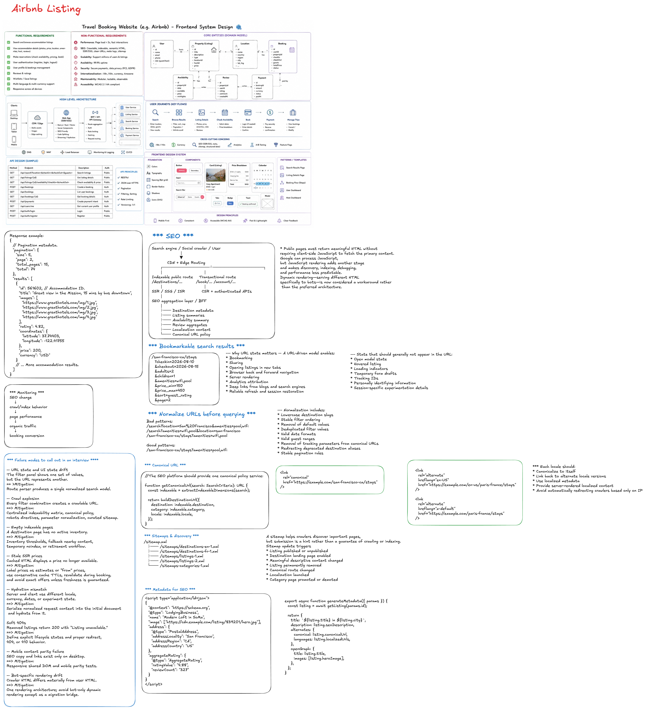

# Frontend System Design Interview: Travel Booking (Staff Engineer)

Use this as your talk track for a frontend system design interview focused on an Airbnb-like booking flow.

At staff level, highlight product correctness, trust, performance, and rollout strategy, not just UI components.

## 1. Clarify Scope and Constraints First

- Platform: web only vs web + mobile web parity.
- Flow in scope:
  - search
  - listing details
  - availability calendar
  - price breakdown
  - checkout/payment confirmation
- User types: guest only vs host + guest surfaces.
- Region/currency/localization requirements.
- SEO requirements for search and listing pages.

### Good opener to say

"I will optimize for fast discovery, correct availability and pricing, resilient checkout, and clear trust signals throughout the booking funnel."

## 2. Define North-Star Metrics

- Product:
  - search-to-detail CTR
  - detail-to-book conversion
  - checkout completion rate
  - cancellation and support-contact rates
- Technical:
  - LCP on search/listing pages
  - INP on filter/calendar interactions
  - checkout error rate
  - stale availability conflict rate

## 3. Core User Journey to Decompose

- User searches by destination + dates + guests.
- User browses result grid + map.
- User opens listing detail page.
- User selects dates and guests.
- User confirms final price + fees.
- User submits booking and receives confirmation.

Focus your architecture around this funnel.

## 4. Frontend Architecture You Should Describe

- App shell and routing.
- Page modules:
  - Search results page
  - Listing detail page
  - Checkout page
  - Confirmation page
- Shared domain modules:
  - Search/filter state
  - Availability/calendar state
  - Pricing quote state
  - Auth/session state
- Data access layer:
  - API client with retries and cancellation
  - request dedupe
  - caching and stale invalidation rules

## 5. Critical Domain Models to Call Out

- Listing: id, location, media, amenities, rating, host metadata.
- Availability: listingId, date ranges, blocked dates, min/max stay.
- Quote: base price, nightly rates, cleaning fee, service fee, taxes, currency.
- Booking intent: listingId, dates, guests, payment token, idempotency key.

## 6. Search + Filter Experience

- Debounced query/filter updates.
- URL-driven state for shareable and back/forward-safe search.
- Server-side filtering for correctness at scale.
- Client-side rendering optimizations:
  - result list virtualization/windowing when needed
  - skeleton loading and progressive hydration

## 7. Map + Listing Synchronization (High-value point)

- Keep map viewport and result list in one source of truth.
- Hover/select sync both directions (list and map marker).
- Cluster markers for dense areas.
- Prevent excessive map-driven requests (throttle viewport updates).

## 8. Availability Calendar (Correctness focus)

- Fetch availability windows efficiently.
- Handle timezone boundaries explicitly.
- Enforce booking rules in UI:
  - min stay
  - max stay
  - check-in/check-out constraints
- Revalidate availability during checkout to avoid stale-booking conflicts.

## 9. Pricing and Quote Consistency

- Show estimated quote early, final quote before payment.
- Separate display price from authoritative checkout price.
- Handle coupon/promo and currency conversion consistently.
- Always include a final server-validated quote step.

## 10. Checkout Resilience

- Multi-step form with autosave of draft inputs.
- Idempotent booking submission to avoid duplicate bookings.
- Retry-safe UX for network interruptions.
- Clear states: submitting, success, pending, failed.
- Recovery path: "resume checkout" after refresh/crash.

## 11. Staff-Level Tradeoffs to Discuss

- SSR/SSG for SEO vs CSR flexibility for rich interactions.
- Aggressive caching vs stale availability/pricing risk.
- Heavy client filtering vs server authority and consistency.
- Rich animation UX vs lower-end device responsiveness.
- Monolithic page state vs domain-segmented state modules.

## 12. Performance Strategy

- Code split by route and heavy modules (map, calendar, checkout SDKs).
- Lazy-load below-the-fold media.
- Responsive images and CDN transformations.
- Preload critical booking assets on intent signals.
- Use RUM to monitor funnel-specific performance bottlenecks.

## 13. Accessibility and Trust Signals

- Keyboard-navigable filters/calendar.
- ARIA labels for date cells, pricing rows, and form validation.
- Readable fee transparency and cancellation policy.
- Error messages that are actionable and localized.

## 14. Reliability and Failure Handling

- Partial rendering if non-critical APIs fail.
- Graceful fallback when map or 3rd-party payment scripts fail.
- Robust error boundaries by page section.
- Booking conflict handling with user-friendly re-selection flow.

## 15. Security and Compliance Points

- Input sanitization and output escaping.
- Secure handling of payment tokens (never raw PAN in frontend).
- CSRF/session protections.
- PII minimization and privacy controls.

## 16. Observability and Experimentation

- Funnel events:
  - search_submitted
  - listing_viewed
  - calendar_selected
  - checkout_started
  - booking_submitted
  - booking_confirmed
- Technical telemetry:
  - API latency by step
  - quote mismatch events
  - payment step failure reasons
- Feature flags for progressive rollout.

## 17. 45-60 Minute Interview Delivery Plan

- 0-5 min: scope, assumptions, success metrics.
- 5-15 min: architecture and data contracts.
- 15-30 min: search/map/listing details/calendar.
- 30-40 min: pricing + checkout correctness/resilience.
- 40-50 min: tradeoffs, performance, reliability.
- 50-60 min: edge cases, rollout, monitoring.

## 18. High-Impact Points to Emphasize (Staff Signal)

- Correctness over cosmetic speed at booking-confirmation boundary.
- Explicit stale-data mitigation for availability and quote.
- Idempotent submit and retry-safe UX in checkout.
- Cross-team design: frontend, pricing, inventory, payments, trust.
- Incremental rollout with measurable guardrails.

## 19. Common Follow-up Questions

- How do you prevent double booking from stale client state?
- How do you keep map + list + filters in sync without jank?
- What do you cache, and what must always be server-authoritative?
- How do you recover checkout state after a failed payment step?
- How would this design change for low-connectivity mobile web?
