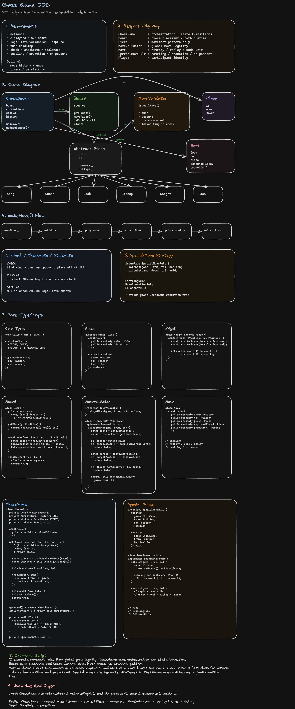
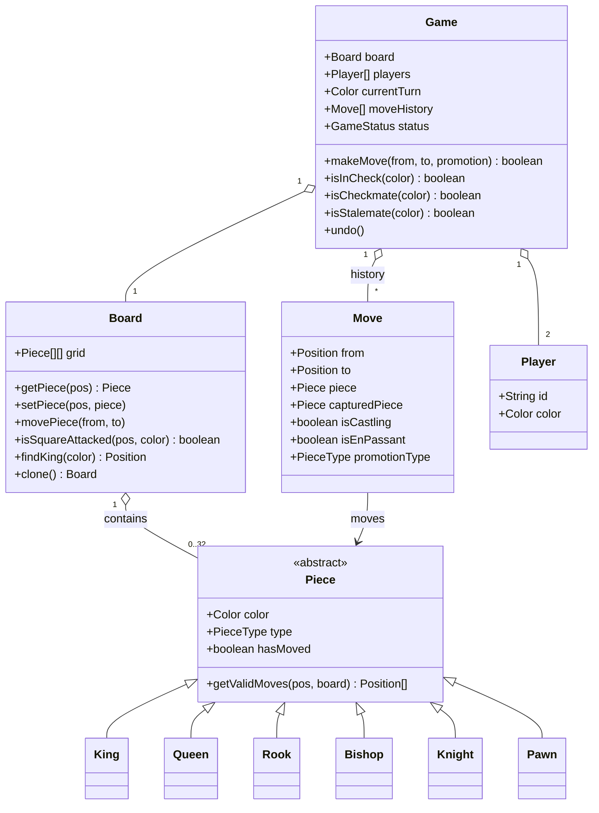
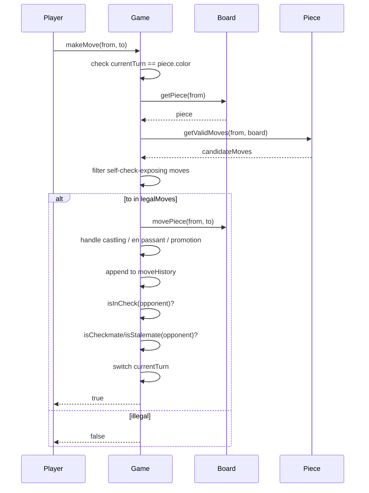
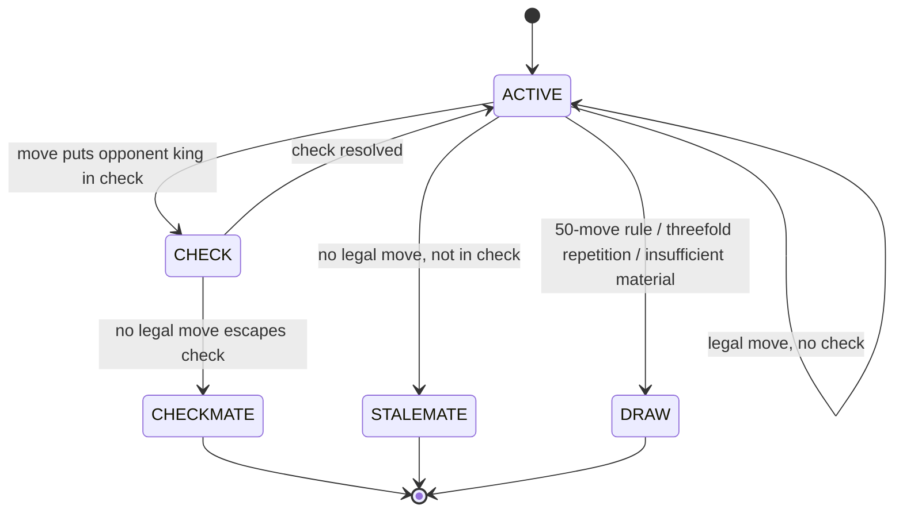

# Chess Board System — Low Level Design

## Problem Statement

Design a low-level system for a chess game that models the board, pieces, and players, enforces move legality (including special moves like castling, en passant, and promotion), and detects check, checkmate, stalemate, and draw conditions.

## Diagram



---

## Requirements

### Functional

- Board is initialized with the standard 8x8 starting position
- Players alternate turns; only the player whose turn it is may move
- Each piece type moves according to its own rules (pawn, knight, bishop, rook, queen, king)
- Illegal moves are rejected, including moves that leave the mover's own king in check
- Special moves are supported: castling (king/queenside), en passant, and pawn promotion
- Game detects check, checkmate, stalemate, and draw (insufficient material, 50-move rule, threefold repetition)
- Move history is tracked and can be replayed

### Non-Functional

- Correctness: move validation must never allow an illegal or self-check-exposing move
- Extensible: new piece types or variants (e.g. Chess960) should be addable without rewriting the board
- Testable: move-generation logic isolated from I/O so it can be unit tested against known FEN positions

---

## Core Entities

### Enums

```ts
enum Color {
  WHITE,
  BLACK,
}
enum PieceType {
  KING,
  QUEEN,
  ROOK,
  BISHOP,
  KNIGHT,
  PAWN,
}
enum GameStatus {
  ACTIVE,
  CHECK,
  CHECKMATE,
  STALEMATE,
  DRAW,
}
```

### Position

```ts
class Position {
  row: number; // 0-7
  col: number; // 0-7

  isValid(): boolean;
  equals(other: Position): boolean;
}
```

### Piece (abstract)

```ts
abstract class Piece {
  color: Color;
  type: PieceType;
  hasMoved: boolean;

  abstract getValidMoves(pos: Position, board: Board): Position[];
}

class King extends Piece {}
class Queen extends Piece {}
class Rook extends Piece {}
class Bishop extends Piece {}
class Knight extends Piece {}
class Pawn extends Piece {}
```

### Board

```ts
class Board {
  grid: (Piece | null)[][]; // 8x8

  getPiece(pos: Position): Piece | null;
  setPiece(pos: Position, piece: Piece | null): void;
  movePiece(from: Position, to: Position): void;
  isSquareAttacked(pos: Position, byColor: Color): boolean;
  findKing(color: Color): Position;
  clone(): Board; // for what-if move simulation
}
```

### Move

```ts
class Move {
  from: Position;
  to: Position;
  piece: Piece;
  capturedPiece: Piece | null;
  isCastling: boolean;
  isEnPassant: boolean;
  promotionType: PieceType | null;
}
```

### Player

```ts
class Player {
  id: string;
  color: Color;
}
```

### Game (Controller)

```ts
class Game {
  board: Board;
  players: [Player, Player];
  currentTurn: Color;
  moveHistory: Move[];
  status: GameStatus;

  makeMove(from: Position, to: Position, promotion?: PieceType): boolean;
  isInCheck(color: Color): boolean;
  isCheckmate(color: Color): boolean;
  isStalemate(color: Color): boolean;
  undo(): void;
}
```

### MoveValidator (Strategy)

```ts
interface MoveValidator {
  getValidMoves(pos: Position, board: Board): Position[];
}
```

---

## Move Validation Strategies

### Per-piece move generation

Each `Piece` subclass owns its own raw movement pattern:

```
King:   1 step in any of 8 directions, + castling
Queen:  straight/diagonal, unlimited distance
Rook:   straight, unlimited distance
Bishop: diagonal, unlimited distance
Knight: L-shape (2,1), can jump over pieces
Pawn:   1 forward (2 on first move), diagonal capture, en passant, promotion on last rank
```

### Legality filter

Raw candidate moves are filtered through a "does this expose my own king" check:

```
candidateMoves = piece.getValidMoves(pos, board)
legalMoves = candidateMoves.filter(move => {
  simulatedBoard = board.clone()
  simulatedBoard.movePiece(pos, move)
  return !simulatedBoard.isSquareAttacked(
    simulatedBoard.findKing(piece.color), opponentColor
  )
})
```

This two-phase split (raw pattern → self-check filter) keeps each piece class simple and centralizes check-safety in one place.

---

## Class Diagram



---

## Move Flow



---

## State Machine — Game



---

## Edge Cases & Discussion Points

| Scenario                                 | Handling                                                            |
| ---------------------------------------- | ------------------------------------------------------------------- |
| Move exposes own king to check           | Filtered out during legality check, never applied to the board      |
| Castling through/into check              | Reject if king's start, path, or destination square is attacked     |
| En passant                               | Only legal immediately after opponent's 2-square pawn push          |
| Pawn reaches last rank                   | Require `promotionType`; default to Queen if unspecified by UI      |
| King captured                            | Never allowed — game ends at checkmate before capture is possible   |
| Threefold repetition                     | Track board-state hashes per move; offer/declare draw on 3rd match  |
| 50-move rule                             | Reset counter on pawn move or capture; draw at 50 moves without one |
| Insufficient material (K vs K, K+B vs K) | Auto-declare draw when no side can force checkmate                  |

---

## Trade-offs

| Decision             | Option A                               | Option B                              |
| -------------------- | -------------------------------------- | ------------------------------------- |
| Board representation | 2D array of `Piece` objects            | Bitboards (64-bit int per piece type) |
| Move validation      | Per-piece polymorphic methods          | Single `MoveValidator` with switch    |
| Check detection      | Clone board + simulate each move       | Incrementally track attacked squares  |
| Piece modeling       | Class hierarchy (`King extends Piece`) | Single `Piece` class + type enum      |

**Recommended:** 2D array + polymorphic pieces for interview clarity and readability; bitboards only if performance (engine-speed move generation) is explicitly required.

---

## Follow-up Questions

- How would you support undo/redo and full game replay from move history?
- How would you add a chess clock (per-player time control, increment)?
- How would you serialize/deserialize a game using FEN or PGN notation?
- How would you extend this to support a chess engine (AI opponent) via the same `MoveValidator` interface?
- How would you support online multiplayer with move synchronization and reconnection?
