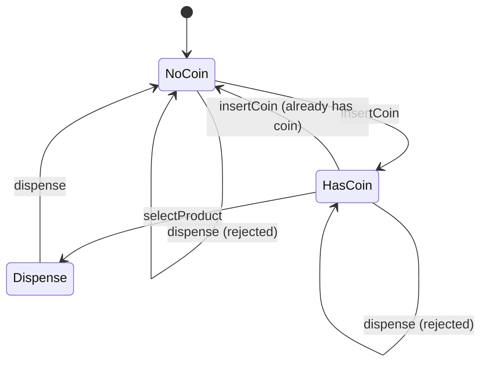

## Creational Patterns

Creational patterns control how objects get created. They hide construction details, let you swap implementations, and keep your code from being tightly coupled to specific classes.

### Factory Method

A factory is a helper that makes the right kind of object for you so you don't have to decide which one to create. They're used to hide creation logic and keep your code flexible when the exact type you need can change.

Factories are polarizing. While very popular and idiomatic in languages like Java, some engineers see them as examples of overengineering. If you choose to implement one, take a look at your interviewer and check them for a grimace.

Factory shows up regularly in interviews, usually when requirements say "support different notification types" or "handle multiple payment methods." Instead of writing `new EmailNotification()` throughout your code, you call `notificationFactory.create(type)`. Now when you add SMS notifications, you update the factory. The rest of your code never changes.

```ts
interface Notification {
  send(message: string): void;
}

class EmailNotification implements Notification {
  send(message: string): void {
    // Email sending logic
  }
}

class SMSNotification implements Notification {
  send(message: string): void {
    // SMS sending logic
  }
}

class NotificationFactory {
  static create(type: string): Notification {
    if (type === 'email') {
      return new EmailNotification();
    } else if (type === 'sms') {
      return new SMSNotification();
    }
    throw new Error('Unknown type');
  }
}

// Usage
const notif = NotificationFactory.create('email');
notif.send('Hello');
```

The factory centralizes creation logic. When you add push notifications, you modify one place. Factory controls which object gets instantiated — it makes the decision once and returns the right type.

> This is technically called **Simple Factory**, not the Gang of Four Factory Method pattern. The GoF version uses abstract factory classes with subclasses that override a factory method. It's more complex and rarely shows up in real code or interviews. What we're showing here is what people actually build and what interviewers expect when they say "use a factory."

---

### Builder

A builder is a helper that lets you create a complex object step by step without worrying about the order or messy construction details. It's used when an object has many optional parts or configuration choices.

This shows up when designing things like HTTP requests, database queries, or configuration objects. Instead of a constructor with ten parameters where half are null, you build the object incrementally.

```ts
// NOTE: In TypeScript, object literals with optional properties are often
// simpler than the Builder pattern. Consider using a configuration object
// with Partial<T> types instead for most cases.

class HttpRequest {
  private url?: string;
  private method?: string;
  private headers: Map<string, string> = new Map();
  private body?: string;

  private constructor() {}

  static Builder = class {
    private request = new HttpRequest();

    url(url: string): this {
      this.request.url = url;
      return this;
    }

    method(method: string): this {
      this.request.method = method;
      return this;
    }

    header(key: string, value: string): this {
      this.request.headers.set(key, value);
      return this;
    }

    body(body: string): this {
      this.request.body = body;
      return this;
    }

    build(): HttpRequest {
      if (!this.request.url) {
        throw new Error('URL is required');
      }
      return this.request;
    }
  };
}

// Usage
const request = new HttpRequest.Builder()
  .url('https://api.example.com')
  .method('POST')
  .header('Content-Type', 'application/json')
  .body('{"key": "value"}')
  .build();
```

Builder makes construction readable and handles optional fields cleanly. It most commonly shows up in LLD interviews when you're designing API clients or complex configurations, but is very rarely used in other contexts.

If the interviewer didn't describe a complex object with lots of optional details, Builder probably isn't needed. Most interview problems involve simple domain objects with 2–4 required fields where a normal constructor works fine.

---

### Singleton

Singleton ensures only one instance of a class exists. Use it when you need exactly one shared resource like a configuration manager, connection pool, or logger.

Most of the time you don't actually need a Singleton. You can just pass shared objects through constructors instead — it's clearer and easier to test. Singletons hide dependencies and make testing harder.

```ts
// NOTE: In modern TypeScript/JavaScript, ES modules are singletons by default.
// For shared resources, prefer exporting a single instance from a module
// rather than using this pattern (e.g., export const db = new DatabaseConnection()).

class DatabaseConnection {
  private static instance: DatabaseConnection;

  private constructor() {
    // Private constructor prevents external instantiation
  }

  static getInstance(): DatabaseConnection {
    if (!DatabaseConnection.instance) {
      DatabaseConnection.instance = new DatabaseConnection();
    }
    return DatabaseConnection.instance;
  }

  query(sql: string): void {
    // Database operations
  }
}

// Usage
const db = DatabaseConnection.getInstance();
db.query('SELECT * FROM users');
```

In TypeScript, the static `getInstance` method ensures only one instance is created. Alternatively, you could export a single instance from a module, which achieves the same effect more idiomatically.

In interviews, know what Singleton is and **when not to use it**. If an interviewer asks "should this be a Singleton?", the answer is usually no unless they explicitly want a single shared instance across the entire system.

---

## Structural Patterns

Structural patterns deal with how objects connect to each other. They help you build flexible relationships between classes without creating tight coupling or messy dependencies.

### Decorator

A decorator adds behavior to an object without changing its class. Use it when you need to layer on extra functionality at runtime.

Decorator is powerful but comes up less often than Strategy or Observer. You might need this when the requirements say things like "add logging to specific operations" or "encrypt certain messages." Instead of creating subclasses for every combination (`LoggedEmailNotification`, `EncryptedEmailNotification`, `LoggedEncryptedEmailNotification`), you wrap the base object with decorators. If you see words like "optional features," "stack behaviors," or "combine multiple enhancements," think Decorator.

```ts
interface DataSource {
  writeData(data: string): void;
  readData(): string;
}

class FileDataSource implements DataSource {
  private filename: string;

  constructor(filename: string) {
    this.filename = filename;
  }

  writeData(data: string): void {
    // Write to file
  }

  readData(): string {
    return 'data from file';
  }
}

class EncryptionDecorator implements DataSource {
  private wrapped: DataSource;

  constructor(source: DataSource) {
    this.wrapped = source;
  }

  writeData(data: string): void {
    const encrypted = this.encrypt(data);
    this.wrapped.writeData(encrypted); // Delegate to wrapped object
  }

  readData(): string {
    const data = this.wrapped.readData();
    return this.decrypt(data);
  }

  private encrypt(data: string): string {
    return `encrypted:${data}`;
  }

  private decrypt(data: string): string {
    return data.replace('encrypted:', '');
  }
}

class CompressionDecorator implements DataSource {
  private wrapped: DataSource;

  constructor(source: DataSource) {
    this.wrapped = source;
  }

  writeData(data: string): void {
    const compressed = this.compress(data);
    this.wrapped.writeData(compressed); // Delegate to wrapped object
  }

  readData(): string {
    const data = this.wrapped.readData();
    return this.decompress(data);
  }

  private compress(data: string): string {
    return `compressed:${data}`;
  }

  private decompress(data: string): string {
    return data.replace('compressed:', '');
  }
}

// Usage
let source: DataSource = new FileDataSource('data.txt');
source = new EncryptionDecorator(source);
source = new CompressionDecorator(source);
source.writeData('sensitive info');
// Data gets compressed, then encrypted, then written to file
```

Use a Decorator when you need to add behavior at runtime based on conditions, like wrapping a service with logging only in debug mode or adding caching only for certain requests. It lets you layer optional, combinable features without modifying the underlying class.

Each decorator adds one piece of functionality. You can stack them in any order and add or remove them without touching the base class or other decorators, though in real systems order often affects behavior.

---

### Facade

A facade is just a coordinator class that hides complexity. You're probably already building facades in every LLD interview without calling them that. Your `Game` class in Tic Tac Toe? That's a facade. Any orchestrator that coordinates multiple components behind a clean interface? Also a facade.

Almost nobody names this pattern when they're using it. The pattern name is more useful when you're wrapping existing messy code. In LLD interviews, you're designing clean orchestrators from scratch, which happens to be the same structure. You're likely already doing the right thing instinctively — you just don't need to announce it.

```ts
enum GameState {
  IN_PROGRESS,
  WON,
  DRAW,
}

class Board {
  placeMark(row: number, col: number, mark: string): boolean {
    return true;
  }

  checkWin(row: number, col: number): boolean {
    return false;
  }

  isFull(): boolean {
    return false;
  }
}

class Player {
  private mark: string;

  constructor(mark: string) {
    this.mark = mark;
  }

  getMark(): string {
    return this.mark;
  }
}

class Game {
  private board: Board;
  private playerX: Player;
  private playerO: Player;
  private currentPlayer: Player;
  private state: GameState;

  constructor() {
    this.board = new Board();
    this.playerX = new Player('X');
    this.playerO = new Player('O');
    this.currentPlayer = this.playerX;
    this.state = GameState.IN_PROGRESS;
  }

  makeMove(row: number, col: number): boolean {
    if (this.state !== GameState.IN_PROGRESS) return false;
    if (!this.board.placeMark(row, col, this.currentPlayer.getMark())) return false;

    if (this.board.checkWin(row, col)) {
      this.state = GameState.WON;
    } else if (this.board.isFull()) {
      this.state = GameState.DRAW;
    } else {
      this.currentPlayer = this.currentPlayer === this.playerX ? this.playerO : this.playerX;
    }
    return true;
  }
}

// Usage — simple interface hides all the coordination
const game = new Game();
game.makeMove(0, 0);
game.makeMove(1, 1);
```

The pattern name just describes what good orchestrator design looks like. Build it naturally, name it if it helps communicate, but don't worry if you never mention Facade by name in an interview.

---

## Behavioral Patterns

Behavioral patterns control how objects interact and distribute responsibilities. They're about the flow of control and communication between objects.

### Strategy

Strategy replaces conditional logic with polymorphism. Use it when you have different ways of doing the same thing and you want to swap them at runtime.

When we say "runtime," we mean the moment the program is actually running — you can choose behaviors based on conditions, inputs, or configuration as the code executes. When we say "compile time," we mean decisions baked into the code itself. The behavior is fixed in the class definition and doesn't change while the program runs.

Interviewers love Strategy. It's the single most common pattern in LLD interviews because it directly tests whether you understand polymorphism and composition over inheritance. When you see a pile of `if/else` or `switch` statements based on type, that's a strategy pattern waiting to happen. **If you learn one pattern from this page, make it this one.**

```ts
interface PaymentStrategy {
  pay(amount: number): boolean;
}

class CreditCardPayment implements PaymentStrategy {
  private cardNumber: string;

  constructor(cardNumber: string) {
    this.cardNumber = cardNumber;
  }

  pay(amount: number): boolean {
    console.log(`Paid ${amount} with credit card`);
    return true;
  }
}

class PayPalPayment implements PaymentStrategy {
  private email: string;

  constructor(email: string) {
    this.email = email;
  }

  pay(amount: number): boolean {
    console.log(`Paid ${amount} with PayPal`);
    return true;
  }
}

class ShoppingCart {
  private paymentStrategy?: PaymentStrategy;

  setPaymentStrategy(strategy: PaymentStrategy): void {
    this.paymentStrategy = strategy;
  }

  checkout(amount: number): void {
    this.paymentStrategy!.pay(amount);
  }
}

// Usage
const cart = new ShoppingCart();

cart.setPaymentStrategy(new CreditCardPayment('1234-5678'));
cart.checkout(100.0);

cart.setPaymentStrategy(new PayPalPayment('user@example.com'));
cart.checkout(50.0);
```

Instead of having checkout logic full of `if (paymentType == "credit")` statements, each payment method handles itself. This is just polymorphism with a pattern name. Strategy swaps behavior at runtime through composition — the cart holds a reference to a strategy and delegates to it.

> **Strategy vs Factory:** Factory decides which type to instantiate. Strategy decides which behavior to use after the object already exists.

---

### Observer

Observer lets objects subscribe to events and get notified when something happens. Use it when changes in one object need to trigger updates in other objects.

Observer is a top-tier interview pattern. It shows up when you're designing systems where multiple components care about state changes — a stock price changes and multiple displays need to update, or a user places an order and inventory, notifications, and analytics all need to know. If the problem involves the words "notify" or "update multiple components," you're probably looking at Observer.

```ts
interface Observer {
  update(symbol: string, price: number): void;
}

interface Subject {
  attach(observer: Observer): void;
  detach(observer: Observer): void;
  notifyObservers(): void;
}

class Stock implements Subject {
  private observers: Observer[] = [];
  private symbol: string;
  private price: number = 0;

  constructor(symbol: string) {
    this.symbol = symbol;
  }

  attach(observer: Observer): void {
    this.observers.push(observer);
  }

  detach(observer: Observer): void {
    const index = this.observers.indexOf(observer);
    if (index > -1) {
      this.observers.splice(index, 1);
    }
  }

  setPrice(price: number): void {
    this.price = price;
    this.notifyObservers(); // Price changed, tell everyone
  }

  notifyObservers(): void {
    for (const observer of this.observers) {
      observer.update(this.symbol, this.price);
    }
  }
}

class PriceDisplay implements Observer {
  update(symbol: string, price: number): void {
    console.log(`Display updated: ${symbol} = $${price}`);
  }
}

class PriceAlert implements Observer {
  private threshold: number;

  constructor(threshold: number) {
    this.threshold = threshold;
  }

  update(symbol: string, price: number): void {
    if (price > this.threshold) {
      console.log(`Alert! ${symbol} exceeded $${this.threshold}`);
    }
  }
}

// Usage
const stock = new Stock('AAPL');
const display = new PriceDisplay();
const alert = new PriceAlert(150.0);

stock.attach(display);
stock.attach(alert);

stock.setPrice(145.0); // Both observers get notified
stock.setPrice(155.0); // Both observers get notified
```

When the stock price changes, every attached observer gets updated automatically. No need for the stock to know what the observers do with the information.

---

### State Machine

A state machine handles state transitions cleanly. Use it when an object's behavior changes based on its internal state and you have complex state transition rules. You'll also see this called the "State pattern" in some references, but state machine is the more common term.

State machines are less common than Strategy or Observer, but when you need one, it's usually the centerpiece of your entire design. This shows up in LLD interviews when you're designing things like vending machines, document workflows, or game states. If the word "state" appears multiple times in the requirements, you're probably looking at a state machine. Instead of scattered conditionals checking current state everywhere, you encapsulate each state's behavior in its own class.

Drawing a state diagram is one of the best ways to communicate a state machine design in an interview. Show the states as circles, transitions as arrows labeled with actions, and it becomes immediately clear how the system works.



```ts
interface VendingMachineState {
  insertCoin(machine: VendingMachine): void;
  selectProduct(machine: VendingMachine): void;
  dispense(machine: VendingMachine): void;
}

class NoCoinState implements VendingMachineState {
  insertCoin(machine: VendingMachine): void {
    console.log('Coin inserted');
    machine.setState(new HasCoinState());
  }

  selectProduct(machine: VendingMachine): void {
    console.log('Insert coin first');
  }

  dispense(machine: VendingMachine): void {
    console.log('Insert coin first');
  }
}

class HasCoinState implements VendingMachineState {
  insertCoin(machine: VendingMachine): void {
    console.log('Coin already inserted');
  }

  selectProduct(machine: VendingMachine): void {
    console.log('Product selected');
    machine.setState(new DispenseState());
  }

  dispense(machine: VendingMachine): void {
    console.log('Select product first');
  }
}

class DispenseState implements VendingMachineState {
  insertCoin(machine: VendingMachine): void {
    console.log('Please wait, dispensing');
  }

  selectProduct(machine: VendingMachine): void {
    console.log('Please wait, dispensing');
  }

  dispense(machine: VendingMachine): void {
    console.log('Dispensing product');
    machine.setState(new NoCoinState());
  }
}

class VendingMachine {
  private currentState: VendingMachineState;

  constructor() {
    this.currentState = new NoCoinState();
  }

  insertCoin(): void {
    this.currentState.insertCoin(this);
  }

  selectProduct(): void {
    this.currentState.selectProduct(this);
  }

  dispense(): void {
    this.currentState.dispense(this);
  }

  setState(state: VendingMachineState): void {
    this.currentState = state;
  }
}

// Usage
const machine = new VendingMachine();

machine.selectProduct(); // "Insert coin first"
machine.insertCoin(); // "Coin inserted"
machine.selectProduct(); // "Product selected"
machine.dispense(); // "Dispensing product"
```

Each state knows which state comes next and what actions are valid. No giant switch statements checking current state in every method.

---

## Wrapping Up

Patterns only help when they match the problem you're solving. Most interview-ready designs use no patterns, or at most one or two. If you're reaching for three or more, you're probably forcing it and over-engineering.

### Quick Reference

| Category       | Pattern       | When to use                                                          |
| -------------- | ------------- | -------------------------------------------------------------------- |
| **Creational** | Factory       | Callers shouldn't care which concrete class gets created             |
| **Creational** | Builder       | Object has lots of optional fields or messy construction details     |
| **Creational** | Singleton     | Truly need one global instance (rare in interviews)                  |
| **Structural** | Decorator     | Layer optional behaviors at runtime without subclass explosion       |
| **Structural** | Facade        | Hide internal complexity behind a simple entry point                 |
| **Behavioral** | Strategy      | Replace if/else logic with interchangeable behaviors                 |
| **Behavioral** | Observer      | Multiple components need to react to a single event                  |
| **Behavioral** | State Machine | Object's behavior depends on current state and transitions get messy |

Focus on solving the problem cleanly and name the pattern afterward if it fits.
