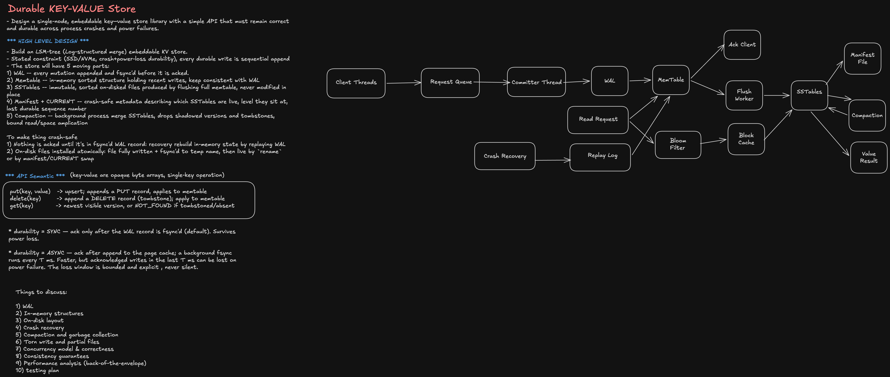

# Durable Key-Value Store

## 0. Interview framing

> **Goal:** design an embeddable `get / put / delete` key-value store optimized for SSD/NVMe with strong crash and power-loss durability.

The key architectural choice is an **LSM-tree**:

```text
write
  ↓
WAL append + fdatasync
  ↓
mutable memtable
  ↓
immutable memtable
  ↓
flush
  ↓
L0 SSTables
  ↓
leveled compaction
  ↓
L1 ... Ln SSTables
```

Why LSM here:

- Durable writes are sequential appends.
- Recent data is served from memory.
- Disk files are immutable and easy to recover safely.
- Compaction moves random update cost out of the foreground write path.
- Bloom filters + block indexes keep point reads efficient.

---

# 1. Requirements

## Functional

```ts
interface KVStore {
  put(key: Uint8Array, value: Uint8Array, durability?: 'SYNC' | 'ASYNC'): Promise<void>;
  get(key: Uint8Array): Promise<Uint8Array | null>;
  delete(key: Uint8Array, durability?: 'SYNC' | 'ASYNC'): Promise<void>;
}
```

Semantics:

```text
put(k, v)     = upsert
delete(k)     = append tombstone
get(k)        = newest visible PUT unless newest visible record is DELETE
```

Out of scope:

```text
- multi-key transactions
- distributed consensus
- range scans
- secondary indexes
```

## Non-functional

```text
Durability:
  SYNC writes acknowledged only after WAL fsync.

Crash safety:
  restart must recover all acknowledged writes.

Power-loss safety:
  no half-installed SSTables or metadata versions.

Concurrency:
  high write throughput, lock-free reads.

Performance:
  point reads optimized by block cache + Bloom filters.

Storage:
  bounded read amplification, write amplification, and space amplification.
```

---

# 2. Reference architecture

```text
                 ┌───────────────────────────────┐
                 │           KV API              │
                 │ put / delete / get            │
                 └───────────────┬───────────────┘
                                 │
             writes              │               reads
                │                │                  │
                ▼                │                  ▼
      ┌──────────────────┐       │        ┌─────────────────┐
      │ MPSC Write Queue │       │        │ stable_seq snap │
      └────────┬─────────┘       │        └────────┬────────┘
               ▼                 │                 ▼
      ┌──────────────────┐       │        ┌─────────────────┐
      │ Group Committer  │       │        │ Mutable Memtable│
      │ seqno assignment │       │        └────────┬────────┘
      └──────┬─────┬─────┘       │                 ▼
             │     │             │        ┌─────────────────┐
             │     └─────────────┼───────▶│ Immutable Mems  │
             │                   │        └────────┬────────┘
             ▼                   │                 ▼
      ┌──────────────────┐       │        ┌─────────────────┐
      │ WAL append       │       │        │ Block Cache     │
      │ + fdatasync      │       │        └────────┬────────┘
      └────────┬─────────┘       │                 ▼
               │ durable          │        ┌─────────────────┐
               ▼                 │        │ SSTables L0..Ln │
      ┌──────────────────┐       │        │ Bloom + index   │
      │ Memtable apply   │◀──────┘        └────────┬────────┘
      └────────┬─────────┘                          │
               ▼                                    │
      ┌──────────────────┐                          │
      │ publish stable   │                          │
      │ sequence number  │                          │
      └──────────────────┘                          │
                                                   ▼
                                        ┌─────────────────────┐
                                        │ Background          │
                                        │ compaction          │
                                        └──────────┬──────────┘
                                                   ▼
                                        ┌─────────────────────┐
                                        │ MANIFEST + CURRENT  │
                                        │ live version set    │
                                        └─────────────────────┘
```

---

# 3. Five core components

## 3.1 WAL

The **Write-Ahead Log is the source of durability**.

Invariant:

```text
ACK(write) ⇒ WAL record has passed the requested durability barrier
```

For `SYNC`:

```text
append WAL
→ fdatasync
→ apply to memtable
→ publish stable_seq
→ ACK client
```

For `ASYNC`:

```text
append WAL
→ apply to memtable
→ ACK client
→ background fsync every T ms
```

Trade-off:

```text
SYNC:
  survives power failure
  higher latency

ASYNC:
  lower latency
  acknowledged writes within last T ms can be lost after power loss
```

---

## 3.2 Memtable

Use a sorted in-memory structure, typically a concurrent skiplist.

Internal key:

```text
(user_key, seqno DESC)
```

Example:

```text
apple @ 105 = PUT("red")
apple @ 101 = DELETE
apple @  97 = PUT("green")
```

A reader at snapshot `S = 103` sees:

```text
apple @ 101 = DELETE
→ NOT_FOUND
```

This gives simple MVCC visibility.

---

## 3.3 SSTables

Immutable sorted disk files.

```text
[data block]
[data block]
...
[filter block]
[index block]
[meta-index]
[footer]
```

Typical block size:

```text
16–32 KiB
```

Each block has:

```text
CRC32C
```

Point lookup:

```text
Bloom filter says "definitely absent"
    → skip file

Bloom says "maybe"
    → binary search index block
    → read one data block
    → verify CRC
    → search internal keys
```

---

## 3.4 Manifest + CURRENT

The manifest defines the **one authoritative live version**.

```text
CURRENT
  └── MANIFEST-000042

MANIFEST edit examples:
  + add SSTable 31 to L0
  + delete SSTable 24 from L0
  + add SSTable 40 to L1
  + set last_seqno = 102931
  + set wal_checkpoint = 100000
```

Rule:

```text
A disk file is live iff referenced by the current version.
```

Everything else is garbage.

---

## 3.5 Compaction

Compaction:

```text
- merges sorted files
- removes overwritten versions
- reclaims tombstones safely
- keeps read amplification bounded
- keeps space amplification bounded
```

Default policy: **leveled compaction**.

```text
L0: overlapping key ranges
L1: non-overlapping
L2: non-overlapping
...
each level ≈ 10× previous level
```

---

# 4. Write path

## SYNC write

```text
Client
  │
  │ put(k,v)
  ▼
Write Queue
  │
  ▼
Committer assigns seqno = 1001
  │
  ▼
WAL append
  │
  ▼
fdatasync()
  │
  ├── crash after here? WAL replay restores write
  ▼
Memtable apply
  │
  ▼
stable_seq = 1001
  │
  ▼
ACK
```

Pseudocode:

```python
def commit_batch(batch):
    for req in batch:
        req.seqno = next_seqno()
        wal.append(encode(req))

    wal.fdatasync()

    for req in batch:
        memtable.apply(req)

    atomic_store(stable_seq, batch[-1].seqno)

    for req in batch:
        req.ack()
```

---

# 5. Group commit

This is the main throughput optimization.

Instead of:

```text
write 1 → fsync
write 2 → fsync
write 3 → fsync
...
```

do:

```text
[w1 w2 w3 ... wN]
      ↓
one WAL append batch
      ↓
one fdatasync
      ↓
ACK all writes in batch
```

Example batching policy:

```python
batch = queue.drain(
    max_bytes = 512 * KiB,
    max_wait  = 1 * ms
)
```

Trade-off:

```text
larger batch window:
  + higher throughput
  - higher latency

smaller batch window:
  + lower latency
  - more fsyncs
```

Staff-level interview point:

> The single committer is not necessarily the scalability bottleneck. The real foreground bottleneck is usually the durability barrier, so group commit often gives excellent throughput with much simpler correctness than fully concurrent WAL writers.

---

# 6. WAL record format

```text
┌──────────┬───────┬───────┬──────┬─────────┬─────────┬─────┬───────┐
│ length   │ crc   │ seqno │ type │ key_len │ val_len │ key │ value │
│ 4 bytes  │ 4 B   │ 8 B   │ 1 B  │ varint  │ varint  │ ... │ ...   │
└──────────┴───────┴───────┴──────┴─────────┴─────────┴─────┴───────┘
```

CRC covers:

```text
seqno ... value
```

Purpose:

```text
detect:
- torn tail writes
- partial records
- corruption
```

---

# 7. WAL segmentation

Directory:

```text
db/
├── CURRENT
├── MANIFEST-000042
├── wal/
│   ├── 000016.log
│   └── 000017.log
└── sst/
    ├── 000030.sst
    └── 000031.sst
```

Rotate WAL when:

```text
- segment reaches 64–256 MiB
- corresponding memtable has been flushed
```

A WAL segment can be deleted only when:

```text
all records in it are represented by durable live SSTables
AND
manifest checkpoint has advanced past the segment
```

---

# 8. Memtable lifecycle

```text
Mutable Memtable
      │
      │ reaches size threshold
      ▼
Freeze
      │
      ├── new mutable memtable immediately starts accepting writes
      ▼
Immutable Memtable
      │
      ▼
Background flush
      │
      ▼
SSTable.tmp
      │
      ▼
fsync file
      │
      ▼
rename → .sst
      │
      ▼
manifest version edit + fsync
      │
      ▼
advance WAL checkpoint
```

Typical memtable:

```text
64–256 MiB
```

---

# 9. Crash-safe file installation

For any newly generated SSTable:

```text
1. write 000123.sst.tmp
2. fsync(000123.sst.tmp)
3. rename(000123.sst.tmp, 000123.sst)
4. fsync(parent_directory)
5. append manifest version edit
6. fsync(manifest)
7. only now may old input files eventually be deleted
```

Important:

```text
atomic rename ≠ durable rename
```

After power loss, the directory entry may disappear unless the parent directory itself was fsynced.

This is a classic storage-engine durability bug.

---

# 10. Crash recovery

Startup:

```text
1. Read CURRENT
2. Replay MANIFEST
3. Reconstruct live SSTable set
4. Find WAL segments newer than wal_checkpoint
5. Replay valid WAL records in seqno order
6. Stop at truncated / CRC-invalid tail
7. Rebuild memtable
8. Remove orphan *.tmp files
9. Remove unreferenced SSTables
10. Delete obsolete WAL segments
11. publish stable_seq
12. begin serving
```

Pseudocode:

```python
def recover():
    version = replay_manifest(read_current())

    next_seqno = version.last_seqno + 1

    for seg in wal_segments_after(version.wal_checkpoint):
        for record in seg:
            if record.truncated or not record.crc_ok:
                seg.truncate_at(record.offset)
                break

            memtable.apply(record)
            next_seqno = max(next_seqno, record.seqno + 1)

    gc_orphans(version)
    stable_seq.store(next_seqno - 1)
```

---

# 11. Crash matrix

| Crash point                   | State on disk             | Recovery                  |
| ----------------------------- | ------------------------- | ------------------------- |
| WAL append before fsync       | record may disappear      | no SYNC ACK was issued    |
| after fsync before memtable   | durable WAL               | replay rebuilds memtable  |
| mid SST flush                 | temp file only            | delete orphan, replay WAL |
| SST fsynced before manifest   | file exists but not live  | delete orphan             |
| mid compaction                | inputs still live         | discard new outputs       |
| mid manifest append           | torn last edit            | stop at last valid edit   |
| after rename before dir fsync | name may not survive      | directory fsync required  |
| crash after durable manifest  | new version authoritative | recover from new version  |

Core invariant:

```text
Never delete the old durable version before the new durable version is committed.
```

---

# 12. Read path

Reader snapshots:

```python
snapshot = atomic_load(stable_seq)
```

Search order:

```text
1. mutable memtable
2. immutable memtables, newest → oldest
3. L0 SSTables, newest → oldest
4. one candidate SSTable per level L1...Ln
```

Pseudocode:

```python
def get(key):
    snap = atomic_load(stable_seq)

    for source in read_sources_newest_first():
        entry = source.find(key, max_seqno=snap)

        if entry is None:
            continue

        if entry.type == DELETE:
            return None

        return entry.value

    return None
```

---

# 13. Why `stable_seq` matters

Suppose a group commit contains:

```text
seq 100
seq 101
seq 102
```

Bad publication:

```text
apply 100
stable_seq = 100

apply 101
stable_seq = 101

reader starts here

apply 102
stable_seq = 102
```

The reader can observe a partial durability batch.

Better:

```text
fdatasync batch
apply 100
apply 101
apply 102
stable_seq = 102   ← one atomic publication
ACK writers
```

Reader sees either:

```text
before batch
or
whole batch
```

---

# 14. Consistency guarantee

For `SYNC` mode, the target is:

```text
linearizable single-key operations
```

Reasoning:

```text
A write is acknowledged only after:
  1. WAL record is durable
  2. memtable contains the write
  3. stable_seq includes its seqno
```

Therefore:

```text
get() starting after ACK
  snapshots stable_seq >= write.seqno
  ⇒ sees the write or a newer write
```

---

# 15. Compaction

## Leveled compaction

```text
L0
 ├── SST A [a..z]
 ├── SST B [b..m]
 └── SST C [d..x]
       │
       │ compact overlapping files
       ▼
L1
 ├── SST D [a..f]
 ├── SST E [g..p]
 └── SST F [q..z]
```

At L1+:

```text
key ranges do not overlap
```

This means a point lookup generally checks:

```text
multiple files in L0
+
at most one file per lower level
```

---

# 16. Tombstone correctness

A delete is:

```text
k @ seq=200 => TOMBSTONE
```

Do **not** immediately remove the tombstone during compaction.

Why:

```text
L2 contains old PUT(k, "value") @ seq=100
```

If we drop the tombstone before proving all older versions are gone:

```text
get(k)
→ falls through
→ finds old L2 value
→ deleted key resurrects
```

Safe tombstone removal requires:

```text
1. no older version can exist in any lower level
2. no live snapshot requires the older history
```

Use:

```text
min_snapshot_seq
```

to gate version/tombstone deletion.

---

# 17. Background compaction algorithm

```text
pick level L
  ↓
pick candidate SSTable(s)
  ↓
find overlapping files in L+1
  ↓
k-way merge by internal key
  ↓
keep newest version needed by snapshots
  ↓
drop obsolete versions
  ↓
conditionally drop tombstones
  ↓
write output *.tmp
  ↓
fsync outputs
  ↓
rename + dir fsync
  ↓
single manifest edit:
  add outputs
  remove inputs
  ↓
fsync manifest
  ↓
retire old inputs
```

Manifest edit must be atomic from the version-set perspective.

---

# 18. Backpressure

Without write throttling:

```text
write ingest > compaction throughput
          ↓
L0 file count grows
          ↓
read amplification grows
          ↓
p99 get latency explodes
          ↓
eventually disk fills
```

Use thresholds:

```text
L0 > soft_limit
  → slow writes

L0 > hard_limit
  → temporarily stall writes
```

Expose:

```text
- L0 file count
- compaction debt bytes
- pending compaction bytes
- flush queue depth
- write stall duration
```

---

# 19. Torn writes and corruption

## WAL

Detect:

```text
length prefix
+
CRC32C
```

Recovery behavior:

```text
valid record
valid record
valid record
partial record   ← crash
───────────────
truncate here
```

## SSTable block

Every block:

```text
payload + CRC
```

On corruption:

```text
return explicit corruption error
do not silently return wrong value
```

## Optional hardening

```text
- 4 KiB alignment
- checksummed manifests
- duplicate metadata footer
- periodic background scrub
- backup / replication above the embedded engine
```

---

# 20. Lock-based write path

Simple default:

```text
many app threads
      │
      ▼
lock-free MPSC queue
      │
      ▼
single committer thread
```

Benefits:

```text
- total mutation order
- trivial seqno assignment
- easy group commit
- no WAL holes
- simple ACK ordering
```

Pseudo-interface:

```python
def put(k, v):
    future = Future()
    queue.push(Request("PUT", k, v, future))
    return future.wait()
```

---

# 21. Lock-free / optimistic WAL reservation

Possible advanced design:

```python
def reserve(n_bytes):
    while True:
        cur = atomic_load(tail)

        nxt = Cursor(
            seqno = cur.seqno + 1,
            offset = cur.offset + n_bytes
        )

        if cas(tail, cur, nxt):
            return cur
```

Writers:

```text
1. CAS-reserve [seqno, offset]
2. write bytes into reserved region
3. mark reservation complete
4. committer fsyncs contiguous completed prefix
5. advance stable_seq only with no gaps
```

Problem:

```text
writer for seq=100 stalls
writer for seq=101 finishes

cannot publish 101
because stable durable prefix has a hole at 100
```

Trade-off:

```text
+ more CPU parallelism
- CAS contention
- reservation bookkeeping
- stable prefix complexity
- harder recovery reasoning
```

Interview recommendation:

> Start with single committer + group commit. Only introduce concurrent WAL writers if profiling proves the committer itself is CPU-bound.

---

# 22. Safe memory / file reclamation

Compaction may remove an SSTable from the manifest while a reader still has a pointer to it.

Use:

```text
epoch-based reclamation
or
reference counting
```

Example:

```python
guard = epoch.enter()
try:
    result = get_from_version(version)
finally:
    epoch.leave(guard)
```

A retired SSTable can be physically deleted only after:

```text
global_min_reader_epoch > retire_epoch
```

---

# 23. Snapshot tracking

Maintain active reader snapshots:

```text
reader A → seq 100
reader B → seq 115
reader C → seq 121
```

Then:

```text
min_snapshot_seq = 100
```

Compaction may drop versions older than a newer shadowing version only if:

```text
no active snapshot can still observe them
```

---

# 24. Sharding for scale-out

For a larger node:

```text
shard = hash(key) % N
```

Each shard owns independent:

```text
WAL
memtable
immutable memtables
SSTables
compaction queue
stable_seq
```

Architecture:

```text
                 Router
             hash(key) % N
          /       |       \
         v        v        v
      Shard 0  Shard 1  Shard 2
        │        │        │
       WAL      WAL      WAL
        │        │        │
       LSM      LSM      LSM
```

Benefits:

```text
- parallel writers
- parallel compactions
- no cross-shard point-operation locking
- preserves per-key ordering
```

Trade-off:

```text
range scans become more complex
hot keys still hot
resharding requires data migration
```

---

# 25. Performance estimates

Assume:

```text
key       = 16 B
value     = 1 KiB
WAL meta  ≈ 40 B

record ≈ 1.06 KiB
```

At:

```text
50,000 puts/sec
```

WAL bandwidth:

```text
50,000 × 1.06 KiB
≈ 53 MiB/sec
```

This is usually not the main problem.

Steady-state leveled compaction may produce roughly:

```text
~10× write amplification
```

Then total device traffic can approach:

```text
~530 MiB/sec
```

So the long-run capacity bottleneck is usually:

```text
compaction write amplification
```

not the WAL itself.

---

# 26. Read amplification

Worst case:

```text
mutable memtable
+ immutable memtables
+ several overlapping L0 files
+ one file per lower level
```

Mitigations:

```text
- Bloom filters
- partitioned indexes
- block cache
- bounded L0 file count
- non-overlapping L1+
- compaction prioritization
```

---

# 27. Space amplification

Leveled compaction typically gives better space amplification than tiered compaction.

Trade-off:

```text
Leveled:
  + low read amplification
  + low space amplification
  - higher write amplification

Tiered:
  + lower write amplification
  + better ingest throughput
  - higher read amplification
  - higher temporary space use
```

---

# 28. Cache strategy

## Block cache

Cache:

```text
- decompressed data blocks
- index blocks
- filter blocks
```

Policy:

```text
LRU / CLOCK / TinyLFU-style admission
```

Do not blindly cache:

```text
large compaction scans
```

or compaction will evict hot foreground-read blocks.

Use cache admission hints:

```text
foreground point read  → cache
compaction sequential read → bypass / low priority
```

---

# 29. Manifest rollover

An append-only manifest grows forever.

Periodically:

```text
1. write new MANIFEST-N.tmp containing full current version snapshot
2. fsync
3. rename to MANIFEST-N
4. fsync directory
5. write CURRENT.tmp = MANIFEST-N
6. fsync
7. rename CURRENT.tmp → CURRENT
8. fsync directory
9. delete old manifest later
```

Recovery reads only the current manifest.

---

# 30. Failure handling

## `fdatasync` fails

```text
- do not ACK affected SYNC writes
- transition store to write-error state
- surface disk error
```

## Disk full during flush

```text
- keep immutable memtable + WAL
- do not advance checkpoint
- stop / throttle new writes before memory exhaustion
```

## Disk full during compaction

```text
- inputs remain live
- discard partial outputs
- retry after space is freed
```

## Corrupt SSTable

```text
single-node embedded store:
  explicit corruption error

replicated system above it:
  repair from healthy replica / backup
```

---

# 31. Observability

Critical metrics:

```text
Write path:
  put_qps
  WAL_bytes_sec
  fsync_latency_p50/p95/p99
  group_commit_batch_size
  group_commit_wait_ms

Memtable:
  mutable_memtable_bytes
  immutable_memtable_count
  flush_latency

Compaction:
  L0_file_count
  compaction_pending_bytes
  compaction_bytes_read
  compaction_bytes_written
  write_amplification
  compaction_stall_ms

Read:
  get_qps
  block_cache_hit_rate
  bloom_positive_rate
  bloom_false_positive_rate
  blocks_read_per_get

Storage:
  live_bytes
  obsolete_bytes
  WAL_bytes
  space_amplification

Recovery:
  recovery_time
  WAL_records_replayed
  orphan_files_deleted
```

---

# 32. Testing strategy

## Unit tests

```text
WAL:
  encode/decode
  CRC mismatch
  truncated record
  sequence ordering

SSTable:
  block lookup
  index lookup
  Bloom behavior
  CRC errors

Manifest:
  version edit replay
  checkpoint replay
  CURRENT swap
```

## Property tests

Generate random:

```text
PUT
DELETE
GET
RESTART
```

Compare against a reference in-memory map.

Invariant:

```text
recovered state == all acknowledged SYNC operations
```

---

# 33. Crash fault-injection matrix

Inject process death at:

```text
WAL append
WAL fsync
memtable apply
memtable freeze
mid flush
SSTable fsync
rename
directory fsync
manifest append
manifest fsync
CURRENT rename
compaction merge
input deletion
```

After every restart verify:

```text
1. no acknowledged SYNC write is lost
2. no unacknowledged partial mutation becomes visible incorrectly
3. deleted keys do not resurrect
4. manifest references only valid files
```

---

# 34. Power-failure test

Process crash testing is not sufficient.

Use:

```text
- actual power cut
- filesystem fault injector
- dm-flakey / equivalent
- forced write reordering
```

Workload:

```text
continuous SYNC writes
record ACKed seqnos externally
cut power
restart
assert recovered stable_seq >= last ACKed seqno
assert all ACKed keys are correct
```

---

# 35. Alternatives

## B+ tree + WAL

Better when:

```text
- read-heavy workload
- ordered scans are common
- low read amplification is critical
```

Trade-off:

```text
+ fewer files to search
+ strong range scans
- more random updates
- page split complexity
- copy-on-write / page WAL complexity
```

## LSM tree

Better when:

```text
- write-heavy
- SSD/NVMe
- point reads
- large ingest rate
```

---

# 36. Staff-level trade-off discussion

## Why not fsync every individual write?

```text
fsync latency dominates
→ throughput collapses
```

Group commit amortizes the barrier.

## Why immutable SSTables?

```text
- no in-place corruption window
- safe concurrent readers
- simple compaction
- atomic version swap
```

## Why keep WAL after flush starts?

Because:

```text
flush output is not durable/live until manifest commit
```

## Why manifest rather than scanning all SSTables at startup?

Scanning filenames cannot tell:

```text
- which files belong to the latest logical version
- whether a compaction output was fully committed
- which old files are obsolete
```

The manifest is the source of truth.

## Why not delete old SSTables immediately after compaction?

Readers may still reference them.

Use epoch/refcount-based reclamation.

---

# 37. Interview deep-dive: exact crash invariant

The system continuously preserves:

```text
At least one complete durable representation of every acknowledged write exists.
```

Before flush:

```text
WAL
```

After new SSTable is fsynced but before manifest commit:

```text
WAL + old live version
```

After manifest commit:

```text
new live SSTable version
```

Only then can:

```text
old SSTables
old WAL
```

be reclaimed.

That invariant makes crash reasoning much easier.

---

# 38. Minimal class layout

```ts
class DB {
  private wal: WAL;
  private mem: MemTable;
  private immutables: MemTable[];
  private versions: VersionSet;
  private cache: BlockCache;
  private stableSeq: bigint;

  async put(key: Uint8Array, value: Uint8Array): Promise<void> {}
  async delete(key: Uint8Array): Promise<void> {}
  async get(key: Uint8Array): Promise<Uint8Array | null> {}

  private async flush(mem: MemTable): Promise<void> {}
  private async compact(level: number): Promise<void> {}
  private async recover(): Promise<void> {}
}
```

Subsystems:

```text
DB
├── WAL
├── WriteCoordinator
├── MemTable
├── SSTableBuilder
├── SSTableReader
├── VersionSet
├── Manifest
├── CompactionPicker
├── CompactionJob
├── BlockCache
└── RecoveryManager
```

---

# 39. Recommended interview answer flow

Use this order on the whiteboard:

```text
1. clarify durability + API
2. choose LSM
3. draw WAL → memtable → SSTable
4. explain fsync-before-ACK
5. explain group commit
6. explain manifest + atomic file install
7. walk one crash recovery
8. explain compaction + tombstones
9. explain read path + Bloom/cache
10. explain concurrency + stable_seq
11. discuss sharding
12. estimate write amplification
13. finish with failure injection
```

This avoids prematurely diving into every file format detail.

---

# 40. Final interview summary

```text
Durability
  checksummed WAL
  fsync-before-ACK

Fast writes
  sequential append
  group commit

Fast reads
  memtable
  block cache
  Bloom filters
  sparse SSTable index

Crash safety
  immutable files
  temp → fsync → rename → directory fsync
  manifest defines the one live version

Space reclamation
  leveled compaction
  safe tombstone dropping

Consistency
  monotonically increasing seqno
  stable_seq snapshot
  lock-free readers

Concurrency
  single committer by default
  sharding for parallel write scaling
  CAS WAL reservation only if needed

Validation
  deterministic crash injection
  power-failure testing
  model-based verification
```

> **One-line staff answer:**  
> Build an LSM-tree whose durability boundary is a checksummed, group-committed WAL; whose disk state is immutable SSTables installed through an fsync + atomic-manifest protocol; whose readers use MVCC snapshots over `stable_seq`; and whose compaction, tombstone GC, backpressure, and sharding keep performance bounded without weakening crash correctness.
