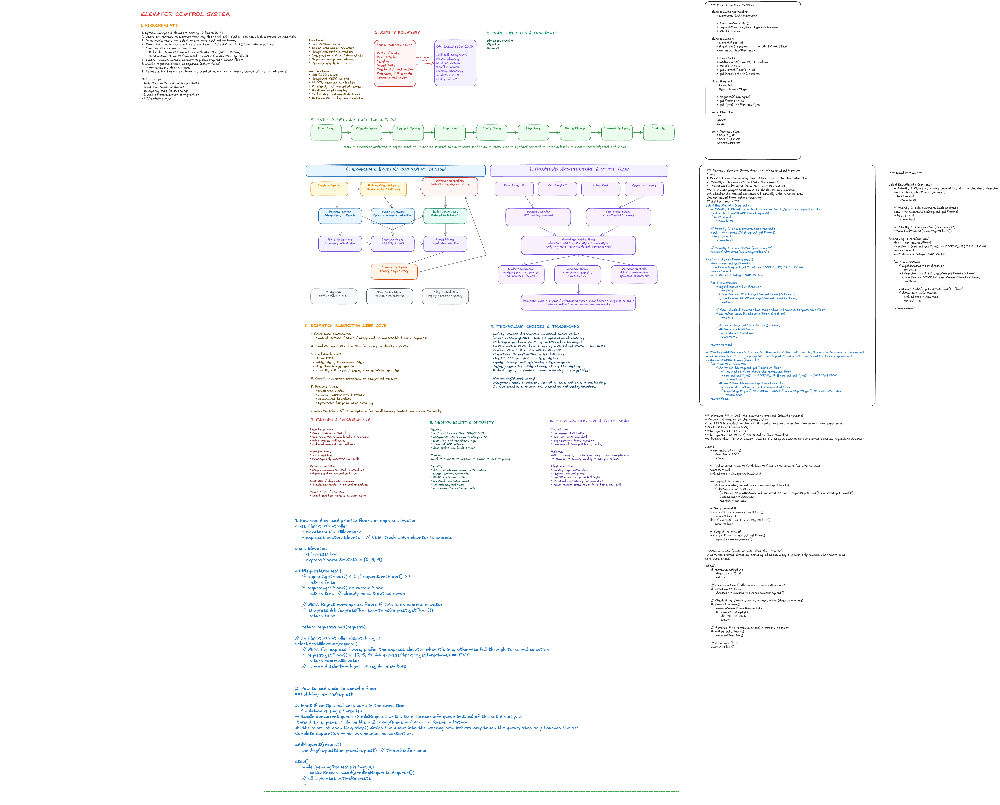
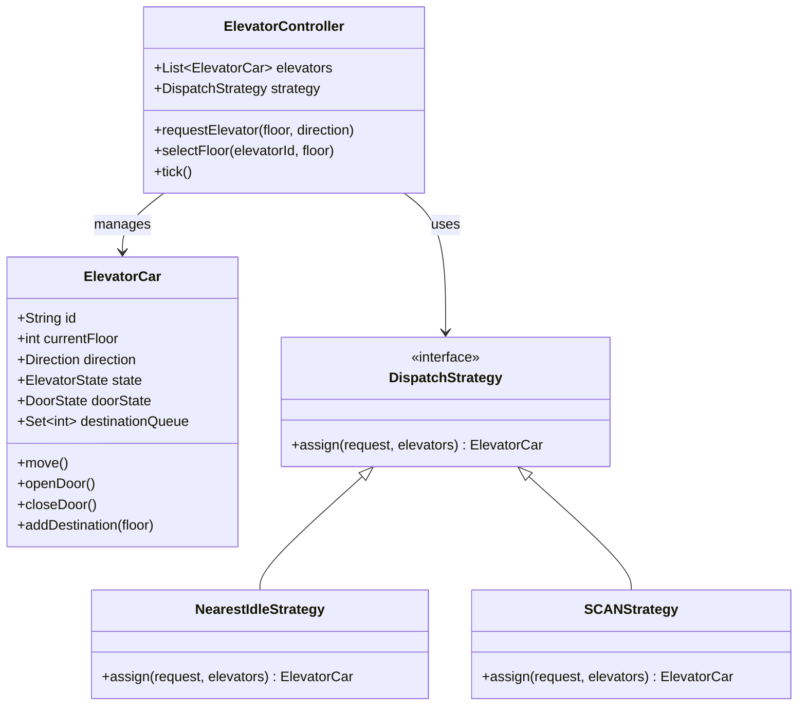
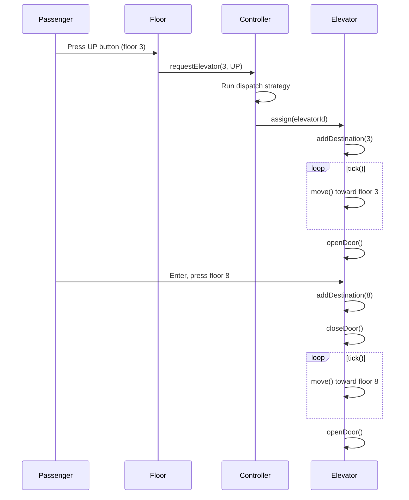
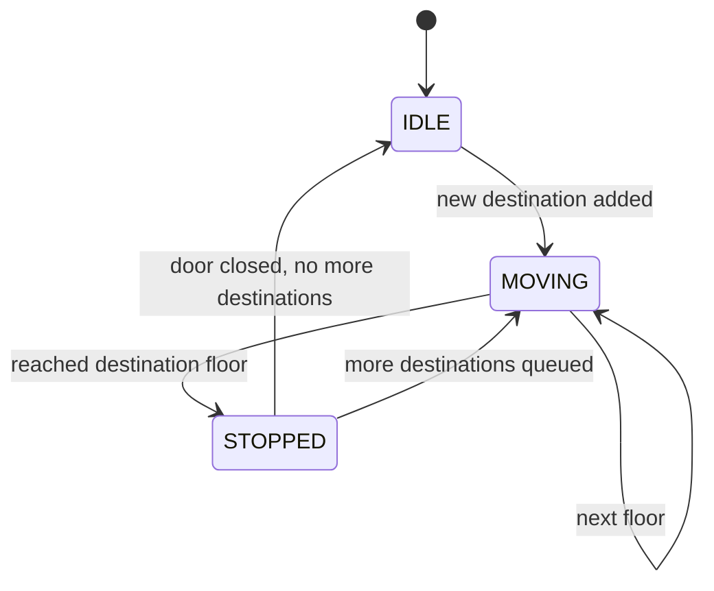

# Elevator System — Low Level Design

## Problem Statement

Design a low-level elevator system that manages multiple elevators across a multi-floor building, handling passenger requests efficiently.

## Diagram



---

## Requirements

### Functional

- Passengers can press a button on any floor (UP / DOWN) to request an elevator
- Passengers can select a destination floor inside the elevator
- Elevator moves to requested floors and opens/closes doors
- System dispatches the most appropriate elevator per request
- Elevator respects floor limits (min/max floor)

### Non-Functional

- Responsive: elevator dispatched within seconds
- Extensible: pluggable dispatch strategy (SCAN, LOOK, nearest)
- Thread-safe: concurrent requests from multiple floors/passengers

---

## Core Entities

### Enums

```ts
enum Direction {
  UP,
  DOWN,
  IDLE,
}
enum DoorState {
  OPEN,
  CLOSED,
}
enum ElevatorState {
  MOVING,
  IDLE,
  STOPPED,
}
```

### Floor

```ts
class Floor {
  floorNumber: number;
  upButton: boolean; // external request panel
  downButton: boolean;
}
```

### ElevatorCar

```ts
class ElevatorCar {
  id: string;
  currentFloor: number;
  direction: Direction;
  state: ElevatorState;
  doorState: DoorState;
  destinationQueue: Set<number>; // internal button presses

  move(): void; // advance one floor toward next destination
  openDoor(): void;
  closeDoor(): void;
  addDestination(floor: number): void;
  hasDestination(): boolean;
}
```

### ElevatorController (Dispatcher)

```ts
class ElevatorController {
  elevators: ElevatorCar[];
  strategy: DispatchStrategy;

  requestElevator(floor: number, direction: Direction): void;
  selectFloor(elevatorId: string, floor: number): void;
  tick(): void; // advance simulation one step
}
```

### DispatchStrategy (Interface)

```ts
interface DispatchStrategy {
  assign(request: Request, elevators: ElevatorCar[]): ElevatorCar;
}
```

---

## Dispatch Strategies

### Nearest Idle

Assign the elevator that is idle and closest to the requested floor.

```
cost(elevator) = |elevator.currentFloor - requestedFloor|
pick: min(cost) where state === IDLE
```

### SCAN (Elevator Algorithm)

Elevator sweeps in one direction, picks up all requests, then reverses.

```
If elevator moving UP  → serve all floors above current first
If elevator moving DOWN → serve all floors below current first
```

### LOOK (Optimized SCAN)

Same as SCAN but reverses direction when no more requests exist in current direction — avoids unnecessary travel to extremes.

---

## Class Diagram



---

## Request Flow



---

## State Machine — Elevator



---

## Edge Cases & Discussion Points

| Scenario                          | Handling                                                |
| --------------------------------- | ------------------------------------------------------- |
| Two passengers request same floor | Only one elevator dispatched; first confirmed wins      |
| Elevator at max floor, UP pressed | Ignore UP, elevator switches direction DOWN             |
| Elevator full (weight sensor)     | Skip floor assignment; dispatch next available elevator |
| Power outage                      | Elevator moves to nearest safe floor and opens door     |
| Multiple elevators same distance  | Prefer the one already moving in the same direction     |
| Door obstruction                  | Retry close after timeout; raise alert after N retries  |

---

## Trade-offs

| Decision   | Option A                 | Option B                     |
| ---------- | ------------------------ | ---------------------------- |
| Queue type | Min-heap (priority)      | Sorted set                   |
| Dispatch   | Centralized controller   | Each elevator self-manages   |
| Threading  | Single event loop (tick) | Per-elevator thread          |
| Strategy   | Hardcoded SCAN           | Strategy pattern (pluggable) |

**Recommended:** Centralized controller + Strategy pattern + priority queue per elevator.

---

## Follow-up Questions

- How would you handle a 100-floor skyscraper with 20 elevators? (zone partitioning)
- How do you ensure thread safety when multiple requests arrive simultaneously?
- How would you add VIP floors or express elevators?
- How do you optimize for peak hour traffic (morning lobby rush)?
