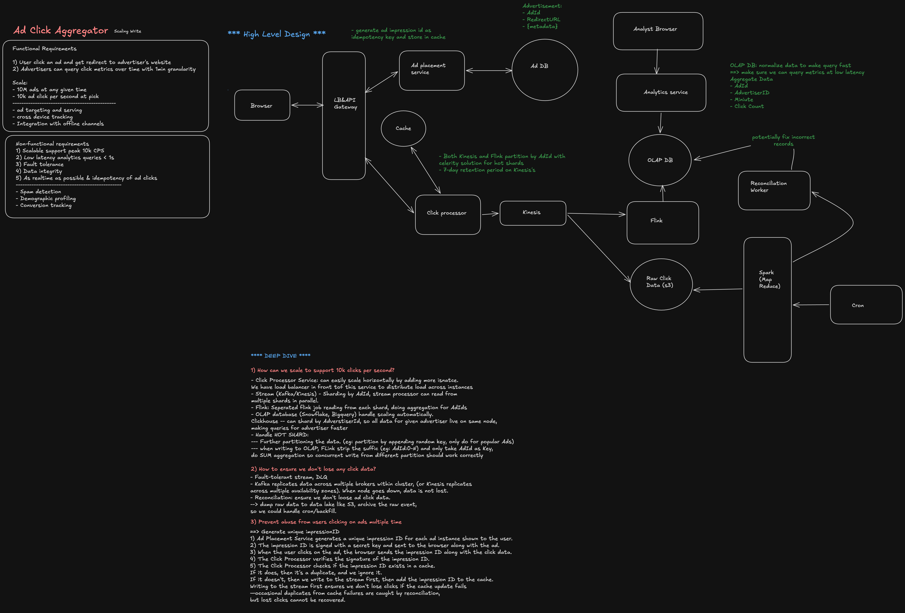

---

## Interview Summary

| Component               | Challenge                                                                       | Solution                                                                      |
| ----------------------- | ------------------------------------------------------------------------------- | ----------------------------------------------------------------------------- |
| **Click Collection**    | Billions of clicks/day from distributed SDKs across the web                     | Lightweight SDK → edge collectors → batching → Kafka                          |
| **Deduplication**       | Network retries cause duplicate clicks; SDK caches may fail                     | Idempotency key (user_id, ad_id, timestamp, nonce); deduplicate at scale      |
| **Late Arrivals**       | Mobile data, offline browsers, network delays cause data to arrive hours late   | Watermarking; trigger reports early, allow late corrections                   |
| **Accuracy Guarantee**  | Marketers need exact click counts for billing; no undercounting or overcounting | At-least-once delivery + deterministic deduplication = exactly-once semantics |
| **Real-time Reporting** | Campaign managers need dashboard updates within seconds                         | Streaming aggregation (time windows) + in-memory caches                       |
| **Attribution**         | Which campaign gets credit for a conversion?                                    | First-click, last-click, or multi-touch; configurable per advertiser          |
| **Hot-path Latency**    | SDK cannot block on network; clicks must not be lost                            | Async collection with local queue; batch flush on timeout or size             |
| **Storage & Retention** | Store years of data; queries must be fast                                       | Tiered: hot (Redis/in-memory), warm (SSD), cold (S3 archive)                  |

**The core challenge:** _Deliver exactly-once semantics for billions of events under network unreliability and at-least-once frameworks._

---

## High-Level Architecture

```
┌─────────────────────────────────────────────────────────────────┐
│                    Client (Web/Mobile/App)                      │
│              Ad-Click SDK (batching, local queue)                │
└─────────┬───────────────────────────────────────────────────────┘
          │
          │ POST /v1/clicks (batch of 50 events, 10s or 100ms timeout)
          │
  ┌───────┴────────────────────────────────────────────────────────┐
  │                  Edge Click Collectors                          │
  │  - Regional (CDN close to users)                               │
  │  - Receives batches, validates, adds server timestamp          │
  │  - Forwards to message queue                                   │
  └───────┬────────────────────────────────────────────────────────┘
          │
          ↓
   ┌─────────────────┐
   │  Kafka Topics   │
   │  - raw-clicks   │
   │  - deduplicated │
   └────────┬────────┘
            │
   ┌────────┴────────────────────────────────────────────────────┐
   │  Stream Processing Layer (Flink / Kafka Streams)            │
   │  Stage 1: Deduplicate (idempotency key lookup)              │
   │  Stage 2: Enrich (campaign, advertiser, country)            │
   │  Stage 3: Aggregate (time windows: 1m, 5m, 1h)              │
   │  Stage 4: Output to caches + data warehouse                 │
   └────────┬────────────────────────────────────────────────────┘
            │
     ┌──────┼──────┐
     ↓      ↓      ↓
  ┌──────┐ ┌─────┐ ┌──────────┐
  │Redis │ │Druid│ │PostgreSQL│
  │Cache │ │OLAP │ │ (Raw)    │
  └──────┘ └─────┘ └──────────┘
     ↑
     │
  ┌──────────────────────┐
  │ Reporting Dashboard  │
  │ (Real-time metrics)  │
  └──────────────────────┘
```

---

## The Five Critical Decisions

### 1. Collection Strategy: SDK Batching + Edge Collectors

**The problem:** If each click triggers an HTTP request, we overwhelm the network and kill battery on mobile. If we batch, how do we handle offline mode?

**Solution:**

- **Client SDK batches** — collect 50 clicks or 10 seconds, whichever comes first
- **Local queue** (SQLite on mobile) — if offline, persist to disk
- **Edge collectors** — regional servers that receive batches and validate
- **Idempotency tokens** — each click gets a nonce (UUID); server deduplicates

**Code pattern (SDK):**

```javascript
class ClickCollector {
  constructor(batchSize = 50, flushIntervalMs = 10000) {
    this.queue = [];
    this.batchSize = batchSize;
    this.flushIntervalMs = flushIntervalMs;
    this.timerId = null;
  }

  recordClick(adId, campaignId, userId, metadata) {
    const click = {
      adId,
      campaignId,
      userId,
      metadata,
      timestamp: Date.now(),
      nonce: generateUUID(), // For deduplication
    };

    this.queue.push(click);

    // Flush if batch is full
    if (this.queue.length >= this.batchSize) {
      this.flush();
    } else if (!this.timerId) {
      // Set timer for next flush
      this.timerId = setTimeout(() => this.flush(), this.flushIntervalMs);
    }
  }

  async flush() {
    if (this.queue.length === 0) return;

    const batch = this.queue.splice(0, this.batchSize);
    clearTimeout(this.timerId);
    this.timerId = null;

    try {
      await fetch('/api/v1/clicks', {
        method: 'POST',
        body: JSON.stringify({ clicks: batch }),
        timeout: 5000, // Don't block forever
      });
    } catch (err) {
      // Persist to local storage / SQLite for retry
      localStorage.setItem('pending-clicks', JSON.stringify(batch));
    }
  }
}
```

### 2. Deduplication at Scale

**The problem:** Network retries, SDK crashes, and browser reloads all cause duplicate clicks. We need to eliminate duplicates without losing data.

**Solution:**

- **Idempotency key** = SHA256(user_id, ad_id, timestamp_bucket, nonce)
- **Bloom filter** for fast negative lookups (no duplicate)
- **Redis set** for recent hours (< 24h ago), backed by database for older data
- **Watermark tracking** — track maximum timestamp processed; ignore older duplicates

**Deduplication logic:**

```javascript
const deduplicateClicks = async (batch, deduplicationStore) => {
  const dedupKeys = batch.map((click) =>
    hashIdempotencyKey(click.userId, click.adId, click.timestamp, click.nonce)
  );

  // Check Bloom filter (fast, false-positives ok)
  const possibleDuplicates = await bloomFilter.mightContain(dedupKeys);

  // For possible duplicates, check Redis
  const duplicateSet = await redis.mget(possibleDuplicates.map((key) => `click:${key}`));

  // Keep only unique clicks
  const uniqueClicks = batch.filter((click, i) => {
    const key = dedupKeys[i];
    if (!possibleDuplicates[i]) {
      // Not in Bloom filter, definitely new
      return true;
    }
    if (!duplicateSet[i]) {
      // Might be in Bloom, but not in Redis, so new
      return true;
    }
    // Duplicate, discard
    return false;
  });

  // Store new keys in Redis (with TTL = 24h) and Bloom filter
  for (const click of uniqueClicks) {
    const key = hashIdempotencyKey(click.userId, click.adId, click.timestamp, click.nonce);
    await redis.setex(`click:${key}`, 86400, '1');
    await bloomFilter.add(key);
  }

  return uniqueClicks;
};
```

### 3. Stream Processing: Windowed Aggregation

**The problem:** Aggregate billions of clicks into per-campaign, per-hour metrics. Real-time = within seconds. Late data must update old windows.

**Solution:**

- **Event time windows** (not processing time) — window by click timestamp
- **Allowed lateness** — accept data up to 24 hours late; emit updates
- **Watermark** — track which events are "complete"
- **Aggregation state** — in-memory for hot windows, RocksDB for older

**Stream aggregation (Kafka Streams / Flink):**

```javascript
const aggregateClicks = () => {
  return stream
    .filter((click) => click.timestamp) // Must have timestamp
    .map((click) => ({
      ...click,
      hour: Math.floor(click.timestamp / 3600000) * 3600000, // Bucket to hour
    }))
    .groupByKey((click) => `${click.campaignId}:${click.hour}`)
    .windowedBy(TimeWindows.of(Duration.ofHours(1)).grace(Duration.ofHours(24))) // Allow 24h late
    .aggregate(
      () => ({ clicks: 0, uniqueUsers: new Set(), revenue: 0 }),
      (key, click, agg) => ({
        clicks: agg.clicks + 1,
        uniqueUsers: agg.uniqueUsers.add(click.userId),
        revenue: agg.revenue + (click.revenue || 0),
      })
    )
    .toStream()
    .foreach((key, agg) => {
      // Emit to Redis, OLAP store, etc.
      const [campaignId, hour] = key.key.split(':');
      redis.hset(
        `campaign:${campaignId}:${hour}`,
        'clicks',
        agg.clicks,
        'unique_users',
        agg.uniqueUsers.size,
        'revenue',
        agg.revenue
      );
    });
};
```

### 4. Late Arrivals & Watermarking

**The problem:** A mobile user goes offline, their clicks queue. 6 hours later, they reconnect and send a batch of 100 old clicks. Should they update yesterday's metrics?

**Solution:**

- **Watermark** tracks minimum event time across all partitions
- **Allowed lateness** window (typically 24h) — older data is ignored
- **Grace period** — after watermark passes window end + grace, window is finalized
- **Re-computation flag** — late data triggers recomputation and emits delta update

**Watermark logic:**

```javascript
const watermarkTracker = {
  minEventTime: Date.now(),

  updateWatermark(eventTime) {
    // Watermark = max time we know all earlier data has arrived
    // Typically: max(eventTime - buffer)
    this.minEventTime = Math.max(this.minEventTime, eventTime - 60000); // 60s buffer
  },

  isLate(eventTime, windowEnd, gracePeriod) {
    return eventTime < windowEnd && windowEnd + gracePeriod < this.minEventTime;
  },
};

const processClick = (click) => {
  watermarkTracker.updateWatermark(click.timestamp);
  const windowEnd = Math.ceil(click.timestamp / 3600000) * 3600000;
  const gracePeriod = 24 * 3600000; // 24 hours

  if (watermarkTracker.isLate(click.timestamp, windowEnd, gracePeriod)) {
    // Too late, ignore
    return { action: 'drop', reason: 'after_grace_period' };
  }

  if (
    click.timestamp < windowEnd &&
    click.timestamp + gracePeriod >= watermarkTracker.minEventTime
  ) {
    // Late but within grace, update window
    return { action: 'late_update', window: windowEnd };
  }

  return { action: 'process', window: windowEnd };
};
```

### 5. Attribution & Multi-Touch

**The problem:** User sees Ad A, clicks it. Later sees Ad B, clicks it. Clicks on product. Which ad gets credit for the conversion?

**Solution:**

- **First-click**: Ad A gets 100% credit
- **Last-click**: Ad B gets 100% credit
- **Multi-touch**: Linear (50-50), time-decay, etc.
- **Configurable per advertiser** — store attribution model in database

**Attribution code:**

```javascript
const attributeConversion = (userJourney, attributionModel) => {
  const clickEvents = userJourney.filter((e) => e.type === 'click');

  switch (attributionModel) {
    case 'first-click':
      return { campaignId: clickEvents[0].campaignId, credit: 1.0 };

    case 'last-click':
      return { campaignId: clickEvents[clickEvents.length - 1].campaignId, credit: 1.0 };

    case 'linear':
      return clickEvents.map((click) => ({
        campaignId: click.campaignId,
        credit: 1.0 / clickEvents.length,
      }));

    case 'time-decay':
      const weights = clickEvents.map((_, i) => 2 ** i); // Exponential: recent = higher
      const totalWeight = weights.reduce((a, b) => a + b, 0);
      return clickEvents.map((click, i) => ({
        campaignId: click.campaignId,
        credit: weights[i] / totalWeight,
      }));

    default:
      return { campaignId: null, credit: 0 };
  }
};
```

---

## Deep Dive: Handling 100B Clicks/Day

### Back-of-the-envelope:

- 100 billion clicks/day = ~1.15 million clicks/second
- Peak (4x average) = ~4.6 million clicks/second

### Infrastructure:

- **Edge collectors**: 100+ regional servers, ~50k clicks/sec each
- **Kafka**: 10-20 brokers, 100+ partitions for parallelism
- **Stream processors**: 50+ Flink tasks, each processing ~1M events/sec
- **Storage**: Redis (hot), Druid (OLAP), S3 (archive)

### Deduplication at scale:

- Bloom filter size: 1TB (for 100B entries, false-positive rate ~1%)
- Redis storage: ~10TB (24-hour window of deduplicated keys)
- Replication: 3x, across regions

### Latency breakdown:

- SDK batching + network: 100ms
- Edge collection: 50ms
- Kafka: 100ms
- Stream processing: 200ms
- Redis write: 10ms
- **Total**: ~500ms from click to dashboard

---

## Anti-Patterns & Solutions

| Anti-pattern                       | Problem                                          | Solution                                               |
| ---------------------------------- | ------------------------------------------------ | ------------------------------------------------------ |
| **No deduplication**               | Overcount clicks; billing disputes               | Idempotency key + Bloom filter + Redis                 |
| **Processing time windows**        | Late data doesn't update old metrics             | Use event time + allowed lateness                      |
| **Trusting client timestamp**      | Attacker manipulates clock; skewed metrics       | Server-side timestamping at collection point           |
| **Synchronous writes to database** | Database becomes bottleneck; 1M clicks/sec fails | Async + Kafka; batch writes to OLAP                    |
| **No retention policy**            | Storage grows unbounded                          | TTL on Redis, archive to S3 after 30 days              |
| **Single collection endpoint**     | Regional outage = data loss                      | Redundant collectors, multi-region failover            |
| **No fraud detection**             | Click farms inflate metrics; wasted spend        | Velocity checks, IP reputation, user behavior patterns |
| **Exact pixel tracking only**      | Mobile/privacy browsers don't send pixels        | Conversion API (server-to-server) + SDK                |

---

## Interview Follow-ups

1. **"How would you detect click fraud?"**
   - Answer: Multi-layer approach:
     - **Velocity checks**: Same IP clicking 1000 times/min = suspicious
     - **Bot detection**: Headless browser patterns, unusual user agents
     - **Behavioral anomalies**: Click-to-conversion ratio (1000 clicks, 0 conversions = fraud)
     - **IP reputation**: Use third-party services (MaxMind) to flag VPNs, datacenters
     - **Device fingerprinting**: Same device, different IPs, correlated clicks = bot ring

2. **"What if Kafka partition gets behind? How do you handle backpressure?"**
   - Answer:
     - Monitor lag (Kafka consumer group lag)
     - Scale up: Add more consumers/partitions
     - Backpressure: Edge collectors buffer to disk if Kafka is slow
     - Dead-letter queue: Drop clicks after N retry attempts (rare, acceptable for at-least-once)

3. **"How do you handle time zones for hourly aggregation?"**
   - Answer: All timestamps in UTC in the system. Conversion to campaign's time zone happens at reporting layer:
     - Store campaign.timeZone in database
     - Dashboard converts Unix timestamp to campaign's local time
     - Hourly window = UTC hour (not local hour)

4. **"Can you handle clicks arriving out of order?"**
   - Answer: Yes, stream processor doesn't care about order:
     - Each click has timestamp; window determined by timestamp
     - Watermark tracks completeness; late data updates old windows
     - Within grace period, out-of-order is handled; after grace, late data dropped

5. **"What's the difference between exactly-once and at-least-once semantics?"**
   - Answer:
     - **At-least-once**: Kafka guarantees each message reaches consumer ≥1 times
     - **Exactly-once**: With deduplication key, we ensure each logical click counted once
     - Achieved by: idempotency key + external state (Redis/database) tracking processed keys
     - When consumer rebalances or crashes, it re-processes; dedup store prevents double-count

6. **"How would you migrate from counting clicks in-app to server-side?"**
   - Answer: Parallel collection for N days:
     - Emit clicks to both old system and new system
     - Compare counts per campaign per day
     - Once within acceptable threshold (0.1% difference), cutover to new system
     - Keep old system as fallback for 1 week

7. **"What if you need to retroactively correct old metrics (e.g., found click fraud)?"**
   - Answer: Replay events with fraud filter:
     - Re-run stream processor on historical Kafka topics
     - Apply new fraud detection rules
     - Output corrected metrics to separate tables
     - Backup old metrics; switch dashboards to corrected version
     - Audit log tracks which corrections were applied

8. **"How do you handle missing data due to regional outage?"**
   - Answer: Multi-region redundancy:
     - Replicate edge collectors across regions
     - If US East fails, US West collectors automatically take traffic
     - Kafka replicated across regions (3+ brokers in different AZs)
     - Missing data is unavoidable; report as "partial" to stakeholders
     - No way to recover clicks that were never sent to any collector
