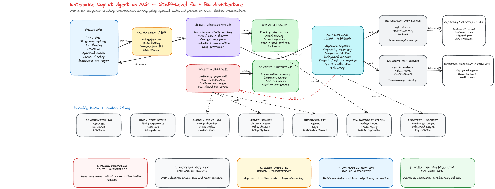

# Staff-Level System Design: Enterprise Copilot Agent on MCP

## Interview Prompt

Design an enterprise copilot that answers employee questions and performs approved actions using existing internal APIs exposed through **Model Context Protocol (MCP)**.

Example questions and actions:

- “What is the deployment status of service X?”
- “Summarize the last five incidents involving checkout.”
- “Why did yesterday’s data pipeline fail?”
- “Create a Jira issue for this incident.”
- “Restart the canary deployment after I approve.”
- “Draft a weekly status update using project data.”

The copilot must:

- Work across multiple internal systems.
- Use existing APIs rather than replacing them.
- Support conversational Q&A and multi-step workflows.
- Stream progress and partial answers to the frontend.
- Enforce identity, permissions, policy, and user confirmation.
- Be observable, auditable, resilient, and cost controlled.

---

# 1. Clarify the Scope First

A staff-level answer should not begin with “use an LLM and MCP.” Establish the product and risk boundaries first.

## Core clarification questions

1. Is the initial product **read-only Q&A**, or can it perform writes?
2. Which internal domains are in scope: source control, incidents, deployments, tickets, documents, HR, finance?
3. Must answers be grounded in company data with citations?
4. What actions require user confirmation or manager approval?
5. What is the maximum workflow duration?
6. Is this single-tenant inside one company or multi-tenant SaaS?
7. What data classifications exist: public, internal, confidential, restricted?
8. What latency is acceptable for:
   - first token,
   - simple Q&A,
   - multi-tool workflows?
9. What failure behavior is expected if one dependency is unavailable?
10. What compliance, retention, deletion, and regional requirements apply?

## Recommended initial scope

Start with:

- Read-only Q&A.
- A small set of high-value domains.
- Explicit citations.
- Human confirmation for all side-effecting tools.
- Bounded workflows with a maximum number of steps.
- One enterprise tenant, but tenant-aware data models.

Then add write workflows after access control, evaluations, and auditability are proven.

---

# 2. Functional Requirements

## P0: Required

### Conversation

- Start and continue a conversation.
- Stream assistant text, tool progress, citations, and errors.
- Cancel an active run.
- Retry a failed run.
- Preserve conversation history.
- Support follow-up questions that refer to prior messages.

### Grounded Q&A

- Search authorized internal sources.
- Retrieve relevant context.
- Invoke internal APIs through MCP tools.
- Generate answers with source citations.
- Distinguish retrieved facts from model inference.
- Display freshness and source metadata.

### Tool use

- Discover approved MCP servers and capabilities.
- Select appropriate tools.
- Validate structured tool arguments.
- Execute tools with the user’s delegated identity.
- Normalize tool results.
- Support read and write tools.
- Require confirmation for sensitive or destructive actions.

### Workflow execution

- Support multi-step plans.
- Maintain run and step state.
- Apply retries and timeouts.
- Resume selected durable workflows.
- Prevent unbounded loops.
- Return partial results when safe.

### Governance

- Enforce tenant, user, role, resource, and action authorization.
- Apply data-classification and policy rules.
- Record an immutable audit trail.
- Redact secrets and sensitive fields.
- Let administrators disable servers, tools, or models.

## P1: Valuable later

- Saved prompts and organization prompt templates.
- Scheduled workflows.
- Shared conversations.
- Feedback and answer correction.
- Personalization based on approved user preferences.
- Multi-agent specialization.
- Background tasks for long-running workflows.
- MCP Apps or custom interactive result surfaces.
- Admin analytics and tool-quality dashboards.

## Explicit non-goals for v1

- Fully autonomous production changes.
- Arbitrary code execution.
- Unrestricted browser or shell access.
- Dynamic installation of untrusted MCP servers.
- Infinite agent loops.
- Treating model output as an authorization decision.

---

# 3. Non-Functional Requirements

Define measurable targets rather than saying “fast and scalable.”

| Category              | Example target                                                                         |
| --------------------- | -------------------------------------------------------------------------------------- |
| Availability          | 99.9% for chat APIs; graceful degradation when individual MCP servers fail             |
| First-token latency   | p95 under 1.5–2.5 seconds for normal requests                                          |
| Read-only Q&A latency | p95 under 8 seconds                                                                    |
| Tool workflow latency | Progress visible within 2 seconds; workflow-specific SLO                               |
| Streaming             | Ordered, resumable event stream with no duplicate visible effects                      |
| Scale                 | 10K concurrent conversations, 1K–5K active runs, bursty tool traffic                   |
| Durability            | No loss of confirmed write intents or audit records                                    |
| Security              | Least privilege, short-lived credentials, no secrets in prompts or logs                |
| Isolation             | Tenant and user isolation at every storage and execution boundary                      |
| Auditability          | Every model call, tool proposal, approval, call, result, and policy decision traceable |
| Cost                  | Per-run token/tool budgets, model routing, caching, and usage attribution              |
| Accessibility         | WCAG 2.2 AA interaction patterns and screen-reader-friendly streaming                  |
| Maintainability       | Versioned contracts, server ownership, rollout controls, conformance tests             |
| Explainability        | Source citations and visible tool/action history                                       |
| Data freshness        | Source timestamp and cache age shown where materially relevant                         |

## Capacity assumptions for discussion

Example assumptions:

- 100K employees.
- 20K daily active copilot users.
- 10 requests per active user per day.
- 200K runs/day.
- Average 1.8 tool calls/run.
- Peak 30 requests/second, with 10× event-stream fan-out.
- 50 MCP servers and 300 total tools.
- Conversation metadata retained for 90 days; audit records retained for years depending on policy.

These numbers are placeholders. State them, calculate approximate load, and explain which components scale independently.

---

# 4. Key Architectural Decision

## MCP is an integration protocol, not the complete agent platform

Use MCP between the agent platform and domain integrations because it standardizes:

- Capability discovery.
- Tools.
- Resources.
- Prompts.
- Structured inputs and outputs.
- Client/server lifecycle and negotiation.

Do **not** ask each MCP server to implement:

- Global orchestration.
- Cross-tool planning.
- Enterprise policy.
- Model routing.
- Conversation storage.
- Central audit.
- User confirmation UX.
- Budget control.

Those belong in the copilot platform.

## Why wrap existing internal APIs with MCP adapters?

Existing services remain systems of record. An MCP adapter:

1. Describes a model-friendly, task-oriented capability.
2. Validates arguments.
3. Converts MCP calls into internal API calls.
4. Propagates identity and request context.
5. Normalizes results.
6. Emits audit and telemetry metadata.

This avoids duplicating domain logic and avoids exposing every low-level REST endpoint directly to the model.

---

# 5. High-Level Architecture

```text
┌──────────────────────────────── Frontend ────────────────────────────────┐
│ Chat shell │ Composer │ Streaming timeline │ Citations │ Approval cards │
│ Run inspector │ Cancel/retry │ Accessible announcements │ Local cache    │
└───────────────────────────────┬───────────────────────────────────────────┘
                                │ HTTPS + SSE/WebSocket
                     ┌──────────▼──────────┐
                     │ API Gateway / BFF   │
                     │ auth, rate limits,  │
                     │ request shaping     │
                     └──────────┬──────────┘
                                │
              ┌─────────────────▼─────────────────┐
              │ Agent Orchestrator / Run Service  │
              │ state machine, planning, budgets, │
              │ context assembly, model routing   │
              └───────┬──────────┬──────────┬─────┘
                      │          │          │
              ┌───────▼───┐ ┌────▼─────┐ ┌─▼────────────────┐
              │ Policy &  │ │ Model     │ │ Retrieval /      │
              │ Approval  │ │ Gateway   │ │ Context Service  │
              └───────┬───┘ └────┬─────┘ └─┬────────────────┘
                      │          │          │
              ┌───────▼──────────▼──────────▼──────┐
              │ MCP Gateway / Client Manager       │
              │ registry, sessions, schema cache,  │
              │ auth delegation, circuit breakers  │
              └───────┬──────────────┬─────────────┘
                      │ MCP          │ MCP
            ┌─────────▼──────┐  ┌────▼──────────────┐
            │ Domain MCP     │  │ Domain MCP        │
            │ Server: Deploy │  │ Server: Incidents │
            └─────────┬──────┘  └────┬──────────────┘
                      │ internal API │ internal API
            ┌─────────▼──────┐  ┌────▼──────────────┐
            │ Deployment     │  │ Incident/Jira     │
            │ platform       │  │ systems           │
            └────────────────┘  └───────────────────┘

Cross-cutting:
- Conversation DB
- Run/step store
- Event log / queue
- Cache
- Secrets and identity
- Audit ledger
- Metrics, logs, traces
- Evaluation platform
```

---

# 6. Request Lifecycle

## Read-only Q&A flow

1. User submits a question.
2. Frontend creates a client-generated `request_id` and optimistically renders the user message.
3. BFF authenticates the user and creates a run.
4. Orchestrator loads:
   - conversation summary,
   - recent messages,
   - user/tenant context,
   - allowed tools,
   - policy constraints.
5. Model proposes retrieval or tool calls.
6. Orchestrator validates the proposal.
7. Policy engine checks whether the user can use the tool on the target resource.
8. MCP gateway invokes the selected server with delegated identity and tracing context.
9. MCP server calls the existing internal API.
10. Result is normalized, filtered, and appended to run state.
11. Model synthesizes a grounded response.
12. The frontend receives ordered stream events.
13. Citations, tool usage, token cost, latency, and policy decisions are stored.

## Write-action flow

For “restart the canary”:

1. Model proposes `deployments.restart_canary`.
2. The platform does **not** execute immediately.
3. Tool arguments are schema validated.
4. Policy engine returns `REQUIRES_CONFIRMATION`.
5. Frontend renders an approval card:
   - action,
   - target,
   - expected effect,
   - risk,
   - arguments,
   - expiration.
6. User confirms.
7. Backend verifies the approval token, user identity, current resource state, and idempotency key.
8. MCP tool executes.
9. Result is audited and shown to the user.

Never let a text response such as “yes” bypass a cryptographically bound approval flow.

---

# 7. Backend Deep Dive

## 7.1 Agent Orchestrator

Model the run as a durable state machine.

```ts
type RunStatus =
  | 'queued'
  | 'planning'
  | 'executing'
  | 'awaiting_approval'
  | 'synthesizing'
  | 'completed'
  | 'failed'
  | 'cancelled';

type StepStatus = 'pending' | 'running' | 'succeeded' | 'failed' | 'skipped' | 'cancelled';

interface AgentRun {
  runId: string;
  tenantId: string;
  userId: string;
  conversationId: string;
  status: RunStatus;
  modelPolicyId: string;
  toolBudget: number;
  tokenBudget: number;
  deadlineAt: string;
  version: number;
}
```

### Responsibilities

- Create the execution plan.
- Restrict candidate tools.
- Assemble context.
- Route model requests.
- Validate tool calls.
- Invoke policy.
- Execute or pause steps.
- Stream state changes.
- Enforce budgets, deadlines, and cancellation.
- Persist checkpoints.
- Prevent repeated identical calls and loops.

### State machine versus free-form loop

Prefer a controlled loop:

```text
OBSERVE → PLAN → POLICY CHECK → ACT → RECORD → REFLECT → ANSWER
```

Bound it by:

- maximum steps,
- maximum repeated tool signature,
- token budget,
- tool budget,
- wall-clock deadline,
- per-tool timeout,
- cancellation signal.

For complex durable workflows, use a workflow engine or persisted event-driven state machine. For a simple Q&A MVP, a database-backed run record and worker queue may be enough.

## 7.2 MCP Gateway / Client Manager

The MCP gateway is a platform-owned layer between orchestration and domain MCP servers.

### Responsibilities

- Approved server registry.
- Capability and schema discovery.
- Version compatibility.
- Connection/session management.
- Tool catalog caching.
- Per-server rate limits and concurrency limits.
- OAuth or workload identity delegation.
- Tenant routing.
- Request/response size limits.
- Input and output validation.
- Timeouts, retries, circuit breakers, and bulkheads.
- Result sanitization.
- Tracing and metrics.
- Server health and rollout controls.

### Why not connect the orchestrator directly to every MCP server?

A gateway centralizes enterprise controls and keeps the orchestrator independent of transport and server quirks. The trade-off is an extra hop and a potential bottleneck, so run it stateless where possible, partition connections, and isolate unhealthy servers.

## 7.3 MCP Server design over existing APIs

A domain team should expose task-oriented tools, not a raw mirror of every API route.

Weak tool:

```text
http_request(method, url, body)
```

Better tools:

```text
incidents.search(service, severity, start_time, end_time)
incidents.get_timeline(incident_id)
deployments.get_status(service, environment)
deployments.restart_canary(service, environment, reason, idempotency_key)
```

### Tool contract guidelines

- Narrow purpose.
- Descriptive name.
- Precise descriptions.
- JSON-schema inputs.
- Structured outputs.
- Stable identifiers.
- Explicit side-effect metadata.
- Pagination.
- Maximum result size.
- Error categories.
- Freshness timestamps.
- Idempotency support for writes.
- Versioning and deprecation policy.

### Suggested internal metadata

```ts
interface EnterpriseToolMetadata {
  ownerTeam: string;
  risk: 'read' | 'low_write' | 'high_write';
  dataClasses: string[];
  requiredScopes: string[];
  requiresConfirmation: boolean;
  idempotent: boolean;
  timeoutMs: number;
  maxResultBytes: number;
}
```

This metadata may live in the registry even when it is not part of the portable MCP contract.

## 7.4 Model Gateway

Separate model access from orchestration.

Responsibilities:

- Provider abstraction.
- Model allowlist.
- Model routing by task and sensitivity.
- Regional routing.
- Rate limits and quotas.
- Prompt template versioning.
- Token accounting.
- Response filtering.
- Fallback models.
- Provider outage handling.
- No-retention and data-processing settings.
- Evaluation tags and trace IDs.

Example routing:

- Small model: classify intent and rank tools.
- Strong model: planning and final synthesis.
- Embedding model: retrieval.
- Specialized model: code or SQL reasoning where approved.

Avoid making the workflow depend on one vendor-specific tool-call format. Normalize it at the model gateway or orchestration layer.

## 7.5 Context and retrieval

Potential context sources:

- Recent conversation turns.
- Summarized older turns.
- User identity and team.
- Retrieved documents.
- MCP resources.
- Tool results.
- Organization prompt.
- Current run plan.
- Policy instructions.

### Context assembly rules

- Never include every available tool.
- Select candidate tools based on intent, domain, permissions, and historical quality.
- Treat tool descriptions and retrieved content as untrusted data.
- Label origin and trust level.
- Limit token and byte size.
- Deduplicate.
- Prefer fresh, authoritative sources.
- Preserve citation IDs through synthesis.
- Do not place secrets in model context.

## 7.6 Data model

```text
Conversation
- conversation_id
- tenant_id
- owner_user_id
- title
- created_at
- updated_at

Message
- message_id
- conversation_id
- role
- content
- status
- created_at

Run
- run_id
- conversation_id
- user_id
- status
- model_policy_id
- token_usage
- tool_usage
- started_at
- completed_at

RunStep
- step_id
- run_id
- sequence
- type
- status
- tool_name
- arguments_hash
- result_ref
- error_code
- started_at
- completed_at

Approval
- approval_id
- run_id
- step_id
- user_id
- action_hash
- status
- expires_at
- decided_at

Citation
- citation_id
- run_id
- source_uri
- source_title
- retrieved_at
- content_hash
- access_snapshot

AuditEvent
- event_id
- tenant_id
- actor_id
- run_id
- action
- target
- decision
- policy_version
- request_id
- timestamp
- integrity_hash
```

Use blob/object storage for large tool results, referenced from the relational run metadata.

## 7.7 Streaming protocol

SSE is a strong default because the dominant flow is server-to-client and it works well through HTTP infrastructure. WebSocket is useful when the product needs high-frequency bidirectional interactions or a shared live session.

Example events:

```ts
type StreamEvent =
  | { type: 'run.started'; seq: number; runId: string }
  | { type: 'assistant.delta'; seq: number; text: string }
  | { type: 'step.started'; seq: number; stepId: string; label: string }
  | { type: 'step.completed'; seq: number; stepId: string }
  | { type: 'approval.required'; seq: number; approval: ApprovalView }
  | { type: 'citation.added'; seq: number; citation: CitationView }
  | { type: 'run.completed'; seq: number; usage: UsageView }
  | { type: 'run.failed'; seq: number; error: SafeError };
```

Important details:

- Monotonic sequence number.
- Event ID for resume.
- Heartbeats.
- Reconnect with `Last-Event-ID`.
- Idempotent client reducer.
- Persisted terminal event.
- Backpressure and bounded buffers.
- Never stream secrets or raw internal stack traces.

## 7.8 Reliability

### Failure isolation

- Per-server circuit breakers.
- Per-tool concurrency pools.
- Queue partitions by tenant and tool.
- Timeouts at every network boundary.
- Retry only safe, transient failures.
- Do not automatically retry non-idempotent writes.
- Return partial answers when one source is unavailable.
- Surface freshness and incompleteness.

### Idempotency

For side effects:

```text
idempotency_key =
hash(tenant_id, user_id, approved_action_hash, approval_id)
```

The internal API—not only the MCP adapter—should enforce it when possible.

### Cancellation

Cancellation must propagate:

```text
Frontend → BFF → Orchestrator → Model request → MCP gateway → Internal API
```

If the downstream operation cannot be cancelled, mark it as “cancellation requested” rather than falsely claiming it stopped.

---

# 8. Frontend Deep Dive

## 8.1 Component architecture

```text
CopilotPage
├── ConversationSidebar
├── ConversationView
│   ├── MessageList (virtualized when needed)
│   ├── UserMessage
│   ├── AssistantMessage
│   │   ├── MarkdownRenderer
│   │   ├── CitationList
│   │   └── FeedbackControls
│   ├── RunTimeline
│   │   ├── PlanningStep
│   │   ├── ToolStep
│   │   └── ErrorStep
│   └── ApprovalCard
└── Composer
    ├── PromptInput
    ├── AttachmentPicker
    ├── SubmitButton
    └── StopButton
```

Keep transport state, run state, and presentation state separate.

## 8.2 Client state model

```ts
interface ConversationState {
  messagesById: Record<string, Message>;
  messageOrder: string[];
  runsById: Record<string, RunView>;
  activeRunId?: string;
  connection: 'idle' | 'connecting' | 'streaming' | 'reconnecting';
}
```

Use a reducer or state machine for stream events. Events may be duplicated after reconnect, so process them idempotently by `(runId, seq)`.

## 8.3 Optimistic UX

Safe optimistic behavior:

- Immediately render the user message.
- Show a pending run shell.
- Allow cancel.
- Preserve draft input.
- Reconcile with server IDs.

Do not optimistically show a write action as completed. Use explicit states:

```text
Proposed → Awaiting confirmation → Submitted → Succeeded/Failed
```

## 8.4 Streaming rendering performance

- Batch token updates to animation frames or 30–60 ms intervals.
- Avoid reparsing the entire Markdown document per token.
- Render stable completed blocks separately from the active block.
- Virtualize long conversations.
- Memoize message rows.
- Avoid auto-scrolling when the user has scrolled away from the bottom.
- Show a “Jump to latest” affordance.
- Cap retained in-memory event history.

## 8.5 Accessibility

- Composer has an explicit label.
- New content announcements are batched into a polite live region.
- Do not announce every token.
- Tool progress uses `role="status"`.
- Errors use an appropriate alert.
- Approval dialogs trap focus and return focus on close.
- All actions are keyboard accessible.
- Do not communicate risk or status using color alone.
- Respect reduced motion.
- Citations have meaningful accessible names.
- “Stop generating” remains reachable while streaming.

## 8.6 Approval UX

An approval card should show:

- Exact action.
- Target resource and environment.
- Arguments.
- Reason supplied by the model/user.
- Expected impact.
- Whether rollback is available.
- Expiration.
- Confirm and reject actions.

The approval endpoint should receive an opaque `approval_id`, not editable action arguments from the browser.

## 8.7 Frontend security

- Render model text as untrusted.
- Sanitize Markdown and HTML.
- Block unsafe URLs and embedded scripts.
- Do not expose access tokens to tool UI.
- Use CSRF protection for write endpoints.
- Bind approvals to server-side action hashes.
- Avoid logging confidential prompts to browser analytics.
- Apply strict Content Security Policy.
- Isolate interactive MCP-provided UI in a sandbox with explicit capabilities.

---

# 9. Security and Trust Model

## Threats

- Prompt injection in documents or tool output.
- Malicious or compromised MCP server.
- Tool description poisoning.
- Excessive tool permissions.
- Cross-tenant data leakage.
- Confused-deputy attacks.
- Secret exfiltration.
- Unauthorized write actions.
- Replay of approvals.
- Denial of wallet through token/tool loops.
- Supply-chain compromise.
- Sensitive data leakage into logs or model providers.

## Controls

### Identity

- Authenticate the human at the gateway.
- Propagate a signed, short-lived user/workload context.
- Use delegated authorization rather than a universal service account.
- Keep user identity distinct from service identity.

### Authorization

Authorize every tool call at execution time using:

```text
subject + tenant + action + resource + environment + data classification
```

Do not trust the model to decide authorization.

### Policy

A central policy engine can return:

```text
ALLOW
DENY
REQUIRES_CONFIRMATION
REQUIRES_ELEVATED_APPROVAL
```

Log policy version and reason.

### Data controls

- Classify tool inputs and outputs.
- Redact before model calls and logs.
- Prevent restricted data from going to disallowed models or regions.
- Minimize retention.
- Encrypt at rest and in transit.
- Apply tenant-aware keys where required.

### Prompt injection defense

- Treat retrieved content and tool output as data, not instructions.
- Delimit and label untrusted content.
- Restrict candidate tools before the model sees them.
- Use deterministic policy enforcement outside the model.
- Require confirmation for side effects.
- Scan suspicious tool descriptions and server changes.
- Pin server identities and approved versions.
- Run conformance and security tests.

No prompt-level defense alone is sufficient.

---

# 10. Observability and Evaluation

## Three levels of observability

### System

- Request rate.
- Error rate.
- p50/p95/p99 latency.
- queue delay.
- stream disconnect rate.
- model and MCP server availability.

### Agent

- Runs by outcome.
- Steps per run.
- tool selection.
- repeated calls.
- plan revisions.
- approval rate.
- cancellation rate.
- fallback rate.
- token and tool cost.

### Product quality

- Grounded answer rate.
- Citation correctness.
- Task completion rate.
- Tool argument correctness.
- User correction rate.
- Positive/negative feedback.
- Escalation rate.
- Time saved.

## Distributed trace

A trace should connect:

```text
user request
→ run
→ model call
→ policy decision
→ MCP call
→ internal API request
→ tool result
→ final answer
```

Use correlation IDs without storing sensitive content in trace attributes.

## Evaluation strategy

### Offline

- Golden Q&A set.
- Tool-selection tests.
- Tool-argument tests.
- Prompt-injection suite.
- Authorization boundary tests.
- Citation faithfulness.
- Multi-step workflow replay.
- Regression tests per prompt/model/tool version.

### Online

- Shadow traffic.
- Staff dogfood.
- Canary rollout.
- Feature flags by tenant/team.
- A/B testing where appropriate.
- Human review for high-risk domains.
- Automatic rollback on quality or safety thresholds.

### MCP contract testing

Each server should pass:

- schema validation,
- authentication,
- authorization,
- timeout,
- pagination,
- size limits,
- redaction,
- error normalization,
- idempotency,
- compatibility,
- malicious output tests.

---

# 11. Scaling Strategy

Scale independent dimensions separately:

| Dimension            | Scaling strategy                                          |
| -------------------- | --------------------------------------------------------- |
| HTTP requests        | Stateless BFF replicas                                    |
| Streams              | Dedicated stream gateway or horizontally scaled SSE nodes |
| Runs                 | Partitioned worker queues                                 |
| Conversation storage | Tenant-sharded relational store                           |
| Large results        | Object storage                                            |
| MCP connections      | Gateway pools partitioned by server and tenant            |
| Model calls          | Central quotas, provider routing, concurrency limits      |
| Tool calls           | Per-tool bulkheads and rate limits                        |
| Retrieval            | Domain indexes, metadata filters, caching                 |
| Audits               | Append-only event pipeline and durable warehouse/archive  |

## Caching

Useful caches:

- MCP capability/schema cache.
- Read-only tool result cache where permissions and freshness allow.
- Retrieval result cache.
- Conversation summaries.
- Model response cache only for carefully normalized, non-personal queries.

Cache keys must include tenant, authorization scope, tool version, arguments, and freshness policy. Do not cache a privileged response and serve it to a less privileged user.

---

# 12. Key Trade-offs

## Direct internal APIs versus MCP

**Direct APIs**

- Lower latency.
- Familiar debugging.
- Strongly typed SDKs.

**MCP**

- Consistent discovery and invocation.
- Easier model/tool portability.
- Common governance surface.
- Reduces custom agent integration code.

**Recommendation:** keep internal APIs as systems of record and use MCP adapters as the agent-facing boundary.

## Central MCP gateway versus direct server connections

**Gateway**

- Central policy, observability, compatibility, and rate limiting.
- Additional hop and shared infrastructure.

**Direct**

- Less latency and fewer dependencies.
- Duplicated controls and inconsistent behavior.

**Recommendation:** gateway for enterprise production; direct connections may be acceptable for local development.

## SSE versus WebSocket

**SSE**

- Simpler one-way streaming.
- HTTP-friendly reconnect.
- Good default for token and progress events.

**WebSocket**

- Better for frequent bidirectional interaction and collaborative sessions.
- More connection lifecycle complexity.

**Recommendation:** SSE for normal copilot chat; WebSocket only when product requirements justify it.

## Stateless versus durable orchestration

**Stateless loop**

- Fast to build.
- Good for short Q&A.
- Harder to resume and audit precisely.

**Durable state machine**

- Resumable, observable, reliable.
- More infrastructure and state-transition complexity.

**Recommendation:** start simple for short read flows, but design run/step contracts so high-value workflows can migrate to durable execution.

## One large agent versus specialized agents

**One agent**

- Simpler context and debugging.
- Tool confusion grows as capabilities expand.

**Specialized agents**

- Better domain focus and independent evolution.
- More routing, coordination, and failure modes.

**Recommendation:** begin with one orchestrator plus domain-filtered tool sets. Introduce specialized agents only when evaluation data shows a clear benefit.

---

# 13. Failure Modes to Call Out

| Failure                          | Response                                                              |
| -------------------------------- | --------------------------------------------------------------------- |
| Model provider unavailable       | Route to fallback or return a clear retryable error                   |
| MCP server unavailable           | Circuit break; answer with partial data and disclose missing source   |
| Tool times out                   | Cancel if supported; mark step failed; do not hallucinate a result    |
| Duplicate stream events          | Client reducer deduplicates by sequence                               |
| Browser reconnects               | Resume from last event ID                                             |
| Write times out after submission | Reconcile by idempotency key before retry                             |
| Policy service unavailable       | Fail closed for writes and sensitive reads                            |
| Audit sink delayed               | Buffer durably; block high-risk writes if audit cannot be guaranteed  |
| Tool schema changes              | Version pin, compatibility test, staged rollout                       |
| Agent loops                      | Step, time, token, repetition, and cost limits                        |
| Stale authorization              | Re-check immediately before execution                                 |
| Approval replay                  | One-time, expiring approval bound to user and action hash             |
| Retrieval contains instructions  | Treat as untrusted content; policy remains external                   |
| Huge tool result                 | Paginate, summarize deterministically, store externally               |
| Conversation becomes too long    | Summarize with provenance; preserve important decisions and citations |

---

# 14. API Sketch

## Create a run

```http
POST /v1/conversations/{conversationId}/runs
Idempotency-Key: <client-request-id>
```

```json
{
  "message": {
    "clientMessageId": "cm_123",
    "content": "Why did checkout fail yesterday?"
  }
}
```

```json
{
  "runId": "run_123",
  "streamUrl": "/v1/runs/run_123/events"
}
```

## Stream events

```http
GET /v1/runs/{runId}/events
Accept: text/event-stream
Last-Event-ID: 42
```

## Cancel

```http
POST /v1/runs/{runId}/cancel
```

## Decide approval

```http
POST /v1/approvals/{approvalId}/decision
```

```json
{
  "decision": "approve"
}
```

The server retrieves the immutable proposed action; the browser does not resubmit mutable arguments.

---

# 15. Rollout Plan

## Phase 1: Grounded read-only copilot

- Two or three domains.
- Small approved tool set.
- Citations required.
- Staff dogfood.
- Full audit and tracing.
- Offline evaluation baseline.

## Phase 2: Low-risk writes

- Draft ticket.
- Add comment.
- Create non-production artifact.
- Explicit confirmation.
- Idempotency and rollback where possible.

## Phase 3: High-value workflows

- Durable execution.
- Approval chains.
- Long-running tasks.
- Domain specialists.
- Admin controls.
- Wider rollout.

## Phase 4: Platform ecosystem

- Self-service MCP onboarding.
- Certification pipeline.
- Tool registry.
- Version and deprecation governance.
- Cost and quality scorecards by domain.

---

# 16. What Makes the Answer Staff-Level

A senior answer can describe components. A staff-level answer also defines organizational and operational boundaries.

Be explicit about:

1. **Ownership**
   - Platform team owns orchestration, gateway, policy integration, SDKs, and evaluation.
   - Domain teams own business semantics and MCP adapters.
   - Security owns baseline policy and threat model.
   - Product teams own user workflows and success metrics.

2. **Contracts**
   - Tool schemas.
   - Error taxonomy.
   - identity propagation.
   - approval metadata.
   - audit events.
   - compatibility and deprecation.

3. **Guardrails**
   - The model proposes; deterministic systems authorize.
   - Side effects require bounded workflows and approval.
   - Untrusted content never gains authority.

4. **Migration**
   - Wrap existing APIs.
   - Begin read-only.
   - Certify tools.
   - Roll out by domain and tenant.
   - Avoid a big-bang rewrite.

5. **Quality**
   - Define evaluations before broad rollout.
   - Measure task completion and citation faithfulness, not only latency.
   - Treat prompt, model, policy, and tool versions as deployable artifacts.

6. **Operations**
   - SLOs.
   - capacity planning.
   - incident response.
   - kill switches.
   - safe degradation.
   - ownership dashboards.

7. **Economics**
   - Per-run budgets.
   - model routing.
   - tool-result caching.
   - usage attribution.
   - value metrics.

8. **Long-term evolution**
   - Avoid coupling the platform to one model provider.
   - Avoid coupling domain services to agent-specific behavior.
   - Keep MCP adapters thin and business rules in existing services.
   - Introduce multi-agent architecture only with evidence.

---

# 17. A Strong 10-Minute Interview Narrative

> I would start with a read-only, grounded enterprise copilot that answers questions using a curated set of internal tools. Existing internal APIs remain the systems of record, and domain-owned MCP servers expose task-oriented tools and resources over a standardized contract.
>
> The frontend is a streaming chat and workflow UI. It consumes ordered SSE events and renders assistant text, citations, tool progress, errors, and approval cards. The UI is resilient to reconnects, avoids re-rendering on every token, and batches screen-reader announcements.
>
> The backend has a BFF, a durable agent-run service, a model gateway, a policy and approval service, a retrieval service, and a central MCP gateway. The orchestrator owns the bounded plan-act-observe loop. The MCP gateway owns server discovery, connection management, delegated identity, schema validation, timeouts, circuit breakers, and telemetry.
>
> The critical trust boundary is that the model may propose an action, but it never authorizes one. Every tool call is checked using the current user, tenant, action, resource, environment, and data classification. Side effects require an approval object bound to the exact action hash and an idempotency key.
>
> I would make every run observable as a trace across model, policy, MCP, and internal API calls. Quality is measured with golden tasks, tool-selection accuracy, argument correctness, citation faithfulness, injection testing, and online task-completion metrics.
>
> I would roll this out domain by domain: first grounded reads, then low-risk writes, then durable workflows. The staff-level challenge is less about choosing an agent framework and more about creating stable ownership, contracts, governance, evaluation, and migration paths across the organization.

---

# 18. Reference Notes

MCP’s core server primitives include tools, resources, and prompts, with lifecycle and capability negotiation between clients and servers. Use the latest approved specification version in your organization and isolate specification changes behind the MCP gateway.

Official references:

- https://modelcontextprotocol.io/docs/learn/architecture
- https://modelcontextprotocol.io/specification/2025-11-25
- https://modelcontextprotocol.io/specification/draft/basic/authorization
- https://modelcontextprotocol.io/docs/tutorials/security/security_best_practices
