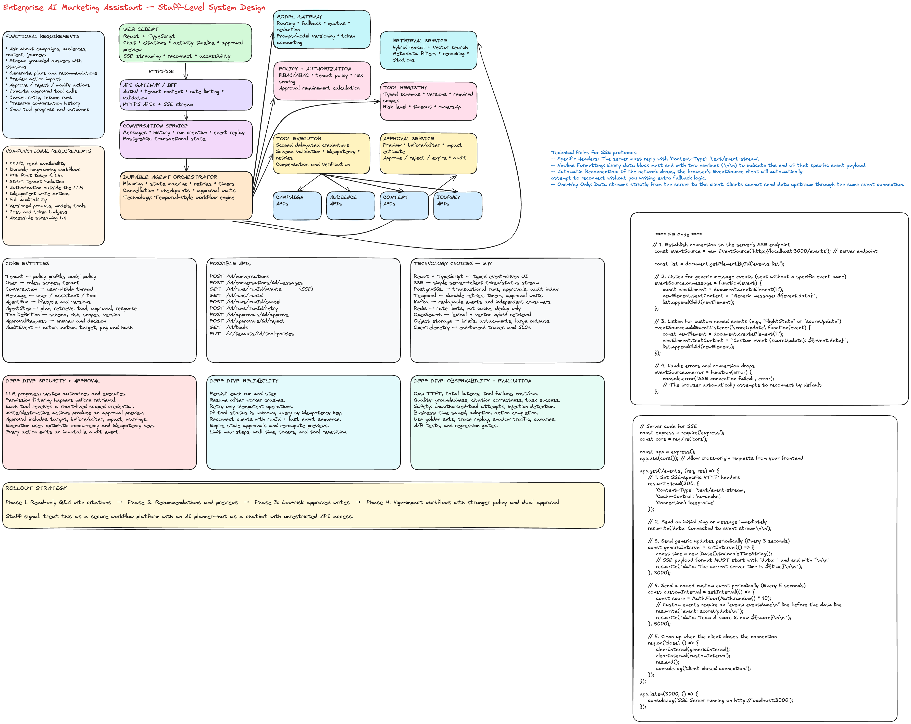

# Design an Enterprise AI Marketing Assistant

## 1. Interview Prompt

Design an AI assistant that lets marketers:

- Ask questions about campaigns, audiences, content, and customer journeys.
- Receive grounded answers with citations.
- Generate recommendations and previews.
- Take approved actions such as creating a segment, pausing a campaign, changing a budget, scheduling content, or updating a journey.
- Review, approve, reject, or modify risky actions before execution.

The system must be secure, multi-tenant, observable, resilient, and suitable for enterprise use.

---

# 2. How I Would Frame the Problem in the Interview

I would start by separating the product into two modes:

1. **Read and explain**
   - “Why did campaign conversion drop last week?”
   - “Which audience segment had the highest engagement?”
   - “Show me underperforming journey steps.”
   - “Find content that matches this campaign brief.”

2. **Plan and act**
   - “Create a high-intent audience from visitors who viewed pricing twice.”
   - “Pause the campaign if spend exceeds the threshold.”
   - “Generate three content variants and schedule the approved one.”
   - “Update the journey to add a reminder email after two days.”

This separation matters because read paths and write paths have different risk, latency, authorization, and approval requirements.

---

# 3. Functional Requirements

## Core user capabilities

- Ask natural-language questions.
- Stream partial responses.
- Retrieve campaign, audience, content, and journey data.
- Show citations and data provenance.
- Explain reasoning at a user-safe summary level.
- Generate recommendations and structured action plans.
- Preview action impact before execution.
- Require approval for write or destructive actions.
- Execute approved actions through product APIs.
- Track status for long-running actions.
- Cancel an active run.
- Retry failed steps safely.
- Preserve conversation history.
- Support follow-up questions with context.
- Allow users to inspect tool calls and action results.
- Allow users to correct or reject assistant recommendations.

## Administrative capabilities

- Configure available tools by tenant.
- Configure model and prompt versions.
- Define approval policies.
- Define role-based access controls.
- Set data retention policies.
- Inspect audit logs.
- View quality, latency, safety, and cost dashboards.
- Roll out new models or prompts with canaries.

---

# 4. Non-Functional Requirements

## Availability and reliability

- Read-only Q&A availability target: **99.9%**.
- Action execution availability target: **99.95%** for accepted jobs.
- Agent runs must survive service restarts.
- Tool execution should use retries only when operations are idempotent.
- No duplicate campaign, audience, content, or journey mutations.

## Performance

- Time to first token: **under 1.5 seconds** at P95 for cached or simple requests.
- Grounded answer completion: **under 8 seconds** at P95 for normal queries.
- Approval preview generation: **under 5 seconds** at P95.
- Long-running actions should return a run ID immediately and update asynchronously.

## Security

- Strict tenant isolation.
- Authorization enforced outside the LLM.
- Tool allowlists and scoped delegated credentials.
- Encryption in transit and at rest.
- Sensitive fields redacted before model calls.
- Every write operation logged with actor, intent, inputs, result, and approval.

## Correctness and trust

- Answers must include source references.
- The model must not invent unavailable metrics.
- Tool inputs must be schema validated.
- High-risk actions require explicit approval.
- Every agent run must be reproducible enough for debugging using versioned prompts, tools, and models.

## Scalability

Example assumptions:

- 50,000 enterprise tenants.
- 5 million daily assistant requests.
- 10% of requests trigger tools.
- 2% trigger write actions.
- Peak load: 2,000 requests per second.
- Some analytical queries scan billions of events through downstream analytics systems.

## Cost

- Route simple requests to cheaper models.
- Limit context size.
- Cache reusable retrieval results.
- Enforce tenant budgets and per-run token limits.
- Stop loops after a maximum number of steps.

---

# 5. Core Entities

```ts
type RiskLevel = 'read' | 'write' | 'destructive';

interface Tenant {
  id: string;
  name: string;
  policyProfileId: string;
  modelPolicyId: string;
}

interface User {
  id: string;
  tenantId: string;
  roles: string[];
  delegatedScopes: string[];
}

interface Conversation {
  id: string;
  tenantId: string;
  createdBy: string;
  title?: string;
  createdAt: string;
  updatedAt: string;
}

interface Message {
  id: string;
  conversationId: string;
  role: 'user' | 'assistant' | 'tool';
  content: string;
  citations?: Citation[];
  createdAt: string;
}

interface AgentRun {
  id: string;
  conversationId: string;
  tenantId: string;
  userId: string;
  status:
    | 'queued'
    | 'planning'
    | 'retrieving'
    | 'waiting_for_tool'
    | 'waiting_for_approval'
    | 'executing'
    | 'completed'
    | 'failed'
    | 'cancelled';
  modelVersion: string;
  promptVersion: string;
  startedAt: string;
  completedAt?: string;
}

interface AgentStep {
  id: string;
  runId: string;
  sequence: number;
  type: 'plan' | 'retrieve' | 'tool_call' | 'approval' | 'response';
  status: 'pending' | 'running' | 'completed' | 'failed' | 'cancelled';
  input: unknown;
  output?: unknown;
  idempotencyKey?: string;
  attempt: number;
}

interface ToolDefinition {
  id: string;
  name: string;
  version: string;
  riskLevel: RiskLevel;
  inputSchema: object;
  outputSchema: object;
  requiredScopes: string[];
  timeoutMs: number;
}

interface ApprovalRequest {
  id: string;
  runId: string;
  stepId: string;
  actionType: string;
  preview: unknown;
  riskLevel: RiskLevel;
  status: 'pending' | 'approved' | 'rejected' | 'expired';
  requestedBy: string;
  decidedBy?: string;
  expiresAt: string;
}

interface AuditEvent {
  id: string;
  tenantId: string;
  actorId: string;
  runId?: string;
  action: string;
  targetType?: string;
  targetId?: string;
  requestId: string;
  payloadHash: string;
  result: 'success' | 'failure' | 'rejected';
  createdAt: string;
}
```

---

# 6. Proposed APIs

## Conversations

```http
POST /v1/conversations
GET  /v1/conversations/:conversationId
GET  /v1/conversations/:conversationId/messages
```

## Submit a user message

```http
POST /v1/conversations/:conversationId/messages
Idempotency-Key: <uuid>

{
  "content": "Why did conversion fall for the summer campaign?",
  "attachments": []
}
```

Response:

```json
{
  "messageId": "msg_123",
  "runId": "run_123",
  "streamUrl": "/v1/runs/run_123/events"
}
```

## Stream run events

```http
GET /v1/runs/:runId/events
Accept: text/event-stream
```

Example events:

```text
event: status
data: {"status":"retrieving"}

event: citation
data: {"sourceId":"campaign_analytics_2026_07_01"}

event: token
data: {"sequence":12,"text":"Conversion declined primarily because..."}

event: approval_required
data: {"approvalId":"apr_123","riskLevel":"write"}

event: done
data: {"status":"completed"}
```

## Approval APIs

```http
POST /v1/approvals/:approvalId/approve
POST /v1/approvals/:approvalId/reject
```

Approve body:

```json
{
  "expectedVersion": 3,
  "comment": "Approved after reviewing forecast impact"
}
```

## Run control

```http
GET  /v1/runs/:runId
POST /v1/runs/:runId/cancel
POST /v1/runs/:runId/retry
```

## Tool administration

```http
GET  /v1/tools
POST /v1/tools/:toolId/test
PUT  /v1/tenants/:tenantId/tool-policies
```

---

# 7. High-Level Architecture

```text
┌─────────────────────────────────────────────────────────────────────┐
│ Web Client: React + TypeScript                                     │
│ Chat, streaming UI, citations, tool progress, approval preview     │
└──────────────────────────────┬──────────────────────────────────────┘
                               │ HTTPS + SSE
┌──────────────────────────────▼──────────────────────────────────────┐
│ API Gateway / BFF                                                  │
│ AuthN, rate limiting, request validation, tenant context            │
└──────────────────────────────┬──────────────────────────────────────┘
                               │
┌──────────────────────────────▼──────────────────────────────────────┐
│ Conversation Service                                               │
│ Messages, run creation, history, streaming event fan-out           │
└──────────────────────────────┬──────────────────────────────────────┘
                               │ command
┌──────────────────────────────▼──────────────────────────────────────┐
│ Durable Agent Orchestrator                                         │
│ State machine, planning, retries, cancellation, checkpoints         │
└───────┬──────────────┬──────────────┬──────────────┬────────────────┘
        │              │              │              │
        ▼              ▼              ▼              ▼
┌──────────────┐ ┌──────────────┐ ┌──────────────┐ ┌───────────────┐
│ Model Gateway│ │ Retrieval    │ │ Policy &     │ │ Tool Registry │
│ Routing,     │ │ Hybrid search│ │ Authorization│ │ Schemas, risk │
│ fallback     │ │ reranking    │ │ approvals    │ │ and versions  │
└──────┬───────┘ └──────┬───────┘ └──────┬───────┘ └──────┬────────┘
       │                │                │                 │
       ▼                ▼                ▼                 ▼
  LLM Providers    Vector + Search   IAM / RBAC / ABAC   Tool Executor
                                                            │
                         ┌──────────────────────────────────┼───────────┐
                         ▼                                  ▼           ▼
                  Campaign APIs                      Audience APIs  Journey APIs
                         │                                  │           │
                         └───────────────────┬──────────────┴───────────┘
                                             ▼
                                      Product data systems

Cross-cutting:
- PostgreSQL for transactional state
- Kafka for durable domain events
- Redis for ephemeral cache and rate limiting
- Object storage for attachments and large tool results
- OpenTelemetry for traces, metrics, and logs
- Analytics warehouse for offline evaluation
```

---

# 8. Technology Choices and Why

## React + TypeScript

Why:

- Strong fit for complex interactive enterprise web applications.
- TypeScript provides precise contracts for run events, tool previews, and approval states.
- React supports incremental streaming UI and component-level error boundaries.

Deep dive:

The UI should not treat the assistant response as one large string. It should model the run as structured events:

```ts
type RunEvent =
  | { type: 'status'; status: AgentRun['status'] }
  | { type: 'token'; sequence: number; text: string }
  | { type: 'citation'; citation: Citation }
  | { type: 'tool_started'; toolName: string }
  | { type: 'tool_completed'; toolName: string; summary: string }
  | { type: 'approval_required'; approval: ApprovalRequest }
  | { type: 'error'; code: string; message: string }
  | { type: 'done' };
```

This makes the UX observable, resumable, accessible, and easier to debug.

## SSE for response streaming

Why SSE:

- The dominant real-time direction is server-to-client.
- Built-in browser reconnection behavior.
- Simpler than maintaining bidirectional WebSocket sessions.
- HTTP endpoints can handle submit, cancel, approve, and reject.

Choose WebSocket instead when:

- Collaborative editing or presence is required.
- Both client and server continuously exchange high-frequency events.
- The product requires one persistent bidirectional channel.

## PostgreSQL for transactional state

Use PostgreSQL for:

- Conversations
- Messages
- Agent runs
- Agent steps
- Approval requests
- Tool metadata
- Audit indexes

Why:

- Strong transactions.
- Clear relational integrity.
- Easy querying for operational support.
- JSONB allows structured tool payloads without making all entities schemaless.

Do not use a vector database as the source of truth for conversations or approvals.

## Kafka for durable events

Use Kafka for:

- Run state changes
- Tool execution events
- Audit pipeline
- Analytics and evaluation events
- Asynchronous notifications

Why:

- Durable, replayable event log.
- Multiple independent consumers.
- Decouples execution from observability and analytics.

Trade-off:

Kafka adds operational complexity. A smaller system could start with a transactional outbox and managed queue, then evolve when replay and multiple consumers become important.

## Durable workflow engine

Recommended options:

- Temporal
- AWS Step Functions for a cloud-specific implementation
- A custom state machine only when requirements are very constrained

Why Temporal-style workflows:

- Checkpointed state.
- Retries and timeouts.
- Cancellation.
- Long-running approval waits.
- Recovery after worker failure.
- Deterministic workflow history.

This is a better fit than keeping an agent loop inside a single HTTP request.

## Redis

Use only for:

- Rate limiting
- Short-lived session state
- Hot metadata cache
- Distributed locks where unavoidable
- Deduplicating concurrent retrieval requests

Do not store durable approval state only in Redis.

## Search and vector retrieval

Use hybrid retrieval:

- Lexical search for identifiers, campaign names, SKUs, and exact terminology.
- Vector search for semantic similarity.
- Metadata filtering for tenant, product, date, and permissions.
- Reranking for final relevance.

Possible technologies:

- OpenSearch or Elasticsearch for lexical and vector search.
- PostgreSQL with `pgvector` at lower scale.
- Dedicated vector systems only when scale or retrieval patterns justify them.

## Object storage

Use object storage for:

- Uploaded briefs.
- Large generated content.
- Tool outputs.
- Evaluation traces.
- Snapshots.

Store references and metadata in PostgreSQL.

## OpenTelemetry

Trace a request across:

```text
browser
→ BFF
→ conversation service
→ workflow
→ retrieval
→ model
→ tool execution
→ product API
```

Key trace attributes:

- tenant ID
- run ID
- tool name and version
- model and prompt version
- token counts
- retrieval source IDs
- approval ID
- failure class

Never log raw sensitive prompt content by default.

---

# 9. Agent Orchestration Deep Dive

## Why not let the LLM control everything?

The model should recommend and produce structured plans, but it should not be the security or transaction boundary.

Use this pattern:

```text
LLM proposes
→ Policy engine validates
→ Authorization service checks
→ Schema validator validates
→ Approval service gates
→ Tool executor performs
→ Audit service records
```

## State machine

```text
QUEUED
  ↓
PLANNING
  ↓
RETRIEVING
  ↓
RESPONDING ───────────────→ COMPLETED
  ↓
TOOL_PROPOSED
  ↓
POLICY_CHECK
  ├── denied ─────────────→ FAILED
  ├── read-only ──────────→ EXECUTING
  └── approval required ──→ WAITING_FOR_APPROVAL
                               ├── rejected → COMPLETED
                               └── approved → EXECUTING
                                                  ↓
                                              VERIFYING
                                                  ↓
                                              COMPLETED
```

## Loop prevention

- Maximum number of tool steps.
- Maximum total tokens.
- Maximum wall-clock duration.
- Duplicate action detection.
- Repeated-state detection.
- Per-tool execution count.
- Abort when the planner produces no progress.

---

# 10. Authorization and Approval Deep Dive

## Authorization

Every request carries:

- tenant ID
- user ID
- roles
- scopes
- data classification
- product entitlements

The tool executor requests a short-lived delegated token scoped to:

- one tenant
- one user
- one tool
- one action
- one expiration window

The tool should reject the call independently if the scope is insufficient.

## Approval policy

Example policy:

```ts
function requiresApproval(tool: ToolDefinition, context: ActionContext): boolean {
  if (tool.riskLevel === 'destructive') return true;
  if (tool.riskLevel === 'write' && context.estimatedImpact > 100_000) {
    return true;
  }
  return context.tenantPolicy.requireApprovalForWrites;
}
```

Approval previews should include:

- Intended action
- Target objects
- Before and after values
- Estimated impact
- Validation warnings
- Expiration time
- Rollback availability

Use optimistic concurrency when executing after approval so the action does not apply to stale state.

---

# 11. Retrieval and Grounding Deep Dive

## Retrieval pipeline

```text
User question
→ intent classification
→ permission-aware query builder
→ lexical + semantic retrieval
→ metadata filtering
→ reranking
→ context compression
→ answer generation
→ citation verification
```

## Sources

- Campaign metadata
- Audience definitions
- Content catalog
- Journey definitions
- Analytics aggregates
- Experiment results
- Product documentation
- Approved organizational knowledge

## Important rule

Retrieve only data the user could access directly. Filtering after retrieval is too late because unauthorized information may already be included in model context.

## Structured analytics

For numerical questions, prefer a query tool over pure document retrieval:

```text
“Why did conversion fall?”
→ generate constrained analytics query
→ validate dimensions and measures
→ execute against semantic layer
→ return structured result
→ generate explanation with citations
```

This reduces hallucination and keeps metrics consistent.

---

# 12. Tool Execution Deep Dive

## Tool contract

```ts
interface ToolContext {
  tenantId: string;
  userId: string;
  delegatedScopes: string[];
  requestId: string;
  idempotencyKey: string;
  signal: AbortSignal;
}

type ToolResult<T> =
  | { status: 'success'; data: T; version: string }
  | { status: 'needs_approval'; preview: unknown }
  | { status: 'retryable_error'; code: string }
  | { status: 'permanent_error'; code: string };

interface AgentTool<I, O> {
  definition: ToolDefinition;
  execute(input: I, context: ToolContext): Promise<ToolResult<O>>;
}
```

## Idempotency

Every write call receives an idempotency key derived from:

```text
tenant + run + step + tool + normalized input
```

The downstream system stores the key and returns the original result for retries.

## Partial failure

Example:

- Audience creation succeeds.
- Journey update fails.
- Campaign launch has not started.

The workflow should:

1. Record each step separately.
2. Avoid pretending the entire workflow failed without side effects.
3. Offer a compensating action if safe.
4. Surface completed and failed steps.
5. Resume from the latest durable checkpoint.

---

# 13. Frontend Deep Dive

## UI regions

- Conversation list
- Message timeline
- Streaming answer
- Citation panel
- Tool activity timeline
- Approval card
- Action result summary
- Run history
- Feedback controls

## Avoid rerendering on every token

Batch incoming token chunks:

```ts
function createTokenBatcher(flush: (value: string) => void) {
  let buffer = '';
  let frameId: number | null = null;

  return (chunk: string) => {
    buffer += chunk;

    if (frameId !== null) return;

    frameId = requestAnimationFrame(() => {
      flush(buffer);
      buffer = '';
      frameId = null;
    });
  };
}
```

## Accessibility

- Use `aria-busy` while a response is active.
- Do not announce every token to a screen reader.
- Batch live-region announcements.
- Move focus into approval dialogs only when they open.
- Return focus to the triggering control.
- Provide keyboard-accessible approve, reject, cancel, and inspect controls.
- Respect reduced motion.
- Preserve readable status labels independent of color.

---

# 14. Reliability and Failure Modes

## Model timeout

- Retry through the model gateway if safe.
- Fall back to another compatible model.
- Preserve retrieved context and run state.
- Inform the user when a fallback model was used if relevant.

## Retrieval failure

- Return a partial answer only if clearly labeled.
- Avoid generating confident conclusions without source data.
- Retry individual retrieval backends independently.

## Tool timeout

- Mark the step as unknown until the downstream system confirms status.
- Query the downstream operation by idempotency key before retrying.
- Never blindly replay a potentially completed write.

## Approval expires

- Recompute the preview.
- Recheck current object versions.
- Ask for approval again.

## Client disconnects

- Continue durable execution.
- Let the client reconnect using the run ID and last event sequence.
- Replay missed events.

## Poisoned or malicious retrieved content

- Treat retrieved documents as data, not instructions.
- Isolate system instructions.
- Sanitize tool-call candidates.
- Enforce tool allowlists and policy checks outside the model.

---

# 15. Observability and Evaluation

## Operational metrics

- Requests per second
- Time to first token
- Total run latency
- Model latency
- Retrieval latency
- Tool latency
- Tool failure rate
- Approval wait time
- Cancellation rate
- Token usage
- Cost per successful run
- Cache hit rate

## Quality metrics

- Task completion rate
- Groundedness
- Citation correctness
- Tool selection accuracy
- Tool argument accuracy
- User correction rate
- Approval rejection rate
- Hallucination rate
- Repeat-query rate
- Business outcome improvement

## Evaluation strategy

- Curated golden datasets.
- Offline replay of real traces with sensitive data removed.
- Adversarial prompt-injection tests.
- Shadow traffic.
- Prompt and model canaries.
- A/B experiments.
- Human review for high-risk use cases.
- Regression gates before rollout.

---

# 16. Multi-Tenancy

Use tenant context at every layer:

```text
request
→ auth token
→ BFF tenant context
→ database row-level policy
→ retrieval metadata filter
→ tool credential scope
→ audit event
```

Options:

- Shared database with tenant-keyed rows and row-level security.
- Dedicated database for highly regulated customers.
- Dedicated encryption keys per tenant.
- Per-tenant model and retention configuration.

Avoid relying only on application-level `WHERE tenant_id = ...` checks.

---

# 17. Rollout Strategy

## Phase 1: Read-only

- Campaign and journey Q&A.
- Citations.
- Analytics explanations.
- No writes.

## Phase 2: Recommendations

- Generate plans and previews.
- No automatic execution.
- Collect approval intent and feedback.

## Phase 3: Low-risk writes

- Create drafts.
- Save audience definitions.
- Generate content variants.
- Require explicit approval.

## Phase 4: Higher-impact workflows

- Pause campaigns.
- Change budgets.
- Publish content.
- Modify live journeys.
- Add dual approval or policy thresholds.

This sequencing reduces risk and creates evaluation data before enabling consequential actions.

---

# 18. Important Trade-Offs

| Decision           | Choice                  | Why                                       | Trade-off                                                    |
| ------------------ | ----------------------- | ----------------------------------------- | ------------------------------------------------------------ |
| Streaming          | SSE                     | Simple server-to-client stream            | Less suitable for high-frequency bidirectional collaboration |
| Durable execution  | Workflow engine         | Retries, timers, approval waits, recovery | Operational complexity                                       |
| Primary store      | PostgreSQL              | Transactions and relational integrity     | Horizontal scaling requires planning                         |
| Retrieval          | Hybrid search           | Exact terms plus semantic similarity      | More complex ranking pipeline                                |
| Agent architecture | Orchestrator plus tools | Clear policy and execution boundaries     | More components than a single prompt                         |
| Writes             | Approval-gated          | Enterprise trust and safety               | Slower user workflow                                         |
| Events             | Kafka                   | Replay and independent consumers          | Operational cost                                             |
| Model access       | Central gateway         | Routing, policy, budgets, fallbacks       | Additional hop                                               |
| Multi-agent        | Use selectively         | Domain specialization                     | Coordination cost and error propagation                      |

---

# 19. When to Use Multiple Agents

Use multiple agents only when:

- Domains require different tools or policies.
- Teams independently own domain behavior.
- Tasks can be decomposed with explicit contracts.
- Separate evaluation is useful.

Example:

```text
Coordinator
├── Campaign Analysis Agent
├── Audience Agent
├── Content Agent
└── Journey Agent
```

Do not create multiple agents merely to simulate organizational roles. Start with one orchestrator and a strong tool layer. Add specialized agents when domain boundaries are real.

---

# 20. Staff-Level Signals to Emphasize

A Staff-level answer should show:

- Clear separation between model intelligence and system authority.
- Product thinking around trust, approvals, and user experience.
- Multi-tenant security.
- Durable workflows instead of request-scoped loops.
- Observability and evaluation from day one.
- Intentional rollout from read-only to high-risk writes.
- Organizational ownership of tools and contracts.
- Versioning and backward compatibility.
- Cost controls.
- A migration path from prototype to platform.

---

# 21. Five-Minute Interview Summary

> I would build this as a secure enterprise agent platform, not a chatbot wrapped around product APIs. The React client streams structured run events over SSE and shows citations, tool activity, and approval previews. A conversation service creates durable agent runs. A workflow engine orchestrates planning, retrieval, tool calls, retries, cancellation, and long-lived approval waits. A model gateway handles routing, fallbacks, redaction, quotas, and versioning. Retrieval is hybrid and permission-aware, while analytical questions use a governed semantic query layer. Every tool has a typed schema, risk level, scope requirements, timeout, and idempotency behavior. Authorization and approval are enforced outside the LLM. PostgreSQL stores transactional state, Kafka carries durable events, Redis supports ephemeral caching and rate limits, and OpenTelemetry provides end-to-end traces. I would launch read-only Q&A first, then recommendations, then low-risk approved actions, and finally higher-impact workflows after evaluation quality is proven.

---

# 22. Likely Follow-Up Questions

1. Why is a workflow engine necessary?
2. Why SSE instead of WebSocket?
3. How do you prevent duplicate actions?
4. How do you enforce tenant isolation?
5. How do you evaluate groundedness?
6. How do you prevent prompt injection?
7. How do you resume after a worker crash?
8. How do you handle stale approvals?
9. How do you design tool versioning?
10. When would you use multiple agents?
11. How do you keep model cost under control?
12. How do you support user cancellation?
13. What happens when the tool succeeds but the response is lost?
14. How do you roll back an action?
15. How do you make the UI accessible while streaming?
