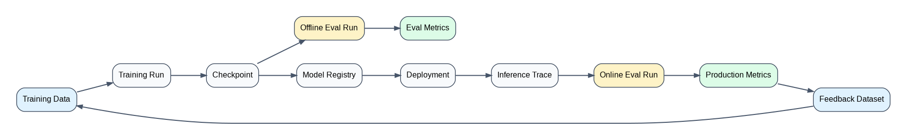
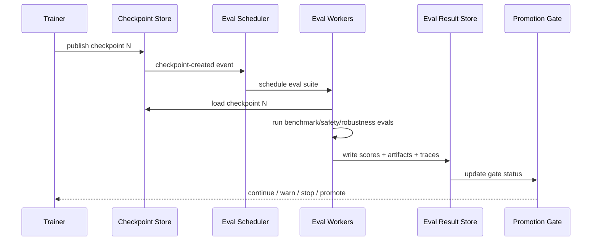
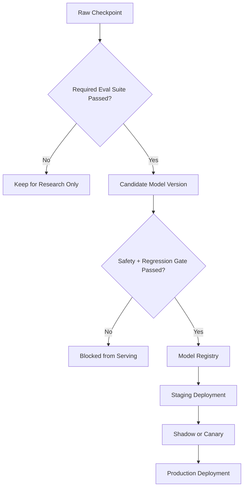
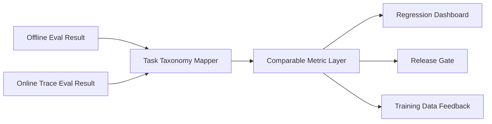
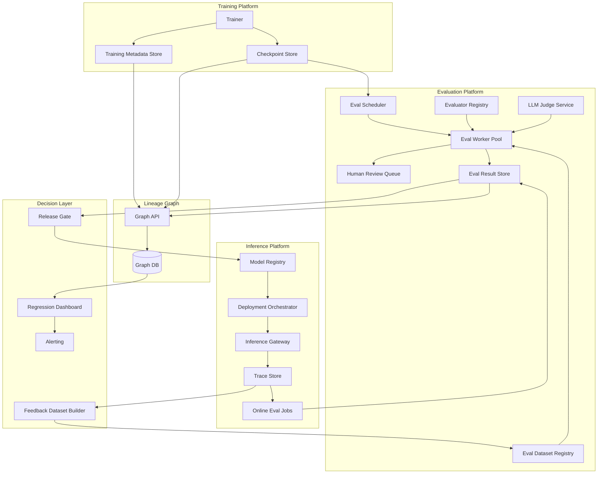
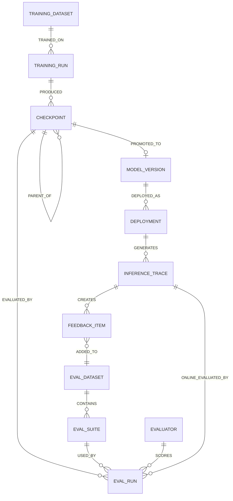
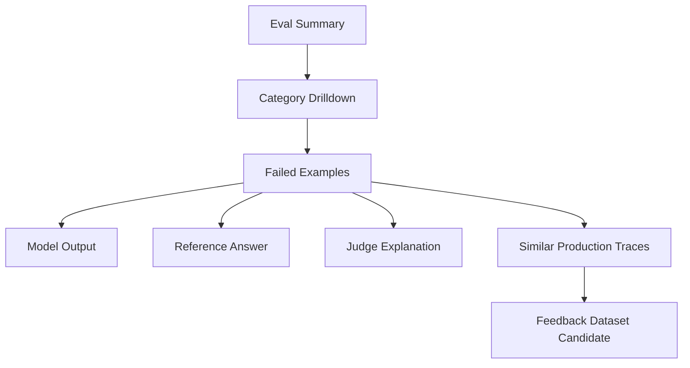

# Designing Model Evaluation for LLM Training

## Interview Prompt

You are a staff engineer leading an LLM platform team. Design a **Model Evaluation system for LLM training** that helps researchers, ML engineers, and platform owners answer:

- Is this training run improving the model, or only overfitting benchmark sets?
- Which dataset, checkpoint, alignment stage, or hyperparameter change caused quality movement?
- Is the model safe enough to progress from pre-training to supervised fine-tuning, RLHF/DPO, staging, and production?
- How is training-time evaluation different from inference-time evaluation?
- How can both evaluation worlds be compared in one system?

The expected output is a high-level architecture with data collection strategy, graph model, evaluation workflow, comparison framework, tradeoffs, and operational concerns.

---

## 1. Executive Summary

Training-time model evaluation measures the **model artifact while it is being created**. It answers whether a checkpoint, training recipe, dataset mix, fine-tuning method, or alignment step improved model capability, safety, robustness, and efficiency.

Inference-time model evaluation measures the **deployed model while it is being used**. It answers whether the served model, prompt, retrieval context, tool chain, policy layer, and production traffic are producing acceptable user-facing behavior.

A mature LLM platform should not treat these as separate systems. It should connect them through a shared evaluation graph:



The core design principle is:

> Every evaluation result must be traceable to the exact model artifact, dataset version, prompt/template, evaluator version, judging rubric, runtime configuration, and production context that produced it.

This mirrors common evaluation workflows where teams create datasets, define evaluators, run experiments, and analyze results; modern LLM platforms also evaluate production traces using deterministic evaluators, LLM judges, human review, and pairwise comparison. See OpenAI's eval workflow, LangSmith's evaluation workflow, Phoenix LLM evals, and MLflow trace evaluation for current examples of this pattern. [OpenAI Evals](https://developers.openai.com/api/docs/guides/evals), [LangSmith Evaluation](https://docs.langchain.com/langsmith/evaluation), [Phoenix LLM Evals](https://arize.com/docs/phoenix/evaluation/llm-evals), [MLflow Trace Evaluation](https://mlflow.org/docs/latest/genai/eval-monitor/running-evaluation/traces/)

---

## 2. Goals and Non-Goals

### Goals

- Evaluate model quality across training stages: pre-training, SFT, instruction tuning, RLHF/DPO, red-team hardening, and release candidate validation.
- Compare checkpoints across time, training recipes, datasets, and model families.
- Capture lineage from dataset -> training run -> checkpoint -> eval run -> deployment -> inference traces -> feedback dataset.
- Support multiple evaluator types: deterministic, statistical, model-based judge, human review, adversarial testing, safety classifiers, and pairwise preference.
- Detect regressions early enough to stop bad training runs or block promotion.
- Make training-time and inference-time metrics comparable without pretending they are identical.

### Non-Goals

- This design does not prescribe one benchmark as the universal source of truth.
- It does not assume LLM-as-judge is always reliable.
- It does not replace human red-team review for high-risk model launches.
- It does not optimize the training framework itself; it focuses on the evaluation platform around training.

---

## 3. Mental Model: What Is Being Evaluated?

For LLMs, a "model" is not just weights. Evaluation should distinguish these layers:

| Layer             | Training-Time Eval                                               | Inference-Time Eval                                |
| ----------------- | ---------------------------------------------------------------- | -------------------------------------------------- |
| Base weights      | Checkpoint quality, perplexity, benchmark capability             | Rarely directly visible                            |
| Alignment layer   | Helpfulness, harmlessness, refusal behavior, preference win rate | User-facing helpfulness and policy compliance      |
| Prompt/template   | Usually controlled test prompt                                   | Production prompt versions and prompt drift        |
| Retrieval context | Synthetic or curated retrieval fixtures                          | Live retrieval quality, freshness, missing context |
| Tool use          | Simulated tools or sandbox tools                                 | Real tools, latency, errors, permissions           |
| Serving stack     | Usually batch/offline runner                                     | Real serving infra, routing, cache, throttling     |
| User behavior     | Curated tasks and red-team sets                                  | Real traffic, feedback, abuse patterns             |

A staff-level design should explicitly separate **model intrinsic quality** from **application/system quality**.

---

## 4. Evaluation Lifecycle During Training

### Stage 1: Define Release Criteria

Before training starts, define the decision gates:

| Gate                    | Example Question                                        | Example Signal                                         |
| ----------------------- | ------------------------------------------------------- | ------------------------------------------------------ |
| Checkpoint continuation | Should we keep training?                                | Loss curve, validation perplexity, benchmark trend     |
| SFT readiness           | Is the base model instruction-ready?                    | Instruction-following eval, formatting accuracy        |
| Alignment readiness     | Is the model safe/helpful enough for preference tuning? | Safety eval, refusal calibration, toxicity rate        |
| Release candidate       | Can this model be deployed behind staging?              | Regression suite, red-team suite, latency/cost profile |
| Production promotion    | Can it receive real traffic?                            | Shadow traffic eval, canary quality, incident risk     |

### Stage 2: Build Eval Dataset Registry

Training-time eval depends heavily on dataset discipline. Store eval datasets as immutable, versioned artifacts.

Collect:

- Dataset ID, name, domain, owner, creation date.
- Dataset version and hash.
- Source type: benchmark, curated internal set, synthetic set, production feedback, red-team set.
- License, privacy classification, retention policy.
- Task category: reasoning, coding, math, summarization, retrieval, tool use, safety, multilingual, domain-specific.
- Difficulty level and expected answer style.
- Gold labels, reference answers, rubrics, or preference pairs.
- Contamination risk: whether examples may exist in training data.
- Evaluation split policy: public, private, hidden, canary, adversarial.

### Stage 3: Run Continuous Checkpoint Evaluation

During long training jobs, checkpoint evaluation should run asynchronously:



Key design choice: **evaluation must not block training by default**, but gate-sensitive evals should be able to stop or pause a run when hard thresholds fail.

### Stage 4: Compare Checkpoints

Checkpoint comparison should support:

- Latest checkpoint vs previous checkpoint.
- Candidate checkpoint vs baseline production model.
- Fine-tuned model vs parent base model.
- New training data mix vs old training data mix.
- New alignment method vs old alignment method.
- Model family comparison across size, cost, latency, and quality.

Use statistical confidence intervals where possible. Do not overreact to tiny movements in noisy LLM-judge scores.

### Stage 5: Promote to Registry

Only promoted checkpoints should become first-class model artifacts:



---

## 5. What Data Should Be Collected?

### 5.1 Training Run Metadata

| Data                              | Why It Matters                                           |
| --------------------------------- | -------------------------------------------------------- |
| Training run ID                   | Primary join key for lineage                             |
| Model family and architecture     | Compare similar models correctly                         |
| Base model / parent checkpoint    | Attribute improvements to fine-tuning vs base capability |
| Code version / container image    | Reproducibility                                          |
| Framework version                 | Debug infra-induced behavior changes                     |
| Hyperparameters                   | Explain quality movement                                 |
| Dataset mix                       | Attribute capability/safety changes                      |
| Token count and step count        | Normalize progress                                       |
| Hardware type and cluster         | Cost/performance analysis                                |
| Random seed                       | Reproducibility and variance tracking                    |
| Training loss and validation loss | Early health signal                                      |
| Failure/restart events            | Detect corrupted or partial runs                         |

### 5.2 Checkpoint Metadata

| Data                        | Why It Matters                           |
| --------------------------- | ---------------------------------------- |
| Checkpoint ID and hash      | Immutable identity                       |
| Parent checkpoint           | Lineage graph                            |
| Step number and token count | Compare at equal training progress       |
| Artifact location           | Loading and reproducibility              |
| Quantization or precision   | Eval parity with serving                 |
| Adapter/LoRA metadata       | Distinguish full model vs adapter        |
| Promotion status            | Research, candidate, staging, production |
| Known limitations           | Human-readable release notes             |

### 5.3 Eval Suite Metadata

| Data                      | Why It Matters                              |
| ------------------------- | ------------------------------------------- |
| Eval suite ID and version | Comparable historical results               |
| Dataset versions          | Prevent accidental benchmark drift          |
| Evaluator code version    | Reproduce score changes                     |
| Prompt/template version   | LLM evals are prompt-sensitive              |
| Judge model version       | LLM-as-judge drift control                  |
| Rubric version            | Human/judge scoring consistency             |
| Sampling config           | Temperature/top-p/max tokens affect outputs |
| Runtime config            | Batch size, timeout, retry, hardware        |
| Cost and latency          | Release decision and serving estimate       |

### 5.4 Per-Example Eval Records

For each eval example, store:

- Input prompt/messages.
- Expected output, reference answer, rubric, or preference pair.
- Model output.
- Token counts: input, output, reasoning/tool tokens if available.
- Latency and error status.
- Evaluator score and explanation.
- Judge model response, if LLM-as-judge is used.
- Human label, reviewer ID or anonymized reviewer group, review timestamp.
- Safety labels: harmful, policy violation, refusal correct/incorrect.
- Failure category: hallucination, incomplete answer, unsafe compliance, over-refusal, tool error, formatting error, reasoning error.
- Trace ID linking to execution details.

### 5.5 Inference Trace Data for Comparison

To compare training eval with production behavior, collect inference traces:

- Request ID, session/conversation ID, timestamp.
- Model version and deployment ID.
- Prompt/template version.
- System/developer/user messages, with privacy-aware redaction.
- Retrieval query, retrieved documents, document versions, freshness.
- Tool calls, parameters, return values, errors.
- Final answer.
- Latency, cost, token usage, cache hit/miss.
- User feedback: thumbs up/down, correction, abandonment, regeneration.
- Policy/safety classifier decisions.
- Online evaluator scores.
- Incident or escalation linkage.

---

## 6. Training-Time Eval vs Inference-Time Eval

| Dimension          | Training-Time Model Eval                                                 | Inference-Time Model Eval                                                           |
| ------------------ | ------------------------------------------------------------------------ | ----------------------------------------------------------------------------------- |
| Main question      | Is the model artifact improving?                                         | Is the deployed system working for users?                                           |
| Unit of analysis   | Checkpoint, model version, training recipe                               | Request, session, user task, deployment                                             |
| Data source        | Curated eval sets, benchmarks, synthetic tests, red-team sets            | Production traces, shadow traffic, user feedback, canary traffic                    |
| Control level      | High control: fixed prompts, fixed datasets, fixed judges                | Lower control: real traffic, changing prompts, tools, retrieval, user behavior      |
| Primary risks      | Overfitting, benchmark contamination, unsafe capability gain, regression | Prompt drift, retrieval failure, tool failure, latency, abuse, user dissatisfaction |
| Evaluation cadence | Every checkpoint, every candidate, before promotion                      | Continuous, sampled, triggered by incidents or drift                                |
| Metrics            | Accuracy, win rate, pass@k, safety score, perplexity, calibration        | Task success, satisfaction, violation rate, latency, cost, escalation rate          |
| Comparability      | Strong if eval suite is fixed                                            | Harder because traffic distribution changes                                         |
| Decision           | Continue, stop, tune, promote, block                                     | Roll back, canary expand, update prompt, patch tool, retrain                        |

The key difference: training-time eval tries to isolate the **model**, while inference-time eval measures the **model-in-system**.

---

## 7. How to Compare Training Eval and Inference Eval

Do not compare raw numbers blindly. Instead, compare them through a mapping layer.

### 7.1 Shared Taxonomy

Create a shared task taxonomy:

```ts
type EvalTaskCategory =
  | 'reasoning'
  | 'coding'
  | 'math'
  | 'summarization'
  | 'rag_grounded_qa'
  | 'tool_use'
  | 'safety_refusal'
  | 'policy_compliance'
  | 'multilingual'
  | 'domain_specific';
```

Both offline eval examples and online traces should map to this taxonomy.

### 7.2 Calibration Datasets

Create calibration datasets from production traces:

1. Sample production traffic.
2. Remove or redact sensitive data.
3. Human-label or rubric-label the examples.
4. Freeze them as an offline eval dataset.
5. Run future checkpoints against the frozen set.

This creates a bridge between production reality and training repeatability.

### 7.3 Metric Mapping

| Training Metric            | Inference Metric                          | Comparison Method                                                          |
| -------------------------- | ----------------------------------------- | -------------------------------------------------------------------------- |
| Benchmark accuracy         | Task success rate                         | Compare by task category, not global average                               |
| Safety refusal correctness | Policy violation / over-refusal rate      | Compare confusion matrix: correct refusal, unsafe compliance, over-refusal |
| RAG groundedness eval      | Hallucination reports / citation quality  | Compare only for RAG tasks                                                 |
| Tool-use pass rate         | Tool-call success and recovery rate       | Compare tool fixtures vs real tool traces                                  |
| Judge preference win rate  | User satisfaction / human review win rate | Calibrate judge against human labels                                       |
| Latency per eval           | Production p50/p95 latency                | Normalize by model size, token count, hardware                             |

### 7.4 Comparison View



Example comparison output:

| Category | Offline Candidate vs Baseline | Online Canary vs Baseline | Interpretation                                 |
| -------- | ----------------------------: | ------------------------: | ---------------------------------------------- |
| Coding   |                  +4.2% pass@1 |        +1.1% task success | Offline gain partially transfers               |
| RAG QA   |             +1.0 groundedness |    -3.5% citation quality | Model improved, retrieval/prompt may be broken |
| Safety   |            +2.7% safe refusal |        +6.2% over-refusal | Safety improved but user experience regressed  |
| Tool use |         +5.0% fixture success |   -4.0% real tool success | Tool simulator not representative              |

---

## 8. High-Level Architecture



### Component Responsibilities

| Component                | Responsibility                                                        |
| ------------------------ | --------------------------------------------------------------------- |
| Eval Scheduler           | Receives checkpoint events and schedules required eval suites         |
| Eval Dataset Registry    | Stores immutable eval datasets and metadata                           |
| Evaluator Registry       | Stores deterministic evaluators, model judges, rubrics, and versions  |
| Eval Worker Pool         | Runs batch inference and scoring jobs                                 |
| LLM Judge Service        | Scores outputs using rubric-based judge prompts                       |
| Human Review Queue       | Routes ambiguous, high-risk, or sampled outputs to reviewers          |
| Eval Result Store        | Stores aggregate and per-example scores                               |
| Lineage Graph            | Connects data, training runs, checkpoints, evals, deployments, traces |
| Release Gate             | Applies promotion policy and blocks unsafe regressions                |
| Trace Store              | Stores production inference traces for online eval                    |
| Feedback Dataset Builder | Converts selected production failures into future offline evals       |

---

## 9. Graph Design

A graph is useful because evaluation is fundamentally about lineage and comparison:

- Which training data produced this checkpoint?
- Which checkpoint produced this deployment?
- Which eval suite failed?
- Which production incidents are linked to model versions?
- Which production failures should become eval examples?

### 9.1 Node Types

```ts
type GraphNode =
  | TrainingDataset
  | EvalDataset
  | TrainingRun
  | Checkpoint
  | ModelVersion
  | EvalSuite
  | EvalRun
  | EvalExample
  | Evaluator
  | Metric
  | Deployment
  | InferenceTrace
  | FeedbackItem
  | Incident
  | Owner;
```

### 9.2 Edge Types

```ts
type GraphEdge =
  | { type: 'TRAINED_ON'; from: 'TrainingRun'; to: 'TrainingDataset' }
  | { type: 'PRODUCED'; from: 'TrainingRun'; to: 'Checkpoint' }
  | { type: 'PARENT_OF'; from: 'Checkpoint'; to: 'Checkpoint' }
  | { type: 'EVALUATED_BY'; from: 'Checkpoint'; to: 'EvalRun' }
  | { type: 'USES_SUITE'; from: 'EvalRun'; to: 'EvalSuite' }
  | { type: 'USES_DATASET'; from: 'EvalSuite'; to: 'EvalDataset' }
  | { type: 'USES_EVALUATOR'; from: 'EvalRun'; to: 'Evaluator' }
  | { type: 'PROMOTED_TO'; from: 'Checkpoint'; to: 'ModelVersion' }
  | { type: 'DEPLOYED_AS'; from: 'ModelVersion'; to: 'Deployment' }
  | { type: 'GENERATED'; from: 'Deployment'; to: 'InferenceTrace' }
  | { type: 'EVALUATED_BY'; from: 'InferenceTrace'; to: 'EvalRun' }
  | { type: 'CREATED_FEEDBACK'; from: 'InferenceTrace'; to: 'FeedbackItem' }
  | { type: 'ADDED_TO'; from: 'FeedbackItem'; to: 'EvalDataset' }
  | { type: 'OWNED_BY'; from: 'ModelVersion'; to: 'Owner' }
  | { type: 'LINKED_TO'; from: 'InferenceTrace'; to: 'Incident' };
```

### 9.3 Graph Schema Diagram



### 9.4 Example Graph Queries

#### Query 1: Why did this model regress on safety?

```cypher
MATCH (m:ModelVersion {id: $modelVersion})<-[:PROMOTED_TO]-(c:Checkpoint)
MATCH (c)-[:EVALUATED_BY]->(er:EvalRun)-[:USES_SUITE]->(s:EvalSuite)
MATCH (er)-[:USES_EVALUATOR]->(ev:Evaluator)
WHERE s.category = 'safety'
RETURN c.id, er.score, s.version, ev.version, er.failure_breakdown
ORDER BY er.created_at DESC
```

#### Query 2: Which production failures should be added to training eval?

```cypher
MATCH (t:InferenceTrace)-[:CREATED_FEEDBACK]->(f:FeedbackItem)
WHERE f.severity IN ['high', 'critical']
  AND f.added_to_eval_dataset = false
RETURN t.model_version, f.category, f.reason, count(*)
ORDER BY count(*) DESC
```

#### Query 3: Did offline gains transfer to production?

```cypher
MATCH (m:ModelVersion {id: $modelVersion})<-[:PROMOTED_TO]-(c:Checkpoint)
MATCH (c)-[:EVALUATED_BY]->(offline:EvalRun {mode: 'offline'})
MATCH (m)-[:DEPLOYED_AS]->(d:Deployment)-[:GENERATED]->(trace:InferenceTrace)
MATCH (trace)-[:EVALUATED_BY]->(online:EvalRun {mode: 'online'})
RETURN offline.category, avg(offline.score), avg(online.score)
```

---

## 10. Storage Design

### 10.1 Recommended Stores

| Store                | Data                                                       | Why                        |
| -------------------- | ---------------------------------------------------------- | -------------------------- |
| Object Store         | Model outputs, traces, judge explanations, large artifacts | Cheap, scalable, immutable |
| OLTP DB              | Eval run metadata, status, gates, ownership                | Transactional workflow     |
| OLAP Warehouse       | Aggregated metrics, dashboards, trend analysis             | Fast analytical queries    |
| Graph DB             | Lineage and root-cause traversal                           | Relationship-heavy queries |
| Vector Store         | Similar failure clustering, semantic dedupe                | Find related failures      |
| Feature/Metric Store | Time-series quality, latency, cost                         | Monitoring and alerting    |

### 10.2 Why Graph + Warehouse, Not Only SQL?

SQL is excellent for metrics and dashboards. A graph is better for recursive lineage:

- checkpoint -> parent checkpoint -> training run -> dataset mix -> eval results -> deployment -> production incidents
- feedback item -> trace -> deployment -> model version -> eval suite gap
- model version -> owners -> downstream deployments -> impacted products

Use both:

- **Warehouse** for aggregate reporting.
- **Graph** for lineage, debugging, impact analysis, and audit.

---

## 11. Evaluation Types

### 11.1 Deterministic Evaluators

Use when correctness can be precisely checked.

Examples:

- Exact match.
- Regex match.
- JSON schema validation.
- Unit tests for code generation.
- SQL execution correctness.
- Tool-call argument validation.
- Citation presence or formatting.

Pros:

- Reproducible.
- Cheap.
- Easy to gate.

Cons:

- Poor fit for open-ended tasks.
- Can reward brittle formatting.

### 11.2 Statistical Evaluators

Examples:

- Perplexity.
- Calibration error.
- Distribution shift.
- Toxicity classifier score.
- Embedding similarity.

Pros:

- Useful during training.
- Can run at scale.

Cons:

- May not correlate with user-perceived quality.

### 11.3 LLM-as-Judge

Use when outputs are subjective or semantically rich.

Collect:

- Judge model version.
- Judge prompt version.
- Rubric version.
- Score and explanation.
- Confidence if available.
- Pairwise or absolute scoring mode.

Pros:

- Scales open-ended evaluation.
- Good for summarization, helpfulness, groundedness, preference comparison.

Cons:

- Judge drift.
- Bias toward certain writing styles.
- Vulnerable to prompt leakage or persuasive answers.
- Needs human calibration.

### 11.4 Human Review

Use for:

- High-risk safety categories.
- Ambiguous eval failures.
- Calibration samples for LLM judges.
- Launch readiness review.
- Policy-sensitive domains.

Collect inter-annotator agreement and reviewer rubric version.

### 11.5 Red-Team and Adversarial Evals

Use for:

- Jailbreak resistance.
- Prompt injection.
- Harmful instruction following.
- Data exfiltration.
- Tool misuse.
- Sensitive domain behavior.

Red-team evals should have restricted visibility and hidden test sets to reduce overfitting.

---

## 12. Metrics

### Capability Metrics

- Accuracy.
- Pass@k.
- Pairwise win rate.
- F1 / precision / recall.
- Human preference rate.
- Reasoning step correctness.
- Format compliance.

### Safety Metrics

- Unsafe compliance rate.
- Correct refusal rate.
- Over-refusal rate.
- Policy violation rate.
- Toxicity/severe toxicity rate.
- Sensitive data leakage rate.
- Jailbreak success rate.

### Robustness Metrics

- Performance under paraphrase.
- Performance under adversarial prompt.
- Performance by language/domain/difficulty.
- Consistency across seeds and temperatures.
- Sensitivity to prompt templates.

### Efficiency Metrics

- Eval cost.
- Tokens per answer.
- Latency per task.
- GPU utilization during eval.
- Memory footprint.
- Throughput.

### Transfer Metrics

- Offline-to-online correlation by task category.
- Production failure coverage in offline eval suite.
- Percent of incidents represented by eval tests.
- Canary success vs offline prediction.

---

## 13. Release Gates

A release gate should be policy-based, not hardcoded in dashboards.

```yaml
release_gate:
  model_family: customer_support_llm
  candidate: model_v42
  baseline: model_v41
  required_suites:
    - name: core_capability
      min_delta: -0.5
    - name: safety_refusal
      min_score: 0.97
    - name: pii_leakage
      max_violation_rate: 0.001
    - name: production_regression_replay
      min_delta: 0.0
  human_review_required:
    - safety_high_risk
    - legal_policy
  rollout_policy:
    staging: required
    shadow: required
    canary_max_percent: 5
```

Gate results:

| Status       | Meaning                      |
| ------------ | ---------------------------- |
| Pass         | Candidate can move forward   |
| Warn         | Allowed with owner approval  |
| Block        | Cannot promote               |
| Needs Review | Human review required        |
| Inconclusive | More samples or rerun needed |

---

## 14. Handling Eval Quality Problems

### Benchmark Contamination

Problem: the model may have seen benchmark examples during training.

Mitigations:

- Maintain hidden eval sets.
- Track contamination risk for each eval dataset.
- Use canary examples with known hashes.
- Run memorization checks.
- Prefer internal, refreshed, private eval sets for launch gates.

### Judge Drift

Problem: LLM judge version or prompt changes alter scores.

Mitigations:

- Version judge model and judge prompt.
- Maintain judge calibration sets.
- Compare judge scores against human labels.
- Freeze judge versions for release gates.
- Re-score historical outputs when judge versions change.

### Overfitting to Eval Suites

Problem: teams optimize to benchmarks instead of real quality.

Mitigations:

- Separate development evals from hidden gate evals.
- Rotate adversarial examples.
- Use production feedback replay.
- Track eval exposure and access controls.
- Monitor offline-to-online transfer.

### Non-Determinism

Problem: repeated eval runs produce different results.

Mitigations:

- Fix decoding parameters for gate evals.
- Run multiple samples for stochastic tasks.
- Store raw outputs, not only scores.
- Use confidence intervals.
- Require statistically meaningful deltas.

---

## 15. Product UX: What Should Engineers See?

### Model Evaluation Page

- Model version and parent checkpoint.
- Training run lineage.
- Current gate status.
- Scorecard by category.
- Regression summary vs baseline.
- Safety gate status.
- Top failing examples.
- Offline-to-online transfer view.
- Linked production traces and incidents.
- Dataset coverage map.
- Owner and action items.

### Example Scorecard

| Category         | Candidate | Baseline | Delta | Gate  |
| ---------------- | --------: | -------: | ----: | ----- |
| Core reasoning   |      83.2 |     81.9 |  +1.3 | Pass  |
| Coding           |      71.4 |     69.0 |  +2.4 | Pass  |
| RAG groundedness |      88.1 |     89.2 |  -1.1 | Warn  |
| Safety refusal   |      97.5 |     97.1 |  +0.4 | Pass  |
| Over-refusal     |       6.2 |      4.8 |  +1.4 | Warn  |
| Tool use         |      76.0 |     80.5 |  -4.5 | Block |

### Drilldown View



---

## 16. Operational Design

### Scalability

- Eval jobs can be expensive; schedule by priority.
- Use batch inference where possible.
- Cache deterministic eval outputs by checkpoint + dataset + prompt + decoding config.
- Run cheap smoke evals on every checkpoint and full evals on candidate checkpoints.
- Use spot/preemptible capacity for non-gating evals.

### Reliability

- Eval results must be immutable.
- Failed eval workers should retry safely.
- Partial evals should be marked incomplete, not silently aggregated.
- Gate decisions should reference exact eval run IDs.
- Dashboards should show freshness and completeness.

### Privacy and Security

- Redact sensitive production traces before turning them into eval datasets.
- Enforce access controls on red-team and policy evals.
- Store raw prompts/outputs according to retention policy.
- Audit who viewed hidden eval examples.
- Avoid leaking private eval examples into training data accidentally.

### Cost Control

- Track cost per eval suite and per model candidate.
- Downsample low-risk online traces.
- Use smaller judges for low-risk tasks and stronger judges for launch gates.
- Reuse outputs when only evaluator changes.
- Separate exploratory evals from required gates.

---

## 17. API Design

### Create Eval Run

```http
POST /eval-runs
Content-Type: application/json
```

```json
{
  "target": {
    "type": "checkpoint",
    "id": "ckpt_2026_06_06_step_80000"
  },
  "suite_id": "safety_release_gate_v12",
  "baseline_target": {
    "type": "model_version",
    "id": "prod_model_v41"
  },
  "mode": "offline",
  "sampling_config": {
    "temperature": 0,
    "max_tokens": 1024
  }
}
```

### Get Comparison

```http
GET /model-versions/{modelVersionId}/eval-comparison?baseline=prod_model_v41
```

### Promote Model

```http
POST /model-versions/{modelVersionId}/promotion-request
```

```json
{
  "target_environment": "staging",
  "required_gate": "llm_release_gate_v7",
  "requested_by": "owner@example.com"
}
```

---

## 18. Example Implementation Plan

### Phase 1: Foundation

- Eval dataset registry.
- Eval run metadata store.
- Batch eval worker.
- Basic deterministic and LLM-judge evaluators.
- Dashboard for checkpoint vs baseline comparison.

### Phase 2: Release Gates

- Policy-based gate engine.
- Safety and regression suites.
- Human review queue.
- Model registry integration.
- Immutable audit trail.

### Phase 3: Graph Lineage

- Graph schema for datasets, training runs, checkpoints, evals, deployments, traces.
- Root-cause queries.
- Offline-to-online comparison layer.
- Production feedback dataset builder.

### Phase 4: Continuous Learning Loop

- Online trace evaluation.
- Production failure clustering.
- Automatic eval dataset nomination.
- Canary prediction vs actual analysis.
- Periodic eval suite refresh.

---

## 19. Staff Engineer Tradeoffs

### Graph DB vs Relational DB

Use graph for lineage and impact analysis. Use relational/warehouse stores for metrics and aggregates. Avoid forcing all workloads into one database.

### LLM Judge vs Human Review

Use LLM judges for scale, exploration, and broad regression detection. Use human review for high-risk decisions, calibration, and final launch gates.

### Fixed Eval Suites vs Dynamic Production Replay

Fixed suites give comparability. Production replay gives realism. Use both: fixed suites for gates, replay suites for transfer measurement.

### Frequent Eval vs Cost

Run cheap evals frequently and expensive evals selectively. Not every checkpoint deserves the full launch suite.

### Aggregate Scores vs Failure Examples

Aggregate scores help leadership decisions. Failure examples help engineers fix issues. A good platform must support both.

---

## 20. Common Interview Follow-Up Questions

### Q: How do you prevent teams from gaming evals?

Use hidden gate sets, access controls, private red-team suites, production replay, contamination checks, and periodic eval refresh. Also track eval exposure: if a dataset is used heavily during development, it should not be the sole release gate.

### Q: How do you know an offline eval predicts production quality?

Measure offline-to-online transfer by category. Compare candidate-vs-baseline deltas offline with canary-vs-baseline deltas online. If a category repeatedly fails to transfer, improve the eval dataset or separate model quality from system quality.

### Q: How do you debug a regression?

Start from the failed metric, drill into examples, compare candidate and baseline outputs, inspect judge explanations, trace to checkpoint lineage, inspect training data mix changes, and search for similar production traces.

### Q: What if the model improves capability but worsens safety?

Do not average them away. Safety gates should be separate hard gates. A capability gain should not compensate for unsafe compliance, data leakage, or severe over-refusal in critical workflows.

### Q: How do you compare two models of different sizes?

Compare quality, cost, latency, and deployment constraints together. A larger model may win on quality but lose on p95 latency or cost per successful task. Use Pareto frontier views instead of a single score.

### Q: How should eval results feed training?

Convert high-confidence failures into curated training or eval datasets. Keep a strict separation between training data and hidden eval data. Production failures can become development evals, but not all should become training examples automatically.

---

## 21. Final Recommendation

Build Model Eval for LLM training as a **lineage-first evaluation platform**:

1. Treat every checkpoint as an immutable candidate artifact.
2. Evaluate continuously using versioned datasets, evaluators, prompts, rubrics, and judges.
3. Store both aggregate metrics and per-example outputs.
4. Use a graph to connect training data, checkpoints, evals, deployments, traces, feedback, and incidents.
5. Compare training-time and inference-time evals through a shared taxonomy and calibrated replay datasets.
6. Gate releases on safety, regression, and production transfer - not just benchmark gains.

The strongest design is not the one with the most metrics. It is the one that lets the organization explain, with evidence, why a model should continue training, be blocked, be promoted, or be rolled back.
