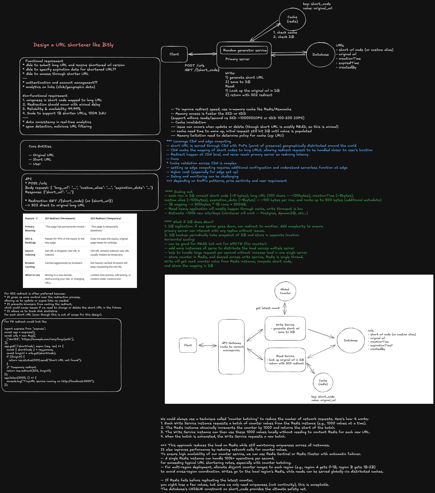

# TinyURL System Design

## Interview Goal

Design a URL-shortening service that creates short links and redirects users
to their original URLs.

The system has two distinct workloads:

- **Write path:** create, validate, and persist a short URL.
- **Read path:** resolve a short code and redirect with very low latency.

At staff level, explain scale assumptions, key generation, consistency,
caching, abuse prevention, failure recovery, observability, and how the system
evolves without breaking existing links.

## Staff-Level Checklist

- Clarify functional requirements and traffic scale.
- Define create, redirect, delete, and analytics APIs.
- Estimate read/write QPS, storage, bandwidth, and cache size.
- Select a short-code generation strategy.
- Design the durable data model and uniqueness guarantees.
- Optimize the read path with edge and application caching.
- Define redirect status codes and cache behavior.
- Handle custom aliases, expiration, deletion, and updates.
- Plan for hot links, cache stampedes, and celebrity traffic.
- Add URL validation, malware detection, quotas, and abuse controls.
- Define consistency, durability, disaster recovery, and regional behavior.
- Separate redirect serving from asynchronous analytics.
- Discuss privacy, observability, rollout, and trade-offs.

## 1. Clarify Requirements

### Functional requirements

- Create a short URL for a valid destination URL.
- Redirect a short code to its destination.
- Optionally support custom aliases.
- Optionally support expiration dates.
- Allow authenticated owners to disable or delete links.
- Return an existing short code for an idempotently retried create request.
- Collect click analytics without delaying redirects.
- Optionally show a preview or safety-warning page.

### Non-functional requirements

- Redirects should have very low latency.
- Existing links should remain durable for years.
- Reads should remain available during partial failures.
- Short codes must be unique.
- The service must handle highly skewed traffic and hot links.
- Redirect serving should scale independently from link creation.
- The system should resist phishing, malware, spam, and enumeration.

### Questions to ask

- How many links are created per second?
- How many redirects occur per second?
- How long must links remain valid?
- Are custom aliases required?
- Can a destination be changed after creation?
- Are links public, private, or organization-scoped?
- Are analytics exact or approximate?
- Is global multi-region serving required?
- Should duplicate long URLs share one short code?
- Are anonymous link creation and expiration supported?

## 2. Back-of-the-Envelope Estimates

State assumptions before selecting infrastructure.

Example:

- 1,000 link creations per second.
- 100,000 redirects per second.
- 100:1 read-to-write ratio.
- 10 years of retention.
- Approximately 300 bytes of metadata per link before replication and indexes.

```text
Links per year:
1,000 * 60 * 60 * 24 * 365
= approximately 31.5 billion

Raw metadata per year:
31.5 billion * 300 bytes
= approximately 9.45 TB
```

Also estimate:

- Peak rather than average QPS.
- Cache hit ratio.
- Redirect bandwidth.
- Analytics event volume.
- Replication and backup overhead.
- Short-code namespace capacity.

## 3. API Design

### Create a short URL

```http
POST /v1/links
Idempotency-Key: request-123
Content-Type: application/json

{
  "destinationUrl": "https://example.com/a/very/long/path",
  "customAlias": null,
  "expiresAt": null
}
```

```json
{
  "code": "aZ91Kd",
  "shortUrl": "https://t.example/aZ91Kd",
  "destinationUrl": "https://example.com/a/very/long/path",
  "createdAt": "2026-06-18T12:00:00Z"
}
```

Possible responses:

- `201 Created`: a new link was created.
- `200 OK`: an idempotent retry returns the original result.
- `400 Bad Request`: malformed or unsupported URL.
- `409 Conflict`: custom alias already exists.
- `429 Too Many Requests`: quota or abuse limit exceeded.

### Redirect

```http
GET /aZ91Kd
```

```http
HTTP/1.1 302 Found
Location: https://example.com/a/very/long/path
```

Possible responses:

- `301` or `308`: permanent redirect.
- `302` or `307`: temporary redirect.
- `404`: unknown code.
- `410`: expired or intentionally removed code.
- `451`: unavailable for legal reasons, when applicable.

### Manage a link

```http
GET    /v1/links/{code}
DELETE /v1/links/{code}
PATCH  /v1/links/{code}
GET    /v1/links/{code}/analytics
```

## 4. Redirect Status Code Decision

### Permanent redirect

Advantages:

- Browsers and CDNs can cache aggressively.
- Reduces origin traffic.

Disadvantages:

- Destination changes and takedowns propagate slowly.
- Browser caches may bypass future safety checks and analytics.

### Temporary redirect

Advantages:

- The service retains control over each redirect.
- Easier to update, disable, inspect, or measure links.

Disadvantages:

- More requests reach the redirect service.
- Requires stronger cache and serving capacity.

A common starting point is `302` or `307` when destinations may change,
analytics matter, or abuse controls require continued enforcement. Use
permanent redirects only when immutability is a clear product contract.

## 5. High-Level Architecture

```text
                         +--------------------+
Create request --------> | API Gateway        |
                         +---------+----------+
                                   |
                         +---------v----------+
                         | Link Write Service |
                         +----+----------+----+
                              |          |
                       +------v--+   +---v----------------+
                       | Key ID  |   | Validation / Abuse |
                       | Service |   | Detection          |
                       +------+--+   +--------------------+
                              |
                         +----v-------------+
                         | Primary Link DB  |
                         +------------------+

Redirect request
      |
      v
+-----+------+     +------------+     +----------------+
| CDN / Edge | --> | Redis Cache| --> | Link Read Store|
+-----+------+     +------------+     +----------------+
      |
      +--------> asynchronous click event --------> Event Stream
                                                       |
                                                  Analytics Pipeline
```

Separate read and write services because redirect traffic is much larger and
has stricter latency requirements.

## 6. Data Model

```text
Link
  code              primary key
  destination_url
  owner_id
  created_at
  expires_at
  status             active | disabled | expired | blocked
  redirect_type      temporary | permanent
  version
  destination_hash   optional
```

Additional stores:

- Idempotency key to create-result mapping.
- Owner-to-links index for management pages.
- Domain reputation and blocklist data.
- Append-only click event stream.
- Aggregated analytics by time bucket, location, device, and referrer.

The redirect lookup should require one direct key lookup by `code`. Avoid joins
on the critical read path.

## 7. Short-Code Generation

### Option A: Database ID encoded with Base62

Generate a unique numeric ID and encode it using:

```text
0-9, a-z, A-Z
```

Advantages:

- Guaranteed uniqueness.
- Compact codes.
- No collision retry.

Disadvantages:

- Sequential codes are predictable and enumerable.
- A centralized sequence can become a dependency.
- Multi-region allocation requires ranges or a distributed ID generator.

### Option B: Random code

Generate a cryptographically strong random value and encode it as Base62.

Advantages:

- Difficult to enumerate.
- No central sequence service.
- Easy to generate in multiple regions.

Disadvantages:

- Requires a conditional insert and collision retry.
- Collision probability grows as the namespace fills.

### Option C: Distributed unique ID

Generate a Snowflake-style ID containing time, region, and worker components,
then encode it.

Advantages:

- High-throughput decentralized generation.
- Unique across regions when configured correctly.

Disadvantages:

- Leaks some ordering or infrastructure information.
- Requires clock and worker-ID discipline.
- Encoded values may be longer.

### Option D: Hash of destination

Hash the long URL and take part of the result.

Advantages:

- Can deduplicate identical normalized URLs.

Disadvantages:

- Truncation creates collisions.
- URL normalization is product-sensitive.
- The same destination may need different owners, expiration, or analytics.
- Predictable hashes do not provide access control.

### Recommendation

Use random codes with conditional writes when unpredictability and
multi-region creation matter. Use distributed IDs with Base62 when guaranteed
uniqueness and operational simplicity are more important than enumeration.

For a Base62 alphabet, a six-character code provides:

```text
62^6 = approximately 56.8 billion combinations
```

Choose enough namespace headroom to keep collision probability and future
migration risk low.

## 8. Write Path

```text
1. Authenticate or classify the caller.
2. Enforce account, IP, and domain quotas.
3. Validate URL syntax and allowed schemes.
4. Canonicalize only according to documented product rules.
5. Check domain reputation and abuse policy.
6. Resolve the idempotency key.
7. Generate or reserve a short code.
8. Conditionally insert the link record.
9. Retry code generation on collision.
10. Populate or invalidate caches.
11. Return the short URL.
12. Publish asynchronous indexing and audit events.
```

### Write consistency

- A successful create response must not reference an uncommitted record.
- Custom alias reservation requires a strongly consistent uniqueness check.
- Idempotency records should be stored transactionally with the link or use a
  state machine that can recover incomplete creates.
- Avoid dual-writing independently to the database and event stream. Use an
  outbox pattern or change-data capture.

### URL validation

- Permit only explicit schemes such as `http` and `https`.
- Reject malformed URLs and dangerous control characters.
- Apply maximum length limits.
- Decide whether internal, loopback, or private-network destinations are valid.
- Normalize internationalized domains carefully.
- Do not fetch arbitrary destinations synchronously from the write service
  without SSRF protections.

## 9. GET Redirect Path

The redirect path should contain as little work as possible:

```text
1. Parse and validate the short code.
2. Check an edge cache.
3. Check an application cache.
4. Read the link record on a cache miss.
5. Verify status and expiration.
6. Return the redirect response.
7. Emit analytics asynchronously.
```

Do not block redirects on:

- Analytics writes.
- Search indexing.
- title or preview generation.
- Noncritical recommendation systems.

The redirect response should include carefully chosen cache headers. Active
immutable links can be cached longer than mutable, expiring, or high-risk links.

## 10. Caching Strategy

### Cache layers

- CDN or edge cache for globally popular links.
- Regional Redis or memory cache.
- Optional process-local cache for extremely hot, immutable records.
- Durable read store as the source of truth.

### Cache entries

Cache both:

- Positive lookups: code to destination and metadata.
- Negative lookups: unknown codes for a short TTL.

Negative caching protects the database from random-code scanning, but the TTL
must be short enough not to hide a newly created code.

### Cache invalidation

When a link is updated, disabled, blocked, or deleted:

- Commit the source-of-truth change first.
- Publish an invalidation event.
- Evict regional caches.
- Purge CDN entries when supported.
- Use short TTLs for links requiring rapid revocation.

Versioned cache values can prevent stale invalidation events from overwriting
newer data.

## 11. Hot Keys and Traffic Spikes

A single viral link may receive millions of requests.

- Serve popular links from CDN edges.
- Replicate hot values across cache shards.
- Add request coalescing on cache misses.
- Use stale-while-revalidate where product policy permits.
- Protect the database with cache-miss rate limits.
- Prewarm caches for known campaigns.
- Detect hot keys and increase replication automatically.
- Avoid sending one synchronous analytics write per redirect.

## 12. Database and Partitioning

Partition the primary lookup store by a hash of the short code. This spreads
random and sequential-looking keys across shards.

Consider:

- A key-value or wide-column store for direct code lookups.
- A relational store if transactions and management queries dominate early
  product stages.
- Secondary indexes for owner-facing management, not redirect serving.
- Read replicas or regional materialized views for redirect traffic.
- Background repair for replica divergence.

Do not partition only by creation time: recent partitions can become write
hotspots, and redirect reads are naturally keyed by code.

## 13. Multi-Region Design

### Read path

- Serve redirects from the nearest region or edge.
- Replicate link records globally.
- Cache heavily to tolerate temporary replication lag.
- Route around unhealthy regions.

### Write path

Possible models:

1. Single write region with global reads.
2. Multi-region writes with region-specific ID ranges.
3. Multi-region random code generation with conditional uniqueness checks.

Custom aliases make multi-region writes harder because two regions may claim
the same human-readable alias concurrently. Options include a single authority,
consensus-backed reservation, or region-scoped aliases.

### Read-after-write

Immediately after creation, the user expects the link to work. Solutions:

- Route the first redirect to the write region.
- Write through to regional caches.
- Wait for a required replication acknowledgement.
- Return a temporary propagation status when the product allows it.

## 14. Expiration, Updates, and Deletion

- Check expiration during every source-of-truth resolution.
- Include expiration in cache entries and cap cache TTL accordingly.
- Use background cleanup to reclaim storage, but do not depend on cleanup for
  correctness.
- Decide whether expired codes can ever be reused; avoiding reuse is safer.
- Treat destination updates as versioned mutations.
- Define whether deletion returns `404` or `410`.
- Preserve audit records separately when policy requires them.

Changing destinations creates phishing risk. Some products should make links
immutable after creation or display a warning after material destination
changes.

## 15. Analytics

Emit a compact click event asynchronously:

```json
{
  "code": "aZ91Kd",
  "timestamp": "2026-06-18T12:00:00Z",
  "region": "us-west",
  "referrerDomain": "example.org",
  "userAgentClass": "mobile"
}
```

Pipeline:

```text
Redirect service
  -> durable event stream
  -> stream processing
  -> time-bucket aggregates
  -> analytics database
```

Analytics may be approximate. The redirect itself must remain available if the
analytics pipeline is delayed or unavailable.

Privacy considerations:

- Avoid storing full IP addresses unnecessarily.
- Minimize referrer and user-agent detail.
- Define retention limits.
- Filter bot traffic separately.
- Support regional privacy requirements.

## 16. Abuse and Security

URL shorteners are attractive to phishing and spam campaigns.

- Rate-limit link creation by account, IP, device, and destination domain.
- Require authentication or verification at higher volumes.
- Check domain reputation and malware feeds.
- Scan links asynchronously and periodically.
- Support rapid takedown and cache purge.
- Detect redirect loops and links targeting the shortener itself.
- Prevent custom aliases that impersonate reserved system routes.
- Add CAPTCHA or friction for suspicious anonymous creation.
- Maintain appeal and false-positive review workflows.
- Protect administrative tools with strong authorization and audit logs.

## 17. Reliability and Failure Handling

| Failure                           | Expected behavior                                                  |
| --------------------------------- | ------------------------------------------------------------------ |
| Cache is unavailable              | Fall back to the read store with protection against overload       |
| Read replica is stale             | Serve acceptable stale immutable data or route to a fresher source |
| Primary database is unavailable   | Continue cached redirects; reject or queue new writes              |
| ID service is unavailable         | Use reserved ranges, fallback generation, or fail writes only      |
| Analytics pipeline is unavailable | Buffer or drop according to policy; never block redirect           |
| Region fails                      | Route reads and writes to an approved healthy region               |
| Cache invalidation is delayed     | Use TTLs, versions, and active purge for critical takedowns        |
| Abuse scanner is delayed          | Apply risk-based pending, warning, or restricted states            |

Use bounded retries with jitter. Ensure write retries are idempotent.

## 18. Observability

### Read metrics

- Redirect requests per second.
- p50, p95, and p99 redirect latency.
- Edge and application cache hit ratio.
- Database lookup latency and error rate.
- Unknown, expired, blocked, and deleted code rates.
- Hot-key distribution.
- Redirect success rate by region.

### Write metrics

- Creation requests and success rate.
- Collision retry count.
- Custom alias conflict rate.
- Validation and abuse-rejection rates.
- Idempotency hit rate.
- Database write latency.
- Replication and cache propagation delay.

Use request IDs and link codes for tracing, but avoid logging full destination
URLs when they may contain sensitive query parameters.

## 19. Testing Strategy

- Unit-test Base62 or random-code generation.
- Property-test uniqueness and encoding round trips.
- Test idempotent create retries.
- Test custom alias races.
- Test expiration boundaries.
- Test cache misses, negative caching, and invalidation.
- Load-test hot links and skewed traffic.
- Chaos-test cache, database, ID service, and region failures.
- Verify redirect loops and unsafe URL rejection.
- Test analytics loss, duplication, and delayed delivery.
- Validate deletion and takedown propagation.

## 20. Important Trade-offs

1. Sequential IDs versus random codes.
2. Short codes versus namespace headroom.
3. Permanent redirects versus control and analytics.
4. Immutable links versus editable destinations.
5. Strong global uniqueness versus multi-region write latency.
6. Cache freshness versus redirect availability.
7. Exact analytics versus a fast redirect path.
8. Anonymous creation versus abuse risk.
9. Deduplicating destinations versus owner-specific metadata.
10. Single write region versus multi-region complexity.

## Interview Closing Summary

Emphasize that TinyURL is a read-heavy key-value system with an extremely hot
and latency-sensitive GET path.

The write path must safely validate destinations, generate unique codes,
handle idempotency, and publish changes. The read path should perform a direct
code lookup, use layered caching, return a redirect immediately, and emit
analytics asynchronously.

A strong staff-level answer also covers hot keys, custom alias races,
read-after-write behavior, cache invalidation, abuse prevention, regional
failures, privacy, and the trade-off between redirect permanence and continued
control.
