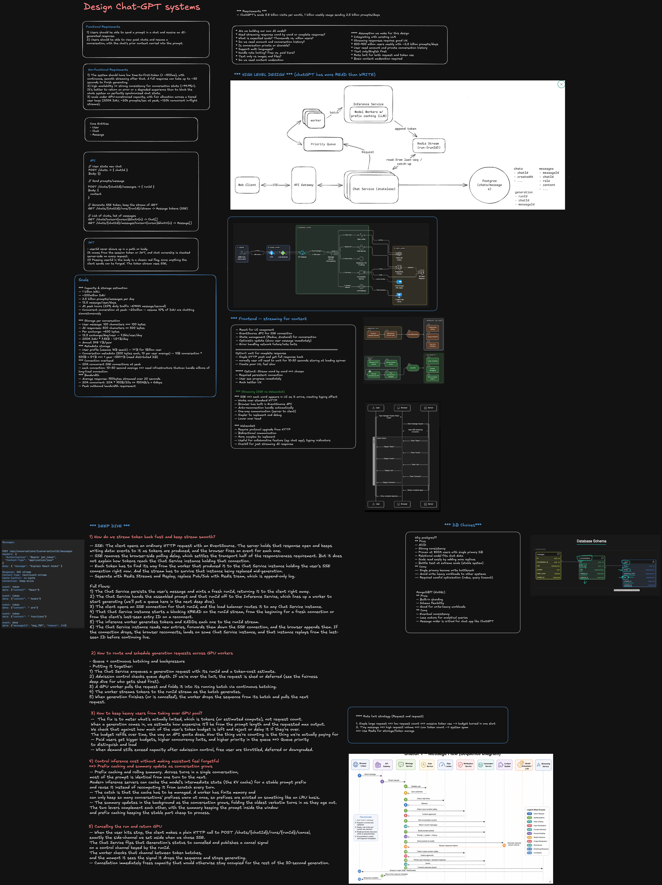

> **Editable diagram:** [Open in Excalidraw](https://excalidraw.com/#room=36375c98e82b3f912c43,UpC_I5Yk1-WBuBCJ5KbddQ)



# ChatGPT-Style System Design

## Interview Goal

Design a conversational AI application where users can create conversations,
send prompts, receive streamed model responses, upload files, retrieve relevant
information, invoke tools, and return to conversation history across devices.

At staff level, do more than draw a chat UI connected to an LLM. Explain:

- How requests are admitted, routed, streamed, cancelled, and retried.
- How context is assembled within a finite token budget.
- How conversation history differs from model context.
- How retrieval and tool execution remain secure and observable.
- How the system controls latency, capacity, safety, quality, and cost.
- How teams can evolve models and prompts without breaking the product.

This is a conceptual design for a ChatGPT-style product, not a description of
any company's private implementation.

## Staff-Level Checklist

- Clarify requirements, scale, latency, and model capabilities.
- Define the end-to-end generation and streaming path.
- Separate durable conversation history from the model context window.
- Design context selection, summarization, retrieval, and token budgeting.
- Route requests across models, regions, and capacity pools.
- Support cancellation, regeneration, branching, and idempotency.
- Secure tool calls, file processing, and retrieved content.
- Add input and output safety controls.
- Define overload behavior, retries, fallbacks, and partial-failure recovery.
- Measure time to first token, generation speed, quality, safety, and cost.
- Design evaluation, experimentation, rollout, and rollback.
- Address privacy, retention, deletion, residency, and abuse prevention.

## 1. Clarify the Requirements

### Functional requirements

- Create, rename, archive, and delete conversations.
- Send text prompts and receive incrementally streamed responses.
- Stop generation and regenerate a response.
- Edit an earlier message and branch the conversation.
- Select a model or let the system route automatically.
- Upload documents and images when supported.
- Search or browse conversation history.
- Retrieve information from private or external knowledge sources.
- Invoke approved tools such as search, code execution, or business APIs.
- Provide citations and tool-result status where appropriate.
- Synchronize conversations across devices.
- Collect explicit feedback such as thumbs up, thumbs down, or issue reports.

### Non-functional requirements

- Low time to first token.
- Smooth token streaming without excessive rendering work.
- High availability despite model, tool, or retrieval failures.
- Fair capacity allocation during traffic spikes.
- No duplicate user messages or accidental duplicate tool side effects.
- Strong isolation between users and organizations.
- Configurable retention, deletion, and data residency.
- Safe handling of adversarial prompts and untrusted retrieved content.
- Accessibility across keyboard, screen reader, and mobile experiences.
- Controlled inference, storage, network, and tool-execution costs.

### Questions to ask the interviewer

- Is this consumer chat, enterprise chat, or both?
- Which modalities are required: text, image, audio, or video?
- Do users choose models, or does the platform route automatically?
- Is web search, retrieval, file upload, or tool execution in scope?
- What are the peak requests per second and concurrent generations?
- What are the context-window and output-token limits?
- What latency target matters most: first token or full completion?
- Are conversations used for training or evaluation?
- What retention, residency, and deletion requirements apply?
- What availability and safety targets are required?

## 2. Critical User Flow

1. The client creates a stable message ID and submits a prompt.
2. The API authenticates the user and checks quota, policy, and rate limits.
3. The conversation service persists or deduplicates the user message.
4. The orchestrator loads conversation state and assembles model context.
5. Safety services inspect the input and selected attachments.
6. Retrieval or approved tools run when needed.
7. The model router selects a model and healthy serving pool.
8. The inference service generates output tokens.
9. A streaming gateway forwards events to the client.
10. The completed response, citations, usage, and trace metadata are persisted.
11. Output safety checks can block, revise, or annotate the response.
12. Asynchronous systems update analytics, search indexes, and evaluations.

## 3. High-Level Architecture

```text
Web / Mobile Client
  |
  +-- HTTPS: conversations, messages, uploads, feedback
  +-- SSE or streaming fetch: generated response events
  |
API Gateway / Backend for Frontend
  |
  +-- Authentication and authorization
  +-- Rate limits, quotas, and abuse controls
  +-- Idempotency and request validation
  |
Conversation Orchestrator
  |
  +-- Conversation and message service
  +-- Context builder and token-budget manager
  +-- Model router
  +-- Retrieval service
  +-- Tool execution service
  +-- Safety services
  |
Model Platform
  |
  +-- Admission control and scheduler
  +-- Model-serving pools
  +-- Token-streaming gateway
  +-- Model and prompt registry
  |
Data Platform
  |
  +-- Conversation database
  +-- Object storage for files
  +-- Vector and keyword indexes
  +-- Cache
  +-- Event stream, telemetry, and evaluation datasets
```

Keep the synchronous generation path short. Search indexing, analytics,
quality evaluation, and other nonessential work should happen asynchronously.

## 4. Frontend Design

### Main modules

| Module             | Responsibility                                                   |
| ------------------ | ---------------------------------------------------------------- |
| Conversation shell | Routing, history, model selection, and account state             |
| Composer           | Text input, attachments, keyboard behavior, and submission       |
| Message timeline   | User, assistant, tool, citation, and error messages              |
| Stream controller  | Parses events, handles cancellation, and tracks connection state |
| Draft store        | Preserves unsent input and attachments                           |
| Conversation cache | Optimistic messages, pagination, and cross-device refresh        |
| Markdown renderer  | Safely renders code, tables, links, and citations                |
| Feedback controls  | Ratings, reports, and retry actions                              |

### Client state machine

```text
idle -> submitting -> queued -> streaming -> completed
          |             |          |
          v             v          v
        failed       cancelled    interrupted
                                     |
                                     v
                                  resumable
```

Use explicit states instead of scattered flags such as `isLoading`,
`isStreaming`, and `hasError`. The state machine should define which actions
are valid during queueing, streaming, cancellation, and reconnection.

### Streaming protocol

SSE or streaming `fetch` is a strong default because most generation traffic
flows from server to client while user actions can use ordinary HTTP.

Example events:

```text
event: response.created
data: {"responseId":"r-123","messageId":"m-456"}

event: response.delta
data: {"sequence":1,"text":"A distributed"}

event: tool.started
data: {"toolCallId":"t-12","name":"search"}

event: citation.created
data: {"citationId":"c-8","source":"document-42"}

event: response.completed
data: {"finishReason":"stop","usage":{"outputTokens":624}}
```

Each event should include a response ID and monotonic sequence number. This
allows duplicate detection, gap detection, reconnection, and debugging.

### Rendering streamed text

- Buffer small token deltas and render at a controlled frame rate.
- Avoid reparsing the entire Markdown response for every token.
- Incrementally render stable blocks when possible.
- Virtualize long conversations.
- Preserve scroll position when the user reads earlier messages.
- Auto-scroll only when the user is already near the bottom.
- Sanitize generated Markdown, links, and embedded content.
- Keep screen-reader announcements useful rather than announcing every token.

## 5. Conversation Data Model

```text
Conversation
  id
  ownerId
  title
  activeBranchId
  createdAt
  updatedAt
  retentionPolicy

Message
  id
  conversationId
  parentMessageId
  role
  contentParts[]
  status
  model
  createdAt

Response
  id
  messageId
  requestId
  modelVersion
  finishReason
  usage
  safetyMetadata

ContentPart
  type: text | image | file | citation | tool_call | tool_result
```

Model the conversation as a tree or directed acyclic graph if users can edit
earlier prompts or regenerate responses. A flat list loses branch history and
makes regeneration semantics ambiguous.

Use client-generated message IDs and an idempotency key so retrying a timed-out
submission does not create duplicate messages or generations.

## 6. Conversation History vs Model Context

Stored conversation history may be much larger than the model's context
window. The context builder must decide what to include for each generation.

### Context-building inputs

- System and product instructions.
- Current user message.
- Recent conversation turns.
- Summaries of older turns.
- Relevant retrieved passages.
- Tool definitions and prior tool results.
- User or organization preferences when permitted.
- Safety and policy instructions.

### Token-budget strategy

Reserve tokens in this order:

1. Required system and safety instructions.
2. Current user request.
3. Expected output budget.
4. Required tool schemas.
5. Recent conversation turns.
6. Retrieved evidence.
7. Older summaries and optional personalization.

Never truncate content blindly from the end. Truncation should preserve
instruction boundaries, message roles, citations, and tool-call consistency.

### Summarization

- Summarize older turns when the context approaches its limit.
- Store summaries as derived artifacts, not replacements for original history.
- Version the summarization prompt and model.
- Refresh summaries when important corrections occur.
- Preserve unresolved tasks, user constraints, and referenced entities.
- Allow fallback to raw history when summary quality is uncertain.

## 7. Model Routing and Inference

The model router may consider:

- Requested capabilities and modality.
- Context-window size.
- Expected quality and latency.
- User plan and quota.
- Regional availability and residency.
- Current queue depth and accelerator capacity.
- Model health and recent error rate.
- Estimated request cost.
- Safety or domain-specific requirements.

### Admission control

GPU capacity is finite and expensive. Before inference:

- Enforce per-user and per-organization quotas.
- Limit concurrent generations.
- Estimate input and maximum output tokens.
- Reject impossible context sizes early.
- Queue requests by product tier and fairness policy.
- Shed optional work before rejecting core chat traffic.
- Return queue and retry information to the client.

### Serving considerations

- Batch compatible requests without making first-token latency unacceptable.
- Cache reusable prompt prefixes where the serving stack supports it.
- Separate latency-sensitive interactive traffic from batch workloads.
- Route around unhealthy model replicas or accelerator pools.
- Cap output length and execution time.
- Support cancellation so abandoned generations stop consuming capacity.

## 8. Retrieval-Augmented Generation

Retrieval should improve grounding without allowing retrieved text to become
trusted instructions.

```text
User query
  -> query understanding
  -> access-control filtering
  -> keyword and vector retrieval
  -> reranking
  -> passage selection
  -> context assembly
  -> model generation with citations
```

Important design points:

- Apply authorization before returning private documents.
- Combine semantic and lexical retrieval when useful.
- Rerank a small candidate set for relevance.
- Deduplicate overlapping passages.
- Fit evidence within a strict token budget.
- Preserve source IDs and offsets for citations.
- Treat retrieved content as untrusted data.
- Evaluate retrieval quality separately from generation quality.

## 9. Tool Execution

Tool calls introduce side effects and stronger security requirements.

### Safe execution flow

1. The model proposes a structured tool call.
2. The orchestrator validates the tool name and schema.
3. Policy checks verify user authorization and data scope.
4. High-impact actions require explicit user confirmation.
5. The tool runs in a sandbox or restricted service account.
6. Output is size-limited, sanitized, and returned to the model.
7. The final answer distinguishes tool results from model inference.

### Tool design requirements

- Allowlist tools and validate every argument.
- Use short-lived, least-privilege credentials.
- Make retryable mutations idempotent.
- Add deadlines and bounded retries.
- Prevent recursive or unbounded tool loops.
- Limit output size and redact secrets.
- Record an audit trail.
- Isolate code execution from internal networks and sensitive storage.

## 10. Safety and Abuse Prevention

Use defense in depth:

- Input moderation and abuse classification.
- Output moderation or policy checks.
- Rate limits and anomaly detection.
- Prompt-injection defenses around retrieval and tools.
- Malware scanning for uploads.
- Content provenance and citation display where appropriate.
- Age, region, and product-specific policy enforcement.
- Human review and escalation for high-risk cases.

Safety services need explicit timeout and failure behavior. For high-risk
actions, failure should usually block. For low-risk informational chat, the
system may use a conservative fallback response.

## 11. Reliability and Failure Handling

| Failure                            | Expected behavior                                                  |
| ---------------------------------- | ------------------------------------------------------------------ |
| Client retries message submission  | Deduplicate using message ID and idempotency key                   |
| Streaming connection drops         | Reconnect with response ID and last sequence                       |
| Model pool is overloaded           | Queue, route to an approved fallback, or return retry guidance     |
| Generation fails midway            | Preserve partial output and offer retry or regeneration            |
| Retrieval fails                    | Continue without retrieval only when product policy allows         |
| Tool times out                     | Show tool failure without losing the conversation                  |
| Persistence fails before inference | Do not start an untracked generation                               |
| Persistence fails after generation | Retry asynchronously using stable response IDs                     |
| Safety service fails               | Apply risk-based fail-closed or conservative fallback behavior     |
| Region fails                       | Route new sessions to a healthy region and recover durable history |

Retries must be bounded and jittered. Do not automatically retry tool mutations
unless they are idempotent.

## 12. Storage and Consistency

- Use a transactional database for conversations, messages, branches, and permissions.
- Store large files and generated artifacts in object storage.
- Use a vector index for semantic retrieval and a keyword index for exact search.
- Cache conversation metadata and model configuration carefully.
- Publish durable events for analytics, indexing, and evaluation.
- Keep the message store as the source of truth.

Strong consistency is valuable for message creation, branch structure,
permissions, and billing usage. Search indexes, analytics, titles, and
conversation summaries can generally be eventually consistent.

## 13. Privacy and Data Governance

- Encrypt data in transit and at rest.
- Isolate tenants and enforce access control at every data boundary.
- Define retention separately for conversations, files, logs, and evaluation data.
- Support export and deletion workflows.
- Propagate deletion to indexes, caches, backups, and derived artifacts.
- Respect regional storage and processing requirements.
- Avoid logging raw prompts, responses, credentials, or uploaded content by default.
- Separate product data from model-training data unless explicit policy permits reuse.
- Audit administrative and tool access.

## 14. Performance and Cost

### Latency metrics

- Request admission time.
- Queue wait time.
- Context assembly time.
- Retrieval and reranking time.
- Model time to first token.
- Inter-token latency and tokens per second.
- Tool execution time.
- End-to-end completion time.

### Cost controls

- Route simple tasks to smaller approved models.
- Limit unnecessary context and output tokens.
- Cache safe, reusable retrieval and prompt-prefix work.
- Stop inference promptly on cancellation.
- Set tool-call and iteration budgets.
- Compress or summarize old context.
- Sample expensive telemetry and evaluation traffic.
- Track cost per successful conversation, not only per request.

Do not optimize only for cost per token. A cheaper model that requires repeated
attempts or produces poor answers may cost more per successful outcome.

## 15. Observability

Use one trace across:

```text
client -> gateway -> orchestrator -> retrieval/tools -> model -> stream -> persistence
```

Track:

- Request and response IDs.
- Model and prompt-template versions.
- Time to first token and tokens per second.
- Queue depth and admission rejection rate.
- Stream disconnect and resume rate.
- Context size and truncation behavior.
- Retrieval hit, citation, and relevance metrics.
- Tool success, latency, timeout, and confirmation rates.
- Safety block and false-positive review rates.
- User feedback and task-completion signals.
- Input, output, and tool cost by feature and tenant.

Telemetry should contain metadata and hashes where possible, not raw private
conversation content.

## 16. Quality Evaluation

Traditional uptime does not measure answer usefulness. Use several evaluation
layers:

- Deterministic tests for formatting, citations, and tool schemas.
- Curated golden datasets for product tasks.
- Retrieval recall and ranking evaluations.
- Model-graded evaluations with calibration and human review.
- Safety and adversarial red-team suites.
- Human preference comparisons.
- Online feedback and task-completion metrics.
- Regression tests by language, domain, and user segment.

Version every component that can change behavior:

- Model and checkpoint.
- System prompt and templates.
- Retrieval configuration.
- Tool definitions.
- Safety policies.
- Context-building logic.

Run changes through offline evaluation, shadow traffic, canaries, controlled
experiments, and automatic rollback thresholds.

## 17. Capacity Planning

State assumptions for:

- Peak prompt requests per second.
- Concurrent active streams.
- Average input and output tokens.
- Average generation duration.
- Accelerator throughput by model.
- Queue-size and wait-time limits.
- File-upload volume.
- Retrieval and tool-call rates.
- Conversation storage growth.

Inference capacity depends on tokens and generation duration, not only request
count. Long outputs can hold expensive model capacity far longer than short
requests.

## 18. Testing Strategy

- Unit-test context budgeting, truncation, routing, and state transitions.
- Contract-test stream events and tool schemas.
- Test duplicate submissions and idempotent recovery.
- Simulate stream disconnects, sequence gaps, and cancellation.
- Load-test admission control and model queues.
- Test large histories, files, and context limits.
- Test retrieval authorization and tenant isolation.
- Red-team prompt injection and malicious files.
- Test tool timeouts, partial failures, and side-effect confirmation.
- Verify keyboard navigation, focus management, and screen-reader output.
- Replay production-shaped traces without exposing sensitive content.

## 19. Important Trade-offs

1. SSE or streaming HTTP versus WebSockets.
2. Large context windows versus latency and inference cost.
3. Full history versus summaries and selective retrieval.
4. Model quality versus speed, availability, and cost.
5. Automatic tool use versus explicit user control.
6. Fast streaming versus complete output safety inspection.
7. Strong consistency versus chat availability during partial failures.
8. Personalized memory versus privacy and user control.
9. Global routing versus data residency.
10. Rich telemetry versus privacy and storage expense.
11. Aggressive retries versus duplicate work and tool side effects.
12. Building model infrastructure versus using managed model APIs.

## 20. Staff-Level Design Points

A staff engineer should explicitly address:

- Ownership boundaries between product, model platform, safety, retrieval, and tool teams.
- Stable, versioned contracts for stream events, tools, prompts, and models.
- Service-level objectives for availability, first-token latency, quality, and safety.
- Capacity allocation and graceful degradation during major traffic spikes.
- Migration plans for new models, context formats, and conversation schemas.
- Remote configuration, feature flags, canaries, and rollback.
- Cost attribution by feature, tenant, and model.
- Incident tooling for tracing a response without exposing user content broadly.
- User-facing controls for memory, retention, deletion, and tool permissions.
- A build-versus-buy strategy for model serving, vector search, and safety systems.

## Interview Closing Summary

The core design is a durable conversation system connected to a controlled,
observable model-execution pipeline. A strong staff-level answer explains how
the system assembles context, streams tokens, routes models, invokes tools,
grounds responses, protects user data, handles overload and partial failures,
and measures answer quality alongside latency and cost.
