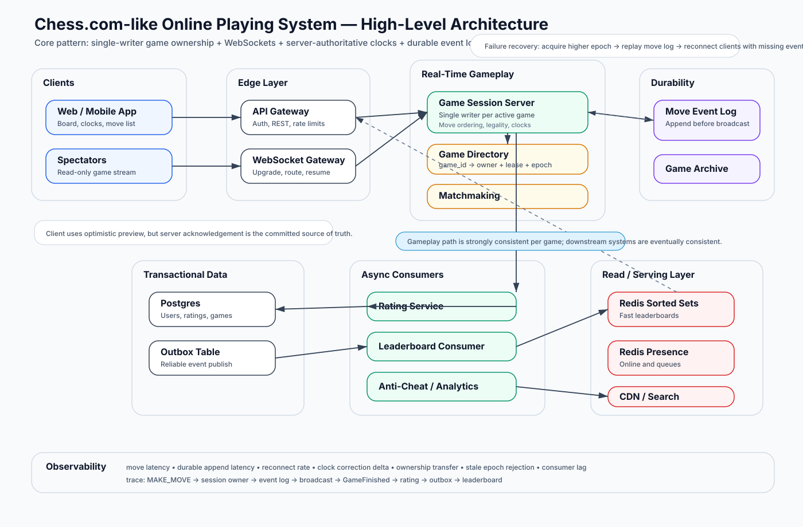

# Chess.com Online Playing System — Staff Engineer System Design

## 1. Problem Statement

Design an online chess playing system similar to Chess.com where users can:

- Create or join games.
- Play live chess with real-time move updates.
- See server-authoritative clocks.
- Reconnect after network drops.
- View game history and replay moves.
- Receive rating updates after games finish.
- Browse leaderboards and profiles.

At Staff Engineer level, the answer should emphasize correctness, failure handling, ownership boundaries, consistency models, and operational tradeoffs.

---

## 2. Core Design Pattern

> **Single-writer ownership per game.**
>
> One active game is owned by one session server at a time. That server is the only writer responsible for move ordering, legality checks, game state transitions, and clock updates.

This avoids distributed locking during gameplay and gives each game a clear authority.

### Why this fits chess

Chess has low move throughput per game but extremely strict ordering and legality requirements. A game cannot safely accept two concurrent moves from different servers. Single ownership gives us:

- Deterministic move ordering.
- Consistent clock calculation.
- Simple legality validation.
- Easier replay and recovery.
- Easier anti-cheat and moderation hooks.

---

## 3. Functional Requirements

### Core gameplay

- Match two players into a game.
- Support time controls such as bullet, blitz, rapid, and daily.
- Validate legal moves server-side.
- Maintain game state: board, turn, castling rights, en passant, move counters, clocks, result.
- Broadcast moves and clock updates in real time.
- Support resignation, draw offer, timeout, abandoned game, and checkmate/stalemate.
- Persist game history for replay.

### User and social features

- User login and profile.
- Rating update after game completion.
- Leaderboard read path.
- Spectators for popular games.
- Optional chat, friends, clubs, and tournaments.

### Reliability features

- Reconnect to active games.
- Recover game from durable move log after server failure.
- Prevent duplicate move submission.
- Avoid double rating updates.
- Prevent two servers from owning the same game.

---

## 4. Non-Functional Requirements

| Requirement | Target |
|---|---|
| Move latency | P50 under 100ms within same region, P99 under 500ms target |
| Correctness | No illegal committed moves, no double moves, no duplicate rating updates |
| Availability | Gameplay should survive session server crash with recovery |
| Consistency | Strong consistency inside a game; eventual consistency for leaderboard/history/search |
| Scalability | Horizontally scale by sharding games across session servers |
| Observability | Per-game event logs, move latency, reconnect rate, ownership transfer failures |
| Security | Authenticated sockets, rate limiting, anti-cheat signals, replay protection |

---

## 5. High-Level Architecture



### Main components

1. **Frontend Web/Mobile Client**
   - Chessboard UI.
   - WebSocket client.
   - Optimistic local move preview.
   - Server reconciliation.
   - Clock display with server sync.

2. **API Gateway / Edge**
   - Authentication.
   - REST routing for non-real-time requests.
   - WebSocket upgrade routing.
   - Rate limiting and abuse protection.

3. **Matchmaking Service**
   - Pairs players by rating, region, time control, and wait time.
   - Creates game metadata.
   - Allocates a game owner session server.

4. **Game Directory / Ownership Registry**
   - Maps `game_id -> session_server_id`.
   - Uses lease and epoch to prevent split-brain ownership.
   - Stores routing metadata for reconnects and spectators.

5. **Game Session Server**
   - Owns active games.
   - Validates moves.
   - Updates clocks using monotonic time.
   - Broadcasts moves to players and spectators.
   - Appends moves to durable log before acknowledging commit.

6. **Move Log / Event Stream**
   - Durable append-only game events.
   - Used for crash recovery, audit, replay, anti-cheat, and analytics.

7. **Game Store / Archive**
   - Stores completed game documents.
   - Natural aggregate model: metadata + move list + result.

8. **Rating Service**
   - Consumes `GameFinished` events.
   - Updates both players transactionally.
   - Emits outbox events for leaderboard/cache updates.

9. **Postgres**
   - Source of truth for users, ratings, payments, titled status, and transactional updates.

10. **Redis**
   - Fast leaderboard serving via Sorted Sets.
   - Matchmaking queues.
   - Presence and ephemeral socket metadata.

11. **Analytics / Anti-Cheat Pipeline**
   - Consumes game events asynchronously.
   - Computes suspicious patterns, engine correlation, time usage, and reporting signals.

---

## 6. Frontend UX Design

### Core screens

- **Home / Play screen**: choose time control, rating pool, casual/rated mode.
- **Live game screen**: board, captured pieces, clocks, move list, resign/draw controls, chat, reconnect state.
- **Game review screen**: replay controls, PGN export, engine analysis placeholder, accuracy view.
- **Profile / history screen**: recent games, rating graph, stats.

### Live game wireframe

```text
+--------------------------------------------------------------------------------+
| Header: Chess Platform        Online: 432k       Search / Profile / Settings    |
+----------------------+---------------------------------------------------------+
| Opponent Card        | Move List / Chat / Info                                |
| Name, rating, clock  | 1. e4 c5                                                |
|                      | 2. Nf3 d6                                               |
|  +---------------+   |                                                         |
|  |               |   | Draw offer | Resign | Analysis after game              |
|  |  Chess Board  |   |                                                         |
|  |               |   | Connection: Healthy / Reconnecting / Recovered          |
|  +---------------+   |                                                         |
|                      |                                                         |
| My Card              |                                                         |
| Name, rating, clock  |                                                         |
+----------------------+---------------------------------------------------------+
```

### Frontend state model

```ts
type GameClientState = {
  gameId: string;
  connection: "connecting" | "connected" | "reconnecting" | "disconnected";
  serverEpoch: number;
  boardFen: string;
  legalMoves?: string[];
  moveList: Move[];
  pendingMove?: ClientMove;
  clocks: {
    whiteMs: number;
    blackMs: number;
    activeColor: "white" | "black";
    serverNowMs: number;
    lastSyncClientNowMs: number;
  };
  result?: GameResult;
};
```

### Frontend rules

- Show immediate drag/drop feedback locally.
- Do not commit a move visually as final until server acknowledges it.
- Every client move has a `client_move_id` for idempotency.
- Reconnect by sending `game_id`, `last_seen_seq`, and auth token.
- On reconnect, server returns missing events after `last_seen_seq`.
- Clock display is estimated locally but corrected by periodic server sync.

---

## 7. Real-Time Communication

### Why WebSockets

Chess move volume is low, but real-time responsiveness matters. WebSockets fit because they provide:

- Bidirectional communication.
- Low overhead compared with polling.
- Reconnect support.
- Server push for moves, game end, draw offers, and clock snapshots.
- Spectator fanout.

### Client-to-server messages

```ts
type ClientMessage =
  | {
      type: "MAKE_MOVE";
      gameId: string;
      clientMoveId: string;
      from: string;
      to: string;
      promotion?: "q" | "r" | "b" | "n";
      lastSeenSeq: number;
    }
  | { type: "RESIGN"; gameId: string; clientActionId: string }
  | { type: "OFFER_DRAW"; gameId: string; clientActionId: string }
  | { type: "ACCEPT_DRAW"; gameId: string; clientActionId: string }
  | { type: "SYNC"; gameId: string; lastSeenSeq: number };
```

### Server-to-client messages

```ts
type ServerMessage =
  | {
      type: "MOVE_COMMITTED";
      gameId: string;
      seq: number;
      san: string;
      lan: string;
      fen: string;
      whiteMs: number;
      blackMs: number;
      activeColor: "white" | "black";
      serverTimeMs: number;
    }
  | {
      type: "MOVE_REJECTED";
      gameId: string;
      clientMoveId: string;
      reason: "not_your_turn" | "illegal_move" | "game_over" | "stale_epoch";
    }
  | {
      type: "GAME_FINISHED";
      gameId: string;
      seq: number;
      result: "1-0" | "0-1" | "1/2-1/2";
      reason: "checkmate" | "timeout" | "resignation" | "draw" | "abandoned";
    }
  | {
      type: "CLOCK_SYNC";
      gameId: string;
      whiteMs: number;
      blackMs: number;
      activeColor: "white" | "black";
      serverTimeMs: number;
    };
```

---

## 8. Move Processing Flow

### Normal move flow

```text
1. Player drags piece and submits MAKE_MOVE over WebSocket.
2. Edge routes socket message to the owning game session server.
3. Session server checks ownership lease and game epoch.
4. Server deduplicates client_move_id.
5. Server verifies player identity and turn ownership.
6. Server computes elapsed time using monotonic clock.
7. Server validates move legality against current board state.
8. Server applies move in memory.
9. Server appends MoveCommitted event to durable log.
10. Server acknowledges the mover and broadcasts to opponent/spectators.
11. If game ended, server appends GameFinished event and emits downstream event.
```

### Important ordering decision

The server should only broadcast a committed move after the durable append succeeds. This prevents clients from seeing moves that disappear after server crash.

---

## 9. Game Session Server Design

### In-memory game aggregate

```ts
type ActiveGame = {
  gameId: string;
  epoch: number;
  status: "active" | "finished";
  whiteUserId: string;
  blackUserId: string;
  boardFen: string;
  sideToMove: "white" | "black";
  moveSeq: number;
  moveList: MoveEvent[];
  clocks: {
    whiteRemainingMs: number;
    blackRemainingMs: number;
    turnStartedMonoMs: number;
    incrementMs: number;
  };
  idempotency: Map<string, MoveResult>;
};
```

### Why in-memory first

The active game needs extremely fast state transitions. Keeping the aggregate in memory avoids reading the full game state from DB for every move. Durability is achieved by append-only logs.

### Failure recovery

When a session server crashes:

1. Lease expires in the game directory.
2. Another server attempts to acquire ownership with a higher epoch.
3. New owner reads the latest durable event log.
4. It rebuilds `ActiveGame` in memory.
5. Clients reconnect and sync missing events.
6. New owner rejects messages from old epochs.

---

## 10. Clock Correctness

### Pattern: server-authoritative monotonic time

Do not trust client clocks. Do not rely on globally synchronized wall clocks for move correctness.

For each game, the owning server records:

- Remaining time per player.
- Which side is active.
- Monotonic timestamp when the current turn started.

When a move arrives:

```ts
elapsed = nowMonoMs - game.clocks.turnStartedMonoMs;
activeRemainingMs -= elapsed;

if (activeRemainingMs <= 0) {
  finishGame(reason = "timeout");
} else {
  activeRemainingMs += incrementMs;
  switchTurn();
  turnStartedMonoMs = nowMonoMs;
}
```

### Client clock display

The client can render smooth clocks locally, but the source of truth is the server. The server sends clock sync snapshots periodically and after each committed move.

---

## 11. Ownership, Routing, and Failover

### Game directory record

```sql
CREATE TABLE game_ownership (
  game_id UUID PRIMARY KEY,
  owner_server_id TEXT NOT NULL,
  epoch BIGINT NOT NULL,
  lease_expires_at TIMESTAMPTZ NOT NULL,
  updated_at TIMESTAMPTZ NOT NULL
);
```

### Ownership rules

- Only the server with a valid lease and current epoch may write game events.
- Every committed event includes the epoch.
- Clients include last known epoch on reconnect.
- Stale owners are fenced off by epoch checks.

### Why lease + epoch matters

A lease alone reduces split-brain risk, but a stale server may briefly believe it still owns a game during network partitions or GC pauses. Epoch fencing ensures downstream writes from old owners can be rejected.

---

## 12. Persistence Model

### Event log table / stream

```sql
CREATE TABLE game_events (
  game_id UUID NOT NULL,
  seq BIGINT NOT NULL,
  epoch BIGINT NOT NULL,
  event_type TEXT NOT NULL,
  actor_user_id UUID,
  payload JSONB NOT NULL,
  created_at TIMESTAMPTZ NOT NULL DEFAULT now(),
  PRIMARY KEY (game_id, seq)
);
```

### Game archive document

A completed chess game is naturally an aggregate document:

```json
{
  "gameId": "g_123",
  "whiteUserId": "u_1",
  "blackUserId": "u_2",
  "timeControl": "5+0",
  "rated": true,
  "result": "1-0",
  "reason": "checkmate",
  "moves": ["e4", "c5", "Nf3", "d6"],
  "finalFen": "...",
  "startedAt": "2026-06-20T10:00:00Z",
  "endedAt": "2026-06-20T10:08:31Z"
}
```

Good storage choices:

- **Postgres** for transactional user/rating/payment data.
- **Kafka/Pulsar/Kinesis** for durable event stream.
- **S3/Object storage or document DB** for game archives and PGN exports.
- **Redis** for ephemeral presence, matchmaking queues, and leaderboard serving.

---

## 13. Rating Updates

### Pattern: transactional source of truth in SQL

When a game finishes, the gameplay path emits a `GameFinished` event. Rating calculation happens asynchronously.

```text
GameFinished event
  -> Rating consumer
  -> Begin DB transaction
  -> Check game_result_processed(game_id) idempotency
  -> Read both player ratings
  -> Compute new ratings
  -> Update both players atomically
  -> Insert rating history rows
  -> Insert outbox event RatingUpdated
  -> Commit
```

### Why async rating updates

Rating updates should not block gameplay completion. The game result can be committed immediately, while ratings become eventually visible a moment later.

### Rating idempotency

```sql
CREATE TABLE processed_game_results (
  game_id UUID PRIMARY KEY,
  processed_at TIMESTAMPTZ NOT NULL DEFAULT now()
);
```

This prevents duplicate rating updates if the consumer retries.

---

## 14. Leaderboards

### Pattern: Redis Sorted Set as serving layer

```text
Postgres rating table = source of truth
Redis Sorted Set = fast leaderboard reads
```

Example keys:

```text
leaderboard:blitz:global
leaderboard:rapid:global
leaderboard:bullet:global
leaderboard:daily:global
```

Use sorted sets:

```text
ZADD leaderboard:blitz:global <rating> <user_id>
ZREVRANGE leaderboard:blitz:global 0 99 WITHSCORES
ZREVRANK leaderboard:blitz:global <user_id>
```

### Cache consistency

Use the **transactional outbox pattern**:

1. Rating transaction updates SQL.
2. Same transaction writes `RatingUpdated` outbox row.
3. Outbox worker publishes event.
4. Leaderboard consumer updates Redis.

Avoid this fragile pattern:

```text
Update Postgres -> Update Redis -> hope both succeeded
```

---

## 15. API Design

### REST APIs

```http
POST /api/games/matchmaking/enqueue
GET  /api/games/{gameId}
GET  /api/games/{gameId}/events?afterSeq=123
GET  /api/users/{userId}/games?cursor=...
GET  /api/users/{userId}/ratings
GET  /api/leaderboards/{timeControl}?limit=100
POST /api/games/{gameId}/report
```

### WebSocket endpoint

```http
GET /ws/games/{gameId}
Authorization: Bearer <token>
```

After connection:

```json
{
  "type": "SYNC",
  "gameId": "g_123",
  "lastSeenSeq": 18
}
```

Server response:

```json
{
  "type": "SYNC_RESULT",
  "gameId": "g_123",
  "epoch": 4,
  "currentSeq": 21,
  "events": [
    { "seq": 19, "type": "MOVE_COMMITTED" },
    { "seq": 20, "type": "CLOCK_SYNC" },
    { "seq": 21, "type": "MOVE_COMMITTED" }
  ]
}
```

---

## 16. Database Schema

### Users

```sql
CREATE TABLE users (
  id UUID PRIMARY KEY,
  username TEXT UNIQUE NOT NULL,
  created_at TIMESTAMPTZ NOT NULL DEFAULT now()
);
```

### Ratings

```sql
CREATE TABLE user_ratings (
  user_id UUID NOT NULL,
  rating_type TEXT NOT NULL,
  rating INT NOT NULL,
  games_played INT NOT NULL DEFAULT 0,
  updated_at TIMESTAMPTZ NOT NULL,
  PRIMARY KEY (user_id, rating_type)
);
```

### Games

```sql
CREATE TABLE games (
  id UUID PRIMARY KEY,
  white_user_id UUID NOT NULL,
  black_user_id UUID NOT NULL,
  time_control TEXT NOT NULL,
  rated BOOLEAN NOT NULL,
  status TEXT NOT NULL,
  result TEXT,
  result_reason TEXT,
  started_at TIMESTAMPTZ NOT NULL,
  ended_at TIMESTAMPTZ
);
```

### Move events

```sql
CREATE TABLE game_events (
  game_id UUID NOT NULL,
  seq BIGINT NOT NULL,
  epoch BIGINT NOT NULL,
  event_type TEXT NOT NULL,
  actor_user_id UUID,
  payload JSONB NOT NULL,
  created_at TIMESTAMPTZ NOT NULL DEFAULT now(),
  PRIMARY KEY (game_id, seq)
);
```

### Outbox

```sql
CREATE TABLE outbox_events (
  id UUID PRIMARY KEY,
  event_type TEXT NOT NULL,
  aggregate_id UUID NOT NULL,
  payload JSONB NOT NULL,
  created_at TIMESTAMPTZ NOT NULL DEFAULT now(),
  published_at TIMESTAMPTZ
);
```

---

## 17. Scaling Strategy

### Scale active games

Shard by `game_id` across game session servers.

```text
hash(game_id) -> preferred region / shard / session pool
```

But the authoritative mapping is the game directory because failover may move a game.

### Scale WebSocket connections

- Use regional WebSocket gateways.
- Keep socket affinity to the session server when possible.
- Route through game directory if socket terminates at edge.
- Support reconnect and resume with `last_seen_seq`.

### Scale spectators

For small games, the owner session server can broadcast directly.

For high-profile games with many spectators:

```text
Game owner -> Pub/Sub topic -> Fanout servers -> Spectators
```

This keeps spectator load from impacting players.

### Scale history reads

- Store completed game documents in archive storage.
- Index game metadata for profile/history pages.
- Use CDN for public PGN or replay assets when possible.

---

## 18. Consistency Model

| Area | Consistency model | Reason |
|---|---|---|
| Active game moves | Strong per game | Move order and legality must be exact |
| Game clocks | Server-authoritative | Prevent cheating and clock drift |
| Rating updates | Transactional per completed game | Both ratings must update atomically |
| Leaderboard | Eventual consistency | Fast reads matter more than immediate rank update |
| Game history | Eventual after completion | Replay can lag slightly |
| Analytics / anti-cheat | Eventual | Offline and streaming analysis can run async |

---

## 19. Edge Cases

### Duplicate move request

Use `client_move_id` plus `game_id` and `user_id` to deduplicate. Return the original result.

### Player reconnects

Client reconnects with `last_seen_seq`. Server sends missing events and current clock snapshot.

### Server crashes after writing event but before ack

Client retries the same `client_move_id`. New owner rebuilds from log and returns already committed result.

### Server broadcasts before durable write

Avoid this. Commit to durable log before broadcast.

### Two servers think they own the same game

Use lease + epoch fencing. Storage rejects stale epoch writes.

### Player disconnects while clock is running

The server-authoritative clock continues. If time expires, game ends by timeout.

### Draw offer race

Represent draw offer as a game event with current side/player and expiry rules. Accept only if offer is still valid.

### Rating consumer retries

Use `processed_game_results(game_id)` idempotency table.

---

## 20. Observability

Important metrics:

- Move validation latency.
- Durable append latency.
- WebSocket reconnect rate.
- Clock correction delta.
- Game ownership transfer count.
- Ownership conflict / stale epoch rejection count.
- Rating consumer lag.
- Leaderboard update lag.
- Session server active game count.
- Spectator fanout load.

Important logs:

- `game_id`, `seq`, `epoch`, `owner_server_id`.
- Move accepted/rejected reason.
- Ownership acquire/release events.
- Recovery replay duration.

Important traces:

```text
Client MAKE_MOVE
  -> WebSocket Gateway
  -> Game Session Server
  -> Move Log Append
  -> Broadcast
  -> GameFinished Event
  -> Rating Consumer
  -> Outbox
  -> Leaderboard Consumer
```

---

## 21. Security and Abuse Prevention

- Authenticate WebSocket connections.
- Authorize that the user is a player or valid spectator.
- Validate every move server-side.
- Rate limit move submissions, chat messages, and draw offers.
- Prevent replay with `client_move_id` and auth token binding.
- Hide opponent network status unless product explicitly wants it.
- Feed games to anti-cheat pipeline asynchronously.
- Store audit events for suspicious games.

---

## 22. Technology Choices

| Area | Choice | Why |
|---|---|---|
| Client | React / Next.js / TypeScript | Strong interactive UI and typed state model |
| Real-time | WebSockets | Bidirectional low-latency communication |
| Session runtime | Java/Kotlin/Go/Node.js | Long-lived connections and stateful game actors |
| Active state | In-memory per owner | Fast deterministic updates |
| Durable log | Kafka/Pulsar/Kinesis or append-only DB table | Recovery and event-driven processing |
| SQL source of truth | Postgres | Transactions for ratings and users |
| Cache / leaderboard | Redis Sorted Sets | Fast rank and top-N queries |
| Archive | S3/document store | Game aggregate documents and PGNs |
| Search/history index | OpenSearch/Elastic optional | User history and public game search |
| Observability | OpenTelemetry + Prometheus/Grafana | Debug distributed gameplay issues |

---

## 23. Staff-Level Tradeoffs

### Single-writer session server vs distributed game state

**Choose single-writer.** Chess does not need multi-writer throughput per game. Correctness matters more than theoretical write scaling.

### In-memory game state vs database per move

**Use in-memory active state + durable append log.** Reading/writing DB as the source for every move increases latency and complexity.

### Synchronous rating update vs async rating update

**Use async rating update.** Game completion should be committed first. Ratings can follow with idempotent consumers.

### Redis leaderboard as source of truth vs serving layer

**Use Redis as serving layer.** Postgres remains source of truth. Redis can be rebuilt.

### Client clock vs server clock

**Use server clock.** Client clock is display-only and never authoritative.

---

## 24. Interview Answer Summary

A strong interview answer:

1. Starts with single-writer ownership per game.
2. Uses WebSockets for real-time move delivery and reconnect sync.
3. Makes clocks server-authoritative using monotonic time.
4. Persists moves to a durable append-only log before broadcasting.
5. Uses game directory + lease + epoch for routing and failover.
6. Rebuilds active game state from event log after crash.
7. Emits `GameFinished` event for async rating, leaderboard, archive, and anti-cheat.
8. Uses Postgres for transactional ratings and Redis Sorted Sets for leaderboard reads.
9. Uses outbox pattern to keep SQL and cache/event stream consistent.
10. Separates strong consistency for gameplay from eventual consistency for downstream features.

---

## 25. One-Minute Pitch

I would design the online chess system around single-writer ownership per active game. One game session server owns a game at a time and is responsible for move ordering, legality checks, clock updates, and result transitions. Clients communicate over WebSockets for low-latency move delivery and reconnect support. The server uses monotonic clocks and remains authoritative for time; clients only render an estimate.

For durability, every committed move is appended to a durable event log before the server broadcasts it. If a session server fails, another server acquires ownership through a game directory using lease and epoch fencing, replays the event log, and resumes the game. Once a game finishes, we emit a `GameFinished` event. Rating updates happen asynchronously but transactionally in Postgres, while leaderboards are served from Redis Sorted Sets and kept consistent through an outbox-driven pipeline.

The key tradeoff is that gameplay uses strong consistency per game, while history, analytics, anti-cheat, and leaderboards are eventually consistent. This keeps the live experience correct and fast while allowing the rest of the platform to scale independently.
