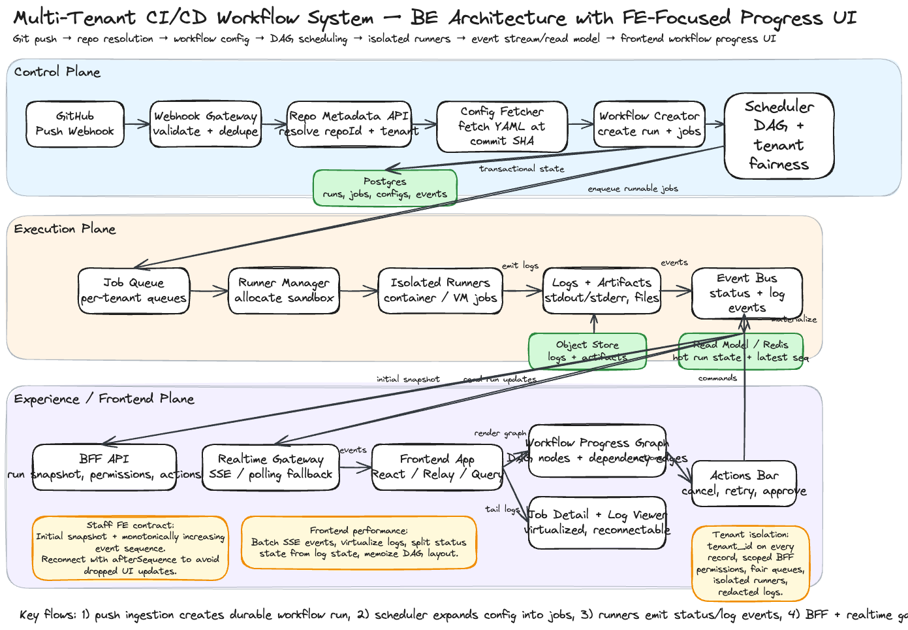

## 1. Problem Statement

Design a multi-tenant CI/CD workflow platform triggered by a GitHub `push` event.

When a developer pushes code:

1. GitHub sends a webhook to the CI/CD platform.
2. The platform validates and normalizes the webhook.
3. The platform calls an internal Repository Metadata API to resolve the GitHub repository ID and tenant ownership.
4. The platform fetches workflow configuration from the GitHub repository, for example `.github/workflows/build.yml` or an internal config path.
5. The platform creates a workflow run.
6. The scheduler expands the workflow config into a sequence or DAG of jobs.
7. Workers execute jobs in isolated runners.
8. The frontend displays workflow progress, logs, job status, timing, errors, retry state, and artifacts in near real time.

This design is intentionally **backend-aware but frontend-heavy**, because the user experience for CI/CD is mostly about confidence: developers need to understand what is running, what is blocked, what failed, why it failed, and what they can do next.

---

## 2. Clarifying Questions

In an interview, I would start with these questions:

### Product Scope

- Are workflows always triggered by GitHub push, or also pull requests, tags, manual dispatch, and scheduled runs?
- Is the workflow config compatible with GitHub Actions syntax, or is it a custom YAML schema?
- Do jobs form a strict sequence, or can they be a DAG with dependencies?
- Do users need live logs, downloadable artifacts, rerun, cancel, approve, and retry?
- Are self-hosted runners supported, or only managed runners?

### Scale

- How many tenants, repositories, pushes per second, and concurrent jobs?
- Expected log volume per job?
- How long can jobs run?
- What latency is acceptable from git push to workflow visible in UI?
- How fresh must the UI be: sub-second, a few seconds, or eventual?

### Security and Isolation

- Is each tenant strictly isolated at data, compute, and artifact levels?
- Are secrets injected into runners?
- Do we need branch protection or approval gates?
- Can users view logs across organizations, projects, or only repositories they have access to?

For the rest of this answer, I assume:

- 10M repositories.
- 10 pushes/sec average, 100 pushes/sec burst.
- 100K concurrent jobs at peak.
- Workflow config is YAML stored in the repo.
- Jobs form a DAG, but the example can be a linear sequence.
- UI needs near-real-time status and log streaming.
- Multi-tenant fairness and isolation are first-class requirements.

---

## 3. Requirements

## Functional Requirements

### Backend

- Receive GitHub push webhook.
- Validate webhook signature and deduplicate delivery IDs.
- Resolve GitHub repository ID via internal API.
- Fetch workflow config from GitHub repository.
- Parse, validate, and version the workflow config.
- Create workflow run and job records.
- Schedule jobs according to dependency order.
- Execute jobs in isolated runners.
- Stream status, logs, and artifacts.
- Support cancellation, retry, rerun failed jobs, and workflow history.

### Frontend

- Show workflow run immediately after creation.
- Display workflow DAG or sequence with job progress.
- Show run-level status: queued, running, failed, succeeded, cancelled.
- Show job-level status, duration, runner, queue time, retry count, and dependency state.
- Stream logs in near real time.
- Preserve log position across refresh and reconnect.
- Show failure summary, annotations, and actionable next steps.
- Support cancel, retry, rerun, and approve gates based on permissions.
- Provide filtering by branch, commit, actor, status, environment, and time.

## Non-Functional Requirements

- Low webhook ingestion latency.
- Durable workflow creation: no lost push events.
- Scheduler correctness under retries and worker failure.
- UI update latency under 1–2 seconds for status changes.
- Log streaming reconnect without losing bytes.
- Tenant isolation and fair scheduling.
- High availability for read path and progress UI.
- Auditable state transitions.
- Cost-aware log retention and artifact retention.

---

## 4. High-Level Architecture

The system is split into three major planes:

1. **Control Plane**: webhook ingestion, repo resolution, config fetching, workflow creation, scheduling.
2. **Execution Plane**: job queue, runner manager, isolated runners, artifacts, logs.
3. **Experience Plane**: frontend app, BFF, real-time gateway, read models, log streaming.

```txt
GitHub Push
   |
   v
Webhook Gateway -> Repo Resolver -> Config Fetcher -> Workflow Creator -> Scheduler
                                                                   |
                                                                   v
                                                            Job Queue / DAG
                                                                   |
                                                                   v
                                                       Runner Manager / Runners
                                                                   |
                                              +--------------------+------------------+
                                              |                                       |
                                              v                                       v
                                      Logs / Artifacts                         Status Events
                                              |                                       |
                                              v                                       v
                                      Log Store / Object Store             Event Bus / Read Model
                                              |                                       |
                                              +--------------------+------------------+
                                                                   |
                                                                   v
                                                        BFF + Realtime Gateway
                                                                   |
                                                                   v
                                                        Frontend Workflow UI
```

The important staff-level point: **workflow execution is not directly coupled to the UI**. Execution emits append-only events. The frontend reads from a query-optimized read model and subscribes to a real-time event stream.

---

## 5. Backend Design

## 5.1 Webhook Ingestion

### Responsibilities

- Validate GitHub webhook signature.
- Extract event type, delivery ID, repository URL, commit SHA, branch, actor, and installation ID.
- Deduplicate webhook delivery using `github_delivery_id`.
- Persist raw webhook event before async processing.
- Enqueue workflow creation command.

### Why persist first?

Webhook delivery is the source of truth for the trigger. If downstream services fail, the system can replay from the durable webhook event table or event log.

### Table: `webhook_events`

```sql
CREATE TABLE webhook_events (
  id UUID PRIMARY KEY,
  tenant_id UUID,
  github_delivery_id TEXT UNIQUE NOT NULL,
  event_type TEXT NOT NULL,
  repo_full_name TEXT,
  branch TEXT,
  commit_sha TEXT,
  actor TEXT,
  raw_payload JSONB NOT NULL,
  status TEXT NOT NULL,
  created_at TIMESTAMP NOT NULL,
  processed_at TIMESTAMP
);
```

---

## 5.2 Repository Metadata Resolution

The prompt explicitly says the system should analyze the git push to obtain the GitHub repository ID using an internal API service.

### Flow

1. Webhook event contains GitHub repository URL or full name.
2. Workflow Orchestrator calls Internal Repository Metadata API.
3. Repo Metadata API returns:
   - `repo_id`
   - `tenant_id`
   - `org_id`
   - `default_branch`
   - access policy
   - installation token reference
   - repository visibility

### Why use an internal service?

At company scale, repository identity is often not just GitHub’s raw ID. It may map to tenant, billing account, product area, security boundary, or internal ownership. Keeping this logic behind a service avoids duplicating authorization and tenant resolution logic in every CI/CD component.

---

## 5.3 Workflow Config Fetching

### Config Source

The workflow config is stored inside the repository, for example:

```txt
.cicd/workflow.yml
.github/workflows/build.yml
```

### Example Config

```yaml
name: build-and-test
on:
  push:
    branches: [main]

jobs:
  install:
    image: node:20
    steps:
      - run: npm ci

  lint:
    needs: [install]
    image: node:20
    steps:
      - run: npm run lint

  test:
    needs: [install]
    image: node:20
    steps:
      - run: npm test

  deploy:
    needs: [lint, test]
    environment: production
    steps:
      - run: npm run deploy
```

### Responsibilities

- Fetch config at the pushed commit SHA, not from mutable branch head.
- Validate schema.
- Compile YAML into internal DAG representation.
- Store normalized workflow config snapshot.
- Reject invalid config with visible UI error.

### Staff-level detail

Always fetch config using the exact commit SHA from the webhook. If we fetch by branch name, a newer push can race and cause the wrong workflow to run for the earlier commit.

---

## 5.4 Workflow Creation

The Workflow Creator writes a durable workflow run and job graph.

### Tables

```sql
CREATE TABLE workflow_runs (
  id UUID PRIMARY KEY,
  tenant_id UUID NOT NULL,
  repo_id TEXT NOT NULL,
  repo_full_name TEXT NOT NULL,
  branch TEXT NOT NULL,
  commit_sha TEXT NOT NULL,
  actor TEXT,
  status TEXT NOT NULL,
  config_version_id UUID,
  trigger_type TEXT NOT NULL,
  created_at TIMESTAMP NOT NULL,
  started_at TIMESTAMP,
  completed_at TIMESTAMP
);
```

```sql
CREATE TABLE workflow_jobs (
  id UUID PRIMARY KEY,
  workflow_run_id UUID NOT NULL,
  tenant_id UUID NOT NULL,
  name TEXT NOT NULL,
  status TEXT NOT NULL,
  needs TEXT[],
  runner_type TEXT,
  attempt INT NOT NULL DEFAULT 1,
  queued_at TIMESTAMP,
  started_at TIMESTAMP,
  completed_at TIMESTAMP,
  failure_code TEXT,
  failure_message TEXT
);
```

```sql
CREATE TABLE workflow_events (
  id UUID PRIMARY KEY,
  tenant_id UUID NOT NULL,
  workflow_run_id UUID NOT NULL,
  job_id UUID,
  sequence BIGINT NOT NULL,
  event_type TEXT NOT NULL,
  payload JSONB NOT NULL,
  created_at TIMESTAMP NOT NULL
);
```

The `workflow_events` table or event stream is important because it gives the frontend a replayable timeline.

---

## 5.5 Scheduler

### Scheduler Responsibilities

- Read workflow DAG.
- Find jobs whose dependencies are satisfied.
- Enqueue runnable jobs.
- Respect tenant quotas and concurrency limits.
- Avoid duplicate job scheduling.
- Handle retries and cancellation.

### Scheduling Model

A job can run when:

```txt
all parent jobs are succeeded
AND workflow is not cancelled
AND tenant has available concurrency
AND required runner type is available
```

### Fairness

Use hierarchical queues:

```txt
Global Queue
  -> Tenant Queue
      -> Repository Queue
          -> Workflow Run Queue
```

This prevents one tenant or one repository from starving the platform.

---

## 5.6 Execution Plane

### Runner Manager

- Allocates isolated runners.
- Pulls job definition and secrets.
- Starts container, VM, or sandbox.
- Streams stdout/stderr.
- Uploads artifacts.
- Emits job state events.
- Cleans up environment after completion.

### Isolation

Each job runs with:

- tenant-scoped credentials
- least-privilege repo token
- short-lived secrets
- network policy
- CPU/memory/disk limits
- clean workspace

### Worker Failure

If a worker heartbeats stop:

1. Mark job as `lost` or `retryable_failed`.
2. Requeue if retry policy allows.
3. Emit event so UI explains what happened.
4. Preserve partial logs.

---

## 6. Frontend-Focused Product Design

## 6.1 UI Information Architecture

The frontend has four primary surfaces:

1. **Workflow Runs List**
2. **Workflow Run Detail**
3. **Job Detail + Logs**
4. **Artifacts, Annotations, and Retry Actions**

### Workflow Runs List

Purpose: help users answer “what happened after my push?”

Columns:

- Status
- Repository
- Branch
- Commit
- Workflow name
- Actor
- Duration
- Started time
- Failed job summary

Filters:

- repository
- branch
- actor
- status
- commit SHA
- environment
- time range

### Workflow Run Detail

Purpose: help users answer “where is the workflow now?”

Sections:

- Header summary
- Commit metadata
- DAG / job sequence visualization
- Timeline of state transitions
- Failed annotations
- Job list
- Logs panel
- Artifacts panel
- Actions: cancel, retry failed, rerun all, approve deployment

---

## 6.2 Workflow Progress UI

The main progress visualization should support both simple sequences and DAGs.

### Example DAG View

```txt
install
   |
   +--> lint ----+
   |             |
   +--> test ----+--> deploy
```

### Job Node States

```ts
type JobStatus =
  | 'blocked'
  | 'queued'
  | 'running'
  | 'succeeded'
  | 'failed'
  | 'cancelled'
  | 'skipped'
  | 'waiting_for_approval';
```

### Node UI

Each job node should show:

- status icon
- job name
- duration
- queue time
- retry count
- runner type
- short failure message

### Why this matters

A CI/CD UI is not just a dashboard. It is a debugging interface. The user needs to quickly know whether the problem is:

- waiting for capacity
- blocked by dependency
- failed config
- failed command
- missing secret
- infrastructure failure
- manual approval

---

## 6.3 Real-Time Update Design

### Options

| Option               | Pros                  | Cons                        | Recommendation                          |
| -------------------- | --------------------- | --------------------------- | --------------------------------------- |
| Polling              | simple, reliable      | higher latency, more load   | good fallback                           |
| Server-Sent Events   | simple one-way stream | browser connection limits   | best default                            |
| WebSocket            | bidirectional         | more operational complexity | use for advanced terminal-like features |
| GraphQL subscription | typed API             | more infra complexity       | useful if GraphQL stack exists          |

### Recommended Approach

Use **SSE for run status and log progress**, with polling fallback.

The frontend subscribes to:

```txt
/runs/{runId}/events?afterSequence=123
```

Server returns events:

```json
{
  "sequence": 124,
  "type": "JOB_STATUS_CHANGED",
  "runId": "run_123",
  "jobId": "job_test",
  "status": "running",
  "timestamp": "2026-06-24T16:00:00Z"
}
```

### Reconnect Behavior

The frontend stores the last processed sequence number.

On reconnect:

```txt
GET /runs/{runId}/events?afterSequence={lastSequence}
```

This avoids losing status changes during browser sleep, network transition, or page reload.

---

## 6.4 Frontend State Model

Use a normalized client state model.

```ts
type WorkflowRun = {
  id: string;
  tenantId: string;
  repoId: string;
  repoName: string;
  branch: string;
  commitSha: string;
  actor: string;
  status: WorkflowStatus;
  createdAt: string;
  startedAt?: string;
  completedAt?: string;
};

type WorkflowJob = {
  id: string;
  runId: string;
  name: string;
  status: JobStatus;
  needs: string[];
  attempt: number;
  runnerType?: string;
  queuedAt?: string;
  startedAt?: string;
  completedAt?: string;
  failureMessage?: string;
};

type WorkflowEvent = {
  sequence: number;
  type: string;
  runId: string;
  jobId?: string;
  payload: unknown;
  createdAt: string;
};
```

### Client Store Shape

```ts
type WorkflowRunPageState = {
  runId: string;
  run: WorkflowRun;
  jobsById: Record<string, WorkflowJob>;
  jobOrder: string[];
  events: WorkflowEvent[];
  selectedJobId?: string;
  logsByJobId: Record<string, LogWindow>;
  connectionState: 'connecting' | 'connected' | 'reconnecting' | 'offline';
  lastSequence: number;
};
```

### State Update Rule

Events are applied through a reducer:

```ts
function workflowReducer(state: WorkflowRunPageState, event: WorkflowEvent) {
  if (event.sequence <= state.lastSequence) return state;

  switch (event.type) {
    case 'RUN_STATUS_CHANGED':
      return updateRunStatus(state, event);
    case 'JOB_STATUS_CHANGED':
      return updateJobStatus(state, event);
    case 'LOG_APPEND':
      return appendLogChunk(state, event);
    case 'ANNOTATION_CREATED':
      return addAnnotation(state, event);
    default:
      return state;
  }
}
```

This makes frontend behavior deterministic and replayable.

---

## 6.5 Log Streaming UI

Logs are often the hardest part of CI/CD UX.

### Requirements

- Stream stdout/stderr while job runs.
- Preserve ordering.
- Support reconnect from byte offset or log sequence.
- Support search within logs.
- Virtualize large logs.
- Auto-scroll only if the user is already near the bottom.
- Highlight errors and warnings.
- Show timestamps optionally.
- Support downloading full logs.

### Log Event

```json
{
  "type": "LOG_APPEND",
  "sequence": 991,
  "jobId": "job_test",
  "stream": "stdout",
  "offset": 102400,
  "text": "Running test suite...\n"
}
```

### Frontend Log Strategy

- Keep only a sliding window of log chunks in memory.
- Fetch older chunks on demand.
- Use list virtualization for rendering.
- Use monospace rendering with ANSI color parsing.
- Store `lastLogOffset` per job for reconnect.

### Avoid

Do not put all logs in React state as one giant string. That causes expensive re-renders and memory pressure.

Better:

```ts
type LogChunk = {
  offset: number;
  text: string;
  stream: 'stdout' | 'stderr';
  timestamp: string;
};

type LogWindow = {
  chunks: LogChunk[];
  startOffset: number;
  endOffset: number;
  isAtTail: boolean;
};
```

---

## 6.6 Frontend Data Fetching

Use a BFF so the frontend does not need to compose low-level backend services.

### Initial Page Load

```txt
GET /api/runs/{runId}
```

Returns:

```json
{
  "run": {},
  "jobs": [],
  "dag": {},
  "latestSequence": 120,
  "permissions": {
    "canCancel": true,
    "canRetry": true,
    "canApprove": false
  }
}
```

### Subscribe to Updates

```txt
GET /api/runs/{runId}/events?afterSequence=120
Accept: text/event-stream
```

### Fetch Logs

```txt
GET /api/jobs/{jobId}/logs?startOffset=0&limitBytes=100000
```

### Actions

```txt
POST /api/runs/{runId}/cancel
POST /api/runs/{runId}/retry-failed
POST /api/jobs/{jobId}/retry
POST /api/jobs/{jobId}/approve
```

---

## 7. Frontend Component Architecture

```txt
WorkflowRunPage
  ├── RunHeader
  ├── CommitSummary
  ├── WorkflowProgressGraph
  │     ├── JobNode
  │     └── DependencyEdge
  ├── RunTimeline
  ├── JobDetailsPanel
  │     ├── JobMetadata
  │     ├── LogViewer
  │     └── ArtifactList
  └── RunActionsBar
```

### Recommended React Hooks

```ts
function useWorkflowRun(runId: string) {
  // initial fetch with React Query or Relay/Apollo
}

function useWorkflowEvents(runId: string, afterSequence: number) {
  // SSE connection, reconnect, backoff, event reducer dispatch
}

function useJobLogs(jobId: string) {
  // log pagination, tailing, virtualization metadata
}

function useRunActions(runId: string) {
  // cancel, retry, rerun, approve with optimistic or pessimistic updates
}
```

### Rendering Performance

- Use virtualization for logs and long event timelines.
- Memoize graph layout unless DAG changes.
- Apply SSE events in batches to avoid rendering once per log line.
- Keep large log text outside global Redux-like state if possible.
- Use `useSyncExternalStore` or a dedicated event store for high-frequency updates.
- Split status updates from log updates so job cards do not rerender on every log chunk.

---

## 8. UX Wireframe

```txt
+--------------------------------------------------------------------------------+
| Repo: acme/payments-api     Branch: main     Commit: a1b2c3     Status: Running |
| Trigger: push by @khanh      Started: 2m ago  Duration: 01:42                  |
+--------------------------------------------------------------------------------+
| [Cancel Run] [Retry Failed] [Rerun All] [View Config] [Download Logs]           |
+--------------------------------------------------------------------------------+
| Workflow Progress                                                              |
|                                                                                |
|   install ✓  ──┬── lint ✓ ─────┐                                               |
|                └── test ●      ├── deploy ○ waiting                            |
|                               ┘                                                |
+--------------------------------------------------------------------------------+
| Jobs                         | Logs: test                                      |
|------------------------------|-------------------------------------------------|
| ✓ install        28s         | > npm test                                      |
| ✓ lint           14s         | > Running 321 tests                             |
| ● test           1m 02s      | ✗ user_service.test.ts                          |
| ○ deploy         blocked     | Expected 200, received 500                      |
|                              |                                                 |
+--------------------------------------------------------------------------------+
| Timeline                                                                       |
| 10:00:01 run created                                                           |
| 10:00:04 install started                                                       |
| 10:00:32 install succeeded                                                     |
| 10:00:33 lint and test started                                                 |
+--------------------------------------------------------------------------------+
```

### UX Principle

The UI should make the next action obvious:

- If config is invalid: show exact YAML line and schema error.
- If dependency is blocked: show which parent job failed.
- If capacity is unavailable: show queued reason and estimated wait if available.
- If secrets are missing: show missing secret name only if allowed by policy.
- If runner crashed: distinguish platform failure from user code failure.

---

## 9. API Design

## 9.1 Webhook API

```http
POST /webhooks/github
X-Hub-Signature-256: sha256=...
X-GitHub-Delivery: delivery-id
X-GitHub-Event: push
```

Response:

```json
{
  "accepted": true,
  "eventId": "evt_123"
}
```

## 9.2 Run Read API

```http
GET /api/runs/{runId}
```

Response:

```json
{
  "run": {
    "id": "run_123",
    "status": "running",
    "repoName": "acme/payments-api",
    "branch": "main",
    "commitSha": "a1b2c3d",
    "actor": "khanh"
  },
  "jobs": [
    {
      "id": "job_install",
      "name": "install",
      "status": "succeeded",
      "needs": []
    },
    {
      "id": "job_test",
      "name": "test",
      "status": "running",
      "needs": ["install"]
    }
  ],
  "latestSequence": 120
}
```

## 9.3 Event Stream API

```http
GET /api/runs/{runId}/events?afterSequence=120
Accept: text/event-stream
```

Events:

```txt
event: workflow-event
data: {"sequence":121,"type":"JOB_STATUS_CHANGED","jobId":"job_test","status":"running"}

event: workflow-event
data: {"sequence":122,"type":"LOG_APPEND","jobId":"job_test","offset":2048,"text":"Running tests...\n"}
```

## 9.4 Action APIs

```http
POST /api/runs/{runId}/cancel
POST /api/runs/{runId}/retry-failed
POST /api/jobs/{jobId}/retry
POST /api/jobs/{jobId}/approve
```

Actions should return command status, not pretend the workflow changed synchronously.

```json
{
  "commandId": "cmd_123",
  "accepted": true,
  "message": "Cancellation requested"
}
```

---

## 10. Event Model

A clean event model is the bridge between backend correctness and frontend UX.

```ts
type WorkflowEventType =
  | 'RUN_CREATED'
  | 'RUN_STATUS_CHANGED'
  | 'CONFIG_FETCHED'
  | 'CONFIG_INVALID'
  | 'JOB_CREATED'
  | 'JOB_QUEUED'
  | 'JOB_STARTED'
  | 'JOB_STATUS_CHANGED'
  | 'LOG_APPEND'
  | 'ANNOTATION_CREATED'
  | 'ARTIFACT_UPLOADED'
  | 'APPROVAL_REQUIRED'
  | 'RUN_CANCEL_REQUESTED'
  | 'RUN_COMPLETED';
```

### Event Ordering

Each workflow run should have a monotonically increasing sequence number.

This helps:

- replay missed events
- dedupe frontend events
- debug state transitions
- support timeline rendering
- reconnect SSE safely

---

## 11. Multi-Tenancy

### Backend Isolation

- Every record includes `tenant_id`.
- Query paths enforce tenant filters.
- Artifact and log storage paths include tenant partition.
- Runner execution uses tenant-scoped credentials.
- Queue scheduling uses tenant-level fairness.

### Frontend Isolation

- BFF derives tenant scope from auth token.
- UI never trusts route params alone.
- Permissions are returned from backend per run.
- Sensitive logs can be redacted server-side before streaming.
- Feature visibility depends on tenant plan and user role.

---

## 12. Reliability and Failure Modes

## 12.1 Duplicate GitHub Webhook

GitHub can redeliver webhooks.

Solution:

- Deduplicate by `X-GitHub-Delivery`.
- Make workflow creation idempotent by `(repo_id, commit_sha, workflow_name, trigger_type)` if needed.

## 12.2 Config Fetch Fails

Possible causes:

- GitHub API unavailable.
- Token expired.
- Config missing.
- YAML invalid.

UI behavior:

- Create visible failed workflow run.
- Show failure in progress graph as `config` stage.
- Provide actionable error.

## 12.3 Scheduler Crash

Solution:

- Store workflow/job state durably.
- Scheduler can periodically scan for runnable jobs.
- Use idempotent enqueue with unique job attempt ID.

## 12.4 Runner Crash

Solution:

- Runner heartbeat.
- Mark job lost after timeout.
- Requeue if retryable.
- Display platform failure separately from user-code failure.

## 12.5 Frontend Disconnect

Solution:

- SSE reconnect with `afterSequence`.
- Fallback to polling.
- Show connection state: connected, reconnecting, offline.
- Do not mark workflow stale as failed just because UI disconnected.

---

## 13. Data Model Summary

```txt
Tenant
  └── Repository
        └── WorkflowConfigVersion
              └── WorkflowRun
                    ├── WorkflowJob
                    ├── WorkflowEvent
                    ├── LogChunk
                    └── Artifact
```

### Core Entities

| Entity                | Purpose                            |
| --------------------- | ---------------------------------- |
| Tenant                | billing, quota, isolation boundary |
| Repository            | GitHub repository metadata         |
| WorkflowConfigVersion | immutable parsed config snapshot   |
| WorkflowRun           | one execution triggered by push    |
| WorkflowJob           | one executable unit in the DAG     |
| WorkflowEvent         | append-only state transition       |
| LogChunk              | ordered stdout/stderr bytes        |
| Artifact              | uploaded build/test/deploy output  |

---

## 14. Storage Choices

| Data               | Storage                                | Why                          |
| ------------------ | -------------------------------------- | ---------------------------- |
| workflow runs/jobs | Postgres or CockroachDB                | transactional state, queries |
| events             | Kafka/Pulsar + compact read model      | streaming and replay         |
| logs               | object store + hot cache               | high volume, cheap retention |
| artifacts          | object store                           | large binary files           |
| read model         | Postgres/Elastic/Redis depending query | fast UI queries              |
| scheduler queue    | Kafka/SQS/RabbitMQ/Redis Streams       | durable dispatch             |

For interview simplicity, I would start with:

- Postgres for workflow runs/jobs/config versions.
- Kafka for workflow/job/log events.
- S3 or object store for logs and artifacts.
- Redis for hot run status and recent log tail.
- BFF for frontend APIs.

---

## 15. Staff-Level Tradeoffs

## 15.1 SSE vs WebSocket

Use SSE first because workflow progress is mostly server-to-client. It is simpler, easier to operate, and reconnect semantics are straightforward. Use WebSocket only if we need bidirectional terminal sessions or interactive approvals/chat-like collaboration.

## 15.2 Event Sourcing vs Current State Tables

Use both:

- Current state tables for fast queries.
- Append-only events for timeline, replay, auditing, and frontend streaming.

This avoids forcing every UI query to rebuild state from events.

## 15.3 Logs in Database vs Object Store

Do not store large logs directly in Postgres. Store chunks in object storage and keep metadata/indexes in DB. Use Redis or a streaming system for hot tailing.

## 15.4 Direct Frontend to Services vs BFF

Use BFF because the frontend needs a cohesive view:

- run state
- DAG
- jobs
- permissions
- latest sequence
- annotations
- artifacts

Without BFF, the frontend would become a distributed systems orchestrator.

---

## 16. Interview Walkthrough Script

A concise staff-level answer:

> I would split the system into a durable control plane, an execution plane, and a frontend experience plane. GitHub push webhooks are validated and persisted first so triggers are not lost. An orchestrator resolves the repository through an internal Repository Metadata API, fetches workflow config at the exact commit SHA, validates it, compiles it into a DAG, and creates workflow run and job records. A scheduler walks the DAG, applies tenant quotas, and sends runnable jobs to isolated runners. Runners stream job status, logs, annotations, and artifacts through an event bus. The frontend reads an initial run snapshot from a BFF, then subscribes to an SSE stream using a monotonically increasing sequence number. The UI renders a workflow graph, job list, live virtualized logs, timeline, and action buttons like cancel and retry. For reliability, the frontend can reconnect using `afterSequence`, while the backend keeps current state tables plus append-only events for replay and audit. For multi-tenancy, every record, queue, runner, log path, and permission check is tenant-scoped, with fair scheduling to prevent noisy-neighbor issues.

---

## 17. What I Would Emphasize as a Staff Frontend Engineer

The frontend is not just a visualization layer. It shapes the backend contract.

I would push for:

- event sequence numbers for deterministic replay
- explicit status taxonomy
- failure reasons separated from status
- BFF-owned permissions
- virtualized logs
- reconnectable event streams
- clear distinction between user-code failure and platform failure
- action APIs that return command acceptance, followed by eventual state updates
- read models optimized for the UI rather than raw execution internals

This is the kind of frontend architecture that prevents the UI from becoming flaky, misleading, or impossible to debug at CI/CD scale.
