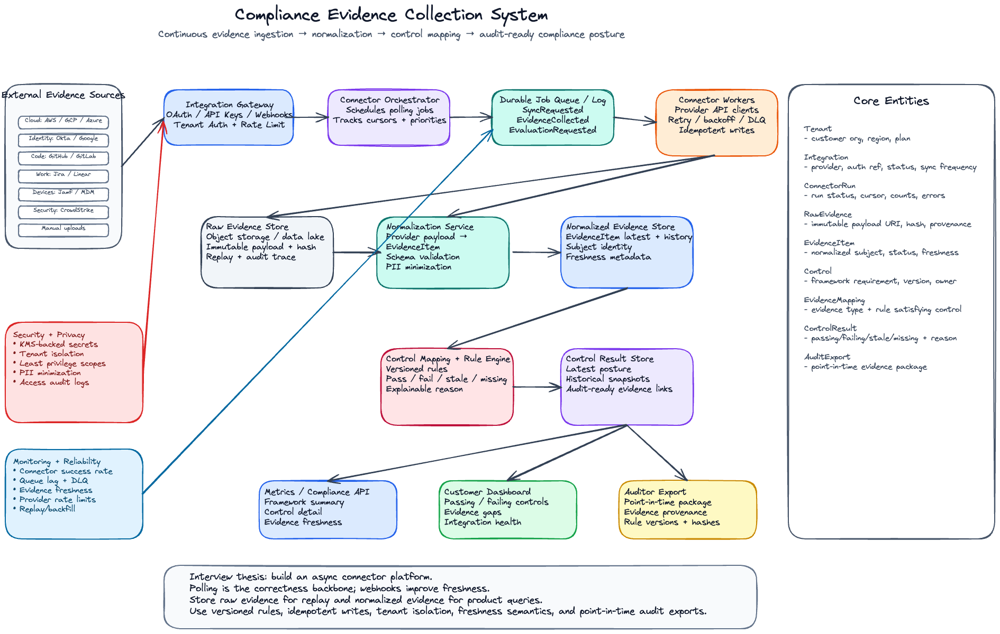

## 1. Problem Statement

Design a system that continuously collects evidence from external systems such as cloud providers, HR systems, GitHub, Jira, device-management tools, and security platforms in order to prove that a company is satisfying compliance controls.

The system should support frameworks such as SOC 2, ISO 27001, HIPAA, PCI, GDPR, or custom internal security programs.

The core product goal is to answer questions like:

- Are employees completing required security training?
- Are production repositories protected by code review?
- Are cloud resources configured securely?
- Are laptops encrypted and monitored?
- Is evidence fresh enough for an auditor?
- Which controls are passing, failing, stale, or missing evidence?

---

## 2. Clarifying Questions

Before designing, I would ask:

1. **Evidence sources**: Which integrations are required first — AWS, GCP, Azure, Okta, Google Workspace, GitHub, Jira, Jamf, CrowdStrike, HRIS?
2. **Collection mode**: Do integrations support webhooks, polling, or both?
3. **Freshness SLA**: How fresh does evidence need to be? Minutes, hourly, daily?
4. **Scale**: How many customers, integrations per customer, assets per integration, and evidence records per day?
5. **Control model**: Are controls built-in, customer-configurable, or both?
6. **Audit requirements**: Do auditors need point-in-time evidence snapshots and exports?
7. **Security requirements**: What credentials are stored, how are they encrypted, and what tenant-isolation guarantees are required?
8. **Retention**: How long should raw evidence, normalized evidence, and audit exports be retained?
9. **Correctness**: Should control status update immediately or only after scheduled evaluation?
10. **Manual evidence**: Do customers upload screenshots, PDFs, policies, or attestations?

---

## 3. Requirements

### Functional Requirements

The system should:

- Connect to many external SaaS and cloud providers.
- Collect evidence continuously through polling and webhooks.
- Normalize provider-specific data into a common evidence model.
- Map evidence to compliance controls.
- Evaluate whether controls are passing, failing, stale, or missing evidence.
- Show evidence freshness and provenance.
- Support auditor exports.
- Support manual evidence upload.
- Support historical point-in-time reporting.
- Support customer-facing dashboards and internal operations views.

### Non-Functional Requirements

The system should be:

- **Reliable**: connector failures should not corrupt evidence state.
- **Secure**: tenant data and credentials must be strongly isolated.
- **Auditable**: every evidence mutation and control decision should be explainable.
- **Scalable**: support many tenants and many integrations.
- **Idempotent**: repeated syncs should not create duplicate evidence.
- **Observable**: connector freshness, failure rate, and evidence gaps should be monitored.
- **Extensible**: adding a new provider should not require rewriting the core platform.

---

## 4. Scale Assumptions

Example scale assumptions:

- 50,000 customer tenants.
- 10 to 100 integrations per tenant.
- 10,000 to 10,000,000 assets per large enterprise tenant.
- 100 million to billions of evidence records stored historically.
- Webhook bursts during customer onboarding or incident events.
- Polling jobs running from every few minutes to daily depending on provider and control criticality.

The exact numbers matter less than the design principle: connector work should be asynchronous, partitioned by tenant and integration, and isolated from customer dashboard serving.

---

## 5. Core Entity Definitions

### Tenant

Represents a customer organization.

```ts
Tenant {
  tenant_id: string
  name: string
  plan_type: string
  region: string
  created_at: timestamp
}
```

### Integration

Represents a connected external system for a tenant.

```ts
Integration {
  integration_id: string
  tenant_id: string
  provider: 'aws' | 'gcp' | 'github' | 'okta' | 'jira' | 'jamf' | 'crowdstrike' | 'manual'
  status: 'active' | 'paused' | 'error' | 'revoked'
  auth_type: 'oauth' | 'api_key' | 'service_account'
  encrypted_credential_ref: string
  last_successful_sync_at: timestamp
  last_attempted_sync_at: timestamp
  sync_frequency_minutes: number
  created_at: timestamp
  updated_at: timestamp
}
```

### Connector Run

Represents one attempt to collect evidence from a provider.

```ts
ConnectorRun {
  run_id: string
  tenant_id: string
  integration_id: string
  provider: string
  run_type: 'scheduled' | 'webhook' | 'manual' | 'backfill'
  status: 'queued' | 'running' | 'succeeded' | 'partial_failure' | 'failed'
  started_at: timestamp
  finished_at: timestamp
  records_read: number
  records_written: number
  error_code?: string
  error_message?: string
  cursor_before?: string
  cursor_after?: string
}
```

### Raw Evidence

Stores immutable provider-specific payloads for replay, debugging, and audit traceability.

```ts
RawEvidence {
  raw_evidence_id: string
  tenant_id: string
  integration_id: string
  provider: string
  provider_resource_id: string
  provider_event_time: timestamp
  collected_at: timestamp
  payload_blob_uri: string
  payload_hash: string
  schema_version: string
  run_id: string
}
```

### Normalized Evidence

Provider-specific data converted into a stable product model.

```ts
EvidenceItem {
  evidence_id: string
  tenant_id: string
  integration_id: string
  provider: string
  evidence_type: string

  subject_type: 'employee' | 'repo' | 'cloud_resource' | 'device' | 'ticket' | 'policy' | 'vendor'
  subject_id: string
  subject_display_name: string

  status: 'pass' | 'fail' | 'unknown' | 'not_applicable'
  value: json
  evidence_time: timestamp
  collected_at: timestamp
  freshness_expires_at: timestamp

  source_raw_evidence_id: string
  idempotency_key: string
  provenance: json

  created_at: timestamp
  updated_at: timestamp
}
```

### Control

Represents a compliance requirement.

```ts
Control {
  control_id: string
  framework: 'SOC2' | 'ISO27001' | 'HIPAA' | 'PCI' | 'CUSTOM'
  control_code: string
  title: string
  description: string
  owner_team: string
  version: string
  active: boolean
}
```

### Evidence Mapping

Defines which evidence can satisfy a control.

```ts
EvidenceMapping {
  mapping_id: string
  control_id: string
  evidence_type: string
  provider?: string
  rule_id: string
  required_freshness_days: number
  required_scope: json
  active: boolean
}
```

### Control Result

Materialized result of evaluating a control for a tenant.

```ts
ControlResult {
  tenant_id: string
  control_id: string
  evaluation_id: string
  status: 'passing' | 'failing' | 'stale' | 'missing_evidence' | 'not_applicable'
  reason: string
  evidence_ids: string[]
  evaluated_at: timestamp
  rule_version: string
}
```

### Audit Export

Represents an auditor-facing package.

```ts
AuditExport {
  export_id: string
  tenant_id: string
  framework: string
  requested_by: string
  status: 'queued' | 'generating' | 'ready' | 'failed'
  control_ids: string[]
  evidence_snapshot_time: timestamp
  export_uri: string
  created_at: timestamp
}
```

---

## 6. High-Level Architecture

```txt
External Systems
  AWS / GCP / Azure / Okta / GitHub / Jira / Jamf / Security Tools
        |
        v
Integration Gateway
  - OAuth callback
  - API key registration
  - Webhook receiver
  - Tenant auth and rate limiting
        |
        v
Connector Orchestrator
  - Schedules polling jobs
  - Handles webhook-triggered jobs
  - Maintains sync cursors
  - Applies provider rate limits
        |
        v
Job Queue / Durable Log
  - ConnectorSyncRequested
  - EvidenceCollected
  - EvidenceNormalized
  - ControlEvaluationRequested
        |
        v
Connector Workers
  - Provider API clients
  - Retry/backoff
  - Idempotent writes
  - Dead-letter queue
        |
        +----------------------+
        |                      |
        v                      v
Raw Evidence Store       Normalization Service
  S3/GCS/Data Lake          Provider payload -> EvidenceItem
        |                      |
        +----------+-----------+
                   v
            Evidence Store
            Postgres / DynamoDB / MongoDB / OLAP
                   |
                   v
          Control Mapping + Rule Engine
                   |
                   v
           Control Result Store
                   |
          +--------+---------+
          |                  |
          v                  v
   Customer Dashboard     Auditor Export API
```

---

## 7. Write Path: Evidence Collection

### Step 1: Customer connects an integration

A customer connects GitHub, AWS, Okta, Jira, or another provider.

The system stores:

- tenant ID
- provider type
- OAuth token or credential reference
- scopes granted
- initial sync cursor
- sync frequency

Credentials are encrypted using a KMS-backed secret store. The product database stores only a reference to the encrypted credential.

### Step 2: Connector scheduler creates sync jobs

The scheduler scans active integrations and creates jobs:

```ts
ConnectorSyncRequested {
  tenant_id: string
  integration_id: string
  provider: string
  sync_type: 'incremental' | 'full' | 'backfill'
  cursor: string
  requested_at: timestamp
}
```

Jobs are partitioned by `tenant_id` and `integration_id` so one noisy tenant cannot starve others.

### Step 3: Connector worker fetches provider data

Each connector worker owns provider-specific extraction logic.

Examples:

- GitHub: repositories, branch protection, pull request review settings.
- AWS: IAM users, S3 bucket policies, CloudTrail status, security groups.
- Okta: users, MFA enrollment, groups, login policy.
- Jamf: device encryption and screen-lock status.
- Jira: security review tickets and approval workflow.

The connector worker should be:

- idempotent
- rate-limit aware
- retry-safe
- cursor-based
- isolated per tenant

### Step 4: Store raw evidence

Provider payloads are stored in immutable raw storage.

This is useful for:

- debugging connector bugs
- replaying normalization logic
- proving source provenance
- backfilling after schema changes
- auditor traceability

### Step 5: Normalize evidence

Normalization transforms provider-specific records into a stable `EvidenceItem` model.

Example GitHub branch protection raw data becomes:

```ts
EvidenceItem {
  evidence_type: 'repo_branch_protection_enabled'
  subject_type: 'repo'
  subject_id: 'github:org/repo-name'
  status: 'pass'
  value: {
    requires_pull_request_review: true,
    required_approving_review_count: 2,
    dismisses_stale_reviews: true
  }
}
```

### Step 6: Trigger control evaluation

When new evidence arrives, the system emits:

```ts
ControlEvaluationRequested {
  tenant_id: string
  evidence_id: string
  evidence_type: string
  subject_id: string
  collected_at: timestamp
}
```

The rule engine evaluates impacted controls and writes materialized control results.

---

## 8. Read Path: Dashboard and API

The dashboard should not query raw evidence directly for every page load.

Instead, it should query precomputed views:

- latest control results by tenant and framework
- evidence freshness by integration
- failing controls by owner
- missing evidence by control
- audit-ready evidence packages

Example dashboard query:

```sql
SELECT
  framework,
  COUNT(*) FILTER (WHERE status = 'passing') AS passing_controls,
  COUNT(*) FILTER (WHERE status = 'failing') AS failing_controls,
  COUNT(*) FILTER (WHERE status = 'stale') AS stale_controls,
  COUNT(*) FILTER (WHERE status = 'missing_evidence') AS missing_controls
FROM control_results_latest
WHERE tenant_id = :tenant_id
GROUP BY framework;
```

For detailed control pages, the API can fetch:

- current control result
- evidence items used to satisfy the control
- freshness metadata
- source integration
- rule version
- auditor explanation

---

## 9. Storage Choices

### Raw Evidence Store

Use object storage such as S3 or GCS.

Good for:

- immutable raw payloads
- cheap long-term retention
- replay and backfill
- partitioning by tenant, provider, and date

Partition example:

```txt
s3://raw-evidence/tenant_id=<tenant>/provider=github/date=2026-07-02/run_id=<run>/payload.json
```

### Operational Store

Use Postgres, MySQL, DynamoDB, or MongoDB depending on existing company stack.

Good for:

- integrations
- connector runs
- latest evidence state
- control results
- dashboard queries

Key indexing patterns:

- `(tenant_id, provider, status)`
- `(tenant_id, control_id, evaluated_at)`
- `(tenant_id, evidence_type, subject_id)`
- `(tenant_id, integration_id, last_successful_sync_at)`

### OLAP / Warehouse

Use Snowflake, BigQuery, ClickHouse, Pinot, or Druid for analytical queries.

Good for:

- historical evidence trends
- audit reports
- connector health analysis
- compliance posture over time

### Cache

Use Redis or CDN-backed API cache for hot dashboard summaries.

Cache keys should include tenant, framework, and snapshot version.

---

## 10. Control Mapping and Rule Evaluation

A compliance control usually needs one or more evidence types.

Example:

```txt
Control: Production code changes require review before merge.
Framework: SOC 2
Evidence:
  - GitHub branch protection enabled
  - Required approving review count >= 1
  - Admin bypass disabled
  - Latest evaluation is fresh within 7 days
```

A rule can be represented declaratively:

```json
{
  "rule_id": "github_branch_protection_required_v3",
  "control_id": "soc2_cc8_1",
  "evidence_type": "repo_branch_protection_enabled",
  "conditions": [
    { "field": "value.requires_pull_request_review", "op": "eq", "value": true },
    { "field": "value.required_approving_review_count", "op": "gte", "value": 1 },
    { "field": "freshness_age_days", "op": "lte", "value": 7 }
  ]
}
```

Rule versioning is important. If the definition changes, old audit results should remain explainable because they reference the rule version that produced them.

---

## 11. Idempotency and Deduplication

Repeated connector runs should not create duplicate evidence.

Use an idempotency key:

```txt
hash(tenant_id, provider, integration_id, evidence_type, subject_id, provider_resource_id, evidence_time)
```

For latest-state evidence, upsert by:

```txt
tenant_id + evidence_type + subject_id + provider_resource_id
```

For historical evidence, append immutable versions but link them through the same subject identity.

---

## 12. Freshness and Staleness

Evidence should have freshness semantics.

Example:

```ts
freshness_expires_at = collected_at + required_freshness_days;
```

A control can be:

- `passing`: valid evidence exists and satisfies the rule
- `failing`: fresh evidence exists and violates the rule
- `stale`: old evidence exists but is past freshness SLA
- `missing_evidence`: no evidence has ever been collected
- `not_applicable`: the control does not apply to the tenant or asset

This is important because stale evidence is different from failing evidence.

---

## 13. Webhooks vs Polling

### Polling

Pros:

- Works for most providers.
- Easier to control consistency.
- Good for periodic compliance checks.

Cons:

- Higher provider API usage.
- Less real-time.
- Needs cursor and rate-limit management.

### Webhooks

Pros:

- Low-latency updates.
- Less API polling.
- Better user experience for changes.

Cons:

- Not every provider supports them.
- Webhooks can be duplicated, missing, or out of order.
- Must verify signatures and replay protection.

Recommended approach:

Use **polling as the correctness backbone** and **webhooks as freshness accelerators**.

---

## 14. Failure Handling

### Connector failures

Handle with:

- retry with exponential backoff
- provider-specific rate-limit handling
- dead-letter queue
- partial failure status
- customer-visible sync errors
- internal alerting after repeated failures

### Normalization failures

Handle with:

- schema validation
- quarantine invalid payloads
- preserve raw evidence for replay
- version normalization code
- replay affected partitions after fixes

### Rule evaluation failures

Handle with:

- retryable evaluation jobs
- idempotent result writes
- rule-version rollback
- evaluation error status
- alerting when controls cannot be evaluated

---

## 15. Monitoring and Data Quality

Monitor both platform health and evidence quality.

### Platform metrics

- connector run success rate
- connector latency
- queue lag
- retry rate
- dead-letter count
- provider API rate-limit events
- normalization failure rate
- control evaluation latency

### Evidence quality metrics

- evidence freshness by tenant and provider
- controls missing evidence
- sudden drop in evidence volume
- sudden spike in failing controls
- stale evidence percentage
- integration authorization failures

### Example alerts

```txt
GitHub evidence volume dropped 80% in the last hour.
Okta connector failure rate > 10% for 15 minutes.
AWS CloudTrail evidence stale for enterprise tenants.
Rule evaluation queue lag > 30 minutes.
```

---

## 16. Security and Privacy

This system handles sensitive customer security posture data, so security is core to the design.

### Tenant isolation

- Every record includes `tenant_id`.
- Enforce tenant isolation at API, query, and storage layers.
- Use row-level authorization where available.
- Avoid cross-tenant background jobs sharing mutable state.

### Credential security

- Store credentials in a KMS-backed secret manager.
- Encrypt tokens at rest.
- Rotate credentials where possible.
- Limit provider scopes to least privilege.
- Audit all credential access.

### PII minimization

- Do not store unnecessary employee PII.
- Prefer stable internal subject IDs and hashed identifiers.
- Redact sensitive raw payload fields during normalization when possible.
- Apply retention policies by data class.

### Auditability

- Log every evidence change.
- Log every control result change.
- Log every export.
- Log every manual override.
- Preserve rule versions and evidence provenance.

---

## 17. Manual Evidence Upload

Some controls require manually uploaded evidence, such as:

- security policy PDFs
- screenshots
- signed attestations
- vendor questionnaires
- penetration test reports

Manual evidence should go through the same normalized evidence model.

```ts
ManualEvidenceUpload {
  upload_id: string
  tenant_id: string
  uploaded_by: string
  file_uri: string
  file_hash: string
  evidence_type: string
  control_ids: string[]
  expiration_date: timestamp
  approval_status: 'pending' | 'approved' | 'rejected'
}
```

Manual evidence should support:

- reviewer approval
- expiration date
- audit trail
- version history
- file hash for integrity

---

## 18. Backfills and Reprocessing

Backfills are needed when:

- a new control is added
- a rule definition changes
- a connector bug is fixed
- a provider API schema changes
- a customer connects a new integration and wants historical evidence

Because raw evidence is immutable, the system can re-run normalization and control evaluation from historical payloads.

Backfill flow:

```txt
Select raw evidence partition
  -> run normalization with new schema version
  -> write normalized evidence versions
  -> re-run impacted control rules
  -> write new control results
  -> update dashboard snapshot
```

Backfills should be throttled and isolated from real-time connector jobs.

---

## 19. Correctness Guarantees

I would define correctness in tiers:

### Dashboard correctness

- Near-real-time but may lag during connector failures.
- Shows freshness timestamp and integration health.
- Uses latest materialized control results.

### Audit correctness

- Generated from point-in-time snapshots.
- Includes evidence provenance.
- Includes rule versions.
- Includes export timestamp and evidence hashes.

### Replay correctness

- Raw evidence is immutable.
- Normalization is versioned.
- Control evaluation is reproducible.

---

## 20. API Examples

### Get compliance posture summary

```http
GET /api/tenants/:tenantId/compliance/summary?framework=SOC2
```

Response:

```json
{
  "framework": "SOC2",
  "passing_controls": 48,
  "failing_controls": 3,
  "stale_controls": 2,
  "missing_evidence_controls": 1,
  "last_evaluated_at": "2026-07-02T12:00:00Z"
}
```

### Get control detail

```http
GET /api/tenants/:tenantId/controls/:controlId
```

Response:

```json
{
  "control_id": "soc2_cc8_1",
  "status": "passing",
  "reason": "All production repositories require pull request review.",
  "evidence": [
    {
      "evidence_id": "ev_123",
      "provider": "github",
      "subject_type": "repo",
      "subject_id": "github:acme/api-service",
      "collected_at": "2026-07-02T11:55:00Z",
      "freshness_expires_at": "2026-07-09T11:55:00Z"
    }
  ]
}
```

---

## 21. Lead Engineer Trade-Offs

### Polling vs webhooks

Use polling for correctness and webhooks for faster updates.

### Raw vs normalized storage

Store both. Raw evidence enables replay and audit traceability. Normalized evidence enables product queries and control evaluation.

### Synchronous vs asynchronous collection

Use asynchronous jobs. External provider APIs are slow, rate-limited, and unreliable.

### Latest state vs historical snapshots

Store latest state for fast dashboards and immutable historical snapshots for audits.

### Declarative rules vs custom code

Use declarative rules for common controls. Allow controlled custom evaluators for complex checks.

### One database vs specialized stores

Use the operational DB for product state, object storage for raw evidence, and OLAP/warehouse for historical analytics.

---

## 22. Interview Summary

A strong answer:

> I would build this as an asynchronous evidence collection platform. Customers connect external systems through integrations. A connector orchestrator schedules polling jobs and receives webhooks. Connector workers fetch provider data, store immutable raw evidence, normalize it into a stable evidence model, and trigger rule evaluation. The rule engine maps evidence to versioned compliance controls and writes materialized control results. The dashboard reads precomputed posture summaries, while auditors can generate point-in-time exports that include evidence provenance, freshness, hashes, and rule versions. I would optimize for idempotency, tenant isolation, provider rate-limit handling, replayability, and clear distinction between fresh dashboard state and authoritative audit snapshots.

---

## 23. Follow-Up Questions to Prepare For

### How would you add a new integration?

I would add it through the connector platform. The provider-specific code implements authentication, cursor management, API fetches, and payload-to-evidence normalization. The platform handles scheduling, retries, rate limits, secrets, observability, and idempotency.

### How do you handle a provider outage?

Existing evidence remains visible but becomes stale after its freshness window. Connector runs move into retry or partial failure states. The dashboard should show integration health so customers understand whether a failing control is caused by actual risk or stale evidence.

### How do you prevent duplicate evidence?

Use idempotency keys based on tenant, integration, evidence type, subject ID, provider resource ID, and evidence time. Connector writes are upserts for latest-state evidence and append-only for historical evidence.

### How do you support auditors asking for evidence from a past date?

Use point-in-time snapshots. Store immutable raw evidence, versioned normalized evidence, versioned rules, and timestamped control results. Audit exports should reference the snapshot time and evidence hashes.

### How do you ensure tenant isolation?

Every record is tenant-scoped. API authorization validates tenant access. Background jobs are partitioned by tenant. Secrets are stored per integration. Logs and metrics should avoid leaking cross-tenant identifiers.

### How do you handle manual overrides?

Manual overrides should be explicit, time-bound, approved, and audit logged. They should not delete the original failing evidence. The control result should show that the pass status came from an override, not from automated evidence.
