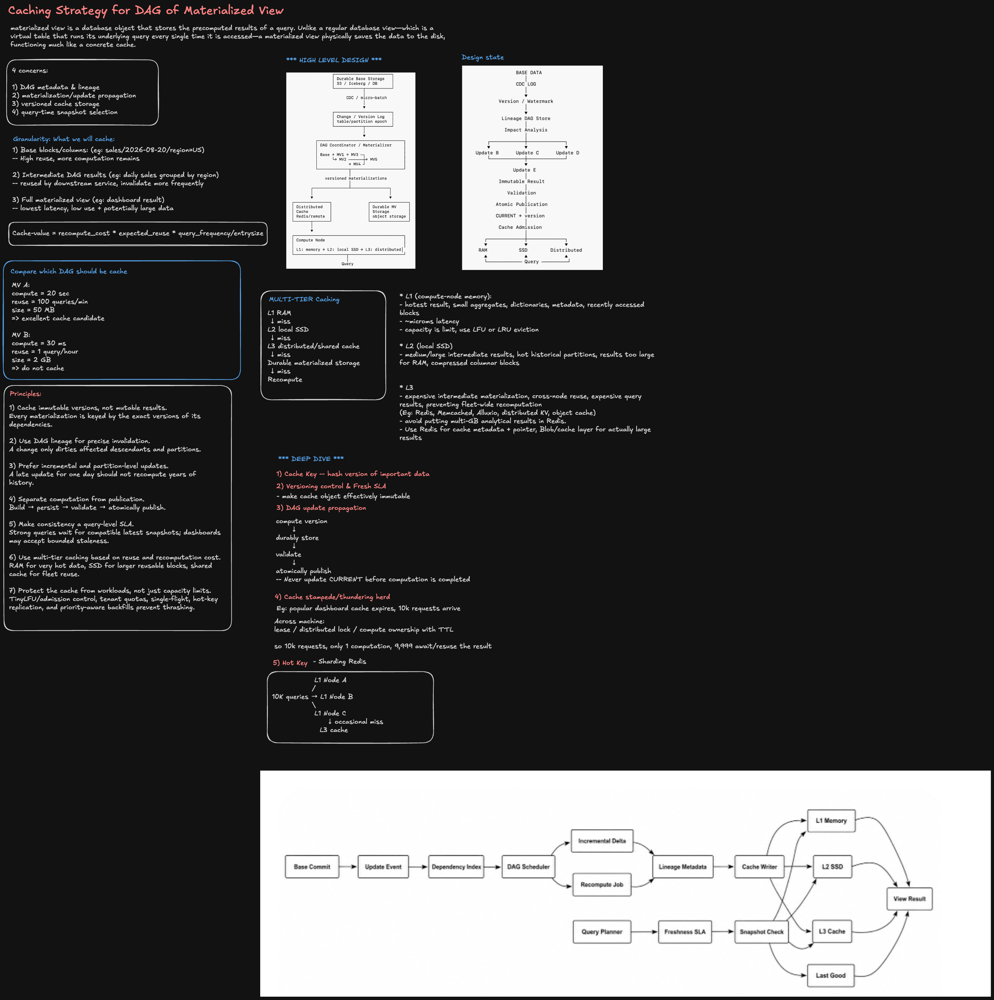

# Caching Strategy for DAG of Materialized Views

## 0. Interview Framing

A **materialized view (MV)** is a database object that stores the *precomputed* results of a query. Unlike a regular database view — a virtual table that re-runs its underlying query every time it is accessed — a materialized view physically saves the data to disk, functioning much like a concrete cache.

In a real analytics platform, materialized views are not standalone: they form a **DAG**. `MV3` may depend on `MV1`, which depends on base tables; `MV5` may depend on both `MV3` and `MV4`. Caching one node's result without understanding the DAG risks serving stale data whenever an upstream dependency changes.

Four concerns drive this design:

1. **DAG metadata & lineage** — which views depend on which, so we know what to recompute and what to invalidate.
2. **Materialization / update propagation** — how a base-data change flows through the DAG to produce new, correct results.
3. **Versioned cache storage** — caching immutable versions, never mutable in-place results.
4. **Query-time snapshot selection** — choosing which version of a result a given query is allowed to read.

---

## 1. What We Cache — Granularity

| Granularity                                                            | Reuse                             | Trade-off                                                       |
| ------------------------------------------------------------------------ | ---------------------------------- | ------------------------------------------------------------------ |
| **Base blocks / columns** (e.g. `sales/2026-08-20/region=US`)            | High reuse across many MVs         | More downstream computation still remains after a cache hit.       |
| **Intermediate DAG results** (e.g. daily sales grouped by region)        | Reused by downstream services      | Must be invalidated more frequently as it sits closer to raw data. |
| **Full materialized view** (e.g. a dashboard's final result)             | Lowest latency on a cache hit      | Lowest reuse rate, and can be large.                              |

None of these is universally correct — the right mix is a **cost/benefit decision per DAG node**, not a single global policy.

### Cache-value scoring

```text
cache_value = recompute_cost * expected_reuse * query_frequency / entry_size
```

### Worked comparison

```text
MV A:
  compute  = 20 sec
  reuse    = 100 queries/min
  size     = 50 MB
  => excellent cache candidate (expensive to compute, reused constantly, small)

MV B:
  compute  = 30 ms
  reuse    = 1 query/hour
  size     = 2 GB
  => do not cache (cheap to recompute, rarely reused, large footprint)
```

This scoring function should run **per DAG node**, not per dataset, since two nodes on the same base data can have wildly different cache value.

---

## 2. High-Level Architecture

### Materialization pipeline

```text
Durable Base Storage
  S3 / Iceberg / DB
        |
        v
CDC / micro-batch
        |
        v
Change / Version Log
  table / partition epoch
        |
        v
DAG Coordinator / Materializer
  Base -> MV1 -> MV3 -\
       \-> MV2 -> MV4 -+-> MV5
        |
        v
versioned materializations
        |
   +----+----+
   |         |
   v         v
Distributed   Durable MV Storage
Cache          object storage
Redis/remote
   |
   v
Compute Node
  L1: memory -> L2: local SSD -> L3: distributed
        |
        v
      Query
```

### Update-to-publish state machine

```text
BASE DATA
    |
    v
 CDC LOG
    |
    v
Version / Watermark
    |
    v
Lineage DAG Store
    |
    v
Impact Analysis
    |
    +--------+--------+
    v        v        v
 Update B  Update C  Update D
    |        |        |
    +--------+--------+
             v
         Update E
             |
             v
     Immutable Result
             |
             v
        Validation
             |
             v
    Atomic Publication
             |
             v
     CURRENT -> version
             |
             v
      Cache Admission
             |
    +--------+--------+
    v        v        v
   RAM      SSD   Distributed
    +--------+--------+
             |
             v
           Query
```

Impact analysis is what makes this scale: a single base-data change fans out only to the descendants that actually depend on it (`B`, `C`, `D`), and those results merge back into a single downstream node (`E`) before anything is published.

---

## 3. Core Entities

```ts
type DagNode = {
  viewId: string;
  dependsOn: string[]; // upstream node ids
  granularity: 'base_block' | 'intermediate' | 'full_view';
  currentVersion: string;
  cacheValueScore: number; // recompute_cost * expected_reuse * query_frequency / entry_size
};

type VersionWatermark = {
  tableOrPartition: string;
  epoch: number; // monotonically increasing version / commit id
  committedAtMs: number;
};

type MaterializationJob = {
  jobId: string;
  viewId: string;
  inputVersions: Record<string, string>; // dependency -> exact version consumed
  outputVersion: string;
  status: 'building' | 'validating' | 'ready_to_publish' | 'published' | 'failed';
};

type CacheEntry = {
  cacheKey: string; // hash of viewId + inputVersions
  viewId: string;
  version: string;
  tier: 'L1_ram' | 'L2_ssd' | 'L3_distributed';
  sizeBytes: number;
  lastAccessedAtMs: number;
  accessCount: number;
};

type FreshnessSLA = {
  queryClass: 'strong' | 'bounded_staleness';
  maxStalenessMs?: number; // required when queryClass = 'bounded_staleness'
};
```

Keying every job and cache entry by **exact input versions**, not by "latest," is what makes results immutable and safely cacheable.

---

## 4. Multi-Tier Caching

```text
L1 RAM
  | miss
  v
L2 local SSD
  | miss
  v
L3 distributed / shared cache
  | miss
  v
Durable materialized storage
  | miss
  v
Recompute
```

| Tier                              | What lives here                                                                         | Latency        | Notes                                                                                          |
| ----------------------------------- | ------------------------------------------------------------------------------------------ | ---------------- | -------------------------------------------------------------------------------------------------- |
| **L1 — compute-node memory**       | Hottest results: small aggregates, dictionaries, metadata, recently accessed blocks       | ~microseconds  | Capacity-limited; use LFU or LRU eviction.                                                        |
| **L2 — local SSD**                  | Medium/large intermediate results, hot historical partitions, compressed columnar blocks that are too large for RAM | Low ms          | Bridges the gap between RAM capacity and network-hop cost.                                        |
| **L3 — distributed / shared cache** | Expensive intermediate materializations, cross-node reuse, expensive query results — prevents fleet-wide recomputation. Backed by Redis, Memcached, Alluxio, a distributed KV store, or an object cache. | Network hop     | **Avoid putting multi-GB analytical results directly in Redis.** Use Redis for cache metadata + pointer, and a blob/object store for the actual large payload. |

---

## 5. Deep Dive

### 5.1 Cache key design

The cache key is a **hash of the DAG node plus the exact versions of every input it depended on**:

```text
cacheKey = hash(viewId, inputVersions)
```

This guarantees two important properties:

- Two computations of the same view over the same input versions produce the same key and can safely share a cache entry.
- Any change to a single upstream input produces a different key, so stale results are structurally unreachable — there is nothing to "invalidate" in place.

### 5.2 Versioning control & freshness SLA

> Make the cache object **effectively immutable**.

Because a cache entry is keyed by exact input versions, once written it never needs to be mutated — only superseded by a new key when inputs change. This removes an entire class of invalidation races. Freshness becomes a property of **which version a query is allowed to read**, not of mutating a cached object:

- Strong-consistency queries wait for a version that is fully compatible with the latest committed inputs.
- Dashboards and other bounded-staleness consumers can read the latest **published** version even if a newer one is mid-build.

### 5.3 DAG update propagation

```text
compute version
      |
      v
durably store
      |
      v
validate
      |
      v
atomically publish
```

The critical rule:

> **Never update `CURRENT` before computation is completed.**

Separating computation from publication means a half-finished or failed materialization is never visible to readers. `CURRENT -> version` only advances after the new result is durably stored and validated, so a reader either sees the fully-consistent old version or the fully-consistent new one — never a partial one.

Propagation should also be **incremental and partition-level**: a late-arriving update for a single day should dirty and recompute only that day's downstream partitions, not replay years of history.

### 5.4 Cache stampede / thundering herd

**Scenario:** a popular dashboard's cache entry expires, and 10,000 requests arrive for it simultaneously.

**Fix:** across machines, use a lease / distributed lock / compute-ownership record with a TTL.

```text
10,000 requests arrive
        |
        v
1 request acquires the compute lease and recomputes
        |
        v
9,999 requests await and reuse that single result
```

Only one computation runs; everyone else attaches to it instead of independently recomputing the same expensive DAG node.

### 5.5 Hot key — sharding

A single popular cache key can still overload one cache node even with stampede protection solved. Shard L1 across nodes so the hot key's traffic fans out:

```text
                  L1 Node A
                 /
10K queries -> L1 Node B
                 \
                  L1 Node C
                       |
                       v occasional miss
                    L3 cache
```

Each L1 node independently holds a replica of the hot entry; only the occasional miss falls through to the shared L3 tier, instead of every one of the 10K queries hitting a single node.

---

## 6. Principles

1. **Cache immutable versions, not mutable results.** Every materialization is keyed by the exact versions of its dependencies.
2. **Use DAG lineage for precise invalidation.** A change only dirties affected descendants and partitions.
3. **Prefer incremental and partition-level updates.** A late update for one day should not recompute years of history.
4. **Separate computation from publication.** Build → persist → validate → atomically publish.
5. **Make consistency a query-level SLA.** Strong queries wait for compatible latest snapshots; dashboards may accept bounded staleness.
6. **Use multi-tier caching based on reuse and recomputation cost.** RAM for very hot data, SSD for larger reusable blocks, shared cache for fleet-wide reuse.
7. **Protect the cache from workloads, not just capacity limits.** TinyLFU/admission control, tenant quotas, single-flight, hot-key replication, and priority-aware backfills prevent thrashing.

---

## 7. Request Flows

### Update / materialization flow

```text
Base Commit
    |
    v
Update Event
    |
    v
Dependency Index
    |
    v
DAG Scheduler
    |
    +-------------------+
    v                    v
Incremental Delta    Recompute Job
    |                    |
    +---------+----------+
              v
       Lineage Metadata
              |
              v
         Cache Writer
              |
    +---------+---------+
    v         v          v
L1 Memory  L2 SSD    L3 Cache
    +---------+---------+
              |
              v
          View Result
```

### Query flow

```text
Query Planner
      |
      v
Freshness SLA
      |
      v
Snapshot Check
      |
  +---+---+---+-------+
  v   v   v            v
L1  L2  L3       Last Good (fallback)
  +---+---+---+-------+
              |
              v
          View Result
```

The query path always has a fallback to the **last good published version** if the freshest snapshot is not yet available at the requested consistency level — this is what lets bounded-staleness consumers stay fast even mid-recompute.

---

## 8. Example Verbal Answer

> I'd start by separating "what to cache" from "how to keep it correct." For what to cache, I'd score each DAG node by `recompute_cost * expected_reuse * query_frequency / entry_size` — an expensive, frequently-reused, small result is an excellent candidate, while a cheap, rarely-reused, large result is not, regardless of granularity.
>
> For correctness, the key idea is that every cached materialization is keyed by the exact versions of its dependencies, which makes cache entries effectively immutable — I never mutate a cached object, I only supersede its key when inputs change. Updates propagate through the DAG via impact analysis, so a base-data change only recomputes the affected descendants and partitions, not the whole graph. Computation is fully separated from publication: build, persist, validate, and only then atomically flip `CURRENT` to the new version, so readers never see a half-finished result.
>
> For storage, I'd use a multi-tier cache — RAM for the hottest small results, local SSD for larger intermediate results, and a distributed/shared cache for cross-node reuse, keeping large analytical payloads out of Redis directly and instead storing pointers there to blob storage. For operational safety, I'd add stampede protection via a compute lease so 10,000 simultaneous requests for an expired hot entry trigger exactly one recomputation, plus L1 sharding so a hot key's read traffic fans out across nodes instead of overloading one.
>
> Finally, freshness is a per-query SLA rather than a cache property: strong-consistency queries wait for a compatible latest snapshot, while dashboards can read the latest published version, or fall back to the last good version, and stay fast even while a newer materialization is still building.

---

## 9. Diagram

The accompanying whiteboard (`dag-caching.png`) captures:

- The four core concerns and the caching-granularity trade-offs.
- The cache-value formula and a worked MV-A/MV-B comparison.
- The high-level materialization pipeline and the update-to-publish state machine.
- The L1/L2/L3 multi-tier cache fallback chain.
- Deep dives on cache-key design, versioning, DAG update propagation, cache stampede handling, and hot-key sharding.
- The end-to-end update and query request flows.
