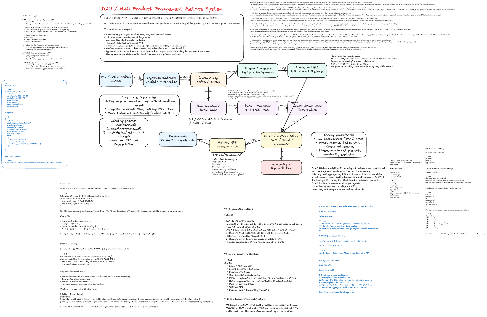
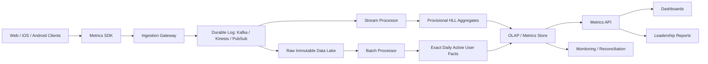

## 1. Problem Summary

Design a system that computes and serves product engagement metrics for a large consumer application.

An **active user** is a distinct canonical user who performs at least one qualifying activity event within a given time window.

The system must support:

- High-throughput ingestion from web, iOS, and Android clients.
- DAU and MAU computation at large scale.
- Near-real-time dashboards for today.
- Finalized historical metrics at T+1.
- Slicing by a governed set of dimensions: platform, country, and app version.
- Handling duplicate events, late events, out-of-order events, and backfills.
- Approximate dashboard metrics with bounded error, plus exact reporting for governed use cases.
- Strong monitoring, data quality, fault tolerance, and privacy controls.

---

## 2. Clarifying Questions

Before designing, I would ask:

1. **What counts as a qualifying event?**
   - Any event?
   - Or only an allowlist such as `app_open`, `session_start`, `login`, and `page_view`?

2. **Which MAU definition matters most to the business?**
   - Calendar-month uniques for board, finance, and reporting.
   - Rolling 30-day uniques for product health and retention monitoring.

3. **What is the day boundary?**
   - UTC day?
   - Product business timezone?
   - User-local timezone?

4. **What are the freshness and accuracy SLAs?**
   - Is 1–2% approximate error acceptable for dashboards?
   - Which reports require exact counts?

5. **Which dimensions are required?**
   - Platform, country, app version?
   - Event type?
   - Tenant, region, experiment, acquisition channel?

6. **What retention and privacy rules apply?**
   - How long do we keep raw events?
   - Can we store IP address, device ID, or user agent?
   - Do we need deletion support for privacy requests?

---

## 3. Definitions

### Active User

A user is active in a window if:

```txt
canonical_user_key has >= 1 qualifying event where event_time is inside the window
```

A qualifying event should be a curated allowlist, not every client event.

Example qualifying events:

```txt
app_open
session_start
login
page_view
```

Non-qualifying events might include:

```txt
heartbeat
background_sync
push_received
client_diagnostic
ad_impression_debug
```

This prevents background activity from inflating engagement metrics.

---

### DAU

**DAU** is the number of distinct active canonical users in a calendar day.

```txt
DAU(day D) = count_distinct(canonical_user_key)
where event_time >= D 00:00:00
  and event_time <  D+1 00:00:00
  and event_type is qualifying
```

For the main company dashboard, I would use **UTC day boundaries** unless the business explicitly requires user-local days.

Why UTC:

- Simple and globally consistent.
- Easier partitioning.
- Easier reconciliation with batch jobs.
- Avoids users changing time zones during the day.

For regional product analytics, we can additionally support user-local-day DAU as a derived metric.

---

### MAU Choice

I would choose **calendar-month MAU** as the primary official metric.

```txt
MAU(month M) = count_distinct(canonical_user_key)
where event_time >= first day of month 00:00:00 UTC
  and event_time <  first day of next month 00:00:00 UTC
  and event_type is qualifying
```

Why calendar-month MAU:

- Easier for leadership, board reporting, finance, and external reporting.
- Clear period close semantics.
- Easier to explain and reconcile.
- Matches common business reporting cycles.

Trade-off versus rolling 30-day MAU:

| Option             | Pros                                                     | Cons                                                                             |
| ------------------ | -------------------------------------------------------- | -------------------------------------------------------------------------------- |
| Calendar-month MAU | Simple, reportable, aligns with monthly business reviews | Less smooth during the month; early-month MAU starts low                         |
| Rolling 30-day MAU | Better for product health and trend monitoring           | More expensive to compute daily; harder to explain in finance/reporting contexts |

I would still support rolling 30-day MAU as a product-health metric, but I would label it separately:

```txt
rolling_30d_active_users
```

Do not call both metrics simply `MAU`.

---

## 4. Scale Assumptions

Assume:

- 10M–100M active users.
- Hundreds of thousands to millions of events per second at peak.
- Web, iOS, and Android clients.
- Events can arrive late, duplicated, retried, or out of order.
- Dashboard freshness target: seconds to low minutes.
- Historical finalization target: T+1.
- Dashboard error tolerance: approximately 1–2%.
- Finance/compliance metrics require exact numbers.

---

## 5. High-Level Architecture

```txt
Clients
  -> Edge / Metrics SDK
  -> Event Ingestion Gateway
  -> Durable Event Log
  -> Raw Immutable Data Lake
  -> Stream Aggregation for near-real-time provisional metrics
  -> Batch Aggregation for authoritative finalized metrics
  -> OLAP / Serving Store
  -> Metrics API
  -> Dashboards / Leadership Reports
```

This is a lambda-style architecture:

- **Streaming path** gives fast provisional numbers for today.
- **Batch path** gives authoritative finalized numbers at T+1.
- Both read from the same durable event log / raw archive.

---

## 6. Event Ingestion

### Client Event Sources

Events come from:

- Web SDK.
- iOS SDK.
- Android SDK.
- Backend services, if server-side activity should count.

Clients should not directly define business metrics. They emit normalized events, and the server-side pipeline applies the qualifying-event allowlist.

---

### Required Event Fields

```ts
interface ActivityEvent {
  event_id: string; // globally unique UUID/ULID for deduplication
  event_type: string; // app_open, session_start, login, page_view, etc.

  event_time: string; // client-observed event time, ISO timestamp
  ingestion_time: string; // server receive time

  user_id?: string; // present when logged in
  anonymous_id?: string; // cookie/install/session identity
  device_id?: string; // mobile install/device scoped ID if allowed

  platform: 'web' | 'ios' | 'android';
  app_version: string;
  country?: string; // ideally derived server-side from coarse geo

  session_id?: string;
  source: string; // sdk, backend, import, replay
  schema_version: number;

  privacy_context?: {
    consent_region?: string;
    tracking_allowed?: boolean;
  };
}
```

Important fields:

- `event_id` for duplicate detection.
- `event_time` for event-time metrics.
- `ingestion_time` for freshness, lateness, and debugging.
- `user_id`, `anonymous_id`, and `device_id` for identity resolution.
- `platform`, `country`, and `app_version` for sliceable dashboards.
- `schema_version` for safe evolution.

---

## 7. Ingestion Gateway

The ingestion gateway is responsible for:

- Authentication of SDK/app source.
- Rate limiting and abuse protection.
- Schema validation.
- Required field validation.
- Assigning `ingestion_time`.
- Normalizing platform, country, and app version.
- Rejecting or quarantining malformed events.
- Writing valid events to the durable log.

The gateway should be horizontally scalable and stateless.

For high availability, it should return success only after writing to a durable log such as Kafka, Kinesis, or Pub/Sub.

---

## 8. Durable Log and Raw Archive

### Durable Log

Use Kafka / Kinesis / Pub/Sub as the ingestion backbone.

Partitioning strategy:

```txt
partition_key = hash(canonical_candidate_key or user_id or anonymous_id)
```

Benefits:

- Events for the same user mostly land in the same partition.
- Improves local dedup and aggregation efficiency.
- Allows replay from offsets.

### Raw Immutable Archive

Write all valid events to a data lake:

```txt
s3://events/activity_events/dt=YYYY-MM-DD/hour=HH/
```

Partition by ingestion date first, and also include event date as a column.

Why raw archive matters:

- Batch recomputation.
- Backfills.
- Auditing.
- Reconciliation.
- Recovery from streaming bugs.

---

## 9. Identity Model

### Canonical User Key

The canonical key should be deterministic and privacy-safe.

Suggested rule:

```txt
if user_id exists:
  canonical_user_key = hash(user_id)
else if anonymous_id exists:
  canonical_user_key = hash('anon:' + anonymous_id)
else if device_id exists and policy allows:
  canonical_user_key = hash('device:' + device_id)
else:
  drop from DAU/MAU or count as unknown_active_user depending on product policy
```

I would avoid counting completely unidentified events in official DAU/MAU unless the business explicitly accepts that limitation.

---

### Logged-Out Users

For logged-out traffic:

- Web: use a first-party anonymous cookie ID if consent allows.
- Mobile: use install-scoped anonymous ID rather than raw device identifiers.
- Avoid raw IP/user-agent fingerprinting for privacy-sensitive identity.

Logged-out users can be counted under anonymous identity, but official reporting should clearly state whether anonymous users are included.

---

### Identity Stitching

When an anonymous user logs in, we may learn:

```txt
anonymous_id A -> user_id U
```

There are two options:

#### Option 1: Forward-only stitching

Only future events use `user_id` as the canonical key.

Pros:

- Simple.
- Avoids restating historical metrics.
- Easier to explain.

Cons:

- Historical anonymous activity remains separate.
- Can overcount users who were anonymous earlier and logged in later.

#### Option 2: Historical restatement

Reprocess past events and map old anonymous activity to the logged-in user.

Pros:

- More accurate user-level history.

Cons:

- Metrics can change after publication.
- Requires versioned identity graph and backfills.
- Harder to explain to leadership.

For official DAU/MAU, I would use forward-only stitching by default and support restated analysis in a separate governed pipeline.

---

## 10. De-Duplication

Duplicates happen because clients retry, networks fail, and producers can resend.

### Event-Level Deduplication

Use `event_id` as the primary dedup key.

Streaming dedup:

```txt
dedup_key = event_id
state_ttl = lateness_window + safety_margin
```

Example:

```txt
state_ttl = 72 hours
```

If an event with the same `event_id` appears again within the TTL, drop it.

### Batch Deduplication

Batch jobs deduplicate with:

```sql
ROW_NUMBER() OVER (PARTITION BY event_id ORDER BY ingestion_time ASC) = 1
```

Batch dedup is authoritative because it can scan a larger window and correct stream misses.

### Metric-Level Deduplication

Even if duplicate events pass through, DAU/MAU use distinct canonical user keys, so duplicate events from the same user do not inflate counts unless identity is inconsistent.

---

## 11. Event-Time Correctness

Metrics should be computed by `event_time`, not `ingestion_time`.

Why:

- A user active at 11:59 PM should count for that day even if the event arrives at 12:01 AM.
- Mobile clients may send events after reconnecting.

### Watermarks

Use event-time watermarks in streaming aggregation.

Example policy:

```txt
Allowed lateness for provisional updates: 48 hours
Finalization: T+1 daily batch
Long-tail corrections: backfill pipeline
```

Streaming outputs are marked as:

```txt
provisional
```

Batch outputs are marked as:

```txt
final
```

For very late events after finalization:

- Either ignore for official metrics after a defined cutoff.
- Or publish corrections with metric versioning.

The policy should be explicit.

---

## 12. DAU Computation

### Approximate Dashboard DAU

For near-real-time dashboards, use HyperLogLog sketches.

Key:

```txt
metric = dau
bucket = event_date_utc
slice = platform, country, app_version
value = HLL(canonical_user_key)
```

Each stream worker maintains HLL sketches for active buckets.

Then the serving layer merges sketches:

```txt
DAU = cardinality(merge(HLL shards for day + dimensions))
```

Why HLL:

- Memory efficient.
- Mergeable.
- Works well for high-cardinality distinct counts.
- Good for 1–2% dashboard error tolerance.

---

### Exact DAU

For exact reporting, use batch computation from deduplicated raw events.

Options:

1. Distributed SQL distinct count:

```sql
SELECT
  event_date,
  platform,
  country,
  app_version,
  COUNT(DISTINCT canonical_user_key) AS exact_dau
FROM deduped_activity_events
WHERE event_type IN ('app_open', 'session_start', 'login', 'page_view')
GROUP BY 1, 2, 3, 4;
```

2. Daily distinct user table:

```txt
daily_active_user_fact(
  event_date,
  canonical_user_key,
  platform,
  country,
  app_version
)
```

3. Roaring Bitmaps if user IDs can be mapped to integer IDs.

For exact governed metrics, I would create a daily distinct user fact table and compute exact aggregates from it.

---

## 13. MAU Computation

### Calendar-Month MAU

For official calendar-month MAU:

```txt
month_key = YYYY-MM
MAU = distinct canonical_user_key across all qualifying events in the calendar month
```

Approximate path:

- Maintain daily HLL sketches.
- Merge daily HLL sketches for all days in the month.

```txt
calendar_month_mau = cardinality(merge(day_1_hll, day_2_hll, ..., day_N_hll))
```

Exact path:

- Use the daily active user fact table.
- Deduplicate users across the month.

```sql
SELECT
  month,
  platform,
  country,
  app_version,
  COUNT(DISTINCT canonical_user_key) AS exact_mau
FROM daily_active_user_fact
GROUP BY 1, 2, 3, 4;
```

### Rolling 30-Day Active Users

For product health:

```txt
rolling_30d_active_users(day D)
  = distinct users active in [D-29, D]
```

Approximate computation:

```txt
merge 30 daily HLL sketches
```

Exact computation:

```sql
SELECT COUNT(DISTINCT canonical_user_key)
FROM daily_active_user_fact
WHERE event_date BETWEEN D - 29 AND D;
```

Rolling windows are more expensive because every day depends on the previous 30 daily sets.

---

## 14. Distinct Counting Data Structures

### HyperLogLog

Use for:

- Near-real-time dashboards.
- Product analytics.
- Large-scale sliced metrics where 1–2% error is acceptable.

Benefits:

- Small memory footprint.
- Mergeable across workers, shards, and days.
- Good for DAU/MAU approximation.

Limitations:

- Approximate.
- Cannot remove users from a sketch.
- Identity restatements require recomputation.

### Roaring Bitmaps

Use for:

- Exact or near-exact distinct counts when users have compact integer IDs.
- Efficient set unions and intersections.

Benefits:

- Exact.
- Mergeable.
- Good for repeated window queries.

Limitations:

- Requires stable integer mapping.
- Can be larger than HLL.
- More expensive for many dimension combinations.

### Distinct Fact Tables

Use for:

- Authoritative batch reports.
- Reconciliation.
- Compliance/finance metrics.

Benefits:

- Exact.
- Auditable.
- Recomputable.

Limitations:

- More storage and compute.
- Higher latency.

---

## 15. Dimension Slicing

Required slice dimensions:

```txt
platform
country
app_version
```

I would enforce a cardinality budget.

Allowed examples:

```txt
platform: web, ios, android
country: ISO country code, top countries + other
app_version: normalized major/minor or recent versions only
```

Avoid arbitrary high-cardinality slicing such as:

```txt
user_id
session_id
url
campaign_id
raw referrer
full user agent
```

For high-traffic dashboards, precompute common rollups:

```txt
Global DAU
DAU by platform
DAU by country
DAU by platform + country
DAU by platform + app_version
MAU by platform
MAU by country
```

For less common combinations, query the OLAP store on demand with caching.

---

## 16. Storage and Serving

### Raw Events

Store in object storage / data lake:

```txt
S3 / GCS / ADLS + Iceberg / Delta / Hudi
```

Purpose:

- Replay.
- Backfill.
- Audit.
- Batch truth.

### Stream State

Use:

```txt
Flink state backend / RocksDB / Kafka Streams state store
```

Purpose:

- Dedup event IDs.
- Maintain provisional HLL sketches.
- Maintain watermarks.

### Aggregated Metrics Store

Use an OLAP store such as:

```txt
Druid / Pinot / ClickHouse / BigQuery / Snowflake
```

Store rows like:

```txt
metric_name
window_type
window_start
window_end
platform
country
app_version
estimate_value
exact_value
hll_sketch
status: provisional | final | corrected
updated_at
metric_version
```

### Serving Cache

Use Redis / Memcached for hot dashboard queries:

```txt
today_dau_global
today_dau_by_platform
current_month_mau_global
rolling_30d_active_users_global
```

Cache TTL:

```txt
30 seconds to 5 minutes depending on dashboard freshness SLA
```

---

## 17. Query API

Example API:

```http
GET /metrics/active-users
  ?metric=dau
  &start_date=2026-07-01
  &end_date=2026-07-31
  &platform=ios
  &country=US
  &app_version=latest
  &mode=approx
```

Response:

```json
{
  "metric": "dau",
  "window_type": "calendar_day",
  "granularity": "day",
  "status": "provisional",
  "accuracy": "approximate",
  "error_bound": "~1-2%",
  "timezone": "UTC",
  "data": [
    {
      "date": "2026-07-01",
      "value": 12345678,
      "updated_at": "2026-07-01T10:05:00Z"
    }
  ]
}
```

For exact reports:

```http
GET /metrics/active-users?metric=mau&month=2026-07&mode=exact
```

Exact mode may have higher latency and may be limited to authorized users.

---

## 18. Freshness vs. Truth

A strong answer should explicitly separate freshness from truth.

### Near-Real-Time Provisional Metrics

Characteristics:

- Updated every few seconds or minutes.
- Based on streaming events.
- Uses HLL.
- Can change as late events arrive.
- Marked as provisional.

### Finalized Metrics

Characteristics:

- Produced by daily batch at T+1.
- Uses deduplicated raw events.
- Exact or governed approximate depending on use case.
- Marked as final.
- Used for leadership reporting.

### Corrections

For data bugs or very late backfills:

```txt
metric_version = v2
status = corrected
reason = backfill | identity_restatement | pipeline_bug | late_data
```

Dashboards should show whether a number is provisional, final, or corrected.

---

## 19. Late Events, Out-of-Order Events, and Backfills

### Late Events

Policy example:

```txt
0–48 hours late: update provisional stream aggregates
T+1 batch: finalizes official daily numbers
>7 days late: only included through explicit backfill/correction
```

### Out-of-Order Events

Handled by event-time processing and watermarks.

Events are bucketed by:

```txt
event_date = date_trunc('day', event_time at UTC)
```

not by ingestion time.

### Backfills

Backfills should:

1. Read raw archive partitions.
2. Re-apply schema normalization.
3. Re-apply identity rules for the target metric version.
4. Re-deduplicate by `event_id`.
5. Recompute daily active user facts and HLL sketches.
6. Re-publish aggregates with a new metric version.

Backfill writes should be idempotent.

---

## 20. Monitoring and Data Quality

### Pipeline Health Metrics

Monitor:

- Events per second by platform.
- Ingestion error rate.
- Kafka lag / stream lag.
- Watermark delay.
- Late-event percentage.
- Duplicate-event percentage.
- Malformed-event percentage.
- Null `user_id` / `anonymous_id` rate.
- Country/app version missing rate.
- HLL merge failures.
- Batch job success/failure.

### Metric Anomaly Detection

Detect:

- DAU drop/spike by platform.
- Country-specific anomalies.
- App-version-specific anomalies.
- Sudden increase in unknown users.
- Sudden change in qualifying event volume.
- Divergence between stream and batch results.

Example alert:

```txt
Today's iOS DAU is down 15% vs same hour last week,
but iOS event ingestion is down 14% and Android is normal.
Likely ingestion/client issue, not product regression.
```

---

## 21. Reconciliation

Daily reconciliation compares:

```txt
streaming provisional DAU
vs
batch finalized DAU
```

Track:

```txt
relative_diff = abs(stream_value - batch_value) / batch_value
```

If difference exceeds threshold:

```txt
alert if relative_diff > 2%
```

Possible causes:

- Stream dedup bug.
- Batch filtering mismatch.
- Schema drift.
- Late-data spike.
- Identity resolution mismatch.
- Ingestion outage.
- Bad client release.

The stream and batch code should share metric definitions through a central metrics registry to avoid drift.

---

## 22. Fault Tolerance

### Ingestion Gateway

- Stateless horizontal scaling.
- Retries with backoff.
- Durable log write before acknowledging.
- Dead-letter queue for invalid events.

### Stream Processor

- Checkpointing.
- Replay from Kafka offsets.
- Idempotent writes to aggregate store.
- State TTL for dedup.
- Backpressure handling.

### Batch Processor

- Partition-level retries.
- Idempotent output writes.
- Versioned output tables.
- Reprocessing support.

### Serving Layer

- Cache hot queries.
- Fall back to last known good values.
- Clearly mark stale data.
- Rate limit expensive exact queries.

---

## 23. Privacy and Retention

### PII Minimization

Do not store raw PII in metrics tables.

Use:

```txt
hash(user_id)
hash(anonymous_id)
coarse country
normalized app version
```

Avoid:

```txt
raw email
raw IP address
precise location
full user agent
advertising ID unless policy allows
```

### Retention Tiers

Example:

| Data                             |       Retention |
| -------------------------------- | --------------: |
| Raw events                       |      30–90 days |
| Deduped daily active user facts  |    13–24 months |
| Aggregated DAU/MAU metrics       |      Multi-year |
| HLL sketches                     |    13–24 months |
| Debug logs with sensitive fields | Short retention |

### Access Controls

- Restrict raw event access.
- Use aggregated metrics for most users.
- Apply audit logging.
- Support deletion workflows where required.
- Keep identity graph access highly restricted.

---

## 24. Correctness Pitfalls to Name in the Interview

1. **Counting events instead of users.**
   - DAU/MAU are distinct user metrics, not event volume metrics.

2. **Using ingestion time instead of event time.**
   - This misclassifies late mobile events.

3. **Not defining MAU precisely.**
   - Calendar-month MAU and rolling 30-day active users are different metrics.

4. **Letting background events count as activity.**
   - Heartbeats and push receipts can inflate engagement.

5. **Inconsistent identity rules.**
   - Logged-in and logged-out identity must be explicitly handled.

6. **Unbounded dimensions.**
   - Arbitrary slicing can explode storage and compute cost.

7. **Assuming streaming metrics are final.**
   - Today's dashboard is provisional until batch finalization.

8. **Ignoring late events and backfills.**
   - Historical numbers need clear correction/versioning semantics.

9. **No reconciliation between stream and batch.**
   - Stream and batch can silently drift.

10. **No privacy boundary.**

- Metrics systems should not become raw behavioral surveillance systems.

---

## 25. Design Decisions Summary

| Area                  | Decision                                         | Why                                       |
| --------------------- | ------------------------------------------------ | ----------------------------------------- |
| Active user           | Canonical user with ≥1 qualifying event          | Prevents event-volume inflation           |
| DAU boundary          | UTC calendar day                                 | Simple, consistent, easy to reconcile     |
| Official MAU          | Calendar-month uniques                           | Best for leadership and finance reporting |
| Product health metric | Rolling 30-day active users                      | Better trend signal                       |
| Fast path             | Streaming + HLL                                  | Near-real-time and scalable               |
| Truth path            | Batch + exact distinct facts                     | Auditable and correct                     |
| Dedup                 | `event_id` stream + batch dedup                  | Handles retries and duplicate sends       |
| Identity              | `user_id` > `anonymous_id` > allowed `device_id` | Deterministic and privacy-aware           |
| Storage               | Raw lake + OLAP serving store                    | Replayability and fast queries            |
| Dimensions            | Governed allowlist                               | Prevents cardinality explosion            |
| Correctness           | Provisional/final/corrected statuses             | Makes freshness vs. truth explicit        |

---

## 26. Example Architecture Diagram



---

## 27. Interview Walkthrough Answer

I would start by defining the metric precisely. An active user is a distinct canonical user key that performs at least one qualifying event in the time window. DAU is the distinct active user count for a UTC calendar day. For official MAU, I would choose calendar-month uniques because it aligns with business reporting and is easier to explain and reconcile. I would still expose rolling 30-day active users as a separate product-health metric because it is better for trend monitoring.

The ingestion path starts from web, iOS, and Android SDKs. Events go through an ingestion gateway that validates schema, assigns ingestion time, normalizes dimensions, and writes to a durable log like Kafka. Every valid event is also archived immutably in a data lake so we can replay, backfill, and audit. The event schema must include `event_id`, `event_type`, `event_time`, `ingestion_time`, identity fields, platform, country, app version, and schema version.

For identity, I would define a deterministic canonical key. If `user_id` exists, use a hashed user ID. Otherwise use a hashed anonymous ID, then an allowed install/device ID if policy permits. I would avoid raw PII and avoid fingerprinting. For identity stitching, I would prefer forward-only stitching for official metrics to avoid restating historical numbers, while allowing governed backfilled analysis when needed.

For near-real-time dashboards, I would use a streaming processor such as Flink or Kafka Streams. It deduplicates events by `event_id`, processes by event time with watermarks, filters to qualifying events, and updates HLL sketches per day and dimension slice. HLL is the right choice for dashboards because it is mergeable, memory efficient, and provides bounded approximate error.

For authoritative historical metrics, I would run a daily batch job from the raw archive. The batch job deduplicates by `event_id`, applies the same metric definitions, creates a daily active user fact table, and computes exact DAU/MAU for governed reporting. This gives us a clear split: streaming numbers are provisional, and T+1 batch numbers are final.

For MAU, calendar-month approximate metrics can be computed by merging daily HLL sketches across the month. Exact MAU can be computed from the daily active user fact table using `COUNT(DISTINCT canonical_user_key)`. Rolling 30-day active users can similarly be computed by merging the last 30 daily sketches or exact daily facts.

The serving layer stores precomputed aggregates in an OLAP store like Pinot, Druid, ClickHouse, BigQuery, or Snowflake. A metrics API supports queries by date range, platform, country, and app version. Hot queries such as today’s DAU and current-month MAU are cached in Redis. The API returns metadata indicating whether the value is approximate or exact, provisional or final, and what timezone and metric definition were used.

Operationally, I would monitor event volume, ingestion lag, stream lag, watermark delay, late-event rate, duplicate rate, malformed-event rate, missing identity rate, and stream-vs-batch reconciliation. If today’s DAU drops 15%, I would first check whether event volume dropped by platform or app version, whether stream lag increased, whether a client release changed event emission, and whether batch reconciliation shows the same trend. That helps distinguish a real product regression from a telemetry issue.

Finally, privacy matters. The raw event layer should have short retention and strict access controls. Metrics tables should store hashed IDs or aggregate sketches, not raw PII. Retention should be tiered: raw events for a short window, daily facts and sketches for medium-term analysis, and aggregate metrics for long-term reporting.

---

## 28. Follow-Up: HLL Error When Merging 30 Days

HLL sketches are mergeable. When merging daily sketches into a monthly or rolling 30-day sketch, the result behaves like a single HLL sketch over the union of all users, assuming all sketches use the same precision and hash function.

The error is controlled mainly by HLL precision, not by simply adding the daily error 30 times.

The approximate relative standard error is:

```txt
1.04 / sqrt(m)
```

where `m` is the number of registers.

For stakeholders, I would report:

```txt
Dashboard values are approximate with expected error around 1–2%.
Final finance/governed numbers come from exact batch computation.
```

---

## 29. Follow-Up: Anonymous Identities Are Merged Later

If two anonymous identities are later linked to one user, historical counts may be overstated if those identities were counted separately.

I would choose one of two policies:

1. **No restatement for official metrics.**
   - Forward-only stitching.
   - Published metrics remain stable.
   - Simpler for leadership reporting.

2. **Versioned restatement.**
   - Recompute historical metrics using the updated identity graph.
   - Publish corrected metric versions.
   - More accurate but more operationally complex.

For most business dashboards, I would avoid automatic restatement and use metric versioning for explicit backfills.

---

## 30. Follow-Up: Today's DAU Dropped 15%

I would debug in layers:

1. **Check ingestion health.**
   - Did event volume drop?
   - Is Kafka lag high?
   - Are ingestion errors up?

2. **Slice by platform.**
   - Is the drop only iOS, Android, or web?
   - Did a client version roll out?

3. **Check event types.**
   - Did `app_open` or `session_start` volume change?
   - Did the qualifying-event allowlist change?

4. **Check identity.**
   - Did missing `user_id` / `anonymous_id` increase?
   - Did identity stitching change?

5. **Check lateness.**
   - Are events arriving late due to network or client issues?
   - Is watermark delay elevated?

6. **Compare with batch or raw counts.**
   - Does raw event volume show the same drop?
   - Does batch replay reproduce it?

If only telemetry dropped, it is likely an instrumentation or ingestion problem. If raw events, sessions, revenue, and other engagement signals also dropped, it is more likely a real product issue.

---

## 31. Follow-Up: DAU/MAU Stickiness by Country and App Version Every Minute

Stickiness:

```txt
stickiness = DAU / MAU
```

For every-minute refresh, I would precompute:

- DAU HLL by day, country, app version, platform.
- Calendar-month MAU HLL by month, country, app version, platform.
- Common rollups for top countries and active app versions.

I would not allow arbitrary app versions forever. I would normalize versions:

```txt
latest
latest-1
latest-2
older
unknown
```

Cardinality bites when we multiply dimensions:

```txt
countries * app_versions * platforms * dates * metrics
```

So I would use:

- Dimension allowlist.
- Top-N app versions.
- `other` bucket.
- Precomputed hot rollups.
- On-demand queries only for authorized analytical users.

---

## 32. Final Interview Closing

The key design is to treat DAU as the daily primitive and build both fast approximate and authoritative exact paths from the same raw event source. Streaming HLL gives fresh, scalable dashboard numbers. Batch exact computation gives trustworthy finalized numbers. The hard parts are not just counting users; they are defining active activity, resolving identity, handling late event-time data, avoiding unbounded dimensions, reconciling stream and batch, and making privacy and correctness guarantees explicit.
