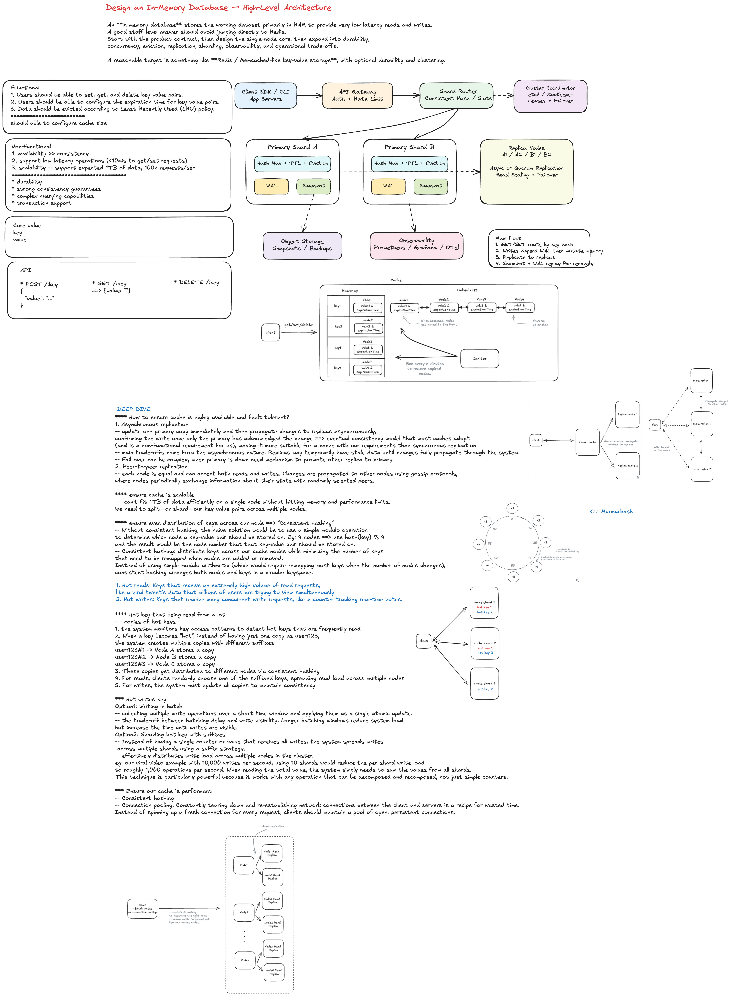

# Design an In-Memory Database

## 0. Interview Framing

An **in-memory database** stores the working dataset primarily in RAM to provide very low-latency reads and writes. A good staff-level answer should avoid jumping directly to Redis. Start with the product contract, then design the single-node core, then expand into durability, concurrency, eviction, replication, sharding, observability, and operational trade-offs.

A reasonable target is something like **Redis / Memcached-like key-value storage**, with optional durability and clustering.

---

## 1. Clarifying Questions

### Product scope

1. Is this a **key-value store** only, or do we need richer data types such as lists, sets, sorted sets, hashes, counters, or streams?
2. Is the database used as a **cache**, a **primary database**, or both?
3. Do values need to be opaque bytes, JSON documents, typed records, or structured objects?
4. Do we need transactions, compare-and-swap, or multi-key atomic operations?
5. Do we need secondary indexes or only primary-key lookup?
6. Should the system support TTL, LRU/LFU eviction, or both?
7. What consistency level is required: strong consistency, eventual consistency, read-your-writes, or best-effort cache semantics?
8. What is the expected data size and key count?
9. What is the read/write ratio?
10. What happens when memory is full: reject writes, evict keys, spill to disk, or scale out?

### Non-functional scope

1. Latency target: p50/p99 for read and write operations.
2. Availability target: single-node acceptable, or multi-AZ / multi-region required?
3. Durability target: can we lose recent writes, or must every acknowledged write survive crashes?
4. Throughput target: QPS, peak burst rate, hot-key behavior.
5. Scale target: RAM per node, cluster size, number of clients.
6. Security: auth, encryption in transit, encryption at rest for snapshots/WAL.
7. Operations: metrics, backups, restore, rolling deploys, failover.

---

## 2. Requirements

## Functional Requirements

| Area              | Requirement                                                                        |
| ----------------- | ---------------------------------------------------------------------------------- |
| CRUD              | Support `GET`, `SET`, `DELETE`, `EXISTS` for keys.                                 |
| TTL               | Allow optional expiration per key.                                                 |
| Atomic updates    | Support safe concurrent updates such as `INCR`, `CAS`, or single-key transactions. |
| Durability option | Recover from crash using write-ahead log and/or snapshots.                         |
| Eviction          | Support memory-aware eviction policies such as TTL cleanup, LRU, or LFU.           |
| Replication       | Optional primary-replica replication for high availability.                        |
| Sharding          | Partition keys across nodes for horizontal scale.                                  |
| Admin APIs        | Health, stats, backup, restore, config, and cluster membership.                    |

## Non-Functional Requirements

| Area              | Requirement                                                                                                |
| ----------------- | ---------------------------------------------------------------------------------------------------------- |
| Latency           | Single-key operations should be very fast, ideally O(1) and low millisecond or sub-millisecond in-process. |
| Throughput        | Support high concurrent reads/writes with efficient networking and minimal lock contention.                |
| Availability      | Replica failover should minimize downtime when a node fails.                                               |
| Durability        | Configurable durability: none, async WAL, fsync per batch, snapshot-based recovery.                        |
| Scalability       | Add shards to increase memory capacity and throughput.                                                     |
| Memory efficiency | Avoid excessive metadata overhead, fragmentation, and unbounded key growth.                                |
| Consistency       | Define clear behavior for reads during failover and replication lag.                                       |
| Observability     | Expose metrics, traces, logs, slow queries, and memory breakdown.                                          |
| Security          | Authentication, authorization, TLS, and encrypted backups.                                                 |

---

## 3. High-Level Architecture

```text
Client SDK / CLI / App Servers
        |
        v
API Gateway / Router / Connection Manager
        |
        v
Shard Router using consistent hashing
        |
        +-------------------------+-------------------------+
        |                         |                         |
        v                         v                         v
 Primary Shard A            Primary Shard B            Primary Shard C
 In-Memory Engine           In-Memory Engine           In-Memory Engine
 WAL + Snapshot             WAL + Snapshot             WAL + Snapshot
        |                         |                         |
        v                         v                         v
 Replica A1                 Replica B1                 Replica C1
 Replica A2                 Replica B2                 Replica C2
```

### Core idea

For a single node, use a hash table for key lookup. Each key maps to a record that stores the value, metadata, TTL, version, and eviction metadata.

For a distributed version, partition keys across shards using consistent hashing. Each shard has a primary node for writes and one or more replicas for failover and optional read scaling.

---

## 4. Core Entities

## KeyRecord

```ts
type KeyRecord = {
  key: string;
  value: Uint8Array | string | object;
  valueType: 'bytes' | 'string' | 'json' | 'counter' | 'hash' | 'list';
  version: number;
  createdAtMs: number;
  updatedAtMs: number;
  expiresAtMs?: number;
  lastAccessedAtMs?: number;
  accessCount?: number;
  sizeBytes: number;
};
```

## Shard

```ts
type Shard = {
  shardId: string;
  rangeStart: string;
  rangeEnd: string;
  primaryNodeId: string;
  replicaNodeIds: string[];
  status: 'active' | 'rebalancing' | 'degraded' | 'offline';
};
```

## Node

```ts
type Node = {
  nodeId: string;
  host: string;
  port: number;
  role: 'primary' | 'replica';
  shardIds: string[];
  memoryLimitBytes: number;
  usedMemoryBytes: number;
  status: 'healthy' | 'unhealthy' | 'draining';
};
```

## WALRecord

```ts
type WALRecord = {
  sequenceNumber: number;
  timestampMs: number;
  operation: 'SET' | 'DELETE' | 'EXPIRE' | 'INCR' | 'CAS';
  key: string;
  value?: Uint8Array | string | object;
  expiresAtMs?: number;
  expectedVersion?: number;
};
```

## SnapshotMetadata

```ts
type SnapshotMetadata = {
  snapshotId: string;
  nodeId: string;
  shardId: string;
  createdAtMs: number;
  lastIncludedWalSequence: number;
  objectStorePath: string;
  checksum: string;
};
```

## AccessPolicy

```ts
type AccessPolicy = {
  principalId: string;
  role: 'reader' | 'writer' | 'admin';
  allowedKeyPrefixes: string[];
};
```

---

## 5. Suggested APIs

## Client Data APIs

```http
PUT /v1/keys/{key}
Content-Type: application/json

{
  "value": "hello",
  "ttlSeconds": 3600,
  "writeMode": "upsert"
}
```

```http
GET /v1/keys/{key}
```

```http
DELETE /v1/keys/{key}
```

```http
POST /v1/keys/{key}/increment
Content-Type: application/json

{
  "delta": 1,
  "ttlSeconds": 3600
}
```

```http
POST /v1/keys/{key}/cas
Content-Type: application/json

{
  "expectedVersion": 42,
  "newValue": "new-value",
  "ttlSeconds": 3600
}
```

## Batch APIs

```http
POST /v1/batch/get
Content-Type: application/json

{
  "keys": ["user:1", "user:2", "user:3"]
}
```

```http
POST /v1/batch/set
Content-Type: application/json

{
  "items": [
    { "key": "user:1", "value": "A", "ttlSeconds": 300 },
    { "key": "user:2", "value": "B", "ttlSeconds": 300 }
  ]
}
```

## Admin APIs

```http
GET /v1/admin/health
GET /v1/admin/stats
POST /v1/admin/snapshot
POST /v1/admin/restore
POST /v1/admin/shards/rebalance
GET /v1/admin/shards
```

---

## 6. Single-Node Design

## In-Memory Store

Use a hash map:

```ts
Map<string, KeyRecord>;
```

This provides average O(1) lookup, insert, and delete.

### Record metadata

Each record stores:

- `value`
- `version`
- `expiresAtMs`
- `sizeBytes`
- `lastAccessedAtMs`
- `accessCount`

Metadata enables TTL, CAS, memory accounting, and eviction.

## TTL Expiration

Use two mechanisms:

1. **Lazy expiration**: On read/write, check `expiresAtMs`. If expired, delete it and return missing.
2. **Active expiration**: Background sweeper samples keys or uses a min-heap ordered by expiration time.

### Option A: Min-heap by expiration

```ts
MinHeap<{ expiresAtMs: number; key: string; version: number }>;
```

When a key is updated with a new TTL, push a new heap entry. During cleanup, pop expired entries and verify the version before deleting so stale heap entries do not delete newer values.

### Option B: Timing wheel

A timing wheel is more memory-efficient for large TTL workloads and avoids maintaining a huge heap, but it is more complex and expiration precision is bucketed.

## Eviction

When memory exceeds a threshold, evict keys based on policy:

| Policy          | Pros                       | Cons                                                          |
| --------------- | -------------------------- | ------------------------------------------------------------- |
| TTL-only        | Simple and predictable     | Cannot reclaim non-TTL keys.                                  |
| LRU             | Good for temporal locality | Needs access-order metadata; can be expensive under high QPS. |
| LFU             | Keeps frequently used keys | More metadata; slower adaptation to traffic changes.          |
| Random sampling | Cheap and simple           | Less optimal hit rate.                                        |
| Size-aware LRU  | Better memory control      | More complex scoring.                                         |

A practical system can use approximate LRU/LFU via sampling to avoid updating a global linked list on every read.

## Concurrency

Options:

| Model                      | Description                             | Pros                          | Cons                                     |
| -------------------------- | --------------------------------------- | ----------------------------- | ---------------------------------------- |
| Single-threaded event loop | One thread owns the store.              | Simple consistency, no locks. | Limited by one CPU core per shard.       |
| Read-write lock            | Readers share lock, writers exclusive.  | Easy to reason about.         | Lock contention under high write volume. |
| Lock striping              | Partition keys across many locks.       | Higher parallelism.           | Multi-key operations are harder.         |
| Actor per shard            | Each shard has an owner thread/mailbox. | Good isolation and ordering.  | Needs careful backpressure.              |
| MVCC                       | Readers do not block writers.           | Great read concurrency.       | More memory and GC complexity.           |

For an interview, a strong answer is:

> Start with a single-threaded event loop per shard for predictable atomicity, then scale by having many independent shards. For CPU-heavy operations or very high write throughput, use lock striping or actor-per-shard execution.

---

## 7. Durability Design

In-memory systems can be cache-only or durable.

## Write-Ahead Log

Before mutating memory, append the operation to a WAL.

```text
1. Receive SET key=value.
2. Route to owning shard.
3. Append SET to WAL.
4. Optionally fsync based on durability policy.
5. Apply mutation to in-memory map.
6. Replicate operation to replicas.
7. Acknowledge client.
```

### Fsync policies

| Policy             | Latency |             Durability | Use Case                      |
| ------------------ | ------: | ---------------------: | ----------------------------- |
| No WAL             |  Lowest |                   None | Pure cache.                   |
| Async WAL          |     Low | May lose recent writes | Cache with warm restart.      |
| Fsync every second |  Medium |         Lose up to ~1s | Common default.               |
| Fsync every write  | Highest |    Stronger durability | Primary datastore mode.       |
| Group commit       |  Medium |                   Good | High-throughput durable mode. |

## Snapshotting

Snapshots periodically write the current in-memory state to disk or object storage.

```text
Recovery = load latest snapshot + replay WAL entries after snapshot sequence number
```

### Snapshot strategy

- Fork or copy-on-write snapshot for low pause time.
- Store snapshot metadata with checksum.
- Upload to object storage for backup.
- Compact WAL after snapshot is successful.

---

## 8. Distributed Design

## Sharding

Use consistent hashing or hash-slot partitioning.

```text
shardId = hash(key) % numberOfShards
```

A production system often uses virtual shards / hash slots so rebalancing moves smaller units instead of entire physical nodes.

### Why virtual shards?

- Easier rebalancing.
- Better distribution.
- Allows multiple shards per node.
- Reduces blast radius during node replacement.

## Replication

Each shard has one primary and multiple replicas.

```text
Client write -> Router -> Primary -> WAL -> Memory -> Replicas -> Ack
```

### Replication modes

| Mode                       | Pros                | Cons                                 |
| -------------------------- | ------------------- | ------------------------------------ |
| Async replication          | Low latency         | Data loss possible on primary crash. |
| Sync replication to quorum | Stronger durability | Higher write latency.                |
| Semi-sync replication      | Balanced            | More complex failure cases.          |

## Failover

Use a cluster coordinator such as etcd, ZooKeeper, Consul, or a managed control plane.

```text
1. Health checker detects primary failure.
2. Coordinator marks primary unhealthy.
3. Promote most up-to-date replica.
4. Update shard routing table.
5. Clients refresh routing table or router redirects traffic.
6. Old primary must not accept stale writes after recovery.
```

To prevent split brain, use leases, fencing tokens, or consensus-managed primary election.

## Rebalancing

When adding/removing nodes:

```text
1. Control plane computes new shard assignment.
2. Source node streams snapshot + WAL tail to destination node.
3. Destination catches up.
4. Router flips ownership for the shard.
5. Source drains old writes and deletes copied shard after safety window.
```

---

## 9. Request Flows

## GET Flow

```text
1. Client sends GET key.
2. Router hashes key and finds owning shard.
3. Request goes to primary or replica depending on consistency mode.
4. Store checks if key exists.
5. Store checks TTL. If expired, delete lazily and return null.
6. Store updates access metadata for eviction.
7. Store returns value and version.
```

## SET Flow

```text
1. Client sends SET key, value, optional TTL.
2. Router hashes key and sends to primary shard.
3. Primary validates request size and auth.
4. Primary appends operation to WAL.
5. Primary applies update to in-memory map.
6. Primary updates TTL index and eviction metadata.
7. Primary replicates to replicas.
8. Primary acknowledges based on configured replication policy.
```

## CAS Flow

```text
1. Client reads key and receives version N.
2. Client sends CAS key expectedVersion=N newValue=X.
3. Primary checks current version.
4. If version matches, append WAL and update value to version N+1.
5. If version does not match, reject with conflict.
```

## Expiration Flow

```text
1. Background sweeper wakes up every interval.
2. It pops expired entries from TTL heap or samples TTL keys.
3. It validates key version to avoid stale deletion.
4. It deletes expired keys and frees memory.
5. Metrics are emitted for expired key count and cleanup latency.
```

## Recovery Flow

```text
1. Node restarts.
2. Load latest snapshot from local disk or object storage.
3. Replay WAL entries newer than snapshot sequence number.
4. Rebuild TTL index and eviction metadata.
5. Join cluster as replica first.
6. Catch up replication stream.
7. Become eligible for primary traffic.
```

---

## 10. Suggested Technology Choices

## Single-node engine

| Component     | Suggested Technology                                | Why                                            |
| ------------- | --------------------------------------------------- | ---------------------------------------------- |
| Runtime       | Rust, C++, Go, or Java                              | Predictable performance and mature networking. |
| In-memory map | Native hash map, custom hash table, or off-heap map | Fast key lookup.                               |
| Networking    | TCP/gRPC/custom RESP-like protocol                  | Low overhead and good client ecosystem.        |
| WAL           | Local NVMe append-only log                          | Sequential writes are fast and recoverable.    |
| Snapshot      | Local disk + object storage backup                  | Fast local restore and durable backup.         |

## Distributed system

| Component        | Suggested Technology                   | Why                                       |
| ---------------- | -------------------------------------- | ----------------------------------------- |
| Cluster metadata | etcd / ZooKeeper / Consul              | Leader election, leases, membership.      |
| Routing          | Client-side routing or stateless proxy | Reduces extra hop or centralizes routing. |
| Object storage   | S3/GCS/Azure Blob                      | Durable snapshots and backups.            |
| Metrics          | Prometheus + Grafana                   | Standard operational monitoring.          |
| Logs             | OpenTelemetry + centralized logging    | Debugging and auditability.               |
| Tracing          | OpenTelemetry                          | End-to-end request visibility.            |

## Practical reference stack

For an interview-friendly answer:

- **Language**: Go or Rust.
- **Protocol**: gRPC for typed APIs, or RESP-like protocol for Redis compatibility.
- **Storage**: RAM hash table + append-only WAL + snapshot files.
- **Cluster coordinator**: etcd.
- **Replication**: primary-replica with async or quorum mode.
- **Sharding**: virtual hash slots.
- **Monitoring**: Prometheus + Grafana + OpenTelemetry.
- **Backups**: snapshots uploaded to S3-compatible object storage.

---

## 11. Pros and Cons

## In-memory database vs disk database

| Dimension         | In-Memory DB                | Disk-Based DB                               |
| ----------------- | --------------------------- | ------------------------------------------- |
| Latency           | Very low                    | Higher due to disk access.                  |
| Throughput        | High for simple operations  | Depends on indexes, disk, and query engine. |
| Capacity          | Limited by RAM              | Much larger.                                |
| Cost              | RAM is expensive            | Disk is cheaper.                            |
| Durability        | Must be explicitly designed | Usually built in.                           |
| Query flexibility | Often simpler               | Usually richer.                             |

## Hash map primary index

| Pros                          | Cons                                                |
| ----------------------------- | --------------------------------------------------- |
| O(1) average lookup.          | No range scans by default.                          |
| Simple to implement.          | Rehashing and memory fragmentation must be managed. |
| Good for key-value workloads. | Secondary indexes need extra structures.            |

## WAL + snapshot durability

| Pros                                                | Cons                                          |
| --------------------------------------------------- | --------------------------------------------- |
| Fast recovery compared with replaying full history. | More operational complexity.                  |
| WAL provides recent operation recovery.             | Fsync policy affects latency.                 |
| Snapshot compacts historical state.                 | Snapshot can create CPU/memory/disk pressure. |

## Single-threaded shard execution

| Pros                              | Cons                                         |
| --------------------------------- | -------------------------------------------- |
| Simple atomicity.                 | One shard is limited by one event loop.      |
| No locks in the critical path.    | Hot shards can bottleneck.                   |
| Deterministic operation ordering. | CPU-heavy commands can block other commands. |

## Primary-replica replication

| Pros                          | Cons                                   |
| ----------------------------- | -------------------------------------- |
| Simple write ownership model. | Primary bottleneck per shard.          |
| Easier failover story.        | Replication lag can cause stale reads. |
| Good operational pattern.     | Split-brain must be prevented.         |

---

## 12. Potential Problems and Optimizations

## Hot keys

### Problem

One key or key range receives disproportionate traffic.

### Mitigations

- Read replicas for read-heavy hot keys.
- Client-side caching with invalidation.
- Request coalescing for repeated reads.
- Split logical key into subkeys for counters.
- Rate-limit abusive clients.

## Memory pressure

### Problem

Dataset grows beyond available RAM.

### Mitigations

- Configurable max memory.
- Approximate LRU/LFU eviction.
- Compression for large values.
- Reject writes with clear error when no eviction is allowed.
- Shard across more nodes.
- Optional cold spillover to disk if product requires it.

## Large values

### Problem

Large values cause memory fragmentation, slow replication, and slow snapshots.

### Mitigations

- Max value size limit.
- Store large blobs in object storage and keep pointers in memory.
- Compress values.
- Stream large responses instead of buffering.

## Replication lag

### Problem

Replica reads may return stale data.

### Mitigations

- Read from primary for strongly consistent reads.
- Use session tokens / sequence numbers for read-your-writes.
- Monitor replica lag and remove lagging replicas from read pool.

## Failover correctness

### Problem

Old primary may come back and accept writes, causing split brain.

### Mitigations

- Coordinator-managed leases.
- Fencing tokens on every write.
- Epoch number per primary term.
- Replicas reject writes from stale primary epochs.

## Snapshot overhead

### Problem

Snapshotting can block or slow the database.

### Mitigations

- Copy-on-write snapshot.
- Incremental snapshots.
- Rate-limit snapshot IO.
- Schedule snapshots during lower-traffic windows.

## Multi-key transactions

### Problem

Keys may live on different shards.

### Mitigations

- Restrict atomicity to single key or single shard.
- Support hash tags so related keys route to same shard.
- Use two-phase commit only if absolutely required.
- Prefer application-level idempotency and sagas for cross-shard workflows.

---

## 13. Security Design

## Authentication

- Use API keys, mTLS, OAuth service identity, or IAM depending on environment.
- Rotate credentials.
- Support per-client quotas.

## Authorization

- RBAC roles: reader, writer, admin.
- Prefix-level permissions, such as allowing a service to access only `serviceA:*` keys.

## Encryption

- TLS in transit.
- Encrypt WAL and snapshots at rest.
- Use KMS-managed keys.

## Audit

- Log admin operations.
- Log authentication failures.
- Optionally sample data operations, but avoid logging raw sensitive values.

---

## 14. Monitoring and Logging

## Key metrics

| Metric                     | Why it matters                        |
| -------------------------- | ------------------------------------- |
| QPS by command             | Capacity planning and traffic spikes. |
| p50/p95/p99 latency        | User-visible performance.             |
| memory used / memory limit | Eviction and OOM risk.                |
| key count                  | Dataset growth.                       |
| expired keys per second    | TTL workload.                         |
| evicted keys per second    | Memory pressure.                      |
| WAL fsync latency          | Durability bottleneck.                |
| replication lag            | Stale reads and failover risk.        |
| snapshot duration          | Backup/recovery health.               |
| hot keys                   | Load imbalance.                       |
| error rate                 | Reliability.                          |

## Logs

- Structured logs for admin operations, failovers, rebalances, snapshot failures, restore failures, auth failures, and slow operations.
- Avoid logging values by default.

## Alerts

- High memory usage.
- High p99 latency.
- Replica lag above threshold.
- WAL disk full.
- Snapshot failure.
- Node unavailable.
- Rebalance stuck.

---

## 15. Staff-Level Interview Answer Structure

Use this flow in the interview:

```text
1. Clarify scope.
2. Define requirements and assumptions.
3. Start with single-node design: hash map + TTL + concurrency.
4. Add durability: WAL + snapshots.
5. Add distributed scale: sharding + replication + failover.
6. Discuss consistency and failure modes.
7. Discuss memory pressure and eviction.
8. Add security, observability, and operational tooling.
9. Explain trade-offs clearly.
```

---

## 16. Example Verbal Answer

> I would first clarify whether this is a cache or a primary database because that changes the durability and consistency requirements. For the base design, I would implement a key-value store where each node keeps a hash map from key to record. The record contains the value, version, TTL, size, and eviction metadata. Reads and writes are O(1) on average.
>
> For TTL, I would combine lazy expiration on access with a background sweeper using either a min-heap or timing wheel. For memory pressure, I would support configurable eviction policies such as TTL-only, approximate LRU, or LFU. For concurrency, I would start with a single-threaded event loop per shard because it gives simple atomicity and avoids lock contention, then scale by running many shards across cores and nodes.
>
> For durability, I would add a write-ahead log and periodic snapshots. On recovery, a node loads the latest snapshot and replays WAL entries after the snapshot sequence number. The durability mode should be configurable because fsync on every write improves durability but hurts latency.
>
> For horizontal scaling, I would partition keys using virtual shards and consistent hashing. Each shard has a primary and replicas. Writes go to the primary, then replicate asynchronously or to quorum depending on consistency requirements. A coordinator like etcd manages membership, primary leases, failover, and shard assignment. To avoid split brain, every primary term gets a fencing token.
>
> The biggest trade-offs are memory cost, durability versus latency, and consistency versus availability. If this is used as a cache, I would optimize for latency and allow data loss. If this is a primary store, I would choose stronger WAL fsync, quorum replication, backups, and stricter failover behavior.

---

## 17. Diagram

The companion Excalidraw file includes:

- Client/API layer.
- Router and shard map.
- Primary shard nodes.
- In-memory engine internals.
- WAL and snapshot storage.
- Replicas.
- Cluster coordinator.
- Observability stack.
- Main GET/SET/replication/recovery flows.
