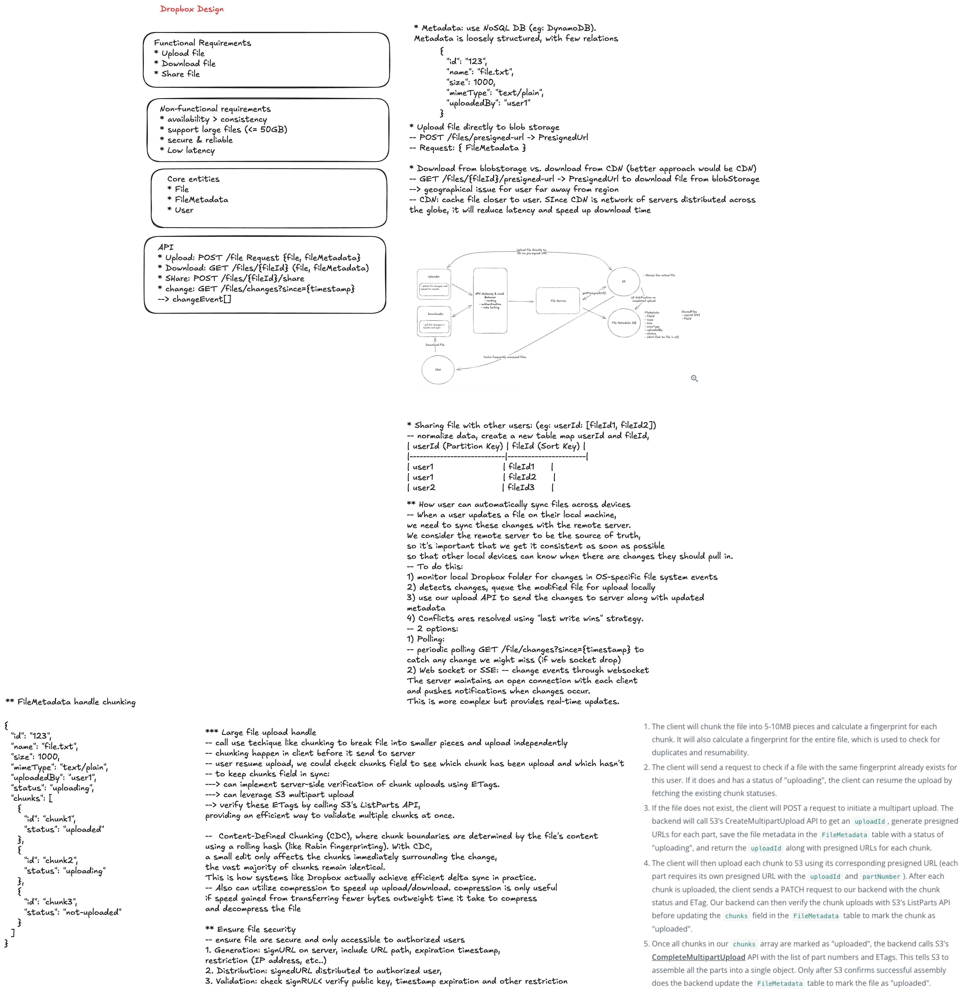

# Dropbox System Design



> **Editable diagram:** [Open in Excalidraw](https://excalidraw.com/#room=143f88006f23d0007387,EUT8RT_8zRzFj_BRzus4OA)

## Interview Goal

Design a cloud file storage and synchronization system where users can upload
files, sync them across devices, share folders, recover versions, and continue
working during network interruptions.

At staff level, do more than say "store files in S3." Explain the product
semantics: what it means for a file to be synced, how conflicts are resolved,
how metadata and blob storage stay consistent, how clients recover from
partial failures, and how the system protects user trust.

## Staff-Level Checklist

- Clarify scope: backup, sync, sharing, collaboration, or all of them.
- Define file and folder metadata model.
- Separate metadata storage from content blob storage.
- Use chunking, hashing, deduplication, and resumable upload.
- Design client sync engine and local change detection.
- Define conflict resolution and version history.
- Support offline edits and reconnect behavior.
- Design sharing, ACLs, links, and permission propagation.
- Handle large files, many small files, and hot shared folders.
- Add notification/change feed for clients.
- Plan multi-region storage, durability, and disaster recovery.
- Include security, privacy, abuse prevention, observability, and rollout.

## 1. Clarify Requirements

### Functional requirements

- Upload, download, rename, move, and delete files and folders.
- Sync changes across a user's devices.
- Support offline edits and sync after reconnecting.
- Share files and folders with users or public links.
- Support version history and restore.
- Support conflict files when concurrent edits cannot merge safely.
- Support large files with resumable upload.
- Support previews, thumbnails, and search.
- Notify clients when remote changes are available.

### Non-functional requirements

- High durability for user files.
- Sync should be eventually consistent and predictable.
- Metadata operations should feel fast.
- Upload and download should resume after network interruption.
- The system should handle millions of users and billions of files.
- Access control must be enforced consistently.
- Storage cost should be controlled through deduplication and lifecycle policy.
- Client should be efficient on CPU, battery, disk, and bandwidth.

### Questions to ask

- Are we designing desktop sync, web upload, mobile backup, or all clients?
- Is real-time collaborative editing in scope?
- What is the maximum file size?
- How many files can one user or folder contain?
- Do shared folders support many writers?
- How long is version history retained?
- Are public share links required?
- Are enterprise audit logs and admin controls required?
- Is end-to-end encryption required?
- What latency matters most: metadata sync, upload completion, or download?

## 2. Core Product Semantics

### Sync state

Define visible client states:

```text
local_only -> uploading -> synced
remote_only -> downloading -> synced
conflicted
deleted
error
```

Users should know whether a file is safely backed up, still uploading, waiting
for download, conflicted, or failed.

### Conflict behavior

For normal files, automatic merge is often unsafe. A practical rule:

- If two clients edit the same file from the same base version, create a
  conflicted copy.
- Preserve both user changes.
- Show clear names and recovery options.

Example:

```text
report.docx
report (Khanh's conflicted copy 2026-06-20).docx
```

Staff-level point: preventing silent data loss is more important than hiding
conflicts.

### Consistency

Dropbox-style sync is usually eventually consistent across devices, but with
stronger guarantees around accepted metadata writes:

- Once a metadata mutation is acknowledged, it should be durable.
- A device can catch up from its last known cursor.
- File contents and metadata should not permanently disagree.
- Version history should allow recovery from mistakes.

## 3. High-Level Architecture

```text
Desktop / Mobile / Web Clients
  |
  +-- Metadata API: list, move, rename, delete, share
  +-- Upload API: sessions, chunks, commit
  +-- Download API: file content and ranges
  +-- Sync API: long poll, delta feed, cursors
  |
API Gateway
  |
  +-- Auth and account service
  +-- Metadata service
  +-- Sync / change-feed service
  +-- Upload session service
  +-- Sharing and ACL service
  +-- Preview and search services
  |
Storage
  |
  +-- Metadata database
  +-- Blob / chunk object storage
  +-- Change log
  +-- Search index
  +-- Thumbnail and preview store
```

Separate metadata from blob data:

- Metadata changes are small, transactional, and authorization-sensitive.
- Blob data is large, immutable, chunked, and stored in object storage.

## 4. Data Model

### File metadata

```text
Node
  node_id
  namespace_id
  parent_id
  name
  type: file | folder
  current_revision_id
  created_at
  updated_at
  deleted_at
  owner_id
```

### File revision

```text
Revision
  revision_id
  node_id
  content_hash
  size
  chunk_ids[]
  created_by
  created_at
  base_revision_id
```

### Chunk

```text
Chunk
  chunk_id
  hash
  size
  storage_location
  reference_count
```

Use stable IDs for files and folders. Paths are mutable because users rename
and move items.

## 5. Upload Path

```text
1. Client detects local file change.
2. Client splits file into chunks.
3. Client hashes each chunk.
4. Client asks server which chunks already exist.
5. Client uploads missing chunks using resumable sessions.
6. Client commits file revision with chunk list and base revision.
7. Metadata service atomically updates current revision.
8. Change log records the mutation.
9. Other clients receive sync notification.
```

### Chunking

Options:

- Fixed-size chunks: simple and fast.
- Content-defined chunks: better dedup when bytes are inserted near the front
  of a file, but more complex.

For large files, chunking enables:

- Resume after failure.
- Parallel upload.
- Deduplication.
- Range download.
- Efficient version storage.

### Commit semantics

Uploading chunks should not make a file visible until commit succeeds.

The commit should validate:

- User authorization.
- Parent folder exists.
- Base revision matches expected version or conflict policy is applied.
- All referenced chunks exist.
- Content hash matches the chunk list.

## 6. Download Path

```text
1. Client requests file metadata or revision.
2. Server authorizes access.
3. Server returns chunk manifest or signed download URLs.
4. Client downloads needed chunks.
5. Client verifies hashes.
6. Client writes to a temporary file.
7. Client atomically swaps into the local sync folder.
```

Use temporary files so interrupted downloads do not corrupt local files.

## 7. Sync Engine on the Client

The desktop client is a distributed-system participant, not just a UI.

Responsibilities:

- Watch local filesystem changes.
- Debounce noisy file events.
- Maintain a local metadata database.
- Track sync cursor from the server.
- Persist upload and download queues.
- Retry with backoff and jitter.
- Detect conflicts.
- Respect ignored files and selective sync.
- Handle file locks and partial writes.
- Avoid excessive CPU, disk, battery, and bandwidth use.

Client local state:

```text
local_path -> node_id
node_id -> last_synced_revision
pending_uploads
pending_downloads
server_cursor
conflict_records
```

## 8. Change Feed and Notifications

Clients need a way to learn about remote changes.

Options:

- Periodic polling.
- Long polling for changes.
- WebSocket or push channel.
- Mobile push notification to wake the app.

A common design:

- Durable change log per namespace.
- Client stores a cursor.
- Client calls `list_changes(cursor)`.
- If no changes exist, long poll until new changes or timeout.
- Client applies changes and advances cursor only after local persistence.

Change feed entry:

```text
sequence
namespace_id
node_id
operation: create | update | move | delete | restore
revision_id
timestamp
actor_id
```

## 9. Metadata Consistency

Metadata operations often need transactions:

- Create file node.
- Move folder.
- Rename item.
- Delete or restore tree.
- Commit a new revision.
- Update sharing ACLs.

Use optimistic concurrency:

```text
commit file revision if current_revision_id == base_revision_id
otherwise create conflict or reject with conflict response
```

For folders, moves and deletes need careful subtree semantics. Avoid expensive
recursive updates by using stable node IDs and parent pointers, or namespace
models that make shared folder boundaries explicit.

## 10. Sharing and Permissions

Sharing can be harder than sync.

Support:

- Direct user shares.
- Shared folders.
- Public or private share links.
- Viewer, editor, and owner roles.
- Enterprise admin controls.
- Link expiration and password protection.
- Revocation and audit logs.

Authorization must be enforced on:

- Metadata reads.
- Upload commits.
- Downloads.
- Search results.
- Previews and thumbnails.
- Change feed subscriptions.

Staff-level point: cache permissions carefully. A revoked share should stop
future access quickly, including cached previews and signed URLs.

## 11. Version History and Deletion

Version history protects users from mistakes and ransomware-like damage.

Design points:

- Store revisions as metadata pointing to immutable chunks.
- Keep retention policy by plan or enterprise setting.
- Support restore to a previous revision.
- Soft-delete first, then hard-delete after retention expires.
- Preserve audit trail where required.
- Garbage collect unreferenced chunks after retention windows.

Do not immediately delete chunks when a file is removed. They may be referenced
by another revision or another user's deduplicated file.

## 12. Deduplication

Dedup can happen at several levels:

- Whole-file hash.
- Chunk hash.
- Same user only.
- Same tenant only.
- Global dedup.

Trade-offs:

- Global dedup saves storage but may create privacy and side-channel concerns.
- Tenant-scoped dedup is safer for enterprise isolation.
- Encrypted storage reduces dedup opportunities unless convergent encryption is
  used, which has its own security trade-offs.

## 13. Search and Preview

Search and preview are derived systems:

- Index file names and supported content types.
- Generate thumbnails and previews asynchronously.
- Scan files when policy requires it.
- Respect permissions during indexing and query.
- Keep stale previews from leaking revoked content.

Core sync should not depend on preview or search availability.

## 14. Multi-Region and Durability

### Blob durability

- Store chunks in object storage with replication.
- Use checksums and periodic integrity verification.
- Keep multiple copies across availability zones.
- Consider cross-region replication for disaster recovery.

### Metadata durability

- Metadata is the source of truth for names, folders, revisions, and sharing.
- Use strongly consistent writes within a region.
- Replicate change logs for recovery.
- Back up metadata separately from blobs.

### Region strategy

Options:

- Home-region per user or namespace.
- Global read replicas for metadata.
- Regional object storage close to users.
- Cross-region failover with clear RPO and RTO.

Avoid split-brain metadata writes for the same namespace unless you have a
conflict-resolution model.

## 15. Large Scale Concerns

Handle:

- One folder with millions of files.
- One user with many devices.
- One shared folder with many collaborators.
- Large files uploaded over unstable networks.
- Many tiny files causing metadata pressure.
- Hot shared files downloaded by many users.
- Sync storms after clients reconnect.

Mitigations:

- Paginate folder listings.
- Use cursors and incremental sync.
- Batch metadata changes.
- Rate-limit per user, device, and namespace.
- Use CDN for popular downloads.
- Coalesce duplicate sync notifications.
- Apply backpressure to client queues.

## 16. Security and Privacy

- Authenticate users and devices.
- Authorize every metadata and blob operation.
- Encrypt data in transit and at rest.
- Use short-lived signed URLs for upload and download.
- Scan malware according to product policy.
- Validate file names and paths.
- Prevent path traversal and reserved-name issues.
- Protect share links from enumeration.
- Audit sharing, admin access, and destructive actions.
- Support legal hold, retention, and data deletion.

If end-to-end encryption is required, discuss trade-offs:

- Server-side preview and search become limited.
- Deduplication becomes harder.
- Key recovery and multi-device access become product-critical.

## 17. Reliability and Failure Handling

| Failure                    | Expected behavior                                    |
| -------------------------- | ---------------------------------------------------- |
| Upload interrupted         | Resume from uploaded chunks                          |
| Commit fails after upload  | Keep chunks temporarily and retry commit             |
| Client crashes             | Recover queues from local database                   |
| Metadata store unavailable | Pause writes; allow cached reads carefully           |
| Blob store unavailable     | Metadata may load; downloads/uploads fail gracefully |
| Change feed delayed        | Client polls or catches up later from cursor         |
| Share revoked              | Invalidate caches and signed URLs quickly            |
| Device offline             | Queue local changes and sync after reconnect         |
| Conflict detected          | Preserve both versions and notify user               |

User trust rule: never silently lose local edits.

## 18. Observability

Track:

- Upload success rate and retry rate.
- Commit latency and failure rate.
- Download latency and integrity-check failures.
- Sync lag per device.
- Change-feed delivery latency.
- Conflict creation rate.
- Metadata database hot partitions.
- Blob storage error rate.
- Chunk dedup ratio.
- Cache hit ratio for metadata and downloads.
- Share permission denials and revocations.
- Client CPU, memory, disk, and battery impact.

Use trace IDs across upload session, chunk writes, metadata commit, change log,
and client sync acknowledgement.

## 19. Testing Strategy

- Unit-test path normalization and metadata mutations.
- Test chunk hashing and manifest validation.
- Test resumable upload and interrupted download.
- Test optimistic concurrency and conflict creation.
- Test move, rename, delete, and restore edge cases.
- Test shared folder permission changes.
- Test multi-device offline edit reconciliation.
- Test huge folders and many small files.
- Chaos-test blob store, metadata store, and change feed outages.
- Verify no data loss after client crash at every sync stage.
- Test accessibility and clear user messaging for sync states.

## 20. Staff-Level Product Care

### Protect user trust

- Make sync state visible and honest.
- Preserve local changes even when the server rejects a commit.
- Use conflict files instead of overwriting silently.
- Provide version history and restore.

### Design for messy clients

- Files may be locked, partially written, renamed repeatedly, or edited offline.
- Clients may crash, sleep, roam networks, or have incorrect clocks.
- Sync should recover from all of that without corrupting user data.

### Keep core sync independent

- Search, preview, thumbnails, analytics, and notifications should degrade
  before upload, download, and metadata sync.

### Plan evolution

- Version metadata schemas and sync protocols.
- Support older clients during migration.
- Roll out new chunking or dedup strategies gradually.
- Provide operational tools to inspect and repair sync issues.

## 21. Important Trade-offs

1. Strong metadata consistency versus multi-region write latency.
2. Fixed-size chunks versus content-defined chunks.
3. Global dedup versus privacy and tenant isolation.
4. Automatic conflict resolution versus preserving user data.
5. Long version history versus storage cost.
6. Rich previews and search versus encryption and privacy.
7. Push notifications versus polling simplicity.
8. Single namespace authority versus active-active complexity.
9. Aggressive local sync versus battery and bandwidth.
10. Fast share revocation versus cache efficiency.

## Interview Closing Summary

Dropbox is a metadata consistency and client sync problem as much as it is a
blob storage problem.

A strong staff-level answer explains chunked upload, immutable blobs, metadata
transactions, change feeds, local sync state, conflict handling, sharing ACLs,
version history, deduplication, and disaster recovery. The product-care
throughline is simple: never silently lose user data, make sync state visible,
and let optional systems fail before core file sync fails.
