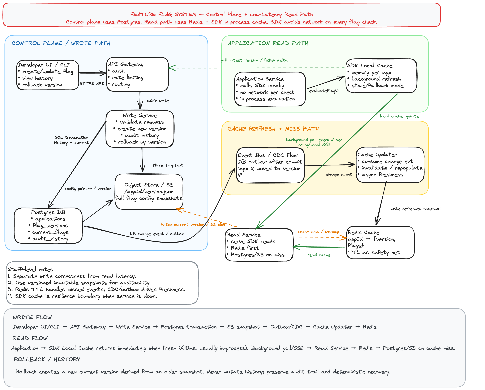

# Feature Flag System Design

> Staff engineer interview answer for designing a production-grade feature flag platform. The key design choice is to keep **writes strongly consistent in Postgres** while making **flag evaluation local and fast through SDK in-memory cache**, backed by **Redis** for shared low-latency reads.

## 1. Clarifying Questions

Before designing, clarify the expected scale, consistency needs, and product requirements.

### Functional Requirements

1. Developers can create, update, disable, and delete feature flags.
2. Developers can define targeting rules by application, environment, user, tenant, region, percentage rollout, allowlist, or custom attributes.
3. Application services evaluate flags through an SDK.
4. SDK checks should not require a network call on every request.
5. Developers can view flag history and audit logs.
6. Developers can rollback to a previous version.
7. System supports gradual rollout and kill-switch use cases.
8. System supports multiple environments such as dev, staging, and production.

### Non-Functional Requirements

1. **Low latency reads:** flag evaluation should be in-process and usually under 1 ms to 10 ms.
2. **High availability reads:** application services should continue using cached values during control-plane outage.
3. **Strong write correctness:** flag updates, audit history, and rollback must be durable and consistent.
4. **Eventual propagation:** updates should reach SDKs within seconds. Strong global immediate consistency is usually not required.
5. **Auditability:** every change must record actor, timestamp, previous state, new state, and reason.
6. **Safe rollback:** rollback creates a new version derived from an older snapshot instead of mutating history.
7. **Scalability:** read volume is much higher than write volume.
8. **Security:** only authorized developers can update production flags.

## 2. High-Level Architecture

The design separates the system into two planes:

| Plane           | Purpose                                     | Main Storage      | Consistency                              |
| --------------- | ------------------------------------------- | ----------------- | ---------------------------------------- |
| Control plane   | Admin writes, history, rollback, validation | Postgres + S3     | Strong consistency for writes            |
| Data/read plane | SDK polling and flag evaluation             | Redis + SDK cache | Eventual consistency with local fallback |

### Core Components

| Component          | Responsibility                                                            |
| ------------------ | ------------------------------------------------------------------------- |
| Developer UI / CLI | Create flags, update rules, view history, rollback versions               |
| API Gateway        | Authentication, authorization, routing, rate limiting                     |
| Write Service      | Validates writes, creates immutable versions, writes audit history        |
| Postgres           | Source of truth for metadata, versions, current pointer, audit trail      |
| Object Store       | Stores full flag config snapshots as `/appId/env/version.json`            |
| Event Bus / CDC    | Publishes committed changes such as `app X moved to version V`            |
| Cache Updater      | Consumes change events and refreshes or invalidates Redis                 |
| Redis              | Shared read cache: `appId + env -> { version, flags }`                    |
| Read Service       | Serves SDK polling requests, checks Redis first, falls back on cache miss |
| SDK Local Cache    | In-process cache inside application services; evaluates flags locally     |

## 3. Why This Architecture Works

Feature flag systems are read-heavy. A single application request may evaluate many flags, so the application cannot afford a network hop per flag check.

The design makes the SDK local cache the primary read path:

```ts
if (sdkCache.hasFreshConfig(appId, env)) {
  return evaluateFlagLocally(flagKey, userContext);
}
```

The service-side read path exists mainly to refresh SDK snapshots in the background. Redis reduces load on Postgres and gives a fast shared cache across many SDK clients.

Writes are low volume but high risk. A bad production flag can take down a product. Therefore writes go through Postgres transactions, immutable versions, audit history, and rollback support.

## 4. Write Flow

```text
Developer UI/CLI
  -> API Gateway
  -> Write Service
  -> Postgres transaction
  -> Object Store snapshot
  -> Event Bus / CDC
  -> Cache Updater
  -> Redis
  -> SDK refresh on next poll or SSE event
```

### Detailed Steps

1. Developer updates a flag through UI or CLI.
2. API Gateway authenticates the developer and checks authorization.
3. Write Service validates the request:
   - flag key is valid
   - targeting rules are syntactically valid
   - percentage rollout is between 0 and 100
   - production changes require correct permissions or approval
4. Write Service creates a new immutable version.
5. Full flag config snapshot is written to object storage.
6. Postgres transaction updates the current version pointer and inserts audit history.
7. After commit, an outbox event or CDC event publishes `appId`, `env`, and `version`.
8. Cache Updater consumes the event and refreshes Redis.
9. SDKs observe the new version during polling or optional SSE push.

### Why Use Postgres for Writes?

Postgres is a good fit because write volume is relatively small, but correctness matters:

- transactions make version pointer updates atomic
- relational constraints protect data integrity
- audit queries are easy
- rollback is simple
- operational familiarity is high

## 5. Read Flow

```text
Application request
  -> SDK local memory
  -> evaluate flag in-process
  -> background refresh loop polls Read Service
  -> Read Service checks Redis
  -> Postgres / S3 fallback on cache miss
```

### Runtime Flag Evaluation

The application should not call the feature flag service for every flag check. Instead, the SDK keeps the latest snapshot in memory.

```ts
const enabled = featureFlags.isEnabled('new_checkout', {
  userId: 'u123',
  tenantId: 't456',
  region: 'US',
  plan: 'enterprise',
});
```

The SDK evaluates locally using the cached flag config.

### Background Refresh

SDK refresh can be implemented with simple polling first:

```text
GET /sdk/config?appId=checkout&env=prod&currentVersion=41
```

Possible responses:

```json
{
  "changed": false,
  "version": 41
}
```

or:

```json
{
  "changed": true,
  "version": 42,
  "flags": {
    "new_checkout": {
      "enabled": true,
      "rules": []
    }
  }
}
```

Polling is operationally simple. Server-Sent Events can be added later for faster propagation.

## 6. History and Rollback Flow

Rollback should never mutate old history. It should create a new current version derived from an older snapshot.

```text
Current version: 42
Rollback target: 39
New version created: 43, copied from version 39
Current pointer now points to 43
Audit log records rollback action
```

This preserves a clean audit trail:

- who rolled back
- when rollback happened
- source version
- previous current version
- new current version
- reason or incident link

## 7. Data Model

### applications

```sql
CREATE TABLE applications (
  id UUID PRIMARY KEY,
  name TEXT NOT NULL UNIQUE,
  owner_team TEXT NOT NULL,
  created_at TIMESTAMPTZ NOT NULL DEFAULT now()
);
```

### flag_versions

Each row represents an immutable version of a full application/environment flag snapshot.

```sql
CREATE TABLE flag_versions (
  id UUID PRIMARY KEY,
  app_id UUID NOT NULL REFERENCES applications(id),
  env TEXT NOT NULL,
  version BIGINT NOT NULL,
  snapshot_uri TEXT NOT NULL,
  checksum TEXT NOT NULL,
  created_by TEXT NOT NULL,
  created_at TIMESTAMPTZ NOT NULL DEFAULT now(),
  change_reason TEXT,
  UNIQUE(app_id, env, version)
);
```

### current_flags

This table is the current pointer for each application and environment.

```sql
CREATE TABLE current_flags (
  app_id UUID NOT NULL REFERENCES applications(id),
  env TEXT NOT NULL,
  current_version BIGINT NOT NULL,
  updated_at TIMESTAMPTZ NOT NULL DEFAULT now(),
  PRIMARY KEY(app_id, env)
);
```

### audit_history

```sql
CREATE TABLE audit_history (
  id UUID PRIMARY KEY,
  app_id UUID NOT NULL REFERENCES applications(id),
  env TEXT NOT NULL,
  actor TEXT NOT NULL,
  action TEXT NOT NULL,
  from_version BIGINT,
  to_version BIGINT NOT NULL,
  reason TEXT,
  request_id TEXT,
  created_at TIMESTAMPTZ NOT NULL DEFAULT now()
);
```

### Optional: flag_metadata

For search, ownership, and cleanup workflows, store flag-level metadata separately.

```sql
CREATE TABLE flag_metadata (
  app_id UUID NOT NULL REFERENCES applications(id),
  env TEXT NOT NULL,
  flag_key TEXT NOT NULL,
  owner TEXT NOT NULL,
  description TEXT,
  status TEXT NOT NULL,
  expires_at TIMESTAMPTZ,
  created_at TIMESTAMPTZ NOT NULL DEFAULT now(),
  updated_at TIMESTAMPTZ NOT NULL DEFAULT now(),
  PRIMARY KEY(app_id, env, flag_key)
);
```

## 8. Flag Configuration Shape

A full snapshot can be stored as JSON in object storage.

```json
{
  "appId": "checkout-service",
  "env": "prod",
  "version": 42,
  "flags": {
    "new_checkout": {
      "enabled": true,
      "defaultValue": false,
      "rules": [
        {
          "type": "allowlist",
          "attribute": "userId",
          "values": ["u1", "u2"],
          "value": true
        },
        {
          "type": "percentage",
          "attribute": "userId",
          "percentage": 10,
          "salt": "new_checkout_v42",
          "value": true
        }
      ]
    }
  }
}
```

## 9. Evaluation Logic

Evaluation should be deterministic and stable. A user in a 10% rollout should usually remain in that rollout unless the salt or rule changes.

```ts
function isEnabled(flag, context) {
  if (!flag || !flag.enabled) return flag?.defaultValue ?? false;

  for (const rule of flag.rules) {
    if (matches(rule, context)) {
      return rule.value;
    }
  }

  return flag.defaultValue;
}

function matches(rule, context) {
  if (rule.type === 'allowlist') {
    return rule.values.includes(context[rule.attribute]);
  }

  if (rule.type === 'percentage') {
    const key = String(context[rule.attribute] ?? 'anonymous');
    const bucket = stableHash(`${rule.salt}:${key}`) % 100;
    return bucket < rule.percentage;
  }

  if (rule.type === 'equals') {
    return context[rule.attribute] === rule.valueToMatch;
  }

  return false;
}
```

## 10. API Design

### Admin APIs

```http
POST /apps/{appId}/envs/{env}/flags
PATCH /apps/{appId}/envs/{env}/flags/{flagKey}
GET /apps/{appId}/envs/{env}/history
POST /apps/{appId}/envs/{env}/rollback
```

Rollback request:

```json
{
  "targetVersion": 39,
  "reason": "Rollback after checkout conversion regression"
}
```

### SDK APIs

```http
GET /sdk/config?appId={appId}&env={env}&currentVersion={version}
```

The SDK API should return full snapshots only when changed. Otherwise, it should return a lightweight `changed: false` response.

## 11. Cache Strategy

### Redis Key Design

```text
ff:config:{appId}:{env} -> { version, flags, checksum }
ff:version:{appId}:{env} -> version
```

### Cache Freshness

Redis TTL is a safety net, not the primary freshness mechanism.

Primary freshness path:

```text
Postgres commit -> Outbox / CDC -> Event Bus -> Cache Updater -> Redis
```

Safety fallback:

```text
Redis miss or expired key -> Read Service loads current pointer from Postgres -> loads snapshot from S3 -> repopulates Redis
```

## 12. Failure Modes and Mitigations

| Failure           | Impact                      | Mitigation                                                |
| ----------------- | --------------------------- | --------------------------------------------------------- |
| Read Service down | SDK cannot refresh          | SDK continues using local cache                           |
| Redis down        | Read Service slower         | Fallback to Postgres + S3 with rate limits                |
| Postgres down     | Writes unavailable          | Reads continue from Redis and SDK cache                   |
| Event bus delayed | Redis may be stale          | TTL and SDK polling eventually recover                    |
| Bad flag config   | Application behavior broken | validation, staged rollout, kill switch, rollback         |
| SDK starts cold   | No local cache              | fetch from Read Service; use safe defaults if unavailable |
| Network partition | SDK refresh fails           | use last known good config with max-stale policy          |

## 13. Consistency Model

This system is intentionally **strongly consistent for writes** and **eventually consistent for reads**.

Why this is acceptable:

- Flag reads must be extremely fast.
- Most flag updates do not require millisecond-level global propagation.
- SDKs can poll every few seconds.
- Critical kill switches can use shorter polling intervals or SSE.

For emergency kill switches, the system can support a priority channel:

```text
critical flag update -> CDC event -> SSE push -> SDK refresh immediately
```

## 14. Scaling Strategy

### Read Scaling

- SDK local cache eliminates most network reads.
- Redis absorbs high-volume config polling.
- Read Service is stateless and horizontally scalable.
- Use `currentVersion` to avoid returning large configs when unchanged.
- Use compression for large snapshots.

### Write Scaling

- Writes are low volume.
- Use Postgres primary for transactional writes.
- Use outbox pattern to safely publish cache update events after commit.
- Use optimistic concurrency control to avoid lost updates.

Example optimistic update:

```sql
UPDATE current_flags
SET current_version = :new_version
WHERE app_id = :app_id
  AND env = :env
  AND current_version = :expected_version;
```

If zero rows are updated, reject with conflict and ask the caller to reload.

## 15. Security and Governance

Production flag updates should include:

1. Authentication through SSO.
2. Authorization by application, environment, and role.
3. Optional approval workflow for high-risk flags.
4. Audit history for every change.
5. Break-glass permissions for incidents.
6. Secret scanning to prevent storing credentials in flag config.
7. Environment isolation so staging updates cannot affect production.

## 16. Observability

Track both platform health and product safety.

### Platform Metrics

- SDK refresh success rate
- SDK config age / staleness
- Read Service latency
- Redis hit rate
- Redis cache age
- Postgres write latency
- CDC/event lag
- rollback count
- failed validation count

### Product Safety Metrics

- flags with no owner
- expired flags still active
- flags enabled in production without recent review
- percentage rollout changes
- kill switch activation

## 17. Staff-Level Tradeoffs

### Polling vs SSE

| Option  | Pros                                     | Cons                                               |
| ------- | ---------------------------------------- | -------------------------------------------------- |
| Polling | Simple, reliable, easy to operate        | Propagation delay depends on interval              |
| SSE     | Faster updates, useful for kill switches | More operational complexity, more open connections |

Recommended interview stance: start with polling because it is simple and robust. Add SSE for critical flags or enterprise customers needing faster propagation.

### Full Snapshot vs Delta

| Option        | Pros                            | Cons                              |
| ------------- | ------------------------------- | --------------------------------- |
| Full snapshot | Simple SDK logic, easy recovery | Larger payload                    |
| Delta         | Smaller updates                 | More complex SDK state management |

Recommended stance: use full snapshots initially. Add delta only when config size becomes large.

### Redis as Source of Truth?

Redis should not be the source of truth. It is a read optimization. Postgres and object storage remain authoritative.

### Strong Read Consistency?

Strong read consistency would require every SDK evaluation to call the server or use a distributed consensus path. That defeats the main goal of feature flags: fast and safe runtime evaluation.

## 18. Interview Summary

A strong feature flag design separates admin correctness from runtime performance:

1. **Control plane:** UI/CLI, API Gateway, Write Service, Postgres, S3, audit history, rollback.
2. **Read plane:** SDK local cache, Read Service, Redis, background polling, optional SSE.
3. **Writes:** transactional, versioned, auditable, rollback-safe.
4. **Reads:** local, low latency, resilient to service outages.
5. **Propagation:** eventually consistent through CDC/outbox and cache refresh.
6. **Safety:** validation, RBAC, staged rollout, kill switch, observability.

The most important design point is that application services do **not** call the feature flag service on every request. They evaluate flags locally using an SDK cache, while the platform asynchronously keeps that cache fresh.
