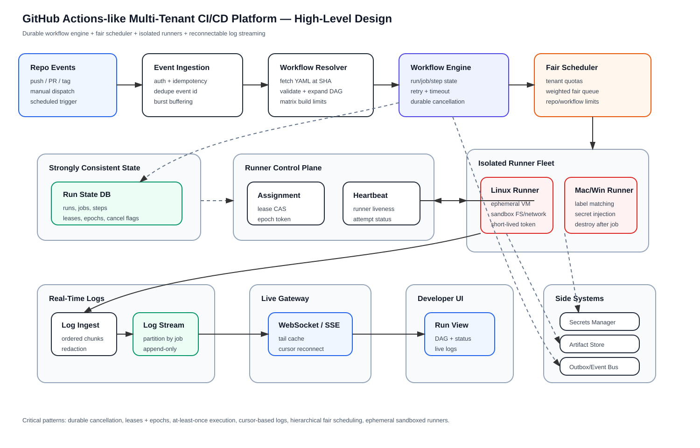
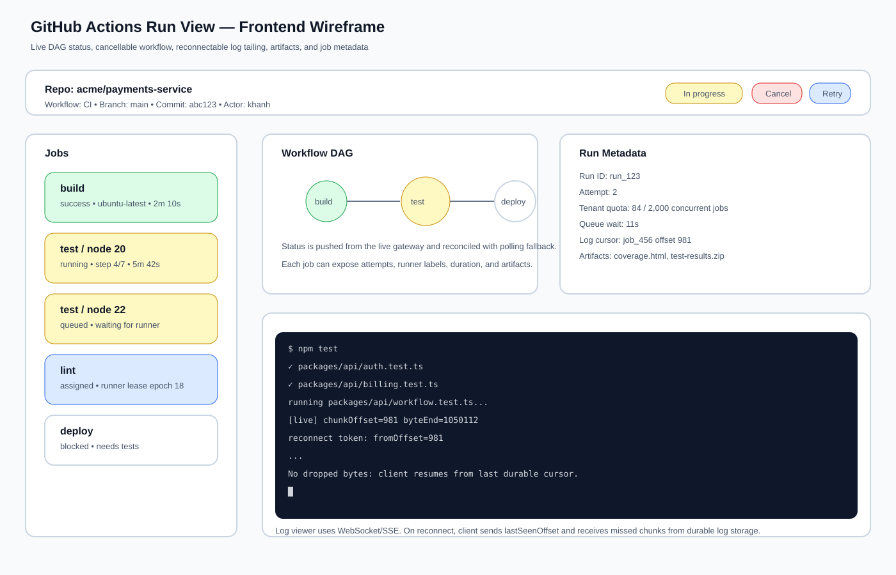

# Design GitHub Actions: Multi-Tenant CI/CD Platform

## 1. Problem Statement

Design a **multi-tenant CI/CD platform** similar to GitHub Actions.

A developer pushes code to a repository. The platform receives the event, loads the workflow YAML from that repository, resolves the jobs and dependencies, schedules jobs onto isolated sandboxed runners, executes them, streams logs and status updates live, supports cancellation and retry, and stores durable history for later debugging.

The system is not just a cron runner. It is a **durable workflow execution engine** with tenant fairness, sandbox isolation, resumability, real-time log streaming, and high concurrency.

---

## 2. Scale Assumptions

| Metric | Target |
|---|---:|
| Repositories | 10M |
| Push events | 10/sec average |
| Burst traffic | 100/sec |
| Peak concurrent jobs | 100K |
| Build duration | minutes to hours |
| Live log viewers | thousands at any moment |
| Log freshness target | < 1 second to viewer |
| Platform model | Multi-tenant SaaS |

### Key implication

Because jobs run for minutes or hours, the hard part is not accepting pushes. The hard part is keeping long-running workflow execution **durable, observable, cancellable, fair, and recoverable** while thousands of tenants share the same fleet.

---

## 3. Requirements

## Functional Requirements

1. Trigger workflows from repository events such as push, pull request, tag, manual dispatch, and scheduled triggers.
2. Parse workflow YAML and expand jobs, matrix builds, dependencies, environment variables, permissions, and secrets references.
3. Schedule jobs onto isolated runners.
4. Stream job status and logs to the UI in near real time.
5. Support durable cancellation, retry, timeout, and failure handling.
6. Recover a run if a coordinator or runner dies.
7. Store workflow history, artifacts, logs, and metadata.
8. Enforce tenant-level quotas and fairness.
9. Support self-hosted and managed runners.
10. Protect secrets and prevent cross-tenant data leakage.

## Non-Functional Requirements

| Category | Requirement |
|---|---|
| Availability | Workflow submission and status APIs should remain highly available. |
| Durability | Workflow state, cancellation, and logs must survive process restart. |
| Isolation | Jobs from different tenants must not share unsafe compute, network, filesystem, or secrets context. |
| Fairness | One tenant firing 10K builds should not starve other tenants. |
| Latency | Log/status streaming should be under 1 second in the normal case. |
| Scalability | Support 100K concurrent jobs and bursty repo events. |
| Observability | Every run should be traceable from trigger to scheduler to runner to logs. |
| Security | Least-privilege tokens, secret redaction, sandboxing, audit logs. |

---

## 4. Core Staff-Level Design Principle

The central pattern is:

> **Durable workflow engine + fair scheduler + isolated ephemeral runners + append-only execution/log streams.**

A queue alone is not enough. A queue can dispatch work, but it does not model a long-running workflow with DAG dependencies, cancellation, retries, timeouts, leases, resumability, and durable status transitions.

The workflow engine owns the run state machine. The scheduler owns fairness and placement. The runner owns execution. The log pipeline owns real-time append-only logs. The UI consumes status and logs through WebSockets or Server-Sent Events.

---

## 5. High-Level Architecture



### Main components

| Component | Responsibility |
|---|---|
| Event Ingestion | Receives repo events from Git, webhook, manual dispatch, or schedule. |
| Workflow Resolver | Fetches workflow YAML, validates syntax, expands matrix jobs and DAG. |
| Workflow Engine | Durable state machine for run/job/step lifecycle. |
| Run State Store | Source of truth for workflow state, attempts, leases, cancellation, timestamps. |
| Fair Scheduler | Selects runnable jobs using tenant quotas, concurrency limits, priority, and capacity. |
| Runner Control Plane | Assigns jobs to managed or self-hosted runners. |
| Runner Fleet | Executes jobs inside isolated sandbox environments. |
| Log Ingest | Receives ordered log chunks from runners. |
| Log Stream | Durable append-only log stream partitioned by run/job. |
| Live Gateway | WebSocket/SSE gateway for UI live status and logs. |
| Artifact Store | Stores build artifacts, caches, and downloadable outputs. |
| Metadata DB | Stores repos, workflow definitions, runs, jobs, steps, users, orgs. |
| Outbox/Event Bus | Emits run completed, job failed, artifact uploaded, billing usage, audit events. |

---

## 6. Frontend Experience



### User flow

1. User pushes code.
2. User opens **Actions** tab.
3. UI lists workflow runs grouped by workflow, branch, commit, actor, and status.
4. User clicks a run.
5. Run page shows DAG/job list, live status, current step, duration, and cancellation/retry controls.
6. User opens a job log.
7. UI tails log chunks with reconnect support.
8. User can download artifacts after completion.

### Frontend state model

```ts
type RunStatus =
  | 'queued'
  | 'waiting_for_runner'
  | 'in_progress'
  | 'canceling'
  | 'canceled'
  | 'success'
  | 'failure'
  | 'timed_out';

type WorkflowRun = {
  runId: string;
  repoId: string;
  workflowName: string;
  branch: string;
  commitSha: string;
  actorId: string;
  status: RunStatus;
  createdAt: string;
  startedAt?: string;
  completedAt?: string;
  jobs: JobSummary[];
};

type JobSummary = {
  jobId: string;
  name: string;
  status: RunStatus;
  runnerType: 'managed' | 'self_hosted';
  startedAt?: string;
  completedAt?: string;
  currentStep?: string;
};

type LogCursor = {
  runId: string;
  jobId: string;
  chunkOffset: number;
  byteOffset: number;
};
```

### Frontend streaming contract

The client should not assume WebSocket messages are reliable forever. It should reconnect with a cursor.

```ts
type LogMessage = {
  runId: string;
  jobId: string;
  chunkOffset: number;
  byteOffsetStart: number;
  byteOffsetEnd: number;
  text: string;
  emittedAt: string;
};
```

Reconnect flow:

```txt
Client connects with lastSeenOffset.
Live Gateway reads durable log stream from lastSeenOffset + 1.
Gateway catches the client up.
Gateway then subscribes to new chunks.
Client de-duplicates by chunkOffset and byte range.
```

This avoids dropping bytes when the browser reconnects.

---

## 7. Core Entities

```txt
Organization
  id
  plan
  concurrency_limit
  minutes_quota
  isolation_policy

Repository
  id
  org_id
  name
  default_branch

WorkflowDefinition
  id
  repo_id
  path
  yaml_hash
  version

WorkflowRun
  id
  repo_id
  workflow_definition_id
  trigger_event_id
  commit_sha
  branch
  actor_id
  status
  cancel_requested
  attempt
  created_at
  started_at
  completed_at

Job
  id
  run_id
  name
  status
  dependency_job_ids
  runner_label_selector
  priority
  attempt
  lease_owner
  lease_epoch
  lease_expires_at
  started_at
  completed_at

Step
  id
  job_id
  name
  status
  exit_code
  started_at
  completed_at

Runner
  id
  type
  tenant_id_nullable
  labels
  status
  last_heartbeat_at
  current_job_id

LogChunk
  run_id
  job_id
  chunk_offset
  byte_start
  byte_end
  compressed_payload_uri
  checksum

Artifact
  id
  run_id
  job_id
  name
  storage_uri
  size_bytes
  checksum
```

---

## 8. Workflow State Machine

```txt
created
  -> resolving
  -> queued
  -> running
  -> completing
  -> success | failure | canceled | timed_out
```

Job state machine:

```txt
created
  -> runnable
  -> queued
  -> assigned
  -> running
  -> canceling
  -> success | failure | canceled | timed_out | lost
```

### Why explicit states matter

Explicit states make recovery easier. If a coordinator crashes, another coordinator can scan for jobs where:

```txt
status = assigned/running AND lease_expires_at < now()
```

Then it can mark the old attempt as lost and either retry or fail according to policy.

---

## 9. API Design

## Trigger APIs

```http
POST /repos/{repoId}/events
Content-Type: application/json

{
  "eventType": "push",
  "branch": "main",
  "commitSha": "abc123",
  "actorId": "u1"
}
```

Response:

```json
{
  "eventId": "evt_123",
  "accepted": true
}
```

## Workflow Run APIs

```http
GET /repos/{repoId}/actions/runs?branch=main&status=in_progress
GET /actions/runs/{runId}
POST /actions/runs/{runId}/cancel
POST /actions/runs/{runId}/retry
GET /actions/runs/{runId}/jobs
GET /actions/jobs/{jobId}/logs?fromOffset=1234
GET /actions/runs/{runId}/artifacts
```

## Live Streaming APIs

```http
GET /actions/jobs/{jobId}/logs/stream?fromOffset=1234
Upgrade: websocket
```

Or with SSE:

```http
GET /actions/jobs/{jobId}/logs/events?fromOffset=1234
Accept: text/event-stream
```

### Live event example

```json
{
  "type": "log_chunk",
  "runId": "run_1",
  "jobId": "job_1",
  "chunkOffset": 1235,
  "text": "npm test passed\n"
}
```

---

## 10. Data Storage Design

## PostgreSQL / Cloud Spanner-style relational DB

Use SQL for strongly consistent metadata and state transitions:

- workflow runs
- job states
- step states
- cancellation flags
- leases and epochs
- org quotas
- billing usage

Important tables:

```sql
CREATE TABLE workflow_runs (
  id TEXT PRIMARY KEY,
  repo_id TEXT NOT NULL,
  workflow_definition_id TEXT NOT NULL,
  trigger_event_id TEXT NOT NULL UNIQUE,
  commit_sha TEXT NOT NULL,
  branch TEXT NOT NULL,
  actor_id TEXT NOT NULL,
  status TEXT NOT NULL,
  cancel_requested BOOLEAN NOT NULL DEFAULT FALSE,
  attempt INT NOT NULL DEFAULT 1,
  created_at TIMESTAMPTZ NOT NULL,
  started_at TIMESTAMPTZ,
  completed_at TIMESTAMPTZ
);

CREATE TABLE jobs (
  id TEXT PRIMARY KEY,
  run_id TEXT NOT NULL REFERENCES workflow_runs(id),
  name TEXT NOT NULL,
  status TEXT NOT NULL,
  tenant_id TEXT NOT NULL,
  priority INT NOT NULL DEFAULT 0,
  attempt INT NOT NULL DEFAULT 1,
  lease_owner TEXT,
  lease_epoch BIGINT NOT NULL DEFAULT 0,
  lease_expires_at TIMESTAMPTZ,
  started_at TIMESTAMPTZ,
  completed_at TIMESTAMPTZ
);

CREATE INDEX idx_jobs_runnable ON jobs(status, tenant_id, priority, created_at);
CREATE INDEX idx_jobs_expired_lease ON jobs(status, lease_expires_at);
```

## Durable log storage

Logs should be append-only and ordered per job.

Good options:

- Kafka/Pulsar for hot streaming log chunks.
- Object storage for compressed long-term log chunks.
- Cassandra/DynamoDB/Bigtable for indexed chunk metadata and offset lookup.

Pattern:

```txt
Runner -> Log Ingest -> Durable Stream -> Live Gateway
                         -> Object Storage Compactor
                         -> Log Metadata Index
```

## Artifact storage

Use object storage such as S3/GCS/Azure Blob equivalent.

Artifacts are large, immutable, and downloaded after completion. The DB stores metadata and storage URI. The object store keeps the bytes.

---

## 11. Workflow Execution Flow

```txt
1. Git event arrives.
2. Event Ingestion validates repo and persists event idempotently.
3. Workflow Resolver fetches YAML at commit SHA.
4. Resolver expands matrix jobs and DAG.
5. Workflow Engine writes WorkflowRun, Jobs, and Steps to DB.
6. Runnable jobs are placed into per-tenant scheduling queues.
7. Fair Scheduler picks jobs according to quotas and capacity.
8. Runner Control Plane assigns job with lease + epoch.
9. Runner starts sandbox and executes steps.
10. Runner heartbeats and streams status/log chunks.
11. Workflow Engine updates durable state.
12. When dependencies complete, next jobs become runnable.
13. On completion, outbox emits events for billing, notifications, archives, and cache updates.
```

---

## 12. Durable Cancellation

Cancellation must be persisted before any best-effort signal is sent to the runner.

```txt
POST /runs/{runId}/cancel
  -> transactionally set workflow_runs.cancel_requested = true
  -> set active jobs to canceling
  -> write cancellation event to outbox
  -> scheduler stops assigning pending jobs
  -> runner control plane sends SIGTERM / graceful stop
  -> after grace period, force kill sandbox
```

### Why this matters

If the API server crashes after sending a kill signal but before saving the cancellation flag, a restarted coordinator may think the run is still valid and reschedule it. Durable cancellation prevents that.

---

## 13. Resumability and Failure Recovery

## Runner death

Runner heartbeats every few seconds:

```txt
runner_id, job_id, lease_epoch, timestamp, current_step, log_offset
```

If heartbeat is stale:

1. Mark job attempt as lost.
2. Release lease only if epoch matches.
3. Decide retry based on retry policy and idempotency.
4. Re-enqueue job if retryable.
5. Preserve previous attempt logs.

## Coordinator death

Workflow Engine instances are stateless workers over durable DB state.

Recovery scans:

```sql
SELECT * FROM jobs
WHERE status IN ('assigned', 'running', 'canceling')
AND lease_expires_at < now();
```

Then the engine reconciles each job.

## Exactly-once vs at-least-once

For job execution, exactly-once is unrealistic. The correct design is:

- **At-least-once scheduling**
- **Leased ownership with epochs**
- **Idempotent state transitions**
- **Attempt numbers**
- **Durable logs per attempt**
- **Best-effort sandbox cleanup**

---

## 14. Tenant Fairness and Scheduling

A naive global FIFO queue fails because a large tenant can enqueue 10K jobs and starve everyone else.

Use a hierarchical fair scheduler:

```txt
Global capacity
  -> organization quota
    -> repository concurrency limit
      -> workflow/run limit
        -> job priority
```

### Scheduling algorithm options

| Algorithm | Use case |
|---|---|
| Weighted Fair Queuing | Fairness across tenants with plan weights. |
| Deficit Round Robin | Simple and efficient for large queue counts. |
| Token Bucket | Enforce burst limits per tenant/repo. |
| Priority Queues | Allow urgent jobs without bypassing fairness. |

### Example policy

```txt
Org A Enterprise: max 2,000 concurrent jobs, weight 20
Org B Free: max 20 concurrent jobs, weight 1
Repo limit: max 100 concurrent jobs per repo by default
Workflow limit: max 20 concurrent runs per workflow
```

### Scheduler data structures

```txt
TenantQueueMap: tenant_id -> queue of runnable jobs
TenantTokens: tenant_id -> available concurrency tokens
RunnerCapacityIndex: labels/region/os -> available runners
```

The scheduler only assigns a job when:

1. The tenant has available concurrency.
2. The repo/workflow has available concurrency.
3. Matching runner capacity exists.
4. The job is still runnable and not canceled.
5. The DB lease compare-and-swap succeeds.

---

## 15. Runner Isolation

## Managed runners

Each job gets an ephemeral sandbox:

- fresh VM, microVM, or container with strong isolation
- isolated filesystem
- isolated network namespace
- scoped short-lived token
- secrets injected only at runtime
- logs redacted before storage
- sandbox destroyed after job

## Isolation levels

| Level | Option | Tradeoff |
|---|---|---|
| Strongest | VM or microVM | Better tenant isolation, slower startup. |
| Medium | Container with gVisor/Kata/Firecracker-style isolation | Good balance. |
| Fastest | Plain container | Lower isolation, risky for untrusted multi-tenant workloads. |

For a GitHub Actions-like public CI system, prefer **ephemeral VM or microVM isolation** for managed runners.

## Secret handling

- Store encrypted secrets in a secrets manager.
- Resolve secrets at job start, not during workflow parsing.
- Inject short-lived scoped tokens.
- Redact known secret values from logs.
- Do not expose secrets to pull requests from untrusted forks unless explicitly allowed.

---

## 16. Log Streaming Design

The log system must support:

- ordered append per job
- sub-second live viewing
- reconnect without data loss
- no global fan-out bottleneck
- long-term storage

### Partitioning

Partition log stream by:

```txt
hash(run_id or job_id)
```

This keeps all chunks for a job ordered while spreading load across partitions.

### Log chunk structure

```json
{
  "runId": "run_123",
  "jobId": "job_456",
  "attempt": 2,
  "chunkOffset": 981,
  "byteStart": 1048576,
  "byteEnd": 1050112,
  "payload": "...compressed or plaintext...",
  "checksum": "sha256:..."
}
```

### Avoiding hot spots

Do not have every viewer connect directly to the same log partition broker. Use Live Gateways:

```txt
Browser viewers -> Live Gateway shard -> Log Stream partition
```

The Live Gateway multiplexes many viewers for the same job and maintains a bounded in-memory tail cache. Older chunks are fetched from durable storage.

---

## 17. Workflow DAG Handling

Workflow YAML may define dependencies:

```yaml
jobs:
  build:
    runs-on: ubuntu-latest
  test:
    needs: build
    runs-on: ubuntu-latest
  deploy:
    needs: test
    runs-on: ubuntu-latest
```

Resolver turns this into a DAG:

```txt
build -> test -> deploy
```

When a job completes, Workflow Engine checks dependents. A dependent becomes runnable only when all required parents are successful, unless the workflow uses an explicit conditional such as `always()`.

---

## 18. Matrix Builds

Matrix expansion can create many jobs:

```yaml
strategy:
  matrix:
    node: [18, 20, 22]
    os: [ubuntu-latest, macos-latest]
```

Expands to 6 jobs.

Staff-level concern: cap matrix expansion per repo/org to prevent accidental or malicious explosion.

```txt
max_matrix_jobs_per_run = 256 by default
max_total_jobs_per_workflow_run = 1000 for large enterprise plans
```

---

## 19. Caches and Artifacts

## Cache

Build caches improve performance but are risky in multi-tenant environments.

Design:

- cache key scoped by org/repo/branch/security context
- immutable cache entries
- TTL and size limits
- no cache sharing from untrusted fork PRs to protected branches

## Artifacts

Artifacts are immutable per run.

```txt
runner uploads artifact -> pre-signed URL -> object store
runner reports metadata -> artifact DB table
UI lists artifact -> user downloads through signed URL
```

---

## 20. Consistency Model

| Data | Consistency model |
|---|---|
| Run/job state | Strong consistency in DB. |
| Cancellation | Strongly persisted before effects. |
| Scheduler queue | Eventually consistent with DB, reconciled. |
| Logs | Ordered per job, append-only. |
| UI status | Eventually consistent, near real-time. |
| Artifacts | Read-after-write after metadata commit. |
| Billing/audit | Outbox-driven eventual processing. |

---

## 21. Transactional Outbox

When a run completes, many downstream systems need updates:

- notifications
- billing usage
- search indexing
- audit log
- repository checks API
- cache invalidation

Do not write DB and then separately publish a message with no coupling.

Use transactional outbox:

```sql
BEGIN;
UPDATE workflow_runs SET status = 'success', completed_at = now() WHERE id = $1;
INSERT INTO outbox_events(type, aggregate_id, payload, created_at)
VALUES ('workflow_run.completed', $1, $2, now());
COMMIT;
```

An outbox relay publishes events to Kafka/PubSub. Consumers are idempotent.

---

## 22. Multi-Region Strategy

A practical design:

- Repository metadata is globally available.
- Workflow run state is region-affine once created.
- Runner fleet is regional.
- Logs are written to regional stream and replicated to durable object storage.
- UI connects to nearest gateway, which routes to the run’s home region.

Avoid active-active execution ownership for the same run. Use a single home region per run to simplify leases, ordering, and recovery.

---

## 23. Observability

Key metrics:

```txt
workflow_trigger_latency_ms
workflow_resolve_latency_ms
scheduler_queue_depth_by_tenant
scheduler_fairness_share_by_tenant
runner_capacity_available_by_label
job_assignment_latency_ms
job_start_latency_ms
runner_heartbeat_lag_ms
expired_lease_count
job_retry_count
cancel_to_kill_latency_ms
log_ingest_lag_ms
log_stream_lag_ms
websocket_reconnect_count
artifact_upload_failure_rate
```

Tracing dimensions:

```txt
run_id
job_id
attempt
tenant_id
repo_id
workflow_id
runner_id
lease_epoch
```

---

## 24. Failure Scenarios

| Failure | Handling |
|---|---|
| Runner dies mid-build | Lease expires, attempt marked lost, retry if policy allows. |
| API server dies during cancel | Cancel flag already persisted; reconciler continues cancellation. |
| Scheduler assigns duplicate job | DB compare-and-swap lease epoch prevents dual ownership. |
| Log gateway crashes | Client reconnects with cursor; durable log stream catches up. |
| Log ingest is slow | Runner buffers bounded chunks, applies backpressure, then fails safely if buffer exceeds limit. |
| Tenant floods platform | Token bucket + concurrency quota + fair scheduler protects others. |
| Object storage upload fails | Job can retry upload; metadata commits only after successful upload. |
| Workflow YAML creates huge matrix | Resolver enforces expansion limits. |
| Secret appears in logs | Redaction filter and audit alert; still assume secrets may need rotation. |

---

## 25. Capacity Planning

At 100K concurrent jobs:

- Runner fleet must scale horizontally by OS/architecture labels.
- Scheduler should be sharded by tenant or queue partition.
- DB writes should be controlled; do not write every log line to SQL.
- Logs should go to append-only streams/object storage, not relational tables.
- Heartbeats must be batched and tuned. If 100K runners heartbeat every 5 seconds, that is 20K heartbeat updates/sec. Consider separate heartbeat store or batched updates.

### Heartbeat optimization

Instead of writing every heartbeat to the main DB:

```txt
Runner -> Heartbeat Service -> Redis/DynamoDB TTL table
Reconciler scans expired heartbeats
DB only receives durable state transitions
```

---

## 26. Technology Choices

| Need | Technology choice |
|---|---|
| Metadata/state | PostgreSQL, MySQL, Spanner, CockroachDB |
| Scheduling queue | Kafka/Pulsar + scheduler workers, or Redis Streams for smaller scale |
| Logs | Kafka/Pulsar hot stream + object storage archive |
| Artifacts | S3/GCS/Azure Blob |
| Live updates | WebSocket or SSE gateway |
| Runner isolation | VM/microVM/container sandbox with gVisor/Kata/Firecracker-style isolation |
| Secrets | KMS-backed secrets manager |
| Cache | Object storage + metadata DB + TTL policies |
| Fairness | Weighted fair queuing / deficit round robin |
| Observability | OpenTelemetry, Prometheus, logs/traces/metrics |

---

## 27. Interview Answer Summary

A strong interview answer should emphasize:

1. **This is a durable workflow engine, not just a queue.**
2. Workflow state, cancellation, retries, and leases must be durable.
3. Jobs are long-running, so worker failure is normal at scale.
4. Runner execution is at-least-once; correctness comes from leases, epochs, attempts, and idempotent transitions.
5. Logs should be append-only, ordered per job, and reconnectable by cursor.
6. Tenant fairness requires hierarchical scheduling, quotas, and token buckets.
7. Isolation requires ephemeral runners, secret scoping, and network/filesystem boundaries.
8. SQL is appropriate for workflow state; streams/object storage are appropriate for logs and artifacts.
9. Transactional outbox keeps state changes and downstream events consistent.
10. Multi-region design should avoid dual active ownership of the same run.

---

## 28. Short Verbal Pitch

> I would design GitHub Actions as a durable multi-tenant workflow engine. The event ingestion layer accepts repo events and resolves workflow YAML into a DAG of jobs. The workflow engine persists run, job, step, cancellation, attempt, and lease state in a strongly consistent store. A fair scheduler selects runnable jobs using tenant quotas and weighted fair queuing, then assigns them to isolated ephemeral runners through a control plane. Runners stream heartbeats, status, and append-only log chunks. Logs go through a durable stream partitioned by job ID, with live gateways serving WebSocket/SSE viewers using reconnect cursors. Cancellation is persisted before signaling the runner, and recovery is driven by expired leases and idempotent state transitions. Downstream systems such as billing, notifications, and audit consume outbox events after state commits.

---

## 29. What to Draw on the Whiteboard

Draw these boxes:

```txt
Git Push / PR Event
  -> Event Ingestion
  -> Workflow Resolver
  -> Workflow Engine + State DB
  -> Fair Scheduler
  -> Runner Control Plane
  -> Isolated Runner Fleet
  -> Log Ingest + Log Stream
  -> Live Gateway
  -> Browser UI
```

Then add side systems:

```txt
Secrets Manager
Artifact Store
Cache Store
Outbox/Event Bus
Billing/Audit/Notifications
```

Finally call out these four critical patterns:

```txt
1. Leases + epochs for job ownership
2. Durable cancellation flag
3. Cursor-based log streaming
4. Hierarchical fair scheduling by tenant/repo/workflow
```
