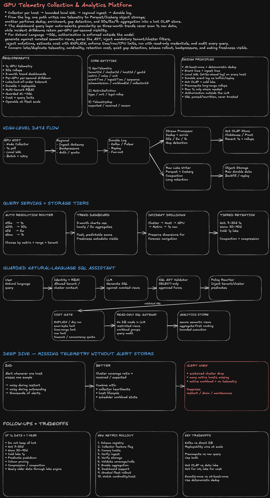

# Design a GPU Telemetry Collection and Analytics Platform

## 0. Interview framing

**Goal:** collect GPU telemetry at both **1-second** and **30-second** resolution, support:

1. **Three-month trend dashboards**
2. **Per-GPU, per-second incident drilldown**
3. Future **natural-language → SQL** analytics with strong authorization, safety, and cost controls

This is an **observability / analytics platform**, not a model-training platform.

---

# 1. Clarifying questions

Ask these first, then state assumptions if the interviewer does not answer.

```text
Scale
- How many hosts / GPUs today?
- Expected growth over 1–3 years?
- Peak write rate by region / cluster?

Metrics
- GPU utilization?
- Memory used / bandwidth?
- Temperature / power?
- ECC / Xid errors?
- Job / workload / tenant ownership?
- Driver / firmware version?

Retention
- How long do we retain 1-second samples?
- Is 30-second data retained longer?
- Is raw detail needed for compliance or only incidents?

Latency
- Dashboard freshness target: 5s, 30s, 1m?
- Incident drilldown latency target?
- Offline analytics acceptable at minutes?

Security
- Existing tenant / team / cluster RBAC?
- Are there row-level / column-level restrictions?
- Are operators allowed to query all clusters?

Availability
- Can collectors buffer locally during network partitions?
- Is telemetry loss tolerable, and if so how much?
```

---

# 2. Working scale assumptions

Keep symbolic in the interview.

```text
H = number of hosts
G = GPUs per host
M = metrics per GPU
S = bytes per encoded sample
```

Approximate ingestion:

```text
1-second stream  ≈ H × G × M samples / second
30-second stream ≈ (H × G × M) / 30 samples / second
```

At large fleet scale, the 1-second stream dominates cost.

**Staff-level principle:** design hot paths around the high-resolution stream, but avoid forcing every dashboard query to scan it.

---

# 3. Functional requirements

```text
FR1. Collect GPU telemetry every 1 second.
FR2. Produce or collect 30-second aggregates.
FR3. Survive temporary host/network failures with bounded local buffering.
FR4. Persist telemetry durably.
FR5. Support 3-month trend dashboards.
FR6. Support per-GPU, per-second drilldowns.
FR7. Detect telemetry gaps and collector health issues.
FR8. Support schema evolution for new metrics.
FR9. Expose APIs for dashboard queries.
FR10. Future NL→SQL assistant with RBAC + cost/safety controls.
```

## Non-functional requirements

```text
NFR1. High ingest availability.
NFR2. At-least-once delivery is acceptable if deduplication is deterministic.
NFR3. Query p95 suitable for interactive dashboards.
NFR4. Cost bounded as fleet and retention grow.
NFR5. Multi-tenant isolation.
NFR6. Auditable access and SQL execution.
NFR7. Graceful degradation under downstream outages.
NFR8. Easy metric rollout and backfill.
```

---

# 4. Core entities

```ts
type GpuTelemetry = {
  tenantId: string;
  clusterId: string;
  hostId: string;
  gpuId: string;

  metric: string;
  value: number;
  unit: string;

  eventTime: string; // when measured
  ingestTime: string; // when platform received it
  sequence: number; // collector-local monotonic sequence
  schemaVersion: number;

  workloadId?: string;
  jobId?: string;
  ownerTeam?: string;

  collectorId: string;
};

type TelemetryGap = {
  clusterId: string;
  gpuId?: string;
  startTime: string;
  endTime: string;
  expectedSamples: number;
  receivedSamples: number;
  reason?: 'host_restart' | 'network' | 'collector_down' | 'unknown';
};

type MetricDefinition = {
  metric: string;
  type: 'gauge' | 'counter' | 'histogram';
  unit: string;
  rollup: 'avg' | 'max' | 'min' | 'sum' | 'last' | 'p95';
  schemaVersion: number;
};
```

---

# 5. High-level architecture

```text
GPU Host
  └─ Node Collector / Agent
      ├─ Poll GPU metrics every 1s
      ├─ Local WAL / ring buffer
      ├─ Batch + compress
      └─ Retry with backoff
            |
            v
      Regional Ingest Gateway
            |
            v
     Durable Event Log
       Kafka / Pulsar
        /          \
       /            \
      v              v
Stream Processor   Raw Lake Writer
  |                  |
  |                  v
  |             Object Storage
  |             Parquet/Iceberg
  |
  ├─ 30s aggregate
  ├─ gap detection
  ├─ enrich workload metadata
  v
Hot Analytics Store
ClickHouse / Pinot / Druid
  |
  +--> Dashboard API
  |
  +--> Incident Drilldown
  |
  +--> Guarded SQL Gateway
           |
           v
        NL → SQL
```

---

# 6. Part 1 — Collector and ingestion path

## 6.1 Collector placement

Use **one node-level collector per host**, not one process per GPU.

Why:

```text
+ Lower process overhead
+ Shared access to GPU driver APIs
+ One place for batching, compression, buffering
+ Easier version rollout / health monitoring
```

The collector polls device metrics every **1 second**.

### 30-second data

Prefer deriving the 30-second stream from the 1-second stream in the ingestion pipeline.

```text
1s raw samples
   ↓
windowed stream aggregation
   ↓
30s rollups
```

Why this is safer:

```text
+ One source of truth
+ Avoids disagreement between 1s and 30s collectors
+ Recompute possible if aggregation logic changes
```

If collector-side 30s aggregation is required for bandwidth reduction, treat it as a secondary stream and preserve 1s raw for the configured retention window.

---

## 6.2 Local buffering

Collector writes every outgoing batch to a **bounded local WAL**.

```text
poll GPU
  ↓
append local WAL
  ↓
send batch
  ↓
broker ACK
  ↓
advance WAL checkpoint
```

On network failure:

```text
- keep writing locally
- retry with exponential backoff + jitter
- bound disk usage
- if disk cap is approached:
    1. preserve errors / critical metrics
    2. preserve recent samples
    3. shed lower-value metrics if policy allows
```

Use disk, not only memory, so a collector process restart does not immediately lose buffered samples.

---

## 6.3 Delivery semantics

Use **at-least-once** delivery.

Exactly-once across hosts, network, broker, stream processor, and storage is expensive and usually unnecessary for telemetry.

Dedup key:

```text
(collectorId, gpuId, metric, eventTime, sequence)
```

or a compact deterministic event ID:

```ts
eventId = hash(collectorId, gpuId, metric, eventTime, sequence);
```

Consumers deduplicate within a practical time window.

---

## 6.4 Event time vs ingest time

Store both.

```text
event_time  = when GPU metric was observed
ingest_time = when central platform received it
```

This lets us identify:

```text
- delayed telemetry
- out-of-order telemetry
- collector buffering during outage
- ingestion lag
```

Stream processors use **event-time windows + watermarks**.

---

## 6.5 Broker partitioning

Do not partition randomly.

A practical key:

```text
hash(tenantId, clusterId, hostId)
```

Benefits:

```text
+ Maintains order for a host
+ Evenly distributes hosts
+ Avoids one partition per GPU
```

Potential hot cluster:

```text
clusterId alone → bad
```

because a very large cluster can create a hot partition.

---

## 6.6 Schema evolution

Use a versioned schema registry.

```text
Envelope:
- schemaVersion
- metric name
- typed value
- dimensions
```

Rules:

```text
Backward-compatible additions:
+ new optional field
+ new metric
+ new enum value if readers tolerate unknowns

Risky:
- field rename
- semantic meaning change
- unit change

For a semantic change:
create a new metric/version rather than silently changing meaning.
```

---

## 6.7 Failure handling

### Host restart

Collector WAL may disappear only if host disk is ephemeral.

Mitigation:

```text
- write WAL to persistent local disk if available
- host restart is recorded as telemetry metadata
- gap detector suppresses expected restart windows
```

### Network partition

```text
collector buffers locally
→ reconnect
→ resumes in sequence order
→ central pipeline accepts late events
```

### Broker outage

```text
regional gateway applies backpressure
collectors continue buffering
```

### Stream processor outage

Kafka retains data, processor resumes from committed offsets.

---

# 7. Part 2 — Storage, aggregation, and dashboard serving

Use a **multi-tier storage architecture**.

## Tier A — Hot analytics store

Examples:

```text
ClickHouse
Apache Pinot
Apache Druid
```

Use for:

```text
- recent 1-second telemetry
- common 30-second / 5-minute aggregates
- interactive filters
- incident drilldowns
```

## Tier B — Durable lake

```text
Object storage
+ Parquet
+ Iceberg / Delta / Hudi-style table metadata
```

Use for:

```text
- cheap long retention
- replay
- offline analytics
- backfills
- schema migration
```

---

## 7.1 Storage layout

### Raw 1-second data

Partition coarsely enough to avoid tiny files.

Example lake partition:

```text
/date=YYYY-MM-DD/hour=HH/cluster_id=...
```

Do **not** partition lake files by `gpuId`.

That creates massive small-file metadata overhead.

Inside files, sort / cluster by:

```text
(clusterId, hostId, gpuId, eventTime)
```

---

## 7.2 Hot-store sort / primary key

For ClickHouse-like storage:

```text
PARTITION BY toDate(event_time)
ORDER BY (
  tenant_id,
  cluster_id,
  host_id,
  gpu_id,
  metric,
  event_time
)
```

This matches common drilldowns:

```text
cluster → host → GPU → metric → time range
```

---

## 7.3 Aggregation levels

Precompute common windows.

```text
1s raw
 ↓
30s aggregate
 ↓
5m aggregate
 ↓
1h aggregate
```

Suggested use:

```text
Dashboard range       Query source
----------------------------------
last 15 min           1s or 30s
last 24 hours         30s / 5m
last 7 days           5m
last 3 months         1h
```

This makes three-month dashboards cheap.

---

## 7.4 Preserve correct metric semantics

Different metrics need different rollups.

```text
GPU utilization       avg, max, p95
temperature           avg, max
ECC error counter     delta/sum
power                  avg, max
OOM / Xid event        count
memory usage           avg, max
```

Do not blindly average counters.

Metric registry stores the legal aggregation function.

---

## 7.5 Query routing

Dashboard API chooses storage/granularity based on:

```text
- requested time range
- requested resolution
- metric type
- tenant / cluster filters
```

Pseudo logic:

```ts
function chooseResolution(rangeMs: number) {
  if (rangeMs <= 15 * MINUTE) return '1s';
  if (rangeMs <= 24 * HOUR) return '30s';
  if (rangeMs <= 7 * DAY) return '5m';
  return '1h';
}
```

---

## 7.6 Drilldown flow

```text
Three-month cluster trend
     ↓ click anomaly
Day-level view
     ↓
Host view
     ↓
GPU view
     ↓
1-second raw samples
```

Preserve dimensions so an aggregate can always link back to:

```text
tenant
cluster
host
gpu
workload
job
time range
```

---

## 7.7 Real-time + offline from same data

Use Kafka as shared event backbone.

```text
Kafka
 ├─ stream processor → hot analytics store
 └─ lake writer      → object storage
```

This gives:

```text
Real-time dashboards → hot store
Offline analysis     → lake
Replay / rebuild     → lake or Kafka retention
```

---

# 8. Dashboard API

Example APIs:

```http
GET /v1/metrics/query
  ?metric=gpu_utilization
  &cluster=c123
  &from=...
  &to=...
  &resolution=auto
```

```json
{
  "series": [
    {
      "gpuId": "gpu-42",
      "points": [{ "ts": "...", "value": 91.4 }]
    }
  ],
  "effectiveResolution": "5m",
  "dataFreshnessMs": 4200,
  "partial": false
}
```

Incident drilldown:

```http
GET /v1/gpus/{gpuId}/telemetry
  ?from=...
  &to=...
  &resolution=1s
```

Gap API:

```http
GET /v1/telemetry/gaps
  ?cluster=c123
  &from=...
  &to=...
```

---

# 9. Part 3 — Guarded natural-language SQL assistant

The LLM must **never directly query the database with unrestricted credentials**.

Use:

```text
User
 ↓
NL Query API
 ↓
Identity + Authorization Context
 ↓
Schema / Metadata Retriever
 ↓
LLM generates SQL
 ↓
SQL Parser / AST Validator
 ↓
Policy Rewriter
 ↓
Cost Estimator
 ↓
Read-only SQL Gateway
 ↓
Analytics Store
```

---

## 9.1 Security principle

Authorization is enforced **outside the model**.

Never rely on a prompt like:

```text
"Only query clusters the user has permission to see."
```

The model can make mistakes.

Instead inject mandatory predicates at the query layer.

Example:

```sql
-- generated by model
SELECT avg(utilization)
FROM gpu_metrics
WHERE event_time > now() - INTERVAL 1 DAY;
```

Policy rewriter transforms to:

```sql
SELECT avg(utilization)
FROM gpu_metrics
WHERE event_time > now() - INTERVAL 1 DAY
  AND tenant_id = :tenant_id
  AND cluster_id IN (:allowed_clusters);
```

The user cannot remove these predicates.

---

## 9.2 SQL safety controls

Only allow:

```text
SELECT
WITH
approved read-only functions
approved schemas/views
```

Reject:

```text
INSERT
UPDATE
DELETE
DROP
ALTER
TRUNCATE
COPY
external table functions
filesystem / network functions
```

Parse SQL into an AST; do not rely on regex.

---

## 9.3 Cost controls

Before execution:

```text
1. Parse SQL
2. Validate tables/columns
3. Inject authorization filters
4. Run EXPLAIN / dry-run
5. Estimate scanned rows/bytes
6. Enforce time range
7. Enforce max result rows
8. Enforce timeout
9. Enforce concurrency quota
10. Execute only if within budget
```

Example limits:

```text
default max range: 7 days for raw 1s table
default result limit: 10k rows
query timeout: bounded
memory / CPU quota per tenant
```

For three-month questions, route assistant to aggregate views rather than raw telemetry.

---

## 9.4 Semantic views

Do not expose every internal table.

Expose curated views:

```text
gpu_telemetry_1s_secure
gpu_telemetry_30s_secure
gpu_cluster_5m_secure
gpu_cluster_1h_secure
gpu_error_events_secure
```

This improves:

```text
+ correctness
+ schema stability
+ security
+ model SQL generation quality
```

---

## 9.5 Assistant flow

```text
User:
"Which clusters had the largest utilization drop yesterday?"

1. Resolve identity
2. Retrieve allowed clusters
3. Retrieve semantic schema
4. LLM proposes SQL
5. AST validator checks read-only syntax
6. Rewriter injects RBAC predicates
7. Cost estimator verifies aggregate table use
8. Execute with read-only role
9. Return result + SQL + explanation
10. Audit request and query
```

---

# 10. Missing telemetry gap detection

The naive solution alerts on each missing host sample.

That is noisy.

Use hierarchical detection.

```text
Expected rate for cluster:
active_hosts × GPUs/host × expected samples
```

Compute:

```text
coverage_ratio =
received_samples / expected_samples
```

Then alert on:

```text
- sustained cluster-level drop
- many hosts missing simultaneously
- a critical GPU missing while workload remains active
```

Suppress / annotate:

```text
- planned maintenance
- host restart
- autoscaling
- cluster drain
```

### Better signal

Maintain:

```text
collector heartbeat
host lifecycle events
scheduler workload state
```

Then classify:

```text
"telemetry missing because host terminated"
vs
"host active but telemetry missing"
```

Only the second is usually actionable.

---

# 11. Follow-up: retain 1-second data for a full year

This changes economics significantly.

Do not keep all one-year raw data only in the hot analytics store.

Use:

```text
Hot:
7–30 days of 1s data

Warm:
30–90 days compressed / lower-cost analytics storage

Cold:
1 year raw in object store
```

For drilldowns older than hot retention:

```text
dashboard request
  ↓
query coordinator
  ↓
lake query engine
  ↓
Parquet predicate pushdown
```

Options:

```text
Trino / Spark / DuckDB-style service / warehouse external tables
```

Also:

```text
- stronger compression
- column pruning
- dictionary encoding
- partition pruning
- compaction
- sparse metric/event representation
```

---

# 12. Follow-up: safely roll out a new metric

Use a staged compatibility rollout.

```text
1. Add metric to schema registry
2. Deploy collector support behind feature flag
3. Enable on canary hosts
4. Verify ingest acceptance
5. Verify lake + hot store schema
6. Validate data quality
7. Enable aggregation
8. Add dashboard support
9. Expand fleet gradually
10. Monitor cardinality and cost
```

Important:

```text
dashboard should tolerate metric absent
collector and backend versions overlap
new fields must be optional initially
```

Measure:

```text
coverage %
null %
ingest lag
cardinality
bytes/sample
query cost impact
```

---

# 13. Operability

## Platform SLOs

```text
Ingestion availability
Telemetry freshness
End-to-end lag
Gap rate
Query p95 / p99
Query error rate
Consumer lag
WAL utilization
Dropped-sample rate
Lake writer backlog
Hot-store disk / merge pressure
```

## Collector health

```text
last heartbeat
buffer bytes
oldest buffered event age
send retry count
GPU poll errors
driver API latency
```

## Data-quality checks

```text
impossible values
unit mismatch
timestamp skew
duplicate rate
missing sequence ranges
sudden cardinality explosion
```

---

# 14. Backpressure strategy

When downstream is overloaded:

```text
1. Broker absorbs burst
2. Stream processors lag
3. Gateway backpressures
4. Collectors buffer locally
5. Optional priority shedding only as last resort
```

Prioritize:

```text
P0: GPU errors / Xid / thermal critical
P1: utilization, memory, power
P2: lower-value diagnostic metrics
```

Do not silently drop without reporting dropped-sample counters.

---

# 15. Cost controls

Biggest cost drivers:

```text
1. 1-second retention
2. high-cardinality dimensions
3. too many tiny lake files
4. dashboards scanning raw data
5. NL→SQL full scans
```

Controls:

```text
- pre-aggregation
- tiered retention
- compaction
- compression
- semantic views
- query quotas
- enforced time windows
- result limits
- caching common dashboard queries
```

---

# 16. Technology tradeoffs

## Kafka vs direct-to-database

| Choice           | Pros                       | Cons                                        |
| ---------------- | -------------------------- | ------------------------------------------- |
| Direct DB writes | simpler                    | DB becomes ingest bottleneck; harder replay |
| Kafka/Pulsar     | buffering, replay, fan-out | additional ops complexity                   |

**Choose durable log** at large fleet scale.

---

## ClickHouse vs Pinot vs Druid

| System     | Strength                                                     |
| ---------- | ------------------------------------------------------------ |
| ClickHouse | flexible SQL, strong compression, excellent analytical scans |
| Pinot      | low-latency real-time OLAP, star-tree/index options          |
| Druid      | time-series OLAP, rollups, streaming ingestion               |

Interview answer:

```text
I would choose based on existing platform expertise.
The architectural requirement is a horizontally scalable OLAP store,
not a specific brand.
```

---

## Precompute vs raw query

```text
Precompute
+ predictable latency
+ lower cost
- extra pipelines / storage

Raw query
+ flexible
- expensive for long windows
```

Use both.

---

# 17. Data consistency model

Telemetry is naturally append-heavy.

Target:

```text
at-least-once ingest
eventual consistency
deterministic deduplication
event-time correction for late arrivals
```

For dashboards:

```text
freshness metadata should be visible
```

Example:

```text
"Data complete through 11:02:27"
"0.3% samples delayed"
```

---

# 18. Staff-level deep dives

## Q1. Why not keep only 30-second data?

Because incidents may last only a few seconds.

```text
30s average can hide:
- thermal spikes
- ECC bursts
- utilization collapse
- transient memory saturation
```

Keep 1s raw for a shorter window and use rollups for long-term trends.

---

## Q2. Why not query object storage directly for dashboards?

Three-month recurring dashboards need predictable low latency.

Object storage is excellent for cheap retention, but interactive UX benefits from:

```text
hot OLAP store + precomputed rollups
```

---

## Q3. What if telemetry arrives out of order?

Use:

```text
event_time
watermarks
late-arrival window
dedup key
```

Recent aggregates can be corrected until the watermark closes.

---

## Q4. What if a collector sends duplicate batches after reconnect?

Deduplicate using stable event IDs / sequence numbers.

---

## Q5. How do you handle a giant tenant?

Use:

```text
tenant + cluster + host hash partitioning
quotas
separate workload groups
possibly dedicated shards for extreme tenants
```

Avoid partitioning solely by tenant.

---

## Q6. How do you avoid a natural-language SQL full-table scan?

```text
- semantic aggregate views
- AST validation
- mandatory time predicates
- EXPLAIN/dry-run
- scanned-byte budget
- query timeout
- concurrency quota
```

---

## Q7. What if the LLM produces valid SQL with incorrect semantics?

Safety is not only security.

Add:

```text
- metric definitions
- allowed rollups
- semantic layer
- unit metadata
- canonical examples
- post-generation checks
```

For example, disallow `AVG()` on monotonic error counters.

---

# 19. Staff-level summary answer

A strong 2-minute close:

```text
I would put a lightweight collector on every GPU host. It polls metrics
at one-second resolution, writes them to a bounded local WAL, batches and
compresses events, and sends them with at-least-once semantics into a
durable regional log such as Kafka.

From there I split the pipeline. One path writes raw telemetry to a
Parquet/Iceberg data lake for cheap durable retention and replay. Another
streaming path performs enrichment, gap detection, deduplication, and
30-second / 5-minute / hourly rollups into a low-latency OLAP store.

The dashboard query layer automatically chooses the appropriate
granularity: hourly aggregates for three-month trends and one-second raw
data for incident drilldowns. That keeps long-range queries cheap while
preserving forensic detail.

For the future SQL assistant, the LLM never receives direct database
credentials. It generates SQL against curated semantic views, then an
independent SQL gateway parses the AST, injects tenant and cluster
authorization predicates, rejects mutations, estimates cost with
EXPLAIN, enforces time-range/result/CPU limits, and executes using a
read-only identity. Every query is audited.

The main staff-level concerns are correctness under late and duplicate
telemetry, cost of one-second retention, preventing high-cardinality
explosions, quiet gap detection, safe schema evolution, and making
freshness visible to operators.
```
