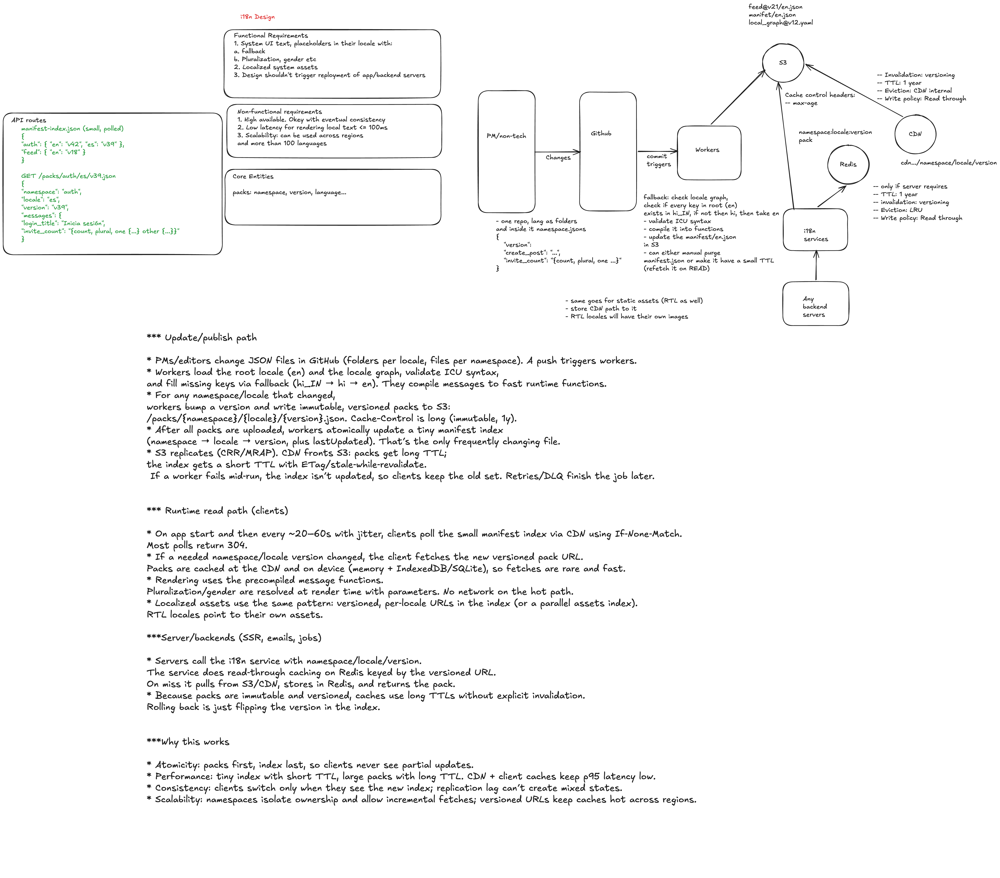

# Internationalization System Design

## Interview Goal

Design an internationalization system that lets a product serve users in many
languages and regions. The system should handle frontend UI strings, backend
content, translated CMS pages, locale-aware formatting, fallback behavior,
translation workflows, and safe rollout.

At staff level, do more than say "use translation JSON files." Explain how
translations are authored, reviewed, versioned, shipped, cached, observed, and
rolled back across frontend, backend, and content teams.

## Staff-Level Checklist

- Clarify supported locales, regions, scripts, and rollout order.
- Separate UI strings, product content, user-generated content, and legal content.
- Define locale negotiation and user override behavior.
- Design frontend bundle loading and fallback chains.
- Design backend translation lookup, content APIs, and caching.
- Support pluralization, gender, interpolation, dates, numbers, currencies, and RTL.
- Build a translation management workflow with review and versioning.
- Add pseudo-localization and automated checks.
- Handle stale, missing, machine, and human-reviewed translations.
- Provide observability for missing keys, fallback rates, and locale performance.
- Plan safe launches and emergency rollback.

## 1. Clarify Requirements

### Functional requirements

- Render the frontend UI in the user's preferred language.
- Serve translated content from backend APIs or CMS.
- Allow users to explicitly choose a language.
- Infer locale from account settings, URL, browser headers, or region.
- Format dates, numbers, currency, relative time, lists, and units.
- Support plural rules and variable interpolation.
- Support right-to-left languages when required.
- Support translated email, push, SMS, and transactional notifications.
- Support search and SEO for localized public pages.
- Track missing translations and fallback usage.

### Non-functional requirements

- Translation loading should not block the app longer than necessary.
- Locale changes should be consistent across web, backend, and notifications.
- Missing translations should degrade gracefully.
- Translation updates should not require a full application deploy when possible.
- Legal and compliance content should have stricter review and release controls.
- Locale-specific issues should be observable and reversible.
- The system should scale with many teams adding strings and content.

### Questions to ask

- Which locales are in scope for launch?
- Is this language-only, or language plus region, such as `en-US` and `en-GB`?
- Do we need right-to-left support?
- Are translations human-reviewed, machine-generated, or hybrid?
- Is user-generated content translated?
- Are marketing, help-center, legal, and product UI content all in scope?
- Do translated strings ship with the app or from a remote service?
- Is SEO required for public localized pages?
- How quickly must translation updates go live?
- What happens if a translation is missing or incorrect?

## 2. Content Types

Different content needs different workflows.

| Content type           | Example                            | Owner                       | Translation workflow                         |
| ---------------------- | ---------------------------------- | --------------------------- | -------------------------------------------- |
| UI strings             | Buttons, labels, errors            | Product engineering         | String extraction and translation management |
| Product content        | Onboarding copy, plan descriptions | Product/content team        | CMS or translation platform                  |
| Legal content          | Terms, privacy, consent            | Legal                       | Strict review and versioning                 |
| Help content           | Docs and support articles          | Support/content team        | CMS with locale publishing                   |
| Notifications          | Email, push, SMS                   | Product and lifecycle teams | Template service with locale variants        |
| User-generated content | Comments, messages, reviews        | Users                       | Optional machine translation on demand       |

Staff-level point: do not force all content through one pipeline. UI strings,
legal pages, and user-generated content have different freshness, correctness,
and review requirements.

## 3. Locale Model

Use BCP 47 language tags:

```text
en
en-US
en-GB
es
es-MX
pt-BR
zh-Hans
zh-Hant
ar
```

Store locale as a normalized tag, not a free-form string.

### Locale resolution order

Example priority:

1. Explicit user account preference.
2. URL locale prefix, such as `/fr/pricing`.
3. Session or cookie preference.
4. `Accept-Language` browser header.
5. Geo or market default.
6. Product default, usually `en`.

The frontend and backend should share the same locale resolution rules or use
one backend-provided resolved locale to avoid inconsistent UI and content.

### Fallback chain

Example:

```text
fr-CA -> fr -> en
pt-PT -> pt -> en
zh-HK -> zh-Hant -> en
```

Fallback chains should be explicit and testable. A missing `fr-CA` string
should not randomly fall back to another region unless product rules allow it.

## 4. High-Level Architecture

```text
Translator / Content Author
  |
  +-- Translation Management System
  |     - string keys
  |     - locale files
  |     - review workflow
  |     - machine translation suggestions
  |
  +-- CMS
        - rich localized pages
        - legal content
        - help articles

Build / Release Pipeline
  |
  +-- extract source strings
  +-- validate placeholders
  +-- pseudo-localize
  +-- publish translation bundles

Frontend App
  |
  +-- locale resolver
  +-- translation bundle loader
  +-- formatter layer
  +-- component rendering

Backend Services
  |
  +-- locale-aware APIs
  +-- content service
  +-- notification template service
  +-- search indexing
  +-- analytics and missing-key reporting
```

## 5. Frontend Design

### UI string lookup

Use stable semantic keys:

```json
{
  "checkout.payButton": "Pay now",
  "checkout.cardDeclined": "Your card was declined.",
  "profile.memberSince": "Member since {date}"
}
```

Avoid keys based on English text:

```text
"Pay now" -> "Pay now"
```

English-text keys make copy edits look like key deletions and cause needless
translation churn.

### Translation bundle loading

Options:

1. Bundle all locales with the app.
2. Bundle only the default locale and lazy-load others.
3. Load translations remotely from a CDN.
4. Split by route and locale.

For a large product, prefer route-level and locale-level splitting:

```text
/assets/i18n/fr/common.json
/assets/i18n/fr/checkout.json
/assets/i18n/ar/settings.json
```

This avoids shipping every language to every user.

### Frontend rendering requirements

- Use ICU MessageFormat or equivalent for pluralization and select rules.
- Use `Intl.DateTimeFormat`, `Intl.NumberFormat`, `Intl.RelativeTimeFormat`,
  and `Intl.DisplayNames` where available.
- Do not concatenate translated fragments to build sentences.
- Keep placeholders named, not positional.
- Escape interpolated values by default.
- Support text expansion; translated text may be much longer.
- Support bidirectional text and `dir="rtl"` for RTL locales.
- Avoid embedding layout assumptions in translation strings.

### Example message

```text
inbox.messageCount =
{count, plural,
  =0 {No messages}
  one {# message}
  other {# messages}
}
```

### Locale switching

When a user changes language:

- Persist the preference to the account when logged in.
- Store a cookie or local setting for logged-out users.
- Reload or refetch translation bundles.
- Refetch locale-specific backend content.
- Update document language and direction.
- Avoid losing unsaved user input.

## 6. Backend Design

### Locale-aware APIs

The client can send locale context:

```http
GET /api/home
Accept-Language: fr-CA,fr;q=0.9,en;q=0.8
X-User-Locale: fr-CA
```

Backend response:

```json
{
  "locale": "fr-CA",
  "fallbackLocale": "fr",
  "content": {
    "headline": "Bienvenue"
  }
}
```

Backend services should return either:

- locale-neutral data and let the frontend translate labels, or
- fully localized content when content lives in backend/CMS systems.

Be explicit about ownership. A backend should not return English enum labels
and expect every client to patch them inconsistently.

### Content service

Responsibilities:

- Resolve locale and fallback chain.
- Fetch localized CMS entries.
- Return versioned content.
- Cache by content ID and locale.
- Expose preview and draft modes for authors.
- Enforce legal/compliance publishing rules.
- Track missing or fallback content.

### Notification service

Notifications need server-side localization because they may be rendered when
the app is closed.

```text
template_id: password_reset
locale: es-MX
variables:
  resetLink
  expirationTime
```

Requirements:

- Template versions per locale.
- Placeholder validation.
- Safe fallback for missing locale.
- Preview tooling.
- Audit trail for legal and transactional content.

## 7. Translation Workflow

### String lifecycle

```text
Developer adds key
  -> extraction job finds new key
  -> translation management system creates tasks
  -> translators or machine translation provide locale variants
  -> review and QA
  -> publish translation bundle
  -> app or CDN serves updated bundle
```

### Pull request checks

- New user-facing strings must use translation keys.
- No missing default-locale values.
- Placeholder names match across locales.
- ICU syntax is valid.
- Removed keys are reported.
- Screens pass pseudo-localization checks.
- RTL snapshots pass for RTL-supported pages.

### Translation quality levels

Not all translations have the same confidence:

- Source only.
- Machine translated.
- Human reviewed.
- Legally approved.

Expose quality metadata where useful. For example, legal pages should not
publish machine-only translations.

## 8. Machine Translation

Machine translation can accelerate workflows but should be controlled.

Use cases:

- Draft translation suggestions.
- User-generated content translation on demand.
- Internal-only admin previews.
- Low-risk help-center content with review.

Risks:

- Incorrect product terminology.
- Legal or safety errors.
- Hallucinated or omitted content.
- Placeholder corruption.
- Privacy concerns if sensitive text is sent to an external provider.

Staff-level point: define what data can be sent to translation providers and
what content requires human review before publication.

## 9. Caching Strategy

Cache dimensions:

```text
cacheKey = contentId + locale + version
cacheKey = namespace + locale + buildVersion
```

Layers:

- Browser cache for translation bundles.
- CDN for static locale assets.
- Backend memory cache for hot content.
- Distributed cache for CMS entries.
- Source-of-truth translation store or CMS.

Use immutable versioned bundle URLs:

```text
/i18n/fr/checkout.2026-06-19.abc123.json
```

This lets clients cache aggressively while still allowing rollback by changing
the manifest.

## 10. SEO and Routing

For public pages:

- Use locale-aware URLs such as `/fr/pricing`.
- Add `hreflang` links.
- Render localized metadata, title, and descriptions.
- Generate locale-specific sitemaps.
- Avoid redirect loops based on `Accept-Language`.
- Let users override language even when geo suggests another region.

Server-side rendering or static generation may be required for SEO-critical
localized pages.

## 11. RTL and Layout

Right-to-left support affects more than text:

- Set `dir="rtl"` at the document or container level.
- Use logical CSS properties like `margin-inline-start`.
- Mirror directional icons when appropriate.
- Keep brand marks and some media unmirrored when required.
- Test mixed bidirectional text.
- Verify forms, tables, charts, and keyboard navigation.

Avoid hard-coded `left` and `right` layout assumptions.

## 12. Data Model

```text
TranslationKey
  key
  namespace
  description
  ownerTeam
  sourceText
  createdAt

TranslationValue
  key
  locale
  value
  status: draft | machine | reviewed | approved
  version
  updatedAt

ContentEntry
  id
  type
  locale
  fallbackLocale
  body
  status
  version
```

Descriptions and screenshots are important. Translators need context to choose
correct words.

## 13. Reliability and Failure Handling

| Failure                            | Expected behavior                                    |
| ---------------------------------- | ---------------------------------------------------- |
| Locale bundle fails to load        | Fall back to cached bundle or default locale         |
| One key is missing                 | Render fallback text and report missing key          |
| CMS locale is missing              | Use fallback chain or show unavailable state         |
| Translation bundle is malformed    | Roll back manifest to previous version               |
| Config service fails               | Continue with last known good locale config          |
| Machine translation provider fails | Queue work and keep source text unpublished          |
| Backend content cache misses       | Fetch source of truth with request coalescing        |
| RTL layout bug found               | Disable locale rollout or feature flag affected page |

Do not let missing translation metadata take down the application shell.

## 14. Observability

Track:

- Missing translation keys by locale, route, and release version.
- Fallback rate by locale and content type.
- Translation bundle load latency and failure rate.
- Locale-specific page performance.
- Locale-switch success and errors.
- CMS content cache hit ratio.
- Translation publication and rollback events.
- Machine-translation usage and review status.
- User engagement and conversion by locale.
- Support tickets and quality reports by locale.

Missing-key reporting should be sampled and deduplicated; one missing key on a
hot page can otherwise create noisy telemetry.

## 15. Testing Strategy

- Unit-test locale resolution and fallback chains.
- Validate ICU messages and placeholders.
- Snapshot-test pseudo-localized UI.
- Test pluralization for representative counts.
- Test date, currency, and number formatting.
- Test RTL layout and keyboard navigation.
- Test bundle loading and fallback when CDN fails.
- Test translated notifications.
- Test CMS preview and publish workflows.
- Run accessibility checks for translated text expansion.
- Run visual regression for long strings and narrow screens.

Pseudo-localization example:

```text
Checkout -> [!! Çĥéçķöûţ !!]
```

Pseudo-localization helps catch hard-coded strings, clipping, and layout
assumptions before real translation work begins.

## 16. Security and Privacy

- Escape interpolated values by default.
- Treat translated rich content as untrusted unless sanitized.
- Avoid giving translators access to sensitive user data.
- Do not send private customer content to external translation providers
  without policy approval.
- Validate links in CMS-managed localized content.
- Audit changes to legal and transactional templates.
- Restrict who can publish high-risk locales or content types.

Translation systems can become content injection systems if publishing and
sanitization are weak.

## 17. Product Rollout

Safe rollout plan:

1. Build locale infrastructure and pseudo-localization.
2. Launch an internal test locale.
3. Launch one low-risk locale behind a feature flag.
4. Monitor missing keys, fallback rate, layout issues, and support tickets.
5. Expand to more pages and notifications.
6. Add SEO and CMS workflows for public content.
7. Add machine-translation assistance with review gates.

Support rollback:

- Per-locale disable switches.
- Per-page locale fallbacks.
- Translation bundle manifest rollback.
- CMS content rollback.
- Emergency fallback to default language.

## 18. Important Trade-offs

1. Build-time bundles versus runtime translation service.
2. Human translation versus machine translation speed.
3. One global language fallback versus region-specific fallback chains.
4. Client-side localization versus backend-localized content.
5. Large upfront locale bundles versus lazy loading.
6. Strict legal review versus content publishing speed.
7. Full user-generated content translation versus privacy and cost.
8. SEO static pages versus dynamic app routing.
9. Locale-specific customization versus product consistency.
10. Fast rollout versus translation quality and support readiness.

## Interview Closing Summary

An i18n system is not only a dictionary of strings. It is a product delivery
platform for many languages and regions.

A strong staff-level design explains locale resolution, frontend bundle loading,
backend content localization, translation workflows, fallback behavior,
formatting, RTL support, caching, observability, privacy, and safe rollout.
The best answers show care for translators, users, support teams, legal review,
and engineers shipping new features continuously.
