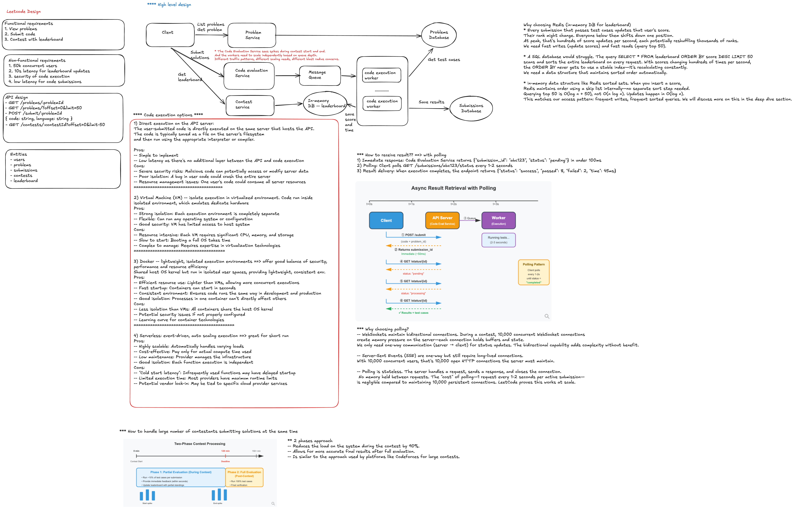

## Problem Context

Design a LeetCode-style platform that supports:

- Online code execution for user submissions
- Real-time contest judging
- Real-time leaderboard updates
- 10k concurrent users during contests
- Strong isolation for untrusted code
- Durable contest state and disaster recovery
- Abuse prevention and security controls

This is a staff-level design discussion, so the goal is not only to describe components, but also to explain trade-offs, failure modes, operational posture, and how engineering, product, security, and operations align around the system.

---

## 1. Executive Summary

At a high level, I would split the system into two critical paths:

1. **Code execution path**
   - Accept user submission
   - Persist submission metadata
   - Enqueue judging job
   - Execute code in an isolated sandbox
   - Produce verdict
   - Persist result
   - Notify user

2. **Leaderboard path**
   - Consume accepted submission events
   - Compute score and penalty
   - Update real-time ranking cache
   - Persist contest scoring state durably
   - Broadcast ranking deltas to clients

The key staff-level principle is:

> The execution system is latency-sensitive, adversarial, and resource-heavy. The leaderboard system is correctness-sensitive, highly visible, and must be recoverable. I would optimize them differently while connecting them through durable events.

---

## 2. High-Level Architecture

```txt
+-------------------+
| Web / Mobile App  |
+---------+---------+
          |
          v
+-------------------+
| API Gateway       |
| Auth / Rate Limit |
+---------+---------+
          |
          v
+-------------------------+
| Submission Service      |
| - Validate request      |
| - Persist submission    |
| - Emit execution job    |
+------+------------------+
       |
       | durable job event
       v
+-------------------------+        +-----------------------+
| Queue / Stream          |------->| Judge Scheduler       |
| Kafka / SQS / PubSub    |        | - Priority queues     |
+-------------------------+        | - Fairness controls   |
                                   | - Backpressure        |
                                   +-----------+-----------+
                                               |
                                               v
                                   +-----------------------+
                                   | Execution Workers     |
                                   | - Sandbox runtime     |
                                   | - Compile / run       |
                                   | - Resource limits     |
                                   +-----------+-----------+
                                               |
                                               v
+-------------------------+        +-----------------------+
| Submission DB           |<-------| Verdict Service       |
| Postgres / MySQL        |        | - Normalize results   |
+-------------------------+        | - Persist verdict     |
                                   | - Emit verdict event  |
                                   +-----------+-----------+
                                               |
                                               v
+-------------------------+        +-----------------------+
| Durable Event Log       |------->| Leaderboard Service   |
| Kafka / Event Store     |        | - Score calculation   |
+-------------------------+        | - Idempotency         |
                                   +-----------+-----------+
                                               |
                      +------------------------+------------------------+
                      |                                                 |
                      v                                                 v
            +-------------------+                           +---------------------+
            | Redis Sorted Sets |                           | Durable Score Store |
            | Real-time rank    |                           | Postgres / DynamoDB |
            +---------+---------+                           +---------------------+
                      |
                      v
            +-------------------+
            | WebSocket / SSE   |
            | Ranking updates   |
            +-------------------+
```

---

## 3. Core Entities

```ts
type Submission = {
  submissionId: string;
  userId: string;
  contestId?: string;
  problemId: string;
  language: string;
  sourceCodeRef: string;
  status:
    | 'PENDING'
    | 'QUEUED'
    | 'RUNNING'
    | 'ACCEPTED'
    | 'WRONG_ANSWER'
    | 'TIME_LIMIT_EXCEEDED'
    | 'RUNTIME_ERROR'
    | 'COMPILE_ERROR'
    | 'SYSTEM_RETRY'
    | 'SYSTEM_FAILED';
  createdAt: number;
  updatedAt: number;
};

type ExecutionJob = {
  jobId: string;
  submissionId: string;
  userId: string;
  contestId?: string;
  problemId: string;
  language: string;
  priority: 'CONTEST_PREMIUM' | 'CONTEST_FREE' | 'NORMAL_PREMIUM' | 'NORMAL_FREE';
  attempt: number;
  timeoutMs: number;
};

type VerdictEvent = {
  eventId: string;
  submissionId: string;
  userId: string;
  contestId?: string;
  problemId: string;
  verdict: string;
  runtimeMs: number;
  memoryBytes: number;
  judgedAt: number;
};

type LeaderboardEntry = {
  contestId: string;
  userId: string;
  solvedCount: number;
  penaltyMs: number;
  lastAcceptedAt: number;
  rank: number;
};
```

---

# 4. SLA Definition and Performance Trade-offs

## Interview Framing

I would not commit to a blanket promise that every submission returns within 5 seconds. Code execution latency depends on language, problem complexity, test size, compile time, cold-start behavior, queue depth, and user code quality.

Instead, I would separate:

- **Platform latency**: queueing, scheduling, sandbox startup, result persistence, notification
- **User code execution latency**: compile time and runtime of the submitted code

The SLA should measure what the platform controls.

---

## SLA I Would Commit To

For normal usage:

| Metric                        |       Target |
| ----------------------------- | -----------: |
| P50 submission result latency |  < 2 seconds |
| P95 submission result latency |  < 5 seconds |
| P99 submission result latency | < 15 seconds |

For contest usage:

| Metric                        |       Target |
| ----------------------------- | -----------: |
| P50 submission result latency |  < 3 seconds |
| P95 submission result latency |  < 8 seconds |
| P99 submission result latency | < 20 seconds |

For product-facing language, I would say:

> Most submissions return in under 5 seconds during contests.

For engineering-facing SLO, I would define:

> During contests, 95% of valid submissions should receive a verdict within 8 seconds, excluding submissions where user code legitimately consumes the full time limit.

This avoids counting correct user-level TLE behavior as infrastructure failure.

---

## Metrics to Track

End-to-end latency should be decomposed into stages:

```txt
client_submit_to_api_ack
api_to_queue_enqueue
queue_wait_time
scheduler_dispatch_time
worker_start_time
sandbox_start_time
compile_time
execution_time
verdict_generation_time
result_persist_time
result_delivery_time
```

The most important derived metric is:

```txt
platform_overhead_latency = total_latency - compile_time - execution_time
```

I would track:

- P50, P95, P99 end-to-end latency
- P50, P95, P99 queue wait time
- Worker utilization
- Sandbox cold-start latency
- Per-language latency distribution
- Per-problem latency distribution
- System retry rate
- User-code timeout rate
- Platform timeout rate
- Verdict error rate
- Leaderboard update latency

---

## Contest vs Normal Usage

Normal usage can use rolling 7-day or 30-day SLO windows.

Contest usage should use:

- Per-contest SLO dashboards
- Real-time burn-rate alerts
- Pre-contest capacity validation
- Post-contest SLA review

Example alert thresholds:

```txt
P95 queue_wait_time > 3s for 5 minutes
worker_available_capacity < 20%
submission_system_error_rate > 2%
timeout_verdict_rate increases 3x above baseline
Redis leaderboard_update_latency > 500ms
queue_depth growing continuously for 10 minutes
```

---

## When the SLA Cannot Be Met

I would avoid converting platform overload into incorrect user-facing verdicts.

Bad user experience:

```txt
Execution Timeout
```

Better user experience:

```txt
Queued
Running
System delayed
Retrying execution
Result delayed due to platform load
```

Submission states should distinguish user failures from platform failures:

```txt
USER_TIME_LIMIT_EXCEEDED
SYSTEM_TIMEOUT
SYSTEM_RETRY
SYSTEM_FAILED
```

This matters because a platform issue should not penalize a contest participant.

---

## Adaptive Resource Allocation and Hill-Climbing

During contests, I would use adaptive capacity management.

Inputs:

```txt
queue_depth
queue_wait_time_p95
worker_cpu_utilization
worker_memory_utilization
sandbox_start_latency
system_error_rate
cost_per_minute
contest_phase
```

Strategy:

1. Start with predicted capacity based on registration count and historical submission rate.
2. During the contest, observe queue wait and worker utilization.
3. Incrementally add workers if queue wait rises above target.
4. Stop scaling when marginal capacity no longer improves latency enough to justify cost.
5. Reduce capacity slowly after the spike to avoid oscillation.

Example hill-climbing policy:

```txt
if P95 queue wait > target and worker utilization > 75%:
  increase worker pool by 10%

if P95 queue wait improves materially:
  continue scaling gradually

if P95 queue wait does not improve:
  investigate downstream bottleneck instead of blindly adding workers

if utilization < 40% for sustained period:
  scale down by 5%
```

The staff-level point is:

> Scaling workers only helps if workers are the bottleneck. If the bottleneck is Redis, database writes, test case fetch, or network IO, adding workers can make the system worse.

---

## Cost Trade-offs

Strict SLA guarantees are expensive because they require overprovisioning for peak traffic.

Trade-offs:

| Choice                 | Benefit                | Cost                        |
| ---------------------- | ---------------------- | --------------------------- |
| Overprovision workers  | Lower latency          | Higher infra cost           |
| Warm sandbox pools     | Faster startup         | Idle resource cost          |
| Per-language pools     | Better predictability  | More operational complexity |
| Premium priority lanes | Better paid experience | Fairness concerns           |
| Aggressive autoscaling | Cost efficient         | Risk of cold-start lag      |
| Strong isolation       | Better security        | Runtime overhead            |

I would deliberately degrade non-core paths before core contest judging.

Degrade first:

- Playground submissions outside contest
- Custom test runs
- Historical submission browsing
- Full leaderboard refresh frequency
- Expensive analytics
- Non-critical notifications

Protect:

- Contest submission acceptance
- Verdict generation
- Durable result persistence
- Leaderboard correctness

---

## Tiered SLA Design

For free users:

- Best-effort normal execution
- Lower priority outside contests
- Stricter rate limits
- Potentially slower custom test execution

For premium users:

- Better queue priority
- More concurrent submissions
- Lower expected queue latency
- More stable playground experience

For contests:

- I would be careful not to let premium priority distort competitive fairness.
- In a ranked contest, all participants should have comparable judging priority.
- Premium benefits can apply outside contests or to non-ranking practice usage.

---

## Organizational Process

Before product markets a 5-second promise, I would require:

1. Load test with contest-like traffic
2. Per-language and per-problem latency analysis
3. Security overhead included in benchmarks
4. Cost model reviewed with infra leadership
5. Error budget defined
6. Incident response playbook ready
7. Product language aligned with actual SLO semantics

The staff-level posture:

> SLAs are not only engineering metrics. They are contracts between product, engineering, infrastructure, support, and finance.

---

# 5. Comprehensive Failure Mode Analysis

## Scenario

Saturday morning contest. 10k participants. Suddenly, 30% of submissions return `execution timeout`, but the code is correct.

This is an incident because the platform may be misclassifying correct solutions.

---

## Failure Modes in the Execution Pipeline

### API Layer

Possible failures:

- API servers overloaded
- Bad deployment increased latency
- Authentication service degraded
- Rate limiter misconfigured
- Request body size or code upload issue

Signals:

```txt
5xx rate
request latency
submission creation failures
rate-limit rejection count
auth latency
```

---

### Queue / Stream

Possible failures:

- Queue depth growing
- Consumer lag increasing
- Partition imbalance
- Duplicate jobs
- Lost jobs
- Poison messages
- Broker throttling

Signals:

```txt
queue_depth
consumer_lag
enqueue_latency
dequeue_latency
oldest_message_age
retry_count
DLQ_count
```

---

### Scheduler

Possible failures:

- Incorrect prioritization
- Starvation of certain languages/problems
- Scheduler stuck on bad partition
- Over-dispatch causing worker overload
- Under-dispatch causing queue buildup

Signals:

```txt
job_dispatch_rate
per-language wait time
per-problem wait time
pending_jobs_by_priority
scheduler_error_rate
```

---

### Worker Pool

Possible failures:

- 20% of workers down
- Worker CPU saturation
- Worker memory pressure
- Disk exhaustion
- Noisy neighbor effects
- Runtime image pull failures
- Container runtime bug
- Sandbox startup regression

Signals:

```txt
worker_healthy_count
worker_cpu
worker_memory
worker_disk_usage
sandbox_start_latency
worker_crash_loop_count
runtime_image_pull_latency
```

---

### Test Case Store

Possible failures:

- Test cases unavailable
- Object store latency spike
- Wrong test case version
- Cache miss storm
- Large test case download bottleneck

Signals:

```txt
test_case_fetch_latency
test_case_fetch_error_rate
cache_hit_rate
object_store_5xx
bytes_downloaded_per_worker
```

---

### Sandbox Runtime

Possible failures:

- CPU quota too low
- Memory limit too low
- Incorrect timeout configuration
- Clock measurement bug
- gVisor/Kata regression
- Seccomp profile too restrictive
- File descriptor limit too low

Signals:

```txt
sandbox_runtime_error_rate
sandbox_timeout_rate
per-language timeout spike
per-problem timeout spike
kernel_or_runtime_error_logs
```

---

### Verdict Service

Possible failures:

- Incorrect verdict normalization
- Timeout classification bug
- Result persistence failure
- Idempotency bug
- Retry incorrectly marked as final

Signals:

```txt
verdict_distribution
system_timeout_vs_user_timeout_ratio
verdict_persist_error_rate
submission_state_transition_errors
```

---

### Database

Possible failures:

- Submission DB slow
- Connection pool exhausted
- Deadlocks
- Replica lag
- Write throttling

Signals:

```txt
db_write_latency
db_connection_pool_usage
db_error_rate
deadlock_count
replica_lag
```

---

## How to Diagnose the 30% Timeout Spike

I would immediately ask:

1. Is the spike isolated to one language?
2. Is it isolated to one problem?
3. Is it isolated to one worker pool or availability zone?
4. Did a deploy happen recently?
5. Did timeout increase while queue wait also increased?
6. Are correct historical accepted solutions now timing out?
7. Are timeouts user-level or system-level?

The fastest diagnostic is to run known-good reference solutions through the same pipeline.

If reference solutions time out, the issue is platform-side.

---

## Incident Response Playbook

### Step 1: Declare incident

- Assign incident commander
- Assign communications lead
- Assign technical investigation owners
- Freeze non-critical deploys

### Step 2: Protect users

- Stop marking suspicious timeouts as final
- Move affected submissions to `SYSTEM_RETRY`
- Disable penalty application for affected submissions
- Show user-facing banner:

```txt
We are investigating delayed or incorrect judging for some submissions. Affected submissions will be rejudged automatically.
```

### Step 3: Reduce blast radius

Depending on diagnosis:

- Drain bad worker pool
- Roll back recent deploy
- Disable problematic runtime version
- Shift traffic to healthy region
- Increase worker capacity
- Increase timeout buffer temporarily for affected language/problem
- Pause leaderboard updates from questionable verdicts

### Step 4: Rejudge

- Identify affected submissions
- Re-run against known-good execution environment
- Recompute leaderboard from durable verdict events
- Publish correction summary

---

## Handling Partial Failures

If 20% of workers are down:

- Remove unhealthy workers from scheduler
- Increase capacity in healthy pools
- Reduce lower-priority traffic
- Continue contest judging
- Increase queue visibility timeout to avoid duplicate work

If queue is slow but functional:

- Reduce enqueue rate from non-contest traffic
- Increase consumers only if downstream can handle it
- Monitor oldest message age
- Avoid unbounded retries

If database is slow:

- Buffer non-critical writes
- Persist critical verdicts to durable event log first
- Degrade historical reads
- Protect write path for contest submissions

---

## Cascading Failure Prevention

A common failure chain:

```txt
DB latency increases
→ workers block on writes
→ queue backs up
→ scheduler dispatches more work
→ worker memory grows
→ workers crash
→ retries increase
→ queue grows faster
→ total outage
```

Prevention:

- Circuit breakers
- Bounded queues
- Retry budgets
- Backpressure from workers to scheduler
- Bulkheads by traffic class
- Per-user and per-contest rate limits
- Separate pools for contest and normal traffic
- Idempotent execution jobs
- DLQ for poison jobs
- Load shedding for non-critical features

---

## Post-Incident Analysis

The postmortem should answer:

- What failed?
- Why did detection not catch it earlier?
- Why did the system return incorrect timeout instead of system retry?
- How many users were affected?
- Was leaderboard correctness impacted?
- What automated guardrail would have prevented it?
- What runbook gap slowed response?
- What test should be added?

Staff-level ownership means converting incidents into system improvements, not just explanations.

---

# 6. Advanced Sandboxing: Application Kernels

## Problem

Security researchers discover a container escape vulnerability. The CISO asks for VM-level isolation. Engineering worries about latency and cost.

This is a classic security vs performance trade-off.

---

## Limitations of Standard Docker Containers

Docker containers are not strong security boundaries by themselves.

Risks include:

- Shared host kernel
- Kernel escape vulnerabilities
- Misconfigured capabilities
- Privileged containers
- Insecure mounts
- Container runtime vulnerabilities
- Namespace isolation bypasses
- Side-channel attacks
- Noisy neighbor issues

For trusted internal workloads, containers may be enough. For arbitrary user-submitted code, the threat model is much harsher.

---

## Isolation Options

| Option          | Isolation   | Startup | Runtime Overhead |    Cost | Use Case                                |
| --------------- | ----------- | ------: | ---------------: | ------: | --------------------------------------- |
| Docker          | Lowest      |    Fast |              Low |     Low | Trusted or low-risk code                |
| gVisor          | Medium-high |  Medium |           Medium |  Medium | Untrusted code needing better isolation |
| Kata Containers | High        |  Slower |      Medium-high |  Higher | VM-backed container workloads           |
| Firecracker VM  | High        |  Medium |           Medium |  Higher | Strong multi-tenant isolation           |
| Full VM         | Highest     | Slowest |          Highest | Highest | Maximum isolation, lower density        |

---

## Why gVisor or Application Kernels

gVisor provides a user-space kernel that intercepts application system calls and reduces direct exposure to the host kernel.

The value proposition:

> It provides stronger isolation than standard containers while preserving a container-like developer and orchestration experience.

It is not equivalent to a full VM, but it reduces the blast radius of container escape vulnerabilities.

---

## When I Would Choose gVisor

I would choose gVisor when:

- Running arbitrary untrusted user code
- Workloads are short-lived
- Stronger isolation is needed than Docker
- Full VM cost is too high
- The platform can tolerate moderate runtime overhead
- The security team needs defense against kernel attack surface exposure

I may use different isolation levels by risk tier:

```txt
Normal practice code: gVisor sandbox
Contest code: gVisor with stricter resource limits
Suspicious users: Firecracker/Kata or quarantine pool
Internal trusted tests: standard containers
```

---

## Defense in Depth

Sandboxing is only one layer.

I would add:

### Runtime restrictions

- No privileged containers
- Read-only root filesystem
- No host mounts
- Dropped Linux capabilities
- Seccomp profiles
- AppArmor / SELinux
- Cgroup CPU and memory limits
- Process count limits
- File descriptor limits
- Disk quota
- Execution timeout

### Network restrictions

- Default deny egress
- No arbitrary outbound internet
- No metadata service access
- No access to internal VPC services
- Separate worker subnet
- Egress proxy only for explicitly allowed operations

### Data restrictions

- Test cases mounted read-only
- Per-submission isolated filesystem
- No shared writable volume
- Test case access audited
- Secrets never mounted into execution environment

### Host and cluster restrictions

- Dedicated node pools for untrusted code
- No co-location with control plane services
- Frequent node recycling
- Runtime patching process
- Image signing and scanning

---

## Security vs Performance Rollout Strategy

I would not flip the whole platform from Docker to gVisor overnight.

Rollout plan:

1. Benchmark representative languages and problems
2. Measure compile and runtime overhead
3. Run shadow execution on gVisor for a subset
4. Enable for low-risk traffic
5. Enable for contests after confidence
6. Keep fallback path for operational rollback
7. Publish risk reduction and cost impact to leadership

Decision metrics:

```txt
sandbox_start_latency_delta
runtime_overhead_by_language
worker_density_change
cost_per_submission
security_risk_reduction
incident_blast_radius_reduction
```

Staff-level framing:

> The decision should not be “security or performance.” The decision should be risk-tiered isolation, measured rollout, and explicit leadership alignment on acceptable residual risk.

---

# 7. State Persistence and Disaster Recovery

## Problem

Redis leaderboard crashes mid-contest. Users appear to lose rankings.

This should never be possible if Redis is treated correctly.

The staff-level principle:

> Redis should be the real-time serving cache, not the source of truth.

---

## What Must Persist

Must persist durably:

- Submission record
- Source code reference
- Verdict event
- Accepted timestamp
- Contest scoring rule version
- User score state
- Leaderboard rebuild checkpoint
- Rejudge events
- Audit log

Can be ephemeral:

- WebSocket connection state
- In-memory leaderboard deltas
- Redis sorted-set cache
- Temporary worker files
- Sandbox-local output
- UI pagination cache

---

## Leaderboard Write Path

```txt
VerdictEvent(ACCEPTED)
  → durable event log
  → leaderboard consumer
  → idempotency check
  → durable score store update
  → Redis sorted set update
  → WebSocket delta broadcast
```

I would persist the scoring update before or atomically with the cache update.

A practical approach:

1. Verdict event is written to Kafka or event store.
2. Leaderboard consumer updates durable score table.
3. Consumer updates Redis sorted set.
4. If Redis fails, durable score state remains correct.
5. Redis can be rebuilt from durable score table or event log.

---

## Redis Data Model

Use sorted sets:

```txt
ZSET contest:{contestId}:leaderboard
score = encoded ranking score
member = userId
```

Because Redis sorted sets rank ascending by score, encode ranking so better users sort first.

Example:

```txt
rankScore = -solvedCount * LARGE_CONSTANT + penaltyMs
```

Or store score dimensions separately and use application-level ranking for complex tie-breakers.

Additional Redis keys:

```txt
HASH contest:{contestId}:user:{userId}:score
SET contest:{contestId}:solved:{problemId}
STREAM contest:{contestId}:ranking_deltas
```

---

## Durable Score Store

A relational model:

```sql
contest_scores(
  contest_id,
  user_id,
  solved_count,
  penalty_ms,
  last_accepted_at,
  version,
  updated_at,
  primary key (contest_id, user_id)
)

contest_problem_solves(
  contest_id,
  problem_id,
  user_id,
  first_accepted_submission_id,
  accepted_at,
  penalty_ms,
  primary key (contest_id, problem_id, user_id)
)
```

The `contest_problem_solves` table is critical because score updates must be idempotent. A user should not get duplicate credit for multiple accepted submissions on the same problem.

---

## Recovery Strategies

### Option 1: Redis persistence

Redis RDB:

- Periodic snapshots
- Lower write overhead
- Possible data loss between snapshots

Redis AOF:

- Append-only operation log
- Better durability
- Higher write overhead
- Larger files
- Slower recovery depending on size

For contests, I would not rely only on Redis persistence. I would use Redis persistence as a secondary recovery layer, not the source of truth.

---

### Option 2: Rebuild from durable score table

Fastest recovery:

```txt
Read contest_scores
→ bulk load Redis sorted set
→ resume leaderboard serving
```

This works if the durable score table is continuously updated.

---

### Option 3: Rebuild from submission history or verdict events

Most correct recovery:

```txt
Read all accepted verdicts for contest
→ apply contest scoring rules
→ deduplicate first accepted problem solve per user
→ recompute score
→ rebuild Redis
```

This is slower but useful for audits, rejudging, and correcting scoring bugs.

---

## Disaster Recovery Plan

If Redis fails mid-contest:

1. Mark leaderboard as temporarily stale in UI.
2. Continue accepting submissions.
3. Continue persisting verdicts and score updates durably.
4. Promote Redis replica or create new Redis instance.
5. Rebuild cache from durable score store.
6. Resume WebSocket updates.
7. Run consistency check against verdict log.

User-facing message:

```txt
Submissions are still being judged. Leaderboard updates may be delayed while we recover ranking display.
```

This protects trust because users know their submissions are not lost.

---

## Testing DR

I would run:

- Game day exercises before major contests
- Redis failover tests in staging
- Shadow rebuild jobs during production contests
- Consistency checks between Redis and durable store
- Replay tests from historical contests
- Chaos testing on worker pools and queues

Example invariant checks:

```txt
Redis top 100 == durable store top 100
contest_scores solved_count == count(contest_problem_solves)
all accepted verdicts have corresponding score update
no duplicate accepted score per user/problem
```

---

# 8. Security Risk Deep Dive

## Threat Model

The system runs arbitrary code from potentially malicious users.

Attack goals include:

- Mine cryptocurrency
- Run fork bombs
- Exhaust CPU or memory
- Fill disk
- Exfiltrate hidden test cases
- Attack internal services
- Launch DDoS from worker IPs
- Escape sandbox
- Steal secrets
- Infer other users' solutions
- Abuse contest fairness

---

## Resource Abuse Prevention

### CPU mining

Controls:

- CPU quota per submission
- Wall-clock timeout
- Per-user submission rate limit
- Queue budget per user
- Suspicious workload detection
- No long-running background processes

### Memory bombs

Controls:

- Cgroup memory limit
- OOM kill handling
- Verdict maps to memory limit exceeded
- Per-language memory policies

### Fork bombs

Controls:

- PID limit
- Process creation limits
- Seccomp restrictions
- No privileged execution

### Disk exhaustion

Controls:

- Ephemeral per-submission filesystem
- Disk quota
- Output size limit
- Log size limit
- Cleanup after execution

---

## Preventing Data Exfiltration

Hidden test cases are valuable. The platform must prevent users from reading or transmitting them.

Controls:

- Mount test cases read-only
- Inject test input through controlled runner, not exposed files when possible
- No outbound network from sandbox
- No access to object store credentials
- No environment secrets
- Per-submission isolated filesystem
- Output truncation
- Audit test case access
- Rotate test case storage paths

Important nuance:

> You cannot fully prevent users from inferring some test case properties through verdict feedback. You can reduce leakage with limited feedback, randomized tests, and careful output policies.

For contests, I may limit detailed failed test feedback:

```txt
Wrong Answer
Runtime Error
Time Limit Exceeded
```

instead of showing hidden test inputs.

---

## Network-Level Protections

Workers should not become a DDoS platform.

Controls:

- Default deny outbound traffic
- No public internet egress from execution sandbox
- Egress firewall
- No internal service access
- Block cloud metadata IP
- Separate VPC / subnet for untrusted execution
- NAT-level rate limits
- IDS / eBPF monitoring
- DNS disabled or controlled

If some problems require network access, I would run those in a separate high-risk pool with explicit allowlists.

---

## Lateral Movement Prevention

Controls:

- Dedicated untrusted worker cluster
- No production database credentials on workers
- Short-lived credentials only for control plane, not sandbox
- Strong IAM boundaries
- Separate node pools
- No shared host paths
- No Kubernetes service account token mounted into sandbox
- Read-only runtime images
- Frequent node rotation

---

## Anomaly Detection

Track:

```txt
cpu_seconds_per_user
memory_peak_per_submission
fork_count
network_attempt_count
file_write_bytes
stdout_bytes
stderr_bytes
submission_rate
compile_error_rate
runtime_error_rate
sandbox_violation_count
```

Suspicious patterns:

- Many high-CPU submissions from one account
- Repeated near-timeout executions
- Attempts to open network sockets
- Attempts to read system paths
- Very large output
- High process creation count
- Same source submitted across many accounts

Actions:

- Throttle user
- Require CAPTCHA or additional verification
- Move to quarantine pool
- Block submission temporarily
- Alert security team

---

## Rate Limiting and Abuse Prevention

Use layered rate limits:

```txt
per-user submissions per minute
per-IP submissions per minute
per-contest submissions per user
per-language compile budget
per-account-age limit
per-risk-score limit
```

For contests, rate limits must balance abuse prevention and legitimate retry behavior.

Example:

```txt
Free practice: 10 submissions / minute
Premium practice: 30 submissions / minute
Contest: problem-specific and user-specific fair-use limit
Suspicious account: dynamic lower limit
```

---

## Privacy Considerations

Security monitoring should avoid collecting more source code or personal data than necessary.

Principles:

- Minimize raw code access in logs
- Store hashes or metadata where possible
- Restrict source code access to authorized debugging paths
- Redact secrets accidentally submitted by users
- Define retention policies
- Separate abuse signals from personal identity when possible
- Ensure legal review for automated account enforcement

---

## Cross-Functional Collaboration

This system requires alignment across:

### Engineering

- Execution platform
- Leaderboard correctness
- Observability
- Incident response
- Capacity planning

### Security

- Threat modeling
- Sandbox hardening
- Vulnerability response
- Penetration testing
- Abuse detection

### Product

- SLA wording
- Contest fairness
- User communication
- Premium tier behavior

### Legal / Trust and Safety

- Abuse policy
- Data retention
- User enforcement
- Responsible disclosure

### Operations

- On-call runbooks
- Game days
- Contest readiness reviews
- Post-incident process

Staff-level point:

> Security for untrusted execution is not a single technical feature. It is an operating model involving architecture, monitoring, incident response, policy, and continuous review.

---

# 9. Contest Readiness Review

Before a major contest, I would require a readiness checklist.

## Capacity

- Expected users
- Expected peak submissions per second
- Worker warm pool size
- Queue capacity
- Redis capacity
- Database write capacity
- WebSocket fanout capacity

## Correctness

- Scoring rules validated
- Rejudge process tested
- Leaderboard rebuild tested
- Idempotency checks passing
- Tie-breaker logic verified

## Security

- Sandbox image patched
- Runtime CVEs reviewed
- Network egress blocked
- Worker pool isolated
- Abuse thresholds configured

## Operations

- On-call assigned
- Incident commander assigned
- Rollback plan ready
- Dashboards linked
- Alerts tested
- Support macros prepared

## Product Communication

- Status page prepared
- User-facing degraded-state messages ready
- Contest delay policy defined
- Rejudge policy defined

---

# 10. Interview Summary Answer

If I had to summarize the design in an interview, I would say:

> I would design code execution and leaderboard as two separate but connected systems. The execution path is optimized for secure, low-latency judging of untrusted code using isolated workers, durable queues, resource controls, and strong observability. The leaderboard path is optimized for correctness and recoverability, using Redis only as a real-time serving cache while durable verdict events and score tables remain the source of truth.
>
> For SLA, I would not promise every result in 5 seconds. I would commit to percentile-based SLOs, such as P95 under 8 seconds during contests, excluding legitimate user-code timeouts. I would measure every stage of the pipeline, use adaptive scaling based on queue wait and worker utilization, and degrade non-critical paths before contest judging.
>
> For failure handling, I would distinguish user timeout from system timeout, retry platform failures, prevent cascading failures with backpressure and circuit breakers, and use incident playbooks that protect users from incorrect verdicts. For sandboxing, I would move beyond plain Docker for untrusted code, likely using gVisor or VM-backed isolation based on risk tier, combined with defense-in-depth controls.
>
> For leaderboard disaster recovery, Redis should never be the source of truth. Accepted verdicts and score updates should be durably persisted so Redis can be rebuilt mid-contest. Finally, because this platform is adversarial, I would invest heavily in abuse prevention, network isolation, anomaly detection, and cross-functional security operations.

---

# 11. Common Follow-Up Questions and Strong Answers

## Why not just use Kubernetes jobs for every submission?

Kubernetes jobs are simple but can be too slow and expensive for high-frequency contest judging. I would prefer a long-running worker pool with pre-warmed sandboxes or lightweight task execution. Kubernetes can still manage the worker fleet, but the hot path should avoid creating a full Kubernetes job per submission if latency matters.

---

## Why use Redis for leaderboard if it can fail?

Redis is excellent for low-latency ranking operations, especially sorted sets. But I would treat Redis as a derived serving layer. The source of truth should be durable verdict events and a persistent score table. If Redis fails, we rebuild it.

---

## How do you make leaderboard updates idempotent?

The key is to model first accepted solve per user/problem:

```txt
primary key = contestId + problemId + userId
```

If the user submits accepted code multiple times for the same problem, only the first accepted submission should update score. Later accepted submissions should not double-count.

---

## How do you avoid unfair judging during traffic spikes?

I would separate contest and non-contest queues. During a contest, all ranked participants should get similar priority. I would degrade playground and non-contest traffic first. I would also avoid premium priority inside ranked contests unless the contest rules explicitly allow it.

---

## How do you recover from incorrect verdicts?

I would preserve all submissions and verdict events. If a platform issue caused incorrect verdicts, I would identify the affected time window, affected worker pool, language, or problem, mark those submissions for rejudge, recompute scores from durable events, and publish corrected leaderboard results.

---

## How do you prevent test case theft?

I would avoid exposing hidden tests directly as files where possible. The runner should control test input injection. Sandboxes should have no outbound network, no secrets, no object-store credentials, isolated filesystems, and strict output limits. I would also avoid showing hidden test details in contest feedback.

---

## What is the deepest trade-off in this system?

The deepest trade-off is:

```txt
latency vs isolation vs cost vs fairness
```

- Stronger isolation increases overhead.
- Lower latency requires warm capacity.
- Warm capacity costs more.
- Prioritization improves some user experience but can affect fairness.
- More detailed feedback improves learning but increases test leakage risk.

A staff engineer should make these trade-offs explicit and align them with product and business priorities.
