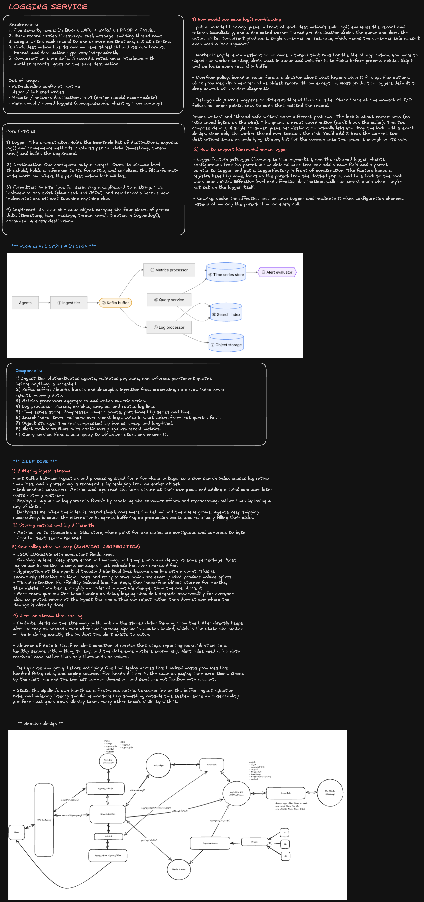

> **Editable diagram:** [Open in Excalidraw](https://excalidraw.com/#room=72359ed043c1dacba63b,ybUaGYukakPR4LAQZZkqAQ)



# Distributed Logging Service

## 0. Interview Framing

> Design a distributed logging service that supports **wildcard querying** and **custom aggregations at 1-minute granularity**, scaling to **1M+ events/sec**.

Three requirements shape the whole architecture, and they pull in different directions:

- **1M+ events/sec ingest** means the write path must be append-only, horizontally partitioned, and never block on slow downstream consumers.
- **Wildcard querying** (`service:payments* AND level:ERROR AND message:*timeout*`) means logs need an inverted/text index — a plain object store or time-series DB cannot answer this efficiently.
- **Custom aggregations at 1-minute granularity** (arbitrary count/sum/percentile roll-ups grouped by arbitrary tags) means numeric data needs its own compact, pre-aggregated time-series representation — re-scanning raw log text for every aggregation query does not scale.

The key architectural decision: **logs and metrics are stored differently**, fed by the same durable ingest stream, so each read path (full-text search vs. numeric aggregation) is served by the storage engine actually suited for it.

---

## 1. Requirements

### Functional

1. Emit structured log records — five severity levels: `DEBUG < INFO < WARN < ERROR < FATAL`.
2. Each record carries `timestamp`, `level`, `message`, `service`/`emitting thread`, and arbitrary key-value tags.
3. Support **wildcard search** over log fields and message text (`service:payments*`, `*timeout*`).
4. Support **custom aggregations** (count, sum, avg, percentiles) at **1-minute granularity**, grouped by arbitrary tag combinations, defined at query time.
5. Support alerting on aggregated metrics computed from the live stream.
6. Support tiered retention: hot indexed logs for days, cheap cold storage for months.

### Non-functional

| Requirement       | Target                                                                                                                 |
| ----------------- | ---------------------------------------------------------------------------------------------------------------------- |
| Ingest throughput | **1M+ events/sec** sustained, with burst headroom.                                                                     |
| Ingest durability | No acknowledged event is lost, even if downstream indexing/aggregation lags or fails.                                  |
| Buffering window  | Durable buffer sized for a multi-hour outage (e.g. 4 hours) of any downstream consumer.                                |
| Query latency     | Wildcard search: low seconds over recent hot data. Aggregation query: sub-second over pre-aggregated 1-minute buckets. |
| Isolation         | Per-tenant quotas so one noisy team cannot degrade ingestion or query latency for others.                              |
| Backpressure      | Ingest tier must reject/shed load before the pipeline falls over — never silently drop after acceptance.               |

### Back-of-the-envelope

```text
Assume average log record ≈ 500 bytes (message + fields + metadata).

Raw ingest bandwidth:
  1,000,000 events/sec * 500 bytes = 500 MB/sec

Raw ingest per day:
  500 MB/sec * 86,400 sec ≈ 43 TB/day

With ~5x compression in the durable buffer and object storage:
  ≈ 8.6 TB/day compressed

4-hour durable buffer capacity needed:
  500 MB/sec * 14,400 sec = 7.2 TB (uncompressed) held in the buffer at once

Kafka-style partition sizing (≈10 MB/sec sustained write per partition):
  500 MB/sec / 10 MB/sec ≈ 50 partitions minimum
  → provision several hundred partitions for headroom, per-tenant isolation,
    and parallel consumer scaling.
```

These numbers justify two decisions used throughout the design: a Kafka-style durable log as the ingest buffer (not a queue that drops on overflow), and partitioning by tenant/service so no single hot key bottlenecks a partition.

---

## 2. High-Level Architecture

```text
Agents
  |
  v
① Ingest tier
  |
  v
② Kafka buffer  (durable, partitioned, replayable)
  |
  +-----------------------------+
  |                             |
  v                             v
③ Metrics processor       ④ Log processor
  |                             |
  v                       +-----+-----+
⑤ Time series store       v           v
  |                  ⑥ Search    ⑦ Object
  v                     index      storage
⑧ Alert evaluator            \       /
                               \     /
                                v   v
                          ⑨ Query service
                                |
                                v
                             Clients
```

### Components

1. **Ingest tier** — authenticates agents, validates payloads, and enforces per-tenant quotas before anything is accepted.
2. **Kafka buffer** — absorbs bursts and decouples ingestion from processing, so a slow indexer never rejects incoming data.
3. **Metrics processor** — aggregates numeric series and writes 1-minute buckets.
4. **Log processor** — parses, enriches, samples, and routes log lines to the search index and cold storage.
5. **Time series store** — compressed numeric points, partitioned by series and time.
6. **Search index** — inverted index over recent logs; what makes wildcard/free-text queries fast.
7. **Object storage** — raw compressed log bodies, cheap and long-lived.
8. **Alert evaluator** — runs rules continuously against recent metrics.
9. **Query service** — fans a user query out to whichever store can answer it (time series store for aggregations, search index for wildcard search, object storage for cold raw-log retrieval).

Both consumer groups (metrics processor, log processor) read the **same** Kafka stream independently, at their own pace — adding a third consumer later (e.g. a real-time anomaly detector) costs nothing upstream.

---

## 3. Client-Side Logging Library

Before events reach the network, the client SDK has its own design problem: never block application code, and support hierarchical configuration.

### Core entities

```ts
// The orchestrator. Holds the immutable list of destinations, exposes log()
// and convenience methods, captures per-call data (timestamp, thread name),
// and builds the LogRecord.
interface Logger {
  name: string;
  parent: Logger | null;
  destinations: Destination[];
  effectiveLevel: Level; // cached; invalidated on config change
  log(level: Level, message: string, fields?: Record<string, unknown>): void;
}

// One configured output target. Owns its minimum level threshold, holds a
// reference to its formatter, and serializes the filter -> format -> write
// workflow. Where the per-destination lock lives.
interface Destination {
  minLevel: Level;
  formatter: Formatter;
  write(line: string): void;
}

// Serializes a LogRecord to a string. Plain-text and JSON implementations
// exist today; new formats become new implementations without touching
// anything else.
interface Formatter {
  format(record: LogRecord): string;
}

// Immutable value object carrying the four pieces of per-call data
// (timestamp, level, message, thread name). Created in Logger.log(),
// consumed by every destination.
type LogRecord = {
  timestamp: number;
  level: Level;
  message: string;
  threadName: string;
  fields: Record<string, unknown>;
};
```

Concurrent calls are safe: a record's bytes never interleave with another record's bytes on the same destination.

### 3.1 How to make `log()` non-blocking

- Put a **bounded blocking queue** in front of each destination's sink. `log()` enqueues the record and returns immediately; a dedicated worker thread per destination drains the queue and does the actual write. This is concurrent producers, single consumer per resource — the consumer side doesn't even need a lock.
- **Worker lifecycle:** each destination owns a thread that runs for the life of the application. Signal the worker to stop, drain what's in the queue, and wait for it to finish before the process exits, or you lose the last events.
- **Overflow policy:** a bounded queue forces a decision about what happens when it fills up. Options: block the producer, drop the newest record, throw an exception, or fall back to synchronous `stderr` diagnostics. Most production loggers default to **drop and count**, not block.
- **Debuggability:** writes now happen on a different thread than the call site, so a stack trace at I/O failure time no longer points back to the code that emitted the record — capture the caller's stack at enqueue time if that matters.

`async writes` and `thread-safe writes` solve _different_ problems. The lock is about correctness (no interleaved bytes on the wire); the queue is about coordination (don't block the caller). They compose cleanly: a single-consumer queue per destination lets you drop the lock entirely in this design, since only the worker thread ever touches the underlying stream.

### 3.2 How to support hierarchical named loggers

- `LoggerFactory.getLogger("com.app.service.payments")` returns a logger that inherits configuration from its parent in the dotted-name tree — add a `parent` pointer, and put a `LoggerFactory` in front of construction. The factory keeps a registry keyed by name, looks up the parent from the dotted prefix, and falls back to the root when none exists.
- Effective level and effective destinations walk the parent chain when they're not set on the logger itself.
- **Caching:** cache the effective level on each logger and invalidate it when configuration changes, instead of walking the parent chain on every call — this keeps the hot path (`log()`) O(1).

---

## 4. Deep Dive: Buffering the Ingest Stream

Put Kafka between ingestion and processing, sized for a multi-hour outage, so a slow search index causes **lag, not loss**.

- **Independent consumers.** Metrics and logs read the same stream at their own pace; adding a third consumer later costs nothing upstream.
- **Replay.** A bug in the log parser is fixable by resetting the consumer offset and reprocessing, rather than by losing a day of data.
- **Backpressure.** When the index is overwhelmed, consumers fall behind and the queue grows. Agents keep shipping successfully, because the alternative — agents buffering on production hosts and eventually filling their local disks — is worse.

```text
Kafka topic, partitioned by (tenant, service)
        |
        +--> consumer group: metrics-processor  (own offset, own pace)
        +--> consumer group: log-processor       (own offset, own pace)
        +--> consumer group: anomaly-detector     (added later, free)
```

---

## 5. Deep Dive: Storing Metrics and Logs Differently

| Data            | Store                         | Why                                                                                            |
| --------------- | ----------------------------- | ---------------------------------------------------------------------------------------------- |
| Numeric metrics | Time-series store             | Points for one series are contiguous on disk and compress to ~1 byte/point.                    |
| Log text        | Search index + object storage | Full-text/wildcard search requires an inverted index; raw bodies are cheapest in blob storage. |

Trying to force both into one engine either makes aggregation slow (scanning text to compute a percentile) or makes search slow (no inverted index over a columnar time-series format). Splitting them is what lets each read path hit its latency target.

---

## 6. Deep Dive: Wildcard Query Support

Wildcard queries come in three shapes, and they are **not equally cheap**:

```text
service:payments*     trailing wildcard (prefix match)   — cheap
service:*payments      leading wildcard (suffix match)    — expensive
message:*timeout*      infix wildcard (substring match)   — expensive
```

### Trailing wildcards — prefix match

A **trie** or a sorted term dictionary (as used by an inverted index like Lucene) answers `payments*` with a single range scan: all terms starting with `payments`, up to the next term that doesn't share that prefix. This is fast and is the common case for field-based queries (`service:`, `host:`, `env:`).

### Leading/infix wildcards — substring match

`*payments` or `*timeout*` cannot use a prefix range scan directly. Two practical approaches:

1. **N-gram (trigram) indexing.** Index every 3-character substring of each token. A substring query becomes an intersection of trigram postings lists, then a verification pass. This is what tools like grep-over-index (e.g. Elasticsearch's `ngram` analyzer, or a trigram index like PostgreSQL's `pg_trgm`) do. Trade-off: larger index (every token expands into many trigrams).
2. **Reverse index for suffix queries.** Store each token reversed as well, so `*payments` becomes a prefix query `stnemyap*` against the reversed index.

### Design recommendation

- Tokenize log messages and structured fields at ingest time in the **log processor**, and write postings to the **search index** (component ⑥).
- Support cheap trailing-wildcard and exact-match queries on all fields by default.
- Enable trigram indexing only on fields explicitly marked full-text-searchable (e.g. `message`), not on every high-cardinality field — this bounds index size.
- Reject or rate-limit unconstrained leading-wildcard queries with no other filter (`*error*` with no time range or service filter) since they force a full index scan; require a time range and at least one prefix-filterable field on every query.

---

## 7. Deep Dive: Custom Aggregations at 1-Minute Granularity

### Bucketing

The metrics processor consumes the same Kafka stream and maintains a streaming aggregation keyed by `(metric_name, tag_set, minute_bucket)`:

```ts
type MetricPoint = {
  metricName: string;
  tags: Record<string, string>; // e.g. { service: 'payments', region: 'us-east-1' }
  minuteBucket: number; // epoch minute, floor(timestamp / 60000)
  count: number;
  sum: number;
  digest: TDigestSummary; // approximate percentile structure (p50/p95/p99)
};
```

```text
event arrives with timestamp T
        |
        v
minuteBucket = floor(T / 60_000)
        |
        v
accumulate into in-memory aggregate for (metric, tags, minuteBucket)
        |
        v
on window close (bucket_end + allowed lateness):
        |
        v
flush aggregate to Time Series Store, keyed by minuteBucket
```

### Handling "custom"

"Custom aggregation" means the **grouping and function are chosen at query time**, not baked into the ingest pipeline. Two complementary strategies:

1. **Pre-aggregate on common dimensions** the platform knows about ahead of time (service, host, level, status code) into 1-minute buckets — this covers the majority of dashboards and alerts cheaply.
2. **Allow query-time re-aggregation across pre-aggregated buckets** for anything not covered — sum multiple series' 1-minute buckets together, or merge t-digest summaries across a wider time range for a percentile over an hour instead of a minute. Digests merge losslessly-enough for practical percentile accuracy, so you don't need raw points to answer "p99 latency for `service:payments` over the last hour."
3. For truly ad hoc group-bys on dimensions with unbounded cardinality (e.g. `user_id`), fall back to sampling or route the query to scan raw logs in object storage — flag this path as slower in the query API.

### Watermarks and late data

```text
window [12:00:00, 12:01:00)
        |
allowed lateness: 30s
        |
window closes and flushes at 12:01:30
        |
events with timestamp in [12:00:00,12:01:00) arriving after 12:01:30
  -> either dropped (with a late-event counter incremented)
  -> or merged into a correction bucket, depending on product requirement
```

### Percentiles at scale

Exact percentiles require sorting or holding all raw values — infeasible at 1M events/sec. Use an approximate structure per bucket (**t-digest** or **HDR histogram**), which:

- Merges cheaply across buckets (combine 60 one-minute digests into an hourly percentile).
- Bounds memory regardless of event volume.
- Trades a small, well-understood error margin for tractable compute.

---

## 8. Deep Dive: Controlling What We Keep

At 1M+ events/sec, storing everything forever is not a cost decision the business will accept.

- **Structured logging with consistent field names.** JSON logging with stable field names, not free-form text, is what makes wildcard field queries and aggregation grouping possible at all.
- **Sampling by level.** Keep every `ERROR`/`WARN`, and sample `INFO`/`DEBUG` at some percentage. Most log volume is routine success messages nobody has ever searched for.
- **Aggregation at the agent.** A thousand identical lines become one line with a count. This is enormously effective against tight loops and retry storms, which are exactly what produce volume spikes.
- **Tiered retention.** Full-fidelity indexed logs for days, then index-free object storage for months, then delete. Each tier is roughly an order of magnitude cheaper than the one above it.
- **Per-tenant quotas.** One team turning on debug logging shouldn't degrade observability for everyone else, so quotas belong at the ingest tier where they can reject rather than downstream where the damage is already done.

```text
Hot tier   (indexed, searchable)      0–7 days     most expensive
Warm tier  (compressed, object store) 7–90 days    cheap
Cold tier  (archival)                 90+ days     cheapest, retrieval-on-demand
```

---

## 9. Deep Dive: Alerting on a Stream That Can Lag

- **Evaluate alerts on the streaming path, not on the stored data.** Reading from the buffer directly keeps alert latency at seconds even when the indexing pipeline is minutes behind — which is exactly the state the system will be in during the incident the alert exists to catch.
- **Absence of data is itself an alert condition.** A service that stops reporting looks identical to a healthy service with nothing to say, and the difference matters enormously. Alert rules need a "no data received" case, not just threshold-on-value checks.
- **Deduplicate and group before notifying.** One bad deploy across five hundred hosts produces five hundred firing rules; paging someone five hundred times is the same as paging them zero times. Group by the alert rule and the smallest common dimension, and send one notification with a count.
- **State the pipeline's own health as a first-class metric.** Consumer lag on the buffer, ingest rejection rate, and indexing latency should be monitored by something outside this system — an observability platform that goes down silently takes every other team's visibility with it.

---

## 10. Query Service API

```http
POST /v1/logs/search
Content-Type: application/json

{
  "query": "service:payments* AND level:ERROR AND message:*timeout*",
  "timeRange": { "from": "2026-08-21T00:00:00Z", "to": "2026-08-21T01:00:00Z" },
  "limit": 100
}
```

```http
POST /v1/metrics/aggregate
Content-Type: application/json

{
  "metric": "request_latency_ms",
  "aggregation": "p99",
  "groupBy": ["service", "region"],
  "granularity": "1m",
  "timeRange": { "from": "2026-08-21T00:00:00Z", "to": "2026-08-21T01:00:00Z" }
}
```

The query service inspects the request and routes it: a `search` request with wildcard terms goes to the search index; an `aggregate` request resolves against pre-aggregated buckets in the time series store, falling back to a flagged slow path over object storage only when the grouping dimension wasn't pre-aggregated.

---

## 11. Failure Modes and Mitigations

| Failure                                   | Mitigation                                                                                         |
| ----------------------------------------- | -------------------------------------------------------------------------------------------------- |
| Downstream indexer falls behind           | Kafka buffer absorbs lag; agents keep shipping; alerting reads the stream directly, unaffected.    |
| Ingest tier overloaded                    | Reject at the edge with per-tenant quotas rather than accepting and dropping silently later.       |
| Unbounded leading-wildcard query          | Require a time range + at least one prefix-filterable field; rate-limit full-scan queries.         |
| High-cardinality group-by blows up memory | Cap pre-aggregation dimensions; route unbounded-cardinality queries to a flagged slow path.        |
| Late-arriving events after window close   | Bounded allowed-lateness window; late events counted separately rather than silently dropped.      |
| Hot key / noisy tenant                    | Partition by `(tenant, service)`; per-tenant ingest quotas enforced before the Kafka buffer.       |
| Search index or time series store outage  | Kafka retention covers the outage window; consumers replay from last committed offset on recovery. |

---

## 12. Example Verbal Answer

> I'd split this into a write path and two read paths. The write path is a durable, partitioned log — Kafka-style — sized to absorb several hours of outage from any downstream consumer, so a slow index causes lag, not data loss. Two independent consumer groups read that same stream: a log processor that tokenizes and writes to an inverted search index plus cheap object storage, and a metrics processor that buckets numeric values into 1-minute windows keyed by metric name and tag set.
>
> For wildcard queries, trailing wildcards are cheap prefix scans against a term dictionary; leading and infix wildcards need trigram indexing, which I'd enable selectively on full-text fields rather than everywhere, and I'd require a time range plus one prefix-filterable field on any query to avoid unconstrained full scans.
>
> For custom aggregations, I pre-aggregate the common dimensions into 1-minute buckets using approximate structures like t-digest for percentiles, since exact percentiles don't scale at this volume. Query-time aggregation merges those buckets across a wider window or across pre-aggregated dimensions; truly unbounded-cardinality group-bys fall back to a flagged slower path over raw data instead of blowing up memory in the hot path.
>
> At 1M+ events/sec, the two things that make or break this are backpressure and cost control: reject at the edge with per-tenant quotas rather than dropping silently downstream, and aggressively tier retention — indexed for days, cold object storage for months — because full-fidelity storage of everything forever is not economically viable at this scale.

---

## 13. Diagram

The accompanying whiteboard (`logging-service.png`) captures two passes at this design:

- The primary design: client-side `Logger`/`Destination`/`Formatter` entities, the non-blocking `log()` deep dive, hierarchical logger configuration, the 9-component ingest/processing/query pipeline, and the buffering/storage/retention/alerting deep dives above.
- An alternate exploration of the same problem with a slightly different service topology, kept for comparison.
