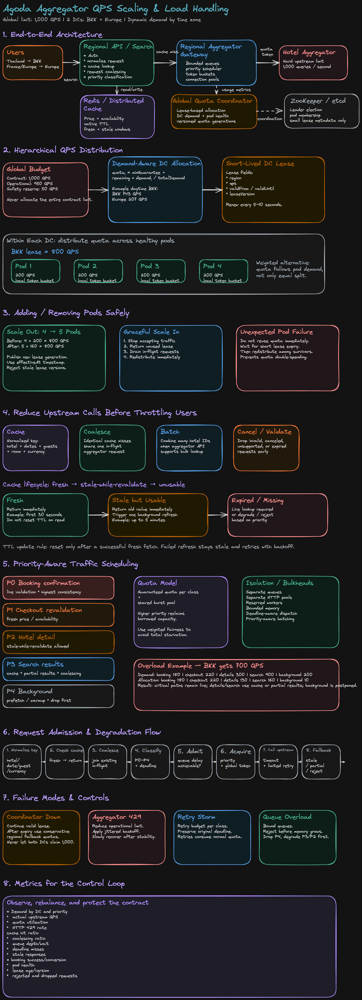

---

## Problem Statement

Agoda interfaces with **aggregators** — companies that hold contracts with hotels to resell room inventory. Agoda queries an aggregator's API to fetch prices and availability, but the aggregator enforces a **global rate limit**: only **1,000 QPS** total, across all of Agoda's infrastructure worldwide.

### Given

1. One aggregator, global limit = **1,000 QPS**
2. Two data centers: **BKK** (Bangkok) and **EUROPE**
3. Each DC runs **4 pods** (servers) that call the aggregator
4. Users are geo-routed to their nearest DC (Thailand → BKK, France → Europe)
5. Traffic follows a **diurnal cycle** — when Bangkok is in daytime peak, Europe is in low-traffic nighttime, and vice versa

### Questions to Answer

1. How do you distribute the shared 1,000 QPS between the two data centers?
2. How do you distribute a DC's share among its pods?
3. What happens when a pod is added or removed?

---

## Why Naive Approaches Fail

### Naive 1: Static Split (500 QPS BKK / 500 QPS Europe)

```
Fixed: BKK = 500 QPS, Europe = 500 QPS
```

**Fails because:** Traffic is diurnal. At Bangkok's lunch-hour peak, BKK might need 800 QPS while Europe (asleep) needs only 50 QPS. A static split wastes 450 QPS of unused Europe capacity while BKK is rate-limited and dropping requests.

### Naive 2: Static Per-Pod Quota (1000 / 8 pods = 125 QPS/pod)

```
Fixed: every pod gets 125 QPS regardless of DC or load
```

**Fails because:** Doesn't account for DC-level demand skew, and breaks immediately when pods scale up/down — recomputing a global fixed share requires synchronous coordination across all 8+ pods on every scaling event, which is slow and fragile.

### Naive 3: Let Every Pod Race for the Limit (No Coordination)

```
Every pod independently calls the aggregator with no shared bookkeeping
```

**Fails because:** No pod knows what any other pod is doing. Total QPS across 8 pods could easily exceed 1,000, causing the aggregator to throttle or ban Agoda entirely. This is the failure mode we must design against.

---

## Core Design: Hierarchical, Leased, Versioned Quota Distribution

Model the aggregator's 1,000 QPS as a **global resource** distributed through a hierarchy of **short-lived leases** — not permanent static assignments. Each layer only needs to trust the layer above it; no pod needs global visibility.

```
┌─────────────────────────────────────────────────────────────┐
│                  Global Quota Coordinator                   │
│         (owns the full 1,000 QPS budget for the aggregator) │
└──────────────────────┬────────────────────────────────────┬─┘
                        │ lease (versioned, TTL)             │ lease
                        ▼                                     ▼
              ┌──────────────────┐                 ┌──────────────────┐
              │   BKK DC Manager  │                 │  Europe DC Manager│
              │   (holds DC lease)│                 │  (holds DC lease) │
              └─────────┬────────┘                 └─────────┬────────┘
                        │ sub-lease per pod                    │ sub-lease per pod
           ┌────────────┼────────────┐              ┌──────────┼──────────┐
           ▼            ▼            ▼              ▼          ▼          ▼
        Pod 1        Pod 2        Pod 3          Pod 1      Pod 2      Pod 3
     (token bucket)(token bucket)(token bucket)(token bucket)(token bucket)(token bucket)
```

### Three Layers

| Layer                  | Responsibility                                                        | Enforcement Mechanism                              |
| ---------------------- | --------------------------------------------------------------------- | -------------------------------------------------- |
| **Global Coordinator** | Splits 1,000 QPS across DCs based on smoothed demand + safety reserve | Issues versioned DC leases with TTL                |
| **DC Manager**         | Splits its DC's lease across healthy pods                             | Issues versioned pod sub-leases with TTL           |
| **Pod**                | Enforces its own allocation locally                                   | Token bucket rate limiter, refilled at leased rate |

**Key principle:** Coordination happens at lease-renewal time (every few seconds), not per-request. Per-request enforcement is 100% local (token bucket) — zero added latency to the aggregator call path.

---

## Global Coordinator: DC-Level Allocation

### Demand Signal

Each DC Manager reports its **smoothed recent demand** (not instantaneous) to the coordinator every lease cycle:

```
demand_bkk    = EWMA(observed_qps_bkk, alpha=0.3)     // exponentially weighted moving average
demand_europe = EWMA(observed_qps_europe, alpha=0.3)

// EWMA smooths spikes so a single burst doesn't trigger a full reallocation
```

### Allocation Formula

```
safety_reserve = 100 QPS   // never allocate 100% of the limit — buffer for burst/skew error
allocatable    = 1000 - safety_reserve = 900 QPS

bkk_share    = allocatable * (demand_bkk / (demand_bkk + demand_europe))
europe_share = allocatable * (demand_europe / (demand_bkk + demand_europe))

// Floor guarantee: each DC always gets a minimum floor (e.g., 50 QPS)
// so a DC never goes to zero even during its quiet hours (some traffic always exists)
bkk_share    = max(bkk_share, MIN_DC_FLOOR)
europe_share = max(europe_share, MIN_DC_FLOOR)
```

### Example: Diurnal Shift

```
Bangkok lunch peak (12:00 BKK / 05:00 CET):
  demand_bkk = 700 QPS, demand_europe = 80 QPS
  → bkk_share ≈ 900 * (700/780) ≈ 807 QPS
  → europe_share ≈ 900 * (80/780) ≈ 93 QPS

12 hours later — Europe lunch peak (12:00 CET / 19:00 BKK, quieter for BKK):
  demand_bkk = 150 QPS, demand_europe = 650 QPS
  → bkk_share ≈ 900 * (150/800) ≈ 169 QPS
  → europe_share ≈ 900 * (650/800) ≈ 731 QPS
```

Capacity **follows the sun** — shifting from BKK to Europe and back over each 24h cycle, without any manual intervention or static config change.

### Lease Properties

```
Lease = {
  dc: "bkk",
  qps: 807,
  version: 42,              // monotonically increasing
  issued_at: t0,
  ttl: 10s                  // short-lived — forces periodic renewal
}
```

- **Short TTL (5–10s):** Bounds the blast radius of stale allocations. If a DC Manager crashes, its lease naturally expires and that quota returns to the pool within seconds — no manual cleanup needed.
- **Versioning:** Every new lease increments a version number. Pods/DC managers reject any lease with a version lower than the last one seen — protects against out-of-order delivery (e.g., a delayed network packet delivering a stale lease after a newer one already arrived).
- **Safety reserve:** Never allocate 100% of the hard limit. EWMA smoothing has a lag; DC-to-DC handoff during traffic transition periods needs headroom to avoid transient overshoot.

---

## DC Manager: Pod-Level Allocation

Within a DC, the same lease pattern repeats one level down — the DC Manager subdivides its lease across the pods it currently considers **healthy** (passing health checks).

```
DC lease = 800 QPS, 4 healthy pods
  → each pod sub-lease = 800 / 4 = 200 QPS

Pod sub-lease = {
  pod_id: "bkk-pod-3",
  qps: 200,
  version: 17,
  ttl: 5s
}
```

### Split Strategy

**Equal split (simplest, default):** Divide DC quota evenly across healthy pods. Works well when pods are homogeneous (same instance size, same responsibilities).

**Weighted split (if pods are heterogeneous):**

```
pod_share = dc_lease * (pod_capacity_weight / sum(all_pod_capacity_weights))
```

Use this if pods have different CPU/memory sizes, or if some pods also serve other traffic and have less headroom for aggregator calls.

### Health-Aware Redistribution

The DC Manager continuously monitors pod health (heartbeat + error rate). If a pod becomes unhealthy (missed heartbeats, high 5xx rate to the aggregator), the DC Manager:

```
1. Excludes the unhealthy pod from the next lease cycle
2. Redistributes its share to the remaining healthy pods
3. Does NOT immediately revoke the unhealthy pod's current lease
   — waits for the lease to expire naturally (short TTL bounds this)
   — avoids a race where the pod recovers mid-cycle and double-counts
```

---

## Pod-Level Enforcement: Token Bucket

Each pod enforces its own leased QPS **locally** — no network call needed per request.

```python
class TokenBucket:
    def __init__(self, rate_qps: float, burst: float):
        self.rate = rate_qps        # tokens added per second
        self.capacity = burst       # max burst allowance
        self.tokens = burst
        self.last_refill = now()

    def try_acquire(self) -> bool:
        elapsed = now() - self.last_refill
        self.tokens = min(self.capacity, self.tokens + elapsed * self.rate)
        self.last_refill = now()
        if self.tokens >= 1:
            self.tokens -= 1
            return True
        return False   # reject — caller should queue, retry, or fall back to cache

# On lease renewal (every 5s), the pod's bucket rate is updated:
bucket.rate = new_lease.qps
```

**Why token bucket, not fixed-window counter?** Token bucket allows brief bursts up to `capacity` while maintaining the average rate over time — better utilization of the leased quota without violating it on average. A fixed window counter causes a "thundering herd at window boundary" problem (2x burst at the edge of two windows).

**On lease expiry without renewal:** Pod falls back to a conservative default (e.g., last-known-good rate reduced by 50%, or zero) until a fresh lease arrives — fail-safe, not fail-open. Better to under-call the aggregator briefly than risk exceeding the global limit during a coordinator outage.

---

## Scaling Events: Adding / Removing a Pod

### Adding a Pod

```
Before: BKK DC lease = 800 QPS, 4 pods → 200 QPS/pod (version 17)

New pod "bkk-pod-5" joins:
  1. New pod registers with DC Manager, passes initial health check
  2. DC Manager includes it in the next lease computation cycle
  3. DC Manager recomputes: 800 QPS / 5 pods = 160 QPS/pod
  4. DC Manager issues NEW versioned leases to all 5 pods:
     { pod: bkk-pod-1, qps: 160, version: 18 }
     { pod: bkk-pod-2, qps: 160, version: 18 }
     { pod: bkk-pod-3, qps: 160, version: 18 }
     { pod: bkk-pod-4, qps: 160, version: 18 }
     { pod: bkk-pod-5, qps: 160, version: 18 }   ← new pod's first lease
  5. Each pod updates its local token bucket rate on next lease refresh
  6. Old leases (version 17, 200 QPS) expire naturally within their TTL —
     no synchronized cutover needed; the transition is gradual and safe
     (total in-flight rate during transition is bounded by the shorter
     of old-lease-remaining-time and new-lease-take-effect-time)
```

**No global stop-the-world required.** Because leases are short-lived and versioned, the new pod is simply included in the _next_ cycle. Worst case, for one lease TTL window (5s), the DC might be running slightly under-allocated (5 pods still ramping up from old assumption) or the new pod idles until its first lease arrives — never over-allocated.

### Removing a Pod — Graceful Shutdown

```
Pod "bkk-pod-3" begins graceful shutdown (deploy, scale-down):
  1. Pod signals DC Manager: "draining, returning my lease early"
  2. DC Manager immediately excludes it from the current allocation
  3. DC Manager recomputes: 800 QPS / 3 remaining pods = 266 QPS/pod
  4. New leases (version 19) issued immediately — no need to wait for TTL expiry
     since the pod explicitly released its claim
  5. Remaining pods pick up increased capacity within one lease cycle
```

### Removing a Pod — Unexpected Failure (Crash)

```
Pod "bkk-pod-3" crashes without releasing its lease:
  1. DC Manager detects failure via missed heartbeat (not immediate)
  2. CRITICAL: DC Manager does NOT immediately reassign bkk-pod-3's quota
     to other pods — doing so risks DOUBLE SPENDING if the pod is not
     truly dead (e.g., network partition, GC pause) and resumes calling
     the aggregator with its old, still-valid-looking lease
  3. DC Manager waits until the lease's TTL naturally expires (max 5–10s)
  4. Only after expiry does the DC Manager redistribute the freed quota
     to healthy pods in the next lease cycle

  Total possible overshoot window: bounded by the short lease TTL,
  and even during that window, the crashed pod issues zero requests
  (it's dead) — so there is no actual double spending, only a brief
  period of under-utilized quota, which is the SAFE failure direction.
```

**This is the core safety property:** the system is biased to **waste quota rather than exceed it**. A crashed pod's quota sits idle for one TTL cycle rather than being immediately handed to another pod — because you cannot distinguish "truly dead" from "temporarily unreachable" fast enough to safely reuse the quota sooner.

---

## Handling Partition & Coordinator Failure

| Failure Scenario                                      | Behavior                                                                                                                                                                                                               |
| ----------------------------------------------------- | ---------------------------------------------------------------------------------------------------------------------------------------------------------------------------------------------------------------------- |
| DC Manager can't reach Global Coordinator             | Continues operating on its last-known lease until TTL expires, then falls back to a conservative pre-configured floor (e.g., MIN_DC_FLOOR) rather than requesting more                                                 |
| Pod can't reach DC Manager                            | Same pattern — operates on last lease until TTL expiry, then throttles to near-zero (fail-safe)                                                                                                                        |
| Global Coordinator crashes                            | Standby replica (leader election via etcd/ZooKeeper) takes over; in the gap, DCs run on last-known leases (bounded by TTL) — momentary conservative behavior, never over-limit                                         |
| Network partition between BKK and Europe coordinators | Each side conservatively assumes the other side is at its last-known allocation; does not attempt to "claim" the full 1000 QPS — split-brain avoided by each side defaulting to its safety floor until partition heals |

**Conservative partition behavior is essential:** during any uncertainty, every layer defaults to _less_ quota, never more. This guarantees the hard aggregator limit (1,000 QPS) is never violated, even in the worst-case coordination failure — at the cost of some throughput during recovery windows.

---

## What Happens When Requests Exceed the Local Quota

A pod's token bucket rejects a request when it has no tokens left. Options for the caller:

```
1. Serve from cache: if this hotel/date combination was recently queried,
   return cached price/availability (accept slight staleness)
2. Queue + retry: hold the request briefly, retry against the bucket
   after a short backoff (bounded queue depth to avoid unbounded latency)
3. Degrade gracefully: show "pricing temporarily unavailable, refreshing..."
   rather than blocking the whole search page
4. Priority queueing: prioritize requests for hotels with no cached price
   over refresh requests for already-cached hotels
```

---

## Key Design Decisions & Trade-offs

| Decision                                                      | Rationale                                                                                    | Trade-off                                                                                            |
| ------------------------------------------------------------- | -------------------------------------------------------------------------------------------- | ---------------------------------------------------------------------------------------------------- |
| Hierarchical leases (global → DC → pod)                       | Each layer only coordinates with its immediate parent; scales without a single bottleneck    | Adds a layer of indirection; total system latency to re-balance is bounded by lease TTL, not instant |
| Short TTL leases (5–10s)                                      | Bounds blast radius of stale/crashed holders; enables safe reuse without manual intervention | More frequent lease-renewal traffic (still tiny compared to 1000 QPS of actual calls)                |
| Versioned leases                                              | Protects against stale/out-of-order lease delivery                                           | Requires every layer to track "last seen version"                                                    |
| EWMA demand smoothing                                         | Avoids reallocating on every burst/spike                                                     | Adds lag — DC won't get more quota instantly on a sudden spike, only within a few cycles             |
| Safety reserve (never allocate 100%)                          | Protects against hard-limit breach during handoff/estimation error                           | Wastes some theoretical capacity (~10%) permanently                                                  |
| Fail-safe on uncertainty (never assume more quota)            | Guarantees the hard limit is never violated                                                  | Throughput dips during coordinator/network failures — acceptable trade for correctness               |
| Token bucket (not fixed window) locally                       | Smooths bursts, avoids window-edge double-burst                                              | Slightly more complex than a naive counter                                                           |
| Wait for TTL expiry on pod crash (don't immediately reassign) | Prevents double-spending if pod isn't truly dead                                             | Brief window of under-utilized quota after a crash — acceptable, bounded, and safe                   |

---

## Staff Interview Follow-ups

**"Why not just have every pod call a central rate limiter (e.g., Redis) on every request?"**
That works and is simpler, but it adds a network round-trip (and a single point of failure/bottleneck) to every single aggregator call — at 1,000 QPS peak, that's a lot of extra Redis load and added latency. The lease-based approach makes per-request enforcement fully local (token bucket, no network hop) and only requires coordination every few seconds for lease renewal — far cheaper and removes a critical-path dependency. A central Redis-based limiter is still a reasonable answer for smaller scale or simpler systems; the lease hierarchy is the answer that scales to hundreds of pods without becoming a bottleneck itself.

**"What if BKK and Europe both need 900 QPS at the same time (e.g., overlapping event traffic)?"**
The formula proportionally allocates the pool (900 QPS after reserve) based on relative smoothed demand — if both truly need 900, they'd each get roughly 450 QPS (bounded by the floor). This is the correct behavior: the aggregator's contract is a hard global 1,000 QPS ceiling regardless of Agoda's demand; the system's job is fair, dynamic division, not magically finding more capacity that doesn't exist. This should be surfaced as a business conversation (renegotiate aggregator contract, prioritize higher-value markets) rather than a purely technical fix.

**"How do you avoid oscillation — DC allocation flapping back and forth every few seconds?"**
EWMA smoothing (alpha ~0.3) already dampens short-term noise. Additionally: (1) minimum time between reallocation events (e.g., don't change DC split more than once per 30s even if lease renewal happens every 10s), (2) hysteresis — require a meaningful percentage change in demand (e.g., >10%) before triggering a new allocation, not adjusting on every tiny fluctuation.

**"How would you test this system before deploying it against a real aggregator with a hard 1,000 QPS ban risk?"**
Build a simulated aggregator endpoint with the same 1,000 QPS enforcement (returns 429s above the limit) in a staging environment. Chaos-test: kill pods mid-flight, partition DC managers from the coordinator, inject clock skew, simulate coordinator crash + failover. Verify via metrics: total observed QPS across the whole system never exceeds 1,000 even during these failure injections — this is the critical invariant to assert in automated tests before production rollout.

**"How do you monitor this system in production?"**
Key metrics: (1) total_qps_to_aggregator (must never exceed 1000, alert at 950), (2) per-DC allocated vs actual usage (detect under/over-provisioning), (3) lease renewal latency and failure rate, (4) token bucket rejection rate per pod (signals under-provisioning), (5) time since last successful lease renewal per pod (staleness indicator). Dashboard should visualize the DC split over 24h to confirm the diurnal "follow the sun" pattern is working as designed.
