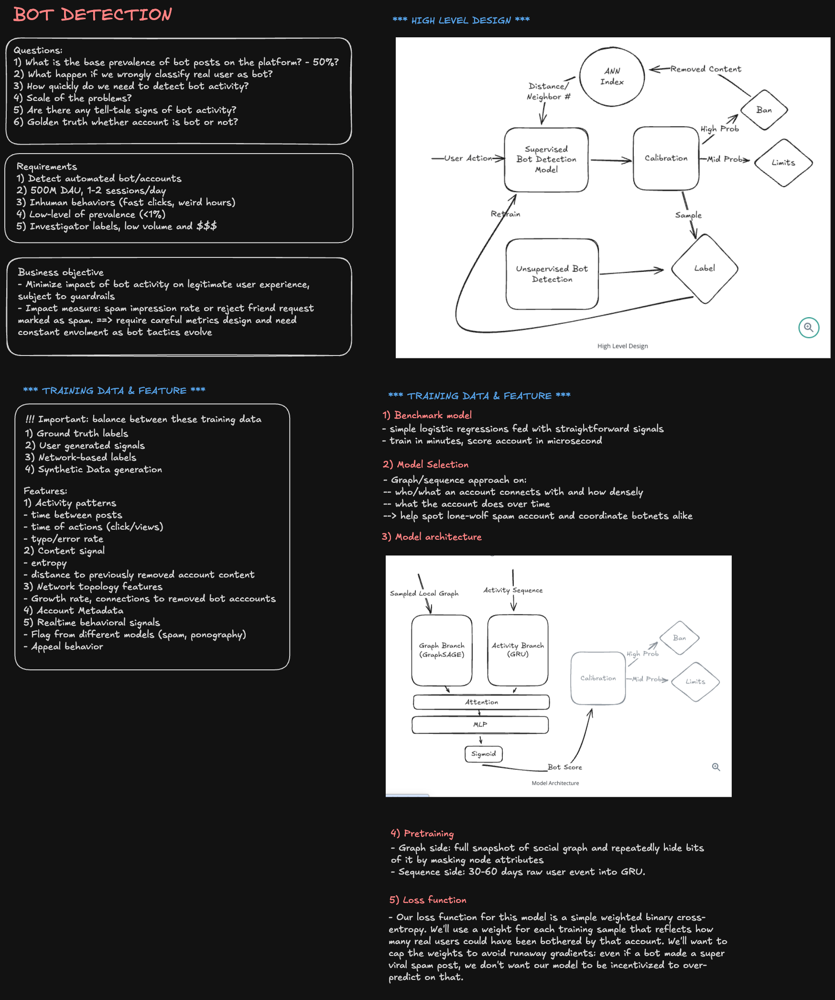
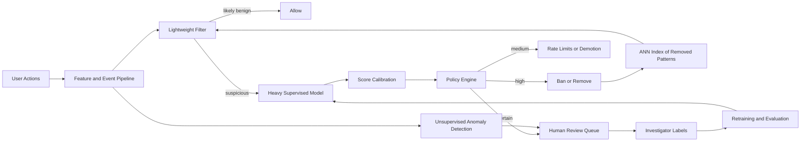

# ML System Design: Bot Detection

Bots are automated malicious actors that degrade user experience, inflate abuse volume, and erode platform trust. A production bot detection system must separate legitimate users from automated or coordinated abuse while controlling false positives that hurt real users.

This is an adversarial problem: attack patterns evolve continuously, labels are scarce, and model behavior itself changes attacker incentives.

## 1) Problem framing

Before design, align on explicit assumptions:

- Scale: about 500M daily active users, typically 1-2 sessions per user per day.
- Prevalence: after basic heuristics, bot prevalence is low (often less than 1%) but still high-impact.
- Label budget: investigator labels are high quality but low volume (low hundreds of accounts per week).
- Blast radius: wrong restrictions on legitimate users carry significant trust and engagement cost.
- Response time: early detection is critical, ideally before a bot reaches many users.

Why this matters:

- Low prevalence means naive random sampling is inefficient.
- Adversarial drift means yesterday's best feature set can decay quickly.
- Expensive labels force careful triage for human review.

## 2) Business objective and guardrails

### Business objective

Minimize harmful bot impact per legitimate user, not just maximize classifier accuracy.

Example impact units:

- suspicious friend requests delivered,
- abusive DMs received,
- spam impressions viewed,
- coordinated misinformation reach.

### Guardrails

- Keep false positive rate on strict actions (for example bans) below policy threshold.
- Preserve healthy user engagement and successful appeal rates.
- Maintain fairness and regional consistency subject to legal constraints.

## 3) ML objective

Primary ML objective is binary account classification: bot vs non-bot.

In practice, train a calibrated risk score and map score ranges to policy actions. This supports graded enforcement:

- high score: hard action,
- medium score: limits/demotion,
- low score: allow and monitor.

## 4) High-level architecture

Use defense-in-depth with supervised and unsupervised components:

Design principles:

- Reserve expensive inference for suspicious accounts.
- Keep policy decisions outside the raw model output.
- Feed reviewer outcomes back into training and calibration loops.

## 5) Data and labeling strategy

Build a label pyramid with varying quality and volume.

### High-quality labels

- Investigator-confirmed bot/non-bot labels.
- Appeal outcomes with strong evidence.

Use these for threshold calibration, final offline validation, and edge-case analysis.

### Noisy but scalable labels

- User reports of spam or fake accounts.
- Content abuse reports tied to accounts.
- historical enforcement outcomes.

These increase coverage but require robustness to label noise.

### Network-derived labels

- proximity to known malicious IP/device clusters,
- coordination with confirmed bot rings,
- abnormal account creation bursts.

Apply conservative propagation to avoid cascading labeling errors.

### Synthetic augmentation

When class imbalance is severe, synthetic pattern generation can expand difficult bot examples. Keep strict separation between synthetic-assisted training and real-label final evaluation.

## 6) Feature families

### Activity and timing features

- inter-event distributions (post, click, follow, message),
- burstiness, entropy, and periodicity,
- circadian rhythm consistency,
- precision of action timing (overly deterministic patterns).

### Content and semantic features

- near-duplicate clusters via embeddings,
- language/style consistency and entropy,
- similarity to removed-content embeddings from ANN index.

### Graph topology features

- follower/following imbalance,
- neighborhood quality and clustering coefficients,
- growth rate of connections,
- graph embeddings from sampled local k-hop neighborhoods.

### Metadata and integrity features

- account age and profile completion,
- device and location consistency,
- authentication anomalies,
- cross-surface abuse flags.

### Real-time adaptation features

- prior model flags,
- behavior shifts after enforcement,
- appeal frequency and outcomes.

Feature availability is time-dependent. New accounts require cold-start paths with sparse signals.

## 7) Model stack

### Baseline

Start with logistic regression or gradient-boosted trees on robust tabular features.

Why keep it:

- fast to retrain,
- low latency,
- strong canary for regression detection.

### Heavy supervised model (behavior + graph)

Two-branch model:

- graph branch: inductive GraphSAGE over sampled k-hop neighborhoods,
- sequence branch: GRU over recent account events,
- fusion: cross-attention plus small MLP to produce risk score.

Rationale:

- graph branch captures coordinated campaigns,
- sequence branch captures inhuman rhythms and action signatures,
- fusion captures correlation between topology and behavior.

## 8) Training strategy

### Pretraining

- graph self-supervision: masked attributes, edge prediction, contrastive neighbor tasks.
- sequence self-supervision: masked event reconstruction and next-event prediction.

Pretraining stabilizes downstream supervised learning when trusted labels are limited.

### Fine-tuning

- weighted binary cross-entropy,
- sample weights proportional to potential user impact,
- weight caps to avoid unstable gradients from extreme outliers.

### Calibration

Use post-hoc calibration (for example Platt scaling) on trusted holdout labels so score thresholds map consistently to enforcement policy.

## 9) Inference, scaling, and triggering

### Two-stage inference

1. Stage 1: lightweight filter on all candidate events/accounts.
2. Stage 2: heavy model only on suspicious slice.

This usually cuts heavy-model load dramatically while preserving quality.

### Compute optimization

- quantization-aware optimization,
- short-lived embedding caches,
- feature materialization on event boundaries,
- prioritized queues for high-risk cohorts.

### Trigger events

- account creation,
- abnormal activity thresholds,
- suspicious network joins,
- report surges,
- post-enforcement behavior shifts.

## 10) Policy and remediation

Policy engine maps calibrated scores plus policy context to actions:

- `ALLOW`
- `MONITOR`
- `LIMIT` (rate caps, DM limits, reach demotion)
- `CHALLENGE` (additional verification)
- `REMOVE`

Use progressive enforcement for uncertain cases to reduce collateral damage while containing abuse.

## 11) Evaluation framework

### Offline

- PR-AUC for imbalanced classes,
- precision at operational recall targets,
- early-catch rate (for example within first 24 hours),
- cluster coverage of coordinated bot rings,
- time-stratified validation to measure drift robustness.

### Online

- reduction in bot interactions per legitimate user,
- appeal overturn rate,
- legitimate user retention impact,
- abuse report volume trend.

Given low prevalence, use importance sampling for labeling instead of random sampling. Oversample uncertain/disagreement zones and reweight for unbiased estimates.

## 12) Unsupervised discovery for unknown attacks

Supervised models catch known patterns; anomaly systems discover unknown unknowns.

Common options:

- isolation forests on behavior aggregates,
- autoencoder reconstruction error,
- graph-community anomaly scores.

Only act strongly when anomaly signal aligns with harm signal; being unusual alone is not enough.

## 13) Adversarial and reliability concerns

### Adversarial risks

- timing randomization to evade cadence features,
- content paraphrasing and style transfer,
- gradual network growth to mimic legitimate users,
- coordinated low-and-slow campaigns.

### Mitigations

- feature diversity across modalities,
- randomized secondary checks,
- delayed publication for high-risk spikes,
- adversarial red-team test suites,
- rapid policy patch channel independent of major model releases.

### Reliability and safe degradation

- if heavy model is unavailable, apply conservative fallback policy,
- prioritize high-severity and high-reach cohorts under backlog,
- maintain model and policy version audit logs,
- auto-rollback on guardrail breaches.

## 14) Typical deep-dive topics in interviews

- calibration and threshold governance,
- label scarcity and active learning,
- survivorship bias and positive suppression,
- fairness by region/language and anti-discrimination controls,
- holdout design in adversarial environments.

## 15) Staff-level takeaway

A strong staff-level design emphasizes:

- business-impact optimization with explicit guardrails,
- staged inference architecture for scale,
- separation of model scoring and policy decisions,
- human-in-the-loop governance,
- continuous adaptation to adversarial drift,
- and operational excellence in observability, rollback, and auditing.

Bot detection succeeds as a continuous socio-technical system, not as a one-time model launch.
