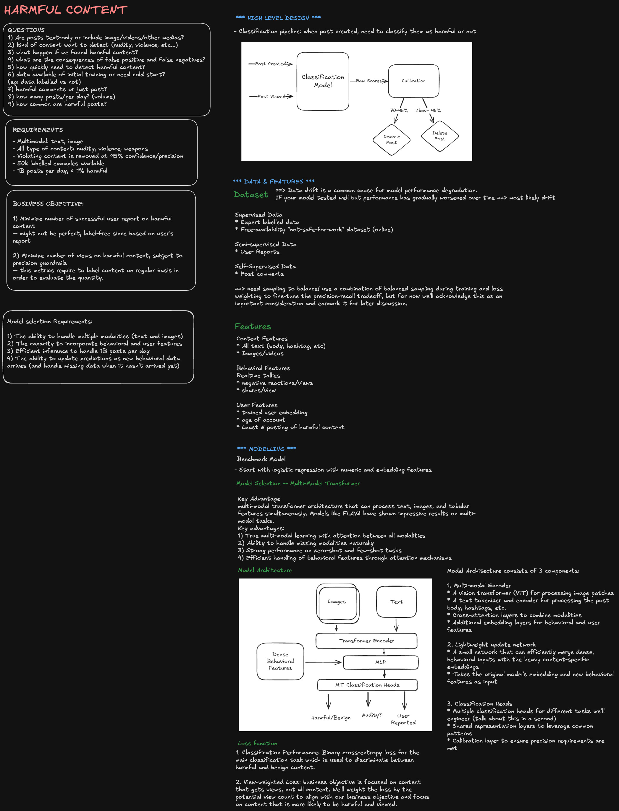
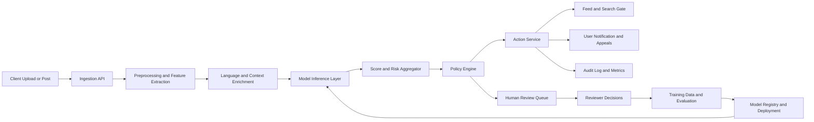

# ML System Design: Detect Harmful Content

Design a system that detects harmful content in near real time and applies policy actions such as block, warn, quarantine, age-gate, or escalate to human review.

At staff level, this is not only a classification task. It is a policy, ML, and operations system where false negatives and false positives have user-safety and trust implications.

## Interview framing

Clarify scope and policy before architecture:

- Which content modalities: text, image, audio, video, links, metadata?
- Which harms: hate, harassment, sexual content, self-harm, violence, scams, misinformation?
- What surfaces: upload-time, feed ranking, comments, direct messages, search?
- Is decision latency strict (sub-second) or asynchronous acceptable?
- What actions are supported: allow, downrank, soft block, hard block, account strike?
- What jurisdictions and legal obligations apply?

Core invariant: **no content is actioned without a policy-grounded decision and auditable evidence.**

## Requirements

### Functional requirements

- Ingest content and context (author, language, region, age signals, conversation context).
- Detect harmful categories and severity with confidence scores.
- Apply policy rules and return deterministic moderation actions.
- Support real-time and asynchronous moderation paths.
- Route uncertain/high-risk cases to human review.
- Track appeals, overrides, and model feedback loops.
- Publish moderation events for ranking, search, and notifications.

### Non-functional requirements

| Requirement      | Target                                                           |
| ---------------- | ---------------------------------------------------------------- |
| Decision latency | 50-300 ms for synchronous text path; async for heavy media scans |
| Availability     | Moderation must degrade safely; never fail silently              |
| Scale            | Millions of content events per hour with bursty traffic          |
| Quality          | High recall on critical harms; controlled false-positive rate    |
| Auditability     | Explainable decision trail and policy versioning                 |
| Privacy          | Minimize PII exposure and enforce retention controls             |

## High-level architecture



Separate concerns:

- ML inference predicts probabilities and risk signals.
- Policy engine converts model output plus rules into product actions.
- Human review resolves ambiguous/high-impact cases.
- Offline loop retrains, evaluates, and calibrates models.

## Detection strategy (multi-stage)

Use a cascaded design to balance latency and cost:

1. **Fast filter:** cheap lexical/rule-based checks, URL/domain reputation, exact hash matches.
2. **Primary ML classifiers:** modality-specific models (text toxicity, image nudity/violence, OCR + text classifier, audio transcript classifier).
3. **Contextual model:** conversation/user-history-aware risk model for nuanced harms.
4. **Policy layer:** thresholds, jurisdiction rules, and user-tier rules.
5. **Human-in-the-loop:** uncertain/high-severity cases.

Critical safety categories should favor recall, with downstream review to control precision impact.

## Feature and model design

### Inputs

- Content features: tokens, embeddings, image frames, OCR text, audio transcripts.
- Context features: language, geography, thread context, account age, prior strikes.
- Integrity features: link reputation, device/network patterns, abuse velocity.

### Outputs

Per category:

```text
category_score: [0, 1]
severity: low | medium | high | critical
confidence
explanations/reason_codes
```

Recommended output format:

```json
{
  "content_id": "abc123",
  "policy_version": "v27",
  "scores": {
    "hate": 0.04,
    "harassment": 0.72,
    "sexual": 0.01,
    "violence": 0.15,
    "self_harm": 0.02
  },
  "severity": "medium",
  "route": "auto_action"
}
```

## Policy engine and actions

Do not bind product behavior directly to raw model score. Use a versioned policy layer:

- score thresholds by category and region,
- user-age and legal constraints,
- recidivism and account trust multipliers,
- exception allowlists for known safe entities,
- emergency policy toggles.

Typical actions:

- `ALLOW`
- `ALLOW_WITH_WARNING`
- `DOWNRANK`
- `QUARANTINE_PENDING_REVIEW`
- `BLOCK`
- `ACCOUNT_STRIKE`

All decisions should include `policy_version`, reason codes, and action source (`auto`, `human`, `appeal_override`).

## Real-time vs async moderation

### Real-time path

Use for comments, captions, and short text where user feedback must be immediate.

- low-latency feature extraction,
- lightweight model ensemble,
- strict time budget and fallback behavior.

### Async path

Use for heavy media (video, long audio, large images).

- process in background workers,
- perform frame/segment sampling,
- progressively update moderation status,
- prevent broad distribution before high-risk scan completes.

## Human review and appeals

Human moderation is part of the core design, not an afterthought.

Review queue prioritization signals:

- high severity,
- low confidence near threshold,
- high-reach content,
- creator trust level,
- legal escalation category.

Appeals flow:

1. User appeals action.
2. Case enters reviewer queue with full evidence bundle.
3. Reviewer decision can uphold/revert.
4. Outcome updates policy/model feedback datasets.

Track inter-rater agreement and reviewer drift.

## Data quality, drift, and evaluation

Monitor both model and policy quality:

- Precision/recall per category and language.
- False negative rate for critical harm classes.
- Calibration error (score vs actual risk probability).
- Drift in embedding distributions and category prevalence.
- Human override rate by model version.

Evaluate by slices:

- language,
- region,
- content type,
- creator cohort,
- vulnerable population proxies where ethically/legally valid.

## Abuse and adversarial robustness

Attackers evade filters with obfuscation and multimodal tricks.

Defenses:

- text normalization (leet, unicode confusables, spacing tricks),
- OCR on images and video frames,
- URL expansion and redirect analysis,
- ensemble diversity and randomized secondary checks,
- delayed publish for suspicious high-risk patterns,
- adaptive thresholds during attack spikes.

Keep a rapid-response policy channel so Trust & Safety can ship rule updates without full model redeploy.

## Reliability and failure handling

| Failure                   | Safe behavior                                                           |
| ------------------------- | ----------------------------------------------------------------------- |
| Inference service timeout | Route to conservative fallback policy or quarantine based on risk class |
| Feature extraction error  | Mark as unknown-risk and route for async review                         |
| Policy service outage     | Use last known good version with strict TTL                             |
| Queue backlog surge       | Prioritize severe categories and high-reach content                     |
| Model rollout regression  | Automated rollback by guardrail metrics                                 |

Fail-safe choices must be category-aware. For critical harms, prefer block-or-review; for low-risk categories, prefer allow-with-monitoring.

## Security, privacy, and governance

- Enforce least-privilege access to content and labels.
- Encrypt sensitive data at rest and in transit.
- Redact PII in logs and reviewer tooling where possible.
- Maintain immutable audit trails for enforcement actions.
- Define retention/deletion policy for content, features, and labels.
- Conduct fairness and bias reviews before broad rollouts.

## Observability and alerts

Track:

- p50/p95/p99 moderation latency,
- action-rate distribution by category,
- review queue depth and SLA breaches,
- model timeout/error rates,
- block/reversal/appeal rates,
- false-negative incident counts,
- per-language quality regressions.

Alert on:

- sudden drop in critical-harm detection recall,
- spike in high-severity content pass-through,
- queue backlog growth beyond SLA,
- model or policy version mismatch,
- sustained human override spike after deployment.

## Staff-level trade-offs

- **Recall vs precision:** critical safety categories prioritize recall; precision is improved with review and calibrated thresholds.
- **Latency vs model complexity:** real-time paths need fast models; deeper multimodal checks run async.
- **Automation vs human review cost:** more automation scales cheaply but needs robust guardrails; human review improves edge-case handling but is expensive.
- **Global policy consistency vs local legal constraints:** one model with policy overlays is common, but regional legal differences require policy partitioning.
- **Strict blocking vs user trust:** aggressive blocking reduces harm but can over-censor; transparent appeals and reason codes improve trust.

## Practical interview summary

A strong staff-level answer should emphasize:

- multi-stage moderation pipeline,
- separation of ML scoring and policy action,
- human review and appeals as first-class workflows,
- robust observability and rollback controls,
- and explicit trade-offs between safety, latency, and false positives.

Detecting harmful content at scale is a continuous socio-technical system, not a one-time model deployment.
