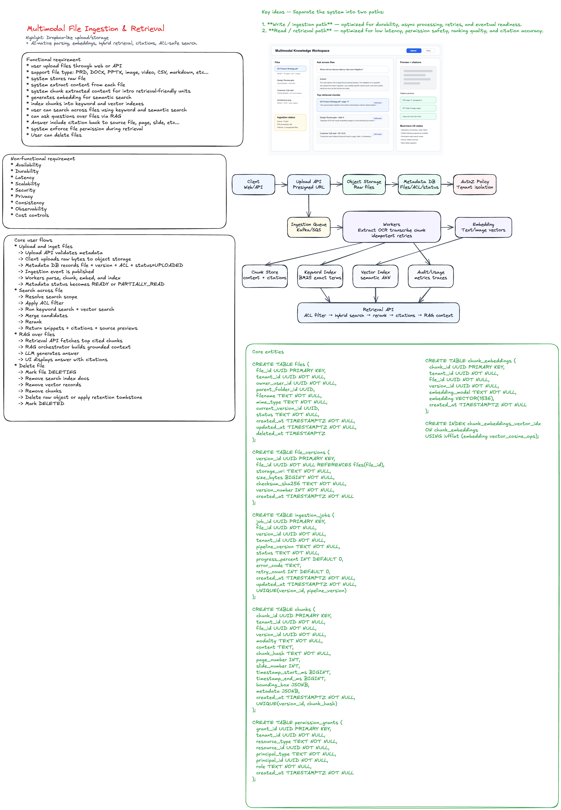

# Design Multimodal File Ingestion and Retrieval

> **Interview framing:** This is **Dropbox-like at the storage layer**, but the real question is about **AI-native ingestion, parsing, embeddings, hybrid retrieval, citations, and permission-safe RAG**.

A Dropbox-style system focuses on file upload, storage, folder organization, sharing, sync, and download. A multimodal ingestion and retrieval system starts with those same foundations, then adds a pipeline that understands file contents across text, PDF, images, slides, audio, video, tables, and code.



---

## 1. One-Minute Interview Answer

> I would design the system in two halves: an **async ingestion platform** and a **low-latency retrieval platform**. Uploads go to object storage first, metadata and ACLs are written to a relational metadata store, and an ingestion event is published. Workers parse files by modality, extract text/OCR/transcripts/tables/images, create structure-aware chunks, generate embeddings, and index chunks into both a keyword index and vector index. Retrieval applies permission filters first, performs hybrid search, reranks candidates, and returns cited chunks for search or RAG. The hardest parts are idempotent ingestion, deletion consistency, permission-safe retrieval, ranking quality, and handling large files at scale.

### UX states to show in interview

| UX Surface       | What it should show                          | Why it matters                           |
| ---------------- | -------------------------------------------- | ---------------------------------------- |
| File list        | Uploading, processing, ready, failed         | Users need trust and progress visibility |
| Ingestion status | OCR/transcription/chunking progress          | Multimodal processing can be slow        |
| Search box       | Scope selection: one file, folder, workspace | Prevents accidental broad retrieval      |
| Results          | Snippet, file, page/slide/timestamp, score   | Makes retrieval explainable              |
| Preview panel    | Source preview with citation anchor          | Users can verify answer grounding        |
| Error state      | Unsupported file, parse failure, retry       | Operational transparency                 |

---

## 4. Functional Requirements

### Must-have

- Users can upload files through web or API.
- Supported file types: PDF, DOCX, PPTX, images, audio, video, CSV/XLSX, Markdown, plain text, and code.
- System stores raw files durably.
- System extracts content from each file.
- System chunks extracted content into retrieval-friendly units.
- System generates embeddings for semantic search.
- System indexes chunks into keyword and vector indexes.
- Users can search across files using keyword and semantic search.
- Users can ask questions over files using RAG.
- Answers include citations back to source file, page, slide, timestamp, image region, or row.
- System enforces file permissions during retrieval.
- Users can delete files and expect raw files, chunks, embeddings, and indexes to be deleted.

### Nice-to-have

- Folder-level ingestion.
- File version history.
- Incremental re-indexing for edited files.
- Near-real-time indexing for small files.
- Shared workspace search.
- Admin audit logs.
- Custom retention policies.
- Human feedback on search quality.

---

## 5. Non-Functional Requirements

| Requirement   | Target / Design Direction                                                                 |
| ------------- | ----------------------------------------------------------------------------------------- |
| Availability  | Upload and retrieval should remain available even if ingestion is delayed                 |
| Durability    | Raw files should be stored in object storage with checksum validation                     |
| Latency       | Retrieval p95 under ~300–800 ms before LLM generation                                     |
| Scalability   | Ingestion workers scale by queue depth and file type                                      |
| Security      | Tenant isolation, ACL filtering, encryption, audit logs                                   |
| Privacy       | No unauthorized chunk retrieval; deletion propagates to all indexes                       |
| Consistency   | File status can be eventually consistent, but permission checks must be strongly enforced |
| Observability | Track ingestion latency, parse failures, queue lag, retrieval recall, empty results       |
| Cost control  | Batch embeddings, cap large files, use lifecycle policies                                 |

---

## 6. Core User Flows

### 6.1 Upload and ingest file

```txt
User uploads file
  -> Upload API validates metadata
  -> Client uploads raw bytes to object storage
  -> Metadata DB records file + version + ACL + status=UPLOADED
  -> Ingestion event is published
  -> Workers parse, chunk, embed, and index
  -> Metadata status becomes READY or PARTIALLY_READY
```

### 6.2 Search across files

```txt
User query
  -> Resolve search scope
  -> Apply ACL filter
  -> Run keyword search + vector search
  -> Merge candidates
  -> Rerank
  -> Return snippets + citations + source previews
```

### 6.3 RAG over files

```txt
User asks question
  -> Retrieval API fetches top cited chunks
  -> RAG orchestrator builds grounded context
  -> LLM generates answer
  -> UI displays answer with citations
```

### 6.4 Delete file

```txt
User deletes file
  -> Mark file DELETING
  -> Remove search index docs
  -> Remove vector records
  -> Remove chunks
  -> Delete raw object or apply retention tombstone
  -> Mark DELETED
```

---

## 7. Core Entities

| Entity            | Purpose                                          |
| ----------------- | ------------------------------------------------ |
| `Tenant`          | Organization or workspace boundary               |
| `User`            | Actor uploading/searching files                  |
| `File`            | Logical file object                              |
| `FileVersion`     | Immutable uploaded version                       |
| `IngestionJob`    | Tracks processing state for a file version       |
| `Chunk`           | Retrieval unit extracted from a file             |
| `Embedding`       | Vector representation of a chunk                 |
| `PermissionGrant` | ACL for users, groups, roles, folders            |
| `SearchQuery`     | Logged query for observability and quality       |
| `Citation`        | Pointer from retrieved answer to source location |
| `DeletionJob`     | Tracks cleanup across stores and indexes         |

---

## 8. Schema Design

### 8.1 Relational metadata schema

Use **Postgres** for a simple version, or **Spanner/CockroachDB** for global scale.

```sql
CREATE TABLE files (
  file_id UUID PRIMARY KEY,
  tenant_id UUID NOT NULL,
  owner_user_id UUID NOT NULL,
  parent_folder_id UUID,
  filename TEXT NOT NULL,
  mime_type TEXT NOT NULL,
  current_version_id UUID,
  status TEXT NOT NULL,
  created_at TIMESTAMPTZ NOT NULL,
  updated_at TIMESTAMPTZ NOT NULL,
  deleted_at TIMESTAMPTZ
);

CREATE TABLE file_versions (
  version_id UUID PRIMARY KEY,
  file_id UUID NOT NULL REFERENCES files(file_id),
  storage_uri TEXT NOT NULL,
  size_bytes BIGINT NOT NULL,
  checksum_sha256 TEXT NOT NULL,
  version_number INT NOT NULL,
  created_at TIMESTAMPTZ NOT NULL
);

CREATE TABLE ingestion_jobs (
  job_id UUID PRIMARY KEY,
  file_id UUID NOT NULL,
  version_id UUID NOT NULL,
  tenant_id UUID NOT NULL,
  pipeline_version TEXT NOT NULL,
  status TEXT NOT NULL,
  progress_percent INT DEFAULT 0,
  error_code TEXT,
  retry_count INT DEFAULT 0,
  created_at TIMESTAMPTZ NOT NULL,
  updated_at TIMESTAMPTZ NOT NULL,
  UNIQUE(version_id, pipeline_version)
);

CREATE TABLE chunks (
  chunk_id UUID PRIMARY KEY,
  tenant_id UUID NOT NULL,
  file_id UUID NOT NULL,
  version_id UUID NOT NULL,
  modality TEXT NOT NULL,
  content TEXT,
  chunk_hash TEXT NOT NULL,
  page_number INT,
  slide_number INT,
  timestamp_start_ms BIGINT,
  timestamp_end_ms BIGINT,
  bounding_box JSONB,
  metadata JSONB,
  created_at TIMESTAMPTZ NOT NULL,
  UNIQUE(version_id, chunk_hash)
);

CREATE TABLE permission_grants (
  grant_id UUID PRIMARY KEY,
  tenant_id UUID NOT NULL,
  resource_type TEXT NOT NULL,
  resource_id UUID NOT NULL,
  principal_type TEXT NOT NULL,
  principal_id UUID NOT NULL,
  role TEXT NOT NULL,
  created_at TIMESTAMPTZ NOT NULL
);
```

### 8.2 Vector index schema

For small/medium scale, use **pgvector**. For large scale, use **Milvus, Pinecone, Weaviate, Vespa, or FAISS-backed service**.

```sql
CREATE TABLE chunk_embeddings (
  chunk_id UUID PRIMARY KEY,
  tenant_id UUID NOT NULL,
  file_id UUID NOT NULL,
  version_id UUID NOT NULL,
  embedding_model TEXT NOT NULL,
  embedding VECTOR(1536),
  created_at TIMESTAMPTZ NOT NULL
);

CREATE INDEX chunk_embeddings_vector_idx
ON chunk_embeddings
USING ivfflat (embedding vector_cosine_ops);
```

### 8.3 Search index document

Example OpenSearch document:

```json
{
  "chunkId": "chunk_123",
  "tenantId": "tenant_abc",
  "fileId": "file_456",
  "versionId": "version_789",
  "filename": "Q3 Product Strategy.pdf",
  "modality": "text",
  "content": "Use queue-based ingestion and worker autoscaling...",
  "pageNumber": 17,
  "aclPrincipals": ["user_1", "group_product", "role_admin"],
  "createdAt": "2026-06-19T00:00:00Z"
}
```

> **Important:** ACL data can be duplicated into the search index for fast filtering, but the retrieval API should still have a trusted authorization layer for sensitive use cases.

---

## 9. API Design

### 9.1 Create upload session

```http
POST /v1/files/upload-sessions
```

```json
{
  "filename": "design-review.pdf",
  "mimeType": "application/pdf",
  "sizeBytes": 12500000,
  "parentFolderId": "folder_123"
}
```

Response:

```json
{
  "fileId": "file_123",
  "versionId": "version_001",
  "uploadUrl": "https://object-store/presigned-url",
  "expiresAt": "2026-06-19T12:10:00Z"
}
```

### 9.2 Complete upload

```http
POST /v1/files/{fileId}/versions/{versionId}/complete
```

```json
{
  "checksumSha256": "abc123"
}
```

Response:

```json
{
  "fileId": "file_123",
  "versionId": "version_001",
  "status": "PROCESSING"
}
```

### 9.3 Get ingestion status

```http
GET /v1/files/{fileId}/status
```

```json
{
  "fileId": "file_123",
  "status": "PARTIALLY_READY",
  "stages": [
    { "name": "text_extraction", "status": "READY" },
    { "name": "ocr", "status": "PROCESSING", "progressPercent": 80 },
    { "name": "embedding", "status": "PENDING" }
  ]
}
```

### 9.4 Search files

```http
POST /v1/retrieval/search
```

```json
{
  "query": "Where did we discuss latency mitigation?",
  "scope": {
    "fileIds": ["file_123"],
    "folderIds": ["folder_456"]
  },
  "mode": "hybrid",
  "topK": 10
}
```

Response:

```json
{
  "results": [
    {
      "chunkId": "chunk_123",
      "fileId": "file_123",
      "filename": "Q3 Product Strategy.pdf",
      "score": 0.92,
      "snippet": "Use queue-based ingestion and worker autoscaling...",
      "citation": {
        "type": "pdf_page",
        "pageNumber": 17,
        "boundingBox": { "x": 0.12, "y": 0.32, "w": 0.66, "h": 0.18 }
      }
    }
  ]
}
```

### 9.5 Ask over files

```http
POST /v1/retrieval/answer
```

```json
{
  "question": "Summarize the latency mitigation plan.",
  "scope": {
    "workspaceId": "workspace_123"
  },
  "topK": 8,
  "requireCitations": true
}
```

Response:

```json
{
  "answer": "The plan is to decouple upload from processing, use async queues, and autoscale workers by file type.",
  "citations": [
    {
      "fileId": "file_123",
      "filename": "Q3 Product Strategy.pdf",
      "pageNumber": 17,
      "chunkId": "chunk_123"
    }
  ]
}
```

### 9.6 Delete file

```http
DELETE /v1/files/{fileId}
```

Response:

```json
{
  "fileId": "file_123",
  "status": "DELETING"
}
```

---

## 10. Technology Choices

| Layer               | Recommended Choice                               | Why                                                |
| ------------------- | ------------------------------------------------ | -------------------------------------------------- |
| Frontend            | React / Next.js + TypeScript                     | Fast UI iteration, upload progress, chat/search UX |
| Upload transport    | Presigned S3/GCS URLs                            | Avoid routing large bytes through app servers      |
| Raw storage         | S3 / GCS / Azure Blob                            | Durable, scalable, lifecycle policies              |
| Metadata DB         | Postgres initially; Spanner/CockroachDB globally | Strong relational model for files, versions, ACLs  |
| Queue               | Kafka, SQS, or Pub/Sub                           | Async ingestion, retries, backpressure             |
| Workers             | Kubernetes + autoscaling                         | Scale by queue depth and modality                  |
| Text extraction     | Apache Tika, Unstructured, pdfium/poppler        | Broad file support                                 |
| OCR                 | Tesseract, Textract, Document AI, Vision API     | Image/PDF OCR                                      |
| Audio transcription | Whisper-style service or managed speech-to-text  | Audio/video retrieval                              |
| Embeddings          | Text/image/multimodal embedding service          | Semantic retrieval                                 |
| Keyword search      | OpenSearch / Elasticsearch / Vespa               | BM25, filters, exact match                         |
| Vector search       | pgvector for v1; Milvus/Pinecone/Vespa at scale  | ANN semantic retrieval                             |
| Reranking           | Cross-encoder or LLM reranker                    | Improves top-K relevance                           |
| Observability       | Prometheus, Grafana, OpenTelemetry               | Pipeline and query tracing                         |

### Interview recommendation

For a practical interview answer:

> I would start with S3 + Postgres + SQS/Kafka + Kubernetes workers + OpenSearch + pgvector. If scale grows, I would move vector retrieval to Milvus/Vespa/Pinecone and metadata to Spanner/CockroachDB for multi-region consistency.

---

## 11. Ingestion Pipeline Design

### 11.1 Pipeline stages

```txt
Validate
  -> Detect file type
  -> Extract raw content
  -> Normalize content
  -> Chunk by structure
  -> Generate embeddings
  -> Write chunk store
  -> Write keyword index
  -> Write vector index
  -> Mark file READY
```

### 11.2 Modality-specific processing

| Modality | Extraction Strategy                             | Citation Anchor        |
| -------- | ----------------------------------------------- | ---------------------- |
| PDF      | Text extraction + OCR fallback + layout parsing | Page + bounding box    |
| DOCX     | Paragraphs, headings, tables                    | Section + paragraph    |
| PPTX     | Slide text, notes, images, OCR                  | Slide + object region  |
| Image    | OCR + caption + image embedding                 | Image region           |
| Audio    | Speech-to-text + speaker/time segments          | Timestamp range        |
| Video    | Audio transcript + sampled frames               | Timestamp + frame      |
| CSV/XLSX | Table headers, rows, schema summary             | Sheet + row range      |
| Code     | Symbols, functions, imports, comments           | File path + line range |

### 11.3 Idempotency

Workers must safely handle duplicate events.

Use this idempotency key:

```txt
idempotencyKey = versionId + pipelineVersion + stageName
```

For chunks:

```txt
chunkHash = sha256(versionId + normalizedContent + locationAnchor)
```

This prevents duplicate chunks when workers retry.

---

## 12. Retrieval Design

### 12.1 Hybrid search

Use both keyword and vector search.

```txt
Candidates = BM25(query) UNION VectorSearch(embedding(query))
Filtered = ACLFilter(Candidates, user)
Ranked = Rerank(query, Filtered)
Return top K with citations
```

### 12.2 Why hybrid search?

| Query Type                      | Best Retrieval Method |
| ------------------------------- | --------------------- |
| Exact product name              | Keyword search        |
| Error code                      | Keyword search        |
| “What was the mitigation plan?” | Vector search         |
| Acronyms and IDs                | Keyword search        |
| Conceptual similarity           | Vector search         |
| Final user-facing result        | Hybrid + reranking    |

### 12.3 Permission-safe retrieval

The most important security rule:

> The system must never retrieve or pass unauthorized chunks to the model.

Recommended pattern:

1. Resolve user identity and tenant.
2. Resolve allowed file/folder/workspace scope.
3. Push ACL filter into keyword and vector retrieval when possible.
4. Re-check permissions in Retrieval API before returning chunks.
5. Only pass authorized chunks to the LLM.

---

## 13. Design Tradeoffs

| Decision      | Option A           | Option B                     | Recommendation                            |
| ------------- | ------------------ | ---------------------------- | ----------------------------------------- |
| Ingestion     | Sync during upload | Async after upload           | Async for scalability and UX              |
| Chunking      | Fixed-size chunks  | Structure-aware chunks       | Structure-aware for citations and quality |
| Search        | Keyword only       | Vector only                  | Hybrid search                             |
| ACL filtering | Post-filter only   | Pre-filter + re-check        | Pre-filter + trusted re-check             |
| File versions | Mutate in place    | Immutable versions           | Immutable versions                        |
| Delete        | Best-effort async  | Tracked deletion job         | Tracked deletion job                      |
| Embeddings    | One model for all  | Modality-specific embeddings | Start simple, expand by modality          |

---

## 14. Testing Strategy

### 14.1 Unit tests

- MIME validation.
- PDF text extraction.
- OCR fallback.
- Transcript segmentation.
- Table parser.
- Code symbol parser.
- Chunk boundary logic.
- Citation anchor generation.
- Embedding request batching.

### 14.2 Integration tests

```txt
Upload PDF
  -> object stored
  -> metadata created
  -> ingestion event emitted
  -> chunks generated
  -> embeddings written
  -> search index updated
  -> retrieval returns expected page citation
```

### 14.3 Permission tests

- Owner can retrieve own file.
- Shared user can retrieve shared file.
- Unshared user cannot retrieve file.
- Removed user immediately loses access.
- Vector search cannot leak unauthorized chunks.
- RAG context contains only authorized chunks.

### 14.4 Idempotency tests

- Same ingestion event processed twice creates one job.
- Worker retry does not duplicate chunks.
- Re-indexing same version and pipeline version is stable.
- New pipeline version can intentionally create new chunks.

### 14.5 Deletion tests

- Delete removes metadata visibility.
- Delete removes keyword index documents.
- Delete removes vector embeddings.
- Delete removes chunk records.
- Delete removes raw object or applies retention policy.
- Deleted file never appears in RAG context.

### 14.6 Retrieval quality tests

Use a golden set of files, queries, and expected chunks.

Metrics:

| Metric              | Meaning                                           |
| ------------------- | ------------------------------------------------- |
| Recall@K            | Expected chunk appears in top K                   |
| Precision@K         | Top K chunks are relevant                         |
| MRR                 | Correct result appears early                      |
| Citation accuracy   | Citation points to the right source region        |
| Answer groundedness | Generated answer is supported by retrieved chunks |
| Empty-result rate   | Search quality and ingestion coverage signal      |

### 14.7 Load tests

- Upload spike with many small files.
- Few huge videos.
- Large PDFs with OCR fallback.
- Concurrent retrieval queries.
- Vector index p95 latency.
- Queue backlog and worker autoscaling.
- Re-index entire workspace.

---

## 15. Observability

### Ingestion metrics

- Upload success rate.
- Queue depth by file type.
- Worker processing latency by stage.
- Parse failure rate by MIME type.
- OCR/transcription latency.
- Embedding latency and cost.
- Index write latency.
- Time from upload to READY.

### Retrieval metrics

- Query latency p50/p95/p99.
- Keyword search latency.
- Vector search latency.
- Reranker latency.
- Top-K recall on golden set.
- Empty-result rate.
- Permission-denied count.
- Citation click-through rate.
- User feedback score.

### Security metrics

- Unauthorized access attempts.
- ACL filter mismatch.
- Deletion lag.
- Cross-tenant query attempts.
- Sensitive-file access audit trail.

---

## 16. Failure Modes and Mitigations

| Failure                            | Mitigation                                                    |
| ---------------------------------- | ------------------------------------------------------------- |
| Ingestion worker crashes           | Queue retry + idempotent stages                               |
| Poison file repeatedly fails       | Dead-letter queue + user-visible failure state                |
| Huge file overwhelms workers       | File size limits, chunk streaming, separate heavy worker pool |
| Embedding service unavailable      | Mark partial-ready, retry embeddings later                    |
| Search index write fails           | Retry index writes, reconciliation job                        |
| ACL changes not reflected in index | Trusted permission re-check before returning chunks           |
| Delete partially fails             | Deletion job with retries and tombstone state                 |
| Vector search returns stale chunks | Filter by active version and file status                      |
| OCR quality is poor                | Show confidence, allow fallback to original preview           |

---

## 17. Frontend Design Details

### Key frontend components

```txt
FileWorkspacePage
  ├── UploadDropzone
  ├── FileList
  ├── IngestionStatusPanel
  ├── SearchAndAskBox
  ├── RetrievalResultsList
  ├── SourcePreviewPanel
  └── CitationViewer
```

### Client state model

```ts
type FileStatus =
  | 'UPLOADING'
  | 'UPLOADED'
  | 'PROCESSING'
  | 'PARTIALLY_READY'
  | 'READY'
  | 'FAILED'
  | 'DELETING'
  | 'DELETED';

type FileItem = {
  fileId: string;
  filename: string;
  mimeType: string;
  status: FileStatus;
  progressPercent?: number;
  supportedModalities: Array<'text' | 'image' | 'audio' | 'video' | 'table' | 'code'>;
  createdAt: string;
};

type RetrievalResult = {
  chunkId: string;
  fileId: string;
  filename: string;
  snippet: string;
  score: number;
  citation: {
    type: 'page' | 'slide' | 'timestamp' | 'image_region' | 'row' | 'line_range';
    pageNumber?: number;
    slideNumber?: number;
    timestampStartMs?: number;
    timestampEndMs?: number;
    lineStart?: number;
    lineEnd?: number;
  };
};
```

### UX performance techniques

- Upload directly to object storage using presigned URLs.
- Show optimistic file row immediately after upload starts.
- Poll or subscribe to ingestion status updates.
- Virtualize large file lists and result lists.
- Lazy-load source previews.
- Stream RAG answer tokens while citations are already visible.
- Cache recent query results by `query + scope + version`.
