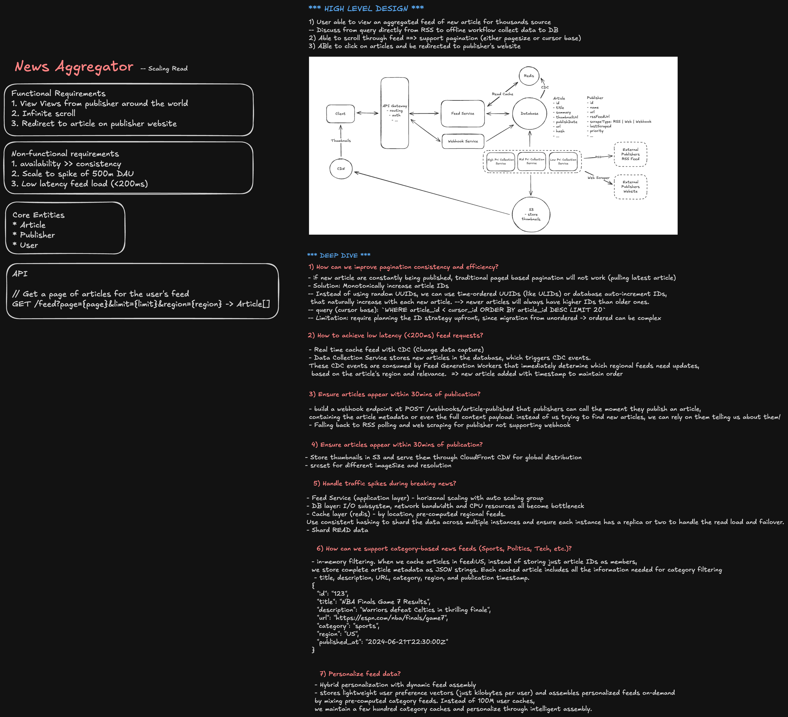

> **Editable diagram:** [Open in Excalidraw](https://excalidraw.com/#room=4a5690722723bd0c276e,Ia0GQ4LDY7CY6-_IneTeFQ)



## Problem

Design a Google News style service that aggregates news articles from thousands of publishers worldwide and displays a scrollable, personalized news feed for users.

The system should ingest articles, normalize metadata, deduplicate similar stories, rank content, support search and topic browsing, and keep the user experience fresh, fast, trustworthy, and globally available.

## Goals

- Show fresh news from many publishers in a scrollable feed.
- Group similar articles about the same event into story clusters.
- Personalize ranking by user interests, location, language, and reading history.
- Support breaking news, local news, topic pages, publisher pages, and search.
- Provide low-latency reads for feed browsing.
- Keep ingestion reliable even when publishers are slow, duplicated, or malformed.
- Support moderation, policy controls, publisher quality signals, and user trust.

## Non-Goals

- Hosting full publisher article content.
- Building a full social network.
- Creating original news content.
- Guaranteeing real-time ingestion from every publisher.

## Requirements

### Functional Requirements

- Ingest articles from RSS feeds, publisher APIs, sitemaps, and crawler pipelines.
- Extract title, author, publish time, image, canonical URL, language, entities, topics, and article summary.
- Deduplicate near-identical articles.
- Cluster articles that cover the same story.
- Generate feeds for home, topic, local, search, and publisher pages.
- Allow users to save, hide, follow, and report content.
- Track impressions, clicks, dwell time, and feedback signals.
- Provide admin tools for publisher management and policy review.

### Non-Functional Requirements

- Home feed p95 latency: under 300 ms after feed cache is warm.
- Search p95 latency: under 500 ms for common queries.
- Ingestion delay: minutes for normal articles, seconds to a few minutes for breaking news.
- High availability for reads.
- Eventual consistency is acceptable for new articles appearing in feeds.
- Stronger consistency is needed for user preferences, follows, hides, and policy blocks.

## High-Level Architecture

```text
Publishers
  -> Feed Fetchers / Crawlers
  -> Ingestion Queue
  -> Article Parser + Normalizer
  -> Deduplication Service
  -> Story Clustering Service
  -> Enrichment Service
       - language detection
       - topic classification
       - entity extraction
       - safety and policy checks
  -> Article Store
  -> Search Index
  -> Ranking Pipeline
  -> Feed Cache
  -> API Gateway
  -> Web / Mobile Clients
```

## Core Services

### Publisher Ingestion Service

Fetches news from publisher sources.

Important design points:

- Use per-publisher fetch schedules based on freshness and reliability.
- Respect robots.txt, crawl delay, API limits, and publisher agreements.
- Store raw ingestion payloads for debugging and reprocessing.
- Put fetched items onto a durable queue so parsing can retry independently.

### Article Parser Service

Turns raw publisher data into normalized article records.

Responsibilities:

- Extract title, canonical URL, image, author, published time, and body preview.
- Normalize timestamps and URLs.
- Detect language and region.
- Drop malformed, duplicate, expired, or blocked content.

### Deduplication Service

Prevents the same article from appearing multiple times.

Signals:

- Canonical URL.
- Publisher article ID.
- Normalized title.
- Content hash.
- SimHash or embedding similarity for near duplicates.

Interview note:

Exact URL dedupe is not enough because publishers may syndicate the same article through different URLs. Use exact match first, then near-duplicate matching.

### Story Clustering Service

Groups related articles about the same event.

Example:

- Article A: "Federal Reserve keeps rates unchanged"
- Article B: "Fed holds interest rates steady"
- Article C: "Markets react after Fed decision"

These may belong to one story cluster.

Approach:

- Generate article embeddings.
- Compare against recent story clusters.
- Use entities, topics, timestamps, and semantic similarity.
- Assign article to an existing cluster or create a new cluster.
- Periodically merge or split clusters as more articles arrive.

### Enrichment Service

Adds signals needed for ranking and browsing.

Examples:

- Topics: politics, business, sports, technology.
- Entities: people, companies, locations.
- Region and local relevance.
- Publisher authority.
- Content safety and policy labels.
- Freshness and breaking-news score.

### Ranking Service

Ranks candidate articles and story clusters for each user.

Common ranking signals:

- Freshness.
- Publisher quality.
- Story importance.
- Local relevance.
- Topic interest.
- User follows.
- Click and dwell history.
- Diversity across publishers and topics.
- Downranking for repetitive, low-quality, or policy-sensitive content.

Staff-level point:

Ranking should optimize for long-term user trust, not only clicks. Include diversity, source quality, and misinformation controls so the product does not become a clickbait amplifier.

### Feed Generation Service

Builds candidate feeds for home, topic, local, and publisher views.

Two common models:

- Pull model: compute feed at request time from ranking candidates.
- Push model: precompute feed segments into cache.

Recommended hybrid:

- Precompute global, topic, regional, and breaking-news feeds.
- Personalize at request time by blending precomputed candidates with user preferences.
- Cache final feed pages for short TTLs when possible.

## Read Path

```text
Client requests /feed
  -> API Gateway authenticates user
  -> Feed Service loads user profile and preferences
  -> Candidate Generator gets articles/clusters from feed cache and indexes
  -> Ranking Service scores candidates
  -> Feed Service applies diversity and policy filters
  -> API returns paginated feed response
```

Feed response should include:

- Story cluster ID.
- Main article.
- Related coverage count.
- Publisher metadata.
- Image URL.
- Summary.
- Published time.
- Topic labels.
- Pagination cursor.

## Write / Ingestion Path

```text
Publisher source changes
  -> Fetcher discovers article
  -> Queue receives raw article event
  -> Parser normalizes article
  -> Deduper checks exact and near duplicate matches
  -> Enrichment adds topics/entities/language/policy signals
  -> Clustering attaches article to a story
  -> Article Store persists canonical article
  -> Search Index updates
  -> Ranking candidates and feed caches refresh
```

## API Design

```http
GET /api/feed?cursor=abc&language=en&region=us
GET /api/topics/:topicId?cursor=abc
GET /api/stories/:storyId
GET /api/search?q=interest+rates&cursor=abc
POST /api/articles/:articleId/save
POST /api/articles/:articleId/hide
POST /api/publishers/:publisherId/follow
POST /api/articles/:articleId/report
```

Example feed item:

```json
{
  "storyId": "story_123",
  "title": "Federal Reserve keeps interest rates unchanged",
  "summary": "The central bank held rates steady while signaling caution on inflation.",
  "mainArticle": {
    "articleId": "article_456",
    "publisher": "Example News",
    "url": "https://publisher.example/article",
    "imageUrl": "https://cdn.example/image.jpg",
    "publishedAt": "2026-06-22T15:30:00Z"
  },
  "relatedArticleCount": 18,
  "topics": ["business", "economy"],
  "cursor": "next_cursor"
}
```

## Data Model

### Article

```text
article_id
publisher_id
canonical_url
title
summary
image_url
author
published_at
ingested_at
language
region
topics
entities
content_hash
embedding_id
policy_status
story_id
```

### Story Cluster

```text
story_id
headline
main_article_id
article_ids
topics
entities
regions
first_seen_at
last_updated_at
importance_score
```

### User Profile

```text
user_id
language
region
followed_topics
followed_publishers
hidden_topics
hidden_publishers
saved_article_ids
reading_history_summary
```

## Storage Choices

- Object storage: raw fetched content, snapshots, images if proxied.
- Relational database: publisher metadata, user preferences, policy records.
- Document or wide-column store: article metadata and story clusters.
- Search index: full-text search and topic/entity lookup.
- Cache: hot feeds, story pages, publisher metadata.
- Event stream: ingestion events, click events, ranking feedback.
- Analytics warehouse: ranking training data, reporting, experimentation.

## Caching Strategy

- CDN cache static assets and public story pages.
- Feed cache for anonymous, regional, topic, and trending feeds.
- Short TTL cache for personalized feed pages.
- Cache publisher metadata and images aggressively.
- Use cache keys that include region, language, topic, and user segment.

Avoid over-caching breaking news. Important story clusters need fast invalidation or short TTLs.

## Pagination

Use cursor-based pagination instead of offset pagination.

Cursor should encode:

- Last ranked score.
- Last item ID.
- Feed generation timestamp.
- User or segment context.

This avoids duplicate or missing items when the feed changes while the user scrolls.

## Ranking and Personalization

Candidate generation:

- Recent articles from followed topics.
- Local stories.
- Trending story clusters.
- Breaking news.
- Publisher-followed content.
- Search or topic-specific candidates.

Ranking stages:

1. Retrieve candidates.
2. Filter blocked or unsafe content.
3. Score by relevance, freshness, authority, and personalization.
4. Apply diversity rules.
5. Group by story cluster.
6. Return paginated results.

Diversity rules:

- Avoid showing too many stories from one publisher.
- Avoid repeated articles about the same event.
- Mix local, global, followed, and important stories.
- Show multiple perspectives in story detail pages.

## Freshness and Breaking News

Breaking news requires a faster path:

```text
High-priority publisher update
  -> Priority ingestion queue
  -> Fast parse and dedupe
  -> Early story cluster
  -> Breaking-news candidate cache
  -> Push invalidation to feed caches
```

Tradeoff:

Fast paths may have less enrichment at first. The system can publish a lightweight article record quickly, then update topics, entities, summaries, and clustering later.

## Reliability

Failure cases:

- Publisher feed is down.
- Article parser fails.
- Duplicate detection service is slow.
- Search index lags behind article store.
- Ranking model service is unavailable.
- Cache becomes stale.

Mitigations:

- Durable queues with retries and dead-letter queues.
- Per-publisher circuit breakers.
- Backfill jobs for missed articles.
- Fallback ranking using simple freshness and publisher quality.
- Serve cached feeds during ranking outages.
- Idempotent ingestion keyed by canonical URL and content hash.

## Observability

Track:

- Ingestion lag by publisher.
- Parse success rate.
- Duplicate rate.
- Cluster quality metrics.
- Feed p50, p95, and p99 latency.
- Search latency.
- Cache hit rate.
- Click-through rate, dwell time, hides, reports.
- Publisher coverage and diversity.
- Policy review rate and false positives.

Staff-level point:

Observability should connect product quality to system health. A feed can be technically available while still being stale, repetitive, or low trust.

## Trust, Safety, and Publisher Quality

Important controls:

- Publisher allowlist and trust scores.
- Misinformation and unsafe-content classifiers.
- Manual policy override tools.
- User reporting workflow.
- Clear attribution and links to original publishers.
- "Full coverage" views that show multiple sources.
- Avoid ranking only by engagement.

Staff-level discussion:

A news aggregator has social impact. The design should explicitly discuss source diversity, regional bias, clickbait incentives, and how editorial/policy teams can intervene safely.

## Frontend Design

Key UI surfaces:

- Home feed.
- Story cluster detail page.
- Topic page.
- Search page.
- Local news page.
- Saved articles.
- Publisher page.

Frontend concerns:

- Infinite scroll with cursor pagination.
- Skeleton loading for feed cards.
- Image lazy loading.
- Stable card heights to avoid layout shift.
- Offline or poor-network fallback.
- Accessibility for screen readers and keyboard navigation.
- Clear source attribution.
- User controls for save, hide, follow, and report.

## Scale Estimate

Example assumptions:

- 10,000 publishers.
- 2 million new articles per day.
- 100 million daily active users.
- 20 feed requests per user per day.
- 2 billion feed requests per day.

Implications:

- Reads dominate writes.
- Feed serving must be cache-heavy.
- Ingestion must be asynchronous and horizontally scalable.
- Ranking cannot call expensive models for every request without caching or staged scoring.

## Tradeoffs

### Precompute vs Real-Time Ranking

Precompute:

- Faster reads.
- Easier to cache.
- Less personalized.

Real-time:

- More personalized.
- More expensive.
- Higher latency risk.

Recommended:

Use a hybrid strategy with precomputed candidate pools and lightweight request-time personalization.

### Exact Deduplication vs Semantic Deduplication

Exact dedupe:

- Fast and simple.
- Misses syndicated or rewritten articles.

Semantic dedupe:

- Better quality.
- More compute-heavy.
- Can incorrectly merge different stories.

Recommended:

Use exact dedupe first, then semantic similarity with conservative thresholds.

### Freshness vs Quality

Freshness:

- Important for breaking news.
- Risk of publishing incomplete or low-confidence content.

Quality:

- Better trust and relevance.
- May delay new stories.

Recommended:

Use fast publish for trusted sources and progressively enrich/update records as more signals arrive.

## Interview Summary

For a staff engineer answer, focus on:

- Clear read and write paths.
- Article ingestion at scale.
- Deduplication and story clustering.
- Ranking with freshness, personalization, diversity, and trust.
- Cache-heavy feed serving.
- Cursor pagination for infinite scroll.
- Reliability through queues, retries, fallbacks, and idempotency.
- Product care around source quality, misinformation, publisher attribution, and user control.
