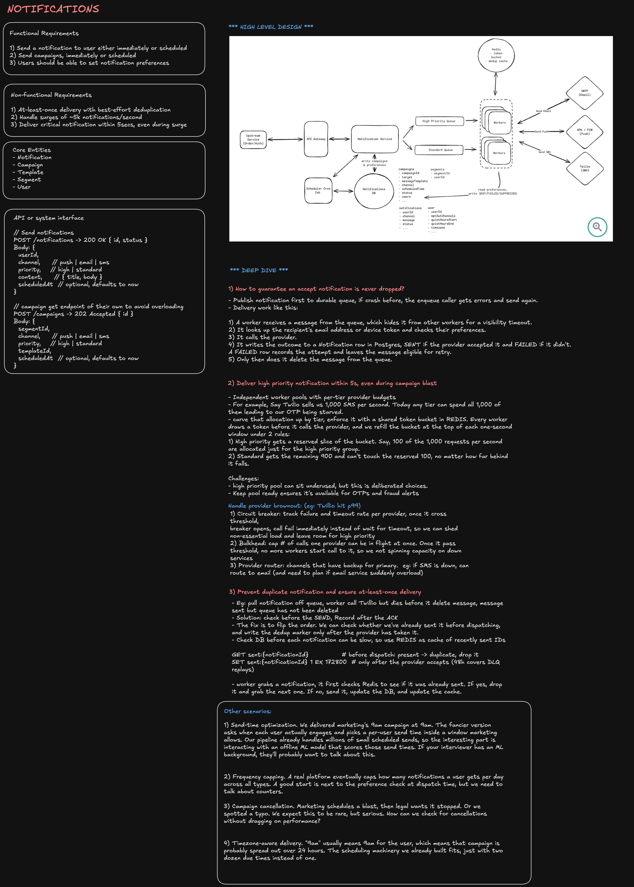
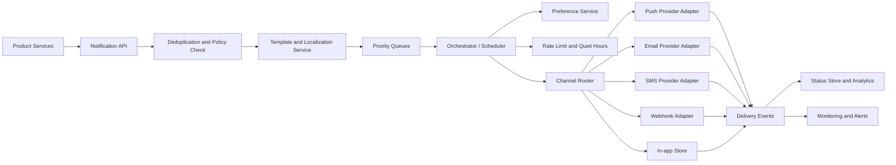

# Notification System Design

A notification system delivers user-facing messages across channels such as in-app, push, email, SMS, and webhooks. At staff level, the challenge is not only sending messages; it is deciding _whether_ to send, _when_ to send, _through which channel_, and how to handle retries, user preferences, compliance, and provider failures without spamming users.

## Interview framing

Clarify the product behavior first:

- Are notifications transactional, marketing, operational alerts, social updates, or all of them?
- Which channels are required: in-app, email, push, SMS, Slack, webhooks?
- Are any messages legally required or time-sensitive?
- Do users have per-channel and per-topic preferences?
- Is delivery best-effort, at-least-once, or must it be auditable?
- Do we need fanout to millions of users, or mostly one-to-one transactional messages?
- What is the acceptable delay for each notification type?

The core invariant: **never send a notification unless it passes policy, preference, deduplication, and compliance checks.**

## Requirements

### Functional requirements

- Accept notification requests from product services.
- Support templates, localization, personalization, and channel-specific rendering.
- Enforce user preferences, quiet hours, unsubscribe status, and legal constraints.
- Route to multiple channels: in-app, push, email, SMS, and webhooks.
- Support scheduled notifications, retries, cancellation, and priority.
- Deduplicate repeated requests with idempotency keys.
- Track notification state, provider responses, and delivery history.
- Expose APIs for notification history, read/unread state, and preference management.

### Non-functional requirements

| Requirement   | Target                                                                         |
| ------------- | ------------------------------------------------------------------------------ |
| Availability  | Producers should be able to enqueue even when providers are degraded           |
| Latency       | Transactional push/in-app within seconds; email/SMS can tolerate longer queues |
| Durability    | Do not lose accepted notification requests                                     |
| Scale         | Handle bursty fanout and high-cardinality per-user preferences                 |
| Compliance    | Honor opt-out, retention, privacy, and consent requirements                    |
| Observability | Track send, delivery, bounce, open, click, read, and failure states            |

## High-level architecture



Separate responsibilities:

- **Notification API:** validates requests, applies idempotency, persists accepted intent.
- **Template service:** renders localized channel-specific content.
- **Preference service:** stores user/topic/channel opt-in and opt-out settings.
- **Orchestrator:** schedules, batches, prioritizes, retries, and cancels work.
- **Channel adapters:** isolate provider-specific APIs, webhooks, and error codes.
- **Status store:** tracks lifecycle state and supports user history/debugging.

## Data model

```text
notification_intent
	notification_id
	idempotency_key
	user_id | audience_id
	topic
	priority
	template_id
	locale
	payload
	requested_channels
	scheduled_at
	expires_at
	status
	created_at
```

```text
delivery_attempt
	attempt_id
	notification_id
	channel
	provider
	provider_message_id
	attempt_number
	status: queued | sent | delivered | failed | bounced | suppressed
	error_code
	next_retry_at
```

Use immutable delivery events to reconstruct state. Keep a current-state projection for fast reads.

## Notification lifecycle

```text
REQUESTED -> ACCEPTED -> RENDERED -> ELIGIBLE -> QUEUED
			 -> SENT -> DELIVERED
			 -> READ

Alternative terminal states:
SUPPRESSED, EXPIRED, CANCELLED, FAILED, BOUNCED
```

Important distinction:

- `SENT`: accepted by provider or channel adapter.
- `DELIVERED`: provider or client confirmed delivery when available.
- `READ`: user opened or viewed in-app notification.

Not every channel can prove delivery. Email opens are noisy, SMS delivery varies by carrier, and push receipts may be delayed or unavailable.

## Idempotency and deduplication

Producers should pass an idempotency key, for example:

```text
order-shipped:{order_id}:user:{user_id}:v1
```

On request:

1. Check whether the idempotency key already produced a notification.
2. If yes, return the existing notification ID and state.
3. If no, create the notification intent and enqueue atomically.
4. Store provider IDs on attempts so provider retries are also deduplicated.

Deduplication windows should be topic-specific. A login alert may dedupe for minutes; a billing receipt may dedupe forever by invoice ID.

## Preferences, policy, and compliance

Preferences should be evaluated close to send time, not only enqueue time, because users may unsubscribe after the request is created.

Policy checks include:

- Topic-level opt-in/opt-out.
- Channel-level preferences.
- Quiet hours and timezone.
- Frequency caps and digest rules.
- Legal unsubscribe for marketing email/SMS.
- Required transactional exceptions, such as security or billing notices.
- Age, geography, and data residency rules.

Keep a clear policy override model. “Transactional” should not become a loophole for marketing content.

## Channel strategy

### In-app notifications

Store durable records keyed by user, sorted by time and unread state. This is usually the most controllable channel.

Design points:

- unread count projection;
- mark-as-read idempotency;
- retention and deletion policy;
- WebSocket or server-sent event push for online users;
- fallback to pull-based polling.

### Push notifications

Use APNs/FCM tokens, track token invalidation, and remove dead tokens after provider feedback.

Push is fast but not guaranteed. Always pair critical messages with durable in-app state.

### Email

Use provider templates or internal rendering. Handle bounces, complaints, unsubscribe, suppression lists, and domain reputation.

Email is good for durable receipts and longer content, but it has variable delivery latency.

### SMS

Use sparingly because it is expensive and regulated. Support country-specific sender rules, opt-in evidence, STOP handling, and abuse controls.

### Webhooks

For customer-integrated notifications, sign payloads, retry with backoff, expose delivery logs, and let customers replay events.

## Fanout design

For one-to-one transactional notifications, enqueue one intent per user.

For large fanout, avoid creating millions of rows synchronously in the request path:

1. Create an audience definition or campaign record.
2. Snapshot the audience or store a query version.
3. Fan out asynchronously by partitions.
4. Apply preferences per recipient at send time.
5. Use rate limits and provider quotas to pace delivery.

For news-feed style notifications, consider fanout-on-write for small audiences and fanout-on-read or digesting for large celebrity/high-cardinality audiences.

## Scheduling, priority, and cancellation

Use separate queues by priority and channel:

- critical security alerts;
- transactional messages;
- user engagement;
- marketing/bulk campaigns;
- retries and dead-letter reprocessing.

Scheduled notifications need a durable scheduler. Cancellation should be supported before send. After a provider accepts a message, cancellation is usually best-effort or impossible, so the state should reflect `cancel_requested` vs. `cancelled`.

## Retries and failure handling

Classify provider errors:

| Error                       | Action                                                      |
| --------------------------- | ----------------------------------------------------------- |
| Provider timeout            | Retry with exponential backoff and jitter                   |
| Rate limit                  | Respect provider retry-after and slow that channel/provider |
| Invalid push token          | Mark token inactive and suppress future sends               |
| Email hard bounce           | Add to suppression list                                     |
| SMS opt-out                 | Suppress SMS for that user/topic and audit                  |
| Template render error       | Fail fast and alert owning team                             |
| Repeated transient failures | Move to dead-letter queue                                   |

Retries must preserve the original notification ID and create new delivery attempts. Avoid infinite retries for expired or no-longer-relevant notifications.

## Provider routing and resiliency

For each channel, use an adapter interface:

```text
send(message) -> provider_message_id | retryable_error | permanent_error
```

Provider failover is useful but not free. Sending the same email/SMS through a second provider can duplicate user-visible messages unless deduplication and provider state are clear.

Use failover mainly when:

- the first provider definitely rejected or did not accept the message;
- the message is critical;
- duplicate risk is lower than non-delivery risk.

## Observability and alerts

Track metrics by topic, channel, provider, region, and priority:

- accepted, suppressed, queued, sent, delivered, failed, bounced, read;
- queue depth, queue age, schedule lag, and retry backlog;
- provider latency, error rate, rate-limit rate, and webhook lag;
- push token invalidation and email bounce/complaint rate;
- preference suppression rate and quiet-hour deferrals;
- duplicate suppression count and idempotency conflicts.

Alert on:

- critical queue age exceeding SLA;
- provider outage or sharp error-rate increase;
- dead-letter queue growth;
- template render failures;
- bounce or complaint rate above threshold;
- notification fanout stuck or sending far more than expected;
- preference service degradation causing unsafe sends or broad suppression.

Include runbook links, owning team, topic, template ID, channel, provider, sample notification IDs, and safe remediation actions.

## Security and privacy

- Do not include secrets, passwords, full tokens, or sensitive personal data in notification content.
- Encrypt device tokens and provider credentials.
- Sign webhooks and customer-facing callback notifications.
- Audit preference changes and administrative sends.
- Apply retention policies for message content and delivery metadata.
- Redact notification payloads in logs.
- Support deletion/export workflows for privacy compliance.

## Staff-level trade-offs

- **Immediate send vs. preference freshness:** render/enqueue quickly, but evaluate preferences close to send time for correctness.
- **At-least-once vs. exactly-once:** providers and queues are at-least-once; use idempotency and dedupe to avoid duplicate user-visible messages.
- **One provider vs. multi-provider:** one provider is simpler; multi-provider improves resilience but complicates dedupe, compliance, and analytics.
- **Fanout now vs. digest later:** immediate notifications maximize timeliness; digests reduce spam and cost.
- **Rich personalization vs. privacy:** personalization improves relevance but increases data exposure and template complexity.
- **Strict ordering vs. throughput:** per-user ordering is useful for in-app timelines, but global ordering across channels is expensive and often unnecessary.

The staff-level answer should emphasize policy and operations as much as delivery mechanics: a good notification system sends the right message, to the right user, on the right channel, at the right time, with clear evidence of why it was sent or suppressed.
