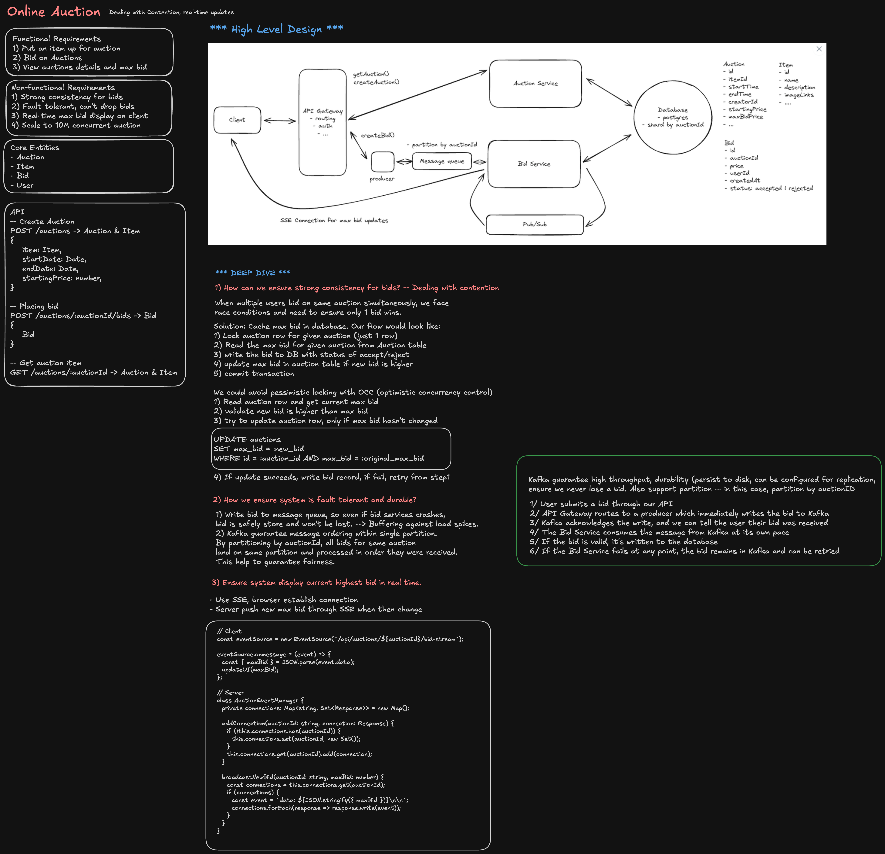

---

## Interview Summary

| Component                   | Challenge                                              | Solution                                                       |
| --------------------------- | ------------------------------------------------------ | -------------------------------------------------------------- |
| **Bidding Engine**          | Multiple concurrent bids on same item; race conditions | Optimistic locking + consensus algorithm; centralized ordering |
| **Real-time Updates**       | Clients need instant bid notifications                 | WebSocket/Server-Sent Events to broadcast state changes        |
| **Fraud Detection**         | Shill bidding, price manipulation, user collusion      | Behavioral analysis, velocity checks, bid pattern anomalies    |
| **Consistency Guarantee**   | Final price must be unambiguous across all replicas    | Single source of truth (primary DB); read replicas for scale   |
| **High-throughput Bidding** | Peak load during final minutes of auctions             | Event sourcing + in-memory cache; async persistence            |
| **Auction Clock Skew**      | Clients disagree on when auction ends                  | Server-side timers; ignore client timestamp claims             |
| **Settlement & Escrow**     | Winner payment, seller trust, dispute resolution       | Payment holds, escrow service, appeal period                   |

**The core challenge:** _A bid that arrives first to a replicated system must win deterministically, even under network partition. OT / CRDT approaches work poorly here because auction ordering is causal and irreversible._

---

## High-Level Architecture

```
┌─────────────────────────────────────────────────────────────┐
│                   Client (Web/Mobile)                       │
│         Bid Form + Real-time Bid Updates (WebSocket)       │
└──────────────────────┬──────────────────────────────────────┘
                       │
                       ↓ POST /api/bid
        ┌──────────────────────────────────────────────────┐
        │   API Gateway (Auth, Rate Limit, Tenant)         │
        └──────────────┬───────────────────────────────────┘
                       │
              ┌────────┴─────────┐
              ↓                  ↓
     ┌─────────────────┐  ┌──────────────────┐
     │  Bid Service    │  │  Auction Service │
     │  (Validation)   │  │  (State Machine) │
     └────────┬────────┘  └──────┬───────────┘
              │                  │
              └────────┬─────────┘
                       ↓
        ┌──────────────────────────────────────────────────┐
        │  Consensus Layer (Primary Write, Replicate)     │
        │  - Primary DB (write lock on auction)           │
        │  - Event Log (immutable bid history)            │
        │  - Read Replicas (serve bid status)             │
        └──────────────┬───────────────────────────────────┘
                       │
        ┌──────────────┴──────────────────────────────────┐
        │                                                  │
        ↓                                                  ↓
    ┌────────────────┐                          ┌──────────────────┐
    │  PostgreSQL    │                          │  Fraud Detection │
    │  (Auctions,    │                          │  (Real-time)     │
    │   Bids, Users) │                          │  (ML Pipeline)   │
    └────────────────┘                          └──────────────────┘
        │
        ├─→ Cache (Redis): Active auction state, bid count, top bidder
        │
        └─→ Event Stream (Kafka): Bid events for analytics, settlement
```

---

## The Five Critical Decisions

### 1. Consensus for the Final Bid

**The problem:** User A and User B both submit bids at the same time. Network is partitioned. Which bid wins?

**Solution:**

- **Single primary database** — all bids route through one master for ordering
- **Atomic compare-and-swap** — check current highest bid, update if lower, fail if higher
- **Write-ahead log** — bid is durable before response sent to client

**Code pattern:**

```sql
-- Check-and-set for auction bidding
BEGIN TRANSACTION;
SELECT highest_bid, highest_bidder_id FROM auctions WHERE id = ? FOR UPDATE;

IF new_bid_amount > highest_bid THEN
  UPDATE auctions
  SET highest_bid = new_bid_amount,
      highest_bidder_id = ?,
      bid_timestamp = NOW()
  WHERE id = ?;

  INSERT INTO bid_history (auction_id, user_id, amount, timestamp)
  VALUES (?, ?, new_bid_amount, NOW());

  COMMIT;
  RETURN SUCCESS;
ELSE
  ROLLBACK;
  RETURN FAILURE (bid too low);
END IF;
```

**Why not CRDT or OT?**

- CRDT uses eventual consistency; bids are not commutative (higher bid always wins)
- OT assumes operations can be reordered; auction order is causal and final
- Auction semantics require **total ordering**, not causal ordering

### 2. Real-time Bid Broadcasting

**The problem:** Bidder A is winning at \$500. Bidder B places a bid at \$600. Bidder A's client must update instantly to show they're losing.

**Solution:**

- **WebSocket connection** per client — persistent, low-latency
- **Pub/Sub channel per auction** — server publishes bid updates to all subscribers
- **Bid history** served from read replica (eventual consistency acceptable here)

**Code pattern:**

```javascript
// Server publishes bid update
const broadcastBidUpdate = async (auctionId, bidData) => {
  const update = {
    type: 'bid_update',
    auctionId,
    highestBid: bidData.amount,
    highestBidderId: bidData.userId,
    timestamp: Date.now(),
    bidCount: bidData.totalBids,
  };

  // Publish to Redis pub/sub
  await redis.publish(`auction:${auctionId}`, JSON.stringify(update));

  // Connected clients receive via WebSocket
  // io.to(`auction:${auctionId}`).emit('bid_update', update);
};

// Client receives
socket.on('bid_update', (update) => {
  if (update.highestBidderId !== myUserId) {
    setStatus('You are outbid');
  } else {
    setStatus('You are winning');
  }
});
```

**Latency targets:**

- Bid placed → server processes: **< 100ms**
- Server → all clients notified: **< 500ms**
- Total perceived latency: **~1 second** (acceptable for auctions)

### 3. Handling Auction End (Race to the Finish)

**The problem:** Auction ends at 5:00:00 PM. Bids received at 4:59:59.5, 4:59:59.8, 5:00:00.2 all claim to be valid. How do you handle the last-second bids?

**Solution:**

- **Server controls time** — auction.endTime is absolute; ignore client clock
- **Snipe detection** — bids within last N seconds trigger auto-extension
- **Shill protection** — suspicious late-auction bidding patterns flagged
- **Settlement period** — delay final winner declaration by 1-5 minutes for dispute

**Time handling code:**

```javascript
const validateBidTiming = (auctionEndTime, bidTimestamp, serverTime) => {
  const timeUntilEnd = auctionEndTime - serverTime;
  const secondsToEnd = timeUntilEnd / 1000;

  if (secondsToEnd < 0) {
    return { valid: false, reason: 'auction_ended' };
  }

  if (secondsToEnd < 60 && bidTimestamp > auctionEndTime - 60000) {
    // Sniping attempt (bid within last minute)
    return { valid: true, reason: 'snipe_detected', extend: true };
  }

  return { valid: true, reason: 'normal' };
};

// If snipe detected, extend auction
if (shouldExtend) {
  auction.endTime = Math.max(auction.endTime, serverTime + 5 * 60 * 1000);
  // Re-broadcast new end time to all clients
  broadcastAuctionUpdate(auctionId, { endTime: auction.endTime });
}
```

### 4. Fraud Detection

**The problem:** Seller and accomplice bid up the price artificially. Or one user runs thousands of bot accounts to manipulate prices.

**Solution:**

- **Behavioral profiling** — flag accounts that always bid immediately after each other
- **Velocity checks** — reject bids from same account at inhuman speed
- **Bid pattern analysis** — similar IPs, devices, payment methods
- **Deposit requirements** — serious bidders must prove creditworthiness

**Fraud detection pipeline:**

```javascript
const checkFraudSignals = async (bid, userProfile) => {
  const signals = {
    sameUserInAuction: null,
    velocityAnomaly: null,
    deviceChangeSuspicious: null,
    withdrawalPattern: null,
  };

  // 1. Check if same user bidding twice in succession
  const recentBids = await db.query(
    'SELECT user_id FROM bids WHERE auction_id = ? ORDER BY timestamp DESC LIMIT 2'
  );
  if (recentBids[0]?.user_id === bid.userId && recentBids[1]?.user_id === bid.userId) {
    signals.sameUserInAuction = true;
  }

  // 2. Check if user is bidding suspiciously fast
  const previousBid = await db.query(
    'SELECT timestamp FROM bids WHERE user_id = ? ORDER BY timestamp DESC LIMIT 1'
  );
  if (previousBid && Date.now() - previousBid.timestamp < 1000) {
    signals.velocityAnomaly = true; // Two bids within 1 second
  }

  // 3. Check if device changed (fingerprinting)
  if (userProfile.lastKnownDeviceId && userProfile.lastKnownDeviceId !== bid.deviceId) {
    signals.deviceChangeSuspicious = true;
  }

  // 4. Check withdrawal pattern (wins bid then cancels payment)
  const winHistory = await db.query(
    'SELECT count(*) as wins, count(CASE WHEN cancelled = true THEN 1 END) as cancellations FROM bids WHERE user_id = ? AND highest_bid = true'
  );
  if (winHistory.cancellations / winHistory.wins > 0.3) {
    signals.withdrawalPattern = true;
  }

  // Score fraud risk
  const riskScore = Object.values(signals).filter((s) => s).length / Object.keys(signals).length;
  return { riskScore, signals };
};
```

### 5. Payment & Settlement

**The problem:** Auction ends. Winner claims they can't pay. Or seller claims they never received payment. How do you handle disputes?

**Solution:**

- **Hold payment** in escrow immediately after auction ends
- **Settlement grace period** (24-48 hours) for disputes
- **Automated payout** to seller if no dispute raised
- **Chargeback protection** via payment processor

**Settlement state machine:**

```
AUCTION_ENDED
    ↓
SETTLEMENT_PENDING (24h window for disputes)
    ├─ BUYER_CLAIMS_FRAUD
    ├─ SELLER_CLAIMS_NO_PAYMENT
    └─ [No dispute] → PAYMENT_RELEASED
        ↓
SELLER_PAID
    ↓
BUYER_RECEIVES_ITEM (tracking)
    ↓
CLOSED
```

---

## Deep Dive: Handling Concurrent Bids

### Scenario: Three bids arrive within 100ms

| Time | User  | Bid    | Placed at | Server Processes at |
| ---- | ----- | ------ | --------- | ------------------- |
| 0ms  | Alice | \$1000 | 4:59:45   | 4:59:45.050         |
| 50ms | Bob   | \$1100 | 4:59:45   | 4:59:45.100         |
| 80ms | Carol | \$900  | 4:59:45   | 4:59:45.200         |

**Server processing order:**

1. Alice: \$1000 accepted (highest so far)
2. Bob: \$1100 accepted (> \$1000)
3. Carol: \$900 rejected (< \$1100, Bob wins)

**Guarantee:** No matter how network reorders packets, Bob always wins because server enforces single-threaded ordering via write lock.

### Code for Optimistic Locking

```sql
-- Auction table with version
CREATE TABLE auctions (
  id BIGINT PRIMARY KEY,
  highest_bid DECIMAL,
  highest_bidder_id BIGINT,
  bid_version INT,  -- Incremented on each successful bid
  version INT       -- For optimistic lock
);

-- Bid submission with compare-and-swap
UPDATE auctions
SET
  highest_bid = ?,
  highest_bidder_id = ?,
  bid_version = bid_version + 1,
  version = version + 1
WHERE id = ?
  AND highest_bid < ?  -- Only accept if new bid is higher
  AND version = ?;     -- Optimistic lock

-- If 0 rows updated: conflict! Bid was beaten by another bid
IF UPDATE count = 0 THEN
  RETURN { status: 'outbid', currentHighestBid, reason: 'another user bid higher' };
END IF;
```

---

## Anti-Patterns & How to Avoid

| Anti-pattern                         | Problem                                                      | Solution                                                                 |
| ------------------------------------ | ------------------------------------------------------------ | ------------------------------------------------------------------------ |
| **Client controls auction end time** | Clients lie about time; bids after deadline claimed as valid | Server-side timer; server decides what is valid                          |
| **No sniping protection**            | Last-second automated bids ruin auction legitimacy           | Extend auction on late bids (e.g., +5 min per bid in final 60s)          |
| **Trusting user device for bids**    | User falsifies bid timestamp, claim to be earlier            | Ignore client timestamp; use server-side clock                           |
| **No idempotency**                   | Bid submitted twice due to retry; double-charge              | Idempotency key = (user_id, auction_id, bid_amount, nonce); cache result |
| **Broadcasting old state**           | Clients see \$1000 max bid, but it was already \$1200        | Always broadcast server's view of state, not client's                    |
| **No bid history**                   | User claims they bid \$5000 but lost; no proof               | Immutable bid log; each bid gets cryptographic signature                 |
| **Silent failure on payment**        | Seller never knows if payment succeeded                      | Synchronous payment authorization; fail auction if payment fails         |

---

## Interview Follow-ups

1. **"What if the primary database goes down during an active auction?"**
   - Answer: Failover to standby (seconds). Active auctions are held in Redis cache; bids queue in Kafka. On recovery, replay Kafka to restore state. For auctions that end during outage, use "last seen bid" as tie-breaker and manually review.

2. **"How do you prevent a user from withdrawing their bid after placing it?"**
   - Answer: Bids are immutable once accepted. User can place a counter-bid to "cancel" by overbidding, but cannot retract. Escrow holds their money until auction ends. Repeated cancellations flag for fraud.

3. **"How do you handle the case where two bids claim the same timestamp?"**
   - Answer: Order by (timestamp, bid_id). Bid_id is unique (UUID or sequential). Whichever bid_id is lower wins the tie.

4. **"What's the difference between a Dutch auction and an English auction? How does the system handle both?"**
   - Answer:
     - **English auction** (ascending): Highest bid wins. Our design above.
     - **Dutch auction** (descending): Price starts high, drops over time; first bid wins.
     - Same core engine, different settlement logic. Dutch just needs descending price logic; bid validation flips from "must be higher" to "accept first bid at current price."

5. **"How would you scale bidding to 100k concurrent users on one auction?"**
   - Answer:
     - Write path: Single-threaded queue + consensus (no change).
     - Read path: Read replicas + caching by geography (regional read replicas).
     - Broadcast: Pub/Sub sharding (partition auction subscribers by region/client pool).
     - Bid validation: Pre-check against cache before hitting DB (early rejection).

6. **"What happens if the seller goes offline after winning and never transfers the item?"**
   - Answer: Dispute escalation. After grace period, system auto-refunds buyer (payment processor reverses hold). Seller's account flagged for enforcement. Repeated offenses → suspension.

7. **"How do you prevent collusion between seller and bidder (shell accounts)?"**
   - Answer:
     - Same IP address + similar device fingerprints + correlated bid patterns → automatic account linking
     - If linked accounts detected in same auction, higher bid from the linked account is voided
     - Repeated collusion → account ban + legal action
     - Requires ML model to detect subtle patterns (different IP but same payment method, etc.)

8. **"How do you handle time zones? User in NYC bids at 11:59:59 PM, user in Tokyo bids at 12:00:01 AM (next day). Who bid first?"**
   - Answer: Server uses UTC everywhere. Client sends all timestamps in UTC. Auction.endTime is always UTC. Display to user in their local timezone, but server logic is timezone-agnostic.
